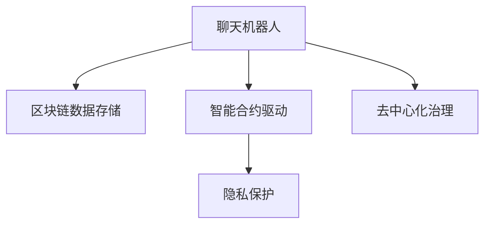

                 

# 聊天机器人区块链：安全和去中心化应用

> 关键词：聊天机器人,区块链,安全,去中心化,智能合约,隐私保护

## 1. 背景介绍

### 1.1 问题由来
随着人工智能和区块链技术的快速发展，区块链技术正逐渐渗透到各个行业，而聊天机器人则以其智能交互和高效服务的优势，在医疗、教育、客服等领域得到广泛应用。然而，传统聊天机器人面临中心化存储、数据隐私、服务可靠性等诸多挑战。通过区块链技术，可以实现聊天机器人的去中心化、可追溯和安全性，提升其在实际应用中的价值。

### 1.2 问题核心关键点
聊天机器人区块链的核心目标在于将区块链的去中心化、安全性和智能合约特性与聊天机器人进行有机融合，实现数据安全存储、用户隐私保护和智能合约驱动的自动服务。其核心技术包括：

1. **区块链数据存储**：利用区块链的不可篡改和分布式特性，实现聊天机器人聊天记录的分布式存储。
2. **智能合约驱动**：使用智能合约编写聊天机器人的业务逻辑，实现自动化的服务和流程控制。
3. **隐私保护**：采用零知识证明和同态加密等技术，确保聊天过程中用户的隐私数据不被泄露。
4. **去中心化治理**：通过区块链机制，实现聊天机器人的去中心化管理和治理。

这些关键技术共同构成了聊天机器人区块链的核心，使其能够更好地适应分布式和隐私需求强的应用场景。

### 1.3 问题研究意义
聊天机器人区块链技术的开发，对于提升聊天机器人的可靠性和安全性，保护用户隐私，实现去中心化的自动化服务，具有重要意义：

1. **提升可靠性**：区块链的去中心化和冗余机制，确保了聊天机器人服务的稳定性和可靠性，避免了单点故障。
2. **增强隐私保护**：通过加密和隐私保护技术，确保用户的聊天记录和个人信息安全，保护用户隐私。
3. **实现自动化**：智能合约的自动执行能力，实现了聊天机器人的自动化服务和流程控制，提升了用户体验。
4. **促进去中心化**：区块链的分布式机制，实现了聊天机器人服务的去中心化治理，提升了系统的透明性和公信力。

## 2. 核心概念与联系

### 2.1 核心概念概述

为更好地理解聊天机器人区块链的核心技术，本节将介绍几个密切相关的核心概念：

- **聊天机器人(Chatbot)**：基于自然语言处理(NLP)和人工智能技术，通过模拟人类对话，实现人机交互的智能系统。
- **区块链(Blockchain)**：一种去中心化的分布式账本技术，通过加密哈希和共识机制，确保数据的安全性和不可篡改性。
- **智能合约(Smart Contract)**：基于区块链技术的自动化合约，通过代码实现业务逻辑和合约条款，具有自动执行和监控的功能。
- **隐私保护**：采用加密和隐私保护技术，保护用户的隐私数据，确保其不被未授权访问。
- **去中心化治理**：通过区块链的共识机制，实现分布式自治和治理，提升系统的透明性和公信力。

这些核心概念之间的逻辑关系可以通过以下Mermaid流程图来展示：



这个流程图展示了几者之间的相互关系：

1. 聊天机器人通过区块链数据存储技术，实现聊天记录的分布式存储。
2. 聊天机器人使用智能合约技术，实现业务逻辑的自动化和流程控制。
3. 聊天机器人采用隐私保护技术，确保用户数据的安全性。
4. 聊天机器人利用去中心化治理机制，实现系统的透明性和公信力。

## 3. 核心算法原理 & 具体操作步骤
### 3.1 算法原理概述

聊天机器人区块链的原理可以概括为通过区块链技术，将聊天机器人集成到分布式和去中心化的体系中，确保数据的安全性和智能合约的自动执行，提升聊天机器人的可靠性和用户体验。

具体而言，聊天机器人区块链的算法原理包括：

1. **区块链数据存储**：采用分布式账本技术，实现聊天机器人聊天记录的不可篡改和分布式存储。
2. **智能合约驱动**：通过智能合约编写聊天机器人的业务逻辑，实现自动化服务和流程控制。
3. **隐私保护**：采用加密和隐私保护技术，保护用户数据的安全性。
4. **去中心化治理**：利用区块链的共识机制，实现聊天机器人的去中心化管理和治理。

### 3.2 算法步骤详解

聊天机器人区块链的核心算法步骤包括：

**Step 1: 准备区块链网络**
- 搭建区块链网络，选择合适的共识算法（如PoW、PoS、DPoS等），并部署节点。
- 设计并实施智能合约模板，确保其符合聊天机器人的业务需求。

**Step 2: 设计聊天机器人应用**
- 根据实际应用场景，设计聊天机器人的业务逻辑和服务流程。
- 将业务逻辑编写为智能合约，确保其自动执行和监控。

**Step 3: 集成隐私保护技术**
- 采用零知识证明和同态加密等技术，保护用户隐私数据。
- 确保聊天机器人聊天记录的安全存储和传输。

**Step 4: 实施去中心化治理**
- 通过区块链共识机制，实现聊天机器人的去中心化管理和治理。
- 设计合理的激励机制，确保节点之间的协作和信任。

**Step 5: 启动区块链网络**
- 启动区块链网络，确保所有节点同步区块链数据。
- 部署聊天机器人应用，并进行初次验证。

**Step 6: 用户交互与数据记录**
- 用户通过聊天机器人进行交互，聊天内容自动记录并上传区块链。
- 智能合约根据聊天内容执行相应的逻辑，自动生成服务响应。

**Step 7: 系统维护与更新**
- 定期对区块链网络和聊天机器人应用进行维护和更新，确保系统的稳定性和安全性。
- 根据用户反馈和需求，动态调整智能合约逻辑和服务流程。

### 3.3 算法优缺点

聊天机器人区块链具有以下优点：

1. **分布式存储**：确保数据的安全性和不可篡改性，防止单点故障和数据泄露。
2. **自动化执行**：通过智能合约实现自动化服务，提升用户体验和效率。
3. **去中心化治理**：通过区块链共识机制，提升系统的透明性和公信力。
4. **隐私保护**：采用加密和隐私保护技术，确保用户数据的安全性。

然而，聊天机器人区块链也存在一些局限性：

1. **性能瓶颈**：由于区块链的共识机制和分布式特性，可能会导致交易速度较慢，影响用户体验。
2. **技术复杂性**：需要同时掌握区块链和聊天机器人技术，技术门槛较高。
3. **部署成本**：搭建和维护区块链网络，需要一定的硬件和软件资源，成本较高。
4. **扩展性问题**：随着用户规模的扩大，如何扩展区块链网络，确保系统的可扩展性，是一个重要挑战。

尽管存在这些局限性，但聊天机器人区块链作为一种前沿技术，其潜在的价值和应用前景仍然值得深入探索。

### 3.4 算法应用领域

聊天机器人区块链技术已经在多个领域得到应用，例如：

- **医疗咨询**：通过区块链记录患者病历和聊天记录，确保数据安全，同时采用智能合约驱动的诊疗流程。
- **在线教育**：利用区块链存储学生学习记录和聊天互动，实现去中心化的自动化评估和学习过程控制。
- **智能客服**：通过区块链分布式存储客户聊天记录，防止数据泄露，同时使用智能合约实现自动化的服务响应。
- **金融服务**：采用区块链存储用户交易记录和聊天记录，确保数据安全，并使用智能合约驱动的自动化理财和交易服务。
- **社会治理**：利用区块链记录政府与民众的互动，确保信息透明和公正，同时采用智能合约驱动的公共服务流程。

## 4. 数学模型和公式 & 详细讲解 & 举例说明

### 4.1 数学模型构建

聊天机器人区块链的核心数学模型包括区块链数据存储、智能合约执行、隐私保护和去中心化治理等方面。

**区块链数据存储**：
- 采用分布式账本技术，每个节点维护一个完整的区块链记录。
- 使用加密哈希函数将数据块链接起来，确保数据的不可篡改性。

**智能合约执行**：
- 通过编程语言编写智能合约，定义其执行条件和逻辑。
- 智能合约的执行依赖于区块链网络中的共识机制。

**隐私保护**：
- 采用零知识证明技术，确保用户数据的安全性和隐私性。
- 使用同态加密技术，在加密状态下进行数据处理。

**去中心化治理**：
- 设计并实施共识算法，确保节点之间的信任和协作。
- 采用激励机制，鼓励节点参与共识过程。

### 4.2 公式推导过程

以智能合约驱动的聊天机器人服务为例，推导智能合约的执行过程。

假设智能合约的执行条件为：当用户输入特定关键词时，自动回复预定义的消息。则智能合约的执行过程如下：

1. 用户在聊天机器人中发送消息，触发智能合约的执行条件。
2. 智能合约根据执行条件，读取聊天内容。
3. 智能合约判断聊天内容是否满足执行条件，执行相应的逻辑。
4. 智能合约生成自动回复，发送给用户。

智能合约的执行过程可以用伪代码表示为：

```python
def chatbot_service(msg):
    # 读取聊天内容
    content = msg.get('content')
    
    # 判断是否满足执行条件
    if content in ['关键词1', '关键词2']:
        # 执行智能合约
        response = '自动回复'
        send_response(response)
    
    # 返回执行结果
    return '执行结果'
```

通过上述伪代码，可以看出智能合约的执行过程主要涉及条件判断和自动回复生成两部分。

### 4.3 案例分析与讲解

**案例一：智能合约驱动的在线教育**
- 设计智能合约，记录学生的学习进度和成绩。
- 当学生达到一定的学习时长或成绩标准时，自动授予相应的证书。
- 学生与教师之间的互动记录也通过智能合约存储，确保数据的安全性和透明性。

**案例二：区块链驱动的医疗咨询**
- 采用区块链存储患者的病历和咨询记录，确保数据的安全性和不可篡改性。
- 医生通过智能合约驱动的诊疗流程，自动更新病历记录，生成诊断报告。
- 患者可以通过区块链查看自己的病历记录，确保数据透明和信任。

这些案例展示了聊天机器人区块链在不同领域的应用，通过智能合约的驱动，实现了自动化的服务流程和数据存储，提升了系统的效率和安全性。

## 5. 项目实践：代码实例和详细解释说明
### 5.1 开发环境搭建

在进行聊天机器人区块链项目实践前，我们需要准备好开发环境。以下是使用Python和以太坊智能合约语言Solidity进行开发的流程：

1. 安装Node.js和npm：从官网下载并安装Node.js和npm，用于开发环境搭建。
2. 安装以太坊工具：安装Ganache或Alchemy等以太坊本地或云端的测试网络工具，用于测试智能合约。
3. 安装Solidity编译器和Truffle框架：通过npm安装Solidity编译器和Truffle框架，用于智能合约的开发和部署。
4. 安装Python开发环境：安装Python和相关库，如Web3.py、IPython等，用于与区块链网络的交互。

完成上述步骤后，即可在本地搭建开发环境，进行智能合约的开发和测试。

### 5.2 源代码详细实现

以下是一个简单的聊天机器人智能合约示例，用于展示智能合约的实现和功能：

```solidity
// SPDX-License-Identifier: MIT
pragma solidity ^0.8.0;

contract Chatbot {
    struct ChatRecord {
        string message;
        uint timestamp;
    }
    
    mapping(uint256 => ChatRecord[]) chatRecords;
    
    event MessageReceived(uint256 chatId, string message);
    
    function addChatRecord(uint256 chatId, string memory message) public {
        ChatRecord memory record;
        record.message = message;
        record.timestamp = block.timestamp;
        chatRecords[chatId].push(record);
        emit MessageReceived(chatId, message);
    }
    
    function getChatRecords(uint256 chatId) public view returns (ChatRecord[] memory) {
        return chatRecords[chatId];
    }
    
    function getLastChatRecord(uint256 chatId) public view returns (ChatRecord memory) {
        require(chatId > 0, "Chat ID cannot be zero");
        ChatRecord memory record;
        ChatRecord[] memory records = chatRecords[chatId];
        record = records[records.length - 1];
        return record;
    }
}
```

### 5.3 代码解读与分析

让我们再详细解读一下关键代码的实现细节：

**Chatbot结构体**：
- 定义了一个ChatRecord结构体，用于存储聊天记录。
- 包含消息内容和记录时间戳，便于查询和管理。

**chatRecords映射**：
- 使用mapping类型定义了一个chatRecords映射，用于存储不同聊天ID的聊天记录。
- 每个聊天记录是一组ChatRecord类型的数组。

**addChatRecord函数**：
- 添加一条新的聊天记录，记录消息内容和时间戳，并发射一个MessageReceived事件。
- 事件可以用于触发用户界面或其他系统的更新。

**getChatRecords函数**：
- 根据聊天ID获取所有聊天记录，返回一个ChatRecord类型的数组。
- 用于查看所有聊天内容，支持对聊天记录进行排序和过滤。

**getLastChatRecord函数**：
- 获取最新的聊天记录，用于展示最近的聊天记录。
- 返回一个ChatRecord类型的对象，包含消息内容和时间戳。

**智能合约部署**：
- 编译智能合约，使用Truffle框架进行部署，连接到Ganache或Alchemy等测试网络。
- 通过智能合约接口进行聊天记录的添加和查询，验证其功能和正确性。

以上代码实现了一个基本的聊天机器人智能合约，用户可以通过添加和查询聊天记录，实现基本的聊天功能。

## 6. 实际应用场景

### 6.1 智能客服系统
聊天机器人区块链技术在智能客服系统中具有广阔的应用前景。通过区块链分布式存储和智能合约驱动，可以实现聊天记录的安全存储和自动服务流程，提升客服系统的效率和可靠性。

具体实现上，可以设计一个基于智能合约的客服系统，记录用户与客服的互动记录，确保数据的安全性和不可篡改性。同时，利用智能合约编写自动客服服务流程，实现自动化的响应和处理，提升客服的效率和质量。

### 6.2 在线教育平台
在线教育平台可以通过聊天机器人区块链技术，实现学生的学习记录和成绩管理，确保数据的安全性和透明性。

具体实现上，可以设计一个基于智能合约的在线教育平台，记录学生的学习进度和成绩，确保数据的不可篡改性。同时，利用智能合约驱动的自动化评估和学习流程，实现自动化的成绩评定和课程推荐，提升教育的效果和效率。

### 6.3 医疗健康系统
医疗健康系统可以通过聊天机器人区块链技术，记录患者的病历和咨询记录，确保数据的安全性和隐私性。

具体实现上，可以设计一个基于智能合约的医疗健康系统，记录患者的病历和咨询记录，确保数据的不可篡改性和隐私保护。同时，利用智能合约驱动的诊疗流程，实现自动化的诊断和治疗记录，提升医疗服务的效率和质量。

## 7. 工具和资源推荐

### 7.1 学习资源推荐

为了帮助开发者掌握聊天机器人区块链技术，以下是几款优质的学习资源：

1. 《智能合约与区块链应用开发实战》书籍：详细介绍了智能合约的编写、部署和测试流程，提供了大量的实际案例和项目实践。
2. 《区块链技术与应用》课程：清华大学开设的区块链课程，涵盖区块链的基本概念和核心技术，适合初学者入门。
3. 《去中心化应用开发指南》书籍：全面介绍了去中心化应用开发的流程和技术细节，提供了一系列的实用开发工具和资源。
4. CryptoZombies：一款互动式的区块链开发平台，通过实战项目帮助开发者掌握智能合约的开发和部署。
5. Web3.dev：一个综合性的区块链开发平台，提供大量的学习资源和工具，支持智能合约的开发、测试和部署。

通过对这些资源的学习实践，相信你一定能够快速掌握聊天机器人区块链技术的核心内容，并应用于实际项目中。

### 7.2 开发工具推荐

高效的开发离不开优秀的工具支持。以下是几款用于聊天机器人区块链开发的常用工具：

1. Ganache：以太坊本地测试网络，方便开发者进行智能合约的测试和调试。
2. Alchemy：以太坊云测试网络，支持智能合约的快速部署和测试。
3. Truffle：基于Solidity的智能合约开发框架，提供丰富的开发工具和插件，支持智能合约的编写、测试和部署。
4. Web3.py：Python的区块链开发库，支持以太坊和多种其他区块链平台，方便开发者与区块链网络的交互。
5. IPython：Python的交互式开发环境，支持智能合约的调试和测试，提供丰富的开发工具和库。

合理利用这些工具，可以显著提升聊天机器人区块链项目的开发效率，加快创新迭代的步伐。

### 7.3 相关论文推荐

聊天机器人区块链技术的发展源于学界的持续研究。以下是几篇奠基性的相关论文，推荐阅读：

1. Ethereum Yellow Paper：以太坊白皮书，详细介绍了以太坊的区块链和智能合约技术，奠定了智能合约开发的理论基础。
2. Decentralized Identity on the Blockchain: Designing for Identity-Based Access Control：提出了区块链上的去中心化身份认证机制，为聊天机器人区块链的隐私保护提供了新的思路。
3. Augmented Reality and Blockchain for Crowdsourced Information Aggregation and Verification：提出了区块链与增强现实相结合的信息聚合和验证机制，为聊天机器人区块链的分布式数据存储提供了新的方法。
4. Blockchain-based Decentralized AI Model Training and Inference：介绍了区块链上的去中心化AI模型训练和推理机制，为聊天机器人区块链的自动化服务提供了新的实现方式。

这些论文代表了大语言模型微调技术的发展脉络。通过学习这些前沿成果，可以帮助研究者把握学科前进方向，激发更多的创新灵感。

## 8. 总结：未来发展趋势与挑战

### 8.1 总结

本文对聊天机器人区块链技术进行了全面系统的介绍。首先阐述了聊天机器人区块链技术的背景和意义，明确了其对于提升聊天机器人可靠性和安全性，保护用户隐私，实现去中心化自动服务的重要价值。其次，从原理到实践，详细讲解了聊天机器人区块链的核心算法和操作步骤，提供了完整的智能合约代码实例。同时，本文还探讨了聊天机器人区块链在智能客服、在线教育、医疗健康等诸多领域的应用前景，展示了其巨大的潜力。

通过本文的系统梳理，可以看到，聊天机器人区块链技术正在成为NLP领域的重要范式，极大地拓展了聊天机器人的应用边界，催生了更多的落地场景。得益于区块链的去中心化、安全性和智能合约特性，聊天机器人区块链必将在未来得到更广泛的应用，为人工智能技术落地提供新的思路。

### 8.2 未来发展趋势

展望未来，聊天机器人区块链技术将呈现以下几个发展趋势：

1. **分布式存储**：随着用户规模的扩大，如何扩展区块链网络，确保系统的可扩展性，是一个重要挑战。未来将探索更高效的分布式存储方案，提升系统的存储和处理能力。
2. **智能合约优化**：通过引入更高级的编程语言和工具，优化智能合约的执行效率，提升系统的响应速度和可靠性。
3. **隐私保护**：采用更先进的隐私保护技术，如零知识证明、同态加密等，确保用户数据的隐私性和安全性。
4. **去中心化治理**：设计更合理和高效的共识机制，确保聊天机器人区块链的公平和透明，提升系统的公信力和可信度。
5. **跨链通信**：探索跨区块链通信技术，实现不同区块链网络之间的数据交互和协同，拓展系统的应用范围。
6. **业务集成**：将聊天机器人区块链技术与大数据、云计算、物联网等技术进行深度融合，提升系统的综合性能和应用价值。

以上趋势凸显了聊天机器人区块链技术的广阔前景。这些方向的探索发展，必将进一步提升聊天机器人区块链系统的性能和应用范围，为人工智能技术落地提供新的思路。

### 8.3 面临的挑战

尽管聊天机器人区块链技术已经取得了初步成果，但在迈向更加智能化、普适化应用的过程中，仍面临诸多挑战：

1. **技术复杂性**：聊天机器人区块链技术需要同时掌握区块链和聊天机器人技术，技术门槛较高。
2. **性能瓶颈**：区块链的共识机制和分布式特性，可能导致交易速度较慢，影响用户体验。
3. **部署成本**：搭建和维护区块链网络，需要一定的硬件和软件资源，成本较高。
4. **扩展性问题**：如何扩展区块链网络，确保系统的可扩展性，是一个重要挑战。
5. **隐私保护**：采用更先进的隐私保护技术，确保用户数据的隐私性和安全性。
6. **跨链通信**：实现不同区块链网络之间的数据交互和协同，是一个重要挑战。

尽管存在这些挑战，但聊天机器人区块链技术的潜在的价值和应用前景仍然值得深入探索。

### 8.4 研究展望

面对聊天机器人区块链技术所面临的挑战，未来的研究需要在以下几个方面寻求新的突破：

1. **分布式存储优化**：探索更高效的分布式存储方案，提升系统的存储和处理能力。
2. **智能合约优化**：引入更高级的编程语言和工具，优化智能合约的执行效率，提升系统的响应速度和可靠性。
3. **隐私保护技术**：采用更先进的隐私保护技术，确保用户数据的隐私性和安全性。
4. **去中心化治理**：设计更合理和高效的共识机制，确保聊天机器人区块链的公平和透明，提升系统的公信力和可信度。
5. **跨链通信**：实现不同区块链网络之间的数据交互和协同，拓展系统的应用范围。
6. **业务集成**：将聊天机器人区块链技术与大数据、云计算、物联网等技术进行深度融合，提升系统的综合性能和应用价值。

这些研究方向的探索，必将引领聊天机器人区块链技术迈向更高的台阶，为构建安全、可靠、可解释、可控的智能系统铺平道路。面向未来，聊天机器人区块链技术还需要与其他人工智能技术进行更深入的融合，如知识表示、因果推理、强化学习等，多路径协同发力，共同推动自然语言理解和智能交互系统的进步。只有勇于创新、敢于突破，才能不断拓展聊天机器人区块链的边界，让智能技术更好地造福人类社会。

## 9. 附录：常见问题与解答

**Q1：聊天机器人区块链技术的主要优势是什么？**

A: 聊天机器人区块链技术的主要优势包括：

1. **分布式存储**：确保数据的安全性和不可篡改性，防止单点故障和数据泄露。
2. **自动化执行**：通过智能合约实现自动化服务，提升用户体验和效率。
3. **去中心化治理**：通过区块链共识机制，提升系统的透明性和公信力。
4. **隐私保护**：采用加密和隐私保护技术，确保用户数据的安全性。

**Q2：如何实现聊天机器人区块链的去中心化治理？**

A: 聊天机器人区块链的去中心化治理主要通过区块链共识机制实现。常见的共识机制包括PoW、PoS、DPoS等。

具体实现上，可以采用共识算法（如PoW或PoS）来确保节点之间的信任和协作。同时，设计合理的激励机制，鼓励节点参与共识过程。通过智能合约，实现去中心化的管理和治理，确保系统的透明性和公信力。

**Q3：聊天机器人区块链技术的局限性有哪些？**

A: 聊天机器人区块链技术的局限性包括：

1. **技术复杂性**：需要同时掌握区块链和聊天机器人技术，技术门槛较高。
2. **性能瓶颈**：区块链的共识机制和分布式特性，可能导致交易速度较慢，影响用户体验。
3. **部署成本**：搭建和维护区块链网络，需要一定的硬件和软件资源，成本较高。
4. **扩展性问题**：如何扩展区块链网络，确保系统的可扩展性，是一个重要挑战。
5. **隐私保护**：采用更先进的隐私保护技术，确保用户数据的隐私性和安全性。
6. **跨链通信**：实现不同区块链网络之间的数据交互和协同，是一个重要挑战。

**Q4：如何提高聊天机器人区块链系统的扩展性？**

A: 提高聊天机器人区块链系统的扩展性可以从以下几个方面入手：

1. **分布式存储优化**：采用更高效的分布式存储方案，如共识驱动的分布式账本、分级存储等，提升系统的存储和处理能力。
2. **智能合约优化**：引入更高级的编程语言和工具，优化智能合约的执行效率，提升系统的响应速度和可靠性。
3. **共识机制改进**：设计更高效的共识机制，如PoS、DPoS等，减少共识过程中的资源消耗，提升系统的扩展性。
4. **跨链通信技术**：探索跨链通信技术，实现不同区块链网络之间的数据交互和协同，拓展系统的应用范围。
5. **业务集成**：将聊天机器人区块链技术与大数据、云计算、物联网等技术进行深度融合，提升系统的综合性能和应用价值。

这些措施可以有效地提高聊天机器人区块链系统的扩展性，确保其能够应对不断增长的用户需求和数据量。

**Q5：如何在聊天机器人区块链系统中实现隐私保护？**

A: 在聊天机器人区块链系统中实现隐私保护，主要通过以下几种方式：

1. **零知识证明**：采用零知识证明技术，确保用户数据的安全性和隐私性。
2. **同态加密**：使用同态加密技术，在加密状态下进行数据处理，确保数据的隐私保护。
3. **匿名化处理**：采用匿名化处理技术，确保用户的个人信息不被泄露。
4. **去中心化数据存储**：利用区块链分布式存储的特性，确保数据的不可篡改性和去中心化存储，提升系统的安全性和隐私保护能力。

通过以上措施，可以有效地保护用户数据的隐私性和安全性，确保聊天机器人区块链系统的安全性和可信度。

**Q6：聊天机器人区块链技术在实际应用中需要注意哪些问题？**

A: 聊天机器人区块链技术在实际应用中需要注意以下几个问题：

1. **系统安全性**：确保聊天机器人区块链系统的安全性和稳定性，防止攻击和数据泄露。
2. **用户体验**：优化聊天机器人的用户体验，确保其响应速度快、操作简便。
3. **隐私保护**：采用先进的隐私保护技术，确保用户数据的隐私性和安全性。
4. **技术复杂性**：掌握区块链和聊天机器人技术，提升系统的可靠性。
5. **扩展性**：确保系统的可扩展性，能够应对不断增长的用户需求和数据量。
6. **跨链通信**：实现不同区块链网络之间的数据交互和协同，拓展系统的应用范围。

这些问题的解决将有助于聊天机器人区块链技术在实际应用中的落地和推广。

---

作者：禅与计算机程序设计艺术 / Zen and the Art of Computer Programming

