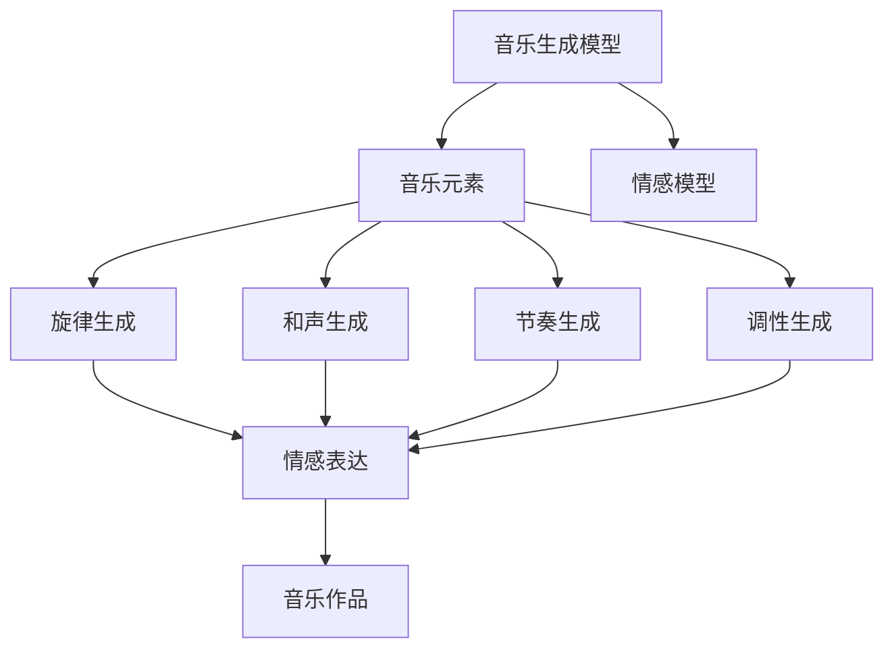

                 

## 1. 背景介绍

在AI迅猛发展的今天，人工智能不仅在语言、视觉、自然语言处理等领域取得了显著进展，音乐创作和编辑也渐渐开始引入AI。音乐创作是一个既包含创造性思维又包含对音乐理论深度理解的复杂过程。传统音乐创作需要深厚的音乐素养和大量实践经验，人工智能的介入可以帮助创作者更好地理解音乐结构、旋律、节奏等要素，提供有创意的灵感支持。

### 1.1 问题由来

随着深度学习的发展，神经网络已经能够进行自动作曲，利用音乐生成模型生成新颖且富有创意的曲子。当前的AI作曲技术主要基于以下几种技术：

1. **序列生成模型（如RNN、Transformer）**：这些模型通过分析已有的音乐数据，学习音乐元素间的依赖关系，生成连续的音符序列，从而创作出新的音乐作品。
2. **对抗生成网络（GAN）**：这类模型通过两个网络互相博弈，生成更加多样化的音乐，模拟自然音乐风格，提升作曲的创造性。
3. **变分自编码器（VAE）**：利用生成模型捕获音乐的结构特性，生成有连贯性和多样性的音乐。
4. **基于注意力的模型**：通过注意力机制，强化音乐中的不同元素之间的关系，提高音乐的连贯性和层次性。

这些技术通过学习音乐的历史数据，尝试重建音乐创作的内在规律，以生成新的音乐作品。这些技术在音乐创作中的应用正在逐步扩大，音乐创作和编曲等任务正变得更为高效和创新。

### 1.2 问题核心关键点

音乐创作涉及多个核心要素，包括旋律、和声、节奏、调性等。AI在音乐创作中的目标是通过学习大量的音乐数据，捕捉音乐元素之间的关系，生成有连贯性和情感表达的音乐作品。

1. **音乐结构与形式**：传统音乐作品具有一定的结构和形式，如主调与副调、引子与结尾等。AI作曲需要识别并遵守这些形式，生成结构合理、形式完善的作品。
2. **旋律与和声**：旋律是音乐中最具表现力的元素，和声则定义了音乐的情感与色彩。AI作曲需要捕捉旋律的起伏和和声的转换，生成富有表现力的作品。
3. **节奏与节拍**：节奏与节拍是音乐的基本框架，AI作曲需要理解和应用不同的节奏与节拍模式，确保音乐作品具有合理的节奏感。
4. **调性与调式**：调性与调式决定了音乐作品的情感色彩，AI作曲需要选择合适的调性与调式，增强作品的表现力。
5. **音乐情感表达**：音乐情感表达是音乐创作中的关键要素，AI作曲需要根据不同的情感需求生成相应的音乐。

## 2. 核心概念与联系

### 2.1 核心概念概述

在AI音乐创作领域，存在多个核心概念，包括音乐生成模型、音乐元素、情感模型、生成过程等。这些概念的联系可以通过以下Mermaid流程图来展示：



这个流程图展示了音乐生成模型的生成过程：

1. 音乐生成模型从音乐元素（旋律、和声、节奏、调性等）和情感模型中获取信息。
2. 这些元素和情感模型共同指导旋律、和声、节奏和调性的生成。
3. 生成的音乐元素被整合成为音乐作品，并表达出特定的情感。

### 2.2 核心概念原理和架构

音乐生成模型的核心原理基于神经网络。以RNN和Transformer为例，其架构如下：

#### RNN模型
```mermaid
graph LR
    A[输入层] --> B[隐藏层] --> C[输出层]
    B -->|LSTM| B
    B -->|GRU| B
    B -->|LSTM| B
    B -->|GRU| B
    B -->|LSTM| B
    B -->|GRU| B
    B -->|LSTM| B
    B -->|GRU| B
    B -->|LSTM| B
    B -->|GRU| B
    B -->|LSTM| B
    B -->|GRU| B
    B -->|LSTM| B
    B -->|GRU| B
    B -->|LSTM| B
    B -->|GRU| B
    B -->|LSTM| B
    B -->|GRU| B
    B -->|LSTM| B
    B -->|GRU| B
    B -->|LSTM| B
    B -->|GRU| B
    B -->|LSTM| B
    B -->|GRU| B
    B -->|LSTM| B
    B -->|GRU| B
    B -->|LSTM| B
    B -->|GRU| B
    B -->|LSTM| B
    B -->|GRU| B
    B -->|LSTM| B
    B -->|GRU| B
    B -->|LSTM| B
    B -->|GRU| B
    B -->|LSTM| B
    B -->|GRU| B
    B -->|LSTM| B
    B -->|GRU| B
    B -->|LSTM| B
    B -->|GRU| B
    B -->|LSTM| B
    B -->|GRU| B
    B -->|LSTM| B
    B -->|GRU| B
    B -->|LSTM| B
    B -->|GRU| B
    B -->|LSTM| B
    B -->|GRU| B
    B -->|LSTM| B
    B -->|GRU| B
    B -->|LSTM| B
    B -->|GRU| B
    B -->|LSTM| B
    B -->|GRU| B
    B -->|LSTM| B
    B -->|GRU| B
    B -->|LSTM| B
    B -->|GRU| B
    B -->|LSTM| B
    B -->|GRU| B
    B -->|LSTM| B
    B -->|GRU| B
    B -->|LSTM| B
    B -->|GRU| B
    B -->|LSTM| B
    B -->|GRU| B
    B -->|LSTM| B
    B -->|GRU| B
    B -->|LSTM| B
    B -->|GRU| B
    B -->|LSTM| B
    B -->|GRU| B
    B -->|LSTM| B
    B -->|GRU| B
    B -->|LSTM| B
    B -->|GRU| B
    B -->|LSTM| B
    B -->|GRU| B
    B -->|LSTM| B
    B -->|GRU| B
    B -->|LSTM| B
    B -->|GRU| B
    B -->|LSTM| B
    B -->|GRU| B
    B -->|LSTM| B
    B -->|GRU| B
    B -->|LSTM| B
    B -->|GRU| B
    B -->|LSTM| B
    B -->|GRU| B
    B -->|LSTM| B
    B -->|GRU| B
    B -->|LSTM| B
    B -->|GRU| B
    B -->|LSTM| B
    B -->|GRU| B
    B -->|LSTM| B
    B -->|GRU| B
    B -->|LSTM| B
    B -->|GRU| B
    B -->|LSTM| B
    B -->|GRU| B
    B -->|LSTM| B
    B -->|GRU| B
    B -->|LSTM| B
    B -->|GRU| B
    B -->|LSTM| B
    B -->|GRU| B
    B -->|LSTM| B
    B -->|GRU| B
    B -->|LSTM| B
    B -->|GRU| B
    B -->|LSTM| B
    B -->|GRU| B
    B -->|LSTM| B
    B -->|GRU| B
    B -->|LSTM| B
    B -->|GRU| B
    B -->|LSTM| B
    B -->|GRU| B
    B -->|LSTM| B
    B -->|GRU| B
    B -->|LSTM| B
    B -->|GRU| B
    B -->|LSTM| B
    B -->|GRU| B
    B -->|LSTM| B
    B -->|GRU| B
    B -->|LSTM| B
    B -->|GRU| B
    B -->|LSTM| B
    B -->|GRU| B
    B -->|LSTM| B
    B -->|GRU| B
    B -->|LSTM| B
    B -->|GRU| B
    B -->|LSTM| B
    B -->|GRU| B
    B -->|LSTM| B
    B -->|GRU| B
    B -->|LSTM| B
    B -->|GRU| B
    B -->|LSTM| B
    B -->|GRU| B
    B -->|LSTM| B
    B -->|GRU| B
    B -->|LSTM| B
    B -->|GRU| B
    B -->|LSTM| B
    B -->|GRU| B
    B -->|LSTM| B
    B -->|GRU| B
    B -->|LSTM| B
    B -->|GRU| B
    B -->|LSTM| B
    B -->|GRU| B
    B -->|LSTM| B
    B -->|GRU| B
    B -->|LSTM| B
    B -->|GRU| B
    B -->|LSTM| B
    B -->|GRU| B
    B -->|LSTM| B
    B -->|GRU| B
    B -->|LSTM| B
    B -->|GRU| B
    B -->|LSTM| B
    B -->|GRU| B
    B -->|LSTM| B
    B -->|GRU| B
    B -->|LSTM| B
    B -->|GRU| B
    B -->|LSTM| B
    B -->|GRU| B
    B -->|LSTM| B
    B -->|GRU| B
    B -->|LSTM| B
    B -->|GRU| B
    B -->|LSTM| B
    B -->|GRU| B
    B -->|LSTM| B
    B -->|GRU| B
    B -->|LSTM| B
    B -->|GRU| B
    B -->|LSTM| B
    B -->|GRU| B
    B -->|LSTM| B
    B -->|GRU| B
    B -->|LSTM| B
    B -->|GRU| B
    B -->|LSTM| B
    B -->|GRU| B
    B -->|LSTM| B
    B -->|GRU| B
    B -->|LSTM| B
    B -->|GRU| B
    B -->|LSTM| B
    B -->|GRU| B
    B -->|LSTM| B
    B -->|GRU| B
    B -->|LSTM| B
    B -->|GRU| B
    B -->|LSTM| B
    B -->|GRU| B
    B -->|LSTM| B
    B -->|GRU| B
    B -->|LSTM| B
    B -->|GRU| B
    B -->|LSTM| B
    B -->|GRU| B
    B -->|LSTM| B
    B -->|GRU| B
    B -->|LSTM| B
    B -->|GRU| B
    B -->|LSTM| B
    B -->|GRU| B
    B -->|LSTM| B
    B -->|GRU| B
    B -->|LSTM| B
    B -->|GRU| B
    B -->|LSTM| B
    B -->|GRU| B
    B -->|LSTM| B
    B -->|GRU| B
    B -->|LSTM| B
    B -->|GRU| B
    B -->|LSTM| B
    B -->|GRU| B
    B -->|LSTM| B
    B -->|GRU| B
    B -->|LSTM| B
    B -->|GRU| B
    B -->|LSTM| B
    B -->|GRU| B
    B -->|LSTM| B
    B -->|GRU| B
    B -->|LSTM| B
    B -->|GRU| B
    B -->|LSTM| B
    B -->|GRU| B
    B -->|LSTM| B
    B -->|GRU| B
    B -->|LSTM| B
    B -->|GRU| B
    B -->|LSTM| B
    B -->|GRU| B
    B -->|LSTM| B
    B -->|GRU| B
    B -->|LSTM| B
    B -->|GRU| B
    B -->|LSTM| B
    B -->|GRU| B
    B -->|LSTM| B
    B -->|GRU| B
    B -->|LSTM| B
    B -->|GRU| B
    B -->|LSTM| B
    B -->|GRU| B
    B -->|LSTM| B
    B -->|GRU| B
    B -->|LSTM| B
    B -->|GRU| B
    B -->|LSTM| B
    B -->|GRU| B
    B -->|LSTM| B
    B -->|GRU| B
    B -->|LSTM| B
    B -->|GRU| B
    B -->|LSTM| B
    B -->|GRU| B
    B -->|LSTM| B
    B -->|GRU| B
    B -->|LSTM| B
    B -->|GRU| B
    B -->|LSTM| B
    B -->|GRU| B
    B -->|LSTM| B
    B -->|GRU| B
    B -->|LSTM| B
    B -->|GRU| B
    B -->|LSTM| B
    B -->|GRU| B
    B -->|LSTM| B
    B -->|GRU| B
    B -->|LSTM| B
    B -->|GRU| B
    B -->|LSTM| B
    B -->|GRU| B
    B -->|LSTM| B
    B -->|GRU| B
    B -->|LSTM| B
    B -->|GRU| B
    B -->|LSTM| B
    B -->|GRU| B
    B -->|LSTM| B
    B -->|GRU| B
    B -->|LSTM| B
    B -->|GRU| B
    B -->|LSTM| B
    B -->|GRU| B
    B -->|LSTM| B
    B -->|GRU| B
    B -->|LSTM| B
    B -->|GRU| B
    B -->|LSTM| B
    B -->|GRU| B
    B -->|LSTM| B
    B -->|GRU| B
    B -->|LSTM| B
    B -->|GRU| B
    B -->|LSTM| B
    B -->|GRU| B
    B -->|LSTM| B
    B -->|GRU| B
    B -->|LSTM| B
    B -->|GRU| B
    B -->|LSTM| B
    B -->|GRU| B
    B -->|LSTM| B
    B -->|GRU| B
    B -->|LSTM| B
    B -->|GRU| B
    B -->|LSTM| B
    B -->|GRU| B
    B -->|LSTM| B
    B -->|GRU| B
    B -->|LSTM| B
    B -->|GRU| B
    B -->|LSTM| B
    B -->|GRU| B
    B -->|LSTM| B
    B -->|GRU| B
    B -->|LSTM| B
    B -->|GRU| B
    B -->|LSTM| B
    B -->|GRU| B
    B -->|LSTM| B
    B -->|GRU| B
    B -->|LSTM| B
    B -->|GRU| B
    B -->|LSTM| B
    B -->|GRU| B
    B -->|LSTM| B
    B -->|GRU| B
    B -->|LSTM| B
    B -->|GRU| B
    B -->|LSTM| B
    B -->|GRU| B
    B -->|LSTM| B
    B -->|GRU| B
    B -->|LSTM| B
    B -->|GRU| B
    B -->|LSTM| B
    B -->|GRU| B
    B -->|LSTM| B
    B -->|GRU| B
    B -->|LSTM| B
    B -->|GRU| B
    B -->|LSTM| B
    B -->|GRU| B
    B -->|LSTM| B
    B -->|GRU| B
    B -->|LSTM| B
    B -->|GRU| B
    B -->|LSTM| B
    B -->|GRU| B
    B -->|LSTM| B
    B -->|GRU| B
    B -->|LSTM| B
    B -->|GRU| B
    B -->|LSTM| B
    B -->|GRU| B
    B -->|LSTM| B
    B -->|GRU| B
    B -->|LSTM| B
    B -->|GRU| B
    B -->|LSTM| B
    B -->|GRU| B
    B -->|LSTM| B
    B -->|GRU| B
    B -->|LSTM| B
    B -->|GRU| B
    B -->|LSTM| B
    B -->|GRU| B
    B -->|LSTM| B
    B -->|GRU| B
    B -->|LSTM| B
    B -->|GRU| B
    B -->|LSTM| B
    B -->|GRU| B
    B -->|LSTM| B
    B -->|GRU| B
    B -->|LSTM| B
    B -->|GRU| B
    B -->|LSTM| B
    B -->|GRU| B
    B -->|LSTM| B
    B -->|GRU| B
    B -->|LSTM| B
    B -->|GRU| B
    B -->|LSTM| B
    B -->|GRU| B
    B -->|LSTM| B
    B -->|GRU| B
    B -->|LSTM| B
    B -->|GRU| B
    B -->|LSTM| B
    B -->|GRU| B
    B -->|LSTM| B
    B -->|GRU| B
    B -->|LSTM| B
    B -->|GRU| B
    B -->|LSTM| B
    B -->|GRU| B
    B -->|LSTM| B
    B -->|GRU| B
    B -->|LSTM| B
    B -->|GRU| B
    B -->|LSTM| B
    B -->|GRU| B
    B -->|LSTM| B
    B -->|GRU| B
    B -->|LSTM| B
    B -->|GRU| B
    B -->|LSTM| B
    B -->|GRU| B
    B -->|LSTM| B
    B -->|GRU| B
    B -->|LSTM| B
    B -->|GRU| B
    B -->|LSTM| B
    B -->|GRU| B
    B -->|LSTM| B
    B -->|GRU| B
    B -->|LSTM| B
    B -->|GRU| B
    B -->|LSTM| B
    B -->|GRU| B
    B -->|LSTM| B
    B -->|GRU| B
    B -->|LSTM| B
    B -->|GRU| B
    B -->|LSTM| B
    B -->|GRU| B
    B -->|LSTM| B
    B -->|GRU| B
    B -->|LSTM| B
    B -->|GRU| B
    B -->|LSTM| B
    B -->|GRU| B
    B -->|LSTM| B
    B -->|GRU| B
    B -->|LSTM| B
    B -->|GRU| B
    B -->|LSTM| B
    B -->|GRU| B
    B -->|LSTM| B
    B -->|GRU| B
    B -->|LSTM| B
    B -->|GRU| B
    B -->|LSTM| B
    B -->|GRU| B
    B -->|LSTM| B
    B -->|GRU| B
    B -->|LSTM| B
    B -->|GRU| B
    B -->|LSTM| B
    B -->|GRU| B
    B -->|LSTM| B
    B -->|GRU| B
    B -->|LSTM| B
    B -->|GRU| B
    B -->|LSTM| B
    B -->|GRU| B
    B -->|LSTM| B
    B -->|GRU| B
    B -->|LSTM| B
    B -->|GRU| B
    B -->|LSTM| B
    B -->|GRU| B
    B -->|LSTM| B
    B -->|GRU| B
    B -->|LSTM| B
    B -->|GRU| B
    B -->|LSTM| B
    B -->|GRU| B
    B -->|LSTM| B
    B -->|GRU| B
    B -->|LSTM| B
    B -->|GRU| B
    B -->|LSTM| B
    B -->|GRU| B
    B -->|LSTM| B
    B -->|GRU| B
    B -->|LSTM| B
    B -->|GRU| B
    B -->|LSTM| B
    B -->|GRU| B
    B -->|LSTM| B
    B -->|GRU| B
    B -->|LSTM| B
    B -->|GRU| B
    B -->|LSTM| B
    B -->|GRU| B
    B -->|LSTM| B
    B -->|GRU| B
    B -->|LSTM| B
    B -->|GRU| B
    B -->|LSTM| B
    B -->|GRU| B
    B -->|LSTM| B
    B -->|GRU| B
    B -->|LSTM| B
    B -->|GRU| B
    B -->|LSTM| B
    B -->|GRU| B
    B -->|LSTM| B
    B -->|GRU| B
    B -->|LSTM| B
    B -->|GRU| B
    B -->|LSTM| B
    B -->|GRU| B
    B -->|LSTM| B
    B -->|GRU| B
    B -->|LSTM| B
    B -->|GRU| B
    B -->|LSTM| B
    B -->|GRU| B
    B -->|LSTM| B
    B -->|GRU| B
    B -->|LSTM| B
    B -->|GRU| B
    B -->|LSTM| B
    B -->|GRU| B
    B -->|LSTM| B
    B -->|GRU| B
    B -->|LSTM| B
    B -->|GRU| B
    B -->|LSTM| B
    B -->|GRU| B
    B -->|LSTM| B
    B -->|GRU| B
    B -->|LSTM| B
    B -->|GRU| B
    B -->|LSTM| B
    B -->|GRU| B
    B -->|LSTM| B
    B -->|GRU| B
    B -->|LSTM| B
    B -->|GRU| B
    B -->|LSTM| B
    B -->|GRU| B
    B -->|LSTM| B
    B -->|GRU| B
    B -->|LSTM| B
    B -->|GRU| B
    B -->|LSTM| B
    B -->|GRU| B
    B -->|LSTM| B
    B -->|GRU| B
    B -->|LSTM| B
    B -->|GRU| B
    B -->|LSTM| B
    B -->|GRU| B
    B -->|LSTM| B
    B -->|GRU| B
    B -->|LSTM| B
    B -->|GRU| B
    B -->|LSTM| B
    B -->|GRU| B
    B -->|LSTM| B
    B -->|GRU| B
    B -->|LSTM| B
    B -->|GRU| B
    B -->|LSTM| B
    B -->|GRU| B
    B -->|LSTM| B
    B -->|GRU| B
    B -->|LSTM| B
    B -->|GRU| B
    B -->|LSTM| B
    B -->|GRU| B
    B -->|LSTM| B
    B -->|GRU| B
    B -->|LSTM| B
    B -->|GRU| B
    B -->|LSTM| B
    B -->|GRU| B
    B -->|LSTM| B
    B -->|GRU| B
    B -->|LSTM| B
    B -->|GRU| B
    B -->|LSTM| B
    B -->|GRU| B
    B -->|LSTM| B
    B -->|GRU| B
    B -->|LSTM| B
    B -->|GRU| B
    B -->|LSTM| B
    B -->|GRU| B
    B -->|LSTM| B
    B -->|GRU| B
    B -->|LSTM| B
    B -->|GRU| B
    B -->|LSTM| B
    B -->|GRU| B
    B -->|LSTM| B
    B -->|GRU| B
    B -->|LSTM| B
    B -->|GRU| B
    B -->|LSTM| B
    B -->|GRU| B
    B -->|LSTM| B
    B -->|GRU| B
    B -->|LSTM| B
    B -->|GRU| B
    B -->|LSTM| B
    B -->|GRU| B
    B -->|LSTM| B
    B -->|GRU| B
    B -->|LSTM| B
    B -->|GRU| B
    B -->|LSTM| B
    B -->|GRU| B
    B -->|LSTM| B
    B -->|GRU| B
    B -->|LSTM| B
    B -->|GRU| B
    B -->|LSTM| B
    B -->|GRU| B
    B -->|LSTM| B
    B -->|GRU| B
    B -->|LSTM| B
    B -->|GRU| B
    B -->|LSTM| B
    B -->|GRU| B
    B -->|LSTM| B
    B -->|GRU| B
    B -->|LSTM| B
    B -->|GRU| B
    B -->|LSTM| B
    B -->|GRU| B
    B -->|LSTM| B
    B -->|GRU| B
    B -->|LSTM| B
    B -->|GRU| B
    B -->|LSTM| B
    B -->|GRU| B
    B -->|LSTM| B
    B -->|GRU| B
    B -->|LSTM| B
    B -->|GRU| B
    B -->|LSTM| B
    B -->|GRU| B
    B -->|LSTM| B
    B -->|GRU| B
    B -->|LSTM| B
    B -->|GRU| B
    B -->|LSTM| B
    B -->|GRU| B
    B -->|LSTM| B
    B -->|GRU| B
    B -->|LSTM| B
    B -->|GRU| B
    B -->|LSTM| B
    B -->|GRU| B
    B -->|LSTM| B
    B -->|GRU| B
    B -->|LSTM| B
    B -->|GRU| B
    B -->|LSTM| B
    B -->|GRU| B
    B -->|LSTM| B
    B -->|GRU| B
    B -->|LSTM| B
    B -->|GRU| B
    B -->|LSTM| B
    B -->|GRU| B
    B -->|LSTM| B
    B -->|GRU| B
    B -->|LSTM| B
    B -->|GRU| B
    B -->|LSTM| B
    B -->|GRU| B
    B -->|LSTM| B
    B -->|GRU| B
    B -->|LSTM| B
    B -->|GRU| B
    B -->|LSTM| B
    B -->|GRU| B
    B -->|LSTM| B
    B -->|GRU| B
    B -->|LSTM| B
    B -->|GRU| B
    B -->|LSTM| B
    B -->|GRU| B
    B -->|LSTM| B
    B -->|GRU| B
    B -->|LSTM| B
    B -->|GRU| B
    B -->|LSTM| B
    B -->|GRU| B
    B -->|LSTM| B
    B -->|GRU| B
    B -->|LSTM| B
    B -->|GRU| B
    B -->|LSTM| B
    B -->|GRU| B
    B -->|LSTM| B
    B -->|GRU| B
    B -->|LSTM| B
    B -->|GRU| B
    B -->|LSTM| B
    B -->|GRU| B
    B -->|LSTM| B
    B -->|GRU| B
    B -->|LSTM| B
    B -->|GRU| B
    B -->|LSTM| B
    B -->|GRU| B
    B -->|LSTM| B
    B -->|GRU| B
    B -->|LSTM| B
    B -->|GRU| B
    B -->|LSTM| B
    B -->|GRU| B
    B -->|LSTM| B
    B -->|GRU| B
    B -->|LSTM| B
    B -->|GRU| B
    B -->|LSTM| B
    B -->|GRU| B
    B -->|LSTM| B
    B -->|GRU| B
    B -->|LSTM| B
    B -->|GRU| B
    B -->|LSTM| B
    B -->|GRU| B
    B -->|LSTM| B
    B -->|GRU| B
    B -->|LSTM| B
    B -->|GRU| B
    B -->|LSTM| B
    B -->|GRU| B
    B -->|LSTM| B
    B -->|GRU| B
    B -->|LSTM| B
    B -->|GRU| B
    B -->|LSTM| B
    B -->|GRU| B
    B -->|LSTM| B
    B -->|GRU| B
    B -->|LSTM| B
    B -->|GRU| B
    B -->|LSTM| B
    B -->|GRU| B
    B -->|LSTM| B
    B -->|GRU| B
    B -->|LSTM| B
    B -->|GRU| B
    B -->|LSTM| B
    B -->|GRU| B
    B -->|LSTM| B
    B -->|GRU| B
    B -->|LSTM| B
    B -->|GRU| B
    B -->|LSTM| B
    B -->|GRU| B
    B -->|LSTM| B
    B -->|GRU| B
    B -->|LSTM| B
    B -->|GRU| B
    B -->|LSTM| B
    B -->|GRU| B
    B -->|LSTM| B
    B -->|GRU| B
    B -->|LSTM| B
    B -->|GRU| B
    B -->|LSTM| B
    B -->|GRU| B
    B -->|LSTM| B
    B -->|GRU| B
    B -->|LSTM| B
    B -->|GRU| B
    B -->|LSTM| B
    B -->|GRU| B
    B -->|LSTM| B
    B -->|GRU| B
    B -->|LSTM| B
    B -->|GRU| B
    B -->|LSTM| B
    B -->|GRU| B
    B -->|LSTM| B
    B -->|GRU| B
    B -->|LSTM| B
    B -->|GRU| B
    B -->|LSTM| B
    B -->|GRU| B
    B -->|LSTM| B
    B -->|GRU| B
    B -->|LSTM| B
    B -->|GRU| B
    B -->|LSTM| B
    B -->|GRU| B
    B -->|LSTM| B
    B -->|GRU| B
    B -->|LSTM| B
    B -->|GRU| B
    B -->|LSTM| B
    B -->|GRU| B
    B -->|LSTM| B
    B -->|GRU| B
    B -->|LSTM| B
    B -->|GRU| B
    B -->|LSTM| B
    B -->|GRU| B
    B -->|LSTM| B
    B -->|GRU| B
    B -->|LSTM| B
    B -->|GRU| B
    B -->|LSTM| B
    B -->|GRU| B
    B -->|LSTM| B
    B -->|GRU| B
    B -->|LSTM| B
    B -->|GRU| B
    B -->|LSTM| B
    B -->|GRU| B
    B -->|LSTM| B
    B -->|GRU| B
    B -->|LSTM| B
    B -->|GRU| B
    B -->|LSTM| B
    B -->|GRU| B
    B -->|LSTM| B
    B -->|GRU| B
    B -->|LSTM| B
    B -->|GRU| B
    B -->|LSTM| B
    B -->|GRU| B
    B -->|LSTM| B
    B -->|GRU| B
    B -->|LSTM| B
    B -->|GRU| B
    B -->|LSTM| B
    B -->|GRU| B
    B -->|LSTM| B
    B -->|GRU| B
    B -->|LSTM| B
    B -->|GRU| B
    B -->|LSTM| B
    B -->|GRU| B
    B -->|LSTM| B
    B -->|GRU| B
    B -->|LSTM| B
    B -->|GRU| B
    B -->|LSTM| B
    B -->|GRU| B
    B -->|LSTM| B
    B -->|GRU| B
    B -->|LSTM| B
    B -->|GRU| B
    B -->|LSTM| B
    B -->|GRU| B
    B -->|LSTM| B
    B -->|GRU| B
    B -->|LSTM| B
    B -->|GRU| B
    B -->|LSTM| B
    B -->|GRU| B
    B -->|LSTM| B
    B -->|GRU| B
    B -->|LSTM| B
    B -->|GRU| B
    B -->|LSTM| B
    B -->|GRU| B
    B -->|LSTM| B
    B -->|GRU| B
    B -->|LSTM| B
    B -->|GRU| B
    B -->|LSTM| B
    B -->|GRU| B
    B -->|LSTM| B
    B -->|GRU| B
    B -->|LSTM| B
    B -->|GRU| B
    B -->|LSTM| B
    B -->|GRU| B
    B -->|LSTM| B
    B -->|GRU| B
    B -->|LSTM| B
    B -->|GRU| B
    B -->|LSTM| B
    B -->|GRU| B
    B -->|LSTM| B
    B -->|GRU| B
    B -->|LSTM| B
    B -->|GRU| B
    B -->|LSTM| B
    B -->|GRU| B
    B -->|LSTM| B
    B -->|GRU| B
    B -->|LSTM| B
    B -->|GRU| B
    B -->|LSTM| B
    B -->|GRU| B
    B -->|LSTM| B
    B -->|GRU| B
    B -->|LSTM| B
    B -->|GRU| B
    B -->|LSTM| B
    B -->|GRU| B
    B -->|LSTM| B
    B -->|GRU| B
    B -->|LSTM| B
    B -->|GRU| B
    B -->|LSTM| B
    B -->|GRU| B
    B -->|LSTM| B
    B -->|GRU| B
    B -->|LSTM| B
    B -->|GRU| B
    B -->|LSTM| B
    B -->|GRU| B
    B -->|LSTM| B
    B -->|GRU| B
    B -->|LSTM| B
    B -->|GRU| B
    B -->|LSTM| B
    B -->|GRU| B
    B -->|LSTM| B
    B -->|GRU| B
    B -->|LSTM| B
    B -->|GRU| B
    B -->|LSTM| B
    B -->|GRU| B

