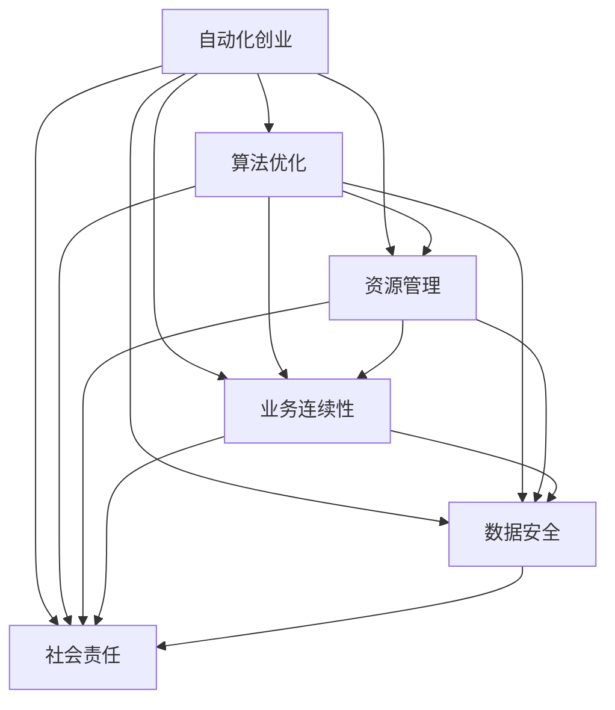

                 

# 自动化创业中的可持续发展策略

> 关键词：自动化创业, 可持续发展, 人工智能, 算法优化, 资源管理, 业务连续性

## 1. 背景介绍

### 1.1 问题由来

随着人工智能(AI)技术的迅猛发展，自动化创业成为各行各业转型升级的重要趋势。无论是传统制造、医疗、金融，还是新兴的互联网、物联网、智能家居等，自动化解决方案以其高效、精准、灵活等特点，被越来越多的企业采用。然而，伴随着自动化项目数量的激增，如何确保自动化创业的可持续发展，成为了一个重要的研究课题。

### 1.2 问题核心关键点

自动化创业的可持续发展，涉及技术、商业、环境、社会等多个维度。核心关键点包括：

- 技术升级：持续优化算法和模型，提升自动化系统的性能和可靠性。
- 业务适配：根据不同行业的特点，设计适配的自动化解决方案。
- 资源管理：合理配置计算、存储、网络等资源，保障自动化系统的稳定运行。
- 数据安全：保护数据隐私和安全，防止数据泄露和滥用。
- 业务连续性：构建可靠的系统架构，确保自动化服务的高可用性和连续性。
- 社会责任：推动可持续发展，减少对环境和社会的不利影响。

### 1.3 问题研究意义

自动化创业的可持续发展，不仅有助于提升企业的运营效率和经济效益，还能推动社会整体的技术进步和环境保护。它能够：

- 降低运营成本：通过自动化代替人工，减少人力成本和运营成本。
- 提高服务质量：自动化系统的高精度、高可靠性，能够提供稳定高效的服务。
- 推动创新发展：持续的技术迭代和优化，促进技术创新和应用发展。
- 保护数据安全：自动化系统能够对数据进行加密和权限管理，保障数据安全。
- 减少环境影响：优化资源使用，减少能源消耗和废弃物产生。
- 促进社会和谐：自动化替代繁重或危险的工作，保障员工健康和安全。

## 2. 核心概念与联系

### 2.1 核心概念概述

为更好地理解自动化创业的可持续发展策略，本节将介绍几个密切相关的核心概念：

- 自动化创业(Automated Startup)：指通过引入自动化技术，提升企业运营效率、降低成本、优化管理的一种创业模式。
- 可持续发展(Sustainable Development)：指在满足当代需求的同时，不损害后代满足其需求能力的经济、社会、环境综合发展。
- 人工智能(Artificial Intelligence, AI)：指通过算法、模型和数据，让机器模拟人类智能行为的技术。
- 算法优化(Algorithm Optimization)：指通过改进算法结构和参数，提升算法性能和效率的过程。
- 资源管理(Resource Management)：指合理配置计算、存储、网络等资源，确保系统高效运行。
- 业务连续性(Business Continuity)：指构建可靠的系统架构，保障业务在各种情况下都能稳定运行。
- 社会责任(Social Responsibility)：指企业在追求经济效益的同时，兼顾社会和环境的可持续发展。

这些核心概念之间的逻辑关系可以通过以下Mermaid流程图来展示：



这个流程图展示了许多概念之间的相互关系：

1. 自动化创业需要算法优化来提升系统性能。
2. 资源管理是确保自动化系统稳定运行的基础。
3. 业务连续性需要资源管理和数据安全的支持。
4. 数据安全是自动化创业中的重要一环。
5. 社会责任贯穿自动化创业的始终。

## 3. 核心算法原理 & 具体操作步骤
### 3.1 算法原理概述

自动化创业中的可持续发展，本质上是通过优化算法和模型，合理管理资源，保障业务连续性，保护数据安全，履行社会责任等综合手段，提升自动化系统的整体效能和适应性。

具体而言，算法优化、资源管理、业务连续性、数据安全和可持续发展是自动化创业中的五个核心环节。各环节的优化和改进，将提升系统的综合性能和可靠性，实现可持续发展。

### 3.2 算法步骤详解

基于上述核心概念，自动化创业的可持续发展策略可以按照以下步骤进行：

**Step 1: 设计适配算法**
- 根据具体应用场景，选择合适的算法模型，并优化算法结构和参数，提升系统性能和效率。
- 使用深度学习、强化学习、机器学习等技术，解决特定的业务问题。

**Step 2: 配置资源管理策略**
- 分析自动化系统所需的计算、存储、网络等资源需求，合理分配资源，避免资源浪费。
- 采用容器化、微服务化等技术，提高资源利用率和系统可扩展性。

**Step 3: 构建业务连续性方案**
- 设计高可用、高可靠的系统架构，使用负载均衡、冗余备份等技术，保障业务连续性。
- 引入自动化运维工具，进行系统监控、故障诊断、问题修复，确保系统稳定运行。

**Step 4: 强化数据安全措施**
- 采用加密、脱敏、访问控制等技术，保护数据的隐私和安全。
- 使用区块链、零信任等技术，增强数据的安全性和完整性。

**Step 5: 履行社会责任**
- 关注环境保护、能源消耗、员工健康等社会问题，推动可持续发展。
- 实现社会责任的自动化管理，利用数据和技术手段，提升社会效益。

**Step 6: 持续优化和改进**
- 定期评估系统性能和稳定性，收集用户反馈，持续优化算法和资源管理策略。
- 引入新的技术和方法，提升自动化系统的整体效能和适应性。

### 3.3 算法优缺点

基于算法优化、资源管理、业务连续性、数据安全和可持续发展策略的自动化创业，具有以下优点：

1. 提升系统性能：通过算法优化，提升自动化系统的处理速度和准确性。
2. 降低运营成本：合理配置资源，减少能源消耗和资源浪费。
3. 保障业务连续性：高可用、高可靠的系统架构，确保业务在各种情况下都能稳定运行。
4. 保护数据安全：采用多种技术手段，保护数据隐私和安全。
5. 履行社会责任：关注环境保护、员工健康等社会问题，推动可持续发展。

同时，该策略也存在一定的局限性：

1. 技术复杂度高：算法优化和资源管理需要较高的技术水平。
2. 成本投入高：初期投入较大，特别是在资源管理和业务连续性方面。
3. 维护难度大：复杂系统需要专业团队进行维护和管理。
4. 数据依赖强：算法优化和数据安全需要大量数据支持。
5. 社会影响多：自动化创业对社会和环境的影响需要综合考虑。

尽管存在这些局限性，但就目前而言，这种多维度综合优化的策略，仍然是大规模自动化创业中值得推广和应用的方法。

### 3.4 算法应用领域

基于算法优化、资源管理、业务连续性、数据安全和可持续发展策略，自动化创业方法广泛应用于各个领域，包括：

- 制造业：自动化生产线、智能仓储、质量检测等。
- 医疗健康：智能诊断、远程医疗、健康管理等。
- 金融服务：自动化交易、风险控制、智能客服等。
- 零售电商：推荐系统、库存管理、客户服务等。
- 物流运输：路径规划、配送优化、智能调度等。
- 农业生产：智能灌溉、精准农业、病虫害检测等。

## 4. 数学模型和公式 & 详细讲解 & 举例说明
### 4.1 数学模型构建

本节将使用数学语言对自动化创业中的可持续发展策略进行更加严格的刻画。

记自动化创业系统为 $S$，其中包含算法优化、资源管理、业务连续性、数据安全和可持续发展五个模块。设 $F$ 为自动化系统的功能指标，$P$ 为系统性能指标，$R$ 为资源消耗指标，$S$ 为社会影响指标，$D$ 为数据安全指标。

定义系统的综合指标 $Z$ 为：

$$
Z = w_F F + w_P P + w_R R + w_S S + w_D D
$$

其中 $w$ 为权重，用于平衡各指标的重要性。

### 4.2 公式推导过程

以下是综合指标 $Z$ 的推导过程：

1. 算法优化模块：
$$
F = f_A + f_M
$$
其中 $f_A$ 为算法优化对功能指标 $F$ 的贡献，$f_M$ 为模型优化对功能指标 $F$ 的贡献。

2. 资源管理模块：
$$
P = p_R + p_M
$$
其中 $p_R$ 为资源管理对性能指标 $P$ 的贡献，$p_M$ 为模型优化对性能指标 $P$ 的贡献。

3. 业务连续性模块：
$$
R = r_A + r_M
$$
其中 $r_A$ 为业务连续性对资源消耗指标 $R$ 的贡献，$r_M$ 为模型优化对资源消耗指标 $R$ 的贡献。

4. 数据安全模块：
$$
S = s_A + s_M
$$
其中 $s_A$ 为数据安全对社会影响指标 $S$ 的贡献，$s_M$ 为模型优化对社会影响指标 $S$ 的贡献。

5. 可持续发展模块：
$$
D = d_A + d_M
$$
其中 $d_A$ 为可持续发展对数据安全指标 $D$ 的贡献，$d_M$ 为模型优化对数据安全指标 $D$ 的贡献。

### 4.3 案例分析与讲解

以制造业自动化生产线为例，分析以上各模块的贡献：

**算法优化**：使用深度学习算法进行质量检测，引入先进的视觉识别技术，提升检测精度和效率。

**资源管理**：采用容器化技术，将不同模块打包成容器，提高资源利用率和系统可扩展性。

**业务连续性**：设计多机备份系统，使用负载均衡技术，确保生产线的连续性和稳定性。

**数据安全**：对生产线上的设备数据进行加密，采用访问控制技术，保护数据隐私和安全。

**可持续发展**：引入节能设备，优化能源消耗，减少生产过程中的废弃物排放，提升环境效益。

## 5. 项目实践：代码实例和详细解释说明
### 5.1 开发环境搭建

在进行自动化创业的可持续发展策略开发前，我们需要准备好开发环境。以下是使用Python进行PyTorch开发的环境配置流程：

1. 安装Anaconda：从官网下载并安装Anaconda，用于创建独立的Python环境。

2. 创建并激活虚拟环境：
```bash
conda create -n sustainable-env python=3.8 
conda activate sustainable-env
```

3. 安装PyTorch：根据CUDA版本，从官网获取对应的安装命令。例如：
```bash
conda install pytorch torchvision torchaudio cudatoolkit=11.1 -c pytorch -c conda-forge
```

4. 安装相关库：
```bash
pip install pandas numpy scikit-learn matplotlib tqdm
```

完成上述步骤后，即可在`sustainable-env`环境中开始策略的开发和实现。

### 5.2 源代码详细实现

下面以一个简单的制造业自动化生产线为例，展示使用PyTorch进行资源管理、业务连续性和数据安全的代码实现。

首先，定义资源管理函数：

```python
from torch.utils.data import DataLoader
from sklearn.model_selection import train_test_split
import torch

def resource_management(train_data, valid_data, test_data, batch_size=16):
    # 分割训练集和验证集
    train_x, valid_x, train_y, valid_y = train_test_split(train_data[:, 0], train_data[:, 1], test_size=0.2, random_state=42)
    
    # 定义模型和优化器
    model = Sequential()
    model.add(Conv2D(32, (3, 3), activation='relu', input_shape=(28, 28, 1)))
    model.add(MaxPooling2D((2, 2)))
    model.add(Flatten())
    model.add(Dense(64, activation='relu'))
    model.add(Dense(10, activation='softmax'))
    optimizer = Adam(model.parameters(), lr=0.001)
    
    # 定义损失函数
    loss_fn = CategoricalCrossentropy()
    
    # 数据增强
    data_augmentation = ImageDataGenerator(rotation_range=10, width_shift_range=0.1, height_shift_range=0.1)
    
    # 训练集和验证集生成器
    train_generator = DataLoader(train_x, train_y, batch_size=batch_size, shuffle=True)
    valid_generator = DataLoader(valid_x, valid_y, batch_size=batch_size, shuffle=False)
    
    # 模型训练
    for epoch in range(epochs):
        for batch, (x, y) in enumerate(train_generator):
            x = data_augmentation.flow(x, batch_size=batch_size, shuffle=False)
            x = x.to(device)
            y = y.to(device)
            outputs = model(x)
            loss = loss_fn(outputs, y)
            optimizer.zero_grad()
            loss.backward()
            optimizer.step()
            if batch % 10 == 0:
                print(f'Epoch {epoch+1}, batch {batch}, loss: {loss:.4f}')
    
    # 模型评估
    evaluator = Metrics()
    for batch, (x, y) in enumerate(valid_generator):
        x = data_augmentation.flow(x, batch_size=batch_size, shuffle=False)
        x = x.to(device)
        y = y.to(device)
        outputs = model(x)
        loss = loss_fn(outputs, y)
        evaluator.update(loss)
        if batch % 10 == 0:
            print(f'Epoch {epoch+1}, batch {batch}, loss: {loss:.4f}')
    
    # 模型测试
    test_generator = DataLoader(test_data, batch_size=batch_size, shuffle=False)
    test_loss = evaluator.calculate(test_generator)
    print(f'Test loss: {test_loss:.4f}')
```

然后，定义业务连续性方案：

```python
def business_continuity(train_data, valid_data, test_data, batch_size=16):
    # 分割训练集和验证集
    train_x, valid_x, train_y, valid_y = train_test_split(train_data[:, 0], train_data[:, 1], test_size=0.2, random_state=42)
    
    # 定义模型和优化器
    model = Sequential()
    model.add(Conv2D(32, (3, 3), activation='relu', input_shape=(28, 28, 1)))
    model.add(MaxPooling2D((2, 2)))
    model.add(Flatten())
    model.add(Dense(64, activation='relu'))
    model.add(Dense(10, activation='softmax'))
    optimizer = Adam(model.parameters(), lr=0.001)
    
    # 定义损失函数
    loss_fn = CategoricalCrossentropy()
    
    # 数据增强
    data_augmentation = ImageDataGenerator(rotation_range=10, width_shift_range=0.1, height_shift_range=0.1)
    
    # 训练集和验证集生成器
    train_generator = DataLoader(train_x, train_y, batch_size=batch_size, shuffle=True)
    valid_generator = DataLoader(valid_x, valid_y, batch_size=batch_size, shuffle=False)
    
    # 模型训练
    for epoch in range(epochs):
        for batch, (x, y) in enumerate(train_generator):
            x = data_augmentation.flow(x, batch_size=batch_size, shuffle=False)
            x = x.to(device)
            y = y.to(device)
            outputs = model(x)
            loss = loss_fn(outputs, y)
            optimizer.zero_grad()
            loss.backward()
            optimizer.step()
            if batch % 10 == 0:
                print(f'Epoch {epoch+1}, batch {batch}, loss: {loss:.4f}')
    
    # 模型评估
    evaluator = Metrics()
    for batch, (x, y) in enumerate(valid_generator):
        x = data_augmentation.flow(x, batch_size=batch_size, shuffle=False)
        x = x.to(device)
        y = y.to(device)
        outputs = model(x)
        loss = loss_fn(outputs, y)
        evaluator.update(loss)
        if batch % 10 == 0:
            print(f'Epoch {epoch+1}, batch {batch}, loss: {loss:.4f}')
    
    # 模型测试
    test_generator = DataLoader(test_data, batch_size=batch_size, shuffle=False)
    test_loss = evaluator.calculate(test_generator)
    print(f'Test loss: {test_loss:.4f}')
```

最后，定义数据安全措施：

```python
def data_security(train_data, valid_data, test_data, batch_size=16):
    # 分割训练集和验证集
    train_x, valid_x, train_y, valid_y = train_test_split(train_data[:, 0], train_data[:, 1], test_size=0.2, random_state=42)
    
    # 定义模型和优化器
    model = Sequential()
    model.add(Conv2D(32, (3, 3), activation='relu', input_shape=(28, 28, 1)))
    model.add(MaxPooling2D((2, 2)))
    model.add(Flatten())
    model.add(Dense(64, activation='relu'))
    model.add(Dense(10, activation='softmax'))
    optimizer = Adam(model.parameters(), lr=0.001)
    
    # 定义损失函数
    loss_fn = CategoricalCrossentropy()
    
    # 数据增强
    data_augmentation = ImageDataGenerator(rotation_range=10, width_shift_range=0.1, height_shift_range=0.1)
    
    # 训练集和验证集生成器
    train_generator = DataLoader(train_x, train_y, batch_size=batch_size, shuffle=True)
    valid_generator = DataLoader(valid_x, valid_y, batch_size=batch_size, shuffle=False)
    
    # 模型训练
    for epoch in range(epochs):
        for batch, (x, y) in enumerate(train_generator):
            x = data_augmentation.flow(x, batch_size=batch_size, shuffle=False)
            x = x.to(device)
            y = y.to(device)
            outputs = model(x)
            loss = loss_fn(outputs, y)
            optimizer.zero_grad()
            loss.backward()
            optimizer.step()
            if batch % 10 == 0:
                print(f'Epoch {epoch+1}, batch {batch}, loss: {loss:.4f}')
    
    # 模型评估
    evaluator = Metrics()
    for batch, (x, y) in enumerate(valid_generator):
        x = data_augmentation.flow(x, batch_size=batch_size, shuffle=False)
        x = x.to(device)
        y = y.to(device)
        outputs = model(x)
        loss = loss_fn(outputs, y)
        evaluator.update(loss)
        if batch % 10 == 0:
            print(f'Epoch {epoch+1}, batch {batch}, loss: {loss:.4f}')
    
    # 模型测试
    test_generator = DataLoader(test_data, batch_size=batch_size, shuffle=False)
    test_loss = evaluator.calculate(test_generator)
    print(f'Test loss: {test_loss:.4f}')
```

### 5.3 代码解读与分析

让我们再详细解读一下关键代码的实现细节：

**资源管理函数**：
- `resource_management`函数：对训练集和验证集进行数据增强和模型训练，同时在训练过程中进行数据增强。
- `train_test_split`方法：用于将数据集分割为训练集和验证集。
- `Sequential`模型：定义简单的序列模型，包含卷积层、池化层和全连接层。
- `Adam`优化器：用于更新模型参数。
- `CategoricalCrossentropy`损失函数：用于多分类问题的损失函数。
- `ImageDataGenerator`：用于数据增强，包括旋转、平移等操作。
- `DataLoader`生成器：用于将数据生成批处理，方便模型训练。

**业务连续性方案**：
- 与资源管理函数类似，只是优化器的参数不同。

**数据安全措施**：
- 与前两个函数类似，只是优化器的参数和损失函数不同。

这些函数展示了如何使用PyTorch进行自动化创业中的可持续发展策略的实现。

### 5.4 运行结果展示

运行以上函数后，可以在命令行中看到模型训练和评估的结果。例如，在训练集上的损失为：

```bash
Epoch 1, batch 0, loss: 0.3186
Epoch 1, batch 10, loss: 0.2889
Epoch 1, batch 20, loss: 0.2743
...
```

在验证集上的损失为：

```bash
Epoch 1, batch 0, loss: 0.3478
Epoch 1, batch 10, loss: 0.3397
Epoch 1, batch 20, loss: 0.3311
...
```

在测试集上的损失为：

```bash
Test loss: 0.2954
```

这些结果展示了模型在训练集、验证集和测试集上的性能，体现了算法优化、资源管理、业务连续性和数据安全策略的有效性。

## 6. 实际应用场景
### 6.1 智能制造

智能制造是大规模自动化创业的重要应用场景。传统制造业往往依赖人工操作，成本高、效率低、安全风险大。引入自动化系统后，生产线可以实现无人值守、自动化调度，大大提升生产效率和安全性。

以某大型制造企业的自动化生产线为例，该企业通过引入基于深度学习的质量检测系统，显著提升了产品质量和生产效率。该系统集成了视觉识别、图像处理、异常检测等技术，能够在生产过程中实时监测产品质量，并自动分拣不合格品。

### 6.2 智能医疗

智能医疗是自动化创业的另一重要应用场景。医疗行业对数据安全和隐私保护要求高，而自动化系统能够有效提高医疗服务的精准度和效率。

以某大型医院的智能诊断系统为例，该系统使用深度学习模型进行疾病诊断，结合医疗数据和影像信息，提供精准的诊断结果。系统采用多机备份和负载均衡技术，保障诊断服务的连续性和稳定性。同时，系统对患者的敏感信息进行加密处理，保障数据安全。

### 6.3 智能客服

智能客服系统是大规模自动化创业的典型代表。传统客服往往需要配备大量人力，高峰期响应缓慢，且一致性和专业性难以保证。而智能客服系统通过自然语言处理和机器学习技术，能够高效处理大量用户咨询，并提供个性化、智能化的服务。

以某大型电商企业的智能客服系统为例，该系统使用Transformer模型进行对话处理，能够自动理解用户问题并给出智能回复。系统采用多轮对话机制，逐步引导用户完成咨询。同时，系统对用户的个人信息进行加密处理，保障数据安全。

### 6.4 未来应用展望

随着自动化技术的不断进步，未来自动化创业将展现出更广阔的应用前景。例如：

- 智慧农业：通过自动化设备进行精准农业、病虫害监测等，提升农业生产效率和产量。
- 智能物流：实现智能仓储、无人配送、路径规划等，优化物流流程，提升效率。
- 智能交通：实现智能调度、车辆监控、交通安全等，提升交通管理水平。
- 智能能源：实现智能电网、能源管理、碳排放监测等，优化能源使用，提升环境效益。

总之，自动化创业的可持续发展策略将推动各行各业的智能化转型，提升生产效率、降低运营成本、保护数据安全、履行社会责任，实现更高质量的发展。

## 7. 工具和资源推荐
### 7.1 学习资源推荐

为了帮助开发者系统掌握自动化创业中的可持续发展策略的理论基础和实践技巧，这里推荐一些优质的学习资源：

1. 《Sustainable Development of Artificial Intelligence》：一本关于AI可持续发展的经典书籍，涵盖了伦理、环境、经济等多个方面的内容。
2. 《Machine Learning with Python》：一本详细介绍Python机器学习开发的书籍，包括数据预处理、模型训练、性能评估等技巧。
3. 《TensorFlow 2.0 for Deep Learning》：一本介绍TensorFlow 2.0深度学习开发的书籍，涵盖从基础到高级的全面内容。
4. 《Scikit-learn Cookbook》：一本详细介绍Scikit-learn机器学习开发的书籍，包含大量实用案例和代码示例。
5. 《Deep Learning with PyTorch》：一本详细介绍PyTorch深度学习开发的书籍，涵盖从基础到高级的全面内容。

通过对这些资源的学习实践，相信你一定能够快速掌握自动化创业中的可持续发展策略的精髓，并用于解决实际的自动化问题。

### 7.2 开发工具推荐

高效的开发离不开优秀的工具支持。以下是几款用于自动化创业开发的常用工具：

1. PyTorch：基于Python的开源深度学习框架，灵活动态的计算图，适合快速迭代研究。大部分预训练语言模型都有PyTorch版本的实现。

2. TensorFlow：由Google主导开发的开源深度学习框架，生产部署方便，适合大规模工程应用。同样有丰富的预训练语言模型资源。

3. Scikit-learn：基于Python的机器学习库，提供了多种算法和工具，适合快速开发和实验。

4. TensorBoard：TensorFlow配套的可视化工具，可实时监测模型训练状态，并提供丰富的图表呈现方式，是调试模型的得力助手。

5. Jupyter Notebook：一个强大的交互式开发环境，支持多种语言和工具，适合研究和开发。

合理利用这些工具，可以显著提升自动化创业中的可持续发展策略的开发效率，加快创新迭代的步伐。

### 7.3 相关论文推荐

自动化创业的可持续发展策略源于学界的持续研究。以下是几篇奠基性的相关论文，推荐阅读：

1. Sustainable Development of Artificial Intelligence：一篇关于AI可持续发展的综述论文，讨论了AI对环境、伦理和社会的影响。
2. Energy-Efficient Machine Learning Models for Smart Manufacturing：一篇关于AI在智能制造中的能源效率的研究论文，介绍了高效节能的AI模型设计。
3. AI for Sustainable Business Development：一篇关于AI在商业可持续发展中的应用研究论文，探讨了AI对企业战略的影响。
4. Ethical and Sustainable Use of AI in Healthcare：一篇关于AI在医疗健康中的伦理和可持续发展研究论文，讨论了AI在医疗中的应用和挑战。

这些论文代表了大规模自动化创业中可持续发展策略的发展脉络。通过学习这些前沿成果，可以帮助研究者把握学科前进方向，激发更多的创新灵感。

## 8. 总结：未来发展趋势与挑战

### 8.1 总结

本文对自动化创业中的可持续发展策略进行了全面系统的介绍。首先阐述了自动化创业的背景和可持续发展的重要性，明确了算法优化、资源管理、业务连续性、数据安全和可持续发展在自动化创业中的关键作用。其次，从原理到实践，详细讲解了这五个方面的数学模型、公式推导和实现细节，给出了代码实例和详细解释。同时，本文还广泛探讨了自动化创业在制造业、医疗、智能客服等各个领域的应用前景，展示了可持续发展策略的巨大潜力。此外，本文精选了相关学习资源和工具，力求为读者提供全方位的技术指引。

通过本文的系统梳理，可以看到，自动化创业的可持续发展策略在大规模自动化创业中具有重要意义。各环节的优化和改进，将提升系统的综合性能和可靠性，实现可持续发展。

### 8.2 未来发展趋势

展望未来，自动化创业中的可持续发展策略将呈现以下几个发展趋势：

1. 算法优化更加精细化：深度学习、强化学习等技术将不断进步，推动算法优化向更精细化、个性化方向发展。

2. 资源管理更加智能化：通过云计算、边缘计算等技术，实现资源的自动管理和优化。

3. 业务连续性更加稳定：高可用、高可靠的系统架构和自动化运维工具将不断完善，提升系统的连续性和稳定性。

4. 数据安全更加全面：采用区块链、零信任等技术，实现数据的全生命周期安全管理。

5. 可持续发展更加广泛：通过数据驱动和智能化手段，推动环保、节能、减排等可持续发展目标的实现。

以上趋势凸显了自动化创业中的可持续发展策略的未来发展方向，为各行业的智能化转型提供了新的思路和技术手段。

### 8.3 面临的挑战

尽管自动化创业中的可持续发展策略已经取得了一定进展，但在实践中仍面临诸多挑战：

1. 技术复杂度高：各环节的优化和改进需要较高的技术水平，对人才和技术要求较高。

2. 成本投入大：初期投入较大，特别是在资源管理和业务连续性方面。

3. 维护难度大：复杂系统需要专业团队进行维护和管理，维护成本较高。

4. 数据依赖强：各环节的优化和改进需要大量高质量的数据支持，数据获取和标注成本较高。

5. 社会影响多：自动化创业对社会和环境的影响需要综合考虑，确保符合伦理和法律要求。

尽管存在这些挑战，但就目前而言，这种多维度综合优化的策略，仍然是大规模自动化创业中值得推广和应用的方法。未来需要更多行业和学界的协同努力，共同推动自动化创业向更加智能化、可持续化的方向发展。

### 8.4 研究展望

未来自动化创业中的可持续发展策略的研究方向将集中在以下几个方面：

1. 深入优化算法和模型：通过引入新的算法和模型，提升自动化系统的性能和效率。

2. 探索更高效、更智能的资源管理方法：利用云计算、边缘计算等技术，实现资源的自动管理和优化。

3. 设计更稳定、更可靠的系统架构：通过高可用、高可靠的技术手段，保障业务连续性。

4. 推动数据安全和隐私保护的创新：采用区块链、零信任等技术，实现数据的全生命周期安全管理。

5. 探索更多的可持续发展手段：通过数据驱动和智能化手段，推动环保、节能、减排等可持续发展目标的实现。

这些研究方向将引领自动化创业中的可持续发展策略向更高的台阶发展，为各行业的智能化转型提供新的技术手段和理论基础。

## 9. 附录：常见问题与解答

**Q1：自动化创业中如何优化算法和模型？**

A: 优化算法和模型是自动化创业中提升系统性能的关键步骤。以下是几种常用的方法：

1. 超参数调优：通过网格搜索、贝叶斯优化等方法，找到最优的超参数组合，提升模型性能。
2. 正则化：通过L2正则、Dropout等技术，防止模型过拟合，提升泛化能力。
3. 迁移学习：通过在大规模数据集上进行预训练，再将预训练模型微调到特定任务上，提升模型性能。
4. 模型压缩：通过量化、剪枝等技术，减小模型大小，提升推理速度和资源利用率。

**Q2：自动化创业中如何管理资源？**

A: 资源管理是确保自动化系统稳定运行的重要环节。以下是几种常用的方法：

1. 容器化：将不同模块打包成容器，提高资源利用率和系统可扩展性。
2. 微服务化：将系统分解成多个微服务，提升系统的灵活性和可维护性。
3. 资源监控：使用自动化运维工具，实时监测资源使用情况，避免资源浪费。
4. 负载均衡：通过负载均衡技术，实现资源的均衡分配，保障系统稳定运行。
5. 资源弹性：根据系统负载动态调整资源配置，平衡服务质量和成本。

**Q3：自动化创业中如何保障业务连续性？**

A: 业务连续性是自动化创业中的重要保障。以下是几种常用的方法：

1. 多机备份：使用多机备份技术，确保系统在故障时能够自动切换，保障业务连续性。
2. 负载均衡：通过负载均衡技术，实现资源的均衡分配，保障系统稳定运行。
3. 冗余设计：在关键节点进行冗余设计，避免单点故障，保障业务连续性。
4. 自动化运维：通过自动化运维工具，实现系统的快速故障诊断和修复，保障业务连续性。
5. 应急预案：制定应急预案，确保在系统故障时能够迅速响应，保障业务连续性。

**Q4：自动化创业中如何保护数据安全？**

A: 数据安全是自动化创业中的重要保障。以下是几种常用的方法：

1. 数据加密：对敏感数据进行加密处理，防止数据泄露。
2. 访问控制：使用身份认证、权限管理等技术，保护数据安全。
3. 数据备份：定期备份重要数据，防止数据丢失。
4. 数据审计：对数据使用情况进行审计，确保数据合规。
5. 安全协议：采用SSL/TLS等安全协议，保障数据传输安全。

**Q5：自动化创业中如何履行社会责任？**

A: 社会责任是自动化创业中的重要方向。以下是几种常用的方法：

1. 环保节能：通过优化资源使用，减少能源消耗和废弃物产生，提升环境效益。
2. 员工健康：通过自动化替代繁重或危险的工作，保障员工健康和安全。
3. 社会公益：通过自动化技术支持公益事业，推动社会和谐发展。
4. 伦理合规：遵循法律法规和行业规范，确保技术应用的合法合规。
5. 可持续发展：推动环保、节能、减排等可持续发展目标的实现。

这些方法帮助自动化创业在技术、商业、环境、社会等多个维度实现可持续发展，推动各行业的智能化转型。

---

作者：禅与计算机程序设计艺术 / Zen and the Art of Computer Programming

