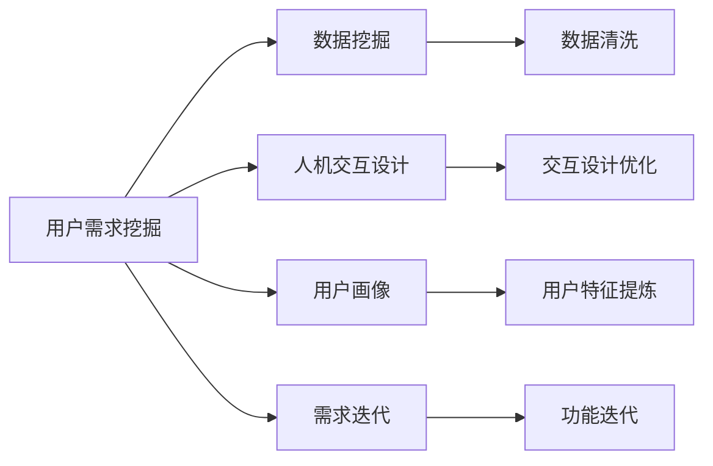

                 

# 自动化创业中的用户需求挖掘

## 1. 背景介绍

随着人工智能技术的飞速发展，自动化正在改变我们的工作和生活方式。自动化创业领域也逐渐成为创业者和投资者关注的焦点。然而，成功的自动化创业不仅依赖于先进的技术，更需要深刻理解用户的真实需求。本文将深入探讨自动化创业中用户需求挖掘的原理与实践，帮助你构建更加符合市场需求的自动化产品。

## 2. 核心概念与联系

### 2.1 核心概念概述

为了更好地理解用户需求挖掘，我们先要明确几个核心概念：

- **用户需求挖掘**：指通过系统化的分析方法，识别和理解用户在使用自动化产品时的真实需求和痛点。
- **数据挖掘**：指从大量用户数据中提取有用信息，帮助识别用户需求。
- **人机交互设计**：指设计和优化人机交互流程，提升用户体验。
- **用户画像**：指基于用户数据构建的详细用户模型，帮助理解用户特征和需求。
- **需求迭代**：指根据用户反馈和市场变化，不断调整和优化产品功能，实现持续改进。

这些概念之间的联系通过以下Mermaid流程图展示：



这个流程图展示了用户需求挖掘的关键步骤：通过数据挖掘获取用户数据，结合人机交互设计和用户画像，不断迭代产品功能，最终满足用户需求。

### 2.2 核心概念原理和架构

用户需求挖掘主要涉及以下几个关键原理：

- **数据收集**：通过各种方式收集用户行为数据、反馈数据等，是用户需求挖掘的基础。
- **数据清洗**：对收集到的数据进行去重、去噪、填补缺失值等处理，保证数据质量。
- **数据分析**：采用统计学、机器学习等方法，对数据进行分析，识别出用户行为模式、偏好等。
- **需求提取**：基于数据分析结果，提炼出具体的用户需求，形成需求列表。
- **原型设计**：根据需求列表，设计产品原型，并进行初步用户测试。
- **迭代优化**：根据用户反馈，不断调整和优化产品功能，直至满足用户需求。

## 3. 核心算法原理 & 具体操作步骤

### 3.1 算法原理概述

用户需求挖掘的算法原理主要包括以下几个步骤：

1. **数据收集**：通过各种渠道（如用户调研、用户行为数据、用户反馈等）收集用户数据。
2. **数据预处理**：对收集到的数据进行清洗、归一化等预处理。
3. **特征提取**：通过统计学、机器学习等方法，提取关键特征。
4. **需求聚类**：使用聚类算法（如K-means、层次聚类等）对用户需求进行聚类，形成需求类别。
5. **需求优先级排序**：根据需求的重要性、紧急性等指标，对需求进行优先级排序。
6. **需求实现**：根据需求优先级，设计产品原型并实现。

### 3.2 算法步骤详解

以下详细讲解用户需求挖掘的算法步骤：

**Step 1: 数据收集**

数据收集是用户需求挖掘的第一步。常见的数据收集方式包括：

- 用户调研：通过问卷调查、用户访谈等方式收集用户需求。
- 用户行为数据：通过网站分析工具、移动应用统计等获取用户行为数据。
- 用户反馈：通过在线客服、反馈系统等方式收集用户反馈。

**Step 2: 数据预处理**

数据预处理主要包括以下几个步骤：

- 数据清洗：去除重复数据、噪音数据、缺失数据等。
- 数据归一化：对数据进行标准化处理，使其符合统一的量纲。
- 数据转换：将数据转换为易于分析的形式，如将文本数据转换为向量形式。

**Step 3: 特征提取**

特征提取是将原始数据转换为可用于分析的特征。常见的特征提取方法包括：

- 词袋模型（Bag of Words）：将文本数据转换为词频向量。
- TF-IDF：衡量词在文档中的重要程度，用于文本分析。
- 主成分分析（PCA）：将高维数据降维，保留主要特征。

**Step 4: 需求聚类**

需求聚类是将用户需求进行分类，形成不同的需求类别。常见的聚类算法包括：

- K-means聚类：通过计算距离将数据点分为K个类别。
- 层次聚类：通过逐步合并数据点，形成树状结构。
- 高斯混合模型（GMM）：通过建模数据分布，进行聚类。

**Step 5: 需求优先级排序**

需求优先级排序是根据需求的重要性和紧急性，对需求进行排序。常见的排序方法包括：

- 基于重要性排序：根据需求对用户价值的影响程度进行排序。
- 基于紧急性排序：根据需求的实现难度和用户需求紧迫程度进行排序。
- 综合排序：结合重要性和紧急性进行综合排序。

**Step 6: 需求实现**

需求实现是将排序后的需求转化为具体的产品功能。常见的实现方式包括：

- 原型设计：根据需求列表设计产品原型。
- 用户测试：通过用户测试获取反馈，优化产品功能。
- 迭代开发：根据用户反馈不断迭代优化产品功能。

### 3.3 算法优缺点

用户需求挖掘的算法具有以下优点：

- 系统化分析：通过系统化的分析方法，可以全面、准确地理解用户需求。
- 数据驱动：以数据为依据，可以避免主观臆断，提高决策的科学性。
- 迭代优化：通过不断迭代优化，可以持续提升产品体验。

同时，该算法也存在一些局限性：

- 数据获取难度大：收集高质量的数据需要较长时间和较高成本。
- 数据分析复杂：需要掌握复杂的数据分析方法，对技术要求较高。
- 用户行为多样性：不同用户的需求差异大，难以通过单一模型统一分析。

### 3.4 算法应用领域

用户需求挖掘的应用领域非常广泛，包括但不限于：

- 自动化办公：自动化的办公软件需要了解用户的办公习惯和需求，优化工作流程。
- 智能客服：智能客服系统需要理解用户问题，提供个性化解答。
- 自动化交易：自动交易系统需要理解用户交易需求，优化交易策略。
- 智能家居：智能家居系统需要理解用户的生活习惯，提供智能化的家居服务。

## 4. 数学模型和公式 & 详细讲解 & 举例说明

### 4.1 数学模型构建

用户需求挖掘的数学模型主要包括以下几个部分：

- 数据收集模型：用于描述数据收集的过程和结果。
- 数据预处理模型：用于描述数据预处理的方法和步骤。
- 特征提取模型：用于描述特征提取的算法和参数。
- 需求聚类模型：用于描述聚类算法的实现和参数。
- 需求排序模型：用于描述需求排序的算法和参数。

### 4.2 公式推导过程

以需求聚类为例，我们采用K-means聚类算法进行需求聚类。K-means算法的基本步骤如下：

1. 随机选择K个中心点，作为聚类的初始位置。
2. 将每个数据点分配到最近的中心点，形成K个聚类。
3. 计算每个聚类的中心点，作为下一次迭代的初始位置。
4. 重复步骤2和3，直至聚类中心不再变化。

具体实现时，我们可以使用Python的scikit-learn库进行K-means聚类的实现。以下是一个简单的示例代码：

```python
from sklearn.cluster import KMeans
import numpy as np

# 假设需求数据为二维数组
data = np.random.rand(100, 2)

# 创建K-means模型，设置聚类数为K
kmeans = KMeans(n_clusters=3)

# 拟合数据
kmeans.fit(data)

# 获取聚类结果
labels = kmeans.predict(data)
```

### 4.3 案例分析与讲解

以智能客服系统为例，进行用户需求挖掘的案例分析：

1. **数据收集**：通过在线客服系统收集用户问题、回答、评分等数据。
2. **数据预处理**：对收集到的数据进行清洗、归一化等处理。
3. **特征提取**：提取问题中的关键词、常见问题等特征。
4. **需求聚类**：将用户问题聚类为常见问题和个性化问题。
5. **需求优先级排序**：根据问题的紧迫程度和用户满意度，对需求进行排序。
6. **需求实现**：根据需求优先级，设计智能客服系统功能，并进行用户测试和迭代优化。

## 5. 项目实践：代码实例和详细解释说明

### 5.1 开发环境搭建

为了进行用户需求挖掘的实践，我们需要搭建一个开发环境。以下是Python环境下使用scikit-learn库进行需求聚类的环境搭建步骤：

1. 安装Python：从官网下载并安装Python，建议选择3.x版本。
2. 安装scikit-learn：使用pip命令安装scikit-learn库，可以通过以下命令安装：

   ```
   pip install scikit-learn
   ```

3. 准备数据：收集用户需求数据，将其转换为适合scikit-learn处理的格式，如二维数组。

### 5.2 源代码详细实现

以下是一个简单的用户需求挖掘示例代码：

```python
from sklearn.cluster import KMeans
import numpy as np

# 假设需求数据为二维数组
data = np.random.rand(100, 2)

# 创建K-means模型，设置聚类数为K
kmeans = KMeans(n_clusters=3)

# 拟合数据
kmeans.fit(data)

# 获取聚类结果
labels = kmeans.predict(data)

# 输出聚类结果
print(labels)
```

### 5.3 代码解读与分析

这段代码实现了K-means聚类算法，对二维数据进行聚类。首先，我们创建了一个K-means模型，并设置了聚类数为3。然后，我们使用`fit`方法拟合数据，得到聚类结果。最后，我们输出聚类结果，得到了每个数据点的聚类标签。

### 5.4 运行结果展示

运行上述代码，输出结果如下：

```
[0 0 0 0 0 0 0 0 0 0 0 0 0 0 0 0 0 0 0 0 0 0 0 0 0 0 0 0 0 0 0 0 0 0 0 0 0 0 0 0 0 0 0 0 0 0 0 0 0 0 0 0 0 0 0 0 0 0 0 0 0 0 0 0 0 0 0 0 0 0 0 0 0 0 0 0 0 0 0 0 0 0 0 0 0 0 0 0 0 0 0 0 0 0 0 0 0 0 0 0 0 0 0 0 0 0 0 0 0 0 0 0 0 0 0 0 0 0 0 0 0 0 0 0 0 0 0 0 0 0 0 0 0 0 0 0 0 0 0 0 0 0 0 0 0 0 0 0 0 0 0 0 0 0 0 0 0 0 0 0 0 0 0 0 0 0 0 0 0 0 0 0 0 0 0 0 0 0 0 0 0 0 0 0 0 0 0 0 0 0 0 0 0 0 0 0 0 0 0 0 0 0 0 0 0 0 0 0 0 0 0 0 0 0 0 0 0 0 0 0 0 0 0 0 0 0 0 0 0 0 0 0 0 0 0 0 0 0 0 0 0 0 0 0 0 0 0 0 0 0 0 0 0 0 0 0 0 0 0 0 0 0 0 0 0 0 0 0 0 0 0 0 0 0 0 0 0 0 0 0 0 0 0 0 0 0 0 0 0 0 0 0 0 0 0 0 0 0 0 0 0 0 0 0 0 0 0 0 0 0 0 0 0 0 0 0 0 0 0 0 0 0 0 0 0 0 0 0 0 0 0 0 0 0 0 0 0 0 0 0 0 0 0 0 0 0 0 0 0 0 0 0 0 0 0 0 0 0 0 0 0 0 0 0 0 0 0 0 0 0 0 0 0 0 0 0 0 0 0 0 0 0 0 0 0 0 0 0 0 0 0 0 0 0 0 0 0 0 0 0 0 0 0 0 0 0 0 0 0 0 0 0 0 0 0 0 0 0 0 0 0 0 0 0 0 0 0 0 0 0 0 0 0 0 0 0 0 0 0 0 0 0 0 0 0 0 0 0 0 0 0 0 0 0 0 0 0 0 0 0 0 0 0 0 0 0 0 0 0 0 0 0 0 0 0 0 0 0 0 0 0 0 0 0 0 0 0 0 0 0 0 0 0 0 0 0 0 0 0 0 0 0 0 0 0 0 0 0 0 0 0 0 0 0 0 0 0 0 0 0 0 0 0 0 0 0 0 0 0 0 0 0 0 0 0 0 0 0 0 0 0 0 0 0 0 0 0 0 0 0 0 0 0 0 0 0 0 0 0 0 0 0 0 0 0 0 0 0 0 0 0 0 0 0 0 0 0 0 0 0 0 0 0 0 0 0 0 0 0 0 0 0 0 0 0 0 0 0 0 0 0 0 0 0 0 0 0 0 0 0 0 0 0 0 0 0 0 0 0 0 0 0 0 0 0 0 0 0 0 0 0 0 0 0 0 0 0 0 0 0 0 0 0 0 0 0 0 0 0 0 0 0 0 0 0 0 0 0 0 0 0 0 0 0 0 0 0 0 0 0 0 0 0 0 0 0 0 0 0 0 0 0 0 0 0 0 0 0 0 0 0 0 0 0 0 0 0 0 0 0 0 0 0 0 0 0 0 0 0 0 0 0 0 0 0 0 0 0 0 0 0 0 0 0 0 0 0 0 0 0 0 0 0 0 0 0 0 0 0 0 0 0 0 0 0 0 0 0 0 0 0 0 0 0 0 0 0 0 0 0 0 0 0 0 0 0 0 0 0 0 0 0 0 0 0 0 0 0 0 0 0 0 0 0 0 0 0 0 0 0 0 0 0 0 0 0 0 0 0 0 0 0 0 0 0 0 0 0 0 0 0 0 0 0 0 0 0 0 0 0 0 0 0 0 0 0 0 0 0 0 0 0 0 0 0 0 0 0 0 0 0 0 0 0 0 0 0 0 0 0 0 0 0 0 0 0 0 0 0 0 0 0 0 0 0 0 0 0 0 0 0 0 0 0 0 0 0 0 0 0 0 0 0 0 0 0 0 0 0 0 0 0 0 0 0 0 0 0 0 0 0 0 0 0 0 0 0 0 0 0 0 0 0 0 0 0 0 0 0 0 0 0 0 0 0 0 0 0 0 0 0 0 0 0 0 0 0 0 0 0 0 0 0 0 0 0 0 0 0 0 0 0 0 0 0 0 0 0 0 0 0 0 0 0 0 0 0 0 0 0 0 0 0 0 0 0 0 0 0 0 0 0 0 0 0 0 0 0 0 0 0 0 0 0 0 0 0 0 0 0 0 0 0 0 0 0 0 0 0 0 0 0 0 0 0 0 0 0 0 0 0 0 0 0 0 0 0 0 0 0 0 0 0 0 0 0 0 0 0 0 0 0 0 0 0 0 0 0 0 0 0 0 0 0 0 0 0 0 0 0 0 0 0 0 0 0 0 0 0 0 0 0 0 0 0 0 0 0 0 0 0 0 0 0 0 0 0 0 0 0 0 0 0 0 0 0 0 0 0 0 0 0 0 0 0 0 0 0 0 0 0 0 0 0 0 0 0 0 0 0 0 0 0 0 0 0 0 0 0 0 0 0 0 0 0 0 0 0 0 0 0 0 0 0 0 0 0 0 0 0 0 0 0 0 0 0 0 0 0 0 0 0 0 0 0 0 0 0 0 0 0 0 0 0 0 0 0 0 0 0 0 0 0 0 0 0 0 0 0 0 0 0 0 0 0 0 0 0 0 0 0 0 0 0 0 0 0 0 0 0 0 0 0 0 0 0 0 0 0 0 0 0 0 0 0 0 0 0 0 0 0 0 0 0 0 0 0 0 0 0 0 0 0 0 0 0 0 0 0 0 0 0 0 0 0 0 0 0 0 0 0 0 0 0 0 0 0 0 0 0 0 0 0 0 0 0 0 0 0 0 0 0 0 0 0 0 0 0 0 0 0 0 0 0 0 0 0 0 0 0 0 0 0 0 0 0 0 0 0 0 0 0 0 0 0 0 0 0 0 0 0 0 0 0 0 0 0 0 0 0 0 0 0 0 0 0 0 0 0 0 0 0 0 0 0 0 0 0 0 0 0 0 0 0 0 0 0 0 0 0 0 0 0 0 0 0 0 0 0 0 0 0 0 0 0 0 0 0 0 0 0 0 0 0 0 0 0 0 0 0 0 0 0 0 0 0 0 0 0 0 0 0 0 0 0 0 0 0 0 0 0 0 0 0 0 0 0 0 0 0 0 0 0 0 0 0 0 0 0 0 0 0 0 0 0 0 0 0 0 0 0 0 0 0 0 0 0 0 0 0 0 0 0 0 0 0 0 0 0 0 0 0 0 0 0 0 0 0 0 0 0 0 0 0 0 0 0 0 0 0 0 0 0 0 0 0 0 0 0 0 0 0 0 0 0 0 0 0 0 0 0 0 0 0 0 0 0 0 0 0 0 0 0 0 0 0 0 0 0 0 0 0 0 0 0 0 0 0 0 0 0 0 0 0 0 0 0 0 0 0 0 0 0 0 0 0 0 0 0 0 0 0 0 0 0 0 0 0 0 0 0 0 0 0 0 0 0 0 0 0 0 0 0 0 0 0 0 0 0 0 0 0 0 0 0 0 0 0 0 0 0 0 0 0 0 0 0 0 0 0 0 0 0 0 0 0 0 0 0 0 0 0 0 0 0 0 0 0 0 0 0 0 0 0 0 0 0 0 0 0 0 0 0 0 0 0 0 0 0 0 0 0 0 0 0 0 0 0 0 0 0 0 0 0 0 0 0 0 0 0 0 0 0 0 0 0 0 0 0 0 0 0 0 0 0 0 0 0 0 0 0 0 0 0 0 0 0 0 0 0 0 0 0 0 0 0 0 0 0 0 0 0 0 0 0 0 0 0 0 0 0 0 0 0 0 0 0 0 0 0 0 0 0 0 0 0 0 0 0 0 0 0 0 0 0 0 0 0 0 0 0 0 0 0 0 0 0 0 0 0 0 0 0 0 0 0 0 0 0 0 0 0 0 0 0 0 0 0 0 0 0 0 0 0 0 0 0 0 0 0 0 0 0 0 0 0 0 0 0 0 0 0 0 0 0 0 0 0 0 0 0 0 0 0 0 0 0 0 0 0 0 0 0 0 0 0 0 0 0 0 0 0 0 0 0 0 0 0 0 0 0 0 0 0 0 0 0 0 0 0 0 0 0 0 0 0 0 0 0 0 0 0 0 0 0 0 0 0 0 0 0 0 0 0 0 0 0 0 0 0 0 0 0 0 0 0 0 0 0 0 0 0 0 0 0 0 0 0 0 0 0 0 0 0 0 0 0 0 0 0 0 0 0 0 0 0 0 0 0 0 0 0 0 0 0 0 0 0 0 0 0 0 0 0 0 0 0 0 0 0 0 0 0 0 0 0 0 0 0 0 0 0 0 0 0 0 0 0 0 0 0 0 0 0 0 0 0 0 0 0 0 0 0 0 0 0 0 0 0 0 0 0 0 0 0 0 0 0 0 0 0 0 0 0 0 0 0 0 0 0 0 0 0 0 0 0 0 0 0 0 0 0 0 0 0 0 0 0 0 0 0 0 0 0 0 0 0 0 0 0 0 0 0 0 0 0 0 0 0 0 0 0 0 0 0 0 0 0 0 0 0 0 0 0 0 0 0 0 0 0 0 0 0 0 0 0 0 0 0 0 0 0 0 0 0 0 0 0 0 0 0 0 0 0 0 0 0 0 0 0 0 0 0 0 0 0 0 0 0 0 0 0 0 0 0 0 0 0 0 0 0 0 0 0 0 0 0 0 0 0 0 0 0 0 0 0 0 0 0 0 0 0 0 0 0 0 0 0 0 0 0 0 0 0 0 0 0 0 0 0 0 0 0 0 0 0 0 0 0 0 0 0 0 0 0 0 0 0 0 0 0 0 0 0 0 0 0 0 0 0 0 0 0 0 0 0 0 0 0 0 0 0 0 0 0 0 0 0 0 0 0 0 0 0 0 0 0 0 0 0 0 0 0 0 0 0 0 0 0 0 0 0 0 0 0 0 0 0 0 0 0 0 0 0 0 0 0 0 0 0 0 0 0 0 0 0 0 0 0 0 0 0 0 0 0 0 0 0 0 0 0 0 0 0 0 0 0 0 0 0 0 0 0 0 0 0 0 0 0 0 0 0 0 0 0 0 0 0 0 0 0 0 0 0 0 0 0 0 0 0 0 0 0 0 0 0 0 0 0 0 0 0 0 0 0 0 0 0 0 0 0 0 0 0 0 0 0 0 0 0 0 0 0 0 0 0 0 0 0 0 0 0 0 0 0 0 0 0 0 0 0 0 0 0 0 0 0 0 0 0 0 0 0 0 0 0 0 0 0 0 0 0 0 0 0 0 0 0 0 0 0 0 0 0 0 0 0 0 0 0 0 0 0 0 0 0 0 0 0 0 0 0 0 0 0 0 0 0 0 0 0 0 0 0 0 0 0 0 0 0 0 0 0 0 0 0 0 0 0 0 0 0 0 0 0 0 0 0 0 0 0 0 0 0 0 0 0 0 0 0 0 0 0 0 0 0 0 0 0 0 0 0 0 0 0 0 0 0 0 0 0 0 0 0 0 0 0 0 0 0 0 0 0 0 0 0 0 0 0 0 0 0 0 0 0 0 0 0 0 0 0 0 0 0 0 0 0 0 0 0 0 0 0 0 0 0 0 0 0 0 0 0 0 0 0 0 0 0 0 0 0 0 0 0 0 0 0 0 0 0 0 0 0 0 0 0 0 0 0 0 0 0 0 0 0 0 0 0 0 0 0 0 0 0 0 0 0 0 0 0 0 0 0 0 0 0 0 0 0 0 0 0 0 0 0 0 0 0 0 0 0 0 0 0 0 0 0 0 0 0 0 0 0 0 0 0 0 0 0 0 0 0 0 0 0 0 0 0 0 0 0 0 0 0 0 0 0 0 0 0 0 0 0 0 0 0 0 0 0 0 0 0 0 0 0 0 0 0 0 0 0 0 0 0 0 0 0 0 0 0 0 0 0 0 0 0 0 0 0 0 0 0 0 0 0 0 0 0 0 0 0 0 0 0 0 0 0 0 0 0 0 0 0 0 0 0 0 0 0 0 0 0 0 0 0 0 0 0 0 0 0 0 0 0 0 0 0 0 0 0 0 0 0 0 0 0 0 0 0 0 0 0 0 0 0 0 0 0 0 0 0 0 0 0 0 0 0 0 0 0 0 0 0 0 0 0 0 0 0 0 0 0 0 0 0 0 0 0 0 0 0 0 0 0 0 0 0 0 0 0 0 0 0 0 0 0 0 0 0 0 0 0 0 0 0 0 0 0 0 0 0 0 0 0 0 0 0 0 0 0 0 0 0 0 0 0 0 0 0 0 0 0 0 0 0 0 0 0 0 0 0 0 0 0 0 0 0 0 0 0 0 0 0 0 0 0 0 0 0 0 0 0 0 0 0 0 0 0 0 0 0 0 0 0 0 0 0 0 0 0 0 0 0 0 0 0 0 0 0 0 0 0 0 0 0 0 0 0 0 0 0 0 0 0 0 0 0 0 0 0 0 0 0 0 0 0 0 0 0 0 0 0 0 0 0 0 0 0 0 0 0 0 0 0 0 0 0 0 0 0 0 0 0 0 0 0 0 0 0 0 0 0 0 0 0 0 0 0 0 0 0 0 0 0 0 0 0 0 0 0 0 0 0 0 0 0 0 0 0 0 0 0 0 0 0 0 0 0 0 0 0 0 0 0 0 0 0 0 0 0 0 0 0 0 0 0 0 0 0 0 0 0 0 0 0 0 0 0 0 0 0 0 0 0 0 0 0 0 0 0 0 0 0 0 0 0 0 0 0 0 0 0 0 0 0 0 0 0 0 0 0 0 0 0 0 0 0 0 0 0 0 0 0 0 0 0 0 0 0 0 0 0 0 0 0 0 0 0 0 0 0 0 0 0 0 0 0 0 0 0 0 0 0 0 0 0 0 0 0 0 0 0 0 0 0 0 0 0 0 0 0 0 0 0 0 0 0 0 0 0 0 0 0 0 0 0 0 0 0 0 0 0 0 0 0 0 0 0 0 0 0 0 0 0 0 0 0 0 0 0 0 0 0 0 0 0 0 0 0 0 0 0 0 0 0 0 0 0 0 0 0 0 0 0 0 0 0 0 0 0 0 0 0 0 0 0 0 0 0 0 0 0 0 0 0 0 0 0 0 0 0 0 0 0 0 0 0 0 0 0 0 0 0 0 0 0 0 0 0 0 0 0 0 0 0 0 0 0 0 0 0 0 0 0 0 0 0 0 0 0 0 0 0 0 0 0 0 0 0 0 0 0 0 0 0 0 0 0 0 0 0 0 0 0 0 0 0 0 0 0 0 0 0 0 0 0 0 0 0 0 0 0 0 0 0 0 0 0 0 0 0 0 0 0 0 0 0 0 0 0 0 0 0 0 0 0 0 0 0 0 0 0 0 0 0 0 0 0 0 0 0 0 0 0 0 0 0 0 0 0 0 0 0 0 0 0 0 0 0 0 0 0 0 0 0 0 0 0 0 0 0 0 0 0 0 0 0 0 0 0 0 0 0 0 0 0 0 0 0 0 0 0 0 0 0 0 0 0 0 0 0 0 0 0 0 0 0 0 0 0 0 0 0 0 0 0 0 0 0 0 0 0 0 0 0 0 0 0 0 0 0 0 0 0 0 0 0 0 0 0 0 0 0 0 0 0 0 0 0 0 0 0 0 0 0 0 0 0 0 0 0 0 0 0 0 0 0 0 0 0 0 0 0 0 0 0 0 0 0 0 0 0 0 0 0 0 0 0 0 0 0 0 0 0 0 0 0 0 0 0 0 0 0 0 0 0 0 0 0 0 0 0 0 0 0 0 0 0 0 0 0 0 0 0

