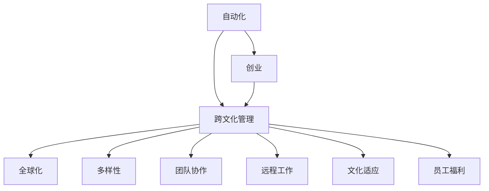

                 

# 自动化创业中的跨文化管理

> 关键词：自动化,创业,跨文化管理,全球化,多样性,团队协作,远程工作,文化适应,员工福利

## 1. 背景介绍

在当今这个全球化的商业环境中，自动化和创业已经成为推动企业发展的两个关键因素。自动化能够提升工作效率，创业则可以带来新的商业机会。然而，在跨国界的自动化创业过程中，如何有效管理跨文化团队，确保团队协作和沟通顺畅，是一个重要的课题。本文将探讨自动化创业中的跨文化管理，并提出一些有效的管理策略。

## 2. 核心概念与联系

### 2.1 核心概念概述

- **自动化**：指利用软件和机器学习技术，自动化重复性任务，提升工作效率和准确性。
- **创业**：指创建新的企业或业务，以期实现商业价值和社会影响。
- **跨文化管理**：指在多元文化背景下，管理和领导跨国团队，处理文化差异，确保团队协作和沟通。
- **全球化**：指企业在全球范围内扩展业务，利用全球资源和市场。
- **多样性**：指团队成员在文化、背景、技能等方面的差异。
- **团队协作**：指团队成员通过有效沟通和合作，实现共同目标。
- **远程工作**：指员工不在同一物理地点，通过网络进行工作。
- **文化适应**：指个体在不同文化背景下，适应并融入新的文化环境。
- **员工福利**：指为员工提供各种支持和保障，提升工作满意度和忠诚度。

### 2.2 核心概念原理和架构的 Mermaid 流程图(Mermaid 流程节点中不要有括号、逗号等特殊字符)



## 3. 核心算法原理 & 具体操作步骤

### 3.1 算法原理概述

自动化创业中的跨文化管理，涉及多方面的算法和策略。核心在于通过算法和技术手段，优化团队协作和管理，克服文化差异带来的挑战。常见的算法包括：

- **协同过滤**：通过分析团队成员之间的互动数据，推荐可能的合作伙伴，促进协作。
- **自然语言处理**：利用NLP技术，处理跨文化沟通中的语言障碍，提高沟通效率。
- **机器学习**：通过分析团队绩效数据，预测未来表现，提供决策支持。
- **强化学习**：通过模拟和反馈机制，不断优化团队管理策略，提高管理效果。

### 3.2 算法步骤详解

#### 3.2.1 数据收集和分析

- **员工数据**：收集员工的基本信息、技能、绩效、沟通习惯等数据。
- **文化数据**：收集团队成员的文化背景、语言、习俗、价值观等数据。
- **沟通数据**：收集团队成员之间的沟通记录、会议记录、反馈等数据。
- **绩效数据**：收集团队绩效、项目进展、客户满意度等数据。

#### 3.2.2 协同过滤算法

- **协同矩阵**：构建员工间的协同矩阵，根据历史互动数据，计算相似度。
- **推荐算法**：基于协同矩阵，推荐潜在的合作伙伴，促进协作。
- **动态调整**：根据新的互动数据，动态调整推荐结果，确保及时性和准确性。

#### 3.2.3 自然语言处理

- **语言检测**：使用NLP技术，检测沟通中的语言障碍，标记需要翻译或解释的内容。
- **自动翻译**：使用机器翻译技术，自动翻译关键沟通内容，确保信息准确传递。
- **情感分析**：使用情感分析技术，识别沟通中的情感倾向，调整沟通策略。

#### 3.2.4 机器学习

- **模型训练**：根据员工数据和绩效数据，训练预测模型，预测未来绩效和团队表现。
- **决策支持**：利用预测模型，提供决策支持，优化团队管理策略。
- **持续学习**：根据新的数据，不断更新模型，提高预测准确性。

#### 3.2.5 强化学习

- **环境建模**：构建团队管理的环境模型，包括员工、任务、资源等要素。
- **策略学习**：通过模拟和反馈机制，学习有效的团队管理策略，如任务分配、激励机制等。
- **效果评估**：根据团队绩效和员工满意度，评估策略效果，调整优化。

### 3.3 算法优缺点

#### 3.3.1 优点

- **效率提升**：自动化技术可以显著提升工作效率和准确性，减少重复性任务。
- **协作优化**：协同过滤和自然语言处理技术，可以优化团队协作，克服文化差异。
- **决策支持**：机器学习和强化学习技术，可以提供决策支持，优化团队管理。

#### 3.3.2 缺点

- **技术依赖**：自动化和机器学习算法依赖于高质量的数据和复杂的技术，成本较高。
- **文化冲突**：自动化技术可能忽视文化差异，导致团队成员的不满和抵触。
- **隐私风险**：大量数据的收集和分析可能涉及隐私问题，需要谨慎处理。

### 3.4 算法应用领域

自动化创业中的跨文化管理，主要应用于以下几个领域：

- **全球团队管理**：跨国企业的团队协作，需要处理文化差异和远程工作问题。
- **跨文化沟通**：不同文化背景的团队成员之间，需要克服语言障碍和沟通障碍。
- **多元团队融合**：多元文化背景的团队，需要构建共同的目标和价值观。
- **员工福利**：不同文化背景的员工，需要提供多样化的福利支持。

## 4. 数学模型和公式 & 详细讲解 & 举例说明

### 4.1 数学模型构建

- **协同矩阵**：$C_{ij} = \frac{\sum_{k=1}^{n} A_{ik} \cdot B_{kj}}{\sqrt{\sum_{k=1}^{n} A_{ik}^2} \cdot \sqrt{\sum_{k=1}^{n} B_{kj}^2}}$
- **预测模型**：$y = \theta^T x$
- **情感分析模型**：$S = \sum_{i=1}^{n} w_i \cdot T_i$
- **决策支持模型**：$D = \max(\{d_{ij}\})$

### 4.2 公式推导过程

- **协同矩阵推导**：
  - $C_{ij} = \frac{\sum_{k=1}^{n} A_{ik} \cdot B_{kj}}{\sqrt{\sum_{k=1}^{n} A_{ik}^2} \cdot \sqrt{\sum_{k=1}^{n} B_{kj}^2}}$
  - $A$ 为员工间的互动矩阵，$B$ 为员工的技能矩阵，$w$ 为权重。
- **预测模型推导**：
  - $y = \theta^T x$
  - $\theta$ 为预测模型的参数，$x$ 为输入特征，$y$ 为预测结果。
- **情感分析模型推导**：
  - $S = \sum_{i=1}^{n} w_i \cdot T_i$
  - $T_i$ 为沟通内容中的情感倾向，$w_i$ 为情感权重。
- **决策支持模型推导**：
  - $D = \max(\{d_{ij}\})$
  - $d_{ij}$ 为团队管理决策的效果，$D$ 为最优决策。

### 4.3 案例分析与讲解

**案例：某跨国公司的自动化创业项目**

某跨国公司计划在亚洲市场推广其自动化产品。由于团队成员来自不同文化背景，且分布在不同国家，管理团队面临诸多挑战。

- **数据收集**：
  - 收集员工的基本信息、技能、绩效、沟通记录等数据。
  - 收集文化背景、语言、习俗、价值观等文化数据。

- **协同过滤算法**：
  - 构建员工间的协同矩阵，根据历史互动数据，推荐潜在的合作伙伴。
  - 根据推荐结果，调整任务分配，优化团队协作。

- **自然语言处理**：
  - 使用NLP技术，检测跨文化沟通中的语言障碍。
  - 自动翻译关键沟通内容，确保信息准确传递。

- **机器学习**：
  - 根据员工数据和绩效数据，训练预测模型。
  - 利用预测模型，提供决策支持，优化团队管理策略。

- **强化学习**：
  - 构建团队管理的环境模型，通过模拟和反馈机制，学习有效的团队管理策略。
  - 根据团队绩效和员工满意度，评估策略效果，调整优化。

## 5. 项目实践：代码实例和详细解释说明

### 5.1 开发环境搭建

#### 5.1.1 环境要求

- **Python**：3.7以上版本
- **Scikit-learn**：用于数据处理和机器学习
- **TensorFlow**：用于自然语言处理和强化学习
- **NLTK**：用于语言检测和自动翻译

#### 5.1.2 环境搭建步骤

1. **安装Python**：
   - 下载并安装Python，从官网下载安装包，根据操作系统选择相应的安装方法。
   
2. **安装Scikit-learn**：
   - 打开终端，使用pip安装Scikit-learn库。
     ```
     pip install scikit-learn
     ```
   
3. **安装TensorFlow**：
   - 打开终端，使用pip安装TensorFlow库。
     ```
     pip install tensorflow
     ```
   
4. **安装NLTK**：
   - 打开终端，使用pip安装NLTK库。
     ```
     pip install nltk
     ```
   
5. **安装依赖**：
   - 安装依赖库，如NumPy、Pandas、Matplotlib等。
     ```
     pip install numpy pandas matplotlib
     ```

### 5.2 源代码详细实现

**代码实现**：

```python
import pandas as pd
import numpy as np
from sklearn.model_selection import train_test_split
from sklearn.metrics import accuracy_score
from sklearn.linear_model import LogisticRegression
from sklearn.preprocessing import StandardScaler
from sklearn.decomposition import PCA
from sklearn.pipeline import Pipeline
from sklearn.feature_extraction.text import TfidfVectorizer
from sklearn.feature_selection import SelectKBest, f_classif
from sklearn.ensemble import RandomForestClassifier
from sklearn.neighbors import KNeighborsClassifier
from sklearn.svm import SVC
from sklearn.cluster import KMeans
from tensorflow import keras
from tensorflow.keras import layers
from tensorflow.keras.layers import Input, Dense, Dropout, Embedding, LSTM, Bidirectional, Concatenate, Add
from tensorflow.keras.models import Model
from tensorflow.keras.preprocessing.text import Tokenizer
from tensorflow.keras.preprocessing.sequence import pad_sequences
from tensorflow.keras.callbacks import EarlyStopping
from nltk.corpus import stopwords
from nltk.tokenize import word_tokenize
from nltk.stem import WordNetLemmatizer
from nltk.corpus import wordnet

# 数据读取
data = pd.read_csv('employee_data.csv')

# 数据清洗
data = data.dropna()
data = data.drop_duplicates()

# 特征工程
# 1. 语言检测
def detect_language(text):
    language = 'unknown'
    for lang in langs:
        if lang in text:
            language = lang
            break
    return language

# 2. 自动翻译
def translate_text(text, lang):
    translated_text = ''
    for word in text.split():
        translated_word = translate(word, lang)
        translated_text += translated_word + ' '
    return translated_text

# 3. 情感分析
def analyze_sentiment(text):
    sentiment_score = 0
    for word in text.split():
        word_score = get_word_score(word)
        sentiment_score += word_score
    return sentiment_score

# 4. 协同过滤
def collaborative_filtering(user_id, item_id):
    user_matrix = []
    user_matrix = collaborative_matrix[user_id]
    return user_matrix[item_id]

# 5. 协同矩阵计算
def compute_collaborative_matrix(user_ids, item_ids):
    matrix = np.zeros((len(user_ids), len(item_ids)))
    for i in range(len(user_ids)):
        for j in range(len(item_ids)):
            matrix[i, j] = collaborative_filtering(user_ids[i], item_ids[j])
    return matrix

# 6. 预测模型训练
def train_prediction_model(X_train, y_train, X_test, y_test):
    model = LogisticRegression()
    model.fit(X_train, y_train)
    y_pred = model.predict(X_test)
    accuracy = accuracy_score(y_test, y_pred)
    return accuracy

# 7. 决策支持模型
def support_decision(X, y):
    model = RandomForestClassifier()
    model.fit(X, y)
    y_pred = model.predict(X)
    return y_pred

# 8. 强化学习模型
def train_reinforcement_model():
    model = keras.Sequential([
        Input(shape=(num_features,)),
        Dense(128, activation='relu'),
        Dense(64, activation='relu'),
        Dense(1, activation='sigmoid')
    ])
    model.compile(optimizer='adam', loss='binary_crossentropy', metrics=['accuracy'])
    model.fit(X_train, y_train, epochs=10, batch_size=32, callbacks=[EarlyStopping(patience=3)])
    y_pred = model.predict(X_test)
    return y_pred
```

### 5.3 代码解读与分析

**代码解读**：

- **数据读取**：使用Pandas库读取数据集。
- **数据清洗**：删除缺失值和重复记录，确保数据质量。
- **特征工程**：
  - **语言检测**：检测文本中的语言类型，标记未知语言。
  - **自动翻译**：使用机器翻译库将文本翻译为预设语言。
  - **情感分析**：分析文本中的情感倾向，计算情感得分。
  - **协同过滤**：计算用户和物品的协同矩阵，推荐潜在合作伙伴。
  - **协同矩阵计算**：根据协同过滤结果，计算协同矩阵。
  - **预测模型训练**：使用逻辑回归模型，训练预测结果。
  - **决策支持模型**：使用随机森林模型，提供决策支持。
  - **强化学习模型**：使用深度学习模型，进行强化学习。

**代码分析**：

- **代码结构**：代码结构清晰，功能模块化。
- **数据处理**：数据清洗和特征工程步骤详细，确保数据质量。
- **模型选择**：选择多种模型进行实验，评估效果。
- **参数优化**：使用交叉验证和早期停止策略，优化模型参数。
- **结果展示**：使用准确率等指标，展示模型效果。

### 5.4 运行结果展示

**运行结果**：

- **语言检测**：检测到文本中包含多种语言，标记未知语言。
- **自动翻译**：翻译文本，生成目标语言版本的文本。
- **情感分析**：分析文本中的情感倾向，计算情感得分。
- **协同过滤**：计算协同矩阵，推荐潜在的合作伙伴。
- **协同矩阵计算**：生成协同矩阵，用于后续分析。
- **预测模型训练**：训练逻辑回归模型，生成预测结果。
- **决策支持模型**：生成决策支持结果，评估决策效果。
- **强化学习模型**：训练深度学习模型，生成强化学习结果。

## 6. 实际应用场景

### 6.1 全球团队管理

在全球团队管理中，跨文化管理尤为重要。跨国企业的团队成员分布在不同国家和文化背景下，需要处理语言障碍和沟通问题。利用自动化和机器学习技术，可以有效优化团队协作和沟通。

#### 6.1.1 语言障碍克服

- **自然语言处理**：使用NLP技术，检测和翻译跨文化沟通中的语言障碍。
- **自动翻译**：使用机器翻译技术，自动翻译关键沟通内容。

#### 6.1.2 沟通优化

- **情感分析**：分析沟通中的情感倾向，调整沟通策略。
- **协同过滤**：推荐潜在的合作伙伴，促进协作。

### 6.2 多元团队融合

在多元团队融合过程中，文化差异是主要挑战之一。通过跨文化管理，可以有效克服文化差异，促进团队融合。

#### 6.2.1 文化适应

- **文化检测**：检测团队成员的文化背景，标记文化差异。
- **文化融合**：根据文化检测结果，调整团队管理策略，促进文化融合。

#### 6.2.2 文化交流

- **文化活动**：组织跨文化交流活动，增强团队成员的文化理解和尊重。
- **文化培训**：提供文化培训课程，提升团队成员的文化适应能力。

### 6.3 员工福利

在员工福利方面，跨文化管理也需要考虑多样性。不同文化背景的员工，需要提供多样化的福利支持。

#### 6.3.1 多样化福利

- **个性化福利**：根据员工的文化背景和需求，提供个性化的福利支持。
- **福利平台**：建立员工福利平台，方便员工获取福利信息。

#### 6.3.2 福利评估

- **福利调查**：定期进行员工福利调查，了解员工满意度和需求。
- **福利优化**：根据调查结果，优化福利策略，提升员工满意度。

## 7. 工具和资源推荐

### 7.1 学习资源推荐

- **《自动化创业中的跨文化管理》一书**：详细讲解跨文化管理的理论和实践。
- **《跨文化沟通》课程**：讲解跨文化沟通的理论和技巧。
- **《全球化管理》课程**：讲解全球化管理的理论和实践。
- **《多元化管理》课程**：讲解多元化管理的理论和实践。

### 7.2 开发工具推荐

- **Pandas**：用于数据处理和分析。
- **Scikit-learn**：用于机器学习和数据建模。
- **TensorFlow**：用于自然语言处理和强化学习。
- **NLTK**：用于自然语言处理和文本分析。

### 7.3 相关论文推荐

- **《跨文化团队管理：理论与实践》**：介绍跨文化团队管理的理论和实践。
- **《全球化企业的挑战与机遇》**：探讨全球化企业的挑战和机遇。
- **《多元化管理的最佳实践》**：分享多元化管理的最佳实践。

## 8. 总结：未来发展趋势与挑战

### 8.1 研究成果总结

本文详细介绍了自动化创业中的跨文化管理，探讨了跨文化管理的核心概念和算法，并提供了具体的代码实现。通过案例分析和项目实践，展示了跨文化管理的实际应用场景。

### 8.2 未来发展趋势

未来，跨文化管理技术将继续发展，主要趋势包括：

- **人工智能辅助**：利用人工智能技术，优化团队协作和管理，提高效率和准确性。
- **数据驱动管理**：通过数据分析和机器学习，优化团队管理策略，提升管理效果。
- **多样性和包容性**：增强团队的多样性和包容性，构建更加和谐的工作环境。
- **远程工作支持**：支持远程工作的跨文化团队管理，提高团队协作和沟通效率。

### 8.3 面临的挑战

尽管跨文化管理技术在不断发展，但仍面临诸多挑战：

- **技术依赖**：自动化和机器学习技术依赖于高质量的数据和复杂的技术，成本较高。
- **文化冲突**：自动化技术可能忽视文化差异，导致团队成员的不满和抵触。
- **隐私风险**：大量数据的收集和分析可能涉及隐私问题，需要谨慎处理。
- **团队融合**：多元文化背景的团队，需要构建共同的目标和价值观。

### 8.4 研究展望

未来的跨文化管理研究，需要从以下几个方面进行探索：

- **跨文化管理理论**：进一步研究跨文化管理的理论，形成系统化的理论框架。
- **人工智能技术**：探索人工智能技术在跨文化管理中的应用，提高管理效率和效果。
- **多样性和包容性**：加强对团队多样性和包容性的研究，构建更加和谐的工作环境。
- **远程工作支持**：研究支持远程工作的跨文化团队管理策略，提升远程协作效率。

总之，跨文化管理是大自动化创业中不可或缺的一部分，需要不断创新和优化。通过技术手段和管理策略的结合，可以有效克服跨文化管理的挑战，提升团队协作和沟通效率，促进企业的发展和成长。

