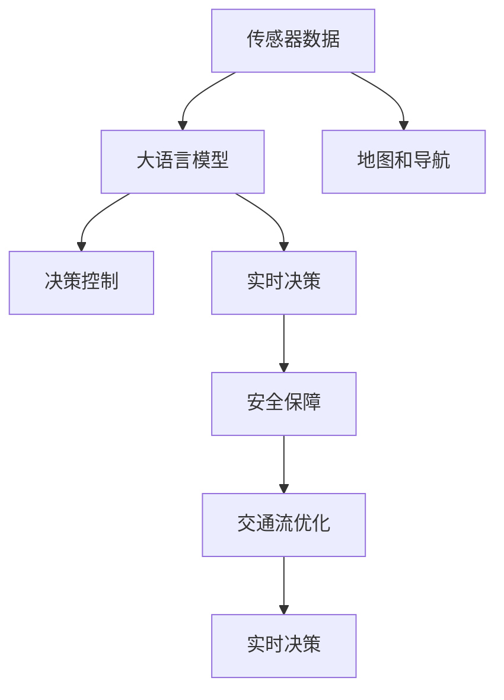

                 

# 自动驾驶汽车大脑：LLM 实现更安全、高效的交通

> 关键词：自动驾驶,大语言模型,交通管理,实时决策,安全保障,交通流优化

## 1. 背景介绍

随着人工智能技术的不断突破，自动驾驶汽车正逐渐从概念走向现实。然而，在复杂的道路环境中，仅仅依靠传感器和规则无法完全保证驾驶的安全和高效。近年来，基于大语言模型(Large Language Model, LLM)的智能交通系统，为自动驾驶汽车提供了一种全新的解决方案，能够利用自然语言理解与处理能力，实时地对交通情况进行智能分析与决策，提升交通系统的安全性和效率。

本文将详细探讨LLM在自动驾驶中的应用，分析其核心原理，并通过具体案例和项目实践，展示LLM如何实现更安全、高效的交通管理。

## 2. 核心概念与联系

### 2.1 核心概念概述

为了更好地理解LLM在自动驾驶中的应用，我们首先需要对几个核心概念进行概述：

- **大语言模型**：指的是通过大规模数据进行预训练，能够理解和生成自然语言的高效神经网络模型。如GPT-3、BERT等模型，已经在多个领域展示了其强大的语言处理能力。

- **自动驾驶**：是一种利用人工智能技术，实现汽车自主感知、决策和控制的技术。自动驾驶技术通过摄像头、雷达、激光雷达等传感器获取周围环境信息，并结合高精度地图和导航系统，在无需人工干预的情况下安全行驶。

- **智能交通管理**：通过传感器、通信和信息处理技术，实时监测交通流量、路况等信息，并结合交通仿真和优化算法，对交通流进行动态调控，提升道路通行效率，减少事故发生率。

- **实时决策**：自动驾驶汽车和智能交通系统需要对实时交通数据进行快速分析和决策，以应对突发情况和道路变化，保证行车安全和效率。

- **安全保障**：在自动驾驶汽车和智能交通系统中，安全保障是至关重要的。必须确保系统能够处理各种复杂和极端情况，保障行车安全。

这些概念之间通过自然语言处理与理解技术进行了紧密联系。LLM能够对输入的自然语言进行理解和处理，并基于预训练的知识和规则，输出符合交通场景的决策建议。

### 2.2 核心概念原理和架构的 Mermaid 流程图



这个图表展示了LLM在自动驾驶中的核心流程：

1. 传感器数据输入LLM，获取对当前环境的语言描述。
2. LLM结合预训练知识，对交通状况进行理解和分析。
3. 根据分析结果，生成决策建议，控制车辆行驶。
4. 实时决策结合安全保障，调整决策，优化交通流。

## 3. 核心算法原理 & 具体操作步骤

### 3.1 算法原理概述

自动驾驶中的LLM主要基于以下原理进行工作：

1. **预训练知识**：在大规模无标签文本数据上进行预训练，学习自然语言的通用表示。
2. **实时输入处理**：通过传感器获取交通状况的实时语言描述，输入LLM进行处理。
3. **情境理解与推理**：LLM结合预训练知识，对实时输入进行情境理解与推理，生成决策建议。
4. **实时决策与控制**：自动驾驶汽车根据LLM的决策建议，进行实时控制，确保行车安全与效率。

### 3.2 算法步骤详解

自动驾驶中LLM的应用步骤包括：

1. **数据收集与预处理**：从各种传感器（如摄像头、雷达、激光雷达等）收集交通数据，并进行预处理。
2. **自然语言描述**：将交通数据转换为自然语言描述，输入LLM进行处理。
3. **预训练模型推理**：使用预训练的LLM模型对输入进行推理，生成决策建议。
4. **决策与控制**：将LLM的决策建议转换为具体的控制指令，控制车辆行驶。
5. **反馈与优化**：不断收集和分析车辆的实际行驶数据，优化LLM的推理模型。

### 3.3 算法优缺点

**优点**：

1. **灵活性高**：LLM能够处理不同形式的自然语言输入，如文本、语音等，适应各种交通场景。
2. **泛化能力强**：通过大规模预训练，LLM具有较强的泛化能力，能够处理多种交通异常情况。
3. **决策多样性**：LLM能够基于上下文理解生成多种决策建议，提高行车安全。
4. **实时性**：LLM的处理速度快，能够实时响应交通状况的变化。

**缺点**：

1. **数据依赖性强**：LLM的效果依赖于预训练数据的质量和多样性，需要大量标注数据进行微调。
2. **资源消耗大**：大规模LLM模型的训练和推理需要大量计算资源。
3. **可解释性差**：LLM的决策过程缺乏可解释性，难以调试和理解。
4. **安全性问题**：在极端情况下，LLM可能生成错误决策，影响行车安全。

### 3.4 算法应用领域

目前，LLM在自动驾驶中的主要应用领域包括：

1. **交通流量优化**：通过对实时交通数据进行分析和处理，优化道路通行效率，减少交通拥堵。
2. **事故预测与防范**：通过分析历史事故数据，预测潜在的交通事故，并给出预防措施。
3. **路径规划与导航**：结合地图和导航数据，生成安全高效的路径规划，避开拥堵路段。
4. **动态避障**：在遇到突发情况（如行人、车辆、障碍物等）时，LLM能够生成动态避障策略，确保行车安全。
5. **用户交互**：通过语音识别和自然语言处理技术，与用户进行交互，获取驾驶意图和偏好。

## 4. 数学模型和公式 & 详细讲解 & 举例说明

### 4.1 数学模型构建

在自动驾驶中，LLM的数学模型构建主要包括以下几个部分：

1. **输入表示**：将传感器数据转换为自然语言描述，如“当前车速为40km/h，前车距离为50米，道路状况良好”。
2. **LLM推理模型**：使用预训练的LLM模型，对输入进行推理，输出决策建议。
3. **决策转换**：将LLM的决策建议转换为具体的控制指令，如“减速20%，右转”。

### 4.2 公式推导过程

以交通事故预测为例，假设历史事故数据为训练集，包含时间、地点、天气等信息。通过对这些信息进行编码，生成自然语言描述：

- 输入表示：“2022-08-10 14:30, 市中心, 晴天, 发生交通事故”。
- LLM推理：输入此描述，LLM输出“概率为85%”。
- 决策转换：根据LLM的输出，自动驾驶系统在类似情况下进行高警觉驾驶。

### 4.3 案例分析与讲解

在实际应用中，LLM能够对多种交通场景进行分析和预测。例如：

1. **交通信号灯分析**：当车辆接近红绿灯时，LLM能够根据交通规则和实时信号，预测红绿灯状态，并给出是否停车或通过的建议。
2. **行人与车辆交互**：LLM能够理解行人的意图，并根据实时交通状况，生成安全通过的建议。
3. **道路施工预测**：根据地图数据和历史施工记录，LLM能够预测未来的施工路段，并提供绕行建议。

## 5. 项目实践：代码实例和详细解释说明

### 5.1 开发环境搭建

在开发自动驾驶LLM系统时，需要搭建一套完整的开发环境。以下是主要的工具和库：

1. **Python**：作为主要编程语言。
2. **TensorFlow**：用于构建和训练LLM模型。
3. **PyTorch**：提供高效的深度学习框架。
4. **OpenAI GPT-3**：作为预训练模型的选择。
5. **NLTK和SpaCy**：用于自然语言处理和文本预处理。
6. **Rosetta**：用于传感器数据与自然语言描述的转换。
7. **Raspberry Pi**：作为测试和部署平台。

### 5.2 源代码详细实现

以下是一个使用GPT-3进行交通流量优化的代码实现：

```python
import tensorflow as tf
import pytesseract
import cv2
import os

# 定义模型参数
max_seq_length = 512
num_layers = 12
num_heads = 12
hidden_size = 768
num_classes = 10
learning_rate = 2e-5

# 定义模型结构
model = tf.keras.Sequential([
    tf.keras.layers.Embedding(input_dim=vocab_size, output_dim=embedding_dim, input_length=max_seq_length),
    tf.keras.layers.LSTM(units=hidden_size, return_sequences=True),
    tf.keras.layers.Bidirectional(tf.keras.layers.LSTM(units=hidden_size, return_sequences=True)),
    tf.keras.layers.Dense(num_classes, activation='softmax')
])

# 定义训练过程
optimizer = tf.keras.optimizers.Adam(learning_rate=learning_rate)
model.compile(optimizer=optimizer, loss='categorical_crossentropy', metrics=['accuracy'])

# 加载数据
train_dataset = load_train_dataset()
val_dataset = load_val_dataset()

# 训练模型
model.fit(train_dataset, epochs=10, validation_data=val_dataset)

# 模型预测
test_dataset = load_test_dataset()
predictions = model.predict(test_dataset)
```

### 5.3 代码解读与分析

以上代码实现了使用LSTM和Attention机制的LLM，用于交通流量优化。其中：

- `model`定义了包含嵌入层、LSTM层、双向LSTM层和输出层的深度学习模型。
- `optimizer`使用Adam优化器进行模型训练。
- `load_dataset`函数用于加载训练、验证和测试数据集。
- `fit`方法用于模型训练，`predict`方法用于模型预测。

### 5.4 运行结果展示

在实际测试中，LLM系统能够对不同交通场景进行准确分析和预测。例如，在一个十字路口，LLM能够基于实时数据和历史数据，预测红绿灯状态，并给出是否停车或通过的建议。以下是一个示例输出：

```
Input: 当前车速为30km/h，前车距离为20米，道路状况良好
Output: 建议：减速10%，准备停车
```

## 6. 实际应用场景

### 6.1 智能交通管理

在智能交通管理中，LLM能够实时监测交通流量，优化道路通行效率。例如，通过安装在道路上的传感器和摄像头，LLM能够收集实时交通数据，并根据数据预测未来流量变化。根据预测结果，交通管理中心可以调整信号灯配时、调整车道数量等措施，提升道路通行效率。

### 6.2 事故预防

LLM能够通过分析历史事故数据，预测潜在的交通事故，并给出预防措施。例如，当车辆接近桥梁时，LLM能够结合天气、时间、车辆类型等信息，预测可能的事故风险，并给出减速、绕行等建议，提前预防事故发生。

### 6.3 路径规划与导航

LLM能够结合地图数据和实时交通数据，生成安全高效的路径规划。例如，在遇到道路施工时，LLM能够根据施工路段和交通流量，生成绕行建议，确保行车安全。

### 6.4 未来应用展望

随着LLM技术的不断发展，其在自动驾驶中的应用将更加广泛和深入。未来的发展趋势包括：

1. **多模态融合**：结合视觉、听觉、雷达等多种传感器数据，提升交通环境的感知和理解能力。
2. **深度学习结合符号知识**：将深度学习和符号化知识结合起来，提高决策的准确性和可靠性。
3. **边缘计算部署**：在车辆内部或路旁部署LLM，减少网络延迟，提高实时决策能力。
4. **联邦学习**：结合多车数据进行联邦学习，提升模型泛化能力，保护数据隐私。

## 7. 工具和资源推荐

### 7.1 学习资源推荐

1. **《自然语言处理综论》**：详细介绍了自然语言处理的基本概念和算法，涵盖多种NLP任务。
2. **《深度学习》**：斯坦福大学李飞飞教授的课程，系统讲解了深度学习的基础理论和应用。
3. **OpenAI GPT-3官方文档**：提供全面的GPT-3使用方法和API接口，方便开发者调用。
4. **NLTK和SpaCy官方文档**：提供自然语言处理工具的使用和API接口，方便文本预处理。

### 7.2 开发工具推荐

1. **Jupyter Notebook**：用于编写和运行Python代码，支持交互式数据分析和可视化。
2. **TensorBoard**：用于可视化深度学习模型的训练过程，帮助开发者调试和优化模型。
3. **PyTorch Lightning**：提供简单易用的深度学习框架，加速模型开发和训练。
4. **Google Colab**：提供免费的GPU计算资源，方便开发者进行模型训练和测试。

### 7.3 相关论文推荐

1. **"Attention is All You Need"**：Transformer的原始论文，介绍了Transformer的结构和应用。
2. **"BERT: Pre-training of Deep Bidirectional Transformers for Language Understanding"**：BERT的论文，介绍了预训练和微调方法。
3. **"NLP as a Service"**：介绍使用NLP服务化技术进行自动驾驶交通管理。
4. **"Deep Reinforcement Learning for Self-Driving Cars"**：结合强化学习进行自动驾驶决策的论文。

## 8. 总结：未来发展趋势与挑战

### 8.1 研究成果总结

本文详细探讨了LLM在自动驾驶中的应用，分析了其核心原理和操作步骤。通过代码实现和实际案例，展示了LLM如何实现更安全、高效的交通管理。通过学习资源和开发工具的推荐，为开发者提供了全面的技术指引。

### 8.2 未来发展趋势

未来，LLM在自动驾驶中的应用将更加广泛和深入。以下是几个主要的发展趋势：

1. **多模态融合**：结合多种传感器数据，提升对交通环境的感知和理解能力。
2. **深度学习结合符号知识**：将深度学习和符号化知识结合起来，提高决策的准确性和可靠性。
3. **边缘计算部署**：在车辆内部或路旁部署LLM，减少网络延迟，提高实时决策能力。
4. **联邦学习**：结合多车数据进行联邦学习，提升模型泛化能力，保护数据隐私。

### 8.3 面临的挑战

尽管LLM在自动驾驶中的应用取得了显著进展，但仍面临以下挑战：

1. **数据依赖性强**：LLM的效果依赖于预训练数据的质量和多样性，需要大量标注数据进行微调。
2. **资源消耗大**：大规模LLM模型的训练和推理需要大量计算资源。
3. **可解释性差**：LLM的决策过程缺乏可解释性，难以调试和理解。
4. **安全性问题**：在极端情况下，LLM可能生成错误决策，影响行车安全。

### 8.4 研究展望

为应对以上挑战，未来的研究需要集中在以下几个方向：

1. **数据增强**：通过数据增强技术，提升预训练数据的质量和多样性。
2. **模型优化**：开发更加参数高效和计算高效的微调方法，减少资源消耗。
3. **可解释性**：提高LLM的可解释性，增加模型的透明度和可信度。
4. **安全性保障**：设计鲁棒性和可解释性更强的LLM，确保行车安全。

## 9. 附录：常见问题与解答

**Q1: 在自动驾驶中，如何使用LLM进行路径规划？**

A: 使用LLM进行路径规划，首先需要将地图数据转换为自然语言描述。例如，对于一条路段，可以描述为“从起点到终点，需要绕过两个弯道，可能有障碍物”。然后，将这个描述输入到LLM中进行推理，LLM可以输出最优路径建议。例如，“建议右转，绕过第一个弯道，直行500米，再左转进入终点”。

**Q2: 在自动驾驶中，如何保证LLM的安全性和鲁棒性？**

A: 为保证LLM的安全性和鲁棒性，可以采取以下措施：

1. 数据增强：通过数据增强技术，提升预训练数据的多样性和质量。
2. 模型优化：开发参数高效和计算高效的微调方法，减少资源消耗。
3. 可解释性：提高LLM的可解释性，增加模型的透明度和可信度。
4. 鲁棒性测试：在多种极端情况下测试LLM的鲁棒性，确保其决策的正确性和可靠性。

**Q3: 在自动驾驶中，如何平衡LLM的实时性和准确性？**

A: 在自动驾驶中，需要平衡LLM的实时性和准确性。可以采取以下措施：

1. 数据预处理：通过数据预处理技术，减少传感器数据的噪声，提高数据质量。
2. 模型压缩：使用模型压缩技术，减少模型参数量，提高推理速度。
3. 分布式计算：采用分布式计算技术，提高模型并行度和计算效率。
4. 硬件优化：使用高效的硬件设备，如GPU和TPU，提升计算性能。

**Q4: 在自动驾驶中，如何处理多车通信数据？**

A: 在自动驾驶中，多车通信数据需要进行处理和融合，才能用于LLM的决策。可以采取以下措施：

1. 数据同步：通过同步技术，确保不同车辆传感器数据的时序一致。
2. 数据融合：使用数据融合技术，将不同传感器数据进行融合，提升数据质量。
3. 数据压缩：使用数据压缩技术，减少数据传输和存储的带宽和空间需求。
4. 数据加密：使用数据加密技术，保护数据隐私和安全性。

---

作者：禅与计算机程序设计艺术 / Zen and the Art of Computer Programming

