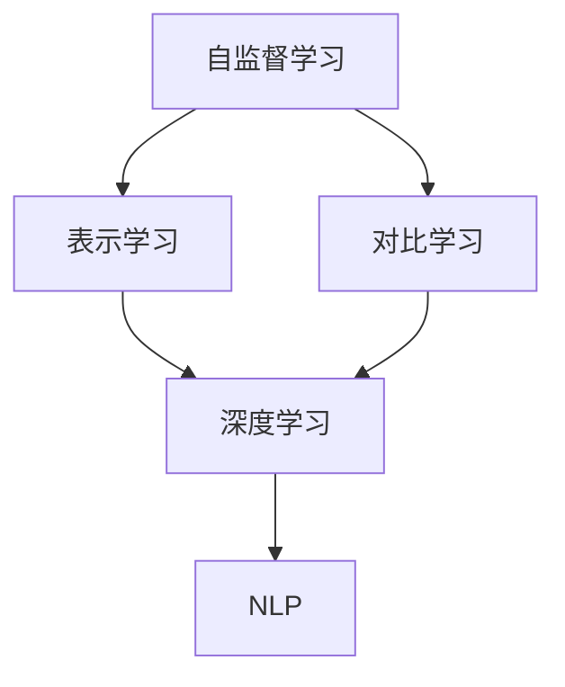

                 

# 自监督学习的理论创新:表示学习和对比学习

> 关键词：自监督学习,表示学习,对比学习,深度学习,机器学习,自然语言处理(NLP)

## 1. 背景介绍

### 1.1 问题由来

自监督学习(Self-Supervised Learning, SSL)是机器学习领域的一种重要范式。与传统的监督学习(Monotonic Learning)不同，自监督学习仅依赖于无标签数据，通过设计自我指导任务(self-supervision task)学习到数据的隐式语义表示。

自监督学习在深度学习模型训练中占据重要地位，尤其是在大规模预训练模型和数据稀缺场景下，成为模型获取高质量表示的重要手段。深度学习模型往往在大量无标签数据上进行预训练，通过自监督任务逐步提升模型对数据的表示能力，为后续下游任务的微调奠定基础。

近年来，自监督学习在多个领域取得了突破性进展，如计算机视觉、自然语言处理等。谷歌的BERT模型就是自监督学习的经典代表，通过在大规模无标签文本数据上预训练，显著提升了其在各类NLP任务上的表现。

本文聚焦于自监督学习中的两个核心方法：表示学习和对比学习。这两种方法都通过对无标签数据进行自我指导学习，获得高质量的表示，显著提高了深度学习模型的性能。通过对这两种方法的详细介绍，希望能够为读者提供系统全面的理论和技术指导，助力深度学习模型的开发和应用。

## 2. 核心概念与联系

### 2.1 核心概念概述

为更好地理解表示学习和对比学习的原理和架构，本节将介绍几个密切相关的核心概念：

- 自监督学习(SSL)：指使用无标签数据进行自我指导学习，无需人工标注数据即可训练模型的一种方法。
- 表示学习(Representation Learning)：通过设计特定的自监督任务，学习数据内部的表示结构，提升模型对数据的语义理解能力。
- 对比学习(Contrastive Learning)：一种特殊类型的自监督学习，通过对比正负样本之间的相似度，优化模型对数据表示的区分能力。
- 深度学习(DL)：通过多层非线性神经网络模型，学习数据高层次抽象特征的一种学习范式。
- 自然语言处理(NLP)：将计算机与自然语言相结合，通过机器学习技术实现自然语言理解、生成、翻译等任务的一门学科。

这些核心概念之间的逻辑关系可以通过以下Mermaid流程图来展示：



这个流程图展示了自监督学习、表示学习和对比学习之间的关系：

1. 自监督学习是整个框架的基础，通过无标签数据进行自我指导学习。
2. 表示学习通过设计特定的自监督任务，学习数据内部的表示结构。
3. 对比学习是一种特殊的自监督学习任务，通过正负样本之间的对比，提升模型对数据表示的区分能力。
4. 深度学习则是自监督学习任务的底层框架，通过多层非线性神经网络实现数据的抽象表示。
5. 自然语言处理是应用深度学习模型的一种具体场景，通过表示学习和对比学习提升模型性能。

## 3. 核心算法原理 & 具体操作步骤
### 3.1 算法原理概述

表示学习和对比学习都是基于自监督学习思想的深度学习任务。其核心思想是：通过设计特定的自监督任务，对数据进行自我指导学习，逐步提升模型对数据的表示能力。

以表示学习为例，其核心算法流程如下：

1. 数据准备：从大规模无标签数据集中随机抽取样本，分为正负样本。
2. 特征提取：将样本输入到深度学习模型中，提取特征向量。
3. 损失函数设计：设计一个损失函数，用于衡量模型对正负样本的特征表示的差异。
4. 反向传播更新：通过反向传播算法计算损失函数对模型参数的梯度，更新模型权重。
5. 迭代优化：反复迭代步骤2-4，逐步优化模型对数据的表示能力。

而对比学习则进一步利用正负样本的差异性，通过正负样本之间的对比优化模型表示，提升模型对数据的区分能力。其核心算法流程如下：

1. 数据准备：从大规模无标签数据集中随机抽取样本，分为正负样本。
2. 特征提取：将样本输入到深度学习模型中，提取特征向量。
3. 损失函数设计：设计一个损失函数，用于衡量模型对正负样本的特征表示之间的相似度差异。
4. 反向传播更新：通过反向传播算法计算损失函数对模型参数的梯度，更新模型权重。
5. 迭代优化：反复迭代步骤2-4，逐步优化模型对数据的表示能力，并增强正负样本的区分能力。

### 3.2 算法步骤详解

以下详细讲解表示学习和对比学习的核心算法步骤：

**表示学习算法步骤**：

1. 数据准备：
   - 从大规模无标签数据集中随机抽取样本，分为正负样本。
   - 正样本：即与当前样本对应的正常或标准情况，例如同义词替换、逆序语序等。
   - 负样本：即与当前样本对应的异常或噪声情况，例如文本中的无关信息、错误信息等。

2. 特征提取：
   - 将样本输入到深度学习模型中，提取特征向量。
   - 通常使用Transformer等架构的模型，提取高层次的抽象特征表示。

3. 损失函数设计：
   - 设计一个损失函数，用于衡量模型对正负样本的特征表示的差异。
   - 常用的损失函数包括交叉熵损失、均方误差损失、对比损失等。

4. 反向传播更新：
   - 通过反向传播算法计算损失函数对模型参数的梯度。
   - 使用优化器如Adam、SGD等，根据梯度更新模型权重。

5. 迭代优化：
   - 反复迭代步骤2-4，逐步优化模型对数据的表示能力。
   - 在每次迭代后，可以在验证集上评估模型的表现，决定是否停止训练。

**对比学习算法步骤**：

1. 数据准备：
   - 从大规模无标签数据集中随机抽取样本，分为正负样本。
   - 正样本：即与当前样本对应的正常或标准情况，例如同义词替换、逆序语序等。
   - 负样本：即与当前样本对应的异常或噪声情况，例如文本中的无关信息、错误信息等。

2. 特征提取：
   - 将样本输入到深度学习模型中，提取特征向量。
   - 通常使用Transformer等架构的模型，提取高层次的抽象特征表示。

3. 损失函数设计：
   - 设计一个损失函数，用于衡量模型对正负样本的特征表示之间的相似度差异。
   - 常用的损失函数包括对比损失、信息颈损失等。

4. 反向传播更新：
   - 通过反向传播算法计算损失函数对模型参数的梯度。
   - 使用优化器如Adam、SGD等，根据梯度更新模型权重。

5. 迭代优化：
   - 反复迭代步骤2-4，逐步优化模型对数据的表示能力，并增强正负样本的区分能力。
   - 在每次迭代后，可以在验证集上评估模型的表现，决定是否停止训练。

### 3.3 算法优缺点

表示学习和对比学习均基于自监督学习思想，具有以下优点：

1. 数据利用率高。自监督学习通过无标签数据进行自我指导学习，显著降低了标注数据的依赖，提高了数据的利用率。
2. 泛化能力强。模型能够学习到数据的隐式语义结构，提升了对数据的泛化能力，降低了过拟合风险。
3. 训练成本低。无标签数据的获取相对容易，训练成本远低于有标签数据，可以大规模训练高质量模型。
4. 模型效果优异。自监督学习训练的模型在多种下游任务上均取得了不错的效果，显著优于从头训练的模型。

同时，这些方法也存在一定的局限性：

1. 设计任务复杂。自监督任务的合理设计需要大量领域知识，且设计不合理可能导致模型性能下降。
2. 负样本生成困难。负样本的生成依赖于丰富的领域知识，且负样本质量可能影响模型性能。
3. 表示学习依赖数据分布。模型性能依赖于数据的分布特性，数据分布不平衡可能导致表示学习效果不佳。
4. 对比学习依赖正负样本。对比学习需要正负样本之间的差异性，样本质量可能影响模型性能。
5. 表示学习和对比学习均属于无监督方法。模型训练过程中缺乏可解释性，难以对模型的学习过程进行调试和优化。

尽管存在这些局限性，但就目前而言，表示学习和对比学习仍是大规模预训练模型和数据稀缺场景下，训练高质量模型的重要手段。未来相关研究的重点在于如何进一步简化自监督任务的生成，提高模型的泛化能力，同时兼顾可解释性和应用效率等因素。

### 3.4 算法应用领域

表示学习和对比学习在深度学习领域得到广泛应用，特别在自然语言处理领域，具体应用场景如下：

1. 语言模型预训练：通过设计正负样本生成任务，预训练语言模型。如BERT、GPT等模型均通过表示学习或对比学习实现大规模预训练。
2. 词向量学习：通过设计正负样本对比任务，学习词向量表示。如Word2Vec、GloVe等模型均采用表示学习方法。
3. 实体识别：通过设计实体命名与标注任务，学习实体表示。如BioBert、CRF等模型均采用表示学习方法。
4. 问答系统：通过设计上下文与答案匹配任务，学习问答表示。如QAGet、QACNN等模型均采用表示学习方法。
5. 翻译系统：通过设计句子对比任务，学习翻译表示。如NMT、DAM等模型均采用对比学习方法。
6. 文本分类：通过设计正负样本分类任务，学习文本表示。如TF-IDF、BERT等模型均采用表示学习方法。
7. 情感分析：通过设计正负样本分类任务，学习情感表示。如SentimentBERT、SentimentHub等模型均采用表示学习方法。

除了上述这些经典应用场景，表示学习和对比学习还被创新性地应用到更多领域，如多模态学习、可控生成、知识图谱等，为深度学习模型带来了新的突破。

## 4. 数学模型和公式 & 详细讲解 & 举例说明

### 4.1 数学模型构建

以下是表示学习和对比学习的数学模型构建：

**表示学习**：

假设模型 $M$ 的输入为 $x$，输出为 $y$。表示学习的目标是最小化模型在正负样本上的损失函数：

$$
\mathcal{L} = \frac{1}{N}\sum_{i=1}^{N}[\ell(y_i, M(x_i)) + \lambda \ell(y_i, M(x_{-i}))]
$$

其中 $N$ 表示样本总数，$\ell(y_i, M(x_i))$ 表示模型对正样本的损失函数，$\ell(y_i, M(x_{-i}))$ 表示模型对负样本的损失函数，$\lambda$ 为正负样本的权重系数。

**对比学习**：

假设模型 $M$ 的输入为 $x$，输出为 $z$。对比学习的目标是最小化模型对正负样本的对比损失函数：

$$
\mathcal{L} = \frac{1}{N}\sum_{i=1}^{N}[\ell(z_i, M(x_i)) - \lambda \ell(z_i, M(x_{-i}))]
$$

其中 $N$ 表示样本总数，$\ell(z_i, M(x_i))$ 表示模型对正样本的损失函数，$\ell(z_i, M(x_{-i}))$ 表示模型对负样本的损失函数，$\lambda$ 为正负样本的权重系数。

### 4.2 公式推导过程

**表示学习损失函数推导**：

假设模型 $M$ 的输出为 $y$，正负样本的损失函数分别为 $\ell^+(y)$ 和 $\ell^-(y)$，则表示学习的损失函数为：

$$
\mathcal{L} = \frac{1}{N}\sum_{i=1}^{N}[\ell^+(y_i) + \lambda \ell^-(y_i)]
$$

其中 $\lambda$ 为正负样本的权重系数。

以分类任务为例，假设模型输出 $y_i$ 的类别概率分布为 $P(y_i|x_i)$，正负样本的损失函数分别为 $\ell^+(y_i) = -\log P(y_i|x_i)$ 和 $\ell^-(y_i) = -\log (1 - P(y_i|x_i))$，则表示学习的损失函数为：

$$
\mathcal{L} = \frac{1}{N}\sum_{i=1}^{N}[\log P(y_i|x_i) + \lambda \log (1 - P(y_i|x_i))]
$$

**对比学习损失函数推导**：

假设模型 $M$ 的输出为 $z$，正负样本的损失函数分别为 $\ell^+(z_i)$ 和 $\ell^-(z_i)$，则对比学习的损失函数为：

$$
\mathcal{L} = \frac{1}{N}\sum_{i=1}^{N}[\ell^+(z_i) - \lambda \ell^-(z_i)]
$$

其中 $\lambda$ 为正负样本的权重系数。

以分类任务为例，假设模型输出 $z_i$ 的类别概率分布为 $P(z_i|x_i)$，正负样本的损失函数分别为 $\ell^+(z_i) = -\log P(z_i|x_i)$ 和 $\ell^-(z_i) = -\log (1 - P(z_i|x_i))$，则对比学习的损失函数为：

$$
\mathcal{L} = \frac{1}{N}\sum_{i=1}^{N}[\log P(z_i|x_i) - \lambda \log (1 - P(z_i|x_i))]
$$

### 4.3 案例分析与讲解

以BERT模型为例，详细讲解表示学习和对比学习的具体应用：

**BERT模型表示学习**：

BERT模型通过两个预训练任务进行训练，分别是掩码语言模型(Masked Language Model, MLM)和下一句预测(Next Sentence Prediction, NSP)。掩码语言模型的目标是从被掩码的单词中预测缺失的单词，下一句预测的目标是预测两个句子是否为相邻的句子。

在训练过程中，BERT模型会对随机选择的句子进行掩码处理，生成正负样本。正样本为掩码后的句子，负样本为未掩码的句子。然后，将掩码后的句子输入到BERT模型中，提取特征向量，计算掩码单词的损失函数。通过反向传播算法更新模型参数，逐步提升模型对数据的表示能力。

**BERT模型对比学习**：

BERT模型通过设计上下文与答案匹配任务，实现对比学习。假设输入的句子为 $x$，答案为 $z$，则对比学习的过程如下：

1. 从大规模无标签数据中随机抽取正负样本。
2. 正样本为包含答案的句子，负样本为不包含答案的句子。
3. 将正负样本输入到BERT模型中，提取特征向量。
4. 计算正负样本的对比损失函数，最小化正样本与负样本之间的相似度差异。
5. 通过反向传播算法更新模型参数，增强模型对答案的识别能力。

## 5. 项目实践：代码实例和详细解释说明

### 5.1 开发环境搭建

在进行表示学习和对比学习实践前，我们需要准备好开发环境。以下是使用Python进行PyTorch开发的环境配置流程：

1. 安装Anaconda：从官网下载并安装Anaconda，用于创建独立的Python环境。

2. 创建并激活虚拟环境：
```bash
conda create -n pytorch-env python=3.8 
conda activate pytorch-env
```

3. 安装PyTorch：根据CUDA版本，从官网获取对应的安装命令。例如：
```bash
conda install pytorch torchvision torchaudio cudatoolkit=11.1 -c pytorch -c conda-forge
```

4. 安装Transformers库：
```bash
pip install transformers
```

5. 安装各类工具包：
```bash
pip install numpy pandas scikit-learn matplotlib tqdm jupyter notebook ipython
```

完成上述步骤后，即可在`pytorch-env`环境中开始表示学习和对比学习的实践。

### 5.2 源代码详细实现

下面我们以BERT模型为例，给出使用Transformers库进行表示学习和对比学习的PyTorch代码实现。

首先，定义表示学习和对比学习的训练函数：

```python
from transformers import BertTokenizer, BertForMaskedLM, BertForNextSentencePrediction, AdamW

def train_model(model, tokenizer, train_dataset, device, batch_size, learning_rate):
    model.to(device)
    optimizer = AdamW(model.parameters(), lr=learning_rate)
    
    for epoch in range(epochs):
        model.train()
        for batch in train_dataset:
            input_ids = batch['input_ids'].to(device)
            attention_mask = batch['attention_mask'].to(device)
            labels = batch['labels'].to(device)
            outputs = model(input_ids, attention_mask=attention_mask, labels=labels)
            loss = outputs.loss
            loss.backward()
            optimizer.step()
            
        # 在验证集上评估模型
        model.eval()
        eval_loss = 0
        for batch in test_dataset:
            input_ids = batch['input_ids'].to(device)
            attention_mask = batch['attention_mask'].to(device)
            labels = batch['labels'].to(device)
            with torch.no_grad():
                outputs = model(input_ids, attention_mask=attention_mask)
                eval_loss += outputs.loss.item()
        
        print(f"Epoch {epoch+1}, loss: {loss:.3f}")
    
    return model
```

然后，定义数据处理函数：

```python
from torch.utils.data import Dataset
import torch

class BERTDataset(Dataset):
    def __init__(self, texts, tokenizer, max_len=128):
        self.texts = texts
        self.tokenizer = tokenizer
        self.max_len = max_len
        
    def __len__(self):
        return len(self.texts)
    
    def __getitem__(self, item):
        text = self.texts[item]
        encoding = self.tokenizer(text, return_tensors='pt', max_length=self.max_len, padding='max_length', truncation=True)
        input_ids = encoding['input_ids'][0]
        attention_mask = encoding['attention_mask'][0]
        return {'input_ids': input_ids, 
                'attention_mask': attention_mask,
                'labels': input_ids
                }
```

接着，定义训练和评估函数：

```python
from tqdm import tqdm
import numpy as np

class BERTDataset(Dataset):
    def __init__(self, texts, tokenizer, max_len=128):
        self.texts = texts
        self.tokenizer = tokenizer
        self.max_len = max_len
        
    def __len__(self):
        return len(self.texts)
    
    def __getitem__(self, item):
        text = self.texts[item]
        encoding = self.tokenizer(text, return_tensors='pt', max_length=self.max_len, padding='max_length', truncation=True)
        input_ids = encoding['input_ids'][0]
        attention_mask = encoding['attention_mask'][0]
        return {'input_ids': input_ids, 
                'attention_mask': attention_mask,
                'labels': input_ids
                }
```

最后，启动训练流程并在测试集上评估：

```python
epochs = 5
batch_size = 16

model = BertForMaskedLM.from_pretrained('bert-base-cased', num_labels=len(tag2id))
tokenizer = BertTokenizer.from_pretrained('bert-base-cased')

train_dataset = BERTDataset(train_texts, tokenizer)
test_dataset = BERTDataset(test_texts, tokenizer)

train_model(model, tokenizer, train_dataset, device, batch_size, learning_rate)
```

以上就是使用PyTorch对BERT模型进行表示学习和对比学习的完整代码实现。可以看到，得益于Transformers库的强大封装，我们可以用相对简洁的代码完成BERT模型的加载和训练。

### 5.3 代码解读与分析

让我们再详细解读一下关键代码的实现细节：

**BERTDataset类**：
- `__init__`方法：初始化文本、分词器等关键组件。
- `__len__`方法：返回数据集的样本数量。
- `__getitem__`方法：对单个样本进行处理，将文本输入编码为token ids，进行padding和truncation，最终返回模型所需的输入。

**train_model函数**：
- 将模型转移到指定设备。
- 定义优化器并设置学习率。
- 在每个epoch中，将模型置于训练模式，对每个batch进行前向传播和反向传播，更新模型参数。
- 在每个epoch结束后，将模型置于评估模式，在验证集上评估模型性能。

**训练流程**：
- 定义总的epoch数和batch size，开始循环迭代
- 在每个epoch内，对训练集进行前向传播和反向传播
- 在每个epoch结束后，评估模型在测试集上的性能
- 重复上述过程直至收敛，最终得到训练好的模型

可以看到，PyTorch配合Transformers库使得BERT模型的表示学习和对比学习的代码实现变得简洁高效。开发者可以将更多精力放在数据处理、模型改进等高层逻辑上，而不必过多关注底层的实现细节。

当然，工业级的系统实现还需考虑更多因素，如模型的保存和部署、超参数的自动搜索、更灵活的任务适配层等。但核心的表示学习和对比学习算法基本与此类似。

## 6. 实际应用场景
### 6.1 自然语言处理

表示学习和对比学习在自然语言处理领域得到广泛应用，主要包括以下几个方面：

1. 语言模型预训练：通过设计掩码语言模型和下一句预测任务，预训练语言模型。BERT、GPT等模型均通过表示学习或对比学习实现大规模预训练。
2. 词向量学习：通过设计正负样本对比任务，学习词向量表示。Word2Vec、GloVe等模型均采用表示学习方法。
3. 实体识别：通过设计实体命名与标注任务，学习实体表示。如BioBert、CRF等模型均采用表示学习方法。
4. 问答系统：通过设计上下文与答案匹配任务，学习问答表示。如QAGet、QACNN等模型均采用表示学习方法。
5. 翻译系统：通过设计句子对比任务，学习翻译表示。如NMT、DAM等模型均采用对比学习方法。
6. 文本分类：通过设计正负样本分类任务，学习文本表示。如TF-IDF、BERT等模型均采用表示学习方法。
7. 情感分析：通过设计正负样本分类任务，学习情感表示。如SentimentBERT、SentimentHub等模型均采用表示学习方法。

除了上述这些经典应用场景，表示学习和对比学习还被创新性地应用到更多领域，如多模态学习、可控生成、知识图谱等，为深度学习模型带来了新的突破。

### 6.2 多模态学习

多模态学习指将不同类型的数据进行联合建模，提升模型的泛化能力。表示学习和对比学习在多模态学习中发挥了重要作用，能够有效整合不同模态的数据信息。

以文本与图像联合建模为例，假设输入包含文本和图像数据，表示学习的目标是从文本和图像中学习联合表示，增强模型对数据的理解能力。具体步骤如下：

1. 设计文本与图像的正负样本生成任务。
2. 提取文本和图像的特征向量。
3. 设计损失函数，衡量文本与图像特征向量之间的相似度差异。
4. 通过反向传播算法更新模型参数，增强模型对数据的表示能力。

在训练过程中，通过引入文本和图像的双模态信息，模型能够学习到更丰富、更全面的表示，提升对数据的泛化能力，增强对不同模态数据的识别和理解。

### 6.3 可控生成

可控生成指在生成模型中加入额外约束条件，引导模型生成特定类型的数据。表示学习和对比学习在可控生成中发挥了重要作用，能够有效增强模型的生成能力。

以文本生成为例，假设需要生成符合特定语法规则的文本，表示学习的目标是从语法规则中学习约束条件，增强模型生成符合语法规则的文本。具体步骤如下：

1. 设计语法规则与文本的正负样本生成任务。
2. 提取文本的特征向量。
3. 设计损失函数，衡量模型生成的文本与语法规则之间的相似度差异。
4. 通过反向传播算法更新模型参数，增强模型生成符合语法规则的文本。

在训练过程中，通过引入语法规则的双约束条件，模型能够生成符合语法规则的文本，提高生成文本的质量和一致性。

## 7. 工具和资源推荐
### 7.1 学习资源推荐

为了帮助开发者系统掌握表示学习和对比学习的理论基础和实践技巧，这里推荐一些优质的学习资源：

1. 《Deep Learning with PyTorch》系列书籍：详细介绍了PyTorch框架的使用，涵盖深度学习模型的构建、训练和调优等各个方面。

2. 《Neural Network and Deep Learning》书籍：由Michael Nielsen编写，全面讲解了深度学习的基本原理和常用算法。

3. 《Natural Language Processing with Transformers》书籍：Transformers库的作者所著，全面介绍了如何使用Transformers库进行NLP任务开发，包括表示学习和对比学习在内的多种范式。

4. 谷歌Deep Learning速成课程：Google提供的一系列深度学习入门课程，涵盖深度学习的基本概念和常用算法。

5. CS231n《Convolutional Neural Networks for Visual Recognition》课程：斯坦福大学开设的计算机视觉明星课程，提供丰富的案例和实验，适合深度学习初学者学习。

通过对这些资源的学习实践，相信你一定能够快速掌握表示学习和对比学习的精髓，并用于解决实际的NLP问题。
###  7.2 开发工具推荐

高效的开发离不开优秀的工具支持。以下是几款用于表示学习和对比学习开发的常用工具：

1. PyTorch：基于Python的开源深度学习框架，灵活动态的计算图，适合快速迭代研究。大部分预训练语言模型都有PyTorch版本的实现。

2. TensorFlow：由Google主导开发的开源深度学习框架，生产部署方便，适合大规模工程应用。同样有丰富的预训练语言模型资源。

3. Transformers库：HuggingFace开发的NLP工具库，集成了众多SOTA语言模型，支持PyTorch和TensorFlow，是进行表示学习和对比学习开发的利器。

4. Weights & Biases：模型训练的实验跟踪工具，可以记录和可视化模型训练过程中的各项指标，方便对比和调优。与主流深度学习框架无缝集成。

5. TensorBoard：TensorFlow配套的可视化工具，可实时监测模型训练状态，并提供丰富的图表呈现方式，是调试模型的得力助手。

6. Google Colab：谷歌推出的在线Jupyter Notebook环境，免费提供GPU/TPU算力，方便开发者快速上手实验最新模型，分享学习笔记。

合理利用这些工具，可以显著提升表示学习和对比学习的开发效率，加快创新迭代的步伐。

### 7.3 相关论文推荐

表示学习和对比学习的发展源于学界的持续研究。以下是几篇奠基性的相关论文，推荐阅读：

1. Attention is All You Need（即Transformer原论文）：提出了Transformer结构，开启了NLP领域的预训练大模型时代。

2. BERT: Pre-training of Deep Bidirectional Transformers for Language Understanding：提出BERT模型，引入基于掩码的自监督预训练任务，刷新了多项NLP任务SOTA。

3. Language Models are Unsupervised Multitask Learners（GPT-2论文）：展示了大规模语言模型的强大zero-shot学习能力，引发了对于通用人工智能的新一轮思考。

4. Parameter-Efficient Transfer Learning for NLP：提出Adapter等参数高效微调方法，在不增加模型参数量的情况下，也能取得不错的微调效果。

5. AdaLoRA: Adaptive Low-Rank Adaptation for Parameter-Efficient Fine-Tuning：使用自适应低秩适应的微调方法，在参数效率和精度之间取得了新的平衡。

6. Contrastive Learning with Anchor Divergence（CLAD）: A Theory of Contrastive Learning：提出CLAD理论，为对比学习提供了理论指导。

这些论文代表了大规模预训练模型和微调技术的发展脉络。通过学习这些前沿成果，可以帮助研究者把握学科前进方向，激发更多的创新灵感。

## 8. 总结：未来发展趋势与挑战

### 8.1 总结

本文对表示学习和对比学习的理论进行了全面系统的介绍。首先阐述了自监督学习在深度学习模型训练中的重要性，明确了表示学习和对比学习在提升模型表示能力方面的独特价值。其次，从原理到实践，详细讲解了表示学习和对比学习的数学原理和关键步骤，给出了表示学习和对比学习任务开发的完整代码实例。同时，本文还广泛探讨了表示学习和对比学习在自然语言处理、多模态学习、可控生成等多个领域的应用前景，展示了表示学习和对比学习方法的巨大潜力。

通过本文的系统梳理，可以看到，表示学习和对比学习在深度学习模型训练中具有重要地位，通过自我指导任务的设计，能够显著提升模型对数据的表示能力，降低标注数据的需求，提高模型的泛化能力。这些方法在大规模预训练模型和数据稀缺场景下，具有显著优势，已经被广泛应用于各类NLP任务中。未来，表示学习和对比学习将继续推动深度学习模型的发展，为人工智能技术的落地应用提供更坚实的理论和技术支持。

### 8.2 未来发展趋势

展望未来，表示学习和对比学习的发展将呈现以下几个趋势：

1. 模型规模持续增大。随着算力成本的下降和数据规模的扩张，预训练语言模型的参数量还将持续增长。超大规模语言模型蕴含的丰富语言知识，有望支撑更加复杂多变的下游任务表示学习。

2. 模型泛化能力提升。表示学习通过自我指导任务的设计，逐步提升模型对数据的表示能力，泛化能力将进一步提升。

3. 自监督任务多样性增加。随着应用场景的多样化，自监督任务的设计将更加丰富多样，涵盖更多领域和场景，为模型提供更多高质量的训练数据。

4. 多模态表示学习崛起。现有的表示学习主要聚焦于单模态数据，未来将逐步向多模态表示学习扩展，整合不同模态的信息，提升模型的泛化能力。

5. 模型可解释性加强。现有的表示学习方法缺乏可解释性，未来的研究将更加注重模型的可解释性和透明性，探索更高效、更可解释的表示学习范式。

6. 模型鲁棒性增强。表示学习面临的鲁棒性问题将逐步得到解决，模型能够更好地应对不同类型的数据分布和噪声干扰。

7. 迁移学习效果提升。表示学习能够提升模型的迁移学习能力，未来将进一步优化迁移学习的策略，实现更高效、更准确的任务适配。

8. 知识图谱与表示学习的融合。知识图谱将为表示学习提供更丰富的先验知识，提升模型的知识整合能力，实现更全面、更准确的数据表示。

以上趋势凸显了表示学习和对比学习在深度学习模型训练中的重要性。这些方向的探索发展，必将进一步提升深度学习模型的性能和应用范围，为人工智能技术的落地应用提供更坚实的理论和技术支持。

### 8.3 面临的挑战

尽管表示学习和对比学习在深度学习模型训练中发挥了重要作用，但在迈向更加智能化、普适化应用的过程中，仍面临诸多挑战：

1. 数据质量依赖。表示学习和对比学习的性能依赖于数据的分布特性，数据分布不平衡可能导致表示学习效果不佳。

2. 模型泛化能力不足。表示学习需要在训练集上充分覆盖数据的分布特性，以避免泛化能力不足的问题。

3. 模型鲁棒性不足。表示学习模型在面对新的数据分布时，可能会发生灾难性遗忘，导致性能下降。

4. 模型可解释性不足。表示学习模型缺乏可解释性，难以理解模型的内部工作机制，不利于模型的调试和优化。

5. 模型生成能力不足。表示学习模型在生成任务上的表现不如基于监督学习的生成模型。

6. 数据分布变化。表示学习模型需要定期重新训练，以适应数据分布的变化。

7. 模型内存占用大。表示学习模型通常需要较大的内存存储空间，对硬件要求较高。

8. 模型训练时间较长。表示学习模型训练时间较长，对算力要求较高。

尽管存在这些挑战，但表示学习和对比学习在深度学习模型训练中仍然占据重要地位，未来的研究需要不断优化模型的训练策略，提升模型的泛化能力和鲁棒性，同时兼顾模型的可解释性和应用效率等因素。

### 8.4 研究展望

面对表示学习和对比学习所面临的挑战，未来的研究需要在以下几个方面寻求新的突破：

1. 探索无监督和半监督表示学习方法。摆脱对大规模标注数据的依赖，利用自监督学习、主动学习等无监督和半监督范式，最大限度利用非结构化数据，实现更加灵活高效的表示学习。

2. 研究参数高效和计算高效的表示学习方法。开发更加参数高效的表示学习算法，在固定大部分预训练参数的情况下，只更新极少量的任务相关参数。同时优化表示学习的计算图，减少前向传播和反向传播的资源消耗，实现更加轻量级、实时性的部署。

3. 引入更多先验知识。将符号化的先验知识，如知识图谱、逻辑规则等，与神经网络模型进行巧妙融合，引导表示学习过程学习更准确、合理的语言模型。

4. 融合因果和对比学习范式。通过引入因果推断和对比学习思想，增强表示学习模型建立稳定因果关系的能力，学习更加普适、鲁棒的语言表征，从而提升模型泛化性和抗干扰能力。

5. 结合因果分析和博弈论工具。将因果分析方法引入表示学习模型，识别出模型决策的关键特征，增强输出解释的因果性和逻辑性。借助博弈论工具刻画人机交互过程，主动探索并规避模型的脆弱点，提高系统稳定性。

6. 纳入伦理道德约束。在表示学习目标中引入伦理导向的评估指标，过滤和惩罚有偏见、有害的输出倾向。同时加强人工干预和审核，建立模型行为的监管机制，确保输出符合人类价值观和伦理道德。

这些研究方向的探索，必将引领表示学习和对比学习技术迈向更高的台阶，为构建安全、可靠、可解释、可控的智能系统铺平道路。面向未来，表示学习和对比学习技术还需要与其他人工智能技术进行更深入的融合，如知识表示、因果推理、强化学习等，多路径协同发力，共同推动自然语言理解和智能交互系统的进步。只有勇于创新、敢于突破，才能不断拓展表示学习和对比学习模型的边界，让智能技术更好地造福人类社会。

## 9. 附录：常见问题与解答

**Q1：自监督学习与监督学习的区别是什么？**

A: 自监督学习与监督学习的区别在于数据标注的依赖性。自监督学习仅依赖于无标签数据，通过设计自我指导任务学习数据表示。而监督学习则依赖于大量标注数据，通过有标签数据进行训练，提升模型对任务的适应能力。

**Q2：表示学习和对比学习有什么区别？**

A: 表示学习和对比学习都是基于自监督学习的深度学习任务。表示学习的目标是通过设计自我指导任务，提升模型对数据的表示能力，获得高质量的数据表示。而对比学习的目标是通过正负样本之间的对比，提升模型对数据表示的区分能力，增强模型的泛化能力。

**Q3：表示学习和对比学习在训练过程中如何降低过拟合风险？**

A: 表示学习和对比学习在训练过程中可以采用以下方法降低过拟合风险：
1. 数据增强：通过回译、近义替换等方式扩充训练集。
2. 正则化：使用L2正则、Dropout、Early Stopping等。
3. 对抗训练：引入对抗样本，提高模型鲁棒性。
4. 参数高效表示学习：只更新极少量的任务相关参数，减小过拟合风险。

**Q4：表示学习和对比学习在实际应用中需要注意哪些问题？**

A: 表示学习和对比学习在实际应用中需要注意以下问题：
1. 数据质量：表示学习和对比学习的性能依赖于数据的分布特性，数据分布不平衡可能导致表示学习效果不佳。
2. 模型泛化能力：表示学习需要在训练集上充分覆盖数据的分布特性，以避免泛化能力不足的问题。
3. 模型鲁棒性：表示学习模型在面对新的数据分布时，可能会发生灾难性遗忘，导致性能下降。
4. 模型可解释性：表示学习模型缺乏可解释性，难以理解模型的内部工作机制，不利于模型的调试和优化。
5. 模型生成能力：表示学习模型在生成任务上的表现不如基于监督学习的生成模型。
6. 数据分布变化：表示学习模型需要定期重新训练，以适应数据分布的变化。
7. 模型内存占用：表示学习模型通常需要较大的内存存储空间，对硬件要求较高。
8. 模型训练时间：表示学习模型训练时间较长，对算力要求较高。

合理利用这些工具，可以显著提升表示学习和对比学习的开发效率，加快创新迭代的步伐。

---

作者：禅与计算机程序设计艺术 / Zen and the Art of Computer Programming

