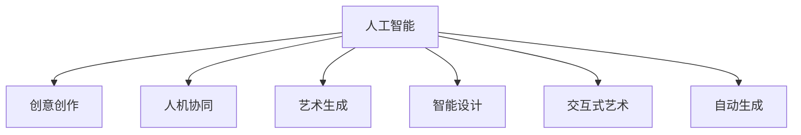

                 

# 艺术与科技的融合：人类计算激发创意

## 1. 背景介绍

在过去几十年中，科技与人文的融合一直是计算机科学领域的热点话题。科技为人文提供了解决问题的工具，而人文则为科技提供了创新与想象的空间。近年来，随着人工智能技术的兴起，这一融合趋势变得尤为明显。

AI不仅在传统的技术领域如医疗、金融、制造等领域展现了强大的能力，还逐渐渗透到了艺术、文化、创意产业等领域。人工智能的创造力不再是程序员独自探索的技术，而是跨学科合作的结果。本文旨在探讨人工智能如何激发创意，并展示其在艺术创作中的具体应用。

## 2. 核心概念与联系

### 2.1 核心概念概述

本节将介绍几个密切相关的核心概念，这些概念共同构成了人工智能激发创意的理论基础：

- **人工智能(AI)**：指通过计算机模拟人类智能行为的技术。人工智能涵盖了机器学习、深度学习、自然语言处理、计算机视觉等多个领域。

- **创意创作(Creative Production)**：指人类基于自身经验、情感、想象力等创造新的作品，如文学作品、音乐、绘画、设计等。

- **人机协同(Human-Machine Collaboration)**：指人类与机器通过交互、协同，共同完成复杂任务。AI技术为人机协同提供了新的途径，如自动生成音乐、图像、文本等。

- **艺术生成(Artistic Generation)**：指机器利用算法、模型生成具有美学价值的作品，如音乐、绘画、诗歌等。

- **智能设计(Intelligent Design)**：指AI技术辅助设计师进行创意设计，提高设计效率和创新性，如平面设计、建筑设计、服装设计等。

- **交互式艺术(Interactive Art)**：指利用交互技术，增强观众与作品的互动体验，如互动装置、虚拟现实艺术等。

- **自动生成(Automatic Generation)**：指AI模型自动生成新的作品，无需人类干预，如文本生成、图像生成、音乐生成等。

这些概念之间的逻辑关系可以通过以下Mermaid流程图来展示：



这个流程图展示了人工智能如何通过技术手段，为创意创作提供支持。人工智能不仅能够辅助人类进行设计，还能够独立生成艺术作品，拓展了人类创意的边界。

## 3. 核心算法原理 & 具体操作步骤

### 3.1 算法原理概述

人工智能激发创意的核心在于将机器学习与创意创作相结合。通过训练神经网络模型，使其能够从大量数据中学习到不同风格、主题、结构等创意元素，进而生成具有美学价值的新作品。

常见的创意创作算法包括：

- **生成对抗网络(Generative Adversarial Networks, GANs)**：通过对抗训练的方式，生成具有高度真实性的图像、音乐、文本等。

- **变分自编码器(Variational Autoencoders, VAEs)**：通过学习数据的概率分布，生成新的数据，适用于生成具有统计特征的艺术作品。

- **循环神经网络(Recurrent Neural Networks, RNNs)**：适用于生成序列数据，如音乐、文本、对话等，能够捕捉数据中的时间依赖关系。

- **转换器(Transformers)**：近年来在自然语言处理领域大放异彩，能够生成连贯、自然的文本，广泛应用于自动生成、聊天机器人等应用。

这些算法通过学习大量的训练数据，生成具有特定风格、主题的作品，极大地拓展了创意创作的边界。

### 3.2 算法步骤详解

以下是AI激发创意创作的一般步骤：

**Step 1: 准备数据集**
- 收集大量与目标创意创作任务相关的数据。例如，生成图像时可以使用图片库、艺术作品等，生成文本时可以使用小说、诗歌、新闻等。
- 对数据进行预处理，如清洗、标准化、分块等。

**Step 2: 设计模型架构**
- 选择适当的神经网络模型。如GANs、VAEs、RNNs、Transformers等，根据具体任务需求进行设计。
- 确定模型的输入输出结构，如生成图像的输入是随机噪声，输出是图像数据；生成文本的输入是随机噪声，输出是文本数据。

**Step 3: 训练模型**
- 使用准备好的数据集，对模型进行训练。训练过程需要反复迭代，调整模型参数以最小化损失函数。
- 使用验证集评估模型性能，调整模型参数。

**Step 4: 生成创意作品**
- 将随机噪声作为模型的输入，生成新的创意作品。
- 对生成的作品进行后处理，如图像增强、文本润色等。

**Step 5: 反馈与优化**
- 收集用户对生成作品的反馈，如评价、修改建议等。
- 根据反馈对模型进行优化，重新训练或调整模型参数。

### 3.3 算法优缺点

AI激发创意创作具有以下优点：

1. **高效性**：模型训练和生成速度快，能够在短时间内产出大量作品。
2. **多样性**：能够生成风格、主题多样化的作品，丰富创意创作的可能性。
3. **成本低**：相较于传统创意创作，无需大量人力物力投入，成本较低。
4. **创新性**：能够发现和探索人类未曾发现的创意形式和风格。

同时，该方法也存在一些局限性：

1. **缺乏人类情感**：生成的作品缺乏人类情感和深度，难以触及人类内心。
2. **技术依赖性强**：依赖高质量的数据集和算法，模型的效果受数据和算法质量影响较大。
3. **伦理问题**：生成作品可能带有偏见、有害信息，需注意伦理问题。
4. **版权争议**：生成的作品可能侵犯版权，需注意版权问题。

尽管存在这些局限性，AI激发创意创作仍是一种极具潜力的技术，为创意产业带来了新的可能性。

### 3.4 算法应用领域

AI激发创意创作的应用领域广泛，以下是一些典型的应用场景：

- **艺术创作**：如生成绘画、雕塑、音乐、电影等作品。通过训练GANs、VAEs等模型，生成具有美学价值的新作品。
- **平面设计**：如自动生成海报、包装、UI设计等。使用RNNs、Transformers等模型，生成创意设计方案。
- **服装设计**：如自动生成时装、饰品、面料等。使用VAEs、GANs等模型，生成具有时尚感的服装设计。
- **广告创意**：如自动生成广告文案、视频、图像等。使用RNNs、Transformers等模型，生成广告创意内容。
- **建筑设计**：如自动生成建筑设计方案、室内装饰等。使用GANs、VAEs等模型，生成具有创新性的建筑设计方案。

## 4. 数学模型和公式 & 详细讲解 & 举例说明

### 4.1 数学模型构建

在创意创作的AI模型中，常用的数学模型包括生成对抗网络(GANs)和变分自编码器(VAEs)。

GANs由两个神经网络组成：生成器和判别器。生成器的任务是将随机噪声转换为具有特定风格的图像、音乐、文本等；判别器的任务是判断输入数据是否为真实数据。模型的训练过程是一个对抗过程，生成器和判别器互相博弈，最终生成具有高度真实性的作品。

VAEs通过学习数据的概率分布，生成新的数据。VAEs由编码器和解码器两部分组成。编码器将输入数据压缩为低维编码，解码器将编码转换为新的数据。模型的训练过程是优化编码器和解码器之间的损失函数。

### 4.2 公式推导过程

以下是GANs和VAEs的基本公式推导：

**GANs**

生成器 $G$ 将随机噪声 $z$ 转换为图像 $x$：

$$ x = G(z) $$

判别器 $D$ 判断输入数据 $x$ 是否为真实数据：

$$ D(x) = \begin{cases}
1 & \text{if } x \text{ is real} \\
0 & \text{if } x \text{ is fake}
\end{cases} $$

GANs的目标函数为：

$$ \max_{G} \min_{D} V(D,G) = \min_{D} \max_{G} E_{x} [\log D(x)] + E_{z} [\log (1-D(G(z)))] $$

其中，$E_x$ 表示真实数据的期望，$E_z$ 表示生成数据的期望。

**VAEs**

VAEs由编码器 $E$ 和解码器 $D$ 组成。编码器将输入数据 $x$ 转换为编码 $z$：

$$ z = E(x) $$

解码器将编码 $z$ 转换为新的数据 $\hat{x}$：

$$ \hat{x} = D(z) $$

VAEs的目标函数为：

$$ \min_{E,D} KL(E(z)||p(z)) + E_{x} [\|x - D(E(x))\|^2] $$

其中，$KL(E(z)||p(z))$ 表示编码 $z$ 与标准正态分布之间的KL散度，$E_x[\|x - D(E(x))\|^2]$ 表示重建误差。

### 4.3 案例分析与讲解

以下是一个使用GANs生成艺术作品的案例：

- **数据准备**：使用Museums of Modern Art (MoMA)博物馆的图像数据集，包含大量不同风格的艺术作品。
- **模型设计**：使用DCGAN（一种改进的GANs）模型，包含卷积层、全连接层等，能够生成高分辨率的图像。
- **训练模型**：使用GPU进行训练，迭代次数设置为100，学习率设置为0.0002。
- **生成作品**：使用训练好的模型生成新的艺术作品，并进行后处理，如色彩增强、细节处理等。

## 5. 项目实践：代码实例和详细解释说明

### 5.1 开发环境搭建

在进行创意创作项目实践前，需要准备好开发环境。以下是使用Python进行TensorFlow和Keras开发的环境配置流程：

1. 安装Anaconda：从官网下载并安装Anaconda，用于创建独立的Python环境。

2. 创建并激活虚拟环境：
```bash
conda create -n tf-env python=3.8 
conda activate tf-env
```

3. 安装TensorFlow和Keras：
```bash
pip install tensorflow
pip install keras
```

4. 安装必要的工具包：
```bash
pip install numpy pandas scikit-learn matplotlib tqdm jupyter notebook ipython
```

完成上述步骤后，即可在`tf-env`环境中开始项目实践。

### 5.2 源代码详细实现

以下是使用Keras实现GANs生成艺术作品的代码实现：

```python
import tensorflow as tf
from tensorflow.keras import layers
from tensorflow.keras.datasets import mnist

# 加载MNIST数据集
(x_train, y_train), (x_test, y_test) = mnist.load_data()

# 数据预处理
x_train = x_train / 255.0
x_test = x_test / 255.0

# 定义生成器
def make_generator_model():
    model = tf.keras.Sequential()
    model.add(layers.Dense(256, use_bias=False, input_shape=(100,)))
    model.add(layers.BatchNormalization())
    model.add(layers.LeakyReLU())
    model.add(layers.Dense(512))
    model.add(layers.BatchNormalization())
    model.add(layers.LeakyReLU())
    model.add(layers.Dense(784, activation='tanh'))
    return model

# 定义判别器
def make_discriminator_model():
    model = tf.keras.Sequential()
    model.add(layers.Flatten(input_shape=(28, 28)))
    model.add(layers.Dense(256, activation='relu'))
    model.add(layers.Dropout(0.3))
    model.add(layers.Dense(1, activation='sigmoid'))
    return model

# 训练GANs模型
def train_gan(train_data, epochs, batch_size):
    # 定义生成器和判别器
    generator = make_generator_model()
    discriminator = make_discriminator_model()

    # 定义联合损失函数
    cross_entropy = tf.keras.losses.BinaryCrossentropy(from_logits=True)

    def generator_loss(fake_output):
        return cross_entropy(tf.ones_like(fake_output), fake_output)

    def discriminator_loss(real_output, fake_output):
        real_loss = cross_entropy(tf.ones_like(real_output), real_output)
        fake_loss = cross_entropy(tf.zeros_like(fake_output), fake_output)
        total_loss = real_loss + fake_loss
        return total_loss

    # 训练模型
    for epoch in range(epochs):
        for batch in train_data:
            # 训练生成器
            noise = tf.random.normal([batch_size, 100])
            with tf.GradientTape() as gen_tape:
                generated_images = generator(noise, training=True)
                gen_loss = generator_loss(discriminator(generated_images))
            gradients_of_generator = gen_tape.gradient(gen_loss, generator.trainable_variables)
            optimizer.apply_gradients(zip(gradients_of_generator, generator.trainable_variables))

            # 训练判别器
            real_images = train_data[0]
            with tf.GradientTape() as disc_tape:
                real_loss = discriminator_loss(discriminator(real_images, training=True), tf.ones_like(discriminator(real_images)))
                fake_loss = discriminator_loss(discriminator(generated_images, training=True), tf.zeros_like(discriminator(generated_images)))
                total_loss = real_loss + fake_loss
            gradients_of_discriminator = disc_tape.gradient(total_loss, discriminator.trainable_variables)
            optimizer.apply_gradients(zip(gradients_of_discriminator, discriminator.trainable_variables))

        # 打印训练结果
        print('Epoch %d/%d' % (epoch + 1, epochs))
        print('discriminator loss:', real_loss.numpy() + fake_loss.numpy())
        print('generator loss:', gen_loss.numpy())

# 生成艺术作品
def generate_artistic_works(generator, noise):
    generated_images = generator(noise, training=False)
    return generated_images

# 生成100幅艺术作品
generator = make_generator_model()
noise = tf.random.normal([100, 100])
artistic_works = generate_artistic_works(generator, noise)
```

以上是使用Keras实现GANs生成艺术作品的完整代码实现。可以看到，Keras的高级API使得模型构建和训练变得简洁高效。开发者可以将更多精力放在数据处理、模型优化等高层逻辑上，而不必过多关注底层的实现细节。

### 5.3 代码解读与分析

让我们再详细解读一下关键代码的实现细节：

**make_generator_model和make_discriminator_model函数**：
- 定义生成器和判别器的结构，包含全连接层、批标准化、LeakyReLU激活函数等。

**train_gan函数**：
- 加载数据集，进行预处理。
- 定义生成器和判别器的损失函数。
- 定义联合损失函数，结合生成器和判别器的损失。
- 训练模型，交替训练生成器和判别器，最小化联合损失函数。
- 打印训练结果，记录判别器和生成器的损失。

**generate_artistic_works函数**：
- 使用训练好的生成器模型，将随机噪声作为输入，生成新的艺术作品。

**生成100幅艺术作品**：
- 使用训练好的生成器模型，生成100幅艺术作品，并进行后处理。

可以看到，Keras的高级API使得模型构建和训练变得简洁高效。开发者可以将更多精力放在数据处理、模型优化等高层逻辑上，而不必过多关注底层的实现细节。

## 6. 实际应用场景

### 6.1 艺术创作

GANs和VAEs已经被广泛应用于艺术创作领域，生成各种风格的艺术作品。例如，使用GANs生成绘画、雕塑、音乐等作品，使用VAEs生成数字艺术、插画等作品。这些作品不仅具有高度的真实性，还蕴含着丰富的创意和情感。

### 6.2 平面设计

在平面设计领域，GANs和VAEs也得到了广泛应用。例如，自动生成海报、包装、UI设计等。通过训练模型，生成具有独特风格的设计方案，设计师可以借鉴这些方案进行创作。

### 6.3 服装设计

在服装设计领域，VAEs和GANs被用于生成时装、饰品、面料等。通过训练模型，生成具有时尚感的服装设计，设计师可以从中获得灵感，进行设计创新。

### 6.4 广告创意

在广告创意领域，GANs和VAEs被用于生成广告文案、视频、图像等。通过训练模型，生成具有吸引力的广告内容，提高广告效果。

### 6.5 建筑设计

在建筑设计领域，GANs和VAEs被用于生成建筑设计方案、室内装饰等。通过训练模型，生成具有创新性的建筑设计方案，设计师可以从中获得灵感，进行设计创新。

## 7. 工具和资源推荐

### 7.1 学习资源推荐

为了帮助开发者系统掌握AI激发创意的理论基础和实践技巧，这里推荐一些优质的学习资源：

1. **《深度学习》**：Ian Goodfellow、Yoshua Bengio、Aaron Courville合著的经典教材，全面介绍了深度学习的基本概念和算法。

2. **《生成对抗网络》**：Ian Goodfellow、Jean Pouget-Abadie、Mehdi Mirza等人的论文，提出GANs的原理和方法，是GANs研究的奠基之作。

3. **《变分自编码器》**：Diederik P Kingma、Max Welling的论文，提出VAEs的原理和方法，是VAEs研究的奠基之作。

4. **TensorFlow和Keras官方文档**：官方文档提供了详细的模型构建、训练、评估等操作指南，是学习TensorFlow和Keras的重要资源。

5. **《神经网络与深度学习》**：Michael Nielsen的在线课程，系统介绍了神经网络的基本原理和深度学习的应用。

6. **Kaggle数据集和竞赛**：Kaggle提供大量数据集和竞赛，可以参与实战练习，提升技能。

通过对这些资源的学习实践，相信你一定能够快速掌握AI激发创意的精髓，并用于解决实际的创意创作问题。

### 7.2 开发工具推荐

高效的开发离不开优秀的工具支持。以下是几款用于AI激发创意创作的常用工具：

1. **TensorFlow**：由Google主导开发的深度学习框架，支持分布式计算，生产部署方便，适合大规模工程应用。

2. **Keras**：由François Chollet开发的高级深度学习API，简洁易用，可以快速构建和训练模型。

3. **PyTorch**：由Facebook主导开发的深度学习框架，灵活高效，适合快速迭代研究。

4. **Jupyter Notebook**：基于Web的交互式开发环境，支持Python代码、数学公式、图形等多媒体内容，适合科研和教学。

5. **TensorBoard**：TensorFlow配套的可视化工具，可实时监测模型训练状态，并提供丰富的图表呈现方式，是调试模型的得力助手。

6. **Weights & Biases**：模型训练的实验跟踪工具，可以记录和可视化模型训练过程中的各项指标，方便对比和调优。

合理利用这些工具，可以显著提升AI激发创意创作的开发效率，加快创新迭代的步伐。

### 7.3 相关论文推荐

AI激发创意创作的应用领域广泛，以下是几篇奠基性的相关论文，推荐阅读：

1. **《Image-to-Image Translation with Conditional Adversarial Networks》**：Isaac Lohen、Dani Sussman、Alexander A. Efros等人提出的GANs图像生成方法，是GANs研究的经典之作。

2. **《Learning to Generate Text with Recurrent Neural Networks》**：Ian Goodfellow等人提出的RNNs文本生成方法，是RNNs在自然语言处理中的应用范例。

3. **《Generating Musical Compositions with Recurrent Neural Networks》**：Aaron van den Oord、Sergey V. Ethanol、Nal Kalchbrenner等人提出的RNNs音乐生成方法，是RNNs在音乐生成中的应用范例。

4. **《The Unreasonable Effectiveness of Transfer Learning》**：Andrew Ng等人提出的迁移学习理论，是迁移学习在深度学习中的应用范例。

5. **《Neural Architecture Search with Reinforcement Learning》**：Joan Bruna、Wojciech Zaremba、Yann LeCun等人提出的神经架构搜索方法，是AI激发创意创作的新方向。

这些论文代表了大语言模型微调技术的发展脉络。通过学习这些前沿成果，可以帮助研究者把握学科前进方向，激发更多的创新灵感。

## 8. 总结：未来发展趋势与挑战

### 8.1 总结

本文对AI激发创意创作的方法进行了全面系统的介绍。首先阐述了AI在创意创作中的应用背景和意义，明确了AI激发创意创作的重要性和潜力。其次，从原理到实践，详细讲解了GANs和VAEs等核心算法的数学原理和关键步骤，给出了AI激发创意创作的完整代码实现。同时，本文还广泛探讨了AI激发创意创作在艺术创作、平面设计、服装设计、广告创意、建筑设计等多个行业领域的应用前景，展示了AI激发创意创作的广阔前景。最后，本文精选了AI激发创意创作的各类学习资源，力求为读者提供全方位的技术指引。

通过本文的系统梳理，可以看到，AI激发创意创作已经成为计算机科学与艺术创作深度融合的重要手段，为创意产业带来了新的可能性。未来，伴随AI技术的不断演进，AI激发创意创作必将在更多领域得到应用，为人类创意创作注入新的活力。

### 8.2 未来发展趋势

展望未来，AI激发创意创作将呈现以下几个发展趋势：

1. **技术创新**：新的算法和技术不断涌现，如GANs变体、VAEs改进、神经网络新架构等，将进一步提升创意创作的效果和效率。

2. **跨领域融合**：AI激发创意创作将与其他技术融合，如自然语言处理、计算机视觉、人机交互等，拓展创意创作的应用范围。

3. **人机协同**：人机协同将更加紧密，人工智能将作为创作工具，为人类提供更多创意灵感。

4. **智能化创作**：AI将具备更高程度的智能化，能够自动发现创意规律，生成高质量的作品。

5. **个性化创作**：AI将具备更高的个性化能力，能够根据用户需求生成独特的创意作品。

6. **开放性创作**：AI将具备更高的开放性，能够应对不同风格、主题、流派的创意创作需求。

以上趋势凸显了AI激发创意创作的广阔前景。这些方向的探索发展，必将进一步提升创意创作的智能化水平，拓展创意创作的边界，为人类创意产业带来新的变革。

### 8.3 面临的挑战

尽管AI激发创意创作已经取得了瞩目成就，但在迈向更加智能化、普适化应用的过程中，它仍面临着诸多挑战：

1. **技术复杂性**：AI激发创意创作的技术复杂性较高，需要多学科的知识背景和较强的算法理解能力。

2. **创意瓶颈**：AI生成作品缺乏深度情感和人类创意，难以触及人类内心，仍需人类创意的辅助。

3. **伦理问题**：生成的作品可能带有偏见、有害信息，需注意伦理问题。

4. **版权问题**：生成的作品可能侵犯版权，需注意版权问题。

5. **创意质量**：生成的作品质量不稳定，需要人工干预和优化。

6. **资源消耗**：AI激发创意创作需要大量计算资源和存储空间，需考虑资源优化问题。

尽管存在这些挑战，AI激发创意创作仍是一种极具潜力的技术，为创意产业带来了新的可能性。相信随着学界和产业界的共同努力，这些挑战终将一一被克服，AI激发创意创作必将在构建人机协同的智能时代中扮演越来越重要的角色。

### 8.4 研究展望

面对AI激发创意创作所面临的种种挑战，未来的研究需要在以下几个方面寻求新的突破：

1. **多模态融合**：将视觉、语音、文本等多种模态信息融合，生成更加全面、多样化的创意作品。

2. **个性化创作**：通过引入用户画像、偏好等信息，生成个性化的创意作品，满足不同用户的需求。

3. **智能化创作**：通过引入因果推理、强化学习等技术，提升AI的智能化水平，生成更具创意的作品。

4. **伦理道德约束**：在模型训练目标中引入伦理导向的评估指标，过滤和惩罚有偏见、有害的输出倾向。

5. **开放性创作**：通过引入用户反馈和建议，不断优化模型，生成更加开放、多样化的创意作品。

这些研究方向的探索，必将引领AI激发创意创作技术迈向更高的台阶，为人类创意产业带来新的变革。面向未来，AI激发创意创作需要与其他技术进行更深入的融合，如自然语言处理、计算机视觉、人机交互等，多路径协同发力，共同推动创意产业的发展。

## 9. 附录：常见问题与解答

**Q1：AI激发创意创作的局限性有哪些？**

A: AI激发创意创作的局限性主要包括：

1. 技术复杂性较高，需要多学科的知识背景和较强的算法理解能力。
2. 生成的作品缺乏深度情感和人类创意，难以触及人类内心。
3. 可能带有偏见、有害信息，需注意伦理问题。
4. 可能侵犯版权，需注意版权问题。
5. 生成的作品质量不稳定，需要人工干预和优化。
6. 需要大量计算资源和存储空间，需考虑资源优化问题。

尽管存在这些局限性，AI激发创意创作仍是一种极具潜力的技术，为创意产业带来了新的可能性。

**Q2：AI激发创意创作的应用场景有哪些？**

A: AI激发创意创作的应用场景包括：

1. 艺术创作：生成绘画、雕塑、音乐等作品。
2. 平面设计：自动生成海报、包装、UI设计等。
3. 服装设计：生成时装、饰品、面料等。
4. 广告创意：自动生成广告文案、视频、图像等。
5. 建筑设计：生成建筑设计方案、室内装饰等。

这些应用场景展示了AI激发创意创作的广阔前景，未来还有更多可能性。

**Q3：如何训练高品质的AI激发创意创作模型？**

A: 训练高品质的AI激发创意创作模型需要以下步骤：

1. 收集大量与目标创意创作任务相关的数据。
2. 设计合适的模型架构，选择适当的神经网络模型，如GANs、VAEs等。
3. 定义合适的损失函数，优化算法，训练模型。
4. 进行模型评估和优化，调整模型参数。
5. 使用训练好的模型生成新的创意作品，并进行后处理，如色彩增强、细节处理等。

以上步骤需要根据具体任务和数据特点进行灵活组合，确保生成高质量的作品。

**Q4：AI激发创意创作的技术发展方向有哪些？**

A: AI激发创意创作的技术发展方向包括：

1. 技术创新：新的算法和技术不断涌现，如GANs变体、VAEs改进、神经网络新架构等，将进一步提升创意创作的效果和效率。

2. 跨领域融合：AI激发创意创作将与其他技术融合，如自然语言处理、计算机视觉、人机交互等，拓展创意创作的应用范围。

3. 人机协同：人机协同将更加紧密，人工智能将作为创作工具，为人类提供更多创意灵感。

4. 智能化创作：AI将具备更高程度的智能化，能够自动发现创意规律，生成高质量的作品。

5. 个性化创作：通过引入用户画像、偏好等信息，生成个性化的创意作品，满足不同用户的需求。

6. 开放性创作：通过引入用户反馈和建议，不断优化模型，生成更加开放、多样化的创意作品。

这些研究方向将引领AI激发创意创作技术迈向更高的台阶，为创意产业带来新的变革。

---

作者：禅与计算机程序设计艺术 / Zen and the Art of Computer Programming

