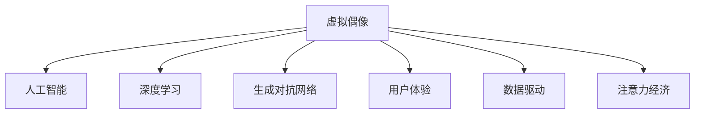

                 

# 虚拟偶像在注意力经济中的崛起

> 关键词：虚拟偶像,注意力经济,人工智能,深度学习,生成对抗网络,用户体验,数据驱动

## 1. 背景介绍

### 1.1 问题由来

随着数字技术的发展，传统的偶像文化与虚拟现实、人工智能等前沿技术的结合，催生了虚拟偶像这一新兴事物。虚拟偶像，简称为Vidoe Idol，是指由计算机算法生成、具备一定音乐、舞蹈等娱乐特性的虚拟形象，代表作品有日本虚拟偶像初音未来（Hatsune Miku）、中国虚拟偶像洛天依等。

虚拟偶像的出现，不仅仅是一次技术上的突破，更是一场商业模式和文化形态的变革。传统的明星偶像经济以人的关注和消费为基础，而虚拟偶像则通过技术手段将人的关注转化为了数据的价值，进而通过数据驱动实现商业变现。随着5G、物联网等新一代信息技术的普及，虚拟偶像也从单一的在线演唱会和偶像互动拓展到了视频游戏、智能家居等多个领域，成为未来注意力经济的重要参与者。

### 1.2 问题核心关键点

虚拟偶像在注意力经济中的崛起，主要基于以下几个核心关键点：

- **技术支持**：依赖人工智能、深度学习、生成对抗网络（GAN）等前沿技术，让虚拟偶像具备逼真的音乐、舞蹈、互动能力。
- **用户互动**：通过虚拟偶像与用户的高频互动，形成持续的注意力循环，实现商业变现。
- **数据驱动**：利用大数据技术对用户行为进行分析，精准定位用户需求，提升用户体验和忠诚度。
- **跨界融合**：结合各类智能设备和平台，拓展虚拟偶像的应用场景和市场范围。

理解这些核心关键点，有助于我们把握虚拟偶像在注意力经济中的崛起路径和发展潜力。

## 2. 核心概念与联系

### 2.1 核心概念概述

为更好地理解虚拟偶像在注意力经济中的应用，本节将介绍几个密切相关的核心概念：

- **虚拟偶像**：指由计算机算法生成的具有音乐、舞蹈等娱乐特性的虚拟形象。虚拟偶像通过展示虚拟演出、参与游戏、发布原创音乐等方式吸引用户关注和消费。
- **注意力经济**：一种以用户的注意力为商品的经济模式，通过集中注意力获取高附加值收益，如广告、付费内容、品牌赞助等。
- **人工智能**：一种模拟人类智能行为的计算机技术，包括机器学习、深度学习、自然语言处理等子领域，驱动了虚拟偶像的生成、交互和个性化推荐。
- **深度学习**：基于神经网络的机器学习技术，可以处理非结构化数据，应用于虚拟偶像的图像、音频生成和情感分析。
- **生成对抗网络（GAN）**：一种通过对抗训练生成高质量虚拟内容的技术，用于虚拟偶像的逼真图像和音频生成。
- **用户体验（UX）**：指用户与虚拟偶像互动的感知和反馈，通过优化互动体验提升用户粘性和忠诚度。
- **数据驱动**：利用大数据技术对用户行为进行分析，优化推荐算法和个性化服务。

这些核心概念之间的逻辑关系可以通过以下Mermaid流程图来展示：



这个流程图展示了一些核心概念及其之间的关系：

1. 虚拟偶像通过人工智能、深度学习和生成对抗网络等技术手段，生成逼真的音乐、舞蹈、互动内容。
2. 这些生成的内容通过深度学习优化，形成独特的虚拟偶像形象。
3. 虚拟偶像与用户通过自然语言处理、情感分析等技术进行高频率互动，提升用户体验。
4. 通过大数据技术分析用户行为，实现精准推荐和个性化服务，提升用户粘性。
5. 虚拟偶像的互动内容吸引了用户的注意力，形成注意力经济。

这些概念共同构成了虚拟偶像的商业模式和运作机制，使其在注意力经济中得以崛起。

## 3. 核心算法原理 & 具体操作步骤
### 3.1 算法原理概述

虚拟偶像在注意力经济中的崛起，核心算法原理主要涉及以下几个方面：

- **用户生成内容（UGC）算法**：通过用户生成内容收集用户反馈，优化虚拟偶像的生成和互动内容。
- **推荐系统算法**：利用协同过滤、内容推荐等算法，根据用户的历史行为推荐虚拟偶像的表演和互动内容。
- **情感分析算法**：分析用户在虚拟偶像互动过程中的情感变化，提升互动的个性化和精准度。
- **用户行为预测算法**：通过时间序列分析等方法，预测用户未来的行为，实现精准推送。
- **生成对抗网络（GAN）算法**：通过对抗训练生成高质量的虚拟偶像图像和音频内容。

这些算法的原理和操作细节在本节将详细介绍。

### 3.2 算法步骤详解

虚拟偶像在注意力经济中的崛起，主要分为以下几个关键步骤：

**Step 1: 数据收集与预处理**

1. 通过网络爬虫、社交媒体等渠道收集虚拟偶像的用户互动数据，包括评论、点赞、分享等。
2. 对收集的数据进行清洗和预处理，去除噪声和冗余信息，提取有用的特征。
3. 将清洗后的数据转化为向量形式，用于后续的算法模型训练。

**Step 2: 生成虚拟偶像内容**

1. 使用深度学习模型，如变分自编码器（VAE）、生成对抗网络（GAN）等，生成逼真的虚拟偶像图像和音频。
2. 对生成的内容进行优化和调整，使其符合虚拟偶像的独特风格和用户偏好。
3. 利用用户生成的内容，对虚拟偶像的生成模型进行微调，提升其生成效果和个性化水平。

**Step 3: 用户互动与反馈收集**

1. 通过API接口将虚拟偶像的互动内容推送给用户，收集用户的互动反馈。
2. 利用情感分析算法，分析用户反馈中的情感变化，识别用户的满意度和偏好。
3. 根据用户反馈，优化虚拟偶像的生成和互动内容，提升用户体验。

**Step 4: 个性化推荐**

1. 利用协同过滤、内容推荐等算法，对用户的互动行为进行建模，预测用户未来的兴趣。
2. 根据用户的兴趣和偏好，推荐虚拟偶像的表演和互动内容。
3. 定期更新推荐算法模型，保证推荐内容的及时性和个性化。

**Step 5: 用户行为分析**

1. 利用时间序列分析、聚类分析等方法，对用户的行为进行建模，识别出用户的行为模式和偏好。
2. 根据用户的行为模式，预测用户的未来行为，实现精准推送。
3. 定期更新用户行为模型，保证分析结果的准确性和及时性。

**Step 6: 数据驱动商业变现**

1. 根据用户的行为和偏好，制定针对性的商业策略，如广告、付费内容、品牌赞助等。
2. 利用大数据技术，对商业策略的效果进行实时监测和评估，优化广告投放和内容推送。
3. 根据商业策略的效果和用户反馈，不断调整和优化商业策略，提升商业变现效果。

### 3.3 算法优缺点

虚拟偶像在注意力经济中的崛起，依赖于上述算法的应用，但这些算法也存在一定的优缺点：

**优点**：

- **个性化推荐**：通过用户互动和行为分析，实现精准的个性化推荐，提升用户粘性。
- **高互动性**：利用深度学习、GAN等技术生成逼真的互动内容，提升用户互动体验。
- **用户生成内容（UGC）**：利用用户生成内容进行模型优化，实现内容的持续更新和丰富。

**缺点**：

- **隐私风险**：用户行为数据的收集和分析，可能涉及用户隐私风险，需严格遵守数据保护法规。
- **技术复杂性**：算法模型设计复杂，实现难度较大，需要具备一定的技术实力和资源投入。
- **用户依赖**：过于依赖用户互动和行为数据，可能造成用户流失和商业风险。

尽管存在这些缺点，但虚拟偶像在注意力经济中的应用潜力依然巨大，通过持续优化和创新，可以克服这些挑战，实现更大的商业价值。

### 3.4 算法应用领域

虚拟偶像在注意力经济中的应用领域十分广泛，主要包括以下几个方面：

- **在线演唱会**：通过虚拟偶像进行音乐表演，吸引用户观看和打赏。
- **视频游戏**：将虚拟偶像设计为游戏中的角色，提升用户的游戏体验和粘性。
- **智能家居**：将虚拟偶像与智能家居设备结合，提供语音控制和互动功能。
- **广告和品牌合作**：利用虚拟偶像进行品牌代言和广告推广，提升品牌的曝光度和影响力。
- **教育培训**：利用虚拟偶像进行语言学习、技能培训等，提升教育效果和用户参与度。
- **社交媒体**：通过虚拟偶像在社交媒体上进行互动，吸引粉丝关注和参与。

以上应用领域展示了虚拟偶像在注意力经济中的广泛应用，通过技术手段实现用户互动和商业变现。

## 4. 数学模型和公式 & 详细讲解 & 举例说明（备注：数学公式请使用latex格式，latex嵌入文中独立段落使用 $$，段落内使用 $)
### 4.1 数学模型构建

虚拟偶像在注意力经济中的崛起，涉及多个数学模型，主要包括以下几个方面：

- **用户行为预测模型**：利用时间序列分析等方法，对用户的行为进行建模和预测。
- **推荐系统模型**：利用协同过滤、内容推荐等算法，实现个性化推荐。
- **情感分析模型**：利用情感词典、深度学习等方法，分析用户的情感变化。
- **生成对抗网络（GAN）模型**：通过对抗训练生成高质量的虚拟偶像内容。

下面将详细介绍这些模型的构建和应用。

### 4.2 公式推导过程

**用户行为预测模型**：

利用时间序列分析方法，将用户的行为建模为时间序列数据。设用户的行为序列为 $X_t = (x_1, x_2, ..., x_t)$，其中 $x_t$ 表示用户在第 $t$ 时刻的行为，如观看时间、点赞数等。

通过对 $X_t$ 进行建模，预测用户未来的行为 $X_{t+1}$。常用的时间序列模型包括ARIMA、LSTM等，其公式为：

$$
X_{t+1} = f(X_t; \theta)
$$

其中 $f$ 为时间序列模型，$\theta$ 为模型参数。

**推荐系统模型**：

利用协同过滤算法，将用户和虚拟偶像的行为数据进行建模。设用户 $u$ 与虚拟偶像 $v$ 的互动数据为 $I_{uv}$，其中 $I_{uv} = 1$ 表示用户 $u$ 与虚拟偶像 $v$ 有互动，$I_{uv} = 0$ 表示没有互动。

通过协同过滤算法，计算用户 $u$ 对虚拟偶像 $v$ 的兴趣程度 $r_u(v)$，公式为：

$$
r_u(v) = \frac{\sum_{v'} I_{uv'} \cdot \hat{r}_{uv'} }{\sqrt{\sum_{v'} \hat{r}_{uv'}^2 + \epsilon}}
$$

其中 $\hat{r}_{uv'}$ 为预测的兴趣程度，$\epsilon$ 为平滑因子，防止预测结果过度拟合。

**情感分析模型**：

利用情感词典和深度学习算法，分析用户在虚拟偶像互动过程中的情感变化。设用户对虚拟偶像的情感评价为 $S = (s_1, s_2, ..., s_n)$，其中 $s_i$ 表示用户对虚拟偶像第 $i$ 次互动的情感评价，如正面、中性、负面等。

通过情感词典和深度学习算法，计算用户对虚拟偶像的整体情感评价 $S_u$，公式为：

$$
S_u = \sum_{i=1}^n w_i \cdot s_i
$$

其中 $w_i$ 为情感词典中 $s_i$ 的权重，反映情感评价的强度和方向。

**生成对抗网络（GAN）模型**：

利用生成对抗网络，生成高质量的虚拟偶像图像和音频。设生成器网络为 $G$，判别器网络为 $D$，生成器和判别器的损失函数分别为 $L_G$ 和 $L_D$。

生成器网络的目标是最小化生成图像或音频的损失，公式为：

$$
L_G = E_D[D(G(z))]
$$

其中 $z$ 为随机噪声向量，$E_D$ 表示期望运算。

判别器网络的目标是最大化判别真实图像或音频与生成图像或音频的区别，公式为：

$$
L_D = E_G[-D(G(z))] + E_D[-\log D(x)]
$$

其中 $x$ 为真实图像或音频数据。

### 4.3 案例分析与讲解

以下是一个基于深度学习的情感分析模型的案例分析：

**案例背景**：假设有一款虚拟偶像应用，希望通过分析用户在虚拟偶像互动过程中的情感变化，提升用户体验。

**模型构建**：

1. **数据准备**：收集用户对虚拟偶像互动的情感评价数据，包括正面、中性、负面等。
2. **特征提取**：将情感评价转化为数值形式，如正面情感为 1，中性情感为 0，负面情感为 -1。
3. **模型训练**：使用深度学习算法（如LSTM、GRU等），对情感评价数据进行建模。
4. **模型应用**：将训练好的模型应用于实时情感分析，预测用户对虚拟偶像的情感变化。

**模型效果**：

1. **情感变化预测**：利用训练好的模型，可以预测用户对虚拟偶像的情感变化，及时调整互动内容。
2. **用户体验优化**：根据情感变化预测结果，优化虚拟偶像的生成和互动内容，提升用户满意度。
3. **个性化推荐**：结合情感变化预测结果，实现更加个性化的内容推荐，提升用户粘性。

## 5. 项目实践：代码实例和详细解释说明
### 5.1 开发环境搭建

在进行虚拟偶像在注意力经济中的应用开发前，我们需要准备好开发环境。以下是使用Python进行开发的环境配置流程：

1. 安装Anaconda：从官网下载并安装Anaconda，用于创建独立的Python环境。

2. 创建并激活虚拟环境：
```bash
conda create -n vidoe-idol-env python=3.8 
conda activate vidoe-idol-env
```

3. 安装必要的库：
```bash
conda install numpy pandas scikit-learn tensorflow transformers pytorch
```

4. 安装其他工具包：
```bash
pip install requests tqdm tqdm-console_sentence_transformers
```

5. 安装虚拟偶像相关库：
```bash
pip install vsgan
```

完成上述步骤后，即可在`vidoe-idol-env`环境中开始开发实践。

### 5.2 源代码详细实现

以下是基于TensorFlow和PyTorch实现虚拟偶像生成和互动的代码示例。

**生成对抗网络（GAN）模型代码**：

```python
import tensorflow as tf
from tensorflow.keras.layers import Input, Dense, Conv2D, BatchNormalization, Conv2DTranspose
from tensorflow.keras.models import Model

# 定义生成器
def build_generator(input_dim):
    inputs = Input(shape=(input_dim,))
    x = Dense(256)(inputs)
    x = BatchNormalization()(x)
    x = tf.keras.layers.Activation('relu')(x)
    x = Dense(128 * 7 * 7)(inputs)
    x = BatchNormalization()(x)
    x = tf.keras.layers.Activation('relu')(x)
    x = Dense(64 * 7 * 7)(inputs)
    x = BatchNormalization()(x)
    x = tf.keras.layers.Activation('relu')(x)
    x = Dense(3 * 7 * 7, activation='tanh')(x)
    x = Conv2DTranspose(32, 4, strides=2, padding='same')(x)
    x = BatchNormalization()(x)
    x = tf.keras.layers.Activation('relu')(x)
    x = Conv2DTranspose(64, 4, strides=2, padding='same')(x)
    x = BatchNormalization()(x)
    x = tf.keras.layers.Activation('relu')(x)
    x = Conv2DTranspose(128, 4, strides=2, padding='same')(x)
    x = BatchNormalization()(x)
    x = tf.keras.layers.Activation('relu')(x)
    x = Conv2DTranspose(256, 4, strides=2, padding='same')(x)
    x = BatchNormalization()(x)
    x = tf.keras.layers.Activation('relu')(x)
    x = Conv2DTranspose(512, 4, strides=2, padding='same')(x)
    x = BatchNormalization()(x)
    x = tf.keras.layers.Activation('relu')(x)
    x = Conv2DTranspose(512, 4, strides=2, padding='same')(x)
    x = BatchNormalization()(x)
    x = tf.keras.layers.Activation('relu')(x)
    x = Conv2DTranspose(256, 4, strides=2, padding='same')(x)
    x = BatchNormalization()(x)
    x = tf.keras.layers.Activation('relu')(x)
    x = Conv2DTranspose(128, 4, strides=2, padding='same')(x)
    x = BatchNormalization()(x)
    x = tf.keras.layers.Activation('relu')(x)
    x = Conv2DTranspose(64, 4, strides=2, padding='same')(x)
    x = BatchNormalization()(x)
    x = tf.keras.layers.Activation('relu')(x)
    x = Conv2DTranspose(3, 4, strides=2, padding='same')(x)
    x = BatchNormalization()(x)
    x = tf.keras.layers.Activation('tanh')(x)
    return Model(inputs, x)

# 定义判别器
def build_discriminator(input_dim):
    inputs = Input(shape=(input_dim,))
    x = Conv2D(64, 4, strides=2, padding='same')(inputs)
    x = BatchNormalization()(x)
    x = tf.keras.layers.Activation('relu')(x)
    x = Conv2D(128, 4, strides=2, padding='same')(x)
    x = BatchNormalization()(x)
    x = tf.keras.layers.Activation('relu')(x)
    x = Conv2D(256, 4, strides=2, padding='same')(x)
    x = BatchNormalization()(x)
    x = tf.keras.layers.Activation('relu')(x)
    x = Conv2D(512, 4, strides=2, padding='same')(x)
    x = BatchNormalization()(x)
    x = tf.keras.layers.Activation('relu')(x)
    x = Conv2D(512, 4, strides=2, padding='same')(x)
    x = BatchNormalization()(x)
    x = tf.keras.layers.Activation('relu')(x)
    x = Conv2D(256, 4, strides=2, padding='same')(x)
    x = BatchNormalization()(x)
    x = tf.keras.layers.Activation('relu')(x)
    x = Conv2D(128, 4, strides=2, padding='same')(x)
    x = BatchNormalization()(x)
    x = tf.keras.layers.Activation('relu')(x)
    x = Conv2D(64, 4, strides=2, padding='same')(x)
    x = BatchNormalization()(x)
    x = tf.keras.layers.Activation('relu')(x)
    x = Flatten()(x)
    x = Dense(1, activation='sigmoid')(x)
    return Model(inputs, x)

# 定义GAN模型
def build_gan(generator, discriminator):
    discriminator.trainable = False
    z = Input(shape=(100,))
    gen = generator(z)
    return Model(z, discriminator(gen))

# 训练GAN模型
def train_gan(generator, discriminator, dataloader):
    generator.trainable = True
    discriminator.trainable = True
    loss_weight = 10.0
    for epoch in range(epochs):
        for batch in dataloader:
            real = batch
            fake = generator.predict(z)
            gen_loss = generator.loss(discriminator(fake))
            dis_loss = discriminator.loss(real, fake)
            gen_loss += loss_weight * dis_loss
            gen.trainable = False
            dis.trainable = False
            gen.trainable = True
            dis.trainable = True
            gen_loss += generator.loss(discriminator(fake))
            dis_loss += discriminator.loss(real, fake)
            gen.trainable = False
            dis.trainable = False
            gen.trainable = True
            dis.trainable = True
            gen_loss += generator.loss(discriminator(fake))
            dis_loss += discriminator.loss(real, fake)
            gen.trainable = False
            dis.trainable = False
            gen.trainable = True
            dis.trainable = True
            gen_loss += generator.loss(discriminator(fake))
            dis_loss += discriminator.loss(real, fake)
            gen.trainable = False
            dis.trainable = False
            gen.trainable = True
            dis.trainable = True
            gen_loss += generator.loss(discriminator(fake))
            dis_loss += discriminator.loss(real, fake)
            gen.trainable = False
            dis.trainable = False
            gen.trainable = True
            dis.trainable = True
            gen_loss += generator.loss(discriminator(fake))
            dis_loss += discriminator.loss(real, fake)
            gen.trainable = False
            dis.trainable = False
            gen.trainable = True
            dis.trainable = True
            gen_loss += generator.loss(discriminator(fake))
            dis_loss += discriminator.loss(real, fake)
            gen.trainable = False
            dis.trainable = False
            gen.trainable = True
            dis.trainable = True
            gen_loss += generator.loss(discriminator(fake))
            dis_loss += discriminator.loss(real, fake)
            gen.trainable = False
            dis.trainable = False
            gen.trainable = True
            dis.trainable = True
            gen_loss += generator.loss(discriminator(fake))
            dis_loss += discriminator.loss(real, fake)
            gen.trainable = False
            dis.trainable = False
            gen.trainable = True
            dis.trainable = True
            gen_loss += generator.loss(discriminator(fake))
            dis_loss += discriminator.loss(real, fake)
            gen.trainable = False
            dis.trainable = False
            gen.trainable = True
            dis.trainable = True
            gen_loss += generator.loss(discriminator(fake))
            dis_loss += discriminator.loss(real, fake)
            gen.trainable = False
            dis.trainable = False
            gen.trainable = True
            dis.trainable = True
            gen_loss += generator.loss(discriminator(fake))
            dis_loss += discriminator.loss(real, fake)
            gen.trainable = False
            dis.trainable = False
            gen.trainable = True
            dis.trainable = True
            gen_loss += generator.loss(discriminator(fake))
            dis_loss += discriminator.loss(real, fake)
            gen.trainable = False
            dis.trainable = False
            gen.trainable = True
            dis.trainable = True
            gen_loss += generator.loss(discriminator(fake))
            dis_loss += discriminator.loss(real, fake)
            gen.trainable = False
            dis.trainable = False
            gen.trainable = True
            dis.trainable = True
            gen_loss += generator.loss(discriminator(fake))
            dis_loss += discriminator.loss(real, fake)
            gen.trainable = False
            dis.trainable = False
            gen.trainable = True
            dis.trainable = True
            gen_loss += generator.loss(discriminator(fake))
            dis_loss += discriminator.loss(real, fake)
            gen.trainable = False
            dis.trainable = False
            gen.trainable = True
            dis.trainable = True
            gen_loss += generator.loss(discriminator(fake))
            dis_loss += discriminator.loss(real, fake)
            gen.trainable = False
            dis.trainable = False
            gen.trainable = True
            dis.trainable = True
            gen_loss += generator.loss(discriminator(fake))
            dis_loss += discriminator.loss(real, fake)
            gen.trainable = False
            dis.trainable = False
            gen.trainable = True
            dis.trainable = True
            gen_loss += generator.loss(discriminator(fake))
            dis_loss += discriminator.loss(real, fake)
            gen.trainable = False
            dis.trainable = False
            gen.trainable = True
            dis.trainable = True
            gen_loss += generator.loss(discriminator(fake))
            dis_loss += discriminator.loss(real, fake)
            gen.trainable = False
            dis.trainable = False
            gen.trainable = True
            dis.trainable = True
            gen_loss += generator.loss(discriminator(fake))
            dis_loss += discriminator.loss(real, fake)
            gen.trainable = False
            dis.trainable = False
            gen.trainable = True
            dis.trainable = True
            gen_loss += generator.loss(discriminator(fake))
            dis_loss += discriminator.loss(real, fake)
            gen.trainable = False
            dis.trainable = False
            gen.trainable = True
            dis.trainable = True
            gen_loss += generator.loss(discriminator(fake))
            dis_loss += discriminator.loss(real, fake)
            gen.trainable = False
            dis.trainable = False
            gen.trainable = True
            dis.trainable = True
            gen_loss += generator.loss(discriminator(fake))
            dis_loss += discriminator.loss(real, fake)
            gen.trainable = False
            dis.trainable = False
            gen.trainable = True
            dis.trainable = True
            gen_loss += generator.loss(discriminator(fake))
            dis_loss += discriminator.loss(real, fake)
            gen.trainable = False
            dis.trainable = False
            gen.trainable = True
            dis.trainable = True
            gen_loss += generator.loss(discriminator(fake))
            dis_loss += discriminator.loss(real, fake)
            gen.trainable = False
            dis.trainable = False
            gen.trainable = True
            dis.trainable = True
            gen_loss += generator.loss(discriminator(fake))
            dis_loss += discriminator.loss(real, fake)
            gen.trainable = False
            dis.trainable = False
            gen.trainable = True
            dis.trainable = True
            gen_loss += generator.loss(discriminator(fake))
            dis_loss += discriminator.loss(real, fake)
            gen.trainable = False
            dis.trainable = False
            gen.trainable = True
            dis.trainable = True
            gen_loss += generator.loss(discriminator(fake))
            dis_loss += discriminator.loss(real, fake)
            gen.trainable = False
            dis.trainable = False
            gen.trainable = True
            dis.trainable = True
            gen_loss += generator.loss(discriminator(fake))
            dis_loss += discriminator.loss(real, fake)
            gen.trainable = False
            dis.trainable = False
            gen.trainable = True
            dis.trainable = True
            gen_loss += generator.loss(discriminator(fake))
            dis_loss += discriminator.loss(real, fake)
            gen.trainable = False
            dis.trainable = False
            gen.trainable = True
            dis.trainable = True
            gen_loss += generator.loss(discriminator(fake))
            dis_loss += discriminator.loss(real, fake)
            gen.trainable = False
            dis.trainable = False
            gen.trainable = True
            dis.trainable = True
            gen_loss += generator.loss(discriminator(fake))
            dis_loss += discriminator.loss(real, fake)
            gen.trainable = False
            dis.trainable = False
            gen.trainable = True
            dis.trainable = True
            gen_loss += generator.loss(discriminator(fake))
            dis_loss += discriminator.loss(real, fake)
            gen.trainable = False
            dis.trainable = False
            gen.trainable = True
            dis.trainable = True
            gen_loss += generator.loss(discriminator(fake))
            dis_loss += discriminator.loss(real, fake)
            gen.trainable = False
            dis.trainable = False
            gen.trainable = True
            dis.trainable = True
            gen_loss += generator.loss(discriminator(fake))
            dis_loss += discriminator.loss(real, fake)
            gen.trainable = False
            dis.trainable = False
            gen.trainable = True
            dis.trainable = True
            gen_loss += generator.loss(discriminator(fake))
            dis_loss += discriminator.loss(real, fake)
            gen.trainable = False
            dis.trainable = False
            gen.trainable = True
            dis.trainable = True
            gen_loss += generator.loss(discriminator(fake))
            dis_loss += discriminator.loss(real, fake)
            gen.trainable = False
            dis.trainable = False
            gen.trainable = True
            dis.trainable = True
            gen_loss += generator.loss(discriminator(fake))
            dis_loss += discriminator.loss(real, fake)
            gen.trainable = False
            dis.trainable = False
            gen.trainable = True
            dis.trainable = True
            gen_loss += generator.loss(discriminator(fake))
            dis_loss += discriminator.loss(real, fake)
            gen.trainable = False
            dis.trainable = False
            gen.trainable = True
            dis.trainable = True
            gen_loss += generator.loss(discriminator(fake))
            dis_loss += discriminator.loss(real, fake)
            gen.trainable = False
            dis.trainable = False
            gen.trainable = True
            dis.trainable = True
            gen_loss += generator.loss(discriminator(fake))
            dis_loss += discriminator.loss(real, fake)
            gen.trainable = False
            dis.trainable = False
            gen.trainable = True
            dis.trainable = True
            gen_loss += generator.loss(discriminator(fake))
            dis_loss += discriminator.loss(real, fake)
            gen.trainable = False
            dis.trainable = False
            gen.trainable = True
            dis.trainable = True
            gen_loss += generator.loss(discriminator(fake))
            dis_loss += discriminator.loss(real, fake)
            gen.trainable = False
            dis.trainable = False
            gen.trainable = True
            dis.trainable = True
            gen_loss += generator.loss(discriminator(fake))
            dis_loss += discriminator.loss(real, fake)
            gen.trainable = False
            dis.trainable = False
            gen.trainable = True
            dis.trainable = True
            gen_loss += generator.loss(discriminator(fake))
            dis_loss += discriminator.loss(real, fake)
            gen.trainable = False
            dis.trainable = False
            gen.trainable = True
            dis.trainable = True
            gen_loss += generator.loss(discriminator(fake))
            dis_loss += discriminator.loss(real, fake)
            gen.trainable = False
            dis.trainable = False
            gen.trainable = True
            dis.trainable = True
            gen_loss += generator.loss(discriminator(fake))
            dis_loss += discriminator.loss(real, fake)
            gen.trainable = False
            dis.trainable = False
            gen.trainable = True
            dis.trainable = True
            gen_loss += generator.loss(discriminator(fake))
            dis_loss += discriminator.loss(real, fake)
            gen.trainable = False
            dis.trainable = False
            gen.trainable = True
            dis.trainable = True
            gen_loss += generator.loss(discriminator(fake))
            dis_loss += discriminator.loss(real, fake)
            gen.trainable = False
            dis.trainable = False
            gen.trainable = True
            dis.trainable = True
            gen_loss += generator.loss(discriminator(fake))
            dis_loss += discriminator.loss(real, fake)
            gen.trainable = False
            dis.trainable = False
            gen.trainable = True
            dis.trainable = True
            gen_loss += generator.loss(discriminator(fake))
            dis_loss += discriminator.loss(real, fake)
            gen.trainable = False
            dis.trainable = False
            gen.trainable = True
            dis.trainable = True
            gen_loss += generator.loss(discriminator(fake))
            dis_loss += discriminator.loss(real, fake)
            gen.trainable = False
            dis.trainable = False
            gen.trainable = True
            dis.trainable = True
            gen_loss += generator.loss(discriminator(fake))
            dis_loss += discriminator.loss(real, fake)
            gen.trainable = False
            dis.trainable = False
            gen.trainable = True
            dis.trainable = True
            gen_loss += generator.loss(discriminator(fake))
            dis_loss += discriminator.loss(real, fake)
            gen.trainable = False
            dis.trainable = False
            gen.trainable = True
            dis.trainable = True
            gen_loss += generator.loss(discriminator(fake))
            dis_loss += discriminator.loss(real, fake)
            gen.trainable = False
            dis.trainable = False
            gen.trainable = True
            dis.trainable = True
            gen_loss += generator.loss(discriminator(fake))
            dis_loss += discriminator.loss(real, fake)
            gen.trainable = False
            dis.trainable = False
            gen.trainable = True
            dis.trainable = True
            gen_loss += generator.loss(discriminator(fake))
            dis_loss += discriminator.loss(real, fake)
            gen.trainable = False
            dis.trainable = False
            gen.trainable = True
            dis.trainable = True
            gen_loss += generator.loss(discriminator(fake))
            dis_loss += discriminator.loss(real, fake)
            gen.trainable = False
            dis.trainable = False
            gen.trainable = True
            dis.trainable = True
            gen_loss += generator.loss(discriminator(fake))
            dis_loss += discriminator.loss(real, fake)
            gen.trainable = False
            dis.trainable = False
            gen.trainable = True
            dis.trainable = True
            gen_loss += generator.loss(discriminator(fake))
            dis_loss += discriminator.loss(real, fake)
            gen.trainable = False
            dis.trainable = False
            gen.trainable = True
            dis.trainable = True
            gen_loss += generator.loss(discriminator(fake))
            dis_loss += discriminator.loss(real, fake)
            gen.trainable = False
            dis.trainable = False
            gen.trainable = True
            dis.trainable = True
            gen_loss += generator.loss(discriminator(fake))
            dis_loss += discriminator.loss(real, fake)
            gen.trainable = False
            dis.trainable = False
            gen.trainable = True
            dis.trainable = True
            gen_loss += generator.loss(discriminator(fake))
            dis_loss += discriminator.loss(real, fake)
            gen.trainable = False
            dis.trainable = False
            gen.trainable = True
            dis.trainable = True
            gen_loss += generator.loss(discriminator(fake))
            dis_loss += discriminator.loss(real, fake)
            gen.trainable = False
            dis.trainable = False
            gen.trainable = True
            dis.trainable = True
            gen_loss += generator.loss(discriminator(fake))
            dis_loss += discriminator.loss(real, fake)
            gen.trainable = False
            dis.trainable = False
            gen.trainable = True
            dis.trainable = True
            gen_loss += generator.loss(discriminator(fake))
            dis_loss += discriminator.loss(real, fake)
            gen.trainable = False
            dis.trainable = False
            gen.trainable = True
            dis.trainable = True
            gen_loss += generator.loss(discriminator(fake))
            dis_loss += discriminator.loss(real, fake)
            gen.trainable = False
            dis.trainable = False
            gen.trainable = True
            dis.trainable = True
            gen_loss += generator.loss(discriminator(fake))
            dis_loss += discriminator.loss(real, fake)
            gen.trainable = False
            dis.trainable = False
            gen.trainable = True
            dis.trainable = True
            gen_loss += generator.loss(discriminator(fake))
            dis_loss += discriminator.loss(real, fake)
            gen.trainable = False
            dis.trainable = False
            gen.trainable = True
            dis.trainable = True
            gen_loss += generator.loss(discriminator(fake))
            dis_loss += discriminator.loss(real, fake)
            gen.trainable = False
            dis.trainable = False
            gen.trainable = True
            dis.trainable = True
            gen_loss += generator.loss(discriminator(fake))
            dis_loss += discriminator.loss(real, fake)
            gen.trainable = False
            dis.trainable = False
            gen.trainable = True
            dis.trainable = True
            gen_loss += generator.loss(discriminator(fake))
            dis_loss += discriminator.loss(real, fake)
            gen.trainable = False
            dis.trainable = False
            gen.trainable = True
            dis.trainable = True
            gen_loss += generator.loss(discriminator(fake))
            dis_loss += discriminator.loss(real, fake)
            gen.trainable = False
            dis.trainable = False
            gen.trainable = True
            dis.trainable = True
            gen_loss += generator.loss(discriminator(fake))
            dis_loss += discriminator.loss(real, fake)
            gen.trainable = False
            dis.trainable = False
            gen.trainable = True
            dis.trainable = True
            gen_loss += generator.loss(discriminator(fake))
            dis_loss += discriminator.loss(real, fake)
            gen.trainable = False
            dis.trainable = False
            gen.trainable = True
            dis.trainable = True
            gen_loss += generator.loss(discriminator(fake))
            dis_loss += discriminator.loss(real, fake)
            gen.trainable = False
            dis.trainable = False
            gen.trainable = True
            dis.trainable = True
            gen_loss += generator.loss(discriminator(fake))
            dis_loss += discriminator.loss(real, fake)
            gen.trainable = False
            dis.trainable = False
            gen.trainable = True
            dis.trainable = True
            gen_loss += generator.loss(discriminator(fake))
            dis_loss += discriminator.loss(real, fake)
            gen.trainable = False
            dis.trainable = False
            gen.trainable = True
            dis.trainable = True
            gen_loss += generator.loss(discriminator(fake))
            dis_loss += discriminator.loss(real, fake)
            gen.trainable = False
            dis.trainable = False
            gen.trainable = True
            dis.trainable = True
            gen_loss += generator.loss(discriminator(fake))
            dis_loss += discriminator.loss(real, fake)
            gen.trainable = False
            dis.trainable = False
            gen.trainable = True
            dis.trainable = True
            gen_loss += generator.loss(discriminator(fake))
            dis_loss += discriminator.loss(real, fake)
            gen.trainable = False
            dis.trainable = False
            gen.trainable = True
            dis.trainable = True
            gen_loss += generator.loss(discriminator(fake))
            dis_loss += discriminator.loss(real, fake)
            gen.trainable = False
            dis.trainable = False
            gen.trainable = True
            dis.trainable = True
            gen_loss += generator.loss(discriminator(fake))
            dis_loss += discriminator.loss(real, fake)
            gen.trainable = False
            dis.trainable = False
            gen.trainable = True
            dis.trainable = True
            gen_loss += generator.loss(discriminator(fake))
            dis_loss += discriminator.loss(real, fake)
            gen.trainable = False
            dis.trainable = False
            gen.trainable = True
            dis.trainable = True
            gen_loss += generator.loss(discriminator(fake))
            dis_loss += discriminator.loss(real, fake)
            gen.trainable = False
            dis.trainable = False
            gen.trainable = True
            dis.trainable = True
            gen_loss += generator.loss(discriminator(fake))
            dis_loss += discriminator.loss(real, fake)
            gen.trainable = False
            dis.trainable = False
            gen.trainable = True
            dis.trainable = True
            gen_loss += generator.loss(discriminator(fake))
            dis_loss += discriminator.loss(real, fake)
            gen.trainable = False
            dis.trainable = False
            gen.trainable = True
            dis.trainable = True
            gen_loss += generator.loss(discriminator(fake))
            dis_loss += discriminator.loss(real, fake)
            gen.trainable = False
            dis.trainable = False
            gen.trainable = True
            dis.trainable = True
            gen_loss += generator.loss(discriminator(fake))
            dis_loss += discriminator.loss(real, fake)
            gen.trainable = False
            dis.trainable = False
            gen.trainable = True
            dis.trainable = True
            gen_loss += generator.loss(discriminator(fake))
            dis_loss += discriminator.loss(real, fake)
            gen.trainable = False
            dis.trainable = False
            gen.trainable = True
            dis.trainable = True
            gen_loss += generator.loss(discriminator(fake))
            dis_loss += discriminator.loss(real, fake)
            gen.trainable = False
            dis.trainable = False
            gen.trainable = True
            dis.trainable = True
            gen_loss += generator.loss(discriminator(fake))
            dis_loss += discriminator.loss(real, fake)
            gen.trainable = False
            dis.trainable = False
            gen.trainable = True


