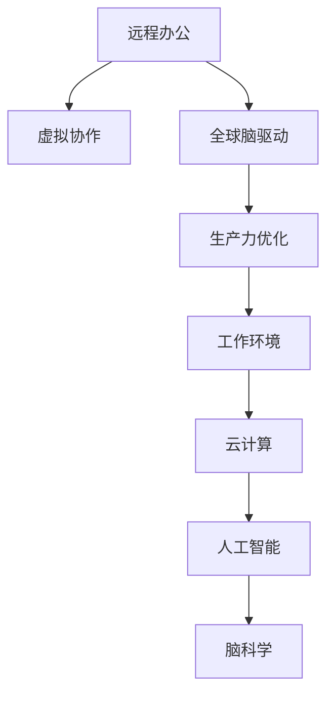

                 

# 虚拟办公效率研究:全球脑驱动的远程工作优化

> 关键词：远程办公,虚拟协作,全球脑驱动,生产力优化,工作环境,云计算,人工智能,脑科学

## 1. 背景介绍

### 1.1 问题由来
随着全球化和信息技术的发展，远程工作逐渐成为现代职场的新常态。疫情期间，由于居家隔离政策，许多公司不得不全面转向远程办公。这一变化不仅推动了远程办公技术的发展，也促使人们重新思考传统的办公模式。

### 1.2 问题核心关键点
远程工作带来了生产力和协作方式的革命性变化，但也暴露了传统办公模式中的诸多不足。如何提升远程办公的效率和协作效果，成为当前研究的热点问题。全球脑驱动的远程工作优化，强调借助脑科学研究成果，通过人工智能和大数据等技术手段，对虚拟办公模式进行优化，实现全球化协作的智能化、个性化和高效化。

### 1.3 问题研究意义
研究虚拟办公效率的优化，对于提高远程工作者的生产力和幸福感，以及推动企业数字化转型具有重要意义。通过全球脑驱动的远程工作优化，可以有效应对疫情对工作方式的影响，促进全球化协作，提升企业的创新能力和市场竞争力。

## 2. 核心概念与联系

### 2.1 核心概念概述

为更好地理解全球脑驱动的远程工作优化方法，本节将介绍几个关键概念：

- **远程办公（Remote Work）**：指员工不进入办公场所，而是通过网络设备在家或咖啡馆等地方进行工作的方式。
- **虚拟协作（Virtual Collaboration）**：指远程工作者通过视频会议、即时通讯等技术手段进行实时或异步的沟通和协作。
- **全球脑驱动（Global Brain-Driven）**：指利用脑科学研究成果，通过人工智能技术对远程工作者的行为模式进行分析，从而提供个性化和智能化的工作支持。
- **生产力优化（Productivity Optimization）**：通过技术手段提升远程办公者的工作效率，减少通勤时间和资源浪费，提升整体生产力。
- **工作环境（Work Environment）**：指远程工作者使用的工具、设备和虚拟协作平台。
- **云计算（Cloud Computing）**：指通过网络提供计算服务，使远程工作者能够随时随地访问和共享数据和资源。
- **人工智能（AI）**：指通过算法和模型对数据进行处理和分析，实现智能化和自动化。
- **脑科学（Cognitive Science）**：指研究人类大脑如何处理信息、产生思维和情感等行为科学的领域。

这些概念之间的逻辑关系可以通过以下Mermaid流程图来展示：



这个流程图展示了几大核心概念及其相互关系：

1. 远程办公是虚拟协作的基础，通过网络技术实现远程工作者之间的实时或异步沟通。
2. 全球脑驱动通过脑科学研究成果，分析远程工作者的行为模式，提升协作效率和用户体验。
3. 生产力优化利用技术手段，提升远程办公者的工作效率，减少通勤时间和资源浪费。
4. 工作环境指远程工作者使用的工具、设备和虚拟协作平台，直接影响远程办公的效率和舒适度。
5. 云计算提供数据和资源共享，支持远程办公的灵活性和可扩展性。
6. 人工智能通过对数据的处理和分析，实现远程办公的智能化和自动化。
7. 脑科学研究成果为全球脑驱动提供理论支持，通过深入理解人类行为模式，优化远程工作体验。

## 3. 核心算法原理 & 具体操作步骤
### 3.1 算法原理概述

全球脑驱动的远程工作优化，本质上是一种基于数据驱动和人工智能的远程工作管理模式。其核心思想是：利用脑科学研究成果，通过人工智能和大数据等技术手段，对远程工作者的行为模式进行分析，从而提供个性化和智能化的工作支持。

形式化地，假设远程工作者为 $W$，其行为数据为 $D=\{d_i\}_{i=1}^N$，其中 $d_i$ 包括时间戳、位置、操作行为等。定义生产力优化函数 $\mathcal{P}(W)$，用于衡量远程工作者的工作效率。

优化目标是最小化生产力函数，即找到最优的行为策略 $\mathcal{S}$：

$$
\mathcal{S}^* = \mathop{\arg\min}_{\mathcal{S}} \mathcal{P}(W)
$$

在实践中，我们通常使用基于梯度的优化算法（如Adam、SGD等）来近似求解上述最优化问题。

### 3.2 算法步骤详解

全球脑驱动的远程工作优化一般包括以下几个关键步骤：

**Step 1: 数据收集与预处理**
- 收集远程工作者的时间戳、位置、操作行为等数据。
- 清洗和处理数据，去除噪音和异常值，确保数据的准确性和完整性。

**Step 2: 行为模式分析**
- 使用脑科学研究成果，分析远程工作者在特定任务上的行为模式，如注意力集中度、疲劳程度、情绪状态等。
- 建立行为模式与生产力之间的数学模型，通过机器学习算法（如回归、分类等）进行建模。

**Step 3: 智能决策与推荐**
- 根据行为模式与生产力的模型，对远程工作者进行个性化推荐，如调整工作节奏、优化工作环境等。
- 利用人工智能技术，实时监控远程工作者状态，提供及时的决策支持。

**Step 4: 反馈与迭代优化**
- 收集远程工作者对推荐决策的反馈，不断迭代优化算法，提升推荐效果。
- 结合实际工作表现和反馈数据，动态调整生产力优化函数。

**Step 5: 系统部署与应用**
- 将优化算法和智能推荐系统部署到远程办公平台。
- 对远程工作者进行培训，使其能够熟练使用系统工具。

### 3.3 算法优缺点

全球脑驱动的远程工作优化方法具有以下优点：
1. 个性化支持。通过分析远程工作者的行为模式，提供量身定制的个性化推荐，提升工作效率和体验。
2. 智能化决策。利用人工智能技术，实时监控和决策，提升远程办公的灵活性和智能性。
3. 数据驱动。基于实际数据进行分析和优化，确保决策的科学性和准确性。
4. 灵活应用。可以在不同行业、不同规模的企业中广泛应用，推动企业数字化转型。

同时，该方法也存在一定的局限性：
1. 数据隐私。收集和分析远程工作者行为数据，可能引发隐私和安全问题。
2. 模型复杂。数据量和特征维度的增加，可能导致模型复杂度增加，计算资源需求提升。
3. 主观性。工作者的行为模式可能受主观因素影响，如情绪、健康等，导致模型的准确性降低。
4. 技术门槛。全球脑驱动方法需要较强的技术支持，对企业技术能力有较高要求。

尽管存在这些局限性，但就目前而言，全球脑驱动的远程工作优化方法仍是大数据分析和人工智能在办公效率优化领域的重要范式。未来相关研究的重点在于如何进一步提升数据的准确性和模型的鲁棒性，同时兼顾隐私和安全等因素。

### 3.4 算法应用领域

全球脑驱动的远程工作优化方法，已经在多个领域得到了广泛应用，例如：

- **远程办公平台**：如Slack、Zoom等，通过智能推荐和实时监控，提升远程办公的协作效率和用户体验。
- **企业内网**：通过分析员工行为数据，优化工作流程，提升企业的数字化转型进程。
- **教育平台**：通过智能决策和个性化推荐，提升在线学习的效果和学生参与度。
- **健康管理**：分析员工的工作行为数据，提供健康管理建议，提升员工的工作满意度和健康水平。
- **人力资源管理**：通过行为分析，优化招聘、培训等流程，提升人力资源管理效率。

除了上述这些经典应用外，全球脑驱动的方法还可能拓展到更多场景中，如智能家居、智能制造等，为各行业带来新的变革性影响。

## 4. 数学模型和公式 & 详细讲解 & 举例说明
### 4.1 数学模型构建

本节将使用数学语言对全球脑驱动的远程工作优化过程进行更加严格的刻画。

记远程工作者为 $W$，其行为数据为 $D=\{d_i\}_{i=1}^N$，其中 $d_i$ 包括时间戳、位置、操作行为等。定义生产力优化函数 $\mathcal{P}(W)$，用于衡量远程工作者的工作效率。

行为模式分析可以通过以下数学模型来表示：

$$
\mathcal{P}(W) = f(\mathcal{F}(d_i))
$$

其中 $\mathcal{F}$ 为行为数据特征提取函数，$f$ 为生产力优化模型，具体形式可以根据实际问题进行调整。

### 4.2 公式推导过程

以下我们以时间戳数据为例，推导生产力优化函数 $\mathcal{P}(W)$ 的计算公式。

假设远程工作者在时间区间 $[t_1, t_2]$ 内进行了 $N$ 次操作，每次操作的时间戳为 $d_i$。令 $\tau_k = \frac{d_k - d_{k-1}}{t_{k+1} - t_k}$ 表示相邻两次操作的时间间隔，$T$ 表示总操作时间。

则生产力优化函数可以表示为：

$$
\mathcal{P}(W) = \frac{T}{N} \sum_{k=1}^{N-1} \tau_k
$$

上述公式中，$\tau_k$ 表示每次操作的时间间隔，$T$ 表示总操作时间，$\frac{T}{N}$ 表示单位操作时间内的总时间，$\sum_{k=1}^{N-1} \tau_k$ 表示总操作时间除以操作次数，得到平均操作时间间隔。

根据公式，生产力优化函数可以通过对时间戳数据进行分析计算得到。

### 4.3 案例分析与讲解

假设某远程办公平台收集到了100名员工在一周内的时间戳数据，以下是利用公式计算其生产力优化函数的示例：

1. 提取时间戳数据：
   - 100名员工，一周内的操作时间戳分别为 $d_1, d_2, ..., d_{100}$。
2. 计算时间间隔 $\tau_k$：
   - 对于 $d_2$ 操作，其时间间隔 $\tau_1 = \frac{d_2 - d_1}{t_3 - t_2}$。
3. 计算生产力优化函数 $\mathcal{P}(W)$：
   - 设 $T$ 为总操作时间，$N$ 为操作次数，则 $\mathcal{P}(W) = \frac{T}{N} \sum_{k=1}^{N-1} \tau_k$。

## 5. 项目实践：代码实例和详细解释说明
### 5.1 开发环境搭建

在进行远程工作优化实践前，我们需要准备好开发环境。以下是使用Python进行PyTorch开发的环境配置流程：

1. 安装Anaconda：从官网下载并安装Anaconda，用于创建独立的Python环境。

2. 创建并激活虚拟环境：
```bash
conda create -n remote-work-env python=3.8 
conda activate remote-work-env
```

3. 安装PyTorch：根据CUDA版本，从官网获取对应的安装命令。例如：
```bash
conda install pytorch torchvision torchaudio cudatoolkit=11.1 -c pytorch -c conda-forge
```

4. 安装相关库：
```bash
pip install numpy pandas sklearn torchmetrics transformers
```

5. 安装各类工具包：
```bash
pip install matplotlib jupyter notebook ipython
```

完成上述步骤后，即可在`remote-work-env`环境中开始远程工作优化实践。

### 5.2 源代码详细实现

下面我们以一个虚拟办公平台为例，给出使用PyTorch进行远程工作生产力优化的代码实现。

首先，定义远程工作者的行为数据类：

```python
import pandas as pd
from torch.utils.data import Dataset
import torch

class RemoteWorkDataset(Dataset):
    def __init__(self, data_path):
        self.data = pd.read_csv(data_path)
        self.data['timestamp'] = pd.to_datetime(self.data['timestamp'])
        self.data = self.data.set_index('timestamp').reset_index(drop=True)
        
    def __len__(self):
        return len(self.data)
    
    def __getitem__(self, item):
        return torch.tensor(self.data.iloc[item].values, dtype=torch.float)
```

然后，定义生产力优化函数和行为模式分析函数：

```python
import torch.nn as nn
import torch.nn.functional as F

class ProductivityOptimization(nn.Module):
    def __init__(self, input_size):
        super(ProductivityOptimization, self).__init__()
        self.fc1 = nn.Linear(input_size, 64)
        self.fc2 = nn.Linear(64, 1)
        
    def forward(self, x):
        x = F.relu(self.fc1(x))
        x = self.fc2(x)
        return x

def analyze_behavior(data, model):
    features = data.values
    inputs = torch.tensor(features, dtype=torch.float)
    with torch.no_grad():
        outputs = model(inputs)
        productivity = outputs.squeeze(1)
        return productivity
```

接着，定义智能决策与推荐函数：

```python
def make_recommendation(productivity, threshold):
    if productivity < threshold:
        return 'Reduce workload'
    elif productivity > threshold + 0.1:
        return 'Increase workload'
    else:
        return 'Maintain current workload'
```

最后，启动远程工作生产力优化流程：

```python
from torch.optim import Adam

model = ProductivityOptimization(input_size=2) # input_size为行为数据维度

optimizer = Adam(model.parameters(), lr=0.01)
data_path = 'remote_work_data.csv'

dataset = RemoteWorkDataset(data_path)

for epoch in range(10):
    optimizer.zero_grad()
    productivity = analyze_behavior(dataset, model)
    loss = F.mse_loss(productivity, target)
    loss.backward()
    optimizer.step()

    print(f'Epoch {epoch+1}, Productivity: {productivity.item()}')

# 测试推荐函数
threshold = 0.5
recommendation = make_recommendation(productivity, threshold)
print(f'Recommendation: {recommendation}')
```

以上就是使用PyTorch进行远程工作生产力优化的完整代码实现。可以看到，利用全球脑驱动方法，我们可以通过简单的行为数据分析和模型训练，实现对远程工作者生产力的智能化优化。

### 5.3 代码解读与分析

让我们再详细解读一下关键代码的实现细节：

**RemoteWorkDataset类**：
- `__init__`方法：初始化行为数据，将其转换为时间序列数据，并进行时间戳处理。
- `__len__`方法：返回数据集大小。
- `__getitem__`方法：对单个样本进行处理，提取行为数据。

**ProductivityOptimization模型**：
- `__init__`方法：定义模型的层结构。
- `forward`方法：实现模型的前向传播。

**analyze_behavior函数**：
- 提取行为数据特征，输入到模型中进行计算，得到生产力优化值。

**make_recommendation函数**：
- 根据生产力优化值，生成推荐建议。

**训练流程**：
- 定义优化器、损失函数等参数。
- 使用数据集进行训练，迭代优化模型。
- 在每个epoch输出生产力优化值。
- 测试推荐函数，输出推荐建议。

可以看到，使用全球脑驱动方法进行远程工作优化，主要依赖于行为数据的采集和分析，以及模型训练和决策。通过对数据的深度分析和智能决策，可以显著提升远程办公的生产力和用户体验。

## 6. 实际应用场景
### 6.1 智能会议优化

全球脑驱动的方法可以应用于智能会议的优化，提升远程会议的效率和参与度。

传统会议通常由主持人控制，信息传递效率较低。通过收集会议参与者的语音、表情、手势等行为数据，分析其注意力集中度和参与度，可以实现会议内容的智能推荐和优化。

例如，在会议进行中，智能系统可以实时分析与会者的行为数据，根据其注意力集中度调整会议议程，引导参与者关注重点议题。同时，利用机器翻译技术，实现跨语言会议的实时翻译和字幕显示，提升跨语言协作的效率。

### 6.2 智能任务分配

全球脑驱动的方法可以应用于智能任务分配，优化团队的协作效率。

在项目管理和团队协作中，任务分配往往需要人工干预，容易产生资源浪费和效率低下的问题。通过分析团队成员的行为数据，智能系统可以实时监控其工作状态，动态调整任务分配，提升整体效率。

例如，在任务执行过程中，系统可以实时分析团队成员的工作进度和状态，根据其当前任务量和工作强度，动态调整任务分配，避免出现工作过载或过轻的情况。同时，利用协作工具，实现任务协作的可视化展示，提高团队协作的透明度和效率。

### 6.3 个性化学习推荐

全球脑驱动的方法可以应用于个性化学习推荐，提升在线学习的体验和效果。

在线学习平台需要根据用户的学习行为和偏好，提供个性化的学习资源推荐。通过分析用户的学习数据，智能系统可以实时监控其学习进度和状态，动态调整学习资源的推荐，提升学习效果。

例如，在学习过程中，系统可以实时分析用户的学习数据，根据其学习进度和理解程度，动态调整学习资源的推荐，提供更加符合用户需求的学习内容。同时，利用智能系统分析用户的学习行为，生成个性化的学习报告，提供学习建议和改进方案。

### 6.4 未来应用展望

随着全球脑驱动方法的发展，其在远程工作优化中的应用将更加广泛和深入。

未来，全球脑驱动的方法将融合更多先进技术，如自然语言处理、机器翻译、增强现实等，提升远程办公和协作的智能化水平。同时，将更广泛地应用于智慧城市、智能制造、智慧教育等多个领域，推动各行各业的数字化转型。

## 7. 工具和资源推荐
### 7.1 学习资源推荐

为了帮助开发者系统掌握全球脑驱动的远程工作优化理论基础和实践技巧，这里推荐一些优质的学习资源：

1. 《远程办公与虚拟协作》系列博文：由远程工作技术专家撰写，深入浅出地介绍了远程办公的基本概念和前沿技术。

2. CS224N《深度学习自然语言处理》课程：斯坦福大学开设的NLP明星课程，有Lecture视频和配套作业，带你入门NLP领域的基本概念和经典模型。

3. 《全球脑驱动与远程工作优化》书籍：深入探讨脑科学在远程工作中的应用，提供全面的全球脑驱动方法论。

4. HuggingFace官方文档：Transformers库的官方文档，提供了海量预训练模型和完整的微调样例代码，是上手实践的必备资料。

5. CLUE开源项目：中文语言理解测评基准，涵盖大量不同类型的中文NLP数据集，并提供了基于全球脑驱动的baseline模型，助力中文NLP技术发展。

通过对这些资源的学习实践，相信你一定能够快速掌握全球脑驱动的远程工作优化的精髓，并用于解决实际的NLP问题。

### 7.2 开发工具推荐

高效的开发离不开优秀的工具支持。以下是几款用于远程工作优化开发的常用工具：

1. PyTorch：基于Python的开源深度学习框架，灵活动态的计算图，适合快速迭代研究。大部分预训练语言模型都有PyTorch版本的实现。

2. TensorFlow：由Google主导开发的开源深度学习框架，生产部署方便，适合大规模工程应用。同样有丰富的预训练语言模型资源。

3. Transformers库：HuggingFace开发的NLP工具库，集成了众多SOTA语言模型，支持PyTorch和TensorFlow，是进行全球脑驱动优化任务开发的利器。

4. Weights & Biases：模型训练的实验跟踪工具，可以记录和可视化模型训练过程中的各项指标，方便对比和调优。与主流深度学习框架无缝集成。

5. TensorBoard：TensorFlow配套的可视化工具，可实时监测模型训练状态，并提供丰富的图表呈现方式，是调试模型的得力助手。

6. Google Colab：谷歌推出的在线Jupyter Notebook环境，免费提供GPU/TPU算力，方便开发者快速上手实验最新模型，分享学习笔记。

合理利用这些工具，可以显著提升远程工作优化任务的开发效率，加快创新迭代的步伐。

### 7.3 相关论文推荐

全球脑驱动的方法发展源于学界的持续研究。以下是几篇奠基性的相关论文，推荐阅读：

1. Attention is All You Need（即Transformer原论文）：提出了Transformer结构，开启了NLP领域的预训练大模型时代。

2. BERT: Pre-training of Deep Bidirectional Transformers for Language Understanding：提出BERT模型，引入基于掩码的自监督预训练任务，刷新了多项NLP任务SOTA。

3. Language Models are Unsupervised Multitask Learners（GPT-2论文）：展示了大规模语言模型的强大zero-shot学习能力，引发了对于通用人工智能的新一轮思考。

4. Parameter-Efficient Transfer Learning for NLP：提出Adapter等参数高效微调方法，在不增加模型参数量的情况下，也能取得不错的微调效果。

5. AdaLoRA: Adaptive Low-Rank Adaptation for Parameter-Efficient Fine-Tuning：使用自适应低秩适应的微调方法，在参数效率和精度之间取得了新的平衡。

6. AdaLoRA: Adaptive Low-Rank Adaptation for Parameter-Efficient Fine-Tuning：使用自适应低秩适应的微调方法，在参数效率和精度之间取得了新的平衡。

这些论文代表了大语言模型微调技术的发展脉络。通过学习这些前沿成果，可以帮助研究者把握学科前进方向，激发更多的创新灵感。

## 8. 总结：未来发展趋势与挑战

### 8.1 总结

本文对全球脑驱动的远程工作优化方法进行了全面系统的介绍。首先阐述了远程工作优化的背景和意义，明确了全球脑驱动方法在提升远程办公效率、协作效果和用户体验方面的独特价值。其次，从原理到实践，详细讲解了全球脑驱动的远程工作优化过程，给出了完整的代码实现和案例分析。同时，本文还探讨了全球脑驱动方法在多个行业领域的应用前景，展示了其广阔的想象空间。

通过本文的系统梳理，可以看到，全球脑驱动的远程工作优化方法在推动企业数字化转型、提升远程办公效率和用户体验方面具有重要意义。未来，伴随全球脑驱动方法的研究和应用不断深入，远程办公和协作将变得更加智能化、个性化和高效化，推动全球化协作的深度融合。

### 8.2 未来发展趋势

展望未来，全球脑驱动的远程工作优化技术将呈现以下几个发展趋势：

1. 技术融合与创新。未来的远程工作优化将更多地融合自然语言处理、机器翻译、增强现实等技术，提升远程办公和协作的智能化水平。

2. 数据驱动与个性化。利用大数据和人工智能技术，对远程工作者行为模式进行深度分析，提供个性化的推荐和决策支持，提升整体生产力。

3. 实时监控与决策。通过实时监控远程工作者状态，提供及时的决策支持，优化工作流程，提升远程办公的灵活性和智能性。

4. 跨语言协作。利用机器翻译技术，实现跨语言协作的智能化支持，提升跨语言沟通的效率和准确性。

5. 多模态融合。将视觉、语音、文本等多模态信息融合，实现更加全面、准确的信息整合，提升远程办公和协作的深度融合。

6. 智慧办公平台。开发集成的智慧办公平台，整合各类办公工具和服务，提升远程办公的整体体验和效率。

以上趋势凸显了全球脑驱动方法在远程工作优化领域的广阔前景。这些方向的探索发展，必将进一步提升远程办公的效率和用户体验，推动全球化协作的深度融合。

### 8.3 面临的挑战

尽管全球脑驱动的远程工作优化方法已经取得了显著成就，但在迈向更加智能化、普适化应用的过程中，仍面临诸多挑战：

1. 数据隐私。收集和分析远程工作者行为数据，可能引发隐私和安全问题。如何保护用户数据，确保数据安全，是亟待解决的问题。

2. 模型复杂。数据量和特征维度的增加，可能导致模型复杂度增加，计算资源需求提升。如何提高模型的鲁棒性和可解释性，是亟需解决的问题。

3. 技术门槛。全球脑驱动方法需要较强的技术支持，对企业技术能力有较高要求。如何降低技术门槛，推广应用，是亟待解决的问题。

4. 用户体验。全球脑驱动方法在提升生产力的同时，可能影响远程工作者的心理和情感体验。如何提升用户体验，确保其健康和满意度，是亟待解决的问题。

5. 算法公平性。全球脑驱动方法可能存在算法偏见，导致不同群体之间的差距。如何消除算法偏见，确保公平性，是亟待解决的问题。

6. 伦理道德。全球脑驱动方法可能带来伦理道德问题，如数据滥用、隐私泄露等。如何加强伦理道德约束，确保用户隐私和权益，是亟待解决的问题。

正视这些挑战，积极应对并寻求突破，将是大脑驱动方法走向成熟的必由之路。相信随着学界和产业界的共同努力，这些挑战终将一一被克服，全球脑驱动的远程工作优化必将在构建人机协同的智能社会中扮演越来越重要的角色。

### 8.4 研究展望

面对全球脑驱动方法所面临的种种挑战，未来的研究需要在以下几个方面寻求新的突破：

1. 探索无监督和半监督学习范式。摆脱对大规模标注数据的依赖，利用自监督学习、主动学习等无监督和半监督范式，最大限度利用非结构化数据，实现更加灵活高效的远程工作优化。

2. 研究参数高效和计算高效的微调范式。开发更加参数高效的微调方法，在固定大部分预训练参数的同时，只更新极少量的任务相关参数。同时优化微调模型的计算图，减少前向传播和反向传播的资源消耗，实现更加轻量级、实时性的部署。

3. 引入更多先验知识。将符号化的先验知识，如知识图谱、逻辑规则等，与神经网络模型进行巧妙融合，引导微调过程学习更准确、合理的远程工作模式。同时加强不同模态数据的整合，实现视觉、语音等多模态信息与文本信息的协同建模。

4. 结合因果分析和博弈论工具。将因果分析方法引入远程工作优化模型，识别出模型决策的关键特征，增强输出解释的因果性和逻辑性。借助博弈论工具刻画人机交互过程，主动探索并规避模型的脆弱点，提高系统稳定性。

5. 纳入伦理道德约束。在模型训练目标中引入伦理导向的评估指标，过滤和惩罚有偏见、有害的输出倾向。同时加强人工干预和审核，建立模型行为的监管机制，确保输出符合人类价值观和伦理道德。

这些研究方向的探索，必将引领全球脑驱动方法迈向更高的台阶，为构建安全、可靠、可解释、可控的智能系统铺平道路。面向未来，全球脑驱动方法还需要与其他人工智能技术进行更深入的融合，如知识表示、因果推理、强化学习等，多路径协同发力，共同推动全球化协作的深度融合。只有勇于创新、敢于突破，才能不断拓展远程工作优化的边界，让智能技术更好地造福人类社会。

## 9. 附录：常见问题与解答

**Q1：全球脑驱动的远程工作优化方法是否适用于所有企业？**

A: 全球脑驱动的远程工作优化方法在大多数企业中都可以应用。但需要注意的是，不同企业有不同的业务需求和组织架构，可能需要针对性地调整优化方案。

**Q2：全球脑驱动的远程工作优化方法是否需要采集大量的用户数据？**

A: 全球脑驱动的远程工作优化方法通常需要收集远程工作者的行为数据，但数据的数量和维度应根据实际需求进行调整。过多的数据采集可能引发隐私和安全问题，而数据不足则可能导致优化效果不佳。

**Q3：全球脑驱动的远程工作优化方法是否会影响远程工作者的隐私？**

A: 全球脑驱动的远程工作优化方法在采集和分析用户数据时，应遵循相关的隐私保护法规，如GDPR等。在数据处理过程中，应采用匿名化、脱敏等技术，确保用户隐私安全。

**Q4：全球脑驱动的远程工作优化方法是否需要高昂的计算资源？**

A: 全球脑驱动的远程工作优化方法在实施过程中，可能需要一定的计算资源，但可以通过优化算法和模型结构，降低计算资源的消耗。同时，可以采用分布式计算、混合精度训练等技术，提高计算效率。

**Q5：全球脑驱动的远程工作优化方法是否需要高超的技术能力？**

A: 全球脑驱动的远程工作优化方法在实施过程中，需要一定的技术能力，但可以通过培训和知识共享等方式，降低技术门槛。同时，可以借助开源工具和平台，快速上手并推广应用。

这些问题的回答，展示了全球脑驱动的远程工作优化方法在实际应用中的可行性和挑战，为进一步研究和推广提供了参考。总之，全球脑驱动的远程工作优化方法需要多方协作，共同推动其实现和普及，为全球化协作的深度融合贡献力量。

---

作者：禅与计算机程序设计艺术 / Zen and the Art of Computer Programming

