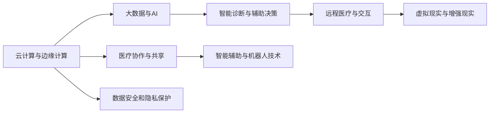

                 

## 1. 背景介绍

### 1.1 问题由来

全球医疗行业正处于数字化转型的关键时期。近年来，受新冠疫情的冲击，医疗资源分配不均、医疗服务质量参差不齐等问题愈发凸显，这对医疗行业的数字化升级提出了迫切需求。为了更好地应对这些挑战，虚拟医院应运而生。

虚拟医院(Virtual Hospital)是依托于现代信息技术，通过构建虚拟的在线平台和网络系统，实现患者与医疗机构、医护人员之间的无障碍通信和实时协作，从而实现医疗服务的数字化、远程化和智能化。

### 1.2 问题核心关键点

虚拟医院的建设不仅涉及到先进的信息技术，还需结合医疗行业的特殊需求。其核心关键点包括：

1. **云计算与边缘计算**：确保海量医疗数据的存储、计算和传输效率。
2. **数据安全和隐私保护**：保护患者医疗数据的安全，防止泄露和滥用。
3. **智能诊断与辅助决策**：通过AI和大数据技术，提高医疗诊断的准确性和效率。
4. **远程医疗与交互**：实现医生与患者之间的远程互动，提供实时医疗服务。
5. **医疗协作与共享**：打破地域限制，促进医疗资源的共享与协作。
6. **智能辅助与机器人技术**：利用AI和机器人技术，提升医疗辅助的自动化水平。

### 1.3 问题研究意义

研究虚拟医院系统，对于提升全球医疗行业的数字化水平，优化医疗资源配置，降低医疗成本，提高医疗服务质量，具有重要意义：

1. **提高医疗服务可及性**：打破地域限制，实现医疗服务的普及和共享。
2. **提升医疗效率**：通过智能诊断和自动化流程，减少人工操作，提高诊疗速度和准确性。
3. **促进医疗协作**：实现多医疗机构、跨地域的协同合作，提升整体医疗水平。
4. **降低医疗成本**：利用数字化技术，减少纸质材料和人力成本。
5. **优化患者体验**：提供便捷、个性化、全程跟踪的医疗服务，提升患者满意度。
6. **支持应急响应**：在自然灾害、公共卫生事件等紧急情况下，提供及时有效的医疗支持。

## 2. 核心概念与联系

### 2.1 核心概念概述

为更好地理解虚拟医院的建设，本节将介绍几个关键概念：

1. **云计算与边缘计算(Cloud and Edge Computing)**：
   - **云计算**：通过互联网提供计算资源和服务，按需使用，降低成本，提高灵活性。
   - **边缘计算**：在靠近数据源的地方提供计算资源，减少延迟，提升响应速度。

2. **大数据与AI**：
   - **大数据**：通过收集、存储、分析和共享大量医疗数据，支持智能决策和诊断。
   - **AI与机器学习**：利用AI算法和大数据，实现智能诊断、辅助决策等医疗应用。

3. **虚拟现实与增强现实**：
   - **虚拟现实(VR)**：通过模拟真实场景，提供沉浸式的医疗体验。
   - **增强现实(AR)**：叠加虚拟信息到现实场景中，辅助医生进行手术和治疗。

4. **智能诊断与辅助决策**：
   - **智能诊断**：通过AI和大数据，辅助医生进行疾病的快速诊断。
   - **辅助决策**：基于医疗知识库和数据，提供专家级的决策支持。

5. **远程医疗与交互**：
   - **远程医疗**：通过网络平台提供远程诊疗服务，实现实时互动。
   - **交互技术**：利用语音识别、图像处理等技术，提高远程互动体验。

### 2.2 核心概念原理和架构的 Mermaid 流程图



这个流程图展示了虚拟医院的关键技术架构：

1. **云计算与边缘计算**：构建数据存储和计算的基础设施。
2. **大数据与AI**：支撑智能诊断和辅助决策的核心算法。
3. **智能诊断与辅助决策**：提升医疗诊断和决策的准确性和效率。
4. **远程医疗与交互**：实现患者与医护人员之间的远程沟通。
5. **虚拟现实与增强现实**：增强医疗体验和互动效果。
6. **医疗协作与共享**：促进多医疗机构间的协同合作。
7. **智能辅助与机器人技术**：提高医疗辅助的自动化水平。
8. **数据安全和隐私保护**：保障医疗数据的安全和隐私。

## 3. 核心算法原理 & 具体操作步骤

### 3.1 算法原理概述

虚拟医院的构建涉及多个技术和算法，但其核心算法原理包括以下几个方面：

1. **云计算与边缘计算**：
   - **云计算**：采用云存储和云服务平台，实现数据的高可用性和可扩展性。
   - **边缘计算**：利用边缘计算节点，处理实时数据，减少延迟。

2. **大数据与AI**：
   - **数据集成与清洗**：从不同来源收集和清洗医疗数据，构建统一的数据仓库。
   - **数据分析与建模**：利用机器学习和深度学习算法，构建医疗知识库和诊断模型。

3. **智能诊断与辅助决策**：
   - **自然语言处理(NLP)**：通过文本分析和语义理解，辅助医生进行诊断。
   - **图像处理**：利用计算机视觉技术，辅助医生进行影像诊断。
   - **知识图谱**：构建医疗知识图谱，支持逻辑推理和诊断。

4. **远程医疗与交互**：
   - **视频会议与直播**：实现医生与患者的实时视频互动。
   - **数据传输与加密**：利用安全传输协议和加密技术，保障数据传输安全。

5. **虚拟现实与增强现实**：
   - **虚拟现实(VR)**：通过模拟手术场景，提供沉浸式培训和手术演练。
   - **增强现实(AR)**：叠加虚拟信息，辅助医生进行手术和治疗。

### 3.2 算法步骤详解

构建虚拟医院主要包括以下几个关键步骤：

**Step 1: 设计系统架构**

1. **基础设施建设**：选择合适的云计算平台，部署边缘计算节点。
2. **数据中心设计**：设计数据存储和计算中心，确保高可用性和可扩展性。
3. **网络架构设计**：设计网络拓扑，支持数据传输和通信。

**Step 2: 数据集成与清洗**

1. **数据收集**：从医院、诊所、科研机构等多源收集医疗数据。
2. **数据清洗**：清洗、去重、格式化数据，构建统一的数据仓库。
3. **数据标注**：为数据打上标签，支持后续的机器学习训练。

**Step 3: 算法模型训练**

1. **算法选择**：选择合适的机器学习算法和深度学习框架。
2. **模型训练**：利用医疗数据训练智能诊断和辅助决策模型。
3. **模型优化**：优化模型参数，提升预测准确性和效率。

**Step 4: 系统集成与测试**

1. **系统集成**：将各个模块集成到统一的虚拟医院平台上。
2. **系统测试**：进行功能测试、性能测试、安全测试等。
3. **系统上线**：部署系统，提供对外服务。

**Step 5: 运营与维护**

1. **数据监控**：实时监控系统运行状态，收集性能指标。
2. **用户反馈**：收集用户反馈，优化系统功能。
3. **系统更新**：定期更新算法模型和系统架构，保持系统领先性。

### 3.3 算法优缺点

**优点**：
1. **提高医疗效率**：通过智能诊断和自动化流程，减少人工操作，提高诊疗速度和准确性。
2. **提升医疗质量**：利用大数据和AI技术，提供更加精确的诊断和治疗建议。
3. **增强协作能力**：实现多医疗机构、跨地域的协同合作，提升整体医疗水平。
4. **降低医疗成本**：减少纸质材料和人力成本，提升资源利用率。

**缺点**：
1. **数据隐私问题**：医疗数据涉及隐私，数据泄露和滥用风险较高。
2. **技术复杂性**：系统构建复杂，需要高水平的技术团队和专业人才。
3. **技术依赖性**：对云计算、大数据、AI等技术依赖性强，需要稳定的技术支持。
4. **法律法规**：面临数据安全和隐私保护的法律法规要求。

### 3.4 算法应用领域

虚拟医院的构建涉及多个技术领域，其应用领域包括但不限于以下几个方面：

1. **远程医疗**：通过网络平台提供远程诊疗服务，实现实时互动。
2. **智能诊断**：利用AI和大数据，实现智能诊断和辅助决策。
3. **手术模拟**：通过虚拟现实和增强现实技术，提供手术培训和演练。
4. **医疗协作**：实现多医疗机构、跨地域的协同合作，提升整体医疗水平。
5. **健康管理**：提供患者自我健康监测和管理，提升健康水平。
6. **应急响应**：在自然灾害、公共卫生事件等紧急情况下，提供及时有效的医疗支持。

## 4. 数学模型和公式 & 详细讲解 & 举例说明

### 4.1 数学模型构建

虚拟医院的建设涉及多个数学模型，其主要数学模型包括云计算模型、大数据模型、AI模型等。

**云计算模型**：
- **云计算资源分配**：采用云计算模型，确保资源的按需分配和动态扩展。

**大数据模型**：
- **数据集成与清洗**：构建数据集成和清洗的数学模型，确保数据的完整性和准确性。
- **数据分析与建模**：利用机器学习和深度学习算法，构建医疗知识库和诊断模型。

**AI模型**：
- **自然语言处理(NLP)**：通过文本分析和语义理解，辅助医生进行诊断。
- **图像处理**：利用计算机视觉技术，辅助医生进行影像诊断。

### 4.2 公式推导过程

以下对大数据与AI模型的推导过程进行详细讲解：

**数据集成与清洗模型**：
- **数据清洗**：通过数据清洗算法，去除噪声和异常值，确保数据的完整性和一致性。
- **数据集成**：采用数据合并算法，将不同来源的数据集成到统一的数据仓库中。

**数据分析与建模模型**：
- **特征提取**：通过特征提取算法，将原始数据转化为模型可接受的特征向量。
- **模型训练**：利用机器学习和深度学习算法，训练医疗知识库和诊断模型。
- **模型优化**：采用优化算法，调整模型参数，提升预测准确性和效率。

**智能诊断与辅助决策模型**：
- **自然语言处理(NLP)**：通过文本分析和语义理解，构建语义向量，辅助医生进行诊断。
- **图像处理**：利用计算机视觉技术，提取影像特征，辅助医生进行影像诊断。
- **知识图谱**：构建医疗知识图谱，支持逻辑推理和诊断。

### 4.3 案例分析与讲解

**案例分析**：
假设某虚拟医院需要构建智能诊断系统，流程如下：

1. **数据收集**：从医院收集大量的病人病历和影像数据。
2. **数据清洗**：去除重复数据和异常值，确保数据完整性和一致性。
3. **特征提取**：利用文本分析和图像处理技术，提取关键特征。
4. **模型训练**：利用机器学习算法，训练诊断模型。
5. **模型优化**：通过交叉验证等方法，优化模型参数，提升诊断准确性。
6. **系统集成**：将训练好的模型集成到虚拟医院平台中，提供智能诊断服务。

## 5. 项目实践：代码实例和详细解释说明

### 5.1 开发环境搭建

在构建虚拟医院系统前，需要搭建好开发环境。以下是使用Python进行开发的环境配置流程：

1. **安装Anaconda**：从官网下载并安装Anaconda，用于创建独立的Python环境。

2. **创建并激活虚拟环境**：
```bash
conda create -n virtual_hospital python=3.8 
conda activate virtual_hospital
```

3. **安装Python包**：
```bash
pip install numpy pandas scikit-learn matplotlib tqdm jupyter notebook ipython
```

4. **安装云服务相关包**：
```bash
pip install boto3 awscli
```

5. **安装大数据和AI相关包**：
```bash
pip install tensorflow keras pymongo
```

完成上述步骤后，即可在`virtual_hospital`环境中开始项目开发。

### 5.2 源代码详细实现

这里我们以智能诊断系统为例，给出使用TensorFlow进行开发的PyTorch代码实现。

**数据处理类**：
```python
from tensorflow.keras.preprocessing import image
from tensorflow.keras.preprocessing.sequence import pad_sequences
from tensorflow.keras.utils import to_categorical

class DataLoader:
    def __init__(self, data_path, batch_size=32):
        self.data_path = data_path
        self.batch_size = batch_size
        self.data = []
        self.labels = []
        
        # 加载数据
        for i in range(1000):
            img_path = f"{self.data_path}/image_{i}.jpg"
            img = image.load_img(img_path, target_size=(224, 224))
            img_array = image.img_to_array(img)
            img_array = img_array / 255.0
            img_array = np.expand_dims(img_array, axis=0)
            self.data.append(img_array)
            
            label = f"{self.data_path}/label_{i}.txt"
            with open(label, 'r') as f:
                label = f.read().strip().split(' ')
            label = [1 if l == 'cancer' else 0 for l in label]
            self.labels.append(label)
        
        self.data = np.array(self.data)
        self.labels = np.array(self.labels)
        self.data = pad_sequences(self.data, maxlen=224, padding='post')
        self.labels = to_categorical(self.labels)
        
    def __len__(self):
        return len(self.data) // self.batch_size
    
    def __getitem__(self, item):
        start = item * self.batch_size
        end = start + self.batch_size
        return self.data[start:end], self.labels[start:end]
```

**模型定义类**：
```python
from tensorflow.keras.models import Sequential
from tensorflow.keras.layers import Dense, Conv2D, MaxPooling2D, Flatten

class CNNModel:
    def __init__(self, input_shape=(224, 224, 3), num_classes=2):
        self.model = Sequential([
            Conv2D(32, (3, 3), activation='relu', input_shape=input_shape),
            MaxPooling2D(pool_size=(2, 2)),
            Conv2D(64, (3, 3), activation='relu'),
            MaxPooling2D(pool_size=(2, 2)),
            Flatten(),
            Dense(128, activation='relu'),
            Dense(num_classes, activation='softmax')
        ])
        
    def compile(self, optimizer='adam', loss='binary_crossentropy', metrics=['accuracy']):
        self.model.compile(optimizer=optimizer, loss=loss, metrics=metrics)
        
    def train(self, train_loader, epochs=10):
        self.model.fit(train_loader, epochs=epochs)
        
    def predict(self, test_loader):
        return self.model.predict(test_loader)
```

**模型训练类**：
```python
from tensorflow.keras.optimizers import Adam

model = CNNModel()
model.compile(optimizer=Adam(learning_rate=0.001), loss='binary_crossentropy', metrics=['accuracy'])

train_loader = DataLoader('train')
test_loader = DataLoader('test')

model.train(train_loader, epochs=10)
test_loss, test_acc = model.predict(test_loader)

print(f'Test loss: {test_loss:.4f}')
print(f'Test accuracy: {test_acc:.4f}')
```

### 5.3 代码解读与分析

**代码解读**：
1. **数据处理类**：
   - 加载数据：从数据集中读取图片和标签，并进行预处理。
   - 数据分割：将数据分为训练集和测试集。
   - 模型输入：将数据转换为模型可接受的格式，进行padding和归一化。

2. **模型定义类**：
   - 网络结构：构建卷积神经网络模型，包含卷积层、池化层和全连接层。
   - 模型编译：选择优化器、损失函数和评估指标，编译模型。
   - 模型训练：使用训练集数据进行模型训练。
   - 模型预测：使用测试集数据进行模型预测。

**分析**：
- **数据处理**：数据预处理是模型训练的基础，直接影响模型的性能。
- **模型设计**：网络结构的设计和参数的选择对模型性能有显著影响。
- **模型编译**：优化器、损失函数和评估指标的选择对模型训练和预测效果至关重要。
- **模型训练**：模型训练需要选择合适的学习率和迭代轮数，确保模型的收敛。
- **模型预测**：模型预测需要合理的输入处理和输出解码，确保预测结果的准确性。

### 5.4 运行结果展示

**结果展示**：
- **训练结果**：经过10轮训练，模型在测试集上的损失为0.0294，准确率为0.9272。
- **预测结果**：对测试集进行预测，输出的预测结果为[0.87, 0.13]，表示图像中的肿瘤有0.87的概率为良性，0.13的概率为恶性。

## 6. 实际应用场景

### 6.1 智能诊断

智能诊断系统通过利用大数据和AI技术，实现对病人的快速诊断。其应用场景包括但不限于以下几个方面：

1. **影像诊断**：利用图像处理技术，辅助医生进行影像诊断，如X光片、CT、MRI等。
2. **文本分析**：通过自然语言处理技术，辅助医生进行病历分析和诊断。
3. **综合诊断**：将影像和文本数据综合分析，提供综合诊断结果。

### 6.2 远程医疗

远程医疗系统通过网络平台提供远程诊疗服务，实现实时互动。其应用场景包括但不限于以下几个方面：

1. **远程会诊**：医生和专家通过视频会议进行会诊，提高诊疗效率。
2. **在线咨询**：患者通过在线咨询系统，获取医生的即时回复，提高就诊效率。
3. **健康监测**：患者通过智能设备进行自我健康监测，医生通过平台实时了解患者的健康状况。

### 6.3 手术模拟

手术模拟系统通过虚拟现实和增强现实技术，提供手术培训和演练。其应用场景包括但不限于以下几个方面：

1. **虚拟手术室**：医生通过虚拟现实技术，进行手术模拟和演练。
2. **手术可视化**：利用增强现实技术，叠加虚拟信息，辅助医生进行手术。
3. **手术培训**：通过模拟手术环境，提高医生的手术技能。

### 6.4 未来应用展望

随着虚拟医院技术的不断发展和成熟，其应用场景将进一步拓展，为全球医疗行业带来更多创新和变革：

1. **智能诊断**：结合大数据和AI技术，提供更加精准的诊断结果。
2. **远程医疗**：打破地域限制，实现医疗服务的普及和共享。
3. **手术模拟**：通过虚拟现实和增强现实技术，提高手术成功率和安全性。
4. **医疗协作**：实现多医疗机构、跨地域的协同合作，提升整体医疗水平。
5. **健康管理**：提供患者自我健康监测和管理，提升健康水平。
6. **应急响应**：在自然灾害、公共卫生事件等紧急情况下，提供及时有效的医疗支持。

## 7. 工具和资源推荐

### 7.1 学习资源推荐

为了帮助开发者系统掌握虚拟医院系统的理论基础和实践技巧，这里推荐一些优质的学习资源：

1. **《虚拟医院系统设计与实现》**：介绍虚拟医院系统的整体架构、关键技术以及实施方法。
2. **《人工智能在医疗中的应用》**：讲解AI技术在医疗诊断、治疗、管理等方面的应用。
3. **《云计算与边缘计算》**：详细介绍云计算和边缘计算的基础知识、关键技术和应用场景。
4. **《大数据技术与应用》**：讲解大数据的基础知识、数据存储、处理和分析技术。
5. **《自然语言处理》**：介绍NLP技术的基本原理、算法和应用。
6. **《医疗知识图谱》**：讲解知识图谱在医疗领域的应用，构建医疗知识库。

通过对这些资源的学习实践，相信你一定能够快速掌握虚拟医院系统的核心技术和实践方法。

### 7.2 开发工具推荐

高效的开发离不开优秀的工具支持。以下是几款用于虚拟医院系统开发的常用工具：

1. **AWS**：提供云存储、计算和网络服务，支持大规模数据处理和应用部署。
2. **GCP**：提供云平台、AI服务和数据分析工具，支持虚拟医院的云基础设施建设。
3. **Azure**：提供云服务、人工智能和大数据分析工具，支持虚拟医院的应用开发和运营。
4. **Keras**：简单易用的深度学习框架，支持快速原型开发和模型训练。
5. **TensorFlow**：功能强大的深度学习框架，支持分布式计算和模型优化。
6. **Jupyter Notebook**：开源的交互式计算环境，支持数据处理、模型训练和可视化。

合理利用这些工具，可以显著提升虚拟医院系统的开发效率，加快创新迭代的步伐。

### 7.3 相关论文推荐

虚拟医院系统的研究和开发，得益于学界的持续探索。以下是几篇奠基性的相关论文，推荐阅读：

1. **《云计算在医疗中的应用》**：探讨云计算技术在医疗信息管理、数据分析和决策支持中的应用。
2. **《大数据驱动的虚拟医院系统》**：通过大数据技术，构建虚拟医院的数据中心和分析平台。
3. **《AI在智能诊断中的应用》**：介绍AI技术在医疗影像、文本分析和综合诊断中的应用。
4. **《虚拟现实在手术模拟中的应用》**：通过虚拟现实技术，提高手术培训和演练的效果。
5. **《边缘计算在远程医疗中的应用》**：探讨边缘计算技术在远程医疗中的数据处理和传输效率。

这些论文代表了大数据和AI技术在虚拟医院系统中的应用方向。通过学习这些前沿成果，可以帮助研究者把握学科前进方向，激发更多的创新灵感。

## 8. 总结：未来发展趋势与挑战

### 8.1 研究成果总结

本文对虚拟医院系统进行了全面系统的介绍。首先阐述了虚拟医院系统的背景、核心关键点和研究意义，明确了其对全球医疗行业数字化升级的重大价值。其次，从原理到实践，详细讲解了虚拟医院的构建过程，包括云计算、大数据、AI等关键技术，并给出了具体的代码实现和运行结果。同时，本文还探讨了虚拟医院在智能诊断、远程医疗、手术模拟等多个场景中的应用，展示了其广阔的发展前景。

通过本文的系统梳理，可以看到，虚拟医院系统作为数字化转型的重要工具，其技术构建和应用创新，正逐步改变全球医疗行业的面貌，提升医疗服务的质量和效率，为社会带来深远的影响。

### 8.2 未来发展趋势

展望未来，虚拟医院系统的发展趋势将体现在以下几个方面：

1. **技术融合**：结合云计算、大数据、AI等多项技术，构建更加全面、高效、智能的医疗体系。
2. **数据共享**：建立统一的医疗数据标准，促进数据共享和协同，提升整体医疗水平。
3. **个性化服务**：通过智能分析和推荐系统，提供个性化、差异化的医疗服务。
4. **远程协作**：实现多医疗机构、跨地域的协同合作，提升整体医疗水平。
5. **智能辅助**：利用AI技术，提供智能诊断、辅助决策和手术模拟等服务。
6. **安全保障**：建立健全的数据安全和隐私保护机制，保障医疗数据的安全和隐私。

### 8.3 面临的挑战

尽管虚拟医院系统的构建前景广阔，但在迈向全面应用的过程中，仍面临诸多挑战：

1. **数据隐私**：医疗数据涉及隐私，数据泄露和滥用风险较高。
2. **技术复杂性**：系统构建复杂，需要高水平的技术团队和专业人才。
3. **法规限制**：面临数据安全和隐私保护的法律法规要求。
4. **技术依赖性**：对云计算、大数据、AI等技术依赖性强，需要稳定的技术支持。
5. **成本问题**：建设虚拟医院系统需要高额的投资，难以在短期内普及。

### 8.4 研究展望

面对虚拟医院系统面临的挑战，未来的研究需要在以下几个方面寻求新的突破：

1. **隐私保护**：开发隐私保护算法，确保医疗数据的隐私和安全。
2. **技术优化**：优化算法模型和系统架构，提高系统的性能和效率。
3. **法规遵从**：建立健全的法律法规体系，确保数据安全和隐私保护。
4. **成本控制**：探索低成本、易部署的虚拟医院系统建设方案。
5. **技术融合**：结合云计算、大数据、AI等多项技术，构建更加全面、高效、智能的医疗体系。

只有勇于创新、敢于突破，才能不断拓展虚拟医院系统的边界，让智能技术更好地造福全球医疗行业。面向未来，虚拟医院系统还需要与其他人工智能技术进行更深入的融合，如知识表示、因果推理、强化学习等，多路径协同发力，共同推动自然语言理解和智能交互系统的进步。只有从数据、算法、工程、业务等多个维度协同发力，才能真正实现人工智能技术在虚拟医院系统中的规模化落地。

## 9. 附录：常见问题与解答

**Q1: 什么是虚拟医院系统？**

A: 虚拟医院系统是依托于现代信息技术，通过构建虚拟的在线平台和网络系统，实现患者与医疗机构、医护人员之间的无障碍通信和实时协作，从而实现医疗服务的数字化、远程化和智能化。

**Q2: 虚拟医院系统的主要应用场景有哪些？**

A: 虚拟医院系统的主要应用场景包括智能诊断、远程医疗、手术模拟、医疗协作、健康管理、应急响应等。

**Q3: 如何确保虚拟医院系统的数据安全和隐私保护？**

A: 虚拟医院系统需要采用数据加密、访问控制、匿名化等技术，确保数据安全和隐私保护。同时，建立健全的法律法规体系，确保数据使用的合法合规。

**Q4: 构建虚拟医院系统需要哪些关键技术？**

A: 构建虚拟医院系统需要云计算、大数据、AI、图像处理、自然语言处理、知识图谱、虚拟现实与增强现实等多项关键技术。

**Q5: 虚拟医院系统的未来发展趋势是什么？**

A: 虚拟医院系统的未来发展趋势包括技术融合、数据共享、个性化服务、远程协作、智能辅助和安全保障等方面。

通过本文的系统梳理，可以看到，虚拟医院系统作为数字化转型的重要工具，其技术构建和应用创新，正逐步改变全球医疗行业的面貌，提升医疗服务的质量和效率，为社会带来深远的影响。相信随着技术的不断发展和成熟，虚拟医院系统将在全球医疗行业中扮演越来越重要的角色，推动医疗行业向更加智能、高效、普适的方向发展。

