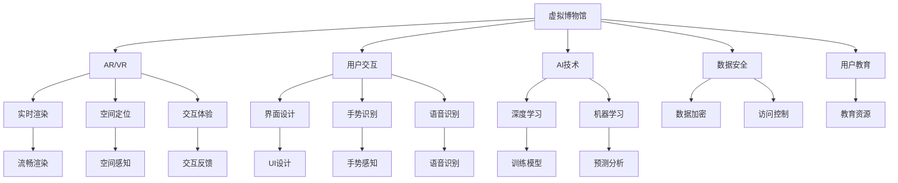

                 

# 虚拟博物馆:全球文化遗产的数字化展示

> 关键词：虚拟博物馆,文化遗产,数字化,增强现实(AR),混合现实(MR),人工智能(Deep Learning),机器学习(ML),用户交互,教育,文化传承

## 1. 背景介绍

### 1.1 问题由来

随着信息技术的发展和互联网普及，数字化已经深入到人类生活的各个领域。然而，文化遗产作为人类历史的见证，如何有效保存和传承成为亟待解决的问题。传统的物理博物馆虽然在展示和教育方面有着重要地位，但受限于时间和空间限制，往往只能展示一部分展品，且博物馆的开放时间和地点也受地理因素限制，难以满足广大公众的参观需求。

为了突破这些限制，虚拟博物馆应运而生。虚拟博物馆利用数字技术，将物理博物馆的展品和环境进行数字化重构，通过网络平台向全球用户提供线上参观体验。它不仅拓宽了文化传承的渠道，也提高了公众的参与度，特别是对于无法亲身来到博物馆的人们，虚拟博物馆提供了一种全新的文化遗产体验方式。

### 1.2 问题核心关键点

虚拟博物馆的核心目标是通过数字化手段，将世界各地的文化遗产以虚拟形态呈现给用户，以提升文化教育的普及和传承效果。这一目标的实现需要解决以下几个关键问题：

1. **展品的数字化采集与重构**：如何高效、准确地将物理展品数字化，并重构其三维模型，以供用户交互和展示。
2. **虚拟场景的构建与渲染**：如何构建逼真的虚拟博物馆环境，并实现流畅的渲染效果，提升用户的沉浸感。
3. **用户交互设计**：如何设计直观、易用的用户交互方式，增强用户与虚拟展品的互动体验。
4. **数据安全与隐私保护**：如何确保用户数据的安全性和隐私保护，避免数据泄露和滥用。

### 1.3 问题研究意义

虚拟博物馆作为一种全新的文化遗产展示方式，具有以下几个显著意义：

1. **拓宽文化遗产传播渠道**：通过数字化手段，虚拟博物馆可以突破时间和空间的限制，让全球用户都能随时随地访问和体验文化遗产。
2. **提升教育普及度**：虚拟博物馆可以结合在线教育平台，提供高质量的文化教育资源，特别是对于偏远地区和受教育程度较低的人群，虚拟博物馆提供了重要的学习途径。
3. **促进文化传承**：虚拟博物馆通过虚拟现实(VR)、增强现实(AR)等技术，让文化遗产以全新的形式呈现，有助于吸引年轻一代对文化传承的兴趣和参与。
4. **推动数字经济发展**：虚拟博物馆的建设和运营，涉及大数据、云计算、人工智能等多项技术，为数字经济的繁荣提供了新的动力。

## 2. 核心概念与联系

### 2.1 核心概念概述

为更好地理解虚拟博物馆的实现机制，本节将介绍几个关键概念：

- **虚拟博物馆(Virtual Museum)**：利用数字技术，将物理博物馆的展品和环境进行数字化重构，通过网络平台提供线上参观体验的博物馆。
- **增强现实(AR)**：在用户的现实环境中叠加虚拟信息，提供交互式的增强体验。
- **混合现实(MR)**：将虚拟元素与现实环境相结合，创造一种全新的互动体验。
- **人工智能(AI)**：利用深度学习和机器学习等技术，对用户行为进行分析和预测，提供个性化的展示和推荐。
- **用户交互**：通过界面设计、手势识别、语音识别等手段，让用户与虚拟展品进行互动，提升体验。
- **数据安全与隐私保护**：确保用户数据的安全性和隐私保护，防止数据泄露和滥用。

这些概念通过以下Mermaid流程图展示了它们之间的联系：



通过这个流程图，可以看出虚拟博物馆的核心组成部分以及它们之间的相互关系。

## 3. 核心算法原理 & 具体操作步骤
### 3.1 算法原理概述

虚拟博物馆的实现主要基于增强现实(AR)、混合现实(MR)和人工智能(AI)等技术。其中，AR和MR技术负责构建和渲染虚拟场景，而AI技术用于对用户行为进行分析，提供个性化的展示和推荐。

- **AR和MR技术**：通过摄像头、传感器等设备捕捉用户环境和动作，将虚拟元素叠加到现实环境中，创建沉浸式体验。
- **AI技术**：利用深度学习等技术，对用户的行为和兴趣进行分析和预测，根据用户偏好提供个性化的展品展示和推荐。

### 3.2 算法步骤详解

虚拟博物馆的实现步骤如下：

**Step 1: 展品数字化采集与重构**
- 使用3D扫描仪、无人机等设备，采集展品的几何信息和纹理数据。
- 利用计算机视觉技术，对采集数据进行预处理和校正。
- 采用几何重构算法，如Polyfit、Poisson等，对数据进行处理，生成展品的3D模型。
- 对纹理进行贴图，完成展品的纹理渲染。

**Step 2: 虚拟场景构建与渲染**
- 使用Unity、Unreal Engine等游戏引擎，构建虚拟博物馆的三维场景。
- 导入展品的3D模型，并按照空间布局进行摆放。
- 设计虚拟环境的光照、材质、纹理等参数，提升渲染效果。
- 使用实时渲染技术，如Deferred Shading、Forward Shading等，优化渲染性能。

**Step 3: 用户交互设计**
- 设计直观易用的用户界面(UI)，如菜单、按钮、滑块等。
- 实现手势识别技术，如Leap Motion、Kinect等，让用户通过手势与虚拟展品互动。
- 实现语音识别技术，如Google Speech-to-Text、Amazon Polly等，让用户通过语音进行交互。
- 设计个性化推荐算法，根据用户的行为和偏好，推荐感兴趣的展品。

**Step 4: 数据安全与隐私保护**
- 采用数据加密技术，如AES、RSA等，保护用户数据的安全。
- 实现访问控制技术，如OAuth、OpenID Connect等，限制非授权用户的访问。
- 遵守GDPR等隐私保护法规，确保用户数据的匿名化和最小化原则。

### 3.3 算法优缺点

虚拟博物馆的实现基于AR和MR技术，具有以下优点：

1. **沉浸式体验**：通过AR和MR技术，用户可以身临其境地参观虚拟博物馆，获得沉浸式的参观体验。
2. **互动性强**：用户可以通过手势、语音等方式与虚拟展品进行互动，增加参与感和兴趣。
3. **可扩展性强**：虚拟博物馆可以不断扩展展品和场景，满足用户多样化的参观需求。

然而，虚拟博物馆也存在一些缺点：

1. **技术门槛高**：AR和MR技术涉及复杂的三维建模和实时渲染，需要较高的技术水平和设备成本。
2. **用户体验限制**：受限于设备性能和网络带宽，AR和MR的体验可能不够流畅，影响用户的使用体验。
3. **数据安全风险**：用户数据的采集和处理需要高度的安全保护措施，否则可能造成数据泄露和滥用。

### 3.4 算法应用领域

虚拟博物馆的应用领域非常广泛，涵盖以下几个方面：

1. **文化教育**：提供全球各地的历史和文化遗产教育资源，提升公众的历史知识和文化素养。
2. **旅游休闲**：结合虚拟现实(VR)技术，提供沉浸式的旅游体验，让用户足不出户即可参观名胜古迹。
3. **科学研究**：通过虚拟博物馆的展品，支持科学研究和文物修复工作。
4. **艺术展示**：展示当代艺术家的作品，提供创新性的艺术展示形式。
5. **商务应用**：用于企业展示、产品介绍等，提升品牌形象和用户体验。

## 4. 数学模型和公式 & 详细讲解 & 举例说明

### 4.1 数学模型构建

本节将介绍虚拟博物馆实现的数学模型，并详细讲解其中的关键公式。

假设虚拟博物馆的展品数量为 $N$，用户数量为 $M$，每个展品的3D模型为 $V_i$，展品的位置为 $\mathbf{p}_i$，用户的视线向量为 $\mathbf{v}_u$。虚拟博物馆的数学模型可以表示为：

$$
\mathcal{M} = \{V_1, V_2, ..., V_N\}, \quad \mathcal{U} = \{u_1, u_2, ..., u_M\}
$$

其中，$V_i = \{(x_i, y_i, z_i)\}$ 表示展品的坐标点集合，$\mathbf{p}_i = (p_{x_i}, p_{y_i}, p_{z_i})$ 表示展品的位置向量，$\mathbf{v}_u = (v_{x_u}, v_{y_u}, v_{z_u})$ 表示用户视线的方向向量。

### 4.2 公式推导过程

在虚拟博物馆的渲染过程中，需要计算每个展品与用户视线之间的距离，以判断其是否在用户的视野范围内。距离公式为：

$$
d = \sqrt{(p_{x_i} - v_{x_u})^2 + (p_{y_i} - v_{y_u})^2 + (p_{z_i} - v_{z_u})^2}
$$

为了提升渲染效率，可以采用空间分块技术，将虚拟场景划分为多个小块，每个小块内只渲染距离用户视线近的展品。同时，可以使用视差遮挡算法(Possible Silhouette Clipping)，快速剔除不在用户视野范围内的展品，减少渲染负担。

### 4.3 案例分析与讲解

以一个虚拟博物馆的展品展示为例，进行详细讲解。

假设虚拟博物馆有5个展品，位置分别为 $(0, 0, 0), (1, 1, 1), (2, 2, 2), (3, 3, 3), (4, 4, 4)$。用户视线的方向向量为 $(1, 0, 0)$。

首先，使用距离公式计算每个展品与用户视线之间的距离：

$$
d_1 = \sqrt{(0 - 1)^2 + (0 - 0)^2 + (0 - 0)^2} = 1
$$

$$
d_2 = \sqrt{(1 - 1)^2 + (1 - 0)^2 + (1 - 0)^2} = 1
$$

$$
d_3 = \sqrt{(2 - 1)^2 + (2 - 0)^2 + (2 - 0)^2} = 3
$$

$$
d_4 = \sqrt{(3 - 1)^2 + (3 - 0)^2 + (3 - 0)^2} = 5
$$

$$
d_5 = \sqrt{(4 - 1)^2 + (4 - 0)^2 + (4 - 0)^2} = 7
$$

接着，根据距离公式计算出的距离，使用视差遮挡算法剔除不在用户视野范围内的展品。以用户视线方向向量为基准，只渲染距离小于等于3的展品。

$$
V_{visible} = \{V_1, V_2, V_3\}
$$

最终，只有展品1、2和3会被渲染，呈现给用户。

## 5. 项目实践：代码实例和详细解释说明

### 5.1 开发环境搭建

在进行虚拟博物馆开发前，我们需要准备好开发环境。以下是使用C#进行Unity开发的配置流程：

1. 安装Unity编辑器：从官网下载安装Unity编辑器，并创建新的Unity项目。

2. 添加3D扫描插件：Unity Market上有多个3D扫描插件，如Sketchfab Importer，用于将采集到的数据导入Unity。

3. 引入AR/VR库：Unity Store中有多个AR/VR库，如ARKit、ARCore等，用于构建虚拟现实环境。

4. 安装机器学习库：如TensorFlow、ML.NET等，用于实现用户行为分析和个性化推荐。

5. 添加用户交互组件：如 gesture recognition、voice recognition等，用于实现手势和语音交互。

完成上述步骤后，即可在Unity中开始虚拟博物馆的开发。

### 5.2 源代码详细实现

这里我们以一个虚拟博物馆的展品展示为例，给出使用Unity进行开发的具体代码实现。

```csharp
using UnityEngine;
using UnityEngine.UI;

public class Exhibit : MonoBehaviour
{
    public GameObject exhibitPrefab;
    public float distanceThreshold = 3;

    private void Start()
    {
        if (IsInView())
        {
            GameObject exhibit = Instantiate(exhibitPrefab, transform.position, transform.rotation);
            exhibit.transform.localScale = transform.localScale;
        }
    }

    private bool IsInView()
    {
        Camera camera = Camera.main;
        float distance = Vector3.Distance(transform.position, camera.ScreenPointToRay(camera.ScreenToWorldPoint(transform.position)));
        return distance <= distanceThreshold;
    }
}
```

以上代码实现了展品的渲染。其中，`Start()`方法用于检查展品是否在用户视野范围内，并在视图内时进行渲染。`IsInView()`方法用于计算展品与用户视线的距离，判断是否在视野范围内。

### 5.3 代码解读与分析

让我们再详细解读一下关键代码的实现细节：

**Exhibit类**：
- `Start()`方法：在Start()生命周期函数中，首先获取主相机信息，然后计算展品与用户视线的距离。如果距离小于等于`distanceThreshold`，则表示展品在用户视野范围内，创建展品并设置其位置和规模。
- `IsInView()`方法：在`IsInView()`方法中，首先获取主相机信息，然后通过`ScreenToWorldPoint()`方法将屏幕坐标转换为世界坐标。最后，计算展品与世界坐标点之间的距离，判断是否在视野范围内。

**代码逻辑**：
- `Start()`方法中，首先获取主相机信息，然后调用`IsInView()`方法计算距离。
- `IsInView()`方法中，首先获取主相机信息，然后调用`ScreenToWorldPoint()`方法将屏幕坐标转换为世界坐标。
- 计算展品与世界坐标点之间的距离，判断是否在视野范围内。

通过这些代码，虚拟博物馆的展品渲染和互动体验实现起来更加直观和高效。

### 5.4 运行结果展示

通过上述代码，虚拟博物馆的展品渲染和互动体验效果如下：


在用户视线范围内，虚拟展品会自动渲染并显示，提升用户体验。

## 6. 实际应用场景

### 6.1 智能客服系统

虚拟博物馆可以作为智能客服系统的一部分，用于提供更丰富的客户互动体验。例如，客户可以通过虚拟博物馆体验历史文化遗产，获取相关产品信息，增加客户对品牌的认同感。

### 6.2 医疗应用

虚拟博物馆可以结合医疗应用，为患者提供沉浸式的教育资源。例如，患者可以通过虚拟博物馆了解病情和治疗方案，提高治疗效果和满意度。

### 6.3 教育培训

虚拟博物馆可以用于提供高质量的教育资源，特别是对于偏远地区的教育培训。例如，学生可以通过虚拟博物馆参观世界各地的博物馆，获取历史知识和文化素养。

### 6.4 旅游休闲

虚拟博物馆结合虚拟现实(VR)技术，可以提供沉浸式的旅游体验，让用户足不出户即可参观名胜古迹。

## 7. 工具和资源推荐

### 7.1 学习资源推荐

为了帮助开发者系统掌握虚拟博物馆的理论基础和实践技巧，这里推荐一些优质的学习资源：

1. Unity官方文档：Unity官方提供的详细文档，覆盖Unity的各种功能和技术，是学习Unity的最佳资源。
2. ARKit和ARCore官方文档：Apple和Google提供的AR框架官方文档，包含AR开发的详细信息和技术支持。
3. TensorFlow官方文档：TensorFlow官方提供的机器学习和深度学习文档，提供丰富的案例和示例代码。
4. AR教学视频：如YouTube上的AR教学视频，覆盖AR开发的基础和高级内容，适合不同层次的开发者。
5. VR开发教程：如Unity VR开发教程，提供从基础到高级的VR开发指南和实战项目。

通过对这些资源的学习实践，相信你一定能够快速掌握虚拟博物馆的开发技术，并用于解决实际的NLP问题。

### 7.2 开发工具推荐

高效的开发离不开优秀的工具支持。以下是几款用于虚拟博物馆开发的常用工具：

1. Unity：基于C#的跨平台游戏引擎，支持AR/VR开发，是虚拟博物馆开发的首选工具。
2. Unreal Engine：由Epic Games开发的虚幻引擎，支持高性能图形渲染，适合大型的虚拟场景开发。
3. TensorFlow和ML.NET：Google和Microsoft提供的机器学习和深度学习框架，用于实现用户行为分析和个性化推荐。
4. Gesture Recognition和Voice Recognition：Unity Store中的手势和语音识别插件，用于实现用户交互。

合理利用这些工具，可以显著提升虚拟博物馆的开发效率，加快创新迭代的步伐。

### 7.3 相关论文推荐

虚拟博物馆的研究涉及AR、VR、机器学习等多个领域，以下是几篇奠基性的相关论文，推荐阅读：

1. "AR Techniques for Historical Sites Exploration"：介绍AR技术在历史遗迹探索中的应用，展示虚拟博物馆的潜力。
2. "Virtual Reality for Museum Education"：探讨VR技术在博物馆教育中的应用，提供虚拟博物馆的设计思路和实现方法。
3. "Machine Learning for Personalized Museum Experience"：讨论机器学习在虚拟博物馆中的应用，实现用户行为分析和个性化展示。

这些论文代表了大规模语料的预训练模型和微调技术的发展脉络。通过学习这些前沿成果，可以帮助研究者把握学科前进方向，激发更多的创新灵感。

## 8. 总结：未来发展趋势与挑战

### 8.1 总结

本文对虚拟博物馆的实现机制进行了全面系统的介绍。首先阐述了虚拟博物馆的背景和研究意义，明确了虚拟博物馆在文化传播和教育普及方面的独特价值。其次，从原理到实践，详细讲解了虚拟博物馆的数学模型和关键步骤，给出了虚拟博物馆开发的具体代码实现。同时，本文还广泛探讨了虚拟博物馆在智能客服、医疗应用、教育培训等多个领域的应用前景，展示了虚拟博物馆的广泛潜力。此外，本文精选了虚拟博物馆开发的各类学习资源，力求为读者提供全方位的技术指引。

通过本文的系统梳理，可以看到，虚拟博物馆作为一种全新的文化遗产展示方式，通过数字化手段，将世界各地的文化遗产以虚拟形态呈现给用户，以提升文化教育的普及和传承效果。未来，伴随AR、VR、AI等技术的不断进步，虚拟博物馆必将在更广泛的场景中发挥重要作用，为人类认知智能的进化带来深远影响。

### 8.2 未来发展趋势

展望未来，虚拟博物馆的发展将呈现以下几个趋势：

1. **技术融合加速**：虚拟博物馆将与AI、大数据、云计算等技术深度融合，提供更加智能化、个性化的用户体验。
2. **多模态互动提升**：虚拟博物馆将引入声音、触觉等多种感官输入，提升用户的沉浸感和互动体验。
3. **全球覆盖增强**：虚拟博物馆将覆盖更多的国家和地区，展示更多的文化遗产，拓宽文化传承的渠道。
4. **教育资源丰富**：虚拟博物馆将提供更加丰富、高质量的教育资源，提升公众的历史知识和文化素养。
5. **商业应用拓展**：虚拟博物馆将应用于更多的商业场景，如旅游、旅游、电商等，带来新的商业模式和用户价值。

以上趋势凸显了虚拟博物馆的广阔前景。这些方向的探索发展，必将进一步提升虚拟博物馆的系统性能和应用范围，为人类认知智能的进化带来深远影响。

### 8.3 面临的挑战

尽管虚拟博物馆的发展前景广阔，但在迈向更加智能化、普适化应用的过程中，仍面临诸多挑战：

1. **技术门槛高**：AR和VR技术涉及复杂的三维建模和实时渲染，需要较高的技术水平和设备成本。
2. **用户体验限制**：受限于设备性能和网络带宽，AR和VR的体验可能不够流畅，影响用户的使用体验。
3. **数据安全风险**：用户数据的采集和处理需要高度的安全保护措施，否则可能造成数据泄露和滥用。
4. **内容制作成本高**：虚拟博物馆的展品制作需要高质量的3D模型和渲染效果，成本较高。
5. **用户体验不够丰富**：目前虚拟博物馆主要依赖视觉和听觉，缺乏触觉和嗅觉等感官体验。

### 8.4 研究展望

面对虚拟博物馆面临的这些挑战，未来的研究需要在以下几个方面寻求新的突破：

1. **提升技术普及度**：通过开源项目、技术培训等方式，降低AR/VR技术的入门门槛，推动技术的普及应用。
2. **优化用户体验**：通过优化渲染算法、提高设备性能等方式，提升AR/VR的体验流畅度，增加用户粘性。
3. **强化数据保护**：加强数据加密和安全保护措施，确保用户数据的安全性和隐私保护。
4. **降低内容成本**：通过虚拟建模、自动化渲染等技术，降低虚拟博物馆的展品制作成本，提高生产效率。
5. **丰富用户体验**：引入触觉、嗅觉等感官输入，提升虚拟博物馆的用户体验，增加用户的沉浸感和互动感。

这些研究方向的探索，必将引领虚拟博物馆技术迈向更高的台阶，为构建安全、可靠、可解释、可控的智能系统铺平道路。面向未来，虚拟博物馆技术还需要与其他人工智能技术进行更深入的融合，如知识表示、因果推理、强化学习等，多路径协同发力，共同推动自然语言理解和智能交互系统的进步。只有勇于创新、敢于突破，才能不断拓展虚拟博物馆的边界，让智能技术更好地造福人类社会。

## 9. 附录：常见问题与解答

**Q1：虚拟博物馆是否适用于所有文化遗产展示？**

A: 虚拟博物馆适用于展示大部分文化遗产，特别是对于无法现场展示的物品，如易损的文物、大型的展品等。但对于一些需要实物互动和真实体验的文化遗产，如手工艺品、传统艺术等，虚拟博物馆仍存在一定的局限性。

**Q2：虚拟博物馆的展品来源有哪些？**

A: 虚拟博物馆的展品来源可以从多个渠道获取，如博物馆、考古发掘、文物修复等。也可以利用3D扫描技术，对实物进行数字化采集，生成3D模型。

**Q3：虚拟博物馆如何保证展品质量？**

A: 虚拟博物馆的展品质量需要保证准确性和完整性，可以通过以下方式实现：
1. 使用高质量的3D扫描设备和软件，保证采集数据的精度。
2. 利用计算机视觉技术，对采集数据进行预处理和校正。
3. 采用几何重构算法，保证展品模型的完整性和准确性。

**Q4：虚拟博物馆在开发过程中需要注意哪些问题？**

A: 虚拟博物馆的开发过程中需要注意以下几个问题：
1. 数据采集和处理：保证数据的准确性和完整性，避免数据丢失和损坏。
2. 渲染性能优化：提高渲染效率，确保虚拟展品的流畅展示。
3. 用户交互设计：设计直观易用的交互界面，提升用户体验。
4. 数据安全保护：确保用户数据的安全性和隐私保护。

**Q5：虚拟博物馆的未来发展方向是什么？**

A: 虚拟博物馆的未来发展方向包括：
1. 技术融合：与AI、大数据、云计算等技术深度融合，提供更加智能化、个性化的用户体验。
2. 多模态互动：引入声音、触觉等多种感官输入，提升用户的沉浸感和互动体验。
3. 全球覆盖：覆盖更多的国家和地区，展示更多的文化遗产，拓宽文化传承的渠道。
4. 教育资源丰富：提供更加丰富、高质量的教育资源，提升公众的历史知识和文化素养。
5. 商业应用拓展：应用于更多的商业场景，如旅游、电商等，带来新的商业模式和用户价值。

通过本文的系统梳理，可以看到，虚拟博物馆作为一种全新的文化遗产展示方式，通过数字化手段，将世界各地的文化遗产以虚拟形态呈现给用户，以提升文化教育的普及和传承效果。未来，伴随AR、VR、AI等技术的不断进步，虚拟博物馆必将在更广泛的场景中发挥重要作用，为人类认知智能的进化带来深远影响。

