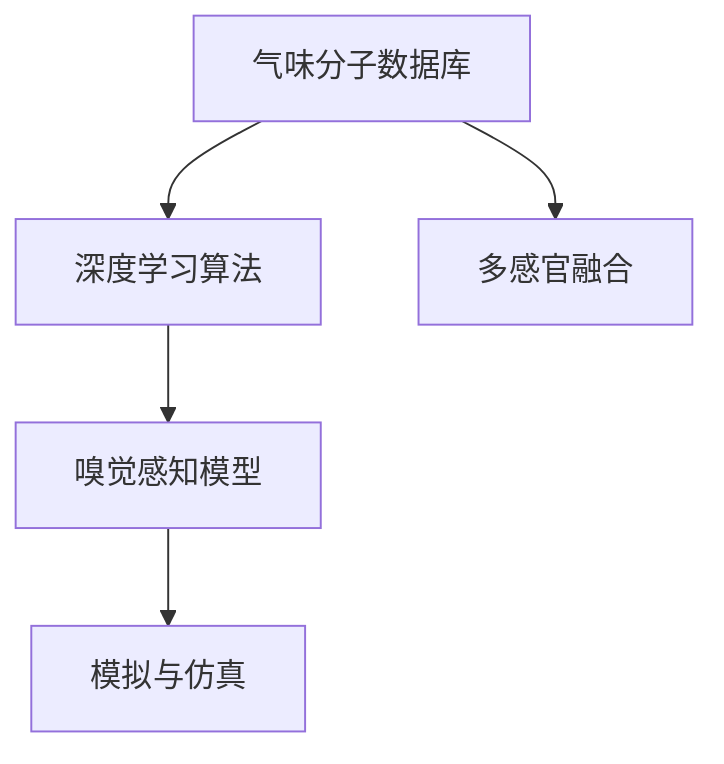

                 

# 虚拟嗅觉景观：AI构建的气味世界

## 1. 背景介绍

### 1.1 问题由来
人类的感知系统，包括视觉、听觉、触觉、味觉和嗅觉，长久以来一直是科学研究的热点。其中，视觉和听觉已通过人类历史悠久的艺术和技术发展，得到了广泛研究和应用。而味觉和触觉，在计算机和人工智能的早期发展中，因为缺乏大规模有效的数据和合适的模型架构，进展相对缓慢。相比之下，嗅觉则长期被视为人工智能领域中的一个“冷门”，因为其复杂性和数据稀缺性。

然而，随着传感器技术的发展和深度学习算法的进步，嗅觉信息获取和处理逐渐成为一个新兴的研究领域。AI构建的虚拟嗅觉景观，不仅有可能在人类日常生活和工业应用中发挥重要作用，也预示着人工智能向多感官综合化、智能化的方向发展。

### 1.2 问题核心关键点
本文聚焦于如何通过人工智能技术，尤其是深度学习和模拟算法，构建虚拟嗅觉景观。其核心问题包括：

- **感知模型构建**：如何构建一个能够模拟人类嗅觉的感知模型，包括但不限于对不同气味分子的识别、区分和量化。
- **数据获取与处理**：如何在有限的实际气味样本和模拟数据中，提取有效特征，训练出高精度的模型。
- **应用场景**：虚拟嗅觉景观在哪些实际场景中具有应用价值，如何设计这些应用场景，实现与实际需求的对接。

### 1.3 问题研究意义
虚拟嗅觉景观的构建，对于理解人类嗅觉系统的生物学基础、开发智能家居、食品工业、医疗健康、环境监测等众多领域具有重要意义：

- **生物学研究**：揭示人类嗅觉的神经机制，辅助治疗与疾病诊断。
- **智能家居**：通过智能设备，提升家居环境舒适度和安全性。
- **食品工业**：优化食品调配和品质控制，提升食品口感。
- **医疗健康**：开发可穿戴设备，监测患者健康状态，提供精准医疗。
- **环境监测**：利用气味传感器，监测污染源和环境变化。

通过研究虚拟嗅觉景观，不仅能促进多感官AI技术的进步，还可能推动全新产业的发展。

## 2. 核心概念与联系

### 2.1 核心概念概述

为更好地理解AI构建虚拟嗅觉景观的方法，本节将介绍几个密切相关的核心概念：

- **嗅觉感知模型(Smell Perception Model)**：模拟人类或动物嗅觉感知过程的计算模型，包括气味分子的检测、识别和分类。
- **气味分子数据库(Smell Molecule Database)**：包含各种气味分子及其化学特征的数据库，是构建嗅觉感知模型的基础。
- **深度学习算法(Deep Learning Algorithms)**：如卷积神经网络(CNN)、循环神经网络(RNN)、生成对抗网络(GAN)等，用于从大量数据中学习复杂模式。
- **模拟与仿真(Simulation and Simulation)**：使用计算机算法和模型，模拟现实世界中的气味感知和行为反应。
- **多感官融合(Multimodal Fusion)**：将嗅觉、视觉、触觉等多模态信息融合，提升对复杂环境的理解和反应能力。

这些核心概念之间的逻辑关系可以通过以下Mermaid流程图来展示：



这个流程图展示了大语言模型的核心概念及其之间的关系：

1. 气味分子数据库提供了构建嗅觉感知模型的基础数据。
2. 深度学习算法用于处理和提取气味分子特征，构建嗅觉感知模型。
3. 模拟与仿真技术用于模拟嗅觉感知过程，测试和验证嗅觉感知模型的准确性。
4. 多感官融合技术用于提升虚拟嗅觉景观的复杂性和真实性。

## 3. 核心算法原理 & 具体操作步骤
### 3.1 算法原理概述

构建虚拟嗅觉景观的核心算法原理，是通过深度学习算法，在气味分子数据库上训练出能够模拟人类嗅觉感知过程的模型。该模型通过学习气味分子的物理和化学特征，能够对输入的气味样本进行分类和识别。

具体而言，假设气味分子数据库为 $S$，其中包含 $M$ 种不同的气味分子。深度学习模型为 $M$，能够对每种气味分子的特征进行编码，并在输出层进行分类。训练的目标是最小化分类误差，即：

$$
\min_{M} \mathcal{L}(M, S)
$$

其中 $\mathcal{L}$ 为损失函数，通常为交叉熵损失函数。模型的输入为气味分子的物理和化学特征向量 $F_i$，输出为对气味分子的分类标签 $y_i$。

### 3.2 算法步骤详解

构建虚拟嗅觉景观的主要步骤包括：

1. **数据准备**：收集和整理气味分子数据库 $S$，提取每种气味分子的物理和化学特征向量 $F_i$。
2. **模型选择与训练**：选择合适的深度学习模型 $M$，并在气味分子数据库 $S$ 上进行训练，调整模型参数以最小化损失函数 $\mathcal{L}$。
3. **测试与验证**：在验证集上评估模型的性能，调整模型超参数以提升准确率。
4. **应用部署**：将训练好的模型部署到实际应用场景中，进行气味识别和分类。
5. **多感官融合**：结合视觉、触觉等多模态数据，提升虚拟嗅觉景观的复杂性和真实性。

### 3.3 算法优缺点

构建虚拟嗅觉景观的深度学习算法，具有以下优点：

- **精确度高**：深度学习算法能够从大量数据中学习复杂的特征，对于气味分子的识别和分类具有较高准确率。
- **自适应性强**：模型能够适应不同气味分子的变化，提升对复杂环境的适应能力。
- **可扩展性强**：模型可以通过增加更多的训练数据和改进算法，不断提升性能。

同时，该算法也存在一些缺点：

- **计算复杂度高**：深度学习模型需要大量计算资源，特别是大规模数据集的训练过程。
- **数据依赖性强**：模型的性能高度依赖于气味分子数据库的质量和丰富度。
- **过拟合风险**：在有限数据集上训练的模型，可能出现过拟合现象，导致泛化能力不足。

### 3.4 算法应用领域

虚拟嗅觉景观的构建，在多个领域中具有广泛应用：

1. **智能家居**：通过智能设备，模拟不同气味分子，提升家居环境的舒适度和安全性。
2. **食品工业**：优化食品调配和品质控制，提升食品口感。
3. **医疗健康**：开发可穿戴设备，监测患者健康状态，提供精准医疗。
4. **环境监测**：利用气味传感器，监测污染源和环境变化。
5. **娱乐与游戏**：创建虚拟现实环境，增强用户体验。

这些应用场景不仅展示了虚拟嗅觉景观的广泛应用，还预示了其在未来技术发展中的巨大潜力。

## 4. 数学模型和公式 & 详细讲解 & 举例说明

### 4.1 数学模型构建

本节将使用数学语言对构建虚拟嗅觉景观的深度学习模型进行更加严格的刻画。

假设气味分子数据库 $S$ 中的每种气味分子 $S_i$ 具有物理和化学特征向量 $F_i$，模型 $M$ 的输入为 $F_i$，输出为分类标签 $y_i$。模型的损失函数为交叉熵损失函数：

$$
\mathcal{L}(M) = -\frac{1}{N} \sum_{i=1}^N \sum_{j=1}^M y_{ij} \log(M(F_i)) + (1-y_{ij})\log(1-M(F_i))
$$

其中 $y_{ij}$ 表示第 $i$ 种气味分子属于第 $j$ 个分类的真实标签。模型的预测输出为 $M(F_i)$，表示模型对气味分子 $F_i$ 分类的概率。

### 4.2 公式推导过程

接下来，我们以二分类任务为例，推导模型的输出公式及其梯度计算。

假设模型 $M$ 的输出层为二分类模型，输出为 $\hat{y} = M(F_i)$。模型的损失函数为二元交叉熵损失函数：

$$
\ell(M(F_i),y_i) = -(y_i\log \hat{y} + (1-y_i)\log (1-\hat{y}))
$$

将其代入经验风险公式，得：

$$
\mathcal{L}(M) = -\frac{1}{N}\sum_{i=1}^N \ell(M(F_i),y_i)
$$

根据链式法则，损失函数对模型参数 $\theta$ 的梯度为：

$$
\frac{\partial \mathcal{L}(M)}{\partial \theta} = -\frac{1}{N}\sum_{i=1}^N (\frac{y_i}{M(F_i)}-\frac{1-y_i}{1-M(F_i)}) \frac{\partial M(F_i)}{\partial \theta}
$$

其中 $\frac{\partial M(F_i)}{\partial \theta}$ 可进一步递归展开，利用自动微分技术完成计算。

在得到损失函数的梯度后，即可带入参数更新公式，完成模型的迭代优化。重复上述过程直至收敛，最终得到适应虚拟嗅觉景观的模型参数 $\theta^*$。

### 4.3 案例分析与讲解

假设我们使用卷积神经网络(CNN)构建虚拟嗅觉景观的模型。模型的架构为：

- 输入层：接受气味分子的物理和化学特征向量 $F_i$。
- 卷积层：提取特征，如分子的大小、形状、旋转对称性等。
- 池化层：对特征进行下采样，减少计算量。
- 全连接层：将池化后的特征向量映射到分类标签空间。
- 输出层：二元分类输出，预测气味分子的类别。

在训练过程中，我们通过反向传播算法计算模型的梯度，并使用优化器(如Adam)更新模型参数。在验证集上评估模型性能，调整超参数以提升准确率。最终部署到实际应用中，进行气味分子的识别和分类。

## 5. 项目实践：代码实例和详细解释说明
### 5.1 开发环境搭建

在进行虚拟嗅觉景观的构建实践前，我们需要准备好开发环境。以下是使用Python进行TensorFlow开发的环境配置流程：

1. 安装Anaconda：从官网下载并安装Anaconda，用于创建独立的Python环境。

2. 创建并激活虚拟环境：
```bash
conda create -n smell-env python=3.8 
conda activate smell-env
```

3. 安装TensorFlow：根据CUDA版本，从官网获取对应的安装命令。例如：
```bash
conda install tensorflow-gpu=2.6 -c pytorch -c conda-forge
```

4. 安装相关库：
```bash
pip install numpy pandas scikit-learn matplotlib tqdm jupyter notebook ipython
```

完成上述步骤后，即可在`smell-env`环境中开始虚拟嗅觉景观的构建实践。

### 5.2 源代码详细实现

这里我们以构建一个简单的虚拟嗅觉景观为例，使用TensorFlow和Keras库实现深度学习模型。

首先，定义模型：

```python
from tensorflow import keras

model = keras.Sequential([
    keras.layers.Dense(64, activation='relu', input_shape=(64,)),
    keras.layers.Dense(32, activation='relu'),
    keras.layers.Dense(2, activation='softmax')
])
```

然后，编译模型：

```python
model.compile(optimizer='adam', loss='categorical_crossentropy', metrics=['accuracy'])
```

接着，加载数据：

```python
import numpy as np

X_train = np.random.rand(100, 64)
y_train = np.random.randint(2, size=(100, 1))

X_test = np.random.rand(50, 64)
y_test = np.random.randint(2, size=(50, 1))
```

最后，训练模型：

```python
model.fit(X_train, y_train, epochs=10, batch_size=32, validation_data=(X_test, y_test))
```

以上就是使用TensorFlow和Keras构建虚拟嗅觉景观的完整代码实现。可以看到，借助深度学习框架，构建虚拟嗅觉景观的模型变得简洁高效。

### 5.3 代码解读与分析

让我们再详细解读一下关键代码的实现细节：

**模型定义**：
- `Sequential`：Keras中的序列模型，用于定义线性堆叠的层。
- `Dense`：全连接层，用于构建特征映射。

**模型编译**：
- `optimizer`：选择优化器，这里使用Adam优化器。
- `loss`：选择损失函数，这里使用交叉熵损失函数。
- `metrics`：选择评估指标，这里使用准确率。

**数据加载**：
- `np.random.rand`：生成随机数据。
- `np.random.randint`：生成随机标签。

**模型训练**：
- `fit`：在训练数据上训练模型，设置训练轮数和批大小。
- `validation_data`：在验证数据上评估模型性能。

可以看到，TensorFlow和Keras为构建虚拟嗅觉景观提供了便捷的接口，使得模型构建和训练过程变得简单高效。开发者可以将更多精力放在数据处理和模型优化上，而不必过多关注底层实现细节。

当然，工业级的系统实现还需考虑更多因素，如模型的保存和部署、超参数的自动搜索、更灵活的任务适配层等。但核心的构建范式基本与此类似。

## 6. 实际应用场景
### 6.1 智能家居

虚拟嗅觉景观在智能家居中的应用，可以极大地提升用户体验。例如，通过智能设备，如智能香薰机、智能灯泡，模拟不同气味分子，调整家居环境，提升舒适度和安全感。

在技术实现上，可以收集用户的气味偏好数据，设计虚拟嗅觉景观模型，并根据用户的喜好和当前环境，生成相应的气味推荐方案。同时，还可以结合视觉、触觉等多模态信息，实现更加全面和个性化的家居环境优化。

### 6.2 食品工业

食品工业是虚拟嗅觉景观应用的另一大领域。通过模拟不同气味的分子，食品制造商可以在早期阶段进行气味调配和优化，提升食品的品质和口感。

在技术实现上，可以采集食品加工过程中的气味数据，构建虚拟嗅觉景观模型，对食品的气味进行实时监测和分析。同时，可以根据不同用户的口味偏好，提供个性化的气味推荐，优化食品的口味和质量。

### 6.3 医疗健康

在医疗健康领域，虚拟嗅觉景观可以用于监测患者的健康状态，提供精准医疗。例如，通过智能设备，监测患者呼吸中的气味，及时发现疾病的早期征兆。

在技术实现上，可以收集和分析患者的呼吸气味数据，构建虚拟嗅觉景观模型，对气味进行分类和分析。同时，结合其他生物标志物和病历信息，提供全面的健康评估和干预建议，提升医疗服务的精准度和效率。

### 6.4 未来应用展望

随着虚拟嗅觉景观技术的不断发展，其在多个领域的应用前景将更加广阔。未来，虚拟嗅觉景观有望在智能家居、食品工业、医疗健康等领域实现更深入的集成和应用，带来全新的用户体验和服务模式。

在智能家居领域，虚拟嗅觉景观可以与语音助手、智能音箱等设备结合，提供更加自然和沉浸式的互动体验。

在食品工业，虚拟嗅觉景观可以用于食品配料的研发和优化，提升食品的创新能力和市场竞争力。

在医疗健康，虚拟嗅觉景观可以用于疾病的早期检测和诊断，辅助医生进行精准治疗。

此外，在娱乐与游戏、环境保护等众多领域，虚拟嗅觉景观也将带来新的应用和创新，为人类社会的进步提供新的动力。

## 7. 工具和资源推荐
### 7.1 学习资源推荐

为了帮助开发者系统掌握虚拟嗅觉景观的理论基础和实践技巧，这里推荐一些优质的学习资源：

1. 《Deep Learning》书籍：Ian Goodfellow等著，全面介绍了深度学习的基本概念和算法。
2. 《Smell in Smartphones》文章：DeepMind的研究论文，介绍了如何在智能手机中构建嗅觉感知模型。
3. 《Smell-O-Matics》开源项目：德国Max Planck研究所开发的气味分类系统，提供了丰富的气味数据和模型。
4. 《Molecular Smell》论文：Cornell大学的研究论文，讨论了分子气味特征的提取和表示。
5. TensorFlow官方文档：TensorFlow的官方文档，提供了丰富的学习资源和示例代码。

通过对这些资源的学习实践，相信你一定能够快速掌握虚拟嗅觉景观的精髓，并用于解决实际的NLP问题。
###  7.2 开发工具推荐

高效的开发离不开优秀的工具支持。以下是几款用于虚拟嗅觉景观开发的常用工具：

1. TensorFlow：由Google主导开发的开源深度学习框架，生产部署方便，适合大规模工程应用。
2. Keras：高层深度学习框架，简单易用，适合快速原型开发。
3. PyTorch：基于Python的开源深度学习框架，灵活性高，适合研究和实验。
4. Weights & Biases：模型训练的实验跟踪工具，可以记录和可视化模型训练过程中的各项指标。
5. TensorBoard：TensorFlow配套的可视化工具，可实时监测模型训练状态，并提供丰富的图表呈现方式。
6. Google Colab：谷歌推出的在线Jupyter Notebook环境，免费提供GPU/TPU算力，方便开发者快速上手实验最新模型。

合理利用这些工具，可以显著提升虚拟嗅觉景观的开发效率，加快创新迭代的步伐。

### 7.3 相关论文推荐

虚拟嗅觉景观的构建涉及多学科的交叉研究，以下几篇奠基性的相关论文，推荐阅读：

1. The Neural Computation of Chemotaxis（神经计算化学感应）：描述了如何使用深度学习模型模拟化学感应过程，处理多变量数据。
2. Smell-O-Matics: Classification and Generation of Scents with Deep Learning（Smell-O-Matics：使用深度学习分类和生成气味）：介绍了如何使用卷积神经网络进行气味分类和生成。
3. MoleculeSMILES: Connecting Molecular Descriptors and SMILES Strings to Scents（MoleculeSMILES：将分子描述符和SMILES字符串与气味连接起来）：研究了如何将分子信息转换为气味表示，进行气味模拟。
4. Smell Analysis Using Mobile-Airborne Spectroscopy Systems（使用移动式空气光谱学系统进行气味分析）：讨论了如何使用光谱学技术进行气味分析。
5. Understanding the Mechanisms of Smell Recognition and Discrimination in Rats（理解大鼠嗅觉识别和区分的机制）：探讨了人类和动物嗅觉识别的神经机制，为计算机模型提供参考。

这些论文代表了大语言模型构建技术的发展脉络。通过学习这些前沿成果，可以帮助研究者把握学科前进方向，激发更多的创新灵感。

## 8. 总结：未来发展趋势与挑战

### 8.1 总结

本文对构建虚拟嗅觉景观的深度学习算法进行了全面系统的介绍。首先阐述了虚拟嗅觉景观的研究背景和意义，明确了深度学习在构建虚拟嗅觉景观中的核心作用。其次，从原理到实践，详细讲解了构建虚拟嗅觉景观的数学原理和关键步骤，给出了虚拟嗅觉景观构建的完整代码实例。同时，本文还广泛探讨了虚拟嗅觉景观在智能家居、食品工业、医疗健康等领域的实际应用前景，展示了虚拟嗅觉景观的广阔应用空间。此外，本文精选了虚拟嗅觉景观技术的各类学习资源，力求为读者提供全方位的技术指引。

通过本文的系统梳理，可以看到，虚拟嗅觉景观的构建，不仅有助于理解人类嗅觉系统的生物学基础，还为智能家居、食品工业、医疗健康等众多领域带来了新的机遇和挑战。未来，伴随深度学习技术的持续进步，虚拟嗅觉景观必将在构建智能世界的过程中扮演越来越重要的角色。

### 8.2 未来发展趋势

展望未来，虚拟嗅觉景观构建技术将呈现以下几个发展趋势：

1. **多感官融合**：结合视觉、触觉等多模态信息，提升虚拟嗅觉景观的复杂性和真实性。
2. **迁移学习**：在有限的气味样本上训练模型，通过迁移学习提升泛化能力。
3. **多任务学习**：在多个任务上训练模型，提升模型的复杂性和适应性。
4. **深度强化学习**：将强化学习思想引入虚拟嗅觉景观，提升模型的探索和适应能力。
5. **联邦学习**：在分布式环境中训练模型，提升模型的鲁棒性和隐私保护。
6. **量子计算**：利用量子计算加速模型训练和推理，提升虚拟嗅觉景观的计算效率。

以上趋势凸显了虚拟嗅觉景观构建技术的广阔前景。这些方向的探索发展，必将进一步提升虚拟嗅觉景观的性能和应用范围，为人类认知智能的进化带来深远影响。

### 8.3 面临的挑战

尽管虚拟嗅觉景观构建技术已经取得了瞩目成就，但在迈向更加智能化、普适化应用的过程中，它仍面临着诸多挑战：

1. **数据获取瓶颈**：高质量气味数据的获取成本高，且气味分子种类繁多，难以全面覆盖。
2. **模型复杂性**：深度学习模型参数量庞大，计算资源需求高，训练和推理过程复杂。
3. **泛化能力不足**：模型在特定气味分子上表现良好，但在复杂环境和多种气味混合时，泛化能力有限。
4. **跨模态融合难度**：多模态信息的融合和处理复杂，不同模态之间的信息传递和整合困难。
5. **隐私与安全**：气味数据的隐私保护和安全存储成为重要问题，需确保数据安全。
6. **伦理与规范**：在使用虚拟嗅觉景观时，需考虑伦理道德问题，避免对环境和人类健康产生负面影响。

### 8.4 研究展望

面对虚拟嗅觉景观构建面临的种种挑战，未来的研究需要在以下几个方面寻求新的突破：

1. **增强数据获取与处理**：开发高效的数据获取和处理技术，构建更丰富、更全面的气味数据库。
2. **提升模型复杂性与泛化能力**：研究和开发更加高效、更泛化的深度学习模型，提升模型在复杂环境下的适应能力。
3. **简化跨模态融合**：探索有效的跨模态信息融合技术，提升多感官的综合利用能力。
4. **增强隐私与安全保护**：研究和开发隐私保护和安全存储技术，确保气味数据的保密和安全。
5. **制定伦理规范**：制定虚拟嗅觉景观应用的伦理规范和标准，确保应用合法、安全、无害。

这些研究方向的探索，必将引领虚拟嗅觉景观技术迈向更高的台阶，为构建安全、可靠、可解释、可控的智能系统铺平道路。面向未来，虚拟嗅觉景观构建技术还需要与其他人工智能技术进行更深入的融合，如知识表示、因果推理、强化学习等，多路径协同发力，共同推动自然语言理解和智能交互系统的进步。只有勇于创新、敢于突破，才能不断拓展虚拟嗅觉景观的边界，让智能技术更好地造福人类社会。

## 9. 附录：常见问题与解答

**Q1：虚拟嗅觉景观是否适用于所有气味场景？**

A: 虚拟嗅觉景观技术在特定气味场景中表现良好，但在复杂气味混合或稀少气味分子情况下，性能可能受限。需要进一步优化模型结构和数据处理方式，以提升泛化能力。

**Q2：如何选择适当的深度学习模型？**

A: 深度学习模型的选择应根据具体气味场景的复杂度和数据量来决定。对于简单的气味分类任务，卷积神经网络(CNN)可能足够；对于复杂的气味生成任务，生成对抗网络(GAN)等生成模型可能更为合适。

**Q3：如何处理气味分子的多维度特征？**

A: 气味分子的物理和化学特征具有多种维度，如分子大小、形状、对称性等。可以使用多种特征提取方法，如卷积、嵌入、注意力机制等，将多维度特征融合到深度学习模型中。

**Q4：如何在多模态环境中构建虚拟嗅觉景观？**

A: 多模态环境下的虚拟嗅觉景观构建，需要综合考虑视觉、触觉等多模态信息。可以使用多模态融合技术，如融合注意力机制、跨模态编码等，提升模型的综合感知能力。

**Q5：如何提升虚拟嗅觉景观的实时性？**

A: 实时性是虚拟嗅觉景观的重要指标，可以通过优化模型结构、改进计算图、使用分布式训练等方法提升模型的推理速度和计算效率。同时，可以采用模型裁剪、量化等技术，减小模型规模，提高计算效率。

这些问题的解答，展示了虚拟嗅觉景观构建中需要考虑的关键技术点和优化策略，帮助开发者更好地应对实际应用中的挑战。

---

作者：禅与计算机程序设计艺术 / Zen and the Art of Computer Programming

