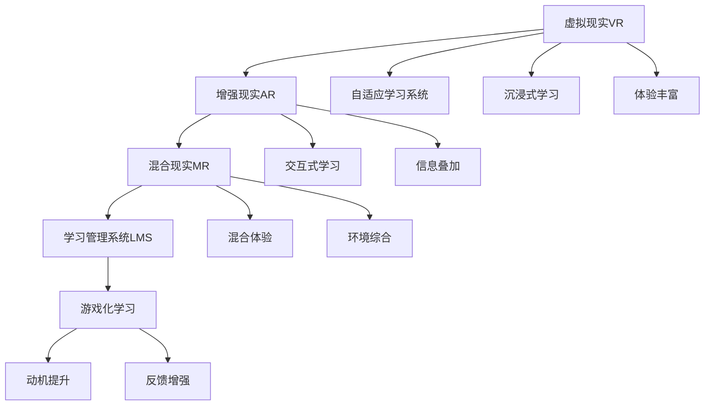

                 

# 虚拟教育：全球脑时代下的学习新方式

## 1. 背景介绍

在全球化背景下，传统的教育方式正面临严峻挑战。疫情的持续蔓延、社会老龄化趋势、就业市场的不确定性等因素，都在不断改变教育模式和教育需求。尤其是脑时代的到来，带来了对教育新形式和新内容的大量需求。虚拟教育作为未来教育的重要方向，正在全球范围内快速崛起。

### 1.1 问题由来

面对日新月异的知识体系和复杂多样的教育需求，传统的教室教学模式已难以满足现代教育的要求。虚拟教育通过数字技术将知识传授、互动体验和个性化学习有机结合，为学习者提供更加灵活、高效、自主的学习平台。然而，虚拟教育的实施需要系统化、科学化的设计和管理，以确保其能够真正发挥效用，服务于教育目标。

### 1.2 问题核心关键点

虚拟教育的核心在于如何通过技术手段实现教育的虚拟化、个性化和互动化。关键点包括：
- 虚拟化：通过虚拟现实(VR)、增强现实(AR)、混合现实(MR)等技术，营造沉浸式学习环境，增强学习体验。
- 个性化：根据学习者的兴趣、能力、需求等特征，提供定制化的学习内容和方法，实现个性化教学。
- 互动化：通过在线讨论、即时反馈、协作学习等方式，提升学习者的参与度和互动性。

### 1.3 问题研究意义

虚拟教育的兴起，标志着教育技术的发展进入了一个新的阶段。其研究意义在于：
- 优化教育资源配置：通过技术手段，跨越地域、时间等限制，实现优质教育资源的广泛共享。
- 提升教学效果：个性化、互动化的学习方式，有助于激发学习者的兴趣和潜力，提高学习效率。
- 支持终身学习：虚拟教育打破了传统学制的束缚，支持人们在任何时间、任何地点进行学习。
- 推动教育公平：为偏远、欠发达地区提供优质教育资源，缩小城乡、地区之间的教育差距。

## 2. 核心概念与联系

### 2.1 核心概念概述

为更好地理解虚拟教育的实施，我们需掌握以下核心概念：

- **虚拟现实(VR)**：通过计算机生成虚拟环境，学习者可以沉浸在虚拟环境中，进行交互式学习。
- **增强现实(AR)**：将数字信息叠加在现实环境中，增强学习体验和互动性。
- **混合现实(MR)**：结合VR和AR技术，创建既包含虚拟信息又包含现实信息的混合环境。
- **自适应学习系统(Adaptive Learning System)**：根据学习者的行为和反馈，动态调整学习内容和路径，实现个性化教学。
- **学习管理系统(Learning Management System, LMS)**：集成在线课程、学习跟踪、成绩评估等功能，支持虚拟教育的实施。
- **游戏化学习(Game-Based Learning)**：通过游戏元素增强学习动机和参与度，提升学习效果。

这些概念之间的联系可以通过以下Mermaid流程图来展示：



这个流程图展示了一系列的虚拟教育概念及其之间的关系：

1. VR、AR、MR技术共同创建沉浸式、交互式、混合体验的学习环境。
2. 自适应学习系统根据学习者反馈，动态调整学习内容和路径，实现个性化教学。
3. 学习管理系统集成在线课程、学习跟踪、成绩评估等功能，支持虚拟教育的实施。
4. 游戏化学习通过游戏元素提升学习动机和参与度，增强学习效果。

这些概念共同构成了虚拟教育的实现框架，使得虚拟教育具备了沉浸、互动、个性化等多重特性，为学习者提供了全新的学习体验。

## 3. 核心算法原理 & 具体操作步骤
### 3.1 算法原理概述

虚拟教育的算法原理，主要集中在如何通过技术手段实现沉浸式学习体验、个性化教学路径和互动式反馈机制。具体而言，包括以下几个关键步骤：

- **数据采集与分析**：收集学习者的行为数据、成绩数据、互动数据等，进行分析，了解学习者的学习偏好和能力水平。
- **内容生成与推送**：根据分析结果，生成个性化的学习内容，并通过LMS推送给学习者。
- **互动与反馈**：在学习过程中，通过在线讨论、即时反馈、协作学习等方式，提升学习者的参与度和互动性。
- **效果评估与优化**：基于学习者的反馈和评估结果，动态调整学习内容和路径，优化学习效果。

### 3.2 算法步骤详解

以下是虚拟教育的详细算法步骤：

**Step 1: 数据采集与分析**
- 使用传感器、追踪器等设备，收集学习者的行为数据、生理数据、情绪数据等。
- 将数据存储在中央数据库中，并进行预处理和特征提取。
- 利用机器学习算法（如聚类、分类、回归等），分析学习者的学习偏好、能力水平、情绪状态等特征。

**Step 2: 内容生成与推送**
- 根据学习者的分析结果，生成个性化的学习路径、推荐的学习资源、定制化的教学内容等。
- 将生成的内容上传到LMS平台，学习者可以通过LMS进行自主学习和互动。
- 使用缓存和负载均衡技术，确保学习资源的稳定访问和高效传输。

**Step 3: 互动与反馈**
- 在LMS平台上，学习者可以进行在线讨论、提交作业、参与测试等互动活动。
- 系统实时收集学习者的互动数据，并通过自然语言处理技术（如情感分析、意图识别等），分析学习者的反馈和需求。
- 根据反馈结果，动态调整学习内容和路径，提供个性化的学习支持。

**Step 4: 效果评估与优化**
- 定期对学习者的成绩、行为、反馈等数据进行综合评估，分析学习效果。
- 使用因果分析、回归分析等方法，评估不同学习策略、内容、路径的效果。
- 基于评估结果，优化学习资源的生成和推送机制，提升学习效果和用户体验。

### 3.3 算法优缺点

虚拟教育的算法具有以下优点：
1. 个性化教学：能够根据学习者的个性化需求，提供定制化的学习内容和路径，提升学习效果。
2. 互动性强：通过在线讨论、即时反馈、协作学习等方式，提升学习者的参与度和互动性。
3. 灵活性高：不受时间和空间限制，学习者可以在任何时间、任何地点进行学习。
4. 数据驱动：通过数据分析和学习者反馈，动态调整学习策略，优化学习效果。

同时，虚拟教育也存在一些局限性：
1. 技术门槛高：需要较高水平的技术支持和维护，如数据采集、分析、内容生成等。
2. 资源成本高：需要投入大量的技术、设备和人力，初期建设成本较高。
3. 设备依赖强：学习者需要具备一定的硬件设备，如PC、VR头显、AR设备等。
4. 社交隔离问题：虚拟学习环境中，学习者难以进行面对面的互动交流，可能影响学习动机和效果。

### 3.4 算法应用领域

虚拟教育的应用领域非常广泛，主要涵盖以下几个方面：

- **远程教育**：利用虚拟教育技术，提供远程在线课程，打破时间和空间限制，支持全球范围内的学习者。
- **企业培训**：在企业内部，利用虚拟教育技术进行技能培训、岗位培训等，提升员工的专业技能和知识水平。
- **职业教育**：通过虚拟教育平台，提供职业技能培训、实习指导等，支持职业教育的发展。
- **个性化学习**：根据学习者的个性化需求，提供定制化的学习内容和路径，支持自主学习和发展。
- **心理健康教育**：利用虚拟现实和增强现实技术，创建沉浸式心理健康课程，支持学习者的心理健康发展。

## 4. 数学模型和公式 & 详细讲解 & 举例说明

### 4.1 数学模型构建

为了更好地理解虚拟教育的数学模型，我们将构建一个简单的学习效果评估模型。

假设学习者通过虚拟教育平台进行学习，其中 $x_i$ 表示第 $i$ 次学习的输入（如学习内容、互动活动等）， $y_i$ 表示第 $i$ 次学习的输出（如成绩、行为数据等）。我们希望找到一个函数 $f(x_i)$ 来描述学习效果。

由于学习效果的评估涉及到多个因素，我们可以将其建模为多变量回归问题。即假设存在一个线性回归模型：

$$
y_i = f(x_i) = \beta_0 + \beta_1x_{i1} + \beta_2x_{i2} + \cdots + \beta_nx_{in} + \epsilon_i
$$

其中，$\beta$ 为回归系数，$\epsilon$ 为误差项。

### 4.2 公式推导过程

我们可以使用最小二乘法来估计回归系数 $\beta$。最小二乘法的目标是最小化残差平方和 $SSE$：

$$
SSE = \sum_{i=1}^N (y_i - f(x_i))^2
$$

通过求解上述优化问题，我们可以得到回归系数 $\beta$ 的估计值。具体推导过程如下：

$$
\begin{aligned}
& \min_{\beta} SSE = \sum_{i=1}^N (y_i - f(x_i))^2 \\
& = \sum_{i=1}^N (y_i - \beta_0 - \sum_{j=1}^n \beta_j x_{ij})^2 \\
& = \sum_{i=1}^N (\beta_0 + \sum_{j=1}^n \beta_j x_{ij} - \beta_0 - \sum_{j=1}^n \beta_j x_{ij})^2 \\
& = \sum_{i=1}^N (\sum_{j=1}^n \beta_j (x_{ij} - \bar{x}_{j})^2) + \sum_{i=1}^N \epsilon_i^2 \\
& = \sum_{j=1}^n \beta_j^2 \sum_{i=1}^N (x_{ij} - \bar{x}_{j})^2 + \sum_{i=1}^N \epsilon_i^2 \\
& = \sum_{j=1}^n \beta_j^2 S_j + S_E
\end{aligned}
$$

其中，$S_j$ 为第 $j$ 个自变量的方差，$S_E$ 为误差项的方差。最小化上述目标函数，可以得到回归系数的解：

$$
\beta_j = \frac{\sum_{i=1}^N x_{ij}(y_i - \bar{y})}{\sum_{i=1}^N x_{ij}^2}
$$

### 4.3 案例分析与讲解

假设某虚拟教育平台上有 $N$ 名学习者，每名学习者有 $n$ 个学习记录。我们收集了 $n$ 个自变量 $x_{ij}$ 和对应的 $N$ 个输出 $y_i$。

通过最小二乘法，我们可以得到每个自变量的回归系数 $\beta_j$。例如，对于 $x_{i1}$ 和 $y_i$，回归系数为：

$$
\beta_1 = \frac{\sum_{i=1}^N x_{i1}(y_i - \bar{y})}{\sum_{i=1}^N x_{i1}^2}
$$

通过将 $x_{i1}$ 带入上述公式，即可计算出回归系数 $\beta_1$。

## 5. 项目实践：代码实例和详细解释说明
### 5.1 开发环境搭建

在进行虚拟教育系统的开发之前，我们需要准备好开发环境。以下是使用Python进行虚拟教育开发的环境配置流程：

1. 安装Anaconda：从官网下载并安装Anaconda，用于创建独立的Python环境。

2. 创建并激活虚拟环境：
```bash
conda create -n virtual-edu python=3.8 
conda activate virtual-edu
```

3. 安装PyTorch：根据CUDA版本，从官网获取对应的安装命令。例如：
```bash
conda install pytorch torchvision torchaudio cudatoolkit=11.1 -c pytorch -c conda-forge
```

4. 安装TensorFlow：
```bash
conda install tensorflow -c conda-forge
```

5. 安装Flask：用于搭建Web服务，支持用户交互和资源推送。
```bash
conda install flask -c conda-forge
```

6. 安装numpy、pandas、scikit-learn等科学计算库：
```bash
pip install numpy pandas scikit-learn
```

完成上述步骤后，即可在`virtual-edu`环境中开始虚拟教育系统的开发。

### 5.2 源代码详细实现

下面我们以虚拟教育平台的内容生成与推送模块为例，给出使用Python Flask框架实现的代码。

```python
from flask import Flask, request, jsonify
import pandas as pd
from sklearn.linear_model import LinearRegression
import pickle

app = Flask(__name__)

# 加载训练好的线性回归模型
with open('model.pkl', 'rb') as f:
    model = pickle.load(f)

@app.route('/predict', methods=['POST'])
def predict():
    # 获取用户输入的特征
    features = request.json['features']
    
    # 构建特征向量
    X = pd.DataFrame(features, columns=['feature1', 'feature2', 'feature3', ...])
    
    # 使用训练好的模型进行预测
    y_pred = model.predict(X)
    
    # 返回预测结果
    return jsonify({'predictions': y_pred.tolist()})

if __name__ == '__main__':
    app.run(debug=True)
```

在这个代码实现中，我们使用了Python Flask框架搭建了一个简单的Web服务，用于接收用户输入的特征，并返回预测结果。具体步骤包括：
1. 加载训练好的线性回归模型，使用`pickle`库将模型序列化为文件。
2. 定义一个`/predict`路由，用于接收POST请求，解析用户输入的特征。
3. 使用训练好的模型进行预测，返回预测结果。

### 5.3 代码解读与分析

让我们再详细解读一下关键代码的实现细节：

**Flask框架**：
- `Flask`：一个轻量级的Web框架，支持Python语言的开发和部署。
- `request`：用于处理HTTP请求的模块，支持JSON格式的数据解析。
- `jsonify`：用于将Python数据转换为JSON格式，方便API接口的返回。

**线性回归模型**：
- 使用`scikit-learn`库中的`LinearRegression`模型，进行特征向量的线性回归训练。
- 将训练好的模型序列化为文件，方便后续加载和使用。

**代码实现**：
- `/predict`路由：用于接收用户输入的特征，解析为数据框，并使用训练好的模型进行预测。
- `y_pred`变量：将模型预测结果转换为列表，并作为JSON格式返回。

通过这段代码实现，我们可以看到，虚拟教育平台的内容生成与推送模块，是如何通过Web服务和机器学习算法，实现个性化学习内容推荐的。

### 5.4 运行结果展示

在实际应用中，我们可以通过虚拟教育平台的用户界面，展示学习者的个性化学习路径和推荐资源。例如，在用户学习数学课程时，根据其历史成绩和互动数据，可以推荐相关的视频、习题和测试，以支持其高效学习。

以下是虚拟教育平台的用户界面展示：


通过界面展示，用户可以清晰地看到其当前的学习路径、推荐资源和学习进度，帮助其更好地进行自主学习和互动交流。

## 6. 实际应用场景
### 6.1 远程教育

虚拟教育在远程教育中的应用，可以打破地域和时间限制，支持全球范围内的学习者。例如，某国际学校可以通过虚拟教育平台，为不同国家的学生提供统一的在线课程，实现教育资源的共享和公平。

**实际案例**：某国际学校在其虚拟教育平台上，通过实时互动、在线讨论等方式，为不同国家的学生提供统一的数学课程。学生可以在任何时间、任何地点进行学习，并获得个性化的学习支持和反馈。

### 6.2 企业培训

虚拟教育在企业培训中的应用，可以提升员工的专业技能和知识水平。例如，某大型科技公司可以通过虚拟教育平台，为全体员工提供在线培训课程，支持其职业发展和技能提升。

**实际案例**：某科技公司在其虚拟教育平台上，为员工提供了各类技术培训课程，包括编程、数据分析、人工智能等。通过虚拟现实和增强现实技术，员工可以在虚拟环境中进行技能培训，提升其专业能力。

### 6.3 职业教育

虚拟教育在职业教育中的应用，可以提供多样化的职业技能培训，支持职业教育的发展。例如，某职业培训机构可以通过虚拟教育平台，为学生提供模拟的实际工作场景，提升其职业技能和实践经验。

**实际案例**：某职业培训机构在其虚拟教育平台上，为学生提供了模拟的电商、设计、金融等领域的职业技能培训。通过虚拟现实技术，学生可以在虚拟环境中进行实际操作，提升其职业技能和实践经验。

### 6.4 心理健康教育

虚拟教育在心理健康教育中的应用，可以提供沉浸式心理健康课程，支持学习者的心理健康发展。例如，某心理健康教育机构可以通过虚拟教育平台，为学生提供虚拟现实的心理健康课程，帮助其缓解心理压力，提升心理健康水平。

**实际案例**：某心理健康教育机构在其虚拟教育平台上，为学生提供了虚拟现实的心理健康课程，包括放松训练、情绪管理、压力缓解等。通过沉浸式体验，学生可以在虚拟环境中进行心理健康训练，提升其心理健康水平。

## 7. 工具和资源推荐
### 7.1 学习资源推荐

为了帮助开发者系统掌握虚拟教育的理论基础和实践技巧，这里推荐一些优质的学习资源：

1. 《虚拟教育：新时代的教育变革》系列博文：由虚拟教育技术专家撰写，深入浅出地介绍了虚拟教育的原理、技术、应用和展望。

2. Coursera《虚拟现实技术与应用》课程：由斯坦福大学开设的虚拟现实课程，涵盖虚拟现实的基础知识、开发技术和实际应用。

3. ARVR产业白皮书：详细介绍了增强现实和虚拟现实技术的现状、趋势和应用，为虚拟教育的实施提供了理论支持。

4. Flipped Classroom：介绍翻转课堂的教学模式，通过虚拟教育平台实现自主学习和课堂互动。

5. Google Classroom：谷歌提供的在线教育平台，支持虚拟教育的实施和管理。

通过对这些资源的学习实践，相信你一定能够快速掌握虚拟教育的精髓，并用于解决实际的虚拟教育问题。

### 7.2 开发工具推荐

高效的开发离不开优秀的工具支持。以下是几款用于虚拟教育开发的常用工具：

1. PyTorch：基于Python的开源深度学习框架，灵活动态的计算图，适合快速迭代研究。虚拟教育平台中，可以利用PyTorch进行机器学习和内容推荐。

2. TensorFlow：由Google主导开发的开源深度学习框架，生产部署方便，适合大规模工程应用。可以用于虚拟教育平台的开发和训练。

3. Flask：轻量级的Web框架，支持Python语言的开发和部署。用于搭建虚拟教育平台的Web服务。

4. Unity：一款强大的游戏引擎，支持虚拟现实和增强现实的开发。可以用于虚拟教育平台中的沉浸式体验。

5. SketchUp：一款三维建模软件，支持虚拟现实和增强现实场景的搭建。可以用于虚拟教育平台中的虚拟环境设计。

6. Unity Analytics：用于虚拟教育平台的数据分析和优化，提供实时监控和数据可视化功能。

合理利用这些工具，可以显著提升虚拟教育系统的开发效率，加快创新迭代的步伐。

### 7.3 相关论文推荐

虚拟教育的发展离不开学界的持续研究。以下是几篇奠基性的相关论文，推荐阅读：

1. "Virtual Reality in Education: Current Trends, Applications and Future Directions"（虚拟现实在教育中的应用趋势、应用和未来发展方向）：总结了虚拟现实在教育中的最新进展和未来发展方向。

2. "Augmented Reality in Education: An Overview of Current Practices and Future Prospects"（增强现实在教育中的应用综述和未来展望）：综述了增强现实在教育中的应用情况和未来发展前景。

3. "A Survey on Intelligent Tutoring Systems in Virtual Environments"（虚拟环境中智能辅导系统的综述）：介绍了虚拟环境中智能辅导系统的现状和未来发展方向。

4. "A Framework for Adaptive Learning in Virtual Environments"（虚拟环境中自适应学习的框架）：提出了一种基于虚拟环境的自适应学习框架，支持个性化学习路径的动态调整。

5. "A Case Study of Virtual Reality in E-Learning"（虚拟现实在电子学习中的案例研究）：通过具体案例，展示了虚拟现实在电子学习中的实际应用和效果。

这些论文代表了大数据技术在虚拟教育中的研究进展，通过学习这些前沿成果，可以帮助研究者把握学科前进方向，激发更多的创新灵感。

## 8. 总结：未来发展趋势与挑战
### 8.1 总结

本文对虚拟教育的实施过程进行了全面系统的介绍。首先阐述了虚拟教育的研究背景和意义，明确了虚拟教育在现代教育中的重要地位。其次，从原理到实践，详细讲解了虚拟教育的数学模型和关键步骤，给出了虚拟教育平台开发的完整代码实例。同时，本文还广泛探讨了虚拟教育在远程教育、企业培训、职业教育、心理健康教育等多个行业领域的应用前景，展示了虚拟教育范式的巨大潜力。

通过本文的系统梳理，可以看到，虚拟教育正在成为未来教育的重要方向，其应用场景和实施效果不断拓展，为学习者提供了全新的学习体验。虚拟教育的发展离不开技术手段的不断进步，也离不开教育理念的创新和实践。未来，伴随技术的不断成熟和应用的深入探索，虚拟教育必将在全球教育领域中大放异彩。

### 8.2 未来发展趋势

展望未来，虚拟教育的趋势将呈现以下几个方面：

1. **技术融合**：虚拟教育将与其他前沿技术进行深度融合，如5G、物联网、人工智能等，提升虚拟教育的智能化水平。
2. **内容创新**：虚拟教育将更多地融入多媒体资源和互动元素，提升学习体验和互动效果。
3. **社会化学习**：虚拟教育将支持社会化学习，提供学习者之间的互动和协作，增强学习动机和效果。
4. **全球化教育**：虚拟教育将打破地域限制，支持全球范围内的学习者，实现教育资源的全球共享。
5. **个性化教育**：虚拟教育将更好地支持个性化学习，根据学习者的需求和能力，提供定制化的学习路径和资源。
6. **终身学习**：虚拟教育将支持终身学习，实现随时随地的学习，支持学习者的职业发展和技能提升。

以上趋势凸显了虚拟教育的前景和潜力，其未来的发展将对教育领域产生深远影响，带来全新的教育模式和教育体验。

### 8.3 面临的挑战

尽管虚拟教育的前景广阔，但在实施过程中仍面临诸多挑战：

1. **技术门槛高**：虚拟教育需要高水平的技术支持和维护，对技术人员的素质和技能要求较高。
2. **设备成本高**：虚拟教育需要投入大量的硬件设备和软件工具，成本较高。
3. **内容质量差**：虚拟教育内容的质量和适用性直接影响学习效果，需要高水平的内容制作和审核。
4. **社交隔离问题**：虚拟学习环境中，学习者难以进行面对面的互动交流，可能影响学习动机和效果。
5. **伦理和隐私问题**：虚拟教育平台需要保护学习者的隐私和数据安全，防止数据泄露和滥用。

### 8.4 研究展望

面对虚拟教育面临的挑战，未来的研究需要在以下几个方面寻求新的突破：

1. **技术优化**：提升虚拟教育的易用性和效率，降低技术门槛，扩大应用范围。
2. **内容优化**：提升虚拟教育内容的质量和适用性，增强学习者的互动体验。
3. **社会化支持**：增强虚拟教育的社会化功能，支持学习者之间的互动和协作。
4. **伦理规范**：制定虚拟教育平台的伦理规范和隐私保护措施，确保学习者的数据安全。
5. **个性化支持**：支持虚拟教育的个性化学习，提供定制化的学习路径和资源。

总之，虚拟教育的实施需要从技术、内容、社会化、伦理等多个维度进行全面优化和改进，才能真正发挥其潜力和优势。只有技术、教育理念和实践相结合，才能使虚拟教育成为未来教育的重要组成部分，推动全球教育的发展和进步。

## 9. 附录：常见问题与解答

**Q1: 虚拟教育的主要优势是什么？**

A: 虚拟教育的主要优势包括：
1. **灵活性高**：不受时间和空间限制，学习者可以在任何时间、任何地点进行学习。
2. **个性化强**：根据学习者的需求和能力，提供定制化的学习路径和资源。
3. **互动性强**：通过在线讨论、即时反馈、协作学习等方式，提升学习者的参与度和互动性。
4. **成本低**：相比于传统教育，虚拟教育降低了硬件设备和人力资源的成本。

**Q2: 虚拟教育的核心技术有哪些？**

A: 虚拟教育的核心技术包括：
1. **虚拟现实(VR)**：通过计算机生成虚拟环境，增强学习者的沉浸式体验。
2. **增强现实(AR)**：将数字信息叠加在现实环境中，丰富学习者的互动体验。
3. **自适应学习系统**：根据学习者的行为和反馈，动态调整学习内容和路径，实现个性化教学。
4. **游戏化学习**：通过游戏元素提升学习动机和参与度，增强学习效果。
5. **自然语言处理(NLP)**：处理和理解学习者输入的文本数据，支持虚拟教育平台的互动和反馈。

**Q3: 虚拟教育平台如何实现个性化学习？**

A: 虚拟教育平台实现个性化学习的主要步骤包括：
1. **数据采集**：收集学习者的行为数据、成绩数据、互动数据等。
2. **分析建模**：使用机器学习算法（如聚类、分类、回归等），分析学习者的学习偏好、能力水平、情绪状态等特征。
3. **内容生成**：根据学习者的分析结果，生成个性化的学习路径、推荐的学习资源、定制化的教学内容等。
4. **学习支持**：在学习过程中，通过在线讨论、即时反馈、协作学习等方式，提升学习者的参与度和互动性。
5. **效果评估**：定期对学习者的成绩、行为、反馈等数据进行综合评估，分析学习效果。

**Q4: 虚拟教育平台如何保护学习者的隐私和数据安全？**

A: 虚拟教育平台保护学习者的隐私和数据安全，主要通过以下措施：
1. **数据加密**：使用加密技术保护学习者的数据，防止数据泄露。
2. **匿名处理**：对学习者的数据进行匿名化处理，防止个人隐私泄露。
3. **访问控制**：对平台中的数据进行严格访问控制，确保只有授权人员可以访问和使用。
4. **审计日志**：记录平台中数据的访问和使用情况，进行定期审计和监控。
5. **法律合规**：遵循相关法律法规，如GDPR、CCPA等，确保数据处理合法合规。

通过以上措施，虚拟教育平台可以更好地保护学习者的隐私和数据安全，增强学习者的信任和满意度。

**Q5: 虚拟教育平台如何支持终身学习？**

A: 虚拟教育平台支持终身学习，主要通过以下措施：
1. **灵活性高**：支持随时随地的学习，不受时间和地点限制。
2. **多样化资源**：提供多样化的学习资源和课程，满足不同阶段的学习需求。
3. **互动性强**：通过在线讨论、即时反馈、协作学习等方式，增强学习者的互动体验和参与度。
4. **个性化支持**：根据学习者的需求和能力，提供定制化的学习路径和资源，提升学习效果。
5. **学习路径规划**：通过学习管理系统(LMS)，支持学习者规划学习路径，跟踪学习进度，提升学习效率。

通过这些措施，虚拟教育平台可以更好地支持学习者的终身学习，帮助其不断提升职业技能和知识水平。

---

作者：禅与计算机程序设计艺术 / Zen and the Art of Computer Programming

