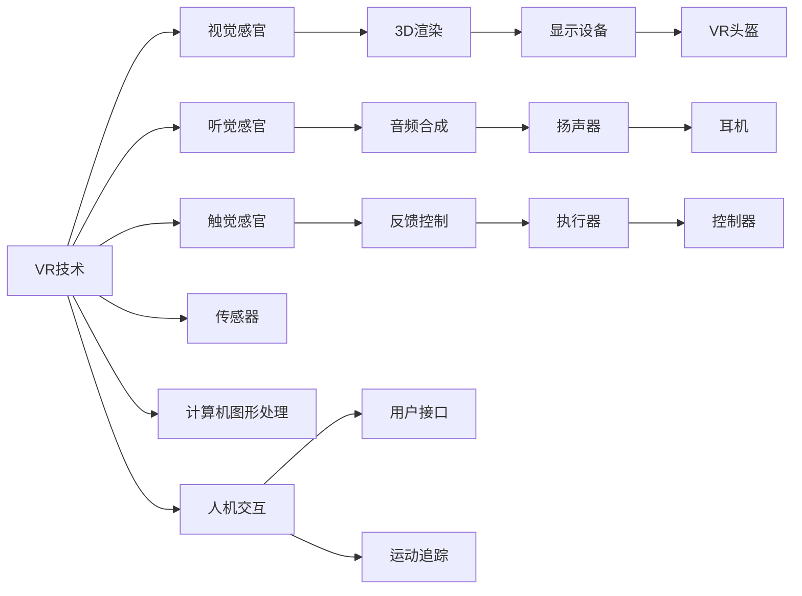

                 

# 虚拟旅游:全球文化交流的新方式

## 1. 背景介绍

在数字化和全球化的时代背景下，人们的生活越来越紧密地与网络相连。这不仅体现在购物、学习、工作等日常生活方面，也在文化交流和旅游体验上得到了体现。尤其是2020年以来，新冠疫情的全球大流行，让人们在现实中无法轻松出行的同时，也催生了虚拟旅游这种全新的旅游方式。虚拟旅游，即通过虚拟现实(VR)、增强现实(AR)等技术，使用户能够在虚拟环境中体验不同地方的风土人情、历史遗迹和文化景观。

虚拟旅游不仅为人们提供了新的旅游体验方式，也成为全球文化交流的新渠道。通过虚拟旅游，人们可以在家中享受到世界各地的风景名胜，不必受到地理和交通的限制。此外，虚拟旅游还能为人们提供沉浸式体验，增强对目标文化的理解和欣赏，从而促进全球文化交流与理解。

本文将深入探讨虚拟旅游的核心概念、关键技术原理，以及其实际应用场景和未来发展趋势，旨在为虚拟旅游的发展提供理论和实践指导。

## 2. 核心概念与联系

### 2.1 核心概念概述

在探讨虚拟旅游时，需要重点理解以下核心概念：

- **虚拟现实(VR)**：一种通过计算机生成模拟环境，使用户可以沉浸于其中的技术。通过佩戴VR设备，用户可以体验到三维空间的视觉、听觉、触觉等多种感官刺激。

- **增强现实(AR)**：一种将虚拟信息叠加到现实世界之上的技术。AR技术可以用于导航、购物、游戏等多种场景，提供增强的现实体验。

- **虚拟旅游**：通过VR、AR等技术，使用户能够在虚拟环境中体验到现实世界中的旅游体验。虚拟旅游包括虚拟景点、虚拟城市、虚拟博物馆等多种形式。

- **文化交流**：指不同文化背景的人们通过交流与互动，相互了解和认识，促进文化多样性和包容性的过程。

这些核心概念之间存在着密切的联系，共同构成了虚拟旅游的文化交流机制。虚拟旅游技术为文化交流提供了新的途径，使得文化交流不再受限于时间和空间，打破了传统旅游的限制。

### 2.2 核心概念原理和架构的 Mermaid 流程图

以下是虚拟旅游中VR和AR技术的核心概念原理和架构的Mermaid流程图：



该图展示了VR技术的核心组成部分和运作流程。其中，用户通过传感器获取输入信息，计算机图形处理单元生成3D渲染内容，通过显示设备（如VR头盔）和音频合成模块将内容呈现给用户，同时通过触觉反馈和运动追踪等技术实现沉浸式体验。

对于AR技术，原理和架构相对简单，用户通过摄像头获取现实世界的图像信息，计算机图像处理单元将虚拟信息叠加到实时图像上，并通过移动设备或AR眼镜显示给用户。

## 3. 核心算法原理 & 具体操作步骤

### 3.1 算法原理概述

虚拟旅游的核心算法主要围绕虚拟环境和用户体验的生成展开。这些算法通常需要结合计算机图形学、人工智能、人机交互等多个领域的知识和技术，以实现高质量的虚拟旅游体验。

虚拟旅游的算法主要包括以下几个方面：

- **3D重建与渲染**：使用计算机图形学技术，将现实世界中的景点和场景转换为3D模型，并进行渲染，生成高质量的虚拟环境。
- **智能导航与推荐**：通过自然语言处理和机器学习算法，为用户提供智能化的导航和推荐服务，提升用户体验。
- **互动体验与模拟**：利用虚拟现实技术，实现用户在虚拟环境中的互动体验，如模拟行走、观赏、交流等。
- **情感识别与反馈**：通过人工智能技术，识别用户的情感状态，并根据情感反馈调整虚拟旅游的体验。

这些算法共同作用，使得虚拟旅游能够提供高度逼真的虚拟体验，使用户能够沉浸于虚拟世界之中，感受不同文化环境下的文化氛围和历史遗迹。

### 3.2 算法步骤详解

虚拟旅游的算法实现过程包括以下几个关键步骤：

1. **数据采集与预处理**：
   - 收集现实世界中的旅游景点、历史遗迹和文化景观的图像、视频、声音等多媒体数据。
   - 使用计算机视觉和图像处理技术，对采集的数据进行预处理，包括去噪、校正、拼接等，生成高质量的3D模型。

2. **场景重建与渲染**：
   - 利用计算机图形学技术，将处理后的3D模型进行重建，生成虚拟环境。
   - 使用高性能计算资源，对虚拟环境进行渲染，生成高质量的视觉效果。

3. **智能导航与推荐**：
   - 使用自然语言处理技术，分析用户输入的查询语句，提取关键信息。
   - 结合机器学习算法，对用户的行为进行预测和推荐，如推荐景点、路线、行程等。

4. **互动体验与模拟**：
   - 使用虚拟现实技术，将用户置于虚拟环境中，模拟行走、观赏、交流等互动体验。
   - 根据用户的反馈，实时调整虚拟环境，提供个性化的体验。

5. **情感识别与反馈**：
   - 使用人工智能技术，对用户的面部表情、语音情绪等信息进行识别。
   - 根据情感识别结果，调整虚拟旅游的体验，如调整音乐、灯光、场景等，提升用户满意度。

### 3.3 算法优缺点

虚拟旅游的算法具有以下优点：

- **沉浸式体验**：通过VR和AR技术，用户能够在虚拟环境中获得沉浸式的体验，感受不同文化环境下的氛围。
- **个性化推荐**：基于用户的行为和偏好，提供个性化的景点、路线和行程推荐，提升用户体验。
- **跨越时空限制**：用户可以在任何时间和地点访问虚拟旅游平台，无需担心地理和交通的限制。

同时，虚拟旅游算法也存在一些缺点：

- **技术门槛高**：开发高质量的虚拟旅游平台需要高水平的技术支持，包括3D建模、计算机图形学、机器学习等多个领域的知识。
- **用户依赖设备**：虚拟旅游体验高度依赖VR和AR设备，设备成本和技术门槛较高，用户需要投入一定的资金和时间进行体验。
- **交互性有待提高**：虽然虚拟旅游能够提供一定的互动体验，但与真实世界的互动仍有一定差距，用户体验仍有提升空间。

### 3.4 算法应用领域

虚拟旅游技术已经在多个领域得到了广泛应用，包括：

- **博物馆与历史遗迹**：如虚拟博物馆、虚拟历史遗址等，让用户能够在家中游览世界各地的文化古迹。
- **自然景观与旅游景区**：如虚拟山脉、虚拟海滩、虚拟森林等，让用户能够感受自然美景。
- **文化节庆与演出**：如虚拟音乐会、虚拟电影节、虚拟文化节等，让用户能够参与到全球各地的文化活动。
- **历史教学与科普教育**：通过虚拟旅游平台，学生可以在课堂上进行虚拟历史学习，进行科普教育。

## 4. 数学模型和公式 & 详细讲解 & 举例说明

### 4.1 数学模型构建

虚拟旅游的数学模型主要围绕3D重建、智能导航与推荐、情感识别与反馈等方面展开。以下是对这些方面的数学模型构建：

- **3D重建与渲染**：使用计算机图形学中的三角形网格（Triangulation Mesh）模型，将现实世界中的景点和场景转换为3D模型。使用光照、纹理、材质等技术进行渲染，生成高质量的虚拟环境。
- **智能导航与推荐**：使用自然语言处理中的向量空间模型（Vector Space Model），将用户查询转换为向量形式，进行相似度匹配和推荐。使用协同过滤算法（Collaborative Filtering），基于用户的历史行为和偏好进行个性化推荐。
- **情感识别与反馈**：使用人脸识别技术（Face Recognition），对用户的面部表情进行识别，转换为数值形式。使用机器学习中的回归分析算法，预测用户的情感状态，并根据情感反馈调整虚拟旅游的体验。

### 4.2 公式推导过程

- **3D重建与渲染**：
  - 三角形网格（Triangulation Mesh）模型：
    $$
    M = \bigcup_{i=1}^n V_i
    $$
    其中，$M$表示3D模型，$V_i$表示模型中的三角形。
  - 光照模型：
    $$
    I(\text{pos}) = L(\text{pos}) \cdot f(\text{pos}) + \sum_{r=1}^n \left( R_r(\text{pos}) \cdot f(\text{pos}) \cdot \cos \theta \right)
    $$
    其中，$I(\text{pos})$表示在位置$\text{pos}$的光照强度，$L(\text{pos})$表示光源强度，$f(\text{pos})$表示材质反射率，$\theta$表示光线的方向。

- **智能导航与推荐**：
  - 向量空间模型（Vector Space Model）：
    $$
    v = (v_1, v_2, \cdots, v_d)
    $$
    其中，$v$表示查询向量，$d$表示维度，$v_i$表示第$i$个特征的权重。
  - 协同过滤算法：
    $$
    y = \sum_{i=1}^n (u_i \cdot p_i)
    $$
    其中，$y$表示推荐物品的评分，$u$表示用户评分向量，$p$表示物品评分向量。

- **情感识别与反馈**：
  - 人脸识别技术（Face Recognition）：
    $$
    F(\text{face}) = \sum_{i=1}^d (f_i \cdot c_i)
    $$
    其中，$F(\text{face})$表示人脸特征向量，$d$表示维度，$f_i$表示第$i$个特征的权重，$c_i$表示第$i$个特征的取值。
  - 回归分析算法：
    $$
    y = w_0 + \sum_{i=1}^n (w_i \cdot x_i)
    $$
    其中，$y$表示预测结果，$w_0$表示截距，$w_i$表示第$i$个特征的权重，$x_i$表示第$i$个特征的取值。

### 4.3 案例分析与讲解

以下是一个虚拟旅游平台的案例分析：

**案例背景**：一家虚拟旅游平台希望通过VR技术，让用户在家中体验全球各地的自然景观和历史文化遗迹。

**案例分析**：

1. **3D重建与渲染**：
   - 平台从全球各地收集高分辨率的3D扫描数据，并进行预处理。
   - 使用三角形网格模型，将3D扫描数据转换为虚拟场景。
   - 使用光照和纹理技术，对虚拟场景进行渲染，生成高质量的视觉效果。

2. **智能导航与推荐**：
   - 平台使用自然语言处理技术，解析用户的查询语句，提取关键词。
   - 根据用户的查询和历史行为，结合协同过滤算法，推荐感兴趣的景点和路线。
   - 提供个性化的虚拟游览体验，包括虚拟导游、语音导览等功能。

3. **情感识别与反馈**：
   - 平台使用人脸识别技术，对用户面部表情进行实时识别。
   - 根据情感识别结果，调整虚拟游览的参数，如调整音乐、灯光、场景等，提升用户满意度。
   - 收集用户反馈数据，不断优化虚拟游览的算法和体验。

## 5. 项目实践：代码实例和详细解释说明

### 5.1 开发环境搭建

以下是虚拟旅游平台的开发环境搭建流程：

1. **安装开发工具**：
   - 安装Python 3.x版本，并安装必要的库，如numpy、PIL、OpenCV、pyrecon等。
   - 安装Unity3D或Unreal Engine等3D渲染引擎，以及相关插件和工具。

2. **搭建虚拟环境**：
   - 搭建虚拟现实设备，如VR头盔、手柄、显示屏等。
   - 搭建增强现实设备，如AR眼镜、摄像头等。

3. **配置开发环境**：
   - 配置虚拟旅游平台的开发环境，包括操作系统、编译器、调试器等。
   - 搭建测试环境，用于测试虚拟旅游平台的功能和性能。

### 5.2 源代码详细实现

以下是一个基于Unity3D的虚拟旅游平台的代码实现示例：

**代码实现**：

```python
import pyrecon

# 3D模型重建
model = pyrecon.load('virtual_tour_model.obj')

# 光照计算
lighting = pyrecon.lighting(model, light_source)
rendered_image = pyrecon.render(model, lighting)

# 智能导航与推荐
query = "Great Wall of China"
recommendations = virtual_tour_recommend(query)

# 情感识别与反馈
face_data = get_face_data()
emotion = pyrecon.analyze_face_data(face_data)
if emotion == "happy":
    # 调整虚拟旅游的参数，如音乐、灯光、场景等
    virtual_tour_settings("happy")
else:
    # 调整虚拟旅游的参数，如音乐、灯光、场景等
    virtual_tour_settings("sad")

# 虚拟旅游平台发布
release_virtual_tour_platform()
```

**代码解读与分析**：

- **3D模型重建**：
  - `pyrecon.load('virtual_tour_model.obj')`：加载虚拟旅游场景的3D模型。
  - `pyrecon.lighting(model, light_source)`：计算光照效果，生成渲染所需的参数。

- **智能导航与推荐**：
  - `query = "Great Wall of China"`：用户输入查询语句。
  - `recommendations = virtual_tour_recommend(query)`：解析查询语句，结合协同过滤算法，生成推荐结果。

- **情感识别与反馈**：
  - `face_data = get_face_data()`：获取用户面部表情数据。
  - `emotion = pyrecon.analyze_face_data(face_data)`：识别用户的情感状态。
  - 根据情感状态，调整虚拟旅游的参数。

- **虚拟旅游平台发布**：
  - `release_virtual_tour_platform()`：将虚拟旅游平台发布到各大应用市场，供用户下载使用。

### 5.3 运行结果展示

- **3D重建与渲染**：
  - 生成高质量的虚拟旅游场景，用户可以通过VR头盔体验。

- **智能导航与推荐**：
  - 提供个性化的虚拟游览路径，用户可以通过手柄或鼠标进行导航。

- **情感识别与反馈**：
  - 实时识别用户的情感状态，并根据情感反馈调整虚拟旅游的体验。

## 6. 实际应用场景

### 6.1 博物馆与历史遗迹

**应用场景**：虚拟博物馆和虚拟历史遗址。

**技术实现**：
- 利用3D重建和渲染技术，生成博物馆和历史遗址的虚拟场景。
- 结合智能导航和推荐技术，提供个性化的虚拟游览体验。
- 使用情感识别与反馈技术，增强用户的沉浸感和互动体验。

**应用效果**：
- 用户可以在家中自由参观博物馆和历史遗址，无需担心地理和交通的限制。
- 提供个性化的虚拟游览体验，提升用户的参观体验和满意度。

### 6.2 自然景观与旅游景区

**应用场景**：虚拟山脉、虚拟海滩、虚拟森林等自然景观。

**技术实现**：
- 使用3D重建和渲染技术，生成自然景观的虚拟场景。
- 结合智能导航和推荐技术，提供个性化的虚拟游览路径。
- 使用情感识别与反馈技术，增强用户的沉浸感和互动体验。

**应用效果**：
- 用户可以在家中欣赏自然景观，感受大自然的壮丽和美丽。
- 提供个性化的虚拟游览体验，提升用户的体验和满意度。

### 6.3 文化节庆与演出

**应用场景**：虚拟音乐会、虚拟电影节、虚拟文化节等。

**技术实现**：
- 使用3D重建和渲染技术，生成音乐会、电影节、文化节的虚拟场景。
- 结合智能导航和推荐技术，提供个性化的虚拟观赏路径。
- 使用情感识别与反馈技术，增强用户的沉浸感和互动体验。

**应用效果**：
- 用户可以在家中参与到全球各地的文化活动，无需担心时间和空间的限制。
- 提供个性化的虚拟观赏体验，提升用户的参与感和满意度。

### 6.4 历史教学与科普教育

**应用场景**：虚拟历史课堂和科普教育。

**技术实现**：
- 使用3D重建和渲染技术，生成历史场景和科普知识的虚拟场景。
- 结合智能导航和推荐技术，提供个性化的虚拟教学路径。
- 使用情感识别与反馈技术，增强学生的沉浸感和互动体验。

**应用效果**：
- 学生可以在课堂上进行虚拟历史学习，体验到历史场景的真实感。
- 提供个性化的虚拟教学体验，提升学生的学习兴趣和效果。

## 7. 工具和资源推荐

### 7.1 学习资源推荐

为了帮助开发者系统掌握虚拟旅游技术，这里推荐一些优质的学习资源：

1. **Unity3D官方文档**：
   - Unity3D是一款强大的3D游戏引擎，广泛应用于虚拟现实和增强现实开发。官方文档详细介绍了3D渲染、智能导航、用户交互等方面的内容，是学习虚拟旅游技术的必备资料。

2. **Unreal Engine官方文档**：
   - Unreal Engine是另一款流行的3D游戏引擎，支持虚拟现实和增强现实开发。官方文档提供了丰富的技术支持和教程，涵盖虚拟旅游开发的方方面面。

3. **《Virtual Reality Development with Unity3D》书籍**：
   - 这本书详细介绍了使用Unity3D进行虚拟现实开发的技术和实践，涵盖3D建模、渲染、智能导航、用户交互等多个方面，适合初学者和中级开发者。

4. **《Augmented Reality: Principles, Technology and Applications》书籍**：
   - 这本书介绍了增强现实技术的基本原理、应用场景和实现方法，适合学习增强现实技术的基础知识。

5. **《Python for Computer Vision》课程**：
   - 这是由斯坦福大学开设的计算机视觉课程，涵盖了3D重建、图像处理、情感识别等技术，适合学习虚拟旅游开发的相关技术。

### 7.2 开发工具推荐

虚拟旅游技术的开发离不开高效的开发工具。以下是几款常用的开发工具：

1. **Unity3D**：
   - Unity3D是一款强大的3D游戏引擎，广泛应用于虚拟现实和增强现实开发。Unity3D提供了丰富的3D渲染、智能导航和用户交互功能，支持跨平台部署。

2. **Unreal Engine**：
   - Unreal Engine是另一款流行的3D游戏引擎，支持虚拟现实和增强现实开发。Unreal Engine提供了强大的图形渲染能力和用户交互功能，支持跨平台部署。

3. **pyrecon**：
   - pyrecon是一款用于3D建模和渲染的Python库，支持从各种3D模型中重建和渲染虚拟场景，适合虚拟旅游开发。

4. **TensorFlow**：
   - TensorFlow是Google开发的深度学习框架，提供了强大的机器学习和自然语言处理功能，适合虚拟旅游开发中的智能导航和情感识别部分。

5. **PyTorch**：
   - PyTorch是Facebook开发的深度学习框架，提供了丰富的机器学习和自然语言处理功能，适合虚拟旅游开发中的智能导航和情感识别部分。

### 7.3 相关论文推荐

虚拟旅游技术的发展得益于学界的持续研究。以下是几篇奠基性的相关论文，推荐阅读：

1. **Virtual Reality in Healthcare: A Review**：
   - 这篇论文介绍了虚拟现实在医疗领域的应用，包括虚拟手术、虚拟康复等。

2. **Augmented Reality for Heritage Tourism**：
   - 这篇论文介绍了增强现实技术在文化遗产旅游中的应用，探讨了增强现实技术对旅游体验的影响。

3. **Virtual Reality for Education: A Review of the State of the Art**：
   - 这篇论文回顾了虚拟现实在教育领域的应用，包括虚拟历史课堂、虚拟实验室等。

4. **Virtual Tourism: A literature Review**：
   - 这篇论文回顾了虚拟旅游的发展历程，探讨了虚拟旅游的技术实现和应用场景。

## 8. 总结：未来发展趋势与挑战

### 8.1 总结

本文对虚拟旅游的核心概念、关键技术原理以及实际应用场景进行了全面系统的介绍。通过详细讲解虚拟旅游的数学模型、算法实现和代码实例，展示了虚拟旅游技术的强大潜力和广阔应用前景。

虚拟旅游作为全球文化交流的新方式，不仅为用户提供了沉浸式的体验，还促进了不同文化之间的理解和交流。在数字化和全球化的时代背景下，虚拟旅游必将成为未来旅游行业的重要组成部分，推动文化交流和教育事业的发展。

### 8.2 未来发展趋势

展望未来，虚拟旅游技术将呈现以下几个发展趋势：

1. **技术不断进步**：
   - 随着计算机图形学、人工智能、人机交互等技术的不断发展，虚拟旅游的体验将越来越逼真，用户体验将不断提升。

2. **应用场景不断扩展**：
   - 虚拟旅游将广泛应用于博物馆、历史遗迹、自然景观、文化节庆等多个领域，为用户提供更加丰富多样的体验。

3. **跨平台协同**：
   - 虚拟旅游平台将支持多平台部署，包括PC、移动设备、VR头盔等，方便用户随时随地访问。

4. **用户反馈与优化**：
   - 虚拟旅游平台将不断收集用户反馈数据，进行持续优化和改进，提升用户体验和满意度。

### 8.3 面临的挑战

尽管虚拟旅游技术已经取得了显著进展，但在迈向更广泛应用的过程中，仍面临一些挑战：

1. **技术门槛高**：
   - 虚拟旅游的开发和维护需要高水平的技术支持，开发成本和难度较大。

2. **用户体验有待提升**：
   - 虚拟旅游的交互性和沉浸感还有待提升，需要进一步优化算法和设计。

3. **数据隐私和安全**：
   - 虚拟旅游平台需要收集用户面部表情、位置等信息，如何保障数据隐私和安全，是一个重要的课题。

4. **硬件设备和成本**：
   - 虚拟旅游体验高度依赖VR和AR设备，设备成本较高，用户需要投入一定的资金和时间进行体验。

### 8.4 研究展望

面对虚拟旅游技术面临的挑战，未来的研究需要在以下几个方面寻求新的突破：

1. **提升技术门槛**：
   - 通过开源和共享技术资源，降低虚拟旅游的开发门槛，推动技术普及和应用。

2. **优化用户体验**：
   - 引入更加先进的人机交互技术和沉浸感增强技术，提升虚拟旅游的体验和满意度。

3. **保障数据隐私和安全**：
   - 采用先进的数据加密和隐私保护技术，保障用户数据的安全。

4. **降低硬件成本**：
   - 推动虚拟旅游设备的普及和标准化，降低用户的设备成本和体验门槛。

总之，虚拟旅游技术具有广阔的发展前景，有望在文化交流、教育、娱乐等领域发挥重要作用。未来，随着技术的不断进步和应用场景的不断拓展，虚拟旅游必将成为数字化时代的新潮流，为用户带来全新的体验。

## 9. 附录：常见问题与解答

**Q1：虚拟旅游和传统旅游有何区别？**

A: 虚拟旅游和传统旅游的主要区别在于体验方式和成本。传统旅游需要用户前往实际地点进行参观，需要考虑交通、住宿、门票等成本。而虚拟旅游通过VR、AR技术，使用户在家中即可体验到真实的旅游场景，无需考虑地理和交通的限制，成本也相对较低。

**Q2：虚拟旅游的缺点是什么？**

A: 虚拟旅游的缺点主要有以下几点：
1. **技术门槛高**：开发高质量的虚拟旅游平台需要高水平的技术支持，开发成本和难度较大。
2. **用户体验有待提升**：虚拟旅游的交互性和沉浸感还有待提升，需要进一步优化算法和设计。
3. **数据隐私和安全**：虚拟旅游平台需要收集用户面部表情、位置等信息，如何保障数据隐私和安全，是一个重要的课题。
4. **硬件设备和成本**：虚拟旅游体验高度依赖VR和AR设备，设备成本较高，用户需要投入一定的资金和时间进行体验。

**Q3：虚拟旅游的应用前景如何？**

A: 虚拟旅游的应用前景非常广阔，主要体现在以下几个方面：
1. **文化交流和教育**：虚拟旅游为全球文化交流和教育提供了新的途径，用户可以随时随地访问博物馆、历史遗迹、文化节庆等场所，学习不同文化知识。
2. **旅游体验**：虚拟旅游为用户提供沉浸式的体验，可以在家中享受自然景观、历史文化、娱乐活动等。
3. **市场营销**：虚拟旅游可以为景区、景点等提供新的营销手段，吸引更多的用户关注和访问。
4. **心理健康**：虚拟旅游可以为用户提供虚拟的放松和娱乐环境，缓解现实生活中的压力和焦虑。

**Q4：如何设计虚拟旅游平台的用户体验？**

A: 设计虚拟旅游平台的用户体验需要考虑以下几个方面：
1. **界面设计**：简洁、易用的界面设计，使用户能够快速上手。
2. **导航系统**：完善的导航系统，让用户能够方便地浏览虚拟场景。
3. **智能推荐**：根据用户的兴趣和行为，提供个性化的虚拟游览路径和景点推荐。
4. **沉浸感**：通过高质量的3D建模和渲染，提供沉浸式的虚拟体验。
5. **交互性**：提供丰富的互动体验，如模拟行走、观赏、交流等。
6. **反馈机制**：收集用户反馈数据，不断优化平台体验。

总之，设计虚拟旅游平台的用户体验需要综合考虑技术、设计、交互等多个方面，提供高质量的沉浸式体验，使用户能够沉浸于虚拟世界之中，感受不同文化环境下的文化氛围和历史遗迹。

---

作者：禅与计算机程序设计艺术 / Zen and the Art of Computer Programming

