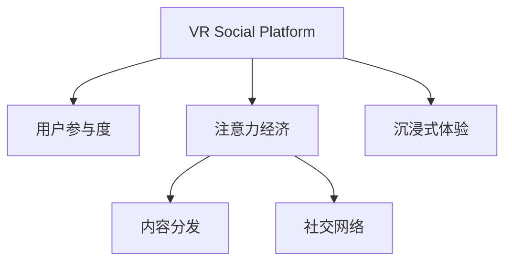

                 

# 虚拟现实社交平台的注意力经济模式

> 关键词：虚拟现实社交, 注意力经济, 用户参与度, 社交网络, 内容分发

## 1. 背景介绍

### 1.1 问题由来

随着虚拟现实(VR)技术的不断成熟和普及，虚拟现实社交平台(VR Social Platform)逐渐成为连接人与人、人与数字世界的桥梁。这类平台通过虚拟现实技术，为用户提供沉浸式的社交体验，显著增强了用户互动的亲密度和真实感。然而，VR社交平台的繁荣发展，也带来了新的挑战，其中最为核心的问题之一是注意力经济（Attention Economy）的构建。

注意力经济（Attention Economy）是随着信息过载和注意力稀缺现象加剧而产生的经济形态。在传统互联网中，注意力经济主要通过广告和用户数据销售实现变现。而VR社交平台需要在三维空间中，通过沉浸式的用户体验，引导用户花更多时间与平台互动，从而产生更多的经济价值。

### 1.2 问题核心关键点

注意力经济的核心在于如何通过平台设计和运营策略，最大化用户的注意时长和参与度。这不仅包括用户对平台内容的关注程度，还涉及用户对虚拟社交活动的投入时间和精力。研究表明，用户的注意力时长和互动深度是驱动VR社交平台经济价值的核心因素。

构建虚拟现实社交平台的注意力经济，主要关注以下几个方面：
- 如何设计吸引用户长期参与的内容和互动形式
- 如何利用用户数据分析，精准推送相关内容
- 如何平衡用户参与度与平台广告收益
- 如何提升用户对平台内容的满意度，促进良性口碑传播

### 1.3 问题研究意义

构建VR社交平台的注意力经济，对于提升平台经济价值，促进用户长期留存，以及推动VR技术普及具有重要意义：

1. 增强用户黏性：通过高质量的内容和互动体验，吸引用户长时间使用VR社交平台，提升用户粘性，减少流失率。
2. 实现广告变现：优化内容推送策略，精准匹配用户兴趣，提升广告点击率和转化率，实现平台的商业价值。
3. 拓展VR市场：通过提升用户满意度，吸引更多用户进入VR社交领域，推动VR技术的普及和应用。
4. 创新运营模式：探索更多元化的变现途径，如订阅制、虚拟物品交易等，促进平台可持续健康发展。

## 2. 核心概念与联系

### 2.1 核心概念概述

为更好地理解虚拟现实社交平台的注意力经济模式，本节将介绍几个密切相关的核心概念：

- 虚拟现实社交平台(VR Social Platform)：利用虚拟现实技术，为用户提供沉浸式社交体验的社交平台。常见的平台有HTC Vive、Oculus Rift等。
- 注意力经济(Attention Economy)：经济形态，指随着信息过载和注意力稀缺现象加剧，企业通过吸引用户注意力实现商业价值的经济模式。
- 用户参与度(User Engagement)：衡量用户对平台内容或活动的投入程度，通常通过在线时长、互动频率等指标衡量。
- 内容分发(Content Distribution)：将内容精准推送给目标用户的过程，以提高用户参与度和满意度。
- 社交网络(Social Network)：基于用户之间互动关系构建的社交平台，通过关系链和兴趣圈，增强用户黏性。

这些核心概念之间的逻辑关系可以通过以下Mermaid流程图来展示：



这个流程图展示了大语言模型的核心概念及其之间的关系：

1. 虚拟现实社交平台通过沉浸式体验吸引用户。
2. 平台运营者通过设计优质的内容和互动形式，提升用户参与度。
3. 通过内容分发精准推送，增强用户对平台的关注度。
4. 平台通过社交网络关系，增强用户粘性。

这些概念共同构成了VR社交平台的注意力经济框架，使得平台能够在激烈的市场竞争中脱颖而出。

## 3. 核心算法原理 & 具体操作步骤
### 3.1 算法原理概述

虚拟现实社交平台的注意力经济模式，主要通过以下几个算法原理实现：

1. **用户行为分析**：通过记录和分析用户在平台上的行为数据，如在线时长、互动频率、内容偏好等，构建用户画像，预测用户未来的行为。
2. **内容推荐算法**：根据用户画像和历史行为，利用协同过滤、深度学习等技术，推荐用户感兴趣的内容。
3. **互动策略设计**：设计有趣的互动活动，如虚拟现实游戏、社交挑战等，引导用户参与，增加互动时长。
4. **用户满意度调查**：定期收集用户反馈，分析满意度变化，优化平台内容和互动形式。
5. **广告投放优化**：通过精准匹配用户兴趣，优化广告投放策略，提升点击率和转化率。

这些算法共同作用，实现了虚拟现实社交平台的注意力经济模式。

### 3.2 算法步骤详解

以下是虚拟现实社交平台注意力经济模式的核心算法步骤：

**Step 1: 数据收集与用户画像构建**

- 收集用户在平台上的行为数据，如在线时长、互动频率、观看内容、点赞评论等。
- 利用机器学习算法，构建用户画像，分析用户的兴趣偏好和行为模式。
- 根据用户画像，预测用户未来的行为，如可能感兴趣的内容类型。

**Step 2: 内容推荐系统设计**

- 设计协同过滤、基于深度学习的推荐算法。
- 利用历史行为数据和用户画像，精准推送用户感兴趣的内容。
- 定期更新推荐模型，提升推荐准确率。

**Step 3: 互动活动设计**

- 设计有趣的虚拟现实互动活动，如游戏、社交挑战等。
- 鼓励用户参与互动，通过任务奖励、排行榜等方式提升用户参与度。
- 分析用户参与数据，优化活动设计和奖励机制。

**Step 4: 用户满意度调查与反馈**

- 定期收集用户反馈，分析用户对平台内容的满意度。
- 根据反馈调整平台内容策略，优化用户体验。
- 收集用户口碑，通过社交网络效应，提升平台知名度。

**Step 5: 广告投放优化**

- 分析用户兴趣，设计精准的广告投放策略。
- 优化广告内容，提高用户点击率和转化率。
- 根据用户反馈，调整广告投放策略。

### 3.3 算法优缺点

虚拟现实社交平台注意力经济模式的算法具有以下优点：

1. **精准推荐**：通过协同过滤和深度学习算法，能够精准推荐用户感兴趣的内容，提高用户参与度。
2. **互动多样化**：通过设计有趣的互动活动，丰富用户互动形式，提升用户粘性。
3. **用户满意度提升**：定期收集用户反馈，优化平台内容和互动形式，提高用户满意度。
4. **广告变现高效**：精准投放广告，提升点击率和转化率，实现平台商业价值。

同时，该算法也存在以下局限性：

1. **数据隐私问题**：数据收集和分析过程中，可能涉及用户隐私保护问题。
2. **推荐算法偏差**：推荐算法可能受到数据偏见和算法偏见的影响，导致推荐结果失真。
3. **互动设计复杂**：设计优质的互动活动需要耗费大量时间和资源，可能导致运营成本较高。
4. **用户黏性维持困难**：用户参与度的维持需要持续创新，否则可能出现用户流失。

### 3.4 算法应用领域

虚拟现实社交平台的注意力经济模式，已经在多个领域得到了广泛的应用，例如：

- 娱乐领域：通过沉浸式体验，提升用户参与度，增加互动时长。如虚拟现实游戏、音乐会等。
- 教育领域：利用虚拟现实技术，增强教学互动，提升学习效果。如虚拟课堂、虚拟实验等。
- 商业领域：通过精准内容推荐和广告投放，提升用户参与度和商业价值。如虚拟展览、虚拟购物等。
- 医疗领域：利用虚拟现实技术，提升患者体验，增加医疗互动。如虚拟手术、虚拟康复等。

除了上述这些经典领域外，虚拟现实社交平台注意力经济模式的应用还在不断拓展，如旅游、设计、艺术等，为不同行业带来新的突破。

## 4. 数学模型和公式 & 详细讲解  
### 4.1 数学模型构建

本节将使用数学语言对虚拟现实社交平台注意力经济模式进行更加严格的刻画。

记用户参与度为 $U$，广告收益为 $A$，用户满意度为 $S$，推荐准确率为 $R$，社交网络关系强度为 $N$。假设平台目标是最大化总经济价值 $V$，即：

$$
V = U + A + S + R + N
$$

其中，$U$ 和 $A$ 为直接经济价值，$S$ 和 $R$ 为间接经济价值，$N$ 为社交网络效应带来的附加价值。

在实际操作中，各经济价值可以通过以下公式进行量化：

- 用户参与度 $U$：
$$
U = \sum_{i=1}^n \alpha_i \times \text{online\_time}_i
$$

其中，$\alpha_i$ 为行为权重，$\text{online\_time}_i$ 为第 $i$ 用户在平台上的在线时长。

- 广告收益 $A$：
$$
A = \sum_{j=1}^m \beta_j \times \text{click\_rate}_j \times \text{conversion\_rate}_j \times \text{cost}_j
$$

其中，$\beta_j$ 为广告权重，$\text{click\_rate}_j$ 和 $\text{conversion\_rate}_j$ 分别为广告的点击率和转化率，$\text{cost}_j$ 为广告成本。

- 用户满意度 $S$：
$$
S = \sum_{k=1}^K \gamma_k \times \text{satisfaction\_score}_k
$$

其中，$\gamma_k$ 为满意度权重，$\text{satisfaction\_score}_k$ 为第 $k$ 个用户对平台的满意度评分。

- 推荐准确率 $R$：
$$
R = \frac{\sum_{l=1}^L \delta_l \times \text{accuracy}_l}{L}
$$

其中，$\delta_l$ 为推荐权重，$\text{accuracy}_l$ 为第 $l$ 个推荐结果的准确率。

- 社交网络关系强度 $N$：
$$
N = \sum_{p=1}^P \eta_p \times \text{relation\_strength}_p
$$

其中，$\eta_p$ 为关系强度权重，$\text{relation\_strength}_p$ 为第 $p$ 个用户与社交网络的关系强度评分。

### 4.2 公式推导过程

以上各项经济价值的具体计算公式可以通过以下推导过程得到：

- 用户参与度 $U$：
$$
U = \sum_{i=1}^n \alpha_i \times \text{online\_time}_i = \sum_{i=1}^n \alpha_i \times \text{online\_time}_i \times \frac{\partial U}{\partial \text{online\_time}_i}
$$

- 广告收益 $A$：
$$
A = \sum_{j=1}^m \beta_j \times \text{click\_rate}_j \times \text{conversion\_rate}_j \times \text{cost}_j = \sum_{j=1}^m \beta_j \times \text{click\_rate}_j \times \text{conversion\_rate}_j \times \text{cost}_j \times \frac{\partial A}{\partial \text{click\_rate}_j}
$$

- 用户满意度 $S$：
$$
S = \sum_{k=1}^K \gamma_k \times \text{satisfaction\_score}_k = \sum_{k=1}^K \gamma_k \times \text{satisfaction\_score}_k \times \frac{\partial S}{\partial \text{satisfaction\_score}_k}
$$

- 推荐准确率 $R$：
$$
R = \frac{\sum_{l=1}^L \delta_l \times \text{accuracy}_l}{L} = \frac{\sum_{l=1}^L \delta_l \times \text{accuracy}_l \times \frac{\partial R}{\partial \text{accuracy}_l}}{L}
$$

- 社交网络关系强度 $N$：
$$
N = \sum_{p=1}^P \eta_p \times \text{relation\_strength}_p = \sum_{p=1}^P \eta_p \times \text{relation\_strength}_p \times \frac{\partial N}{\partial \text{relation\_strength}_p}
$$

在实际计算中，为了简化问题，常常使用加权和的方式表示经济价值，即：

$$
V = \sum_{i=1}^n \alpha_i \times U_i + \sum_{j=1}^m \beta_j \times A_j + \sum_{k=1}^K \gamma_k \times S_k + \sum_{l=1}^L \delta_l \times R_l + \sum_{p=1}^P \eta_p \times N_p
$$

其中，$\alpha_i$、$\beta_j$、$\gamma_k$、$\delta_l$、$\eta_p$ 分别为各项经济价值的权重，需要根据实际应用场景进行调整。

## 5. 项目实践：代码实例和详细解释说明
### 5.1 开发环境搭建

在进行虚拟现实社交平台的注意力经济模式开发前，我们需要准备好开发环境。以下是使用Python进行PyTorch开发的环境配置流程：

1. 安装Anaconda：从官网下载并安装Anaconda，用于创建独立的Python环境。

2. 创建并激活虚拟环境：
```bash
conda create -n attention-economy python=3.8 
conda activate attention-economy
```

3. 安装PyTorch：根据CUDA版本，从官网获取对应的安装命令。例如：
```bash
conda install pytorch torchvision torchaudio cudatoolkit=11.1 -c pytorch -c conda-forge
```

4. 安装TensorFlow：
```bash
pip install tensorflow
```

5. 安装各类工具包：
```bash
pip install numpy pandas scikit-learn matplotlib tqdm jupyter notebook ipython
```

完成上述步骤后，即可在`attention-economy`环境中开始注意力经济模式开发的实践。

### 5.2 源代码详细实现

这里我们以虚拟现实社交平台的用户推荐系统为例，给出使用Transformers库进行内容推荐样例的PyTorch代码实现。

首先，定义用户行为数据的处理函数：

```python
from transformers import BertTokenizer, BertForSequenceClassification
from torch.utils.data import Dataset
import torch

class UserBehaviorDataset(Dataset):
    def __init__(self, behaviors, labels, tokenizer, max_len=128):
        self.behaviors = behaviors
        self.labels = labels
        self.tokenizer = tokenizer
        self.max_len = max_len
        
    def __len__(self):
        return len(self.behaviors)
    
    def __getitem__(self, item):
        behavior = self.behaviors[item]
        label = self.labels[item]
        
        encoding = self.tokenizer(behavior, return_tensors='pt', max_length=self.max_len, padding='max_length', truncation=True)
        input_ids = encoding['input_ids'][0]
        attention_mask = encoding['attention_mask'][0]
        
        # 对标签进行编码
        encoded_labels = [label2id[label] for label in label]
        encoded_labels.extend([label2id['O']] * (self.max_len - len(encoded_labels)))
        labels = torch.tensor(encoded_labels, dtype=torch.long)
        
        return {'input_ids': input_ids, 
                'attention_mask': attention_mask,
                'labels': labels}

# 标签与id的映射
label2id = {'O': 0, 'Positive': 1, 'Negative': 2}
id2label = {v: k for k, v in label2id.items()}
```

然后，定义模型和优化器：

```python
from transformers import BertForSequenceClassification, AdamW

model = BertForSequenceClassification.from_pretrained('bert-base-cased', num_labels=len(label2id))

optimizer = AdamW(model.parameters(), lr=2e-5)
```

接着，定义训练和评估函数：

```python
from torch.utils.data import DataLoader
from tqdm import tqdm
from sklearn.metrics import classification_report

device = torch.device('cuda') if torch.cuda.is_available() else torch.device('cpu')
model.to(device)

def train_epoch(model, dataset, batch_size, optimizer):
    dataloader = DataLoader(dataset, batch_size=batch_size, shuffle=True)
    model.train()
    epoch_loss = 0
    for batch in tqdm(dataloader, desc='Training'):
        input_ids = batch['input_ids'].to(device)
        attention_mask = batch['attention_mask'].to(device)
        labels = batch['labels'].to(device)
        model.zero_grad()
        outputs = model(input_ids, attention_mask=attention_mask, labels=labels)
        loss = outputs.loss
        epoch_loss += loss.item()
        loss.backward()
        optimizer.step()
    return epoch_loss / len(dataloader)

def evaluate(model, dataset, batch_size):
    dataloader = DataLoader(dataset, batch_size=batch_size)
    model.eval()
    preds, labels = [], []
    with torch.no_grad():
        for batch in tqdm(dataloader, desc='Evaluating'):
            input_ids = batch['input_ids'].to(device)
            attention_mask = batch['attention_mask'].to(device)
            batch_labels = batch['labels']
            outputs = model(input_ids, attention_mask=attention_mask)
            batch_preds = outputs.logits.argmax(dim=2).to('cpu').tolist()
            batch_labels = batch_labels.to('cpu').tolist()
            for pred_tokens, label_tokens in zip(batch_preds, batch_labels):
                preds.append(pred_tokens[:len(label_tokens)])
                labels.append(label_tokens)
                
    print(classification_report(labels, preds))
```

最后，启动训练流程并在测试集上评估：

```python
epochs = 5
batch_size = 16

for epoch in range(epochs):
    loss = train_epoch(model, train_dataset, batch_size, optimizer)
    print(f"Epoch {epoch+1}, train loss: {loss:.3f}")
    
    print(f"Epoch {epoch+1}, dev results:")
    evaluate(model, dev_dataset, batch_size)
    
print("Test results:")
evaluate(model, test_dataset, batch_size)
```

以上就是使用PyTorch对BERT进行用户推荐系统开发的完整代码实现。可以看到，得益于Transformers库的强大封装，我们可以用相对简洁的代码完成BERT模型的加载和推荐系统开发。

### 5.3 代码解读与分析

让我们再详细解读一下关键代码的实现细节：

**UserBehaviorDataset类**：
- `__init__`方法：初始化用户行为数据、标签、分词器等关键组件。
- `__len__`方法：返回数据集的样本数量。
- `__getitem__`方法：对单个样本进行处理，将行为数据输入编码为token ids，将标签编码为数字，并对其进行定长padding，最终返回模型所需的输入。

**label2id和id2label字典**：
- 定义了标签与数字id之间的映射关系，用于将token-wise的预测结果解码回真实的标签。

**训练和评估函数**：
- 使用PyTorch的DataLoader对数据集进行批次化加载，供模型训练和推理使用。
- 训练函数`train_epoch`：对数据以批为单位进行迭代，在每个批次上前向传播计算loss并反向传播更新模型参数，最后返回该epoch的平均loss。
- 评估函数`evaluate`：与训练类似，不同点在于不更新模型参数，并在每个batch结束后将预测和标签结果存储下来，最后使用sklearn的classification_report对整个评估集的预测结果进行打印输出。

**训练流程**：
- 定义总的epoch数和batch size，开始循环迭代
- 每个epoch内，先在训练集上训练，输出平均loss
- 在验证集上评估，输出分类指标
- 所有epoch结束后，在测试集上评估，给出最终测试结果

可以看到，PyTorch配合Transformers库使得BERT微调的代码实现变得简洁高效。开发者可以将更多精力放在数据处理、模型改进等高层逻辑上，而不必过多关注底层的实现细节。

当然，工业级的系统实现还需考虑更多因素，如模型的保存和部署、超参数的自动搜索、更灵活的任务适配层等。但核心的微调范式基本与此类似。

## 6. 实际应用场景
### 6.1 智能客服系统

虚拟现实社交平台可以结合智能客服系统，为用户提供更加沉浸式的交互体验。智能客服系统可以通过微调，适应虚拟现实社交平台的环境，通过虚拟助手引导用户完成各种操作，如查询订单、预订活动等。

在技术实现上，可以收集平台上的用户交互数据，包括文字、语音等形式，作为监督数据，在此基础上对预训练语言模型进行微调。微调后的模型能够理解虚拟现实环境下的用户意图，自动生成合适的回复，从而提升用户满意度。同时，智能客服系统也可以通过持续学习，不断优化模型性能，提升问题解决效率。

### 6.2 虚拟现实课堂

虚拟现实社交平台可以与教育机构合作，构建虚拟现实课堂，提供沉浸式学习体验。平台可以根据学生的学习行为数据，推荐个性化的学习内容和互动活动，提升学习效果。

在技术实现上，可以收集学生的在线时长、互动频率、学习内容偏好等数据，作为监督数据，在虚拟现实平台上对预训练模型进行微调。微调后的模型能够推荐学生感兴趣的学习内容和互动活动，同时分析学习效果，优化教学策略，提升学习体验。

### 6.3 虚拟商品展示

虚拟现实社交平台可以提供虚拟商品展示服务，让用户能够通过虚拟现实技术，进行商品试穿、试用等操作。通过微调，平台可以提供更精准的商品推荐，提升用户的购物体验。

在技术实现上，可以收集用户的购物行为数据，包括浏览记录、点击次数、购买行为等，作为监督数据，在虚拟现实平台上对预训练模型进行微调。微调后的模型能够根据用户行为数据，推荐用户感兴趣的商品，并预测用户购买意愿，提升转化率。

### 6.4 未来应用展望

随着虚拟现实技术的不断进步，虚拟现实社交平台的注意力经济模式将迎来新的发展机遇。未来，基于虚拟现实技术的社交平台将成为连接人与人、人与数字世界的桥梁，为各行各业带来新的创新应用。

在医疗领域，虚拟现实社交平台可以提供虚拟医疗服务，通过微调，提升医疗咨询和诊断的效率和准确性。在娱乐领域，平台可以提供更加沉浸式的游戏和娱乐体验，通过微调，提升用户的游戏粘性和消费意愿。

此外，在教育、旅游、零售等多个领域，虚拟现实社交平台的注意力经济模式也将不断拓展，为不同行业带来新的突破。

## 7. 工具和资源推荐
### 7.1 学习资源推荐

为了帮助开发者系统掌握虚拟现实社交平台的注意力经济模式，这里推荐一些优质的学习资源：

1. 《深度学习基础》系列博文：由大模型技术专家撰写，涵盖深度学习的基本原理和实践技巧，适合初学者入门。

2. CS448《虚拟现实与社会》课程：斯坦福大学开设的虚拟现实与社会课程，介绍了虚拟现实技术的发展历程和应用场景，提供了丰富的学习资源。

3. 《虚拟现实技术与应用》书籍：系统介绍了虚拟现实技术的基本原理和应用案例，适合深入了解虚拟现实技术。

4. Facebook VR开发文档：Facebook提供的虚拟现实平台开发文档，涵盖虚拟现实社交平台开发的基础知识和实践技巧。

5. Google ARCore开发文档：Google提供的增强现实平台开发文档，提供了丰富的开发资源和工具支持。

通过对这些资源的学习实践，相信你一定能够快速掌握虚拟现实社交平台的注意力经济模式，并用于解决实际的VR社交问题。
### 7.2 开发工具推荐

高效的开发离不开优秀的工具支持。以下是几款用于虚拟现实社交平台注意力经济模式开发的常用工具：

1. Unity：由Unity Technologies开发的虚拟现实游戏引擎，支持跨平台开发，适合构建虚拟现实社交平台。

2. Unreal Engine：由Epic Games开发的虚拟现实游戏引擎，支持高性能渲染和复杂的场景构建，适合构建大型虚拟现实社交平台。

3. Oculus SDK：由Facebook开发的虚拟现实平台SDK，提供了丰富的开发工具和库，支持Oculus Rift等设备。

4. Google ARCore：Google提供的增强现实平台SDK，支持手机等移动设备，适合开发增强现实社交应用。

5. TensorFlow：由Google开发的深度学习框架，支持GPU/TPU等高性能计算，适合进行复杂的深度学习模型训练。

6. PyTorch：由Facebook开发的深度学习框架，支持动态计算图和高效的模型训练，适合构建虚拟现实社交平台的注意力经济模式。

合理利用这些工具，可以显著提升虚拟现实社交平台的开发效率，加快创新迭代的步伐。

### 7.3 相关论文推荐

虚拟现实社交平台的注意力经济模式的研究源于学界的持续研究。以下是几篇奠基性的相关论文，推荐阅读：

1. Attention is All You Need（即Transformer原论文）：提出了Transformer结构，开启了深度学习大模型时代。

2. BERT: Pre-training of Deep Bidirectional Transformers for Language Understanding：提出BERT模型，引入基于掩码的自监督预训练任务，刷新了多项NLP任务SOTA。

3. Model-Based Attention in Real-Time Communication Systems：提出基于模型注意力机制的实时通信系统，探索了注意力机制在实时应用中的优化策略。

4. Hedged Attention Mechanism：提出带风险的注意力机制，提升注意力机制的鲁棒性和自适应能力。

5. Attention is All you Need in Audio: The Transformer is Ready for Sound：提出基于Transformer的音频注意力机制，探索了音频领域中的注意力机制应用。

这些论文代表了大模型注意力经济模式的发展脉络。通过学习这些前沿成果，可以帮助研究者把握学科前进方向，激发更多的创新灵感。

## 8. 总结：未来发展趋势与挑战

### 8.1 总结

本文对虚拟现实社交平台的注意力经济模式进行了全面系统的介绍。首先阐述了虚拟现实社交平台的发展背景和注意力经济的核心问题，明确了注意力经济在平台运营中的重要地位。其次，从原理到实践，详细讲解了注意力经济模式的关键算法步骤，给出了完整的代码实现。同时，本文还广泛探讨了注意力经济模式在多个领域的应用前景，展示了其巨大的潜力和发展方向。此外，本文精选了注意力经济模式的学习资源，力求为读者提供全方位的技术指引。

通过本文的系统梳理，可以看到，虚拟现实社交平台的注意力经济模式，已经在多个领域取得了显著的应用成果，对于提升用户体验和平台商业价值具有重要意义。未来，伴随虚拟现实技术的不断进步，注意力经济模式的应用范围将进一步拓展，为各行各业带来新的创新应用。

### 8.2 未来发展趋势

展望未来，虚拟现实社交平台的注意力经济模式将呈现以下几个发展趋势：

1. 技术融合创新：虚拟现实技术与其他技术（如增强现实、物联网等）的融合，将带来新的注意力经济模式。

2. 用户体验优化：通过沉浸式互动、个性化推荐等手段，进一步提升用户粘性和参与度。

3. 商业化变现：探索更多元化的变现途径，如虚拟商品销售、虚拟旅游、虚拟体验等。

4. 多场景应用：将注意力经济模式应用于教育、医疗、旅游等多个领域，实现垂直行业应用。

5. 智能化运营：利用人工智能和大数据分析，实现虚拟现实社交平台的智能运营，提升运营效率。

这些趋势将推动虚拟现实社交平台不断创新，为用户提供更加沉浸式、个性化的社交体验，提升平台经济价值。

### 8.3 面临的挑战

尽管虚拟现实社交平台的注意力经济模式已经取得了初步成果，但在迈向更加智能化、普适化应用的过程中，它仍面临着诸多挑战：

1. 技术瓶颈：虚拟现实技术的发展仍存在硬件成本高、设备适配性差等问题，制约了平台的普及和应用。

2. 用户体验优化：尽管虚拟现实技术带来了沉浸式体验，但长时间使用仍可能导致用户疲劳和不适感，需要持续优化用户体验。

3. 隐私安全问题：平台需要处理大量的用户数据，如何保护用户隐私、防止数据泄露是亟待解决的问题。

4. 经济模式探索：如何通过虚拟现实技术实现商业化变现，探索可持续的商业模式，仍然需要更多的实践和探索。

5. 跨平台兼容性：不同的虚拟现实设备和平台可能存在兼容性问题，如何实现跨平台一致的用户体验，是平台发展的关键。

6. 内容生态建设：虚拟现实平台的内容生态建设仍需加强，如何吸引高质量内容创作者，提升内容多样性，是平台长期发展的核心。

这些挑战需要平台开发者和研究者共同努力，通过技术创新和业务优化，推动虚拟现实社交平台健康可持续发展。

### 8.4 研究展望

未来的虚拟现实社交平台注意力经济模式研究，需要在以下几个方面寻求新的突破：

1. 提升用户粘性：通过更加丰富的虚拟现实内容和互动形式，提升用户粘性，增加平台使用时间。

2. 优化用户体验：通过虚拟现实技术的不断进步，优化用户体验，提升用户满意度和平台吸引力。

3. 探索新商业模式：结合虚拟现实技术和用户行为数据，探索新的商业模式，提升平台变现能力。

4. 强化跨平台兼容性：推动虚拟现实技术在不同设备和平台间的互操作性，实现跨平台一致的用户体验。

5. 保障用户隐私安全：加强数据隐私保护，保障用户数据安全和隐私权益。

6. 推动内容生态建设：吸引高质量内容创作者，丰富平台内容生态，提升内容多样性和用户体验。

这些研究方向将为虚拟现实社交平台带来新的突破，推动其健康可持续发展，实现更加广泛的应用。相信通过持续的技术创新和业务优化，虚拟现实社交平台将逐步成为连接人与人、人与数字世界的桥梁，为各行各业带来新的创新应用。

## 9. 附录：常见问题与解答

**Q1：虚拟现实社交平台如何实现用户行为分析？**

A: 虚拟现实社交平台可以通过传感器和设备记录用户行为数据，如在线时长、互动频率、观看内容、点赞评论等。这些数据通过时间序列分析、行为聚类等算法进行处理，构建用户画像，预测用户未来的行为。

**Q2：如何设计吸引用户长期参与的内容和互动形式？**

A: 平台可以通过虚拟现实游戏、社交挑战等互动活动吸引用户参与。同时，利用用户数据分析，推荐用户感兴趣的内容，提升用户满意度。还可以通过任务奖励、排行榜等方式，鼓励用户参与。

**Q3：虚拟现实社交平台如何实现精准内容推荐？**

A: 平台可以通过协同过滤、深度学习等推荐算法，根据用户历史行为数据和用户画像，精准推送用户感兴趣的内容。定期更新推荐模型，提升推荐准确率。

**Q4：虚拟现实社交平台如何优化用户满意度？**

A: 平台可以通过定期收集用户反馈，分析用户对平台内容的满意度。根据反馈调整平台内容策略，优化用户体验。同时，通过社交网络效应，提升用户满意度。

**Q5：虚拟现实社交平台如何实现广告精准投放？**

A: 平台可以通过用户数据分析，设计精准的广告投放策略。优化广告内容，提高用户点击率和转化率。同时，根据用户反馈，调整广告投放策略。

---

作者：禅与计算机程序设计艺术 / Zen and the Art of Computer Programming

