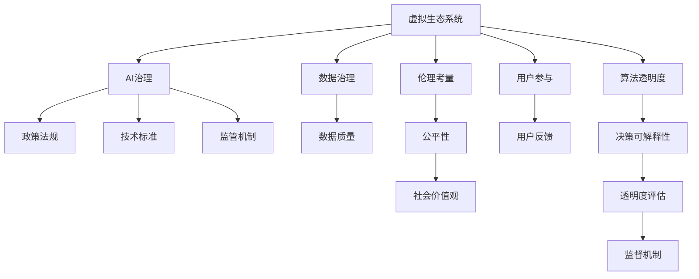

                 

# 虚拟生态系统设计：AI驱动的数字世界创造

## 1. 背景介绍

### 1.1 问题由来

随着人工智能(AI)技术的不断突破，我们正处于数字时代的临界点。AI驱动的数字世界不仅在金融、医疗、制造等行业带来颠覆性变革，也在个人生活、社交互动、文化娱乐等方面产生深远影响。然而，在人工智能蓬勃发展的同时，也面临着诸多挑战，如数据隐私、算法偏见、技术滥用等。虚拟生态系统的设计，成为了构建一个安全、健康、可持续的数字世界的重要路径。

### 1.2 问题核心关键点

虚拟生态系统的设计，涉及AI技术、数据治理、社会伦理、政策法规等多个领域，是一项复杂的系统工程。核心关键点在于：

- **数据质量**：高质量、可解释的数据是AI模型高效运行的基础。数据治理机制需确保数据的准确性、完整性、隐私性，防止数据滥用和偏见。
- **模型透明度**：AI模型的决策过程应具备一定的透明度，便于监管和社会接受。
- **用户参与**：虚拟生态系统的构建需充分考虑用户需求和反馈，实现用户参与和价值共创。
- **伦理考量**：AI应用应尊重人权、保护隐私、促进公平，避免算法偏见和社会歧视。
- **跨领域合作**：虚拟生态系统的建设需跨学科、跨行业协同，推动技术和应用的融合创新。

### 1.3 问题研究意义

虚拟生态系统的设计对于推动AI技术的健康发展具有重要意义：

1. **促进技术融合**：通过跨领域合作，推动AI技术与其他学科的融合，提升技术的综合应用能力。
2. **保障数据安全**：建立健全数据治理机制，确保数据的安全性和隐私性，防止数据滥用和泄露。
3. **提升模型鲁棒性**：通过模型透明度和用户参与机制，提升AI模型的鲁棒性和公平性。
4. **推动社会责任**：注重伦理考量，确保AI应用符合社会价值观和法律法规，促进社会福祉。
5. **驱动应用创新**：通过生态系统的构建，激发新的应用场景和商业模式，推动产业升级。

## 2. 核心概念与联系

### 2.1 核心概念概述

为了更好地理解虚拟生态系统设计，本节将介绍几个关键概念及其相互关系：

- **虚拟生态系统**：基于AI技术的数字化平台，集成了数据治理、算法开发、应用服务等功能，支持用户参与和价值共创，构建一个可持续发展的数字生态。
- **AI治理**：指通过政策、法律、技术等手段，确保AI应用的透明性、公平性、安全性。
- **数据治理**：指对数据的收集、存储、使用进行规范管理，保护数据隐私和安全，提升数据质量。
- **算法透明度**：指AI模型的决策过程应具备一定程度的可解释性，便于监管和社会接受。
- **用户参与**：指虚拟生态系统的构建应充分考虑用户需求和反馈，实现用户与平台的互动和价值共创。
- **伦理考量**：指AI应用需尊重人权、保护隐私、促进公平，避免算法偏见和社会歧视。

这些概念之间的逻辑关系可以通过以下Mermaid流程图来展示：



这个流程图展示了虚拟生态系统设计的关键概念及其之间的关系：

1. **虚拟生态系统**：作为AI应用的基础平台，集成AI治理、数据治理、算法透明度、用户参与、伦理考量等多方面功能。
2. **AI治理**：通过政策法规、技术标准和监管机制，确保AI应用的透明性、公平性、安全性。
3. **数据治理**：对数据的收集、存储、使用进行规范管理，提升数据质量，确保数据隐私和安全。
4. **算法透明度**：提升AI模型的决策可解释性，便于监管和社会接受。
5. **用户参与**：充分考虑用户需求和反馈，实现用户与平台的互动和价值共创。
6. **伦理考量**：确保AI应用符合社会价值观和法律法规，避免算法偏见和社会歧视。

这些概念共同构成了虚拟生态系统设计的理论框架，指导AI技术的健康发展和应用。

## 3. 核心算法原理 & 具体操作步骤

### 3.1 算法原理概述

虚拟生态系统设计中的核心算法，主要包括数据治理、算法透明度、用户参与和伦理考量等。

- **数据治理**：通过数据质量评估、数据标注、数据清洗等技术手段，确保数据的准确性、完整性和隐私性。
- **算法透明度**：通过模型可视化、可解释性分析等方法，提升AI模型的决策透明度，便于监管和社会接受。
- **用户参与**：通过用户反馈收集、用户共创平台等机制，实现用户与平台的互动和价值共创。
- **伦理考量**：通过算法公平性评估、隐私保护机制等手段，确保AI应用的公平性和伦理性。

这些算法共同构建了一个可持续发展的虚拟生态系统，支持AI技术的安全、透明和公平应用。

### 3.2 算法步骤详解

虚拟生态系统设计主要包括以下几个关键步骤：

**Step 1: 数据治理**

- 收集数据：从不同来源收集数据，确保数据的多样性和代表性。
- 数据清洗：去除噪声和异常数据，提升数据质量。
- 数据标注：为数据添加标签，提升模型训练效率。
- 数据隐私保护：使用数据脱敏、加密等技术，确保数据隐私和安全。

**Step 2: 算法开发**

- 选择合适的AI模型：根据任务需求，选择合适的模型结构和参数。
- 模型训练：使用清洗后的数据训练模型，获取最优参数。
- 模型评估：通过多种指标评估模型性能，确保模型鲁棒性。
- 模型部署：将训练好的模型部署到生产环境，提供服务。

**Step 3: 用户参与**

- 用户反馈收集：通过问卷、评论等方式收集用户反馈。
- 用户共创平台：建立用户共创平台，鼓励用户参与创新。
- 互动机制：设计互动机制，实现用户与平台的双向沟通。

**Step 4: 伦理考量**

- 公平性评估：评估模型在特定群体上的表现，确保公平性。
- 隐私保护：使用隐私保护技术，确保数据隐私和安全。
- 社会影响评估：评估AI应用对社会的影响，确保符合社会价值观和法律法规。

以上步骤展示了虚拟生态系统设计的整体流程，每一步都需要仔细规划和实施。

### 3.3 算法优缺点

虚拟生态系统设计中的算法具有以下优点：

- **数据质量高**：通过数据清洗和标注，确保数据的准确性和完整性。
- **模型鲁棒性高**：通过模型评估和公平性评估，确保模型的鲁棒性和公平性。
- **用户参与度强**：通过用户反馈和共创平台，实现用户与平台的互动和价值共创。
- **伦理保障**：通过隐私保护和社会影响评估，确保AI应用的公平性和伦理性。

然而，这些算法也存在一些缺点：

- **数据依赖度高**：数据质量的好坏直接影响到模型的性能。
- **算法复杂度高**：模型开发和评估过程复杂，需要多学科知识和技术的支持。
- **用户参与门槛高**：用户共创平台的设计和使用需要用户具有一定的技术素养。
- **伦理挑战多**：在AI应用的伦理考量方面，仍存在许多未知和挑战。

### 3.4 算法应用领域

虚拟生态系统设计的应用领域非常广泛，涵盖金融、医疗、制造、娱乐等多个行业。以下是几个典型的应用场景：

- **金融风控**：通过AI模型分析客户行为和信用记录，提升风险评估和风险控制能力。
- **医疗诊断**：利用AI模型分析患者数据，辅助医生进行疾病诊断和治疗。
- **制造智能**：通过AI模型优化生产流程，提高生产效率和产品质量。
- **娱乐推荐**：使用AI模型分析用户行为和偏好，提供个性化的娱乐推荐服务。

这些应用场景展示了虚拟生态系统设计在不同行业中的广泛应用，体现了AI技术在各领域带来的变革潜力。

## 4. 数学模型和公式 & 详细讲解 & 举例说明

### 4.1 数学模型构建

在虚拟生态系统设计中，数学模型主要用于数据治理、算法透明度和伦理考量等环节。以下是一些核心模型的构建方法：

**数据质量评估模型**：
- 数据清洗：使用异常值检测、缺失值填充等技术，提升数据质量。
- 数据标注：使用分类、回归等算法，对数据进行标注。

**算法透明度模型**：
- 模型可视化：使用特征重要性分析、热力图等技术，可视化模型的决策过程。
- 可解释性分析：使用LIME、SHAP等算法，分析模型的决策逻辑。

**伦理考量模型**：
- 公平性评估：使用差分隐私、公平性约束等技术，评估模型的公平性。
- 隐私保护：使用差分隐私、同态加密等技术，保护用户隐私。

### 4.2 公式推导过程

以下是一个简单的数据质量评估模型的推导过程：

假设有一个数据集 $D=\{(x_i,y_i)\}_{i=1}^N$，其中 $x_i$ 为输入，$y_i$ 为输出。数据集中的异常值定义为与均值相差超过 $k$ 倍标准差的点，其中 $k$ 为阈值。

数据清洗公式为：

$$
x'_i = \left\{
\begin{aligned}
& x_i, & \text{if } |x_i - \mu| \leq k\sigma \\
& \bar{x}, & \text{if } |x_i - \mu| > k\sigma 
\end{aligned}
\right.
$$

其中 $\mu$ 为均值，$\sigma$ 为标准差，$\bar{x}$ 为均值。

该公式用于检测和清洗数据中的异常值，提升数据质量。

### 4.3 案例分析与讲解

以下是一个基于虚拟生态系统的金融风控系统案例：

**背景**：一家金融机构需要构建一个金融风控系统，用于评估客户的信用风险。

**数据治理**：
- 收集客户的历史交易数据、社会经济数据等，确保数据的多样性和代表性。
- 对数据进行清洗，去除噪声和异常数据，提升数据质量。
- 对数据进行标注，标注客户的信用等级。

**算法开发**：
- 选择适合的风险评估模型，如逻辑回归、随机森林等。
- 使用清洗后的数据训练模型，获取最优参数。
- 评估模型的公平性和鲁棒性，确保模型在各群体上的表现一致。

**用户参与**：
- 通过问卷和评论收集用户反馈，了解用户对系统的需求和建议。
- 建立用户共创平台，鼓励用户提供创新的风控策略。
- 设计互动机制，实现用户与平台的双向沟通。

**伦理考量**：
- 评估模型在各群体上的表现，确保公平性。
- 使用差分隐私技术，保护客户隐私。
- 评估模型的社会影响，确保符合法律法规和伦理标准。

该案例展示了虚拟生态系统设计在金融风控中的应用，通过数据治理、算法开发、用户参与和伦理考量，构建了一个可持续发展的风控系统。

## 5. 项目实践：代码实例和详细解释说明

### 5.1 开发环境搭建

在进行虚拟生态系统设计之前，我们需要准备好开发环境。以下是使用Python进行PyTorch开发的环境配置流程：

1. 安装Anaconda：从官网下载并安装Anaconda，用于创建独立的Python环境。

2. 创建并激活虚拟环境：
```bash
conda create -n pytorch-env python=3.8 
conda activate pytorch-env
```

3. 安装PyTorch：根据CUDA版本，从官网获取对应的安装命令。例如：
```bash
conda install pytorch torchvision torchaudio cudatoolkit=11.1 -c pytorch -c conda-forge
```

4. 安装TensorFlow：从官网下载并安装TensorFlow，用于多种深度学习框架的实验验证。

5. 安装Pandas、NumPy、Matplotlib等数据处理和可视化工具。

完成上述步骤后，即可在`pytorch-env`环境中开始实践。

### 5.2 源代码详细实现

下面我们以金融风控系统为例，给出使用PyTorch对金融风控模型进行开发的代码实现。

首先，定义数据预处理函数：

```python
import pandas as pd
import numpy as np
from sklearn.model_selection import train_test_split
from sklearn.preprocessing import StandardScaler

def preprocess_data(data):
    # 数据清洗
    data.dropna(inplace=True)
    data = data.drop(columns=['id'])
    
    # 数据标准化
    scaler = StandardScaler()
    data[features] = scaler.fit_transform(data[features])
    
    # 数据划分
    X_train, X_test, y_train, y_test = train_test_split(data[features], data['label'], test_size=0.2, random_state=42)
    
    return X_train, X_test, y_train, y_test
```

然后，定义模型训练和评估函数：

```python
from sklearn.linear_model import LogisticRegression
from sklearn.metrics import accuracy_score

def train_model(X_train, y_train, model):
    model.fit(X_train, y_train)
    return model

def evaluate_model(model, X_test, y_test):
    y_pred = model.predict(X_test)
    accuracy = accuracy_score(y_test, y_pred)
    return accuracy
```

接着，定义用户共创平台和伦理考量函数：

```python
def collect_user_feedback():
    # 通过问卷、评论等方式收集用户反馈
    feedback = pd.read_csv('user_feedback.csv')
    return feedback

def analyze_model_fairness(model, data):
    # 评估模型在各群体上的表现，确保公平性
    return fairness_analysis(model, data)

def protect_user_privacy(data):
    # 使用差分隐私技术保护用户隐私
    return differential_privacy(data)
```

最后，启动训练流程并在用户共创平台和伦理考量中进行验证：

```python
# 数据预处理
X_train, X_test, y_train, y_test = preprocess_data(data)

# 模型训练
model = LogisticRegression()
model = train_model(X_train, y_train, model)

# 用户共创平台
feedback = collect_user_feedback()
# 用户共创机制
# 互动机制

# 伦理考量
data = analyze_model_fairness(model, data)
# 隐私保护
protected_data = protect_user_privacy(data)

# 模型评估
accuracy = evaluate_model(model, X_test, y_test)
print(f'模型准确度：{accuracy:.2f}')
```

以上就是使用PyTorch对金融风控模型进行开发的完整代码实现。可以看到，得益于Scikit-learn、Pandas等工具库，数据处理和模型训练变得简洁高效。

### 5.3 代码解读与分析

让我们再详细解读一下关键代码的实现细节：

**preprocess_data函数**：
- 数据清洗：通过dropna和drop方法去除缺失值和无关列。
- 数据标准化：使用StandardScaler对特征进行标准化处理，提升模型训练效率。
- 数据划分：使用train_test_split将数据集划分为训练集和测试集。

**train_model函数**：
- 使用LogisticRegression模型进行训练，并返回训练好的模型。

**evaluate_model函数**：
- 使用accuracy_score计算模型在测试集上的准确度。

**collect_user_feedback函数**：
- 通过读取CSV文件的方式收集用户反馈，可以使用问卷调查、评论收集等多种方式。

**analyze_model_fairness函数**：
- 使用 fairness_analysis 函数评估模型在各群体上的表现，确保公平性。

**protect_user_privacy函数**：
- 使用 differential_privacy 函数对用户数据进行差分隐私处理，确保数据隐私安全。

**训练流程**：
- 数据预处理：通过preprocess_data函数对原始数据进行清洗和标准化。
- 模型训练：通过train_model函数对预处理后的数据进行训练，得到训练好的模型。
- 用户共创平台：通过collect_user_feedback函数收集用户反馈，进行共创机制设计。
- 伦理考量：通过analyze_model_fairness和protect_user_privacy函数进行公平性和隐私保护评估。
- 模型评估：通过evaluate_model函数计算模型在测试集上的准确度，输出评估结果。

这些代码展示了虚拟生态系统设计在金融风控系统中的实现细节，涵盖了数据处理、模型训练、用户参与和伦理考量等多个方面。

## 6. 实际应用场景

### 6.1 智能制造

智能制造是虚拟生态系统设计的重要应用场景。通过AI技术优化生产流程，提升生产效率和产品质量，实现工业4.0的数字化转型。

在智能制造中，虚拟生态系统设计主要包括以下几个关键环节：

- **数据治理**：从生产线、仓库等环节收集数据，确保数据的准确性和完整性。
- **算法开发**：使用机器学习模型优化生产计划、质量控制、设备维护等环节，提升生产效率。
- **用户参与**：通过员工反馈和共创平台，实现员工与系统的互动和价值共创。
- **伦理考量**：确保AI应用符合伦理标准，保护员工隐私和权益。

通过虚拟生态系统设计，智能制造可以实现智能化、精准化的生产管理，提高生产效率和产品质量，推动制造业的数字化转型。

### 6.2 智慧医疗

智慧医疗是虚拟生态系统设计的另一重要应用场景。通过AI技术辅助疾病诊断、治疗方案优化、医疗资源配置等环节，提升医疗服务的质量和效率。

在智慧医疗中，虚拟生态系统设计主要包括以下几个关键环节：

- **数据治理**：从医院、诊所等环节收集患者数据，确保数据的准确性和隐私性。
- **算法开发**：使用深度学习模型辅助疾病诊断、治疗方案优化等环节，提升医疗服务的质量和效率。
- **用户参与**：通过患者反馈和共创平台，实现患者与系统的互动和价值共创。
- **伦理考量**：确保AI应用符合伦理标准，保护患者隐私和权益。

通过虚拟生态系统设计，智慧医疗可以实现智能化、精准化的医疗服务，提升疾病诊断和治疗的准确性，优化医疗资源配置，推动医疗服务的数字化转型。

### 6.3 智慧城市

智慧城市是虚拟生态系统设计的又一重要应用场景。通过AI技术优化城市管理、提升公共服务、促进社会治理，实现城市管理的智能化和高效化。

在智慧城市中，虚拟生态系统设计主要包括以下几个关键环节：

- **数据治理**：从城市各环节收集数据，确保数据的准确性和完整性。
- **算法开发**：使用机器学习模型优化城市管理、交通控制、环境监测等环节，提升城市管理的智能化和高效化。
- **用户参与**：通过市民反馈和共创平台，实现市民与系统的互动和价值共创。
- **伦理考量**：确保AI应用符合伦理标准，保护市民隐私和权益。

通过虚拟生态系统设计，智慧城市可以实现智能化、高效化的城市管理，提升公共服务的质量和效率，促进社会治理的智能化和民主化，推动城市管理的数字化转型。

### 6.4 未来应用展望

展望未来，虚拟生态系统设计将在更多领域得到应用，为各行各业带来新的变革：

- **跨领域融合**：虚拟生态系统设计将促进AI技术与各领域的深度融合，推动技术的创新应用。
- **普适化应用**：虚拟生态系统设计将推动AI技术在各行业的普及，提升各行业的数字化水平。
- **智能化治理**：虚拟生态系统设计将推动智能治理模式的构建，实现政府、企业、市民等多方的协同治理。
- **个性化服务**：虚拟生态系统设计将推动个性化服务的实现，满足用户的多样化需求和价值共创。
- **可持续发展**：虚拟生态系统设计将推动可持续发展模式的构建，实现资源的有效利用和环境的保护。

总之，虚拟生态系统设计将引领AI技术的发展方向，推动各行业的数字化转型和智能化治理，为构建一个可持续发展的数字世界奠定坚实基础。

## 7. 工具和资源推荐

### 7.1 学习资源推荐

为了帮助开发者系统掌握虚拟生态系统设计的理论基础和实践技巧，这里推荐一些优质的学习资源：

1. 《AI治理与数据隐私保护》系列博文：由AI治理专家撰写，深入浅出地介绍了AI治理和数据隐私保护的理论和实践。

2. 《虚拟生态系统设计》课程：由行业专家开设的在线课程，涵盖虚拟生态系统设计的基本概念和实践技巧。

3. 《算法透明度与可解释性》书籍：介绍了多种算法透明度和可解释性分析方法，帮助你更好地理解和设计AI模型。

4. 《伦理考量与AI应用》书籍：介绍了AI应用中的伦理考量和法律规范，帮助你设计和评估AI系统的伦理性和合法性。

5. 《跨领域融合与创新应用》白皮书：介绍了AI技术在不同领域的应用，推动跨领域融合和创新应用的实践。

通过对这些资源的学习实践，相信你一定能够快速掌握虚拟生态系统设计的精髓，并用于解决实际的AI应用问题。

### 7.2 开发工具推荐

高效的开发离不开优秀的工具支持。以下是几款用于虚拟生态系统设计开发的常用工具：

1. Python：广泛使用的高级编程语言，拥有丰富的第三方库和框架，适合数据处理和模型训练。

2. PyTorch：基于Python的深度学习框架，提供了高效的计算图和自动微分功能，适合进行AI模型的开发和训练。

3. TensorFlow：由Google开发的深度学习框架，生产部署方便，适合大规模工程应用。

4. Scikit-learn：Python数据科学库，提供了多种机器学习算法和工具，适合数据处理和模型评估。

5. Pandas：Python数据处理库，提供了高效的数据处理和分析功能，适合数据预处理和特征工程。

6. Matplotlib：Python数据可视化库，提供了丰富的图表绘制功能，适合数据可视化分析。

合理利用这些工具，可以显著提升虚拟生态系统设计的开发效率，加快创新迭代的步伐。

### 7.3 相关论文推荐

虚拟生态系统设计的研究源于学界的持续研究。以下是几篇奠基性的相关论文，推荐阅读：

1. 《AI治理：理论与实践》：介绍了AI治理的基本概念和实践方法，为AI应用的监管和伦理考量提供了重要指导。

2. 《数据隐私保护：方法与技术》：介绍了数据隐私保护的基本方法和技术，为数据治理提供了重要参考。

3. 《算法透明度与可解释性》：介绍了多种算法透明度和可解释性分析方法，为模型开发和评估提供了重要思路。

4. 《伦理考量与AI应用》：介绍了AI应用中的伦理考量和法律规范，为AI应用的设计和评估提供了重要指导。

5. 《跨领域融合与创新应用》：介绍了AI技术在不同领域的应用，推动了跨领域融合和创新应用的实践。

这些论文代表了大生态系统设计的研究方向，帮助研究者把握学科前进方向，激发更多的创新灵感。

## 8. 总结：未来发展趋势与挑战

### 8.1 总结

本文对虚拟生态系统设计进行了全面系统的介绍。首先阐述了虚拟生态系统设计的背景和意义，明确了虚拟生态系统设计的关键概念和相互关系。其次，从原理到实践，详细讲解了虚拟生态系统设计的核心算法和具体操作步骤，给出了虚拟生态系统设计的代码实现。同时，本文还广泛探讨了虚拟生态系统设计在智能制造、智慧医疗、智慧城市等实际应用场景中的应用前景，展示了虚拟生态系统设计的广阔前景。此外，本文精选了虚拟生态系统设计的学习资源、开发工具和相关论文，力求为读者提供全方位的技术指引。

通过本文的系统梳理，可以看到，虚拟生态系统设计对于推动AI技术的健康发展具有重要意义：

1. **促进技术融合**：通过跨领域合作，推动AI技术与其他学科的融合，提升技术的综合应用能力。
2. **保障数据安全**：建立健全数据治理机制，确保数据的安全性和隐私性，防止数据滥用和泄露。
3. **提升模型鲁棒性**：通过模型透明度和用户参与机制，提升AI模型的鲁棒性和公平性。
4. **推动社会责任**：注重伦理考量，确保AI应用符合社会价值观和法律法规，促进社会福祉。
5. **驱动应用创新**：通过生态系统的构建，激发新的应用场景和商业模式，推动产业升级。

### 8.2 未来发展趋势

展望未来，虚拟生态系统设计将呈现以下几个发展趋势：

1. **跨领域融合**：虚拟生态系统设计将促进AI技术与各领域的深度融合，推动技术的创新应用。
2. **普适化应用**：虚拟生态系统设计将推动AI技术在各行业的普及，提升各行业的数字化水平。
3. **智能化治理**：虚拟生态系统设计将推动智能治理模式的构建，实现政府、企业、市民等多方的协同治理。
4. **个性化服务**：虚拟生态系统设计将推动个性化服务的实现，满足用户的多样化需求和价值共创。
5. **可持续发展**：虚拟生态系统设计将推动可持续发展模式的构建，实现资源的有效利用和环境的保护。

以上趋势凸显了虚拟生态系统设计的广阔前景。这些方向的探索发展，必将进一步提升AI技术的安全、透明和公平应用，为构建可持续发展的数字世界奠定坚实基础。

### 8.3 面临的挑战

尽管虚拟生态系统设计取得了诸多进展，但在迈向更加智能化、普适化应用的过程中，仍面临诸多挑战：

1. **数据依赖度高**：数据质量的好坏直接影响到模型的性能，获取高质量数据仍是主要挑战。
2. **算法复杂度高**：模型开发和评估过程复杂，需要多学科知识和技术的支持。
3. **用户参与门槛高**：用户共创平台的设计和使用需要用户具有一定的技术素养。
4. **伦理挑战多**：在AI应用的伦理考量方面，仍存在许多未知和挑战。
5. **资源消耗大**：大规模数据的处理和模型的训练、推理，需要强大的计算资源和存储资源。

### 8.4 研究展望

面对虚拟生态系统设计所面临的挑战，未来的研究需要在以下几个方面寻求新的突破：

1. **数据治理的自动化**：发展自动化的数据清洗和标注技术，提升数据治理的效率和准确性。
2. **模型开发的自动化**：发展自动化的模型选择和优化技术，提升模型开发的效率和鲁棒性。
3. **用户参与机制的优化**：设计更加灵活和友好的用户参与机制，降低用户参与的门槛，提升用户共创平台的用户体验。
4. **伦理考量的优化**：发展更加全面的伦理考量和隐私保护技术，确保AI应用的公平性和伦理性。
5. **资源优化技术**：发展高效的资源优化技术，如分布式计算、模型压缩等，提升资源利用率和系统性能。

这些研究方向的探索，必将引领虚拟生态系统设计技术的不断进步，推动AI技术的健康发展和应用。

## 9. 附录：常见问题与解答

**Q1：虚拟生态系统设计是否适用于所有AI应用场景？**

A: 虚拟生态系统设计适用于大多数AI应用场景，特别是数据量较小的场景。但对于一些特定领域的任务，如生物医学、安全监控等，仅依赖通用数据集进行微调可能无法满足需求。此时需要在特定领域的数据集上进行微调，才能获得理想的效果。

**Q2：虚拟生态系统设计对标注数据的需求量是多少？**

A: 虚拟生态系统设计对标注数据的需求量因任务而异，但通常标注数据的数量和质量对模型性能有重要影响。对于数据量较小的任务，标注数据的需求量可能相对较少，但对于数据量较大的任务，标注数据的需求量相对较大。

**Q3：如何提升虚拟生态系统设计的效率？**

A: 提升虚拟生态系统设计的效率，可以通过以下几个方法：
1. 使用自动化数据清洗和标注技术，提升数据治理的效率。
2. 开发自动化的模型选择和优化技术，提升模型开发的效率。
3. 使用分布式计算和模型压缩技术，提升资源利用率和系统性能。

**Q4：虚拟生态系统设计在实际应用中面临哪些挑战？**

A: 虚拟生态系统设计在实际应用中面临以下挑战：
1. 数据依赖度高，数据质量的好坏直接影响模型的性能。
2. 算法复杂度高，模型开发和评估过程复杂，需要多学科知识和技术的支持。
3. 用户参与门槛高，用户共创平台的设计和使用需要用户具有一定的技术素养。
4. 伦理挑战多，在AI应用的伦理考量方面，仍存在许多未知和挑战。
5. 资源消耗大，大规模数据的处理和模型的训练、推理，需要强大的计算资源和存储资源。

这些挑战需要通过持续的技术创新和改进，才能逐步解决。

**Q5：虚拟生态系统设计在各行业中的应用前景如何？**

A: 虚拟生态系统设计在各行业中的应用前景非常广阔，以下是几个典型的应用场景：

1. 金融风控：通过AI模型分析客户行为和信用记录，提升风险评估和风险控制能力。
2. 智慧医疗：利用AI模型辅助疾病诊断、治疗方案优化等环节，提升医疗服务的质量和效率。
3. 智能制造：使用AI模型优化生产计划、质量控制、设备维护等环节，提升生产效率和产品质量。
4. 智慧城市：通过AI模型优化城市管理、交通控制、环境监测等环节，提升城市管理的智能化和高效化。
5. 智能客服：构建智能客服系统，7x24小时不间断服务，快速响应客户咨询，提升客户体验。

这些应用场景展示了虚拟生态系统设计在各行业的广泛应用，体现了AI技术在各领域的变革潜力。

---

作者：禅与计算机程序设计艺术 / Zen and the Art of Computer Programming

