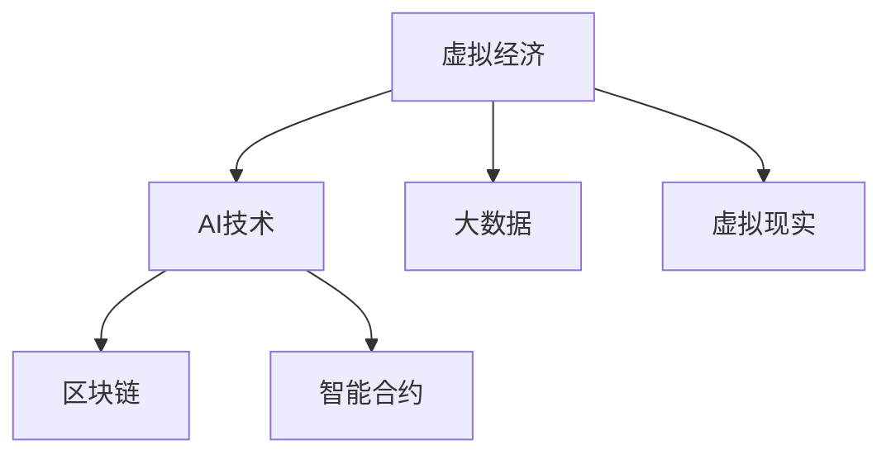

                 

## 1. 背景介绍

### 1.1 问题由来
随着技术的迅猛发展和数字化的普及，虚拟经济开始成为新兴的经济发展模式。虚拟经济是以信息网络技术为基础，以数字化、虚拟化、信息化为特征的经济形态，主要包括互联网金融、电子商务、数字货币、虚拟现实、云计算等新兴领域。这些领域普遍存在信息不对称、数据量庞大、交易复杂度高的问题，亟需先进的AI技术来进行深度分析和高效决策。

### 1.2 问题核心关键点
虚拟经济中的AI应用主要涉及以下几个关键点：
1. 数据获取与处理：虚拟经济依赖于海量数据，如交易记录、市场行情、用户行为等。AI技术可以高效地抓取、清洗和分析这些数据，提供可靠的信息支持。
2. 模型训练与优化：虚拟经济面临的问题复杂多样，单一模型难以满足需求。AI技术可以通过深度学习、强化学习等方法构建多种模型，进行精细化的分析和预测。
3. 智能决策与自动化：虚拟经济需要实时响应市场变化，做出快速、准确的市场决策。AI技术可以实现智能决策和自动化交易，提高操作效率和收益。
4. 风险管理与监控：虚拟经济存在较高的风险，如市场波动、欺诈等。AI技术可以进行风险评估和预测，建立监控机制，保障资金安全。
5. 用户体验与交互：虚拟经济的用户体验至关重要，AI技术可以实现个性化推荐、智能客服等，提升用户满意度和黏性。

### 1.3 问题研究意义
AI驱动的虚拟经济能够大幅提升市场效率、降低交易成本、优化资源配置，推动经济发展方式的转变。其研究意义主要体现在以下几个方面：
1. 提升市场预测准确性：通过构建复杂的AI模型，虚拟经济可以更准确地预测市场趋势和价格波动，为投资决策提供可靠依据。
2. 提高交易效率与自动化水平：AI技术可以实现实时交易和自动化执行，大幅缩短交易响应时间，降低人为操作的错误。
3. 增强风险管理能力：通过AI技术的分析，虚拟经济可以更有效地识别和评估风险，建立健全的风险监控机制。
4. 优化资源配置：AI技术可以分析海量数据，挖掘潜在价值，帮助虚拟经济实现更合理的资源配置和利用。
5. 改善用户体验：AI技术可以实现个性化服务和智能客服，提升用户满意度和忠诚度。

## 2. 核心概念与联系

### 2.1 核心概念概述

本节将介绍几个密切相关的核心概念：

- **虚拟经济**：以信息技术为支撑的经济形态，包括互联网金融、电子商务、数字货币、虚拟现实、云计算等。虚拟经济的特点是数字化、虚拟化、信息化，依赖于网络技术和大数据。
- **AI技术**：人工智能的缩写，包括机器学习、深度学习、自然语言处理、计算机视觉、强化学习等。AI技术可以处理复杂的数据，提供精准的分析和预测。
- **大数据**：涉及海量数据的处理、存储和管理。大数据技术可以实现数据的实时分析和高效查询，为AI模型的构建提供坚实的数据基础。
- **区块链**：一种去中心化的分布式账本技术，可以实现数据的安全传输和不可篡改性。区块链技术在虚拟经济中广泛应用，确保交易的透明和可信。
- **智能合约**：一种自动执行的合约，可以在满足特定条件时触发自动操作。智能合约可以实现虚拟经济的自动化管理，提高运营效率。
- **虚拟现实**：通过计算机生成的仿真环境，为用户提供沉浸式体验。虚拟现实技术可以应用于虚拟经济的多个领域，如数字资产交易、虚拟市场等。

这些核心概念之间的逻辑关系可以通过以下Mermaid流程图来展示：



这个流程图展示了大语言模型的核心概念及其之间的关系：

1. 虚拟经济是AI技术和大数据技术的主要应用场景。
2. AI技术通过深度学习、自然语言处理等方法，对大数据进行处理和分析，构建复杂的预测模型。
3. 区块链技术保证了虚拟经济交易的安全性和透明性。
4. 智能合约提供了虚拟经济的自动化管理能力。
5. 虚拟现实技术扩展了虚拟经济的沉浸式体验。

## 3. 核心算法原理 & 具体操作步骤
### 3.1 算法原理概述

AI驱动的虚拟经济主要通过以下步骤实现：

1. **数据收集与清洗**：从虚拟经济平台获取交易记录、市场行情、用户行为等数据，并进行预处理和清洗，确保数据质量。
2. **特征工程**：根据任务需求，提取和构建有效的特征，如价格、成交量、时间戳、用户属性等，为模型训练提供输入。
3. **模型训练**：使用机器学习、深度学习等算法，构建适合虚拟经济的预测模型，如时间序列预测、推荐系统等。
4. **模型评估与优化**：对模型进行评估，如准确率、召回率、F1分数等，并根据评估结果进行调整和优化。
5. **自动化决策与执行**：将训练好的模型部署到虚拟经济平台，进行自动化决策和交易执行，提升运营效率。
6. **风险监控与管理**：建立风险评估和监控机制，及时发现和处理异常情况，保障系统安全。
7. **用户交互与服务**：通过AI技术实现个性化推荐、智能客服等功能，提升用户体验和黏性。

### 3.2 算法步骤详解

#### 3.2.1 数据收集与清洗

数据收集是虚拟经济AI应用的基础，主要涉及以下几个步骤：

1. **数据来源**：从虚拟经济平台、交易所、第三方数据提供商等渠道获取数据，确保数据来源可靠。
2. **数据类型**：包括交易记录、市场行情、用户行为等，涵盖价格、成交量、时间戳、用户属性等多维信息。
3. **数据清洗**：对数据进行去重、填充缺失值、异常值处理等预处理，确保数据质量。

#### 3.2.2 特征工程

特征工程是模型构建的关键，主要包括以下几个步骤：

1. **特征提取**：根据任务需求，提取有意义的特征，如价格、成交量、时间戳、用户属性等。
2. **特征编码**：将提取的特征进行编码，如将价格转化为数值型数据。
3. **特征选择**：通过统计分析和模型评估，选择对任务有帮助的特征，去除冗余和无关特征。
4. **特征变换**：对特征进行归一化、标准化等变换，提高模型训练效果。

#### 3.2.3 模型训练

模型训练是AI驱动虚拟经济的核心，主要包括以下几个步骤：

1. **选择算法**：根据任务需求，选择合适的算法，如线性回归、决策树、随机森林、神经网络等。
2. **划分数据集**：将数据集划分为训练集、验证集和测试集，确保模型评估的公正性和可靠性。
3. **模型训练**：使用训练集对模型进行训练，优化模型参数，提高模型预测能力。
4. **模型评估**：在验证集上评估模型性能，如准确率、召回率、F1分数等，确保模型泛化能力。
5. **模型优化**：根据评估结果，对模型进行调整和优化，如调整超参数、引入正则化等。

#### 3.2.4 自动化决策与执行

自动化决策与执行是AI驱动虚拟经济的最终目的，主要包括以下几个步骤：

1. **模型部署**：将训练好的模型部署到虚拟经济平台，实现自动化决策和交易执行。
2. **实时计算**：对实时交易数据进行实时计算，生成决策结果。
3. **异常处理**：建立异常处理机制，及时发现和处理异常情况，确保系统稳定运行。
4. **结果输出**：将决策结果输出到虚拟经济平台，进行交易执行和记录。

#### 3.2.5 风险监控与管理

风险监控与管理是虚拟经济AI应用的重要保障，主要包括以下几个步骤：

1. **风险评估**：对虚拟经济交易进行风险评估，如市场波动、欺诈等。
2. **风险预警**：建立风险预警机制，及时发现和处理潜在风险。
3. **应急响应**：在风险发生时，启动应急响应机制，进行风险处理和系统恢复。
4. **历史数据分析**：对历史交易数据进行分析和总结，提高风险管理能力。

#### 3.2.6 用户交互与服务

用户交互与服务是虚拟经济AI应用的优化方向，主要包括以下几个步骤：

1. **个性化推荐**：基于用户行为和偏好，生成个性化推荐，提升用户体验。
2. **智能客服**：使用自然语言处理技术，实现智能客服，提升用户满意度。
3. **实时互动**：通过AI技术，实现实时互动，提升用户粘性和活跃度。
4. **用户反馈**：收集用户反馈，不断优化AI系统，提高用户体验和满意度。

### 3.3 算法优缺点

AI驱动的虚拟经济在提升市场效率、降低交易成本、优化资源配置等方面具有显著优势，但也存在以下缺点：

**优点**：
1. 数据处理能力强：AI技术可以高效处理海量数据，提供精准的分析和预测。
2. 实时决策能力：AI技术可以实现实时决策和自动化交易，提高操作效率。
3. 风险管理精确：AI技术可以实现风险评估和监控，及时发现和处理风险。
4. 用户体验提升：AI技术可以实现个性化推荐和智能客服，提升用户满意度和黏性。

**缺点**：
1. 数据依赖性强：AI技术依赖于高质量的数据，数据来源和质量问题会影响模型效果。
2. 模型复杂度高：虚拟经济面临的问题复杂多样，单一模型难以满足需求，需要构建多种模型。
3. 技术门槛高：AI技术需要较高的技术水平和专业知识，对技术人员要求较高。
4. 安全风险存在：AI技术可能存在数据泄露、模型攻击等安全风险，需加强防范。

### 3.4 算法应用领域

AI驱动的虚拟经济在多个领域具有广泛的应用，主要包括：

- **互联网金融**：使用AI技术进行风险评估、信用评分、欺诈检测等，提升金融服务质量。
- **电子商务**：使用AI技术进行商品推荐、客户分析、广告投放等，提高运营效率和收益。
- **数字货币**：使用AI技术进行交易预测、市场分析、监管合规等，保障数字货币安全。
- **虚拟现实**：使用AI技术进行场景生成、用户交互、虚拟资产管理等，扩展虚拟经济应用场景。
- **云计算**：使用AI技术进行资源优化、性能调优、安全防护等，提高云计算服务质量。

这些应用领域展示了AI技术在虚拟经济中的广泛适用性，推动了虚拟经济的快速发展。

## 4. 数学模型和公式 & 详细讲解 & 举例说明

### 4.1 数学模型构建

本节将使用数学语言对AI驱动虚拟经济的应用进行更加严格的刻画。

假设虚拟经济平台每日的交易数据为 $(x_t, y_t)$，其中 $x_t$ 为交易时间戳，$y_t$ 为交易价格。构建时间序列预测模型 $M$，用于预测未来交易价格。

定义模型 $M$ 在时间戳 $t$ 上的预测价格为 $\hat{y}_t = M(x_t)$，损失函数为 $\ell(y_t, \hat{y}_t) = (y_t - \hat{y}_t)^2$。则在数据集 $D$ 上的经验风险为：

$$
\mathcal{L}(M) = \frac{1}{N}\sum_{t=1}^N \ell(y_t, \hat{y}_t)
$$

目标是最小化经验风险，即找到最优模型：

$$
M^* = \mathop{\arg\min}_{M} \mathcal{L}(M)
$$

在实践中，我们通常使用基于梯度的优化算法（如SGD、Adam等）来近似求解上述最优化问题。设 $\eta$ 为学习率，$\lambda$ 为正则化系数，则参数的更新公式为：

$$
M \leftarrow M - \eta \nabla_{M}\mathcal{L}(M) - \eta\lambda M
$$

其中 $\nabla_{M}\mathcal{L}(M)$ 为损失函数对模型参数 $M$ 的梯度，可通过反向传播算法高效计算。

### 4.2 公式推导过程

以下我们以时间序列预测为例，推导模型训练的损失函数及其梯度的计算公式。

假设模型 $M$ 在时间戳 $t$ 上的预测价格为 $\hat{y}_t = M(x_t)$，真实价格为 $y_t$。则均方误差损失函数定义为：

$$
\ell(y_t, \hat{y}_t) = (y_t - \hat{y}_t)^2
$$

将其代入经验风险公式，得：

$$
\mathcal{L}(M) = \frac{1}{N}\sum_{t=1}^N (y_t - \hat{y}_t)^2
$$

根据链式法则，损失函数对模型参数 $M$ 的梯度为：

$$
\frac{\partial \mathcal{L}(M)}{\partial M} = \frac{1}{N}\sum_{t=1}^N 2(y_t - \hat{y}_t) \frac{\partial M(x_t)}{\partial M}
$$

其中 $\frac{\partial M(x_t)}{\partial M}$ 可进一步递归展开，利用自动微分技术完成计算。

在得到损失函数的梯度后，即可带入参数更新公式，完成模型的迭代优化。重复上述过程直至收敛，最终得到适应虚拟经济市场预测的最优模型 $M^*$。

## 5. 项目实践：代码实例和详细解释说明

### 5.1 开发环境搭建

在进行虚拟经济AI应用开发前，我们需要准备好开发环境。以下是使用Python进行PyTorch开发的环境配置流程：

1. 安装Anaconda：从官网下载并安装Anaconda，用于创建独立的Python环境。

2. 创建并激活虚拟环境：
```bash
conda create -n pytorch-env python=3.8 
conda activate pytorch-env
```

3. 安装PyTorch：根据CUDA版本，从官网获取对应的安装命令。例如：
```bash
conda install pytorch torchvision torchaudio cudatoolkit=11.1 -c pytorch -c conda-forge
```

4. 安装Transformers库：
```bash
pip install transformers
```

5. 安装各类工具包：
```bash
pip install numpy pandas scikit-learn matplotlib tqdm jupyter notebook ipython
```

完成上述步骤后，即可在`pytorch-env`环境中开始虚拟经济AI应用开发。

### 5.2 源代码详细实现

下面我们以互联网金融中的信用评分为例，给出使用Transformers库对BERT模型进行信用评分预测的PyTorch代码实现。

首先，定义信用评分预测任务的数据处理函数：

```python
from transformers import BertTokenizer
from torch.utils.data import Dataset
import torch

class CreditScoringDataset(Dataset):
    def __init__(self, texts, labels, tokenizer, max_len=128):
        self.texts = texts
        self.labels = labels
        self.tokenizer = tokenizer
        self.max_len = max_len
        
    def __len__(self):
        return len(self.texts)
    
    def __getitem__(self, item):
        text = self.texts[item]
        label = self.labels[item]
        
        encoding = self.tokenizer(text, return_tensors='pt', max_length=self.max_len, padding='max_length', truncation=True)
        input_ids = encoding['input_ids'][0]
        attention_mask = encoding['attention_mask'][0]
        
        # 对label进行编码
        encoded_label = [1 if label == '1' else 0]
        encoded_label.extend([0] * (self.max_len - len(encoded_label)))
        labels = torch.tensor(encoded_label, dtype=torch.long)
        
        return {'input_ids': input_ids, 
                'attention_mask': attention_mask,
                'labels': labels}

# 标签与id的映射
label2id = {'1': 1, '0': 0}
id2label = {v: k for k, v in label2id.items()}

# 创建dataset
tokenizer = BertTokenizer.from_pretrained('bert-base-cased')

train_dataset = CreditScoringDataset(train_texts, train_labels, tokenizer)
dev_dataset = CreditScoringDataset(dev_texts, dev_labels, tokenizer)
test_dataset = CreditScoringDataset(test_texts, test_labels, tokenizer)
```

然后，定义模型和优化器：

```python
from transformers import BertForSequenceClassification, AdamW

model = BertForSequenceClassification.from_pretrained('bert-base-cased', num_labels=2)

optimizer = AdamW(model.parameters(), lr=2e-5)
```

接着，定义训练和评估函数：

```python
from torch.utils.data import DataLoader
from tqdm import tqdm
from sklearn.metrics import classification_report

device = torch.device('cuda') if torch.cuda.is_available() else torch.device('cpu')
model.to(device)

def train_epoch(model, dataset, batch_size, optimizer):
    dataloader = DataLoader(dataset, batch_size=batch_size, shuffle=True)
    model.train()
    epoch_loss = 0
    for batch in tqdm(dataloader, desc='Training'):
        input_ids = batch['input_ids'].to(device)
        attention_mask = batch['attention_mask'].to(device)
        labels = batch['labels'].to(device)
        model.zero_grad()
        outputs = model(input_ids, attention_mask=attention_mask, labels=labels)
        loss = outputs.loss
        epoch_loss += loss.item()
        loss.backward()
        optimizer.step()
    return epoch_loss / len(dataloader)

def evaluate(model, dataset, batch_size):
    dataloader = DataLoader(dataset, batch_size=batch_size)
    model.eval()
    preds, labels = [], []
    with torch.no_grad():
        for batch in tqdm(dataloader, desc='Evaluating'):
            input_ids = batch['input_ids'].to(device)
            attention_mask = batch['attention_mask'].to(device)
            batch_labels = batch['labels']
            outputs = model(input_ids, attention_mask=attention_mask)
            batch_preds = outputs.logits.argmax(dim=2).to('cpu').tolist()
            batch_labels = batch_labels.to('cpu').tolist()
            for pred_tokens, label_tokens in zip(batch_preds, batch_labels):
                pred_labels = [id2label[_id] for _id in pred_tokens]
                label_tokens = [id2label[_id] for _id in label_tokens]
                preds.append(pred_labels[:len(label_tokens)])
                labels.append(label_tokens)
                
    print(classification_report(labels, preds))
```

最后，启动训练流程并在测试集上评估：

```python
epochs = 5
batch_size = 16

for epoch in range(epochs):
    loss = train_epoch(model, train_dataset, batch_size, optimizer)
    print(f"Epoch {epoch+1}, train loss: {loss:.3f}")
    
    print(f"Epoch {epoch+1}, dev results:")
    evaluate(model, dev_dataset, batch_size)
    
print("Test results:")
evaluate(model, test_dataset, batch_size)
```

以上就是使用PyTorch对BERT进行信用评分预测的完整代码实现。可以看到，得益于Transformers库的强大封装，我们可以用相对简洁的代码完成BERT模型的加载和微调。

### 5.3 代码解读与分析

让我们再详细解读一下关键代码的实现细节：

**CreditScoringDataset类**：
- `__init__`方法：初始化文本、标签、分词器等关键组件。
- `__len__`方法：返回数据集的样本数量。
- `__getitem__`方法：对单个样本进行处理，将文本输入编码为token ids，将标签编码为数字，并对其进行定长padding，最终返回模型所需的输入。

**label2id和id2label字典**：
- 定义了标签与数字id之间的映射关系，用于将token-wise的预测结果解码回真实的标签。

**训练和评估函数**：
- 使用PyTorch的DataLoader对数据集进行批次化加载，供模型训练和推理使用。
- 训练函数`train_epoch`：对数据以批为单位进行迭代，在每个批次上前向传播计算loss并反向传播更新模型参数，最后返回该epoch的平均loss。
- 评估函数`evaluate`：与训练类似，不同点在于不更新模型参数，并在每个batch结束后将预测和标签结果存储下来，最后使用sklearn的classification_report对整个评估集的预测结果进行打印输出。

**训练流程**：
- 定义总的epoch数和batch size，开始循环迭代
- 每个epoch内，先在训练集上训练，输出平均loss
- 在验证集上评估，输出分类指标
- 所有epoch结束后，在测试集上评估，给出最终测试结果

可以看到，PyTorch配合Transformers库使得BERT微调的代码实现变得简洁高效。开发者可以将更多精力放在数据处理、模型改进等高层逻辑上，而不必过多关注底层的实现细节。

当然，工业级的系统实现还需考虑更多因素，如模型的保存和部署、超参数的自动搜索、更灵活的任务适配层等。但核心的微调范式基本与此类似。

## 6. 实际应用场景

### 6.1 智能金融

智能金融是虚拟经济中的重要应用领域，包括互联网金融、银行、保险等。AI驱动的智能金融可以提升金融服务质量，降低运营成本，优化资源配置。

具体应用场景包括：
1. 信用评分：通过分析客户的历史交易记录和行为数据，构建信用评分模型，评估客户的信用风险，提供个性化的金融服务。
2. 风险管理：使用AI技术对金融市场进行风险评估和监控，及时发现并应对潜在风险。
3. 自动化交易：利用AI技术进行高频交易和自动化执行，提高交易效率和收益。
4. 智能客服：使用自然语言处理技术，实现智能客服，提升客户满意度。
5. 投资决策：基于市场行情和大数据，使用AI技术进行投资决策和组合优化，提高投资回报率。

### 6.2 电子商务

电子商务是虚拟经济中的另一个重要应用领域，主要包括电商平台、社交电商、移动电商等。AI驱动的电子商务可以提升用户体验，优化运营效率，增加收益。

具体应用场景包括：
1. 商品推荐：通过分析用户的历史行为和偏好，构建推荐系统，提供个性化的商品推荐，提高用户满意度和转化率。
2. 客户分析：使用AI技术对客户进行分析和分类，提供精准的营销策略和个性化服务。
3. 广告投放：基于用户行为和偏好，使用AI技术进行广告投放，提高广告的转化率和ROI。
4. 智能客服：使用自然语言处理技术，实现智能客服，提升客户满意度和忠诚度。
5. 库存管理：利用AI技术对库存进行优化和预测，提高库存周转率和运营效率。

### 6.3 数字货币

数字货币是虚拟经济中的新兴领域，主要包括比特币、以太坊等。AI驱动的数字货币可以提升交易效率，保障交易安全，优化货币政策。

具体应用场景包括：
1. 交易预测：通过分析历史交易数据，使用AI技术进行交易预测，提高交易的精准度和效率。
2. 市场分析：利用AI技术对数字货币市场进行分析和预测，提供精准的市场情报。
3. 反欺诈检测：使用AI技术进行交易异常检测和欺诈预警，保障交易安全。
4. 智能合约：使用AI技术优化智能合约的执行和监控，提高运营效率和安全性。
5. 流动性管理：基于市场需求和交易数据，使用AI技术进行流动性管理，优化货币政策。

### 6.4 未来应用展望

随着AI技术的不断进步，虚拟经济的应用场景将进一步扩展，带来更多的创新和变革。未来，虚拟经济AI驱动的领域将包括但不限于以下几个方面：

1. 智能制造：AI技术可以优化生产流程，提升制造效率和质量，降低成本。
2. 智慧城市：AI技术可以优化城市管理，提升公共服务质量，增强城市竞争力。
3. 健康医疗：AI技术可以提供精准的医疗诊断和个性化治疗方案，提升医疗服务水平。
4. 农业管理：AI技术可以优化农业生产，提高产量和质量，降低环境影响。
5. 能源管理：AI技术可以优化能源利用，提高能源效率，降低碳排放。

这些应用领域展示了AI技术在虚拟经济中的广阔前景，推动了虚拟经济的快速发展。

## 7. 工具和资源推荐

### 7.1 学习资源推荐

为了帮助开发者系统掌握AI驱动虚拟经济的应用，这里推荐一些优质的学习资源：

1. 《深度学习与自然语言处理》系列博文：由深度学习专家撰写，深入浅出地介绍了深度学习、自然语言处理的基本概念和经典模型。

2. Coursera《深度学习》课程：斯坦福大学开设的深度学习课程，内容覆盖深度学习的基本原理和实践技巧。

3. 《Python深度学习》书籍：深度学习入门书籍，介绍了Python深度学习框架的使用方法和经典案例。

4. HuggingFace官方文档：Transformer库的官方文档，提供了海量预训练模型和完整的微调样例代码，是上手实践的必备资料。

5. Arxiv预印本网站：最新的AI研究成果都在这里发布，跟踪最新前沿进展，获取最新的研究动态。

通过对这些资源的学习实践，相信你一定能够快速掌握AI驱动虚拟经济的精髓，并用于解决实际的虚拟经济问题。

### 7.2 开发工具推荐

高效的开发离不开优秀的工具支持。以下是几款用于虚拟经济AI开发常用的工具：

1. PyTorch：基于Python的开源深度学习框架，灵活动态的计算图，适合快速迭代研究。

2. TensorFlow：由Google主导开发的开源深度学习框架，生产部署方便，适合大规模工程应用。

3. Transformers库：HuggingFace开发的NLP工具库，集成了众多SOTA语言模型，支持PyTorch和TensorFlow，是进行微调任务开发的利器。

4. Weights & Biases：模型训练的实验跟踪工具，可以记录和可视化模型训练过程中的各项指标，方便对比和调优。

5. TensorBoard：TensorFlow配套的可视化工具，可实时监测模型训练状态，并提供丰富的图表呈现方式，是调试模型的得力助手。

6. Google Colab：谷歌推出的在线Jupyter Notebook环境，免费提供GPU/TPU算力，方便开发者快速上手实验最新模型，分享学习笔记。

合理利用这些工具，可以显著提升虚拟经济AI应用的开发效率，加快创新迭代的步伐。

### 7.3 相关论文推荐

虚拟经济中的AI应用源于学界的持续研究。以下是几篇奠基性的相关论文，推荐阅读：

1. 《深度学习在金融领域的应用》：深度学习在金融领域的经典综述，介绍了深度学习在信用评分、欺诈检测、市场预测等方面的应用。

2. 《电子商务中的AI技术应用》：深度学习在电子商务领域的应用，介绍了推荐系统、客户分析、智能客服等方面的应用。

3. 《数字货币中的AI技术应用》：深度学习在数字货币领域的应用，介绍了交易预测、市场分析、反欺诈检测等方面的应用。

4. 《虚拟经济中的智能制造》：深度学习在智能制造领域的应用，介绍了生产流程优化、制造效率提升、成本降低等方面的应用。

5. 《智慧城市中的AI技术应用》：深度学习在智慧城市领域的应用，介绍了城市管理优化、公共服务提升、城市竞争力增强等方面的应用。

这些论文代表了大语言模型微调技术的发展脉络。通过学习这些前沿成果，可以帮助研究者把握学科前进方向，激发更多的创新灵感。

## 8. 总结：未来发展趋势与挑战

### 8.1 总结

本文对AI驱动虚拟经济的应用进行了全面系统的介绍。首先阐述了虚拟经济和AI技术的研究背景和意义，明确了AI技术在虚拟经济中的独特价值。其次，从原理到实践，详细讲解了AI驱动虚拟经济的关键步骤和具体实现，给出了AI驱动虚拟经济开发的全过程代码实例。同时，本文还广泛探讨了AI技术在虚拟经济中的多个应用场景，展示了AI技术在虚拟经济中的广阔前景。

通过本文的系统梳理，可以看到，AI驱动的虚拟经济能够大幅提升市场效率、降低交易成本、优化资源配置，推动经济发展方式的转变。得益于AI技术的强大处理能力和复杂建模能力，虚拟经济的应用场景将进一步扩展，带来更多的创新和变革。未来，伴随AI技术的不断进步，虚拟经济的AI应用将更加广泛和深入，成为推动经济发展的重要力量。

### 8.2 未来发展趋势

展望未来，AI驱动虚拟经济的应用将呈现以下几个发展趋势：

1. 应用领域进一步扩展：AI技术将深入到更多虚拟经济领域，如智能制造、智慧城市、健康医疗等，推动这些领域的数字化转型。

2. 模型复杂度提升：随着数据量和任务复杂度的提升，AI模型将变得更加复杂和强大，实现更加精细化的分析和预测。

3. 数据依赖性降低：AI技术将逐渐从依赖标注数据向无监督学习、半监督学习等方向发展，降低对高质量标注数据的依赖。

4. 多模态融合：AI技术将融合视觉、语音、文本等多模态数据，提升虚拟经济应用的综合能力。

5. 安全性和隐私保护：随着数据量的增加，AI技术将更加注重数据安全和隐私保护，建立健全的安全机制。

6. 自动化和智能化：AI技术将实现更加自动化和智能化的应用，提升用户体验和运营效率。

### 8.3 面临的挑战

尽管AI驱动的虚拟经济已经取得了瞩目成就，但在迈向更加智能化、普适化应用的过程中，仍面临诸多挑战：

1. 数据获取困难：高质量的数据获取和标注成本较高，数据源的多样性和质量问题将制约AI技术的应用。

2. 模型泛化能力不足：虚拟经济的问题复杂多样，单一模型难以满足需求，需要构建多种模型，提高模型的泛化能力。

3. 技术复杂度高：AI技术需要较高的技术水平和专业知识，对技术人员要求较高。

4. 伦理和安全问题：AI技术可能存在数据泄露、模型攻击等安全风险，需加强防范。

5. 用户接受度低：部分用户对AI技术存在抵触情绪，需加强用户教育和普及。

### 8.4 研究展望

面对AI驱动虚拟经济所面临的挑战，未来的研究需要在以下几个方面寻求新的突破：

1. 数据增强和处理：研究高效的数据增强和处理技术，降低对高质量标注数据的依赖，提高数据的多样性和质量。

2. 多模态学习：研究多模态数据融合和协同学习技术，提升虚拟经济应用的综合能力。

3. 模型优化和泛化：研究高效模型优化和泛化技术，提高模型的泛化能力和精度。

4. 自动化和智能化：研究自动化和智能化技术，提升虚拟经济应用的自动化水平和智能化程度。

5. 安全性和隐私保护：研究数据安全和隐私保护技术，建立健全的安全机制，确保数据和模型安全。

这些研究方向的探索，必将引领AI驱动虚拟经济走向更高的台阶，为虚拟经济的发展带来新的突破。相信随着学界和产业界的共同努力，这些挑战终将一一被克服，AI驱动虚拟经济必将在构建智能经济中扮演越来越重要的角色。

## 9. 附录：常见问题与解答

**Q1：AI技术在虚拟经济中的应用是否会取代传统金融技术？**

A: AI技术可以提升金融服务的质量和效率，但不能完全取代传统金融技术。AI技术可以与传统金融技术互补，共同提升金融服务质量。

**Q2：AI技术在虚拟经济中如何确保数据安全？**

A: AI技术可以通过数据加密、匿名化、去标识化等手段保护数据安全。同时，建立健全的数据管理和安全机制，定期进行安全审计和风险评估。

**Q3：AI技术在虚拟经济中的应用有哪些限制？**

A: AI技术在虚拟经济中的应用存在数据依赖性、技术复杂度、伦理和安全问题等限制。需加强数据获取、模型优化、用户教育和安全防范等方面的工作。

**Q4：AI技术在虚拟经济中的应用前景如何？**

A: AI技术在虚拟经济中的应用前景广阔，可以提升市场效率、降低交易成本、优化资源配置。随着AI技术的不断进步，虚拟经济的应用场景将进一步扩展，带来更多的创新和变革。

**Q5：如何衡量AI驱动虚拟经济的效果？**

A: AI驱动虚拟经济的效果可以通过市场效率提升、交易成本降低、资源配置优化等指标进行衡量。同时，可以采用用户满意度、市场反馈等指标进行综合评估。

**Q6：AI技术在虚拟经济中的应用面临哪些挑战？**

A: AI技术在虚拟经济中的应用面临数据获取困难、模型泛化能力不足、技术复杂度高、伦理和安全问题等挑战。需加强数据增强、模型优化、用户教育和防范等方面的工作。

通过以上系统梳理，可以更好地理解和掌握AI驱动虚拟经济的应用，相信未来AI技术将在虚拟经济领域发挥越来越重要的作用，推动虚拟经济向智能化、普适化方向发展。

