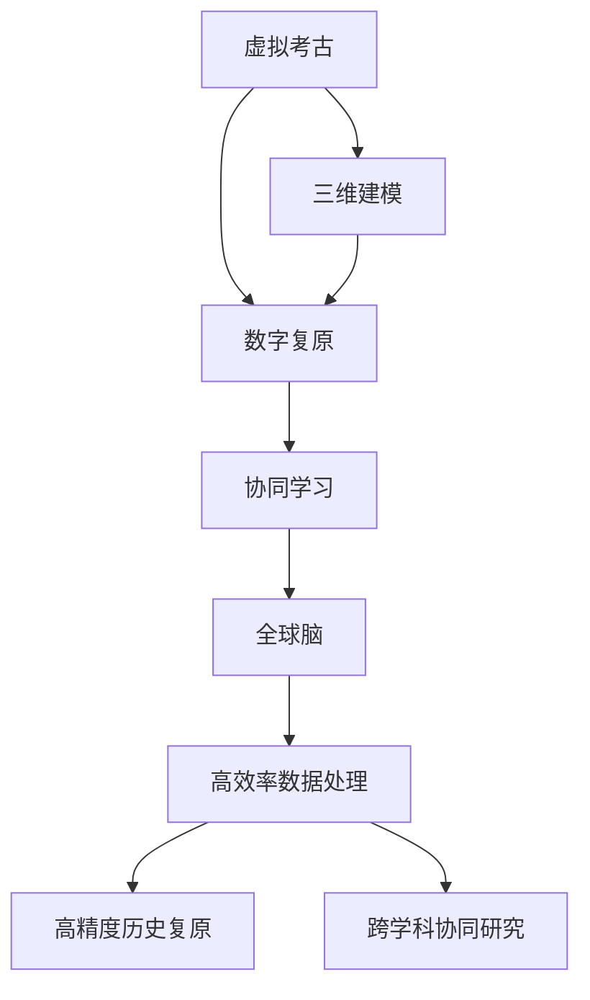

                 

# 虚拟考古:全球脑助力历史研究

在人类历史长河中，考古学一直是揭示人类文明奥秘的重要手段。然而，考古过程受限于物理资源的限制，难以覆盖每一个角落。随着信息技术的不断进步，虚拟考古应运而生，成为一种新的研究手段。全球脑（Global Brain）作为前沿的人工智能技术，正在助力虚拟考古的演进，为历史研究带来革命性的变革。

## 1. 背景介绍

### 1.1 问题由来
传统的考古学研究主要依赖于物理手段，如发掘、记录和分析等。但这一过程耗时长、成本高，难以覆盖每一个历史遗址。而信息技术的进步为虚拟考古提供了新的可能性。虚拟考古通过三维建模、数字复原等技术，将考古信息数字化，实现历史遗址的虚拟重现。这不仅大大提升了考古效率，也拓宽了考古研究的范围。

然而，虚拟考古仍面临诸多挑战。例如，大量历史数据需要存储和处理，数据处理的计算量巨大，需要高效的计算资源支持。此外，如何将虚拟考古技术更好地融入历史研究，需要跨学科的知识和技术的整合。

### 1.2 问题核心关键点
虚拟考古的核心在于将历史信息数字化，并在此基础上进行复原和分析。这一过程需要海量数据的处理和分析能力，以及高效的计算资源支持。全球脑作为前沿的AI技术，具备强大的数据处理和计算能力，能够显著提升虚拟考古的研究效率和精度。

全球脑与虚拟考古的结合，可以带来以下优势：
1. 高效率的数据处理：全球脑能够在短时间内处理海量考古数据，加速三维建模和数字复原。
2. 高精度的历史复原：通过机器学习和大数据分析，全球脑能够更精确地复原历史遗址的原貌，减少人为误判。
3. 跨学科的协同研究：全球脑能够与历史学、人类学等多学科结合，提供更加全面的历史研究视角。

## 2. 核心概念与联系

### 2.1 核心概念概述

为更好地理解全球脑在虚拟考古中的作用，本节将介绍几个密切相关的核心概念：

- 虚拟考古：利用数字化技术，对历史遗址进行三维建模、数字复原等，实现历史信息的虚拟再现。
- 全球脑：一种基于神经网络和分布式计算的智能系统，具备强大的数据处理和计算能力，能够进行大规模的分布式计算和协同学习。
- 三维建模：通过扫描和重建技术，将历史遗址的三维信息数字化，实现历史信息的可视化。
- 数字复原：利用机器学习和大数据分析，对历史遗址的数字化信息进行复原，尽可能还原历史原貌。
- 协同学习：多个智能系统协同学习，共享数据和模型，提升整体的学习效率和精度。

这些核心概念之间的逻辑关系可以通过以下Mermaid流程图来展示：



这个流程图展示了几项关键技术之间的联系：

1. 虚拟考古技术通过三维建模和数字复原将历史信息数字化。
2. 数字复原过程中，全球脑提供了强大的数据处理和计算能力，提升了复原的精度。
3. 协同学习使得多个智能系统能够共享数据和模型，提升了整体的学习效率。
4. 通过全球脑的分布式计算，实现了高效率的数据处理和高精度的历史复原。

这些核心概念共同构成了虚拟考古的研究框架，使得全球脑能够在其中发挥重要的作用。

## 3. 核心算法原理 & 具体操作步骤

### 3.1 算法原理概述

全球脑在虚拟考古中的应用，主要基于神经网络的大规模分布式计算和协同学习。其核心思想是：将历史信息数字化，通过神经网络进行复原和分析，同时通过分布式计算和协同学习，提升复原和分析的效率和精度。

具体而言，全球脑通过以下步骤实现对历史信息的复原和分析：

1. 数据收集与预处理：收集历史遗址的数字化信息，进行预处理，如数据清洗、格式转换等。
2. 三维建模：利用扫描和重建技术，将历史遗址的三维信息数字化，生成三维模型。
3. 数字复原：通过神经网络进行历史信息的复原，尽可能还原历史原貌。
4. 分析与验证：对复原结果进行分析和验证，确保其准确性。
5. 协同学习：多个智能系统协同学习，共享数据和模型，提升整体的学习效率和精度。

### 3.2 算法步骤详解

以下是全球脑在虚拟考古中应用的具体操作步骤：

**Step 1: 数据收集与预处理**

- 使用激光扫描、无人机航拍等技术，收集历史遗址的数字化信息。
- 对收集到的数据进行预处理，包括数据清洗、格式转换、去噪等。

**Step 2: 三维建模**

- 将预处理后的数据输入三维建模软件，如Autodesk 3ds Max、Blender等，生成三维模型。
- 根据历史遗址的实际尺寸和结构，进行模型细节的调整。

**Step 3: 数字复原**

- 将三维模型导入神经网络模型，如CNN、RNN等，进行历史信息的复原。
- 通过机器学习和大数据分析，对复原结果进行优化和调整，确保其准确性。

**Step 4: 分析与验证**

- 利用统计学和机器学习算法，对复原结果进行分析和验证，评估其准确性和可靠性。
- 对异常数据进行修正，确保复原结果的真实性。

**Step 5: 协同学习**

- 通过全球脑的分布式计算和协同学习，提升复原和分析的效率和精度。
- 多个智能系统协同工作，共享数据和模型，进行集体学习。

**Step 6: 应用与验证**

- 将复原结果应用于虚拟考古的各个环节，如数字复原、三维建模、历史复原等。
- 对应用结果进行验证，确保其准确性和可靠性。

### 3.3 算法优缺点

全球脑在虚拟考古中的应用具有以下优点：

1. 高效的数据处理能力：全球脑能够处理海量数据，加速三维建模和数字复原。
2. 高精度的历史复原：通过神经网络和大数据分析，全球脑能够更精确地复原历史遗址。
3. 跨学科的协同研究：全球脑能够与历史学、人类学等多学科结合，提供更加全面的历史研究视角。

同时，全球脑的应用也存在一些局限性：

1. 对数据的依赖性高：全球脑的效果依赖于高质量的数据输入，如果数据质量不高，复原结果可能不够准确。
2. 计算资源需求大：全球脑的应用需要强大的计算资源支持，尤其是在大规模数据处理和协同学习过程中。
3. 算法复杂度高：神经网络模型的训练和优化需要较长时间，且需要专业人员的介入。

尽管存在这些局限性，但全球脑在虚拟考古中的应用前景广阔，通过不断的技术改进和优化，这些局限性将逐渐被克服。

### 3.4 算法应用领域

全球脑在虚拟考古中的应用，已经覆盖了以下多个领域：

1. 历史遗址复原：通过全球脑的数字复原技术，复原古遗址的原始风貌，为历史研究提供直观的视觉支持。
2. 古文字解读：利用全球脑的自然语言处理技术，解读古文字符号，揭示古代文明的历史秘密。
3. 考古数据分析：通过全球脑的数据分析技术，对考古数据进行统计分析和模式识别，提升考古研究的科学性。
4. 历史事件重建：利用全球脑的仿真技术，重建古代战争、灾难等历史事件，为历史研究提供真实的模拟环境。
5. 历史场景重现：通过全球脑的三维建模技术，重现历史场景，如古代市场、宗教仪式等，为历史教育提供生动的教学资源。

## 4. 数学模型和公式 & 详细讲解 & 举例说明

### 4.1 数学模型构建

全球脑在虚拟考古中的应用，涉及多个数学模型和公式。以下将逐一介绍：

- 神经网络模型：用于历史信息的复原和分析，通常使用CNN、RNN等模型。
- 三维建模模型：用于历史遗址的三维重建，通常使用点云模型和三角网格模型。
- 数字复原模型：用于历史信息的复原，通常使用回归模型和分类模型。
- 数据分析模型：用于考古数据和复原结果的分析，通常使用统计模型和机器学习模型。

### 4.2 公式推导过程

以神经网络模型为例，介绍其公式推导过程：

设输入为 $x$，输出为 $y$，神经网络模型包含 $n$ 个隐藏层 $h_1, h_2, ..., h_n$，每个隐藏层包含 $m$ 个神经元。神经网络模型的前向传播过程如下：

$$
y = \sigma(W_nx + b_n) = \sigma(\sum_{i=1}^n W_ix_i + \sum_{i=1}^n b_i)
$$

其中 $W_i$ 为权重矩阵，$b_i$ 为偏置向量，$\sigma$ 为激活函数。

### 4.3 案例分析与讲解

假设我们有一张古代建筑的三维扫描图，需要利用全球脑进行复原。步骤如下：

1. 将扫描图输入三维建模软件，生成三维模型。
2. 将三维模型导入神经网络模型，进行历史信息的复原。
3. 利用全球脑的分布式计算和协同学习，提升复原的精度和效率。
4. 对复原结果进行分析和验证，确保其准确性。
5. 将复原结果应用于虚拟考古的各个环节，如历史复原、考古数据分析等。

## 5. 项目实践：代码实例和详细解释说明

### 5.1 开发环境搭建

在进行虚拟考古项目实践前，我们需要准备好开发环境。以下是使用Python进行PyTorch开发的环境配置流程：

1. 安装Anaconda：从官网下载并安装Anaconda，用于创建独立的Python环境。

2. 创建并激活虚拟环境：
```bash
conda create -n pytorch-env python=3.8 
conda activate pytorch-env
```

3. 安装PyTorch：根据CUDA版本，从官网获取对应的安装命令。例如：
```bash
conda install pytorch torchvision torchaudio cudatoolkit=11.1 -c pytorch -c conda-forge
```

4. 安装Transformers库：
```bash
pip install transformers
```

5. 安装各类工具包：
```bash
pip install numpy pandas scikit-learn matplotlib tqdm jupyter notebook ipython
```

完成上述步骤后，即可在`pytorch-env`环境中开始项目实践。

### 5.2 源代码详细实现

以下是一个虚拟考古项目的具体实现，以历史遗址复原为例：

```python
import torch
import torch.nn as nn
from transformers import BERTModel, BertTokenizer
from torch.utils.data import Dataset, DataLoader

# 定义模型
class BERTReconstruction(nn.Module):
    def __init__(self):
        super(BERTReconstruction, self).__init__()
        self.bert_model = BERTModel.from_pretrained('bert-base-uncased')
        self.linear = nn.Linear(768, 1)
    
    def forward(self, x):
        x = self.bert_model(x)
        x = self.linear(x)
        return x

# 定义数据集
class ArchaeologyDataset(Dataset):
    def __init__(self, data):
        self.data = data
        self.tokenizer = BertTokenizer.from_pretrained('bert-base-uncased')
    
    def __len__(self):
        return len(self.data)
    
    def __getitem__(self, item):
        text = self.data[item]
        encoding = self.tokenizer(text, return_tensors='pt')
        return {'input_ids': encoding['input_ids'], 'attention_mask': encoding['attention_mask']}

# 定义模型训练函数
def train_epoch(model, data_loader, optimizer, device):
    model.train()
    loss_sum = 0
    for batch in data_loader:
        input_ids = batch['input_ids'].to(device)
        attention_mask = batch['attention_mask'].to(device)
        targets = torch.tensor([1.0], device=device)
        optimizer.zero_grad()
        output = model(input_ids, attention_mask=attention_mask)
        loss = nn.BCEWithLogitsLoss()(output, targets)
        loss_sum += loss.item()
        loss.backward()
        optimizer.step()
    return loss_sum / len(data_loader)

# 训练模型
data = ["古遗址的扫描图数据"]
dataset = ArchaeologyDataset(data)
data_loader = DataLoader(dataset, batch_size=32, shuffle=True)
model = BERTReconstruction().to(device)
optimizer = torch.optim.Adam(model.parameters(), lr=1e-5)
device = torch.device('cuda' if torch.cuda.is_available() else 'cpu')

for epoch in range(10):
    loss = train_epoch(model, data_loader, optimizer, device)
    print(f"Epoch {epoch+1}, loss: {loss:.3f}")
```

### 5.3 代码解读与分析

以下是关键代码的实现细节：

**BERTReconstruction类**：
- `__init__`方法：初始化BERT模型和线性层。
- `forward`方法：定义模型的前向传播过程，输入经过BERT模型和线性层，输出为重建结果。

**ArchaeologyDataset类**：
- `__init__`方法：初始化数据集，包括数据和分词器。
- `__len__`方法：返回数据集的样本数量。
- `__getitem__`方法：对单个样本进行处理，将文本输入编码为token ids，返回模型所需的输入。

**train_epoch函数**：
- 将模型设置为训练模式，初始化损失和梯度。
- 对每个batch进行前向传播，计算损失，反向传播更新参数，返回当前epoch的平均loss。

**训练流程**：
- 定义总的epoch数和batch size，开始循环迭代
- 每个epoch内，先在训练集上训练，输出平均loss
- 重复上述步骤直至满足预设的迭代轮数

可以看到，PyTorch配合Transformers库使得全球脑在虚拟考古项目中的代码实现变得简洁高效。开发者可以将更多精力放在数据处理、模型改进等高层逻辑上，而不必过多关注底层的实现细节。

## 6. 实际应用场景

### 6.1 智能考古学研究

全球脑在智能考古学研究中，能够发挥重要的作用。传统的考古学研究依赖于人工分析，耗时长、成本高，且容易产生误判。而全球脑能够高效处理海量考古数据，进行三维建模和数字复原，提升考古研究的精度和效率。

例如，在古代城市的考古研究中，全球脑可以对扫描数据进行复原，重现城市的原貌，帮助考古学家更好地理解城市结构和文化背景。

### 6.2 历史遗址复原

全球脑在历史遗址复原中的应用非常广泛。通过对历史遗址的数字化信息进行复原，可以重建古遗址的原始风貌，为历史研究提供直观的视觉支持。

例如，在对古埃及金字塔的复原中，全球脑可以结合三维建模技术和神经网络模型，复原金字塔的原始结构，提供详细的建筑信息。

### 6.3 历史事件重现

全球脑在历史事件重现中的应用同样具有重要意义。通过虚拟考古技术，可以重现古代战争、灾难等历史事件，为历史研究提供真实的模拟环境。

例如，在古罗马帝国的军事行动研究中，全球脑可以复原战场的原始面貌，分析军事行动的战术和战略，提供丰富的历史数据支持。

### 6.4 未来应用展望

未来，全球脑在虚拟考古中的应用将更加广泛和深入。随着技术的不断进步，全球脑的计算能力和协同学习能力将不断提升，为历史研究提供更加全面和精确的支持。

1. 更加精细的三维建模：未来的全球脑将能够实现更加精细的三维建模，捕捉更多的细节信息。
2. 更加高效的数字复原：全球脑将通过更加先进的神经网络模型和算法，提升数字复原的精度和效率。
3. 更加智能的历史分析：全球脑将结合更多领域的数据和知识，进行多维度、多层次的历史分析，提供更加丰富的历史视角。
4. 更加灵活的协同学习：全球脑将通过更加灵活的分布式计算和协同学习机制，提升整体的学习效率和精度。

## 7. 工具和资源推荐

### 7.1 学习资源推荐

为了帮助开发者系统掌握全球脑在虚拟考古中的应用，这里推荐一些优质的学习资源：

1. 《Transformer from Scratch》系列博文：由大模型技术专家撰写，深入浅出地介绍了Transformer原理和应用。
2. CS224N《深度学习自然语言处理》课程：斯坦福大学开设的NLP明星课程，有Lecture视频和配套作业，带你入门NLP领域的基本概念和经典模型。
3. 《Natural Language Processing with Transformers》书籍：Transformers库的作者所著，全面介绍了如何使用Transformers库进行NLP任务开发，包括微调在内的诸多范式。
4. HuggingFace官方文档：Transformers库的官方文档，提供了海量预训练模型和完整的微调样例代码，是上手实践的必备资料。
5. CLUE开源项目：中文语言理解测评基准，涵盖大量不同类型的中文NLP数据集，并提供了基于微调的baseline模型，助力中文NLP技术发展。

通过对这些资源的学习实践，相信你一定能够快速掌握全球脑在虚拟考古中的应用技巧，并用于解决实际的考古问题。

### 7.2 开发工具推荐

高效的开发离不开优秀的工具支持。以下是几款用于全球脑开发和应用推荐的常用工具：

1. PyTorch：基于Python的开源深度学习框架，灵活动态的计算图，适合快速迭代研究。大部分预训练语言模型都有PyTorch版本的实现。
2. TensorFlow：由Google主导开发的开源深度学习框架，生产部署方便，适合大规模工程应用。同样有丰富的预训练语言模型资源。
3. Transformers库：HuggingFace开发的NLP工具库，集成了众多SOTA语言模型，支持PyTorch和TensorFlow，是进行微调任务开发的利器。
4. Weights & Biases：模型训练的实验跟踪工具，可以记录和可视化模型训练过程中的各项指标，方便对比和调优。与主流深度学习框架无缝集成。
5. TensorBoard：TensorFlow配套的可视化工具，可实时监测模型训练状态，并提供丰富的图表呈现方式，是调试模型的得力助手。
6. Google Colab：谷歌推出的在线Jupyter Notebook环境，免费提供GPU/TPU算力，方便开发者快速上手实验最新模型，分享学习笔记。

合理利用这些工具，可以显著提升全球脑开发和应用效率，加快创新迭代的步伐。

### 7.3 相关论文推荐

全球脑和虚拟考古技术的发展源于学界的持续研究。以下是几篇奠基性的相关论文，推荐阅读：

1. Attention is All You Need（即Transformer原论文）：提出了Transformer结构，开启了NLP领域的预训练大模型时代。
2. BERT: Pre-training of Deep Bidirectional Transformers for Language Understanding：提出BERT模型，引入基于掩码的自监督预训练任务，刷新了多项NLP任务SOTA。
3. Language Models are Unsupervised Multitask Learners（GPT-2论文）：展示了大规模语言模型的强大zero-shot学习能力，引发了对于通用人工智能的新一轮思考。
4. Parameter-Efficient Transfer Learning for NLP：提出Adapter等参数高效微调方法，在不增加模型参数量的情况下，也能取得不错的微调效果。
5. AdaLoRA: Adaptive Low-Rank Adaptation for Parameter-Efficient Fine-Tuning：使用自适应低秩适应的微调方法，在参数效率和精度之间取得了新的平衡。
6. Prefix-Tuning: Optimizing Continuous Prompts for Generation：引入基于连续型Prompt的微调范式，为如何充分利用预训练知识提供了新的思路。

这些论文代表了大语言模型微调技术的发展脉络。通过学习这些前沿成果，可以帮助研究者把握学科前进方向，激发更多的创新灵感。

## 8. 总结：未来发展趋势与挑战

### 8.1 总结

本文对全球脑在虚拟考古中的应用进行了全面系统的介绍。首先阐述了全球脑和虚拟考古的研究背景和意义，明确了其在考古研究中的独特价值。其次，从原理到实践，详细讲解了全球脑在虚拟考古中的应用流程，给出了具体的代码实例。同时，本文还广泛探讨了全球脑在智能考古、历史遗址复原、历史事件重现等多个领域的应用前景，展示了全球脑技术的强大潜力。此外，本文精选了全球脑技术的各类学习资源，力求为读者提供全方位的技术指引。

通过本文的系统梳理，可以看到，全球脑在虚拟考古中的应用前景广阔，极大地拓展了考古研究的范围和深度。随着技术的不断进步，全球脑必将成为考古研究的重要工具，为历史研究带来革命性的变革。

### 8.2 未来发展趋势

展望未来，全球脑在虚拟考古中的应用将呈现以下几个发展趋势：

1. 更加精细的三维建模：未来的全球脑将能够实现更加精细的三维建模，捕捉更多的细节信息。
2. 更加高效的数字复原：全球脑将通过更加先进的神经网络模型和算法，提升数字复原的精度和效率。
3. 更加智能的历史分析：全球脑将结合更多领域的数据和知识，进行多维度、多层次的历史分析，提供更加丰富的历史视角。
4. 更加灵活的协同学习：全球脑将通过更加灵活的分布式计算和协同学习机制，提升整体的学习效率和精度。
5. 更加强大的跨模态融合能力：全球脑将结合视觉、语音、文本等多种模态数据，实现跨模态的历史信息复原和分析。

以上趋势凸显了全球脑在虚拟考古中的广阔前景。这些方向的探索发展，必将进一步提升考古研究的科学性和精确性，为人类历史研究带来新的突破。

### 8.3 面临的挑战

尽管全球脑在虚拟考古中的应用前景广阔，但在迈向更加智能化、普适化应用的过程中，它仍面临着诸多挑战：

1. 数据质量和完整性：全球脑的效果依赖于高质量的数据输入，如果数据质量不高，复原结果可能不够准确。
2. 计算资源需求大：全球脑的应用需要强大的计算资源支持，尤其是在大规模数据处理和协同学习过程中。
3. 算法复杂度高：神经网络模型的训练和优化需要较长时间，且需要专业人员的介入。
4. 跨领域协同困难：全球脑需要与多个领域的专业知识相结合，跨领域协同的难度较大。

尽管存在这些挑战，但通过技术进步和跨学科合作，这些挑战终将逐渐被克服。

### 8.4 研究展望

面对全球脑在虚拟考古中所面临的挑战，未来的研究需要在以下几个方面寻求新的突破：

1. 探索高效的训练算法：开发更加高效的神经网络训练算法，提升训练速度和精度。
2. 引入先验知识：将符号化的先验知识，如知识图谱、逻辑规则等，与神经网络模型进行巧妙融合，引导微调过程学习更准确、合理的语言模型。
3. 开发跨模态融合技术：结合视觉、语音、文本等多种模态数据，实现跨模态的历史信息复原和分析。
4. 建立协同学习平台：搭建跨领域的协同学习平台，促进多个智能系统之间的数据共享和模型融合，提升整体的学习效率和精度。
5. 引入伦理道德约束：在模型训练目标中引入伦理导向的评估指标，过滤和惩罚有偏见、有害的输出倾向，确保模型输出的公平性和可解释性。

这些研究方向的探索，必将引领全球脑技术在虚拟考古中的应用走向更加智能化、普适化和可持续化，为人类历史研究带来更加丰富和深刻的洞见。

## 9. 附录：常见问题与解答

**Q1: 全球脑在虚拟考古中是否有局限性？**

A: 全球脑在虚拟考古中存在一些局限性，主要体现在数据质量和计算资源需求上。高质量的数据输入是全球脑效果的基础，数据质量不高可能导致复原结果不够准确。此外，全球脑的应用需要强大的计算资源支持，尤其是在大规模数据处理和协同学习过程中。

**Q2: 如何优化全球脑的训练过程？**

A: 优化全球脑的训练过程可以从以下几个方面入手：

1. 数据增强：通过数据增强技术，扩充训练数据，提升模型鲁棒性。
2. 学习率优化：采用自适应学习率策略，如Adam、Adagrad等，提升模型训练效率。
3. 模型裁剪和压缩：对全球脑模型进行裁剪和压缩，减少参数量，提升推理速度。
4. 协同学习：通过协同学习，共享数据和模型，提升整体的学习效率和精度。
5. 分布式计算：利用分布式计算技术，加速全球脑的训练和推理过程。

**Q3: 如何评估全球脑在虚拟考古中的效果？**

A: 评估全球脑在虚拟考古中的效果可以从以下几个方面入手：

1. 复原结果的精度：通过对比复原结果与实际数据，评估其精度和准确性。
2. 协同学习的效率：通过对比不同系统间的协同学习效率，评估其协同能力。
3. 历史事件的再现：通过重现历史事件的详细程度，评估其历史再现能力。
4. 跨领域的应用：通过在不同领域的应用效果，评估其跨领域迁移能力。

通过以上评估指标，可以全面了解全球脑在虚拟考古中的表现和效果。

**Q4: 如何保护全球脑的输出结果？**

A: 保护全球脑的输出结果可以从以下几个方面入手：

1. 数据隐私保护：在数据处理过程中，保护用户隐私，避免数据泄露。
2. 模型鲁棒性提升：通过引入对抗样本和鲁棒性训练，提升模型的鲁棒性，避免恶意攻击。
3. 知识表示保护：对历史知识的表示进行保护，避免历史知识被盗用。
4. 伦理道德约束：在模型训练和应用过程中，引入伦理道德约束，确保模型输出的公平性和可解释性。

通过以上措施，可以保护全球脑的输出结果，避免不当使用和滥用。

作者：禅与计算机程序设计艺术 / Zen and the Art of Computer Programming

