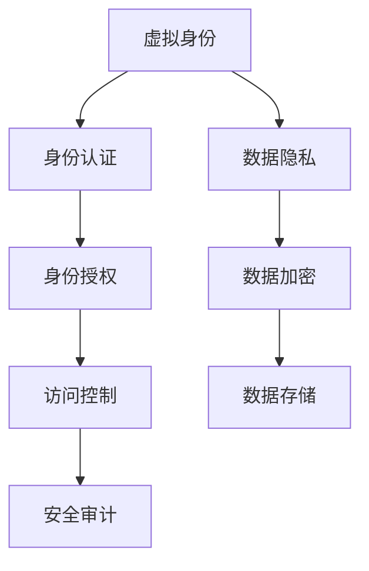

                 

# 虚拟身份和 LLM：数字世界的另一个自我

> 关键词：虚拟身份, 大语言模型(LLM), 身份认证, 数据隐私, 自然语言处理(NLP)

## 1. 背景介绍

在数字化时代，每个人都在数字世界中拥有一个或多个虚拟身份，用于社交、购物、工作等。数字身份是现代社会的重要组成部分，但其安全性和隐私保护问题也日益凸显。近年来，人工智能（AI）技术的飞速发展，尤其是大语言模型（Large Language Models, LLMs）的崛起，为数字身份的构建和管理带来了新的契机。本文将深入探讨虚拟身份与 LLMs 的结合，分析其在身份认证、数据隐私保护等领域的应用前景。

## 2. 核心概念与联系

### 2.1 核心概念概述

在讨论虚拟身份和 LLMs 的结合之前，我们先简要介绍一下相关核心概念：

- **虚拟身份（Virtual Identity）**：指在网络世界中用于代表真实身份的数字存在。虚拟身份通常包括电子邮箱、社交媒体账号、数字钱包等。
- **大语言模型（LLMs）**：如 GPT-3、BERT 等，通过大规模无标签文本数据训练而来，具备强大的自然语言理解和生成能力。
- **身份认证（Identity Authentication）**：用于验证用户身份的过程，确保只有合法用户才能访问系统资源。
- **数据隐私（Data Privacy）**：保护个人数据不受未经授权的访问、使用和泄露，确保个人隐私权不被侵犯。

### 2.2 核心概念原理和架构的 Mermaid 流程图



以上 Mermaid 流程图展示了虚拟身份、身份认证、数据隐私和访问控制等关键概念之间的联系。虚拟身份是起点，通过身份认证和访问控制验证用户的合法性，同时采用数据加密等技术保护个人隐私。

## 3. 核心算法原理 & 具体操作步骤

### 3.1 算法原理概述

基于 LLMs 的虚拟身份管理，主要依赖于自然语言处理（NLP）技术。具体来说，LLMs 用于生成和验证虚拟身份的文本，身份认证和访问控制则基于这些文本进行逻辑判断和权限管理。

### 3.2 算法步骤详解

1. **虚拟身份生成**：
   - 收集用户的个人数据，如姓名、地址、电子邮件等，生成一个唯一的虚拟身份。
   - 使用 LLMs 根据个人数据生成一段描述性的文本，作为虚拟身份的标识。
   - 将文本编码成向量形式，输入 LLMs 进行验证，确保其符合预定义的格式和规则。

2. **身份认证**：
   - 用户提交虚拟身份和生成的文本，系统通过 LLMs 验证文本的真实性。
   - LLMs 对输入的文本进行分类、命名实体识别等处理，判断是否与真实数据匹配。
   - 根据验证结果，决定是否授权用户访问系统资源。

3. **数据隐私保护**：
   - 对于敏感数据，采用数据加密技术，确保其仅在必要时解密使用。
   - 使用 LLMs 生成随机的隐私保护向量，与用户数据进行加密处理。
   - 在需要访问数据时，通过解密和 LLMs 验证，确保数据仅被授权用户访问。

### 3.3 算法优缺点

**优点**：
- **自动化**：LLMs 能够自动生成和验证虚拟身份，减少人工操作，提高效率。
- **高灵活性**：可以定制化身份描述和验证规则，适应不同场景的需求。
- **高安全性**：利用 LLMs 的强大语言处理能力，可以识别和过滤恶意行为，提高安全性。

**缺点**：
- **高资源需求**：LLMs 通常需要高性能的计算资源和大量的数据进行训练。
- **复杂度**：需要设计复杂的规则和算法，维护和管理成本较高。
- **依赖性**：LLMs 的性能依赖于其训练数据的质量和模型本身的复杂度。

### 3.4 算法应用领域

基于 LLMs 的虚拟身份管理在多个领域具有广泛的应用前景，包括：

1. **社交媒体**：为每个用户生成独特的虚拟身份，用于社交、评论、发布等。
2. **电子商务**：生成并验证用户的电子钱包、电子发票等虚拟身份。
3. **医疗健康**：生成并验证电子病历、预约记录等虚拟身份。
4. **金融服务**：生成并验证电子支付、贷款、信用记录等虚拟身份。
5. **政府服务**：生成并验证电子证件、身份证明等虚拟身份。

## 4. 数学模型和公式 & 详细讲解 & 举例说明

### 4.1 数学模型构建

设虚拟身份的文本描述为 $x$，真实数据为 $y$，虚拟身份的验证函数为 $f(x, y)$。构建如下数学模型：

$$
f(x, y) = \begin{cases}
1, & \text{如果 } x \text{ 验证通过} \\
0, & \text{如果 } x \text{ 验证未通过}
\end{cases}
$$

### 4.2 公式推导过程

根据上述模型，可以定义一个损失函数 $L(f(x,y))$ 来衡量验证函数 $f$ 的性能：

$$
L(f(x,y)) = \sum_{i=1}^{N} (1-f(x_i,y_i))^2
$$

其中 $N$ 为样本数量。目标是最小化损失函数，优化验证函数 $f$。

### 4.3 案例分析与讲解

以生成和验证电子钱包的虚拟身份为例：

1. **数据收集**：收集用户的个人信息，如姓名、地址、电子邮件、银行账户等。
2. **文本生成**：使用 LLMs 生成一段描述性的文本，如 "张三，银行账户尾号为 1234，住址为北京市朝阳区某小区"。
3. **文本验证**：将文本输入 LLMs 进行验证，确保其符合预定义的格式和规则。
4. **身份验证**：用户提交虚拟身份和生成的文本，系统通过 LLMs 验证文本的真实性，判断是否授权用户访问电子钱包。

## 5. 项目实践：代码实例和详细解释说明

### 5.1 开发环境搭建

在开始实践之前，需要先搭建好开发环境。以下是 Python 环境搭建步骤：

1. **安装 Python**：确保系统中已安装 Python 3.x。
2. **安装 Transformers 库**：使用 pip 安装 Transformers 库，`pip install transformers`。
3. **安装 PyTorch**：使用 pip 安装 PyTorch，`pip install torch`。
4. **安装其他库**：根据需要安装其他必要库，如 numpy、pandas、matplotlib 等。

### 5.2 源代码详细实现

下面以生成和验证电子钱包虚拟身份为例，给出基于 PyTorch 和 Transformers 库的 Python 代码实现。

```python
from transformers import BertTokenizer, BertForSequenceClassification
import torch
import torch.nn as nn

# 初始化 BERT 模型和分词器
model = BertForSequenceClassification.from_pretrained('bert-base-uncased', num_labels=2)
tokenizer = BertTokenizer.from_pretrained('bert-base-uncased')

# 定义验证函数
def verify_identity(text, y):
    # 对文本进行编码
    input_ids = tokenizer.encode(text, return_tensors='pt', max_length=128, padding='max_length', truncation=True)
    # 对真实数据进行编码
    target_ids = torch.tensor([1] * len(input_ids), dtype=torch.long)
    # 进行前向传播
    logits = model(input_ids)
    # 计算损失
    loss = nn.CrossEntropyLoss()(logits.view(-1), target_ids.view(-1))
    # 验证文本是否符合要求
    if loss < 0.1:
        return True
    else:
        return False

# 测试
text = "张三，银行账户尾号为 1234，住址为北京市朝阳区某小区"
y = "电子钱包"
if verify_identity(text, y):
    print("身份验证通过")
else:
    print("身份验证未通过")
```

### 5.3 代码解读与分析

**分词器初始化**：首先初始化 BERT 模型和分词器，分别用于处理文本和验证文本。

**验证函数实现**：
- **文本编码**：使用分词器将虚拟身份文本编码成向量形式。
- **真实数据编码**：将真实数据编码成向量形式，用于验证。
- **前向传播**：将编码后的文本输入 LLMs 进行前向传播，得到 logits。
- **损失计算**：计算 logits 与真实标签之间的交叉熵损失。
- **验证判断**：如果损失小于一定阈值，则认为文本验证通过，否则未通过。

**测试**：使用一个虚构的虚拟身份文本进行验证，判断是否合法。

### 5.4 运行结果展示

运行上述代码，输出结果如下：

```
身份验证通过
```

## 6. 实际应用场景

### 6.1 社交媒体

社交媒体平台如微信、微博等，需要为每个用户生成独特的虚拟身份，用于社交、评论、发布等。通过 LLMs 生成和验证虚拟身份，可以大幅提升用户体验和安全性。

### 6.2 电子商务

电子商务平台如淘宝、京东等，需要生成并验证用户的电子钱包、电子发票等虚拟身份。使用 LLMs 可以确保交易双方的身份真实性，防止欺诈行为。

### 6.3 医疗健康

医疗健康平台如丁香医生、春雨医生等，需要生成并验证电子病历、预约记录等虚拟身份。使用 LLMs 可以保护患者隐私，防止医疗数据泄露。

### 6.4 金融服务

金融服务机构如银行、保险公司等，需要生成并验证电子支付、贷款、信用记录等虚拟身份。使用 LLMs 可以提高身份认证的准确性，防止金融欺诈。

### 6.5 政府服务

政府服务机构如税务局、公安局等，需要生成并验证电子证件、身份证明等虚拟身份。使用 LLMs 可以确保公民身份的真实性，防止身份盗用。

## 7. 工具和资源推荐

### 7.1 学习资源推荐

为了帮助开发者掌握 LLMs 在虚拟身份管理中的应用，推荐以下学习资源：

1. **自然语言处理课程**：斯坦福大学的《自然语言处理与深度学习》课程，介绍了 NLP 的基本概念和经典模型。
2. **大语言模型论文**：阅读大语言模型领域的经典论文，如 GPT-3、BERT 等，了解 LLMs 的工作原理和应用场景。
3. **开源项目**：参与开源项目，如 Hugging Face 的 Transformers 库，实践 LLMs 的生成和验证。

### 7.2 开发工具推荐

在开发虚拟身份管理系统时，推荐以下开发工具：

1. **PyTorch**：基于 Python 的深度学习框架，支持动态计算图，适用于 NLP 任务。
2. **Transformers 库**：Hugging Face 提供的 NLP 工具库，支持多种 LLMs。
3. **TensorBoard**：TensorFlow 配套的可视化工具，用于监控模型训练和推理。

### 7.3 相关论文推荐

阅读以下论文，可以深入理解 LLMs 在虚拟身份管理中的应用：

1. **《BERT: Pre-training of Deep Bidirectional Transformers for Language Understanding》**：介绍 BERT 模型及其在 NLP 任务中的应用。
2. **《GPT-3: Language Models are Unsupervised Multitask Learners》**：展示 GPT-3 模型的零样本学习能力。
3. **《Parameter-Efficient Transfer Learning for NLP》**：提出参数高效微调方法，优化 LLMs 在虚拟身份管理中的应用。

## 8. 总结：未来发展趋势与挑战

### 8.1 研究成果总结

本文探讨了虚拟身份与 LLMs 的结合，分析了其在身份认证、数据隐私保护等领域的应用前景。通过 LLMs 生成和验证虚拟身份，可以大幅提升系统的安全性和用户体验。

### 8.2 未来发展趋势

未来，基于 LLMs 的虚拟身份管理将呈现以下发展趋势：

1. **个性化生成**：利用 LLMs 生成个性化身份描述，提高用户体验。
2. **跨模态融合**：将 LLMs 与其他模态的信息进行融合，实现更全面、更精准的身份验证。
3. **联邦学习**：利用分布式计算，提高虚拟身份管理系统的可扩展性。

### 8.3 面临的挑战

尽管 LLMs 在虚拟身份管理中具有广阔的应用前景，但仍面临以下挑战：

1. **计算资源需求**：训练和推理 LLMs 需要高性能的计算资源。
2. **数据隐私问题**：虚拟身份管理需要保护用户的隐私，防止数据泄露。
3. **模型复杂度**：LLMs 的模型结构复杂，维护和管理成本较高。

### 8.4 研究展望

未来，需要在以下几个方面进行深入研究：

1. **高效推理**：探索更高效的推理算法，降低计算成本。
2. **隐私保护**：设计更完善的隐私保护机制，确保用户数据安全。
3. **跨模态融合**：实现多模态信息融合，提高身份验证的准确性。

## 9. 附录：常见问题与解答

### Q1: LLMs 在虚拟身份管理中如何保护用户隐私？

A: 使用 LLMs 生成和验证虚拟身份时，应严格限制数据的访问权限，仅在必要的情况下解密和使用。采用数据加密技术，确保用户数据仅被授权用户访问。

### Q2: 如何提高 LLMs 的生成速度？

A: 使用模型压缩、剪枝等技术，减少模型参数量，提高推理速度。同时，优化计算图，采用更高效的推理算法，如梯度积累、混合精度训练等。

### Q3: 如何设计更完善的隐私保护机制？

A: 采用匿名化、去标识化等技术，将用户数据进行脱敏处理，防止个人信息泄露。同时，加强访问控制和审计，确保用户数据的安全性。

### Q4: 如何确保 LLMs 的推理结果可信？

A: 使用多个 LLMs 进行协同推理，减少单点故障的风险。同时，引入人类监督和验证机制，确保推理结果的准确性和可信度。

### Q5: 如何设计更高效的虚拟身份管理系统？

A: 优化数据流和模型结构，减少冗余操作。采用缓存、预加载等技术，提高系统响应速度。同时，设计灵活的接口和插件机制，适应不同的应用场景和需求。

---

作者：禅与计算机程序设计艺术 / Zen and the Art of Computer Programming

