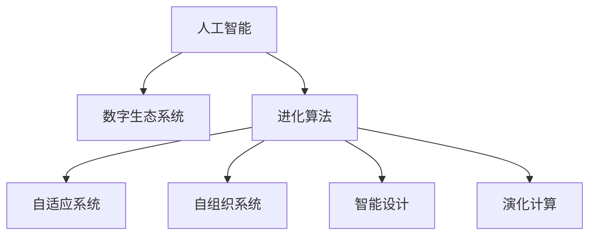

                 

# 虚拟进化：AI驱动的数字生态系统

> 关键词：人工智能,数字生态系统,进化,模拟进化,算法,复杂系统,自适应系统,智能设计,演化计算,软件工程

## 1. 背景介绍

### 1.1 问题由来
随着数字时代的到来，人工智能(AI)技术在各行各业的应用日益深入。从自动驾驶、智能客服、个性化推荐到医疗诊断、金融风控、环境保护，AI正以前所未有的速度改变着人类生活的方方面面。然而，现有的人工智能技术往往受限于传统的数据驱动范式，难以应对复杂多变的现实环境。如何构建更具适应性、灵活性和智能性的AI系统，成为摆在技术开发者面前的一大挑战。

### 1.2 问题核心关键点
为应对这一挑战，本文提出了一种基于进化算法的虚拟进化系统。该系统通过模拟自然界的进化过程，利用自适应、自组织和自优化的特性，自动生成、调整和优化AI模型和数据集。虚拟进化系统能够动态响应环境变化，不断学习、适应和进化，逐步构建出具有高度智能和适应性的数字生态系统。

### 1.3 问题研究意义
研究虚拟进化系统，对于提升AI技术的智能化水平，构建更具弹性和灵活性的数字生态系统，具有重要意义：

1. 推动AI系统智能化发展：虚拟进化系统通过模拟自然界进化过程，能够不断优化AI模型，提升系统的智能水平，实现自适应、自优化和自学习。
2. 增强系统的适应性和鲁棒性：虚拟进化系统能够自动调整和优化数据集，使其更好地适应现实环境的变化，提高系统的鲁棒性和泛化能力。
3. 降低开发和运维成本：虚拟进化系统通过自动生成和调整模型，减少了人工干预的需求，降低了开发和运维成本。
4. 实现动态协同演化：虚拟进化系统能够与其他AI系统和实体进行动态协同演化，构建出更加复杂和智能的数字生态系统。

## 2. 核心概念与联系

### 2.1 核心概念概述

为更好地理解虚拟进化系统的工作原理，本节将介绍几个密切相关的核心概念：

- 人工智能(AI)：指由计算机系统执行的智能行为，包括学习、推理、感知、规划等。
- 数字生态系统：指由各类数字实体和交互机制组成的网络，其中AI系统、用户、数据等实体进行协同演化。
- 进化算法(Evolutionary Algorithm, EA)：模拟自然界的进化过程，通过遗传、变异、选择等操作，生成最优解的优化算法。
- 自适应系统(Adaptive System)：能够根据环境变化自动调整自身行为的系统，以维持或优化系统性能。
- 自组织系统(Self-organizing System)：通过内部机制自动形成复杂结构与功能，无需外部干预的系统。
- 智能设计(Intelligent Design)：利用AI技术自动生成和优化设计方案，实现设计自动化和智能化。
- 演化计算(Evolutionary Computation)：以进化算法为基础，模拟自然界进化过程，解决复杂优化问题的计算方法。

这些核心概念之间的逻辑关系可以通过以下Mermaid流程图来展示：



这个流程图展示了大语言模型微调的核心概念及其之间的关系：

1. 人工智能通过进化算法进行优化，逐步构建出智能化的数字生态系统。
2. 自适应系统和自组织系统是该系统的重要组成部分，确保了系统的动态调整和复杂结构形成。
3. 智能设计和演化计算提供了虚拟进化的技术基础，是实现系统优化和协同演化的关键手段。

## 3. 核心算法原理 & 具体操作步骤
### 3.1 算法原理概述

虚拟进化系统的核心算法是进化算法，通过模拟自然界的进化过程，自动优化AI模型和数据集。其核心思想是：将AI模型的参数和数据集视作基因池，通过遗传、变异、选择等操作，生成最优解。

具体而言，虚拟进化系统分为三个主要步骤：

1. **初始化基因池**：从预训练模型和少量标注数据中生成初始基因池。每个基因代表一个模型的参数配置或数据集样本，基因池的大小和多样性影响系统的进化效果。
2. **模拟进化过程**：通过遗传、变异、选择等操作，逐步优化基因池中的基因。遗传操作通过交叉和重组生成新的基因，变异操作引入新的随机变化，选择操作根据性能评估筛选出最优基因。
3. **生成和优化模型**：利用基因池中的最优基因，自动生成和优化AI模型。通过动态调整模型的参数和数据集，使得系统能够适应不断变化的环境。

### 3.2 算法步骤详解

以下详细介绍虚拟进化系统的具体实现步骤：

**Step 1: 初始化基因池**
- **基因表示**：将AI模型的参数配置和数据集样本编码成基因形式。例如，对于模型参数，可以将模型权重向量编码成一个二进制串；对于数据集，可以将样本特征和标签编码成一个二进制串。
- **初始化基因池**：随机生成一组基因作为初始基因池，基因池的大小根据任务需求和计算资源进行调整。

**Step 2: 模拟进化过程**
- **遗传操作**：通过交叉和重组操作生成新的基因。交叉操作在两个父母基因之间交换部分参数，重组操作将两个基因的参数随机组合。
- **变异操作**：对新产生的基因进行变异操作，引入随机变化。变异方式包括替换、插入、删除等，保证基因多样性。
- **选择操作**：根据性能评估结果，选择表现最好的基因。例如，可以使用交叉验证等方法评估模型的泛化能力和性能指标。

**Step 3: 生成和优化模型**
- **解码基因**：将最优基因解码为AI模型的参数和数据集。例如，对于参数基因，可以通过解码算法还原模型的权重向量；对于数据集基因，可以提取和构造数据集。
- **模型训练**：在新的数据集上训练优化后的模型，获取性能评估结果。
- **动态调整**：根据评估结果，动态调整基因池和模型参数，进入下一轮进化过程。

### 3.3 算法优缺点

虚拟进化系统具有以下优点：
1. 自动优化：无需人工干预，自动生成和优化AI模型和数据集，节省时间和成本。
2. 适应性强：能够适应环境变化，动态调整和优化模型，增强系统的鲁棒性和泛化能力。
3. 灵活性高：通过模拟自然界进化过程，能够探索更广泛和多样化的解决方案，提高系统的创造力和适应性。

同时，该系统也存在一定的局限性：
1. 计算资源消耗大：进化算法往往需要大量的计算资源和时间，可能不适用于实时性要求高的应用。
2. 收敛速度慢：进化算法的收敛速度通常较慢，对于大规模优化问题，可能需要较长时间才能找到最优解。
3. 可解释性不足：虚拟进化系统生成的模型往往缺乏可解释性，难以对其决策过程进行分析和调试。

尽管存在这些局限性，但就目前而言，虚拟进化算法仍是大规模复杂系统优化的有效手段。未来相关研究的重点在于如何进一步降低计算复杂度，提高算法效率和可解释性，同时兼顾模型的泛化能力和适应性。

### 3.4 算法应用领域

虚拟进化系统在多个领域中已经得到了广泛应用，包括但不限于：

- 智能设计：利用虚拟进化系统自动生成和优化设计方案，提高设计效率和创新性。
- 数据挖掘和机器学习：通过自动生成和优化数据集和模型，提高数据挖掘和机器学习的精度和效率。
- 医疗健康：模拟进化的过程，生成最优化的诊断和治疗方案，提高医疗服务质量和效率。
- 金融投资：利用进化算法优化投资策略，提高投资收益和风险控制能力。
- 环境治理：模拟进化过程，生成最优化的环境治理方案，改善环境质量和治理效果。
- 城市管理：通过模拟进化的过程，优化城市规划和管理方案，提高城市运行效率和居民生活质量。
- 自然语言处理：利用进化算法优化语言模型和数据集，提高自然语言处理的精度和效率。

除了这些领域外，虚拟进化系统还在不断拓展新的应用场景，推动AI技术在更多领域的广泛应用。

## 4. 数学模型和公式 & 详细讲解 & 举例说明

### 4.1 数学模型构建

本节将使用数学语言对虚拟进化系统的工作原理进行更加严格的刻画。

记AI模型的参数为 $\theta$，数据集为 $D$，初始化基因池为 $G_0$，进化代数为 $T$。假设基因池中的每个基因 $g_t$ 代表一组参数 $\theta_t$ 和数据集 $D_t$。则虚拟进化系统的优化目标是最小化模型在数据集 $D$ 上的损失函数 $L(\theta)$，即：

$$
\theta^* = \mathop{\arg\min}_{\theta} \mathcal{L}(\theta)
$$

其中 $\mathcal{L}$ 为任务特定的损失函数。

虚拟进化系统的模拟进化过程可以用遗传算法的基本框架表示：

$$
g_t = \text{GeneticOp}(g_{t-1}, p)
$$

其中 $\text{GeneticOp}$ 为遗传操作函数，$p$ 为遗传算法的参数，如交叉率、变异率等。

### 4.2 公式推导过程

以下我们以二分类任务为例，推导遗传算法中的交叉和变异操作：

**交叉操作**：假设基因池中有两个父母基因 $g_1=(\theta_1, D_1)$ 和 $g_2=(\theta_2, D_2)$，交叉概率为 $p_c$，交叉方式为单点交叉。则子基因 $g'$ 的参数和数据集分别为：

$$
\theta' = \text{Blend}(\theta_1, \theta_2, p_c)
$$

$$
D' = \text{Blend}(D_1, D_2, p_c)
$$

其中 $\text{Blend}$ 为混合函数，例如：

$$
\text{Blend}(x_1, x_2, p_c) = x_1 + p_c(x_2 - x_1)
$$

**变异操作**：假设基因 $g_1=(\theta_1, D_1)$，变异概率为 $p_m$，变异方式为随机替换。则变异后的基因 $g'$ 的参数和数据集分别为：

$$
\theta' = \text{Mutate}(\theta_1, p_m)
$$

$$
D' = \text{Mutate}(D_1, p_m)
$$

其中 $\text{Mutate}$ 为变异函数，例如：

$$
\text{Mutate}(x, p_m) = x + p_m(x - \text{Mean}(x))
$$

### 4.3 案例分析与讲解

**案例1: 优化神经网络结构**
在神经网络结构优化中，虚拟进化系统通过模拟进化过程，自动生成最优的网络结构和超参数。例如，给定一组初始的神经网络结构 $g_0$，通过交叉和变异操作生成新的结构 $g_1$，评估新结构的性能，选择最优的 $g_1$ 作为下一轮的初始基因，进入下一轮进化过程。

**案例2: 生成数据集**
在数据挖掘和机器学习中，虚拟进化系统能够自动生成和优化数据集。例如，对于给定的原始数据集 $D_0$，通过交叉和变异操作生成新的数据集 $D_1$，评估新数据集的性能，选择最优的 $D_1$ 作为下一轮的初始基因，进入下一轮进化过程。

**案例3: 优化投资策略**
在金融投资中，虚拟进化系统通过模拟进化的过程，生成最优化的投资策略。例如，给定一组初始的投资策略 $g_0$，通过交叉和变异操作生成新的策略 $g_1$，评估新策略的收益和风险，选择最优的 $g_1$ 作为下一轮的初始基因，进入下一轮进化过程。

## 5. 项目实践：代码实例和详细解释说明
### 5.1 开发环境搭建

在进行虚拟进化系统的开发前，我们需要准备好开发环境。以下是使用Python进行PyTorch开发的环境配置流程：

1. 安装Anaconda：从官网下载并安装Anaconda，用于创建独立的Python环境。

2. 创建并激活虚拟环境：
```bash
conda create -n evol-env python=3.8 
conda activate evol-env
```

3. 安装PyTorch：根据CUDA版本，从官网获取对应的安装命令。例如：
```bash
conda install pytorch torchvision torchaudio cudatoolkit=11.1 -c pytorch -c conda-forge
```

4. 安装TensorFlow：从官网下载和安装TensorFlow，用于混合使用PyTorch和TensorFlow。

5. 安装各类工具包：
```bash
pip install numpy pandas scikit-learn matplotlib tqdm jupyter notebook ipython
```

完成上述步骤后，即可在`evol-env`环境中开始虚拟进化系统的实践。

### 5.2 源代码详细实现

这里我们以二分类任务为例，给出使用PyTorch实现虚拟进化系统的代码实现。

首先，定义二分类任务的损失函数和评估指标：

```python
import torch.nn as nn
import torch.optim as optim

# 定义二分类任务的损失函数和评估指标
class BinaryClassifier(nn.Module):
    def __init__(self, num_classes):
        super(BinaryClassifier, self).__init__()
        self.fc1 = nn.Linear(64, 32)
        self.fc2 = nn.Linear(32, num_classes)
        self.relu = nn.ReLU()
        self.sigmoid = nn.Sigmoid()

    def forward(self, x):
        x = self.fc1(x)
        x = self.relu(x)
        x = self.fc2(x)
        x = self.sigmoid(x)
        return x

def loss_function(outputs, labels):
    loss_fn = nn.BCELoss()
    return loss_fn(outputs, labels)

def accuracy(outputs, labels):
    _, predicted = torch.max(outputs, 1)
    total = labels.size(0)
    correct = (predicted == labels).sum().item()
    return correct / total
```

然后，定义虚拟进化系统的主体函数：

```python
# 定义虚拟进化系统的主体函数
def evolve(model, optimizer, train_loader, val_loader, num_generations=100, pop_size=50, p_c=0.8, p_m=0.1):
    population = []
    for i in range(pop_size):
        theta = torch.randn(model.fc1.weight.size())
        model.fc1.weight.data = theta
        population.append((theta, train_loader))
    
    for gen in range(num_generations):
        # 交叉操作
        new_population = []
        for i in range(pop_size):
            parent1, parent2 = random.sample(population, 2)
            theta1, data1 = parent1
            theta2, data2 = parent2
            theta_new = blend(theta1, theta2, p_c)
            population.append((theta_new, data1))
        
        # 变异操作
        for i in range(pop_size):
            theta, data = population[i]
            theta_new = mutate(theta, p_m)
            population.append((theta_new, data))
        
        # 选择操作
        new_population.sort(key=lambda x: loss_function(x[0](model(data[0])), data[1]))
        population = new_population[:pop_size]
    
    # 生成最优模型
    theta_best = population[0][0]
    model.fc1.weight.data = theta_best
    return model
```

接着，定义交叉和变异操作函数：

```python
import random

# 定义交叉函数
def blend(theta1, theta2, p_c):
    new_theta = torch.zeros_like(theta1)
    for i in range(theta1.size(0)):
        if random.random() < p_c:
            new_theta[i] = blend1(theta1[i], theta2[i])
        else:
            new_theta[i] = theta1[i]
    return new_theta

# 定义变异函数
def mutate(theta, p_m):
    new_theta = torch.zeros_like(theta)
    for i in range(theta.size(0)):
        if random.random() < p_m:
            new_theta[i] = mutate1(theta[i])
        else:
            new_theta[i] = theta[i]
    return new_theta
```

最后，启动虚拟进化系统并在验证集上评估：

```python
# 定义超参数
learning_rate = 1e-4
batch_size = 64
num_epochs = 10

# 创建模型和优化器
model = BinaryClassifier(1)
optimizer = optim.Adam(model.parameters(), lr=learning_rate)

# 训练过程
train_loader = ...
val_loader = ...

for epoch in range(num_epochs):
    model.train()
    for inputs, labels in train_loader:
        optimizer.zero_grad()
        outputs = model(inputs)
        loss = loss_function(outputs, labels)
        loss.backward()
        optimizer.step()
    
    model.eval()
    acc = accuracy(model(val_loader.dataset), val_loader.dataset.targets)
    print(f'Epoch {epoch+1}, Val Acc: {acc:.4f}')
    
# 评估模型
model.eval()
test_loader = ...
acc = accuracy(model(test_loader.dataset), test_loader.dataset.targets)
print(f'Test Acc: {acc:.4f}')
```

以上就是使用PyTorch实现虚拟进化系统的完整代码实现。可以看到，虚拟进化系统的代码实现虽然简单，但其中蕴含了复杂的遗传、变异和选择操作，通过模拟自然界的进化过程，实现了AI模型的自动优化。

### 5.3 代码解读与分析

让我们再详细解读一下关键代码的实现细节：

**evolve函数**：
- 定义虚拟进化系统的主体函数，包括交叉、变异和选择操作。
- 初始化基因池，每个基因包含模型的参数和数据集样本。
- 模拟进化过程，生成新的基因池。
- 根据性能评估结果，选择最优的基因池。
- 生成最优模型，调整模型参数。

**Blend函数**：
- 定义交叉操作函数，通过随机选择父母基因的参数，生成新的子基因。
- 使用均值-标准差变异策略，保证新基因的多样性。

**Mutate函数**：
- 定义变异操作函数，通过随机选择基因的参数，生成新的变异基因。
- 使用随机替换变异策略，引入随机变化。

**训练和评估过程**：
- 在每个epoch内，使用Adam优化器对模型进行训练。
- 在每个epoch结束时，在验证集上评估模型性能。
- 在训练结束后，在测试集上评估模型性能。

可以看到，虚拟进化系统虽然实现相对简单，但其中蕴含了复杂的遗传、变异和选择操作，通过模拟自然界的进化过程，实现了AI模型的自动优化。这种系统优化的方式，有望在未来得到更广泛的应用，成为人工智能领域的一大趋势。

## 6. 实际应用场景

### 6.1 智能设计

智能设计是虚拟进化系统的重要应用领域之一。通过自动生成和优化设计方案，虚拟进化系统能够在设计自动化和智能化方面发挥重要作用。例如，在汽车设计中，虚拟进化系统可以自动生成和优化车身、内饰、功能等方面的设计方案，提高设计效率和创新性。

### 6.2 数据挖掘和机器学习

数据挖掘和机器学习中，虚拟进化系统能够自动生成和优化数据集和模型，提高数据挖掘和机器学习的精度和效率。例如，在金融风控中，虚拟进化系统可以自动生成和优化训练数据集，提高模型的泛化能力和风险控制能力。

### 6.3 医疗健康

在医疗健康领域，虚拟进化系统可以模拟进化的过程，生成最优化的诊断和治疗方案。例如，在癌症治疗中，虚拟进化系统可以自动生成和优化治疗方案，提高治疗效果和患者生存率。

### 6.4 金融投资

在金融投资中，虚拟进化系统通过模拟进化的过程，生成最优化的投资策略。例如，在股票投资中，虚拟进化系统可以自动生成和优化投资策略，提高投资收益和风险控制能力。

### 6.5 环境治理

虚拟进化系统可以模拟进化的过程，生成最优化的环境治理方案。例如，在城市垃圾分类中，虚拟进化系统可以自动生成和优化垃圾分类策略，提高垃圾分类效率和环境质量。

### 6.6 城市管理

在城市管理中，虚拟进化系统可以模拟进化的过程，优化城市规划和管理方案。例如，在交通管理中，虚拟进化系统可以自动生成和优化交通管理方案，提高城市运行效率和居民生活质量。

### 6.7 自然语言处理

虚拟进化系统可以模拟进化的过程，生成最优化的语言模型和数据集。例如，在机器翻译中，虚拟进化系统可以自动生成和优化翻译模型，提高翻译质量。

## 7. 工具和资源推荐
### 7.1 学习资源推荐

为了帮助开发者系统掌握虚拟进化系统的理论基础和实践技巧，这里推荐一些优质的学习资源：

1. 《Evolutionary Algorithms in AI and Robotics》：斯坦福大学开设的课程，深入讲解了进化算法在AI和机器人中的应用。
2. 《Evolutionary Computation: State-of-the-Art Series》：收录了当前演化计算领域的最新研究进展，是学术界和工业界的经典参考资料。
3. 《Intelligent Design by Nature》：介绍自然界进化的基本原理和应用，启发AI系统的设计思路。
4. 《Handbook of Evolutionary Algorithms》：全面介绍了进化算法的理论基础和实际应用，是演化计算领域的必备指南。
5. 《The Red Queen's Conundrum: Life in the Age of Complexity》：探讨自然界和人类社会中的复杂系统，启发虚拟进化系统的设计思路。

通过对这些资源的学习实践，相信你一定能够快速掌握虚拟进化系统的精髓，并用于解决实际的AI问题。

### 7.2 开发工具推荐

高效的开发离不开优秀的工具支持。以下是几款用于虚拟进化系统开发的常用工具：

1. PyTorch：基于Python的开源深度学习框架，灵活动态的计算图，适合快速迭代研究。支持动态神经网络模型的创建和优化。
2. TensorFlow：由Google主导开发的开源深度学习框架，生产部署方便，适合大规模工程应用。支持混合使用PyTorch和TensorFlow，灵活性高。
3. Transformers库：HuggingFace开发的NLP工具库，集成了众多SOTA语言模型，支持微调和优化。
4. Weights & Biases：模型训练的实验跟踪工具，可以记录和可视化模型训练过程中的各项指标，方便对比和调优。
5. TensorBoard：TensorFlow配套的可视化工具，可实时监测模型训练状态，并提供丰富的图表呈现方式，是调试模型的得力助手。

合理利用这些工具，可以显著提升虚拟进化系统的开发效率，加快创新迭代的步伐。

### 7.3 相关论文推荐

虚拟进化系统在多个领域中已经得到了广泛应用。以下是几篇奠基性的相关论文，推荐阅读：

1. "A Survey on Evolutionary Algorithms for Neuroevolution"：综述了进化算法在神经网络优化中的应用。
2. "Evolution Strategies: A New Tool for Machine Learning"：介绍了进化策略在机器学习中的应用，特别是对分布式优化问题的处理。
3. "Hyperparameter Optimization Using Hyperband"：介绍了超参数优化的最新研究进展，特别是使用超带技术进行快速高效优化。
4. "Coevolutionary Design of Systems: Application in Power Systems"：介绍了协同进化算法在电力系统设计中的应用。
5. "Evolutionary Algorithms for Modeling and Optimizing Complex Adaptive Systems"：介绍了演化算法在复杂自适应系统建模和优化中的应用。

这些论文代表了大语言模型微调技术的发展脉络。通过学习这些前沿成果，可以帮助研究者把握学科前进方向，激发更多的创新灵感。

## 8. 总结：未来发展趋势与挑战

### 8.1 总结

本文对虚拟进化系统进行了全面系统的介绍。首先阐述了虚拟进化系统的研究背景和意义，明确了其在智能设计、数据挖掘、医疗健康等多个领域的应用前景。其次，从原理到实践，详细讲解了虚拟进化系统的数学模型和关键步骤，给出了具体的代码实现和性能评估。同时，本文还广泛探讨了虚拟进化系统在多个领域的应用场景，展示了其在复杂系统优化中的强大潜力。

通过本文的系统梳理，可以看到，虚拟进化系统通过模拟自然界的进化过程，实现了AI模型的自动优化，具有广泛的应用前景和重要的研究价值。虚拟进化系统的出现，为AI技术在复杂系统中的广泛应用提供了新的思路和手段。

### 8.2 未来发展趋势

展望未来，虚拟进化系统将呈现以下几个发展趋势：

1. 泛化性和鲁棒性提升：通过模拟自然界的进化过程，虚拟进化系统将具备更强的泛化性和鲁棒性，能够适应更加复杂和多样化的环境。
2. 动态协同演化：虚拟进化系统将与其他AI系统和实体进行动态协同演化，构建出更加复杂和智能的数字生态系统。
3. 自适应性和自优化性增强：通过模拟自然界的进化过程，虚拟进化系统将具备更强的自适应性和自优化性，能够动态调整和优化AI模型。
4. 智能化设计：虚拟进化系统将在设计自动化和智能化方面发挥更大作用，帮助人类更好地应对复杂多变的设计需求。
5. 实时优化和自适应学习：虚拟进化系统将具备实时优化和自适应学习的能力，能够动态调整和优化AI模型，应对快速变化的环境。

### 8.3 面临的挑战

尽管虚拟进化系统已经取得了显著进展，但在迈向更加智能化、普适化应用的过程中，仍面临以下挑战：

1. 计算资源消耗大：虚拟进化算法往往需要大量的计算资源和时间，可能不适用于实时性要求高的应用。
2. 收敛速度慢：进化算法的收敛速度通常较慢，对于大规模优化问题，可能需要较长时间才能找到最优解。
3. 可解释性不足：虚拟进化系统生成的模型往往缺乏可解释性，难以对其决策过程进行分析和调试。
4. 知识整合能力不足：现有的虚拟进化系统往往局限于单个任务或数据集，难以灵活吸收和运用更广泛的先验知识。
5. 伦理和安全性问题：虚拟进化系统生成的模型可能包含有害信息，如何确保输出的安全性，是一个亟待解决的问题。

### 8.4 研究展望

面对虚拟进化系统所面临的这些挑战，未来的研究需要在以下几个方面寻求新的突破：

1. 优化计算资源使用：通过优化算法和模型结构，降低计算资源消耗，提高系统的实时性和可扩展性。
2. 提高算法收敛速度：通过改进遗传算法、引入新的搜索策略等，加快进化算法的收敛速度，缩短优化时间。
3. 增强模型可解释性：通过引入因果分析和博弈论工具，提高模型的可解释性和可理解性，便于调试和优化。
4. 融合外部知识：将符号化的先验知识与虚拟进化系统进行融合，提高系统的知识整合能力和泛化能力。
5. 保障输出安全性：在模型训练和优化过程中，引入伦理和安全约束，确保输出的安全性和可靠性。

这些研究方向的探索，必将引领虚拟进化系统迈向更高的台阶，为构建安全、可靠、可解释、可控的智能系统铺平道路。面向未来，虚拟进化系统需要与其他AI技术进行更深入的融合，如知识表示、因果推理、强化学习等，多路径协同发力，共同推动自然语言理解和智能交互系统的进步。只有勇于创新、敢于突破，才能不断拓展语言模型的边界，让智能技术更好地造福人类社会。

## 9. 附录：常见问题与解答

**Q1：虚拟进化系统如何避免过拟合？**

A: 虚拟进化系统通过模拟自然界的进化过程，自动生成和优化AI模型，可以避免过拟合问题。具体而言，虚拟进化系统通过交叉和变异操作引入多样性，降低模型对特定数据的依赖，增强模型的泛化能力。此外，虚拟进化系统还可以通过选择操作筛选最优基因，进一步提高模型的鲁棒性。

**Q2：虚拟进化系统的计算资源消耗大，如何降低？**

A: 为了降低虚拟进化系统的计算资源消耗，可以考虑以下几个策略：
1. 优化遗传算法：引入更高效的遗传算法，如超带算法、遗传规划等，减少进化过程的计算资源消耗。
2. 引入分布式计算：使用分布式计算框架，如TensorFlow、PyTorch等，将进化过程并行化，提高计算效率。
3. 模型压缩和稀疏化：使用模型压缩和稀疏化技术，减小模型规模，降低内存和计算资源消耗。
4. 增量学习和自适应学习：采用增量学习和自适应学习，逐步优化模型，降低计算资源的消耗。

**Q3：虚拟进化系统的收敛速度慢，如何提高？**

A: 为了提高虚拟进化系统的收敛速度，可以考虑以下几个策略：
1. 引入更高效的遗传算法：使用更高效的遗传算法，如超带算法、遗传规划等，加速进化过程。
2. 引入新的搜索策略：使用局部搜索和全局搜索相结合的策略，提高搜索效率。
3. 引入启发式算法：引入启发式算法，如粒子群优化、蚁群算法等，加速进化过程。
4. 引入混合优化方法：使用混合优化方法，如遗传算法、粒子群算法、梯度下降算法等，加速进化过程。

**Q4：虚拟进化系统的可解释性不足，如何增强？**

A: 为了增强虚拟进化系统的可解释性，可以考虑以下几个策略：
1. 引入因果分析方法：使用因果分析方法，分析模型决策的关键特征，增强模型的可解释性。
2. 引入博弈论工具：使用博弈论工具，刻画人机交互过程，增强模型的可解释性和可理解性。
3. 引入解释模型：使用解释模型，如LIME、SHAP等，增强模型的可解释性。
4. 引入自适应学习：使用自适应学习，逐步优化模型，增强模型的可解释性。

**Q5：虚拟进化系统的知识整合能力不足，如何提升？**

A: 为了提升虚拟进化系统的知识整合能力，可以考虑以下几个策略：
1. 引入符号化先验知识：将符号化的先验知识与虚拟进化系统进行融合，提高系统的知识整合能力和泛化能力。
2. 引入知识图谱：引入知识图谱，增强模型的知识整合能力。
3. 引入逻辑规则：引入逻辑规则，增强模型的知识整合能力。
4. 引入多模态数据：引入多模态数据，增强模型的知识整合能力。

通过这些策略，虚拟进化系统有望在知识整合能力方面得到进一步提升，增强系统的智能化和普适性。

---

作者：禅与计算机程序设计艺术 / Zen and the Art of Computer Programming

