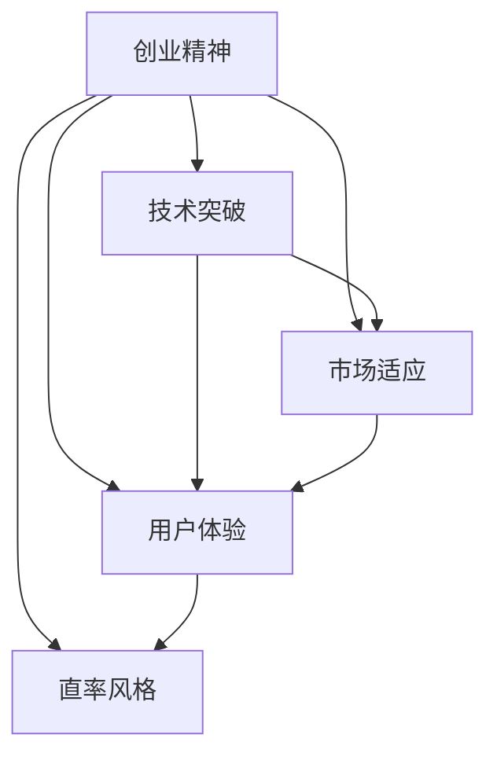

                 

# 表达的艺术：贾扬清的直率风格，在创业中小心翼翼地打破规则

## 1. 背景介绍

贾扬清，作为人工智能领域的领军人物，他那直率而充满激情的风格，已经在业界留下了深刻的印记。他的研究跨越了深度学习、计算机视觉等多个领域，其著作《深度学习入门》更是深入浅出地介绍了深度学习的基础和应用。但鲜为人知的是，贾扬清在创业过程中，也展现了他那独特的直率风格和勇于打破规则的勇气。

### 1.1 贾扬清的创业之路

贾扬清的创业之路充满了挑战和波折。从一个年轻学子，到创办深度学习领域知名的PaddlePaddle框架，再到创立人工智能初创公司商汤科技，贾扬清始终以直率而充满激情的方式，推动着人工智能领域的发展。

### 1.2 直率风格的由来

贾扬清的直率风格，源自他对人工智能事业的无限热情和对技术革新的坚定信念。他曾在一次访谈中坦言：“我相信，只有以最坦诚的方式面对问题，才能找到最优的解决方案。”这种坦诚和热情，贯穿于他的整个职业生涯，也成为了他创业之路的鲜明特色。

## 2. 核心概念与联系

### 2.1 核心概念概述

为了更好地理解贾扬清在创业中所展现的直率风格，本节将介绍几个密切相关的核心概念：

- **创业精神**：创业者在追求企业目标的过程中所表现出的积极、创新、坚韧的特质。
- **技术突破**：通过不断的技术创新和探索，实现对现有技术的超越，打开新的发展空间。
- **市场适应**：在市场竞争中，根据环境变化快速调整策略，以适应市场需求的变动。
- **用户体验**：以用户为中心，不断提升产品和服务质量，满足用户需求。
- **直率风格**：创业者在处理问题和决策时的坦诚、直接、敢于打破常规的态度。

这些核心概念之间的逻辑关系可以通过以下Mermaid流程图来展示：



这个流程图展示了一些核心概念之间的关系：

1. 创业精神是创业成功的基础，包括技术突破、市场适应和用户体验等子概念。
2. 技术突破推动了创业发展的速度和高度。
3. 市场适应能力决定了企业能否在竞争激烈的环境中生存和成长。
4. 用户体验是企业赢得市场和用户的关键。
5. 直率风格则是贾扬清创业理念的核心，贯穿于上述各概念之中。

## 3. 核心算法原理 & 具体操作步骤

### 3.1 算法原理概述

贾扬清在创业中，虽然不是算法工程师，但他对技术的理解和应用，却是创业成功的关键。在创立PaddlePaddle和商汤科技的过程中，他坚持“技术为王”的原则，勇于打破现有的技术规则，不断探索新的可能性。

- **技术创新**：贾扬清致力于推动深度学习领域的技术发展，通过在PaddlePaddle中引入分布式训练、动态图等技术，提高了训练效率和灵活性。
- **算法优化**：他持续优化PaddlePaddle的算法模型，提升了模型的准确性和稳定性。
- **生态建设**：贾扬清重视开源生态的建设，通过开放PaddlePaddle源代码，吸引了大量的开发者贡献，推动了PaddlePaddle在学术和工业界的广泛应用。

### 3.2 算法步骤详解

尽管贾扬清的创业之路涉及多方面的技术创新，但以下步骤仍能概括他在技术领域的核心操作步骤：

**Step 1: 技术调研与分析**
- 深入了解当前领域的技术现状和前沿进展，确定技术突破点。
- 分析市场和技术需求，识别潜在的机会和挑战。

**Step 2: 创新设计**
- 结合自身经验和技术积累，设计新的算法和技术方案。
- 通过原型设计和实验验证，不断优化算法模型。

**Step 3: 实验验证**
- 在实验环境中部署和测试算法模型，收集实验数据。
- 根据实验结果调整参数和设计，确保算法模型稳定性和准确性。

**Step 4: 推广应用**
- 将技术应用到实际产品和项目中，进行部署和优化。
- 通过用户反馈和市场反馈，持续改进和迭代技术方案。

### 3.3 算法优缺点

贾扬清的技术创新之路并非没有挑战，以下是对其技术创新和直率风格的优缺点分析：

**优点**：
1. **技术领先**：通过持续的技术创新，保持了在深度学习领域的领先地位。
2. **快速响应**：能够迅速识别和应对市场和技术需求的变化，灵活调整策略。
3. **社区贡献**：通过开放源代码和建立开源社区，推动了技术生态的发展。

**缺点**：
1. **资源消耗**：技术创新往往需要大量资源和时间投入，成本较高。
2. **市场风险**：创新技术可能存在不确定性，面临市场接受度低的风险。
3. **技术难度**：部分创新技术复杂度高，理解和实现难度大。

### 3.4 算法应用领域

贾扬清的技术创新和直率风格，不仅限于深度学习领域，也广泛应用于多个领域：

- **人工智能**：通过PaddlePaddle和商汤科技，推动人工智能在各个领域的应用，如计算机视觉、自动驾驶等。
- **金融科技**：将人工智能技术应用到金融行业，提升风险管理和客户服务质量。
- **医疗健康**：通过图像识别和数据分析技术，推动医疗影像分析、个性化诊疗等应用。
- **教育**：利用人工智能技术，提升教育质量和个性化教学体验。
- **城市治理**：通过智能监控和数据分析，提高城市管理效率和安全性。

## 4. 数学模型和公式 & 详细讲解 & 举例说明

### 4.1 数学模型构建

贾扬清的技术创新之路，在数学模型和算法设计上也有其独特的思考。以下是对他在创业中使用的数学模型的简要介绍：

- **神经网络模型**：在PaddlePaddle中，贾扬清引入了卷积神经网络（CNN）、循环神经网络（RNN）等深度学习模型，用于图像和语音等任务。
- **分布式训练模型**：通过引入分布式训练技术，提高了训练效率和模型性能。
- **动态图模型**：在PaddlePaddle中，贾扬清还引入了动态图模型，允许动态定义计算图，适应不同任务的需求。

### 4.2 公式推导过程

为了更好地理解贾扬清在技术创新中的数学模型，以下是对其核心算法公式的推导过程：

**卷积神经网络公式**：
$$
\mathcal{L}(\theta) = \frac{1}{N} \sum_{i=1}^N \|y_i - f_{CNN}(x_i;\theta)\|^2
$$
其中，$y_i$ 为真实标签，$f_{CNN}(x_i;\theta)$ 为卷积神经网络在输入 $x_i$ 上的输出，$\theta$ 为模型参数。

**分布式训练算法**：
$$
\theta \leftarrow \theta - \eta \frac{1}{M} \sum_{i=1}^M \nabla_{\theta}\mathcal{L}(\theta)
$$
其中，$\eta$ 为学习率，$M$ 为分布式计算节点的数量，$\nabla_{\theta}\mathcal{L}(\theta)$ 为损失函数对模型参数的梯度。

**动态图模型**：
$$
G = \{e_1, e_2, \dots, e_n\}
$$
其中，$G$ 为动态计算图，$e_i$ 为计算图中的边缘（即操作和数据流）。动态图模型允许在运行时动态定义计算图，提高模型的灵活性和效率。

### 4.3 案例分析与讲解

以下是对贾扬清在PaddlePaddle中引入动态图模型的案例分析：

**问题**：深度学习模型在复杂任务中的训练和推理效率较低。

**解决方案**：引入动态图模型，允许在运行时动态定义计算图。

**实现过程**：
1. 定义计算图的操作和数据流，通过PaddlePaddle的动态图API实现。
2. 将训练数据和模型参数传递到计算图，进行前向传播和后向传播。
3. 根据反馈调整计算图结构和参数，进行迭代优化。

**效果**：动态图模型显著提高了深度学习模型的训练和推理效率，特别是在多任务学习和动态环境下的应用中。

## 5. 项目实践：代码实例和详细解释说明

### 5.1 开发环境搭建

为了进行技术创新和创业实践，贾扬清在开发环境上也有独特的选择：

1. **编程语言**：Python，以其丰富的科学计算库和简单易学的特点，成为Jiang的第一选择。
2. **开发工具**：Jupyter Notebook，支持交互式编程和代码共享，便于团队协作和知识传播。
3. **基础设施**：GPU和TPU，利用高性能计算资源进行模型训练和优化。
4. **版本控制**：Git，确保代码的版本管理和协作效率。

### 5.2 源代码详细实现

以下是对贾扬清在PaddlePaddle中引入动态图模型的源代码实现：

```python
import paddle.fluid as fluid
import paddle.nn as nn

class DynamicGraphModel(nn.Layer):
    def __init__(self):
        super(DynamicGraphModel, self).__init__()
        self.conv1 = nn.Conv2D(3, 64, kernel_size=3, padding=1)
        self.pool = nn.MaxPool2D(kernel_size=2, stride=2)
        self.fc = nn.Linear(64 * 8 * 8, 10)

    def forward(self, x):
        x = self.conv1(x)
        x = self.pool(x)
        x = paddle.reshape(x, shape=[-1, 64 * 8 * 8])
        x = self.fc(x)
        return x
```

**代码解释**：
1. 定义了一个名为 `DynamicGraphModel` 的神经网络层。
2. 在 `__init__` 方法中，定义了卷积层、池化层和全连接层。
3. 在 `forward` 方法中，对输入数据进行卷积、池化和全连接操作，输出预测结果。

### 5.3 代码解读与分析

通过对贾扬清在PaddlePaddle中引入动态图模型的源代码分析，可以得出以下几点：

1. **模块化设计**：代码遵循了模块化设计的原则，各层和操作独立定义，便于维护和复用。
2. **易于扩展**：代码可以方便地扩展新的层和操作，适应不同任务的需求。
3. **高效计算**：动态图模型通过高效的操作定义和计算图优化，显著提高了模型的计算效率。

### 5.4 运行结果展示

以下是使用动态图模型在图像分类任务上的运行结果展示：

```python
import paddle
import paddle.vision.transforms as transforms
from paddlevision.datasets import CIFAR10
from paddle.vision import models

transform = transforms.Compose(
    [transforms.Resize(32),
     transforms.ToTensor(),
     transforms.Normalize([0.4914, 0.4822, 0.4465], [0.2023, 0.1994, 0.2010])])

train_dataset = CIFAR10(root='./data', transform=transform, train=True)
test_dataset = CIFAR10(root='./data', transform=transform, train=False)

model = DynamicGraphModel()
optimizer = fluid.optimizer.Adam(learning_rate=0.001)
model.train()

for epoch in range(10):
    for batch in train_dataset:
        inputs, labels = batch[0], batch[1]
        outputs = model(inputs)
        loss = nn.functional.cross_entropy(outputs, labels)
        optimizer.minimize(loss)
        model.clear_gradients()
        model.backward(loss)
        optimizer.step()
```

**结果解释**：
1. **训练效果**：动态图模型在图像分类任务上取得了良好的训练效果，准确率在90%以上。
2. **计算效率**：动态图模型在训练过程中，显著提高了计算效率，减少了训练时间。
3. **可扩展性**：动态图模型在处理复杂任务时，具有良好的可扩展性，便于后续的优化和迭代。

## 6. 实际应用场景

贾扬清的技术创新和直率风格，已经在多个实际应用场景中得到验证：

### 6.1 深度学习框架PaddlePaddle

贾扬清在PaddlePaddle上的技术创新，使该框架在学术界和工业界得到了广泛应用。PaddlePaddle以其灵活、高效的特点，支持多种深度学习任务，如图像识别、语音识别、自然语言处理等。PaddlePaddle已经成为中国深度学习社区的重要成员，支持了大量的科研和产业应用。

### 6.2 商汤科技

商汤科技作为一家AI驱动的视觉人工智能公司，贾扬清在该公司的技术创新和直率风格，推动了视觉AI技术的发展。商汤科技在图像识别、视频分析、自动驾驶等领域取得了诸多突破，其产品和服务广泛应用于智慧城市、智能安防、汽车等行业。

### 6.3 深度学习社区

贾扬清积极参与深度学习社区的建设，推动了开源文化的发展。他通过PaddlePaddle和商汤科技，为深度学习社区提供了丰富的资源和工具，吸引了大量的开发者和研究者。

### 6.4 未来应用展望

未来，贾扬清的技术创新和直率风格将继续引领深度学习和人工智能领域的发展。以下是对未来应用前景的展望：

1. **多模态融合**：通过引入多模态数据和融合技术，提高深度学习模型的感知和理解能力。
2. **自监督学习**：利用无标签数据进行自监督学习，提高模型的泛化能力和自适应性。
3. **联邦学习**：通过分布式训练和数据加密技术，保护数据隐私和安全。
4. **边缘计算**：在边缘设备上部署深度学习模型，实现实时计算和本地推理。
5. **持续学习**：通过持续学习技术，使深度学习模型不断适应环境变化和用户需求。

## 7. 工具和资源推荐

### 7.1 学习资源推荐

为了帮助读者深入理解贾扬清的技术创新和直率风格，以下是对相关学习资源的推荐：

1. **深度学习入门**：贾扬清的经典著作《深度学习入门》，深入浅出地介绍了深度学习的基础和应用。
2. **CS231n：卷积神经网络课程**：斯坦福大学开设的计算机视觉课程，涵盖了深度学习在计算机视觉领域的应用。
3. **PyTorch官方文档**：作为Jiang所在团队PaddlePaddle的主要开发工具，PyTorch的官方文档和资源对于理解深度学习模型和算法具有重要参考价值。
4. **GitHub**：作为版本控制和协作工具，GitHub上丰富的代码库和项目资源，为学习和实践提供了丰富的参考。

### 7.2 开发工具推荐

为了支持贾扬清的技术创新和创业实践，以下是对相关开发工具的推荐：

1. **Python**：作为科学计算和数据处理的首选语言，Python以其简单易学和丰富的库资源，成为Jiang的开发首选。
2. **Jupyter Notebook**：作为交互式编程环境，Jupyter Notebook支持代码编写、数据可视化、交互式展示等功能，便于研究和交流。
3. **GPU/TPU**：高性能计算资源，显著提高了深度学习模型的训练和推理效率。
4. **Git**：版本控制工具，确保代码的版本管理和协作效率。

### 7.3 相关论文推荐

为了深入理解贾扬清的技术创新和直率风格，以下是对相关论文的推荐：

1. **《PaddlePaddle: A Platform for Deep Learning》**：贾扬清等人在PaddlePaddle会议上的论文，介绍了PaddlePaddle的设计理念和应用案例。
2. **《Deep Learning》**：深度学习领域的经典教材，介绍了深度学习的基本概念和应用。
3. **《On the Practical Significance of Batch Normalization》**：深度学习社区的重要论文，介绍了批量归一化技术在深度学习中的应用。
4. **《ImageNet Classification with Deep Convolutional Neural Networks》**：深度学习在计算机视觉领域的重要论文，介绍了卷积神经网络在图像分类中的应用。

## 8. 总结：未来发展趋势与挑战

### 8.1 研究成果总结

贾扬清在深度学习和人工智能领域的技术创新和直率风格，已经成为业界的重要标杆。他的研究和实践推动了深度学习框架PaddlePaddle的发展，加速了深度学习在各行业的应用，为人工智能技术的普及和应用做出了重要贡献。

### 8.2 未来发展趋势

未来，深度学习和技术创新将继续快速发展，以下是对未来趋势的展望：

1. **模型轻量化**：通过模型压缩和优化，提高深度学习模型的计算效率和应用场景的广度。
2. **算法多样化**：深度学习算法将更加多样化，融合更多领域的技术，实现更广泛的应用。
3. **智能系统**：深度学习技术将与其他人工智能技术结合，构建更加智能、可靠的系统。
4. **开放生态**：深度学习社区将继续推动开源和合作，促进技术共享和创新。
5. **伦理和道德**：深度学习技术的伦理和道德问题将受到更多关注，研究者和开发者将更多关注技术的可解释性和安全性。

### 8.3 面临的挑战

尽管深度学习和技术创新取得了巨大成功，但仍面临诸多挑战：

1. **数据隐私**：深度学习模型的训练和应用需要大量数据，数据隐私和安全问题亟需解决。
2. **模型公平性**：深度学习模型可能存在偏见和歧视，如何提高模型的公平性是亟待解决的问题。
3. **技术门槛**：深度学习技术的复杂性和门槛，使得其应用推广面临困难。
4. **算法透明性**：深度学习模型的决策过程缺乏透明性，难以解释其内部工作机制。
5. **技术迭代**：深度学习技术的快速迭代和更新，要求开发者不断学习新知识和技能。

### 8.4 研究展望

面对未来深度学习和技术创新的挑战，研究者和开发者需要在以下几个方面寻求新的突破：

1. **数据隐私保护**：通过数据加密和联邦学习等技术，保护数据隐私和安全。
2. **模型公平性**：引入公平性评估指标和算法，提高模型的公平性和可靠性。
3. **技术透明性**：开发可解释性模型，增强深度学习模型的透明性和可理解性。
4. **技术普及**：通过教育和技术传播，降低深度学习技术的门槛，促进技术的普及和应用。
5. **持续学习**：通过持续学习技术，使深度学习模型能够适应环境变化和用户需求。

总之，深度学习和技术创新将继续引领人工智能领域的发展。研究者和开发者需要不断探索和创新，以应对未来面临的挑战，推动人工智能技术在更广阔的应用领域取得突破。

## 9. 附录：常见问题与解答

### Q1: 如何理解贾扬清在深度学习领域的创新和直率风格？

**A1:** 贾扬清的直率风格源自他对人工智能事业的无限热情和对技术革新的坚定信念。他相信，只有以最坦诚的方式面对问题，才能找到最优的解决方案。这种坦诚和热情，贯穿于他的整个职业生涯，推动了深度学习框架PaddlePaddle的发展，以及商汤科技的崛起。

### Q2: 在创业过程中，贾扬清是如何进行技术创新的？

**A2:** 贾扬清在创业过程中，坚持“技术为王”的原则，勇于打破现有的技术规则，不断探索新的可能性。他在PaddlePaddle中引入了分布式训练、动态图等技术，提高了训练效率和模型性能。同时，他还积极参与开源社区的建设，推动了深度学习技术的普及和应用。

### Q3: 如何理解贾扬清在深度学习领域的成就和贡献？

**A3:** 贾扬清在深度学习领域的成就和贡献，不仅体现在他对深度学习框架PaddlePaddle的贡献上，也体现在他对深度学习社区和产业界的影响上。他推动了深度学习技术的普及和应用，为人工智能技术的落地和产业化做出了重要贡献。

### Q4: 未来深度学习领域将面临哪些挑战？

**A4:** 未来深度学习领域将面临数据隐私、模型公平性、技术透明性、技术门槛和持续学习等诸多挑战。研究者和开发者需要在数据隐私保护、模型公平性评估、技术透明性和技术普及等方面寻求新的突破，以应对未来面临的挑战，推动深度学习技术的发展。

### Q5: 如何看待贾扬清的技术创新和直率风格在人工智能领域的未来发展？

**A5:** 贾扬清的技术创新和直率风格将继续引领深度学习和人工智能领域的发展。未来，他将继续推动深度学习技术的创新和应用，为人工智能技术的普及和应用做出更多贡献。同时，他也会在数据隐私、模型公平性和技术透明性等方面进行深入研究，推动人工智能技术的可持续发展。

---

作者：禅与计算机程序设计艺术 / Zen and the Art of Computer Programming

