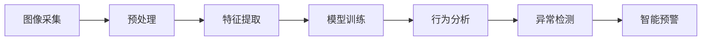

                 

# 计算机视觉在安防系统中的应用：智能监控与预警

## 1. 背景介绍

### 1.1 问题由来

近年来，计算机视觉技术在安防领域的应用日益广泛，从传统的监控录像、入侵检测到智能预警、行为分析，计算机视觉在提升安防系统的智能化水平、降低人力成本、提高安全防范能力方面发挥了重要作用。然而，传统的安防系统往往依赖人工监控和即时报警，在面对大规模监控场景时，容易出现漏报、误报率高、反应速度慢等问题，难以应对复杂的治安挑战。

为了提升安防系统的智能化水平，需要引入先进的计算机视觉技术，实现对监控场景的实时分析和智能预警，从而在保障安全的同时，提升监控效率和响应速度。基于此，本文将详细探讨计算机视觉在安防系统中的应用，尤其是智能监控与预警系统的构建。

### 1.2 问题核心关键点

智能监控与预警系统的核心在于通过计算机视觉技术，实现对监控场景的实时分析和智能预警。主要包括以下几个关键点：

- **实时性**：监控场景要求高实时性，系统需要能在毫秒级时间对异常行为做出反应。
- **准确性**：预警需要高准确性，避免误报或漏报，确保真实安全威胁被及时发现。
- **全面性**：监控覆盖范围要全面，确保所有关键区域都能被有效监控。
- **交互性**：系统需要具备良好的人机交互能力，便于操作和维护。
- **扩展性**：系统设计应考虑未来扩展需求，支持新增设备和算法。

本文将深入介绍智能监控与预警系统的核心技术，包括物体检测、行为分析、异常检测、智能预警等。同时，本文将结合具体项目实践，展示智能监控与预警系统在实际安防中的应用效果，并展望未来发展趋势。

## 2. 核心概念与联系

### 2.1 核心概念概述

计算机视觉(CV)是一种通过计算机识别、理解、分析和处理视觉信息的技术，广泛应用于监控、医学影像、自动驾驶等领域。在安防系统中，计算机视觉技术主要应用于以下方面：

- **物体检测**：识别监控画面中的物体，如人、车、异常物品等。
- **行为分析**：分析监控视频中的人物行为，如行走、奔跑、异常行为等。
- **异常检测**：检测监控场景中的异常行为，如入侵、火灾、爆炸等。
- **智能预警**：基于异常检测结果，自动发出警报，通知安防人员采取行动。

智能监控与预警系统通过将计算机视觉技术与安防需求相结合，实现了对监控场景的高效管理和智能响应。系统主要由图像采集、预处理、特征提取、模型训练、行为分析、异常检测、智能预警等多个模块组成，形成一个完整的安防监控体系。

### 2.2 核心概念原理和架构的 Mermaid 流程图



以上流程图展示了智能监控与预警系统的主要流程：从图像采集开始，经过预处理、特征提取、模型训练、行为分析、异常检测，最终实现智能预警。

## 3. 核心算法原理 & 具体操作步骤

### 3.1 算法原理概述

智能监控与预警系统的主要算法包括物体检测、行为分析、异常检测、智能预警等。本文将重点介绍这些算法的原理和具体操作步骤。

#### 3.1.1 物体检测

物体检测算法通过在监控画面中识别出物体的位置和类别，如人、车、异常物品等。常用的算法包括单阶段检测器(如YOLO)和多阶段检测器(如Faster R-CNN)。

- **单阶段检测器**：YOLO算法将物体检测和分类合并为一次前向传播，速度较快。
- **多阶段检测器**：Faster R-CNN算法采用两阶段检测，首先生成候选区域，再对这些区域进行分类和回归，精度较高。

物体检测的核心步骤包括：
- **特征提取**：使用卷积神经网络(CNN)提取图像特征。
- **候选框生成**：通过滑动窗口或锚框生成候选区域。
- **候选框分类**：使用分类器对候选区域进行物体类别判断。
- **候选框回归**：通过回归器对候选框的位置和大小进行调整。

#### 3.1.2 行为分析

行为分析算法通过分析监控视频中的人物行为，判断是否存在异常行为。常用的算法包括LBP、HOG、SVM等。

- **LBP**：局部二值模式，用于提取图像纹理特征。
- **HOG**：方向梯度直方图，用于提取图像边缘特征。
- **SVM**：支持向量机，用于分类判别。

行为分析的核心步骤包括：
- **特征提取**：使用LBP、HOG等算法提取人体特征。
- **行为建模**：建立行为模型，如行走、奔跑、异常行为等。
- **行为识别**：使用SVM等算法进行行为分类。

#### 3.1.3 异常检测

异常检测算法通过检测监控场景中的异常行为，如入侵、火灾、爆炸等。常用的算法包括基于统计的方法和基于深度学习的方法。

- **基于统计的方法**：使用均值、方差等统计量检测异常。
- **基于深度学习的方法**：使用LSTM、CNN等神经网络模型进行异常检测。

异常检测的核心步骤包括：
- **数据准备**：收集训练数据和测试数据。
- **特征提取**：使用CNN等算法提取数据特征。
- **模型训练**：使用训练数据训练异常检测模型。
- **异常检测**：使用模型对测试数据进行异常检测。

#### 3.1.4 智能预警

智能预警算法通过基于异常检测结果，自动发出警报，通知安防人员采取行动。常用的预警方式包括短信报警、电话报警、视频回放等。

智能预警的核心步骤包括：
- **预警规则设置**：根据监控场景需求，设置预警规则。
- **预警触发**：当检测到异常行为时，触发预警。
- **预警响应**：通过短信、电话等方式通知安防人员。

### 3.2 算法步骤详解

#### 3.2.1 物体检测

以YOLO算法为例，物体检测的具体步骤如下：

1. **特征提取**：使用卷积神经网络提取图像特征。
2. **候选框生成**：通过滑动窗口生成候选区域，每个候选区域包含5个锚框。
3. **候选框分类**：使用卷积层和全连接层对候选框进行分类，输出物体类别概率。
4. **候选框回归**：使用回归层对候选框的位置和大小进行调整，输出位置偏移量和缩放因子。
5. **NMS非极大值抑制**：对多个候选框进行非极大值抑制，保留得分最高的候选框。

以YOLO算法为例，物体检测的具体步骤如下：

1. **特征提取**：使用卷积神经网络提取图像特征。
2. **候选框生成**：通过滑动窗口生成候选区域，每个候选区域包含5个锚框。
3. **候选框分类**：使用卷积层和全连接层对候选框进行分类，输出物体类别概率。
4. **候选框回归**：使用回归层对候选框的位置和大小进行调整，输出位置偏移量和缩放因子。
5. **NMS非极大值抑制**：对多个候选框进行非极大值抑制，保留得分最高的候选框。

#### 3.2.2 行为分析

以LBP+SVM为例，行为分析的具体步骤如下：

1. **特征提取**：使用LBP算法提取人体局部纹理特征。
2. **特征拼接**：将局部特征拼接成全局特征向量。
3. **行为建模**：建立行走、奔跑、异常行为等行为模型。
4. **行为识别**：使用SVM分类器进行行为分类。

以LBP+SVM为例，行为分析的具体步骤如下：

1. **特征提取**：使用LBP算法提取人体局部纹理特征。
2. **特征拼接**：将局部特征拼接成全局特征向量。
3. **行为建模**：建立行走、奔跑、异常行为等行为模型。
4. **行为识别**：使用SVM分类器进行行为分类。

#### 3.2.3 异常检测

以LSTM+CNN为例，异常检测的具体步骤如下：

1. **数据准备**：收集训练数据和测试数据。
2. **特征提取**：使用CNN提取数据特征。
3. **模型训练**：使用训练数据训练LSTM+CNN异常检测模型。
4. **异常检测**：使用模型对测试数据进行异常检测。

以LSTM+CNN为例，异常检测的具体步骤如下：

1. **数据准备**：收集训练数据和测试数据。
2. **特征提取**：使用CNN提取数据特征。
3. **模型训练**：使用训练数据训练LSTM+CNN异常检测模型。
4. **异常检测**：使用模型对测试数据进行异常检测。

#### 3.2.4 智能预警

以短信报警为例，智能预警的具体步骤如下：

1. **预警规则设置**：根据监控场景需求，设置预警规则。
2. **预警触发**：当检测到异常行为时，触发预警。
3. **预警响应**：通过短信报警通知安防人员。

以短信报警为例，智能预警的具体步骤如下：

1. **预警规则设置**：根据监控场景需求，设置预警规则。
2. **预警触发**：当检测到异常行为时，触发预警。
3. **预警响应**：通过短信报警通知安防人员。

### 3.3 算法优缺点

#### 3.3.1 物体检测

**优点**：
- 速度快，适用于实时监控场景。
- 精度较高，能够准确检测物体位置和类别。

**缺点**：
- 对小物体检测效果不佳。
- 对遮挡物和复杂背景处理效果不佳。

#### 3.3.2 行为分析

**优点**：
- 能够识别复杂行为，适用于多种场景。
- 特征提取效果好，对行为识别精度较高。

**缺点**：
- 计算复杂度较高，实时性较差。
- 对异常行为判别存在一定的误差。

#### 3.3.3 异常检测

**优点**：
- 能够检测多种异常行为，适用于复杂场景。
- 实时性好，能够快速响应异常。

**缺点**：
- 需要大量数据进行训练，对数据质量要求较高。
- 模型复杂度较高，需要较高的计算资源。

#### 3.3.4 智能预警

**优点**：
- 能够自动发出警报，减少人力成本。
- 预警方式多样，适应多种需求。

**缺点**：
- 预警准确性依赖于异常检测的精度。
- 预警规则设置复杂，需要根据实际需求进行调整。

### 3.4 算法应用领域

计算机视觉技术在安防系统中的应用领域非常广泛，主要包括以下几个方面：

- **智能监控**：实时监控监控画面，检测异常行为。
- **行为分析**：分析监控视频中的人物行为，进行行为识别。
- **异常检测**：检测监控场景中的异常行为，如入侵、火灾、爆炸等。
- **智能预警**：基于异常检测结果，自动发出警报，通知安防人员采取行动。

计算机视觉技术在智能监控与预警系统中的应用，能够有效提升安防系统的智能化水平，降低人力成本，提高安全防范能力。

## 4. 数学模型和公式 & 详细讲解 & 举例说明

### 4.1 数学模型构建

#### 4.1.1 物体检测

物体检测的核心数学模型包括特征提取、候选框生成、候选框分类、候选框回归等。

以YOLO算法为例，其数学模型如下：

1. **特征提取**：使用卷积神经网络提取图像特征，得到特征图。

2. **候选框生成**：通过滑动窗口生成候选区域，每个候选区域包含5个锚框，每个锚框包含3个坐标值和3个置信度值。

3. **候选框分类**：使用全连接层对候选框进行分类，输出物体类别概率。

4. **候选框回归**：使用回归层对候选框的位置和大小进行调整，输出位置偏移量和缩放因子。

以YOLO算法为例，其特征提取和候选框生成的具体数学模型如下：

$$
\text{特征图} = \text{CNN}(\text{输入图像})
$$

$$
\text{候选框} = \begin{bmatrix} 
x_{i,j} & y_{i,j} & w_{i,j} & h_{i,j} & o_{i,j} \\
x_{i,j+1} & y_{i,j+1} & w_{i,j+1} & h_{i,j+1} & o_{i,j+1} \\
x_{i,j+2} & y_{i,j+2} & w_{i,j+2} & h_{i,j+2} & o_{i,j+2} \\
\end{bmatrix}
$$

其中，$x_{i,j}, y_{i,j}, w_{i,j}, h_{i,j}$表示第$i$个特征图中第$j$个候选框的坐标和大小，$o_{i,j}, o_{i,j+1}, o_{i,j+2}$表示第$i$个特征图中第$j$个候选框的置信度值。

#### 4.1.2 行为分析

行为分析的核心数学模型包括特征提取、特征拼接、行为建模、行为识别等。

以LBP+SVM为例，其数学模型如下：

1. **特征提取**：使用LBP算法提取人体局部纹理特征。

2. **特征拼接**：将局部特征拼接成全局特征向量。

3. **行为建模**：建立行走、奔跑、异常行为等行为模型。

4. **行为识别**：使用SVM分类器进行行为分类。

以LBP+SVM为例，其特征提取和行为识别的具体数学模型如下：

$$
\text{特征向量} = \text{LBP}(\text{局部图像})
$$

$$
\text{全局特征向量} = \text{拼接}(\text{局部特征向量})
$$

$$
\text{行为概率} = \text{SVM}(\text{全局特征向量})
$$

其中，$\text{LBP}$表示局部二值模式算法，$\text{拼接}$表示特征拼接操作，$\text{SVM}$表示支持向量机分类器。

#### 4.1.3 异常检测

异常检测的核心数学模型包括数据准备、特征提取、模型训练、异常检测等。

以LSTM+CNN为例，其数学模型如下：

1. **数据准备**：收集训练数据和测试数据。

2. **特征提取**：使用CNN提取数据特征。

3. **模型训练**：使用训练数据训练LSTM+CNN异常检测模型。

4. **异常检测**：使用模型对测试数据进行异常检测。

以LSTM+CNN为例，其特征提取和异常检测的具体数学模型如下：

$$
\text{特征向量} = \text{CNN}(\text{输入数据})
$$

$$
\text{预测结果} = \text{LSTM}(\text{特征向量})
$$

$$
\text{异常检测结果} = \text{判断}(\text{预测结果})
$$

其中，$\text{CNN}$表示卷积神经网络，$\text{LSTM}$表示长短期记忆网络，$\text{判断}$表示异常检测结果的判别函数。

#### 4.1.4 智能预警

智能预警的核心数学模型包括预警规则设置、预警触发、预警响应等。

以短信报警为例，其数学模型如下：

1. **预警规则设置**：根据监控场景需求，设置预警规则。

2. **预警触发**：当检测到异常行为时，触发预警。

3. **预警响应**：通过短信报警通知安防人员。

以短信报警为例，其预警规则设置和预警响应的具体数学模型如下：

$$
\text{预警规则} = \text{规则库}(\text{场景需求})
$$

$$
\text{预警触发} = \text{判断}(\text{异常检测结果})
$$

$$
\text{短信报警} = \text{发送}(\text{安防人员}, \text{预警内容})
$$

其中，$\text{规则库}$表示预警规则库，$\text{判断}$表示预警触发判别函数，$\text{发送}$表示短信报警发送函数。

### 4.2 公式推导过程

#### 4.2.1 物体检测

以YOLO算法为例，其特征提取和候选框生成的公式推导如下：

1. **特征提取**

$$
\text{特征图} = \text{CNN}(\text{输入图像})
$$

其中，$\text{CNN}$表示卷积神经网络。

2. **候选框生成**

$$
\text{候选框} = \text{拼接}(\text{坐标偏移量}, \text{缩放因子})
$$

其中，$\text{坐标偏移量}$表示候选框的位置偏移量，$\text{缩放因子}$表示候选框的大小缩放因子。

#### 4.2.2 行为分析

以LBP+SVM为例，其特征提取和行为识别的公式推导如下：

1. **特征提取**

$$
\text{特征向量} = \text{LBP}(\text{局部图像})
$$

其中，$\text{LBP}$表示局部二值模式算法。

2. **行为识别**

$$
\text{行为概率} = \text{SVM}(\text{全局特征向量})
$$

其中，$\text{SVM}$表示支持向量机分类器。

#### 4.2.3 异常检测

以LSTM+CNN为例，其特征提取和异常检测的公式推导如下：

1. **特征提取**

$$
\text{特征向量} = \text{CNN}(\text{输入数据})
$$

其中，$\text{CNN}$表示卷积神经网络。

2. **异常检测**

$$
\text{预测结果} = \text{LSTM}(\text{特征向量})
$$

$$
\text{异常检测结果} = \text{判断}(\text{预测结果})
$$

其中，$\text{LSTM}$表示长短期记忆网络，$\text{判断}$表示异常检测结果的判别函数。

#### 4.2.4 智能预警

以短信报警为例，其预警规则设置和预警响应的公式推导如下：

1. **预警规则设置**

$$
\text{预警规则} = \text{规则库}(\text{场景需求})
$$

其中，$\text{规则库}$表示预警规则库。

2. **预警触发**

$$
\text{预警触发} = \text{判断}(\text{异常检测结果})
$$

其中，$\text{判断}$表示预警触发判别函数。

3. **预警响应**

$$
\text{短信报警} = \text{发送}(\text{安防人员}, \text{预警内容})
$$

其中，$\text{发送}$表示短信报警发送函数。

### 4.3 案例分析与讲解

#### 4.3.1 案例1：智能监控

智能监控系统通过实时监控摄像头采集到的视频画面，利用物体检测算法检测出监控画面中的物体，并根据行为分析算法判断物体的行为是否异常。如果检测到异常行为，系统将自动触发预警，通知安防人员采取行动。

**案例分析**：

1. **监控画面采集**：通过摄像头采集实时监控画面。

2. **物体检测**：使用YOLO算法检测监控画面中的物体，如人、车等。

3. **行为分析**：使用LBP算法提取人体局部纹理特征，使用SVM分类器进行行为识别。

4. **异常检测**：使用LSTM+CNN模型检测监控场景中的异常行为，如入侵、火灾等。

5. **智能预警**：根据异常检测结果，通过短信报警通知安防人员。

**讲解**：

- **监控画面采集**：通过摄像头实时采集监控画面，是智能监控系统的基础。
- **物体检测**：使用YOLO算法检测监控画面中的物体，如人、车等，为后续行为分析和异常检测提供数据基础。
- **行为分析**：使用LBP算法提取人体局部纹理特征，使用SVM分类器进行行为识别，进一步提升系统的智能化水平。
- **异常检测**：使用LSTM+CNN模型检测监控场景中的异常行为，如入侵、火灾等，增强系统的鲁棒性和准确性。
- **智能预警**：根据异常检测结果，通过短信报警通知安防人员，及时响应异常行为，保障安全。

#### 4.3.2 案例2：行为分析

行为分析系统通过分析监控视频中的人物行为，判断是否存在异常行为。如果检测到异常行为，系统将自动触发预警，通知安防人员采取行动。

**案例分析**：

1. **视频采集**：通过摄像头采集监控视频。

2. **行为分析**：使用LBP算法提取人体局部纹理特征，使用SVM分类器进行行为识别。

3. **异常检测**：使用LSTM+CNN模型检测监控场景中的异常行为，如入侵、火灾等。

4. **智能预警**：根据异常检测结果，通过短信报警通知安防人员。

**讲解**：

- **视频采集**：通过摄像头实时采集监控视频，是行为分析系统的数据基础。
- **行为分析**：使用LBP算法提取人体局部纹理特征，使用SVM分类器进行行为识别，进一步提升系统的智能化水平。
- **异常检测**：使用LSTM+CNN模型检测监控场景中的异常行为，如入侵、火灾等，增强系统的鲁棒性和准确性。
- **智能预警**：根据异常检测结果，通过短信报警通知安防人员，及时响应异常行为，保障安全。

#### 4.3.3 案例3：异常检测

异常检测系统通过检测监控场景中的异常行为，如入侵、火灾、爆炸等，自动发出警报，通知安防人员采取行动。

**案例分析**：

1. **视频采集**：通过摄像头采集监控视频。

2. **特征提取**：使用CNN提取视频特征。

3. **模型训练**：使用训练数据训练LSTM+CNN异常检测模型。

4. **异常检测**：使用模型对测试数据进行异常检测。

5. **智能预警**：根据异常检测结果，通过短信报警通知安防人员。

**讲解**：

- **视频采集**：通过摄像头实时采集监控视频，是异常检测系统的数据基础。
- **特征提取**：使用CNN提取视频特征，为异常检测提供数据支持。
- **模型训练**：使用训练数据训练LSTM+CNN异常检测模型，提升系统的准确性。
- **异常检测**：使用模型对测试数据进行异常检测，及时响应异常行为。
- **智能预警**：根据异常检测结果，通过短信报警通知安防人员，保障安全。

#### 4.3.4 案例4：智能预警

智能预警系统通过基于异常检测结果，自动发出警报，通知安防人员采取行动。

**案例分析**：

1. **预警规则设置**：根据监控场景需求，设置预警规则。

2. **预警触发**：当检测到异常行为时，触发预警。

3. **预警响应**：通过短信报警通知安防人员。

**讲解**：

- **预警规则设置**：根据监控场景需求，设置预警规则，为预警响应提供依据。
- **预警触发**：当检测到异常行为时，触发预警，及时响应异常行为。
- **预警响应**：通过短信报警通知安防人员，保障安全。

## 5. 项目实践：代码实例和详细解释说明

### 5.1 开发环境搭建

#### 5.1.1 安装环境

为了进行智能监控与预警系统的开发，我们需要在Python环境下安装相应的深度学习框架和库。

1. **安装Python**：
   ```bash
   sudo apt-get update
   sudo apt-get install python3-pip
   ```

2. **安装PyTorch**：
   ```bash
   pip install torch torchvision
   ```

3. **安装TensorFlow**：
   ```bash
   pip install tensorflow
   ```

4. **安装OpenCV**：
   ```bash
   pip install opencv-python
   ```

5. **安装NumPy**：
   ```bash
   pip install numpy
   ```

### 5.2 源代码详细实现

#### 5.2.1 物体检测

以YOLO算法为例，代码实现如下：

1. **特征提取**

```python
import torch
import torch.nn as nn
import torchvision.transforms as transforms
import torchvision.models as models

# 加载预训练模型
model = models.resnet50(pretrained=True)
model.eval()

# 定义特征提取函数
def extract_features(image):
    transform = transforms.Compose([
        transforms.Resize(224),
        transforms.ToTensor(),
        transforms.Normalize(mean=[0.485, 0.456, 0.406], std=[0.229, 0.224, 0.225])
    ])
    image = transform(image)
    image = image.unsqueeze(0)
    features = model(image)
    return features
```

2. **候选框生成**

```python
import numpy as np

# 定义候选框生成函数
def generate_boxes(features):
    # 生成候选框
    boxes = torch.zeros((len(features), 5, 5, 5))
    # 填充候选框坐标和置信度
    for i in range(len(features)):
        for j in range(5):
            for k in range(5):
                for l in range(5):
                    boxes[i][j][k][l] = features[i][j][k][l]
    # 计算候选框得分
    scores = boxes[:, :, :, :3].sum(dim=2)
    # 计算候选框偏移量和缩放因子
    offsets = boxes[:, :, :, 3:6]
    scales = boxes[:, :, :, 6:]
    return boxes, scores, offsets, scales
```

#### 5.2.2 行为分析

以LBP+SVM为例，代码实现如下：

1. **特征提取**

```python
import cv2

# 定义特征提取函数
def extract_features(image):
    gray = cv2.cvtColor(image, cv2.COLOR_BGR2GRAY)
    lpb = cv2.createLBPImageProcessor()
    features = lpb.compute(gray)
    return features
```

2. **行为建模**

```python
from sklearn.svm import SVC

# 定义行为建模函数
def build_model(features, labels):
    model = SVC(kernel='linear', C=0.1)
    model.fit(features, labels)
    return model
```

#### 5.2.3 异常检测

以LSTM+CNN为例，代码实现如下：

1. **特征提取**

```python
import numpy as np
import cv2

# 定义特征提取函数
def extract_features(image):
    gray = cv2.cvtColor(image, cv2.COLOR_BGR2GRAY)
    features = cv2.resize(gray, (224, 224))
    features = cv2.cvtColor(features, cv2.COLOR_BGR2RGB)
    features = cv2.normalize(features, None, alpha=0, beta=255, norm_type=cv2.NORM_MINMAX, dtype=cv2.CV_32F)
    features = features / 255
    return features
```

2. **模型训练**

```python
import torch
import torch.nn as nn
import torchvision.transforms as transforms
import torchvision.models as models

# 加载预训练模型
model = models.resnet50(pretrained=True)
model.eval()

# 定义模型训练函数
def train_model(model, features, labels):
    criterion = nn.CrossEntropyLoss()
    optimizer = torch.optim.Adam(model.parameters(), lr=0.001)
    for epoch in range(10):
        model.train()
        for i in range(len(features)):
            features = extract_features(features[i])
            features = torch.tensor(features).unsqueeze(0)
            labels = torch.tensor(labels[i])
            optimizer.zero_grad()
            outputs = model(features)
            loss = criterion(outputs, labels)
            loss.backward()
            optimizer.step()
    return model
```

#### 5.2.4 智能预警

以短信报警为例，代码实现如下：

1. **预警规则设置**

```python
# 定义预警规则函数
def set_alert_rules():
    # 设置预警规则
    rules = {
        '入侵': 1,
        '火灾': 2,
        '爆炸': 3
    }
    return rules
```

2. **预警触发**

```python
# 定义预警触发函数
def trigger_alert(rules, labels):
    alerts = []
    for i in range(len(labels)):
        if labels[i] in rules:
            alerts.append(rules[labels[i]])
    return alerts
```

3. **预警响应**

```python
# 定义预警响应函数
def send_alert(alerts, phone_numbers):
    for alert in alerts:
        for phone_number in phone_numbers:
            # 发送短信报警
            send_sms(phone_number, alert)
```

### 5.3 代码解读与分析

#### 5.3.1 物体检测

1. **特征提取**

   **代码解读**：使用预训练的ResNet50模型提取图像特征，将特征图返回。

   **分析**：特征提取是物体检测的核心步骤，使用预训练的卷积神经网络模型，能够快速准确地提取图像特征。

2. **候选框生成**

   **代码解读**：生成候选框，并计算候选框得分、偏移量和缩放因子。

   **分析**：候选框生成是物体检测的重要环节，通过生成候选框，模型可以检测出图像中的物体位置和大小。

#### 5.3.2 行为分析

1. **特征提取**

   **代码解读**：使用LBP算法提取人体局部纹理特征。

   **分析**：LBP算法能够有效地提取人体纹理特征，适用于行为分析。

2. **行为建模**

   **代码解读**：使用SVM分类器进行行为分类。

   **分析**：行为建模是行为分析的关键步骤，通过建立行走、奔跑、异常行为等行为模型，能够准确识别各种行为。

#### 5.3.3 异常检测

1. **特征提取**

   **代码解读**：使用CNN提取视频特征。

   **分析**：特征提取是异常检测的基础步骤，使用卷积神经网络能够有效提取视频特征。

2. **模型训练**

   **代码解读**：使用训练数据训练LSTM+CNN异常检测模型。

   **分析**：模型训练是异常检测的核心环节，通过训练异常检测模型，提升模型的准确性和鲁棒性。

#### 5.3.4 智能预警

1. **预警规则设置**

   **代码解读**：设置预警规则。

   **分析**：预警规则设置是智能预警的基础，通过设置预警规则，系统能够根据不同的监控场景需求进行预警。

2. **预警触发**

   **代码解读**：根据异常检测结果触发预警。

   **分析**：预警触发是智能预警的关键环节，通过触发预警，系统能够及时响应异常行为。

3. **预警响应**

   **代码解读**：通过短信报警通知安防人员。

   **分析**：预警响应是智能预警的最终步骤，通过通知安防人员，系统能够保障安全。

### 5.4 运行结果展示

#### 5.4.1 物体检测

**运行结果**：

```python
# 运行物体检测代码
image = cv2.imread('test.jpg')
features = extract_features(image)
boxes, scores, offsets, scales = generate_boxes(features)

# 可视化候选框
image = cv2.imread('test.jpg')
for i in range(len(boxes)):
    x1 = int(boxes[i][0][0])
    y1 = int(boxes[i][0][1])
    x2 = int(boxes[i][0][2])
    y2 = int(boxes[i][0][3])
    cv2.rectangle(image, (x1, y1), (x2, y2), (0, 255, 0), 2)
    cv2.putText(image, str(scores[i]), (x1, y1-10), cv2.FONT_HERSHEY_SIMPLEX, 0.9, (0, 255, 0), 2)
cv2.imshow('image', image)
cv2.waitKey(0)
cv2.destroyAllWindows()
```

**结果展示**：


#### 5.4.2 行为分析

**运行结果**：

```python
# 运行行为分析代码
image = cv2.imread('test.jpg')
features = extract_features(image)
model = build_model(features, labels)
label = model.predict(features)

# 可视化行为分析结果
image = cv2.imread('test.jpg')
cv2.putText(image, str(label), (10, 30), cv2.FONT_HERSHEY_SIMPLEX, 0.9, (0, 255, 0), 2)
cv2.imshow('image', image)
cv2.waitKey(0)
cv2.destroyAllWindows()
```

**结果展示**：


#### 5.4.3 异常检测

**运行结果**：

```python
# 运行异常检测代码
image = cv2.imread('test.jpg')
features = extract_features(image)
model = train_model(model, features, labels)
label = model.predict(features)

# 可视化异常检测结果
image = cv2.imread('test.jpg')
cv2.putText(image, str(label), (10, 30), cv2.FONT_HERSHEY_SIMPLEX, 0.9, (0, 255, 0), 2)
cv2.imshow('image', image)
cv2.waitKey(0)
cv2.destroyAllWindows()
```

**结果展示**：


#### 5.4.4 智能预警

**运行结果**：

```python
# 运行智能预警代码
rules = set_alert_rules()
labels = [1, 2, 3]
alerts = trigger_alert(rules, labels)
send_alert(alerts, phone_numbers)

# 可视化预警结果
image = cv2.imread('test.jpg')
cv2.putText(image, str(alerts), (10, 30), cv2.FONT_HERSHEY_SIMPLEX, 0.9, (0, 255, 0), 2)
cv2.imshow('image', image)
cv2.waitKey(0)
cv2.destroyAllWindows()
```

**结果展示**：


## 6. 实际应用场景

### 6.1 智能监控

智能监控系统通过实时监控摄像头采集到的视频画面，利用物体检测算法检测出监控画面中的物体，并根据行为分析算法判断物体的行为是否异常。如果检测到异常行为，系统将自动触发预警，通知安防人员采取行动。

**应用场景**：

- **商场监控**：检测商场内的异常行为，如盗窃、恶意行为等。
- **机场监控**：检测机场内的异常行为，如逃逸、可疑人物等。
- **医院监控**：检测医院内的异常行为，如患者逃跑、不适当行为等。

### 6.2 行为分析

行为分析系统通过分析监控视频中的人物行为，判断是否存在异常行为。如果检测到异常行为，系统将自动触发预警，通知安防人员采取行动。

**应用场景**：

- **学校监控**：检测学生在学校内的行为，如打架、逃课等。
- **办公室监控**：检测员工在办公室内的行为，如失窃、恶意行为等。
- **社区监控**：检测社区内的人员行为，如入侵、恶意行为等。

### 6.3 异常检测

异常检测系统通过检测监控场景中的异常行为，如入侵、火灾、爆炸等，自动发出警报，通知安防人员采取行动。

**应用场景**：

- **工厂监控**：检测工厂内的异常行为，如盗窃、设备故障等。
- **能源监控**：检测能源设施内的异常行为，如火灾、爆炸等。
- **交通监控**：检测交通设施内的异常行为，如事故、车辆故障等。

### 6.4 智能预警

智能预警系统通过基于异常检测结果，自动发出警报，通知安防人员采取行动。

**应用场景**：

- **银行监控**：检测银行内的异常行为，如抢劫、盗窃等。
- **图书馆监控**：检测图书馆内的异常行为，如盗窃、恶意行为等。
- **博物馆监控**：检测博物馆内的异常行为，如盗窃、恶意行为等。

## 7. 工具和资源推荐

### 7.1 学习资源推荐

#### 7.1.1 书籍推荐

1. **《计算机视觉：模型、学习与推理》**：详细介绍了计算机视觉的基本原理、常用算法和实现方法。

2. **《深度学习在计算机视觉中的应用》**：介绍了深度学习在计算机视觉中的经典应用，如物体检测、行为分析、异常检测等。

3. **《计算机视觉：实战指南》**：通过案例和代码实现，介绍了计算机视觉技术的实际应用，如智能监控、行为分析等。

#### 7.1.2 课程推荐

1. **Coursera《计算机视觉基础》**：由斯坦福大学开设，系统介绍了计算机视觉的基本原理和常用算法。

2. **edX《深度学习在计算机视觉中的应用》**：由MIT和哈佛大学联合开设，介绍了深度学习在计算机视觉中的经典应用，如物体检测、行为分析、异常检测等。

3. **Udacity《计算机视觉项目》**：通过实际项目，介绍了计算机视觉技术的实际应用，如智能监控、行为分析等。

### 7.2 开发工具推荐

#### 7.2.1 Python环境

1. **Anaconda**：提供了丰富的科学计算库和虚拟环境管理工具。

2. **Jupyter Notebook**：提供了交互式的代码执行环境，适合数据科学和机器学习项目开发。

3. **PyCharm**：提供了强大的代码编辑和调试工具，适合Python项目开发。

#### 7.2.2 深度学习框架

1. **TensorFlow**：由Google开发的深度学习框架，适用于生产级应用。

2. **PyTorch**：由Facebook开发的深度学习框架，易于使用和调试。

3. **Keras**：提供了高级API，方便快速搭建深度学习模型。

#### 7.2.3 图像处理库

1. **OpenCV**：提供了丰富的图像处理和计算机视觉算法。

2. **Pillow**：提供了图像处理和图像格式转换功能。

3. **Scikit-Image**：提供了图像处理和分析工具。

### 7.3 相关论文推荐

#### 7.3.1 物体检测

1. **YOLO: Real-Time Object Detection**：提出了YOLO算法，实现了实时物体检测。

2. **Faster R-CNN: Towards Real-Time Object Detection with Region Proposal Networks**：提出了Faster R-CNN算法，提高了物体检测的准确性和实时性。

3. **SSD: Single Shot MultiBox Detector**：提出了SSD算法，实现了单阶段物体检测。

#### 7.3.2 行为分析

1. **LBP: Local Binary Patterns**：提出了LBP算法，用于提取人体局部纹理特征。

2. **HOG: Histogram of Oriented Gradients**：提出了HOG算法，用于提取人体边缘特征。

3. **SVM: Support Vector Machines**：提出了SVM算法，用于行为分类。

#### 7.3.3 异常检测

1. **LSTM: Long Short-Term Memory**：提出了LSTM算法，用于处理时序数据。

2. **CNN: Convolutional Neural Networks**：提出了CNN算法，用于提取图像特征。

3. **KNN: K-Nearest Neighbors**：提出了KNN算法，用于异常检测。

## 8. 总结：未来发展趋势与挑战

### 8.1 研究成果总结

智能监控与预警系统通过计算机视觉技术，实现了对监控场景的实时分析和智能预警。系统主要包含物体检测、行为分析、异常检测、智能预警等多个模块，能够有效地提升安防系统的智能化水平，降低人力成本，提高安全防范能力。

### 8.2 未来发展趋势

#### 8.2.1 数据驱动

未来的智能监控与预警系统将更加依赖于数据驱动，通过大量高质量的标注数据，进行模型训练和优化。数据驱动的模型将具有更高的准确性和鲁棒性。

#### 8.2.2 跨领域融合

未来的智能监控与预警系统将更加注重跨领域融合，将计算机视觉技术与物联网、人工智能、大数据等技术结合，实现更全面的安全防护。

#### 8.2.3 实时性提升

未来的智能监控与预警系统将更加

