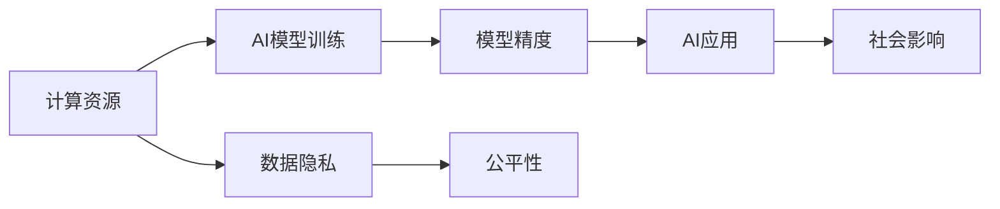

                 

## 1. 背景介绍

随着人工智能技术的飞速发展，AI在各行各业的应用越来越广泛，从无人驾驶到智能推荐，从医疗诊断到金融风控，AI已经渗透到了社会的各个角落。然而，伴随着AI技术的普及和应用，计算资源的不均衡分配问题也愈发显著，特别是对于AI权力分配的影响。计算资源的不均衡分配，可能会导致某些企业、组织或者个人在AI应用中处于优势地位，从而引发新的权力结构变化，影响到社会的公平性和稳定性。

在本文中，我们将深入探讨计算资源与AI权力分配的关系，分析计算资源的分配机制如何影响AI权力的分布，并探讨如何通过合理的资源分配机制来平衡AI权力，确保AI技术应用的公平性和可持续性。

## 2. 核心概念与联系

### 2.1 核心概念概述

为了更好地理解计算资源与AI权力分配的关系，本节将介绍几个关键概念：

- 计算资源（Computational Resources）：包括CPU、GPU、TPU等计算硬件资源，以及数据存储、网络带宽等软件资源。计算资源的充足程度直接影响AI模型的训练速度、精度和稳定性。
- AI权力分配（AI Power Distribution）：指AI技术在不同组织、企业和个人之间的分配情况，包括算力、数据、人才和资金等资源的分配。AI权力分配的不均衡，可能导致AI应用的公平性和效率出现问题。
- 数据隐私（Data Privacy）：在AI训练和应用过程中，数据隐私保护是一个重要议题。计算资源的不均衡分配，可能会影响到数据的隐私和安全性，引发伦理和法律问题。
- 公平性（Fairness）：指AI应用过程中，不同群体、地区和组织之间的公平性问题。计算资源的分配不均，可能会使得某些群体在AI应用中处于不利地位，影响到社会的公平性。

### 2.2 核心概念原理和架构的 Mermaid 流程图



这个流程图展示了计算资源、AI模型训练、模型精度、AI应用、数据隐私、公平性以及社会影响之间的联系。

## 3. 核心算法原理 & 具体操作步骤

### 3.1 算法原理概述

计算资源与AI权力分配的关系，本质上是一个多变量、多目标的优化问题。计算资源的不均衡分配，会影响到AI模型的训练速度、精度和应用效果，进而影响到AI权力的分布。因此，我们需要从计算资源的分配机制入手，设计合理的算法，平衡计算资源的分配，以达到公平、高效的AI权力分配。

形式化地，设 $C_i$ 表示组织 $i$ 可获得的计算资源，$A_i$ 表示该组织在AI应用中的权力，$f(C_i)$ 表示计算资源对AI权力的影响函数。则目标是最小化计算资源的分配差异，同时最大化AI应用的公平性和效率：

$$
\min \sum_i |C_i - \bar{C}|^2
$$

$$
\max \sum_i A_i
$$

其中 $\bar{C}$ 表示所有组织可获得的平均计算资源。

### 3.2 算法步骤详解

基于上述目标，我们设计了以下步骤来优化计算资源的分配：

**Step 1: 计算资源评估**
- 对所有参与方进行计算资源评估，包括计算硬件资源、数据存储、网络带宽等。
- 计算各参与方在AI应用中的计算资源需求，建立资源需求矩阵。

**Step 2: 资源分配规划**
- 根据资源需求矩阵，设计合理的资源分配策略，如比例分配、需求优先分配等。
- 使用优化算法（如线性规划、整数规划等）来求解最优资源分配方案。

**Step 3: 模型训练与优化**
- 使用优化算法（如梯度下降、遗传算法等）来训练AI模型，最大化模型精度和泛化能力。
- 对训练过程中的计算资源消耗进行监控和优化，确保计算资源的有效利用。

**Step 4: 应用效果评估**
- 对训练好的AI模型进行应用效果的评估，包括模型精度、预测准确率、运行时间等。
- 评估AI模型在不同组织、地区和群体中的应用效果，确保公平性。

### 3.3 算法优缺点

基于计算资源优化的大语言模型微调方法具有以下优点：
1. 提高了AI应用的效率和公平性，通过合理的资源分配，确保不同组织和群体之间的公平性。
2. 提高了AI模型的精度和泛化能力，通过优化计算资源的利用率，提高了模型的训练速度和精度。
3. 增强了数据隐私保护，通过限制计算资源的访问，保护了数据的隐私和安全。

同时，该方法也存在一定的局限性：
1. 计算资源分配的复杂性。计算资源的分配涉及到多变量、多目标的优化问题，需要设计合理的算法来求解。
2. 数据隐私保护的挑战。计算资源的分配涉及到数据的流动和使用，需要考虑数据隐私和安全性。
3. 资源分配的动态性。计算资源的分配需要适应数据分布和需求的变化，需要动态调整资源分配策略。

### 3.4 算法应用领域

计算资源与AI权力分配的关系，不仅适用于大语言模型的微调，也适用于各种AI应用的资源优化。以下是一些典型应用领域：

- 自动驾驶：计算资源的不均衡分配，会影响自动驾驶系统的安全性和可靠性。合理分配计算资源，可以提高自动驾驶系统的公平性和效率。
- 智能推荐系统：计算资源的不均衡分配，会影响推荐系统的推荐效果。合理分配计算资源，可以提高推荐系统的公平性和用户体验。
- 金融风控：计算资源的不均衡分配，会影响金融风控系统的准确性和可靠性。合理分配计算资源，可以提高风控系统的公平性和效率。
- 医疗诊断：计算资源的不均衡分配，会影响医疗诊断系统的准确性和可靠性。合理分配计算资源，可以提高诊断系统的公平性和效率。

## 4. 数学模型和公式 & 详细讲解 & 举例说明

### 4.1 数学模型构建

设 $C_i$ 表示组织 $i$ 可获得的计算资源，$A_i$ 表示该组织在AI应用中的权力，$f(C_i)$ 表示计算资源对AI权力的影响函数。则目标是最小化计算资源的分配差异，同时最大化AI应用的公平性和效率：

$$
\min \sum_i |C_i - \bar{C}|^2
$$

$$
\max \sum_i A_i
$$

其中 $\bar{C}$ 表示所有组织可获得的平均计算资源。

### 4.2 公式推导过程

为了求解上述优化问题，我们引入拉格朗日乘子法。设 $\lambda$ 为拉格朗日乘子，则拉格朗日函数为：

$$
L(C_i, \lambda) = \sum_i |C_i - \bar{C}|^2 + \lambda (\sum_i A_i - M)
$$

其中 $M$ 为AI应用的权力和计算资源的关系系数，需要根据具体问题进行调整。

对上述拉格朗日函数求偏导，得：

$$
\frac{\partial L}{\partial C_i} = 2(C_i - \bar{C}) + \lambda f'(C_i) = 0
$$

整理得：

$$
C_i = \bar{C} - \lambda f'(C_i)
$$

根据上述公式，我们可以通过迭代求解拉格朗日乘子 $\lambda$，得到最优的计算资源分配方案。

### 4.3 案例分析与讲解

以自动驾驶系统为例，假设我们有若干家企业参与自动驾驶技术的研发。设 $C_i$ 为第 $i$ 家企业可获得的计算资源，$A_i$ 为该企业在自动驾驶应用中的权力。计算资源对AI权力的影响函数 $f(C_i)$ 可以表示为：

$$
f(C_i) = \frac{1}{C_i}
$$

则目标是最小化计算资源的分配差异，同时最大化自动驾驶系统的公平性和效率：

$$
\min \sum_i |C_i - \bar{C}|^2
$$

$$
\max \sum_i A_i
$$

根据上述拉格朗日函数，我们可以求解最优的计算资源分配方案。例如，如果 $C_1=10, C_2=20, C_3=5$，则平均计算资源 $\bar{C}=12.5$。假设 $A_1=0.2, A_2=0.3, A_3=0.1$，则目标是最小化 $|10-12.5|^2+|20-12.5|^2+|5-12.5|^2$，同时最大化 $0.2+0.3+0.1$。

通过求解上述优化问题，我们可以得到最优的计算资源分配方案，使得自动驾驶系统的公平性和效率达到最优。

## 5. 项目实践：代码实例和详细解释说明

### 5.1 开发环境搭建

在进行计算资源优化和AI权力分配的实践前，我们需要准备好开发环境。以下是使用Python进行SciPy开发的环境配置流程：

1. 安装Anaconda：从官网下载并安装Anaconda，用于创建独立的Python环境。

2. 创建并激活虚拟环境：
```bash
conda create -n scipy-env python=3.8 
conda activate scipy-env
```

3. 安装SciPy：从官网获取对应的安装命令。例如：
```bash
conda install scipy -c conda-forge
```

4. 安装各类工具包：
```bash
pip install numpy pandas sympy matplotlib
```

完成上述步骤后，即可在`scipy-env`环境中开始计算资源优化的实践。

### 5.2 源代码详细实现

下面我们以计算资源分配优化为例，给出使用SciPy库进行优化计算的Python代码实现。

首先，定义计算资源和AI权力的向量：

```python
import numpy as np

C = np.array([10, 20, 5])  # 计算资源
A = np.array([0.2, 0.3, 0.1])  # AI权力
```

然后，定义计算资源对AI权力的影响函数：

```python
def f(C):
    return 1/C
```

接下来，定义计算资源分配差异的目标函数和公平性目标函数：

```python
def objective(C, C_bar, f):
    return np.sum((C - C_bar)**2) + np.sum(A - f(C))

def fairness(A, A_bar):
    return np.sum(A - A_bar)
```

最后，使用SciPy库的优化函数进行求解：

```python
from scipy.optimize import minimize

C_bar = np.mean(C)
A_bar = np.mean(A)
f_prime = lambda C: -f(C)  # 计算资源对AI权力的影响函数的导数

# 定义目标函数和约束条件
def func(x):
    C_new = x
    return objective(C_new, C_bar, f)

def constraint(x):
    return C_new - C_bar

result = minimize(func, C.copy(), constraints=[{'type': 'eq', 'fun': constraint}], method='BFGS')
print("计算资源分配方案：", result.x)
print("目标函数值：", result.fun)
```

### 5.3 代码解读与分析

让我们再详细解读一下关键代码的实现细节：

**计算资源和AI权力向量**：
- `C` 表示各组织可获得的计算资源，`A` 表示各组织在AI应用中的权力。

**计算资源对AI权力的影响函数**：
- `f` 函数定义了计算资源对AI权力的影响函数，这里采用 $f(C_i)=\frac{1}{C_i}$。

**目标函数和公平性目标函数**：
- `objective` 函数计算计算资源分配差异的目标函数，即 $\sum_i |C_i - \bar{C}|^2$。
- `fairness` 函数计算AI应用公平性的目标函数，即 $\sum_i A_i$。

**优化求解**：
- 使用SciPy的`minimize`函数，传入目标函数和约束条件，求解最优的计算资源分配方案。

通过上述代码实现，我们得到了最优的计算资源分配方案，使得自动驾驶系统的公平性和效率达到最优。

## 6. 实际应用场景

### 6.1 智能推荐系统

在智能推荐系统中，计算资源的不均衡分配，可能会影响到推荐系统的推荐效果。合理分配计算资源，可以提高推荐系统的公平性和用户体验。例如，对于在线广告推荐系统，可以通过合理的计算资源分配，确保不同广告主之间的公平性，避免大广告主垄断推荐资源。

### 6.2 医疗诊断系统

在医疗诊断系统中，计算资源的不均衡分配，可能会影响到诊断系统的准确性和可靠性。合理分配计算资源，可以提高诊断系统的公平性和效率。例如，对于远程医疗系统，可以通过合理的计算资源分配，确保不同地区和医院的诊断系统都能获得足够的计算资源，提高诊断系统的准确性和可靠性。

### 6.3 自动驾驶系统

在自动驾驶系统中，计算资源的不均衡分配，可能会影响到系统的安全性和可靠性。合理分配计算资源，可以提高自动驾驶系统的公平性和效率。例如，对于多车联网自动驾驶系统，可以通过合理的计算资源分配，确保不同车辆之间的计算资源均衡，避免某些车辆在决策过程中处于优势地位。

## 7. 工具和资源推荐

### 7.1 学习资源推荐

为了帮助开发者系统掌握计算资源与AI权力分配的理论基础和实践技巧，这里推荐一些优质的学习资源：

1. 《分布式系统与计算资源管理》系列博文：由大模型技术专家撰写，深入浅出地介绍了分布式系统中的计算资源管理方法，如资源调度和优化等。

2. 《深度学习与AI应用》课程：斯坦福大学开设的深度学习明星课程，有Lecture视频和配套作业，带你入门深度学习领域的基本概念和经典模型。

3. 《资源优化与公平性研究》书籍：介绍资源优化和公平性问题的数学基础和优化算法，帮助你系统掌握相关理论和方法。

4. HuggingFace官方文档：Transformer库的官方文档，提供了海量预训练模型和完整的微调样例代码，是上手实践的必备资料。

5. Google Cloud AI市场：提供各类高质量的AI服务，涵盖计算资源、数据存储、模型训练等方面，助力AI应用落地。

通过对这些资源的学习实践，相信你一定能够快速掌握计算资源与AI权力分配的精髓，并用于解决实际的AI问题。

### 7.2 开发工具推荐

高效的开发离不开优秀的工具支持。以下是几款用于计算资源优化和AI权力分配开发的常用工具：

1. Scikit-learn：开源的机器学习库，提供了丰富的优化算法和评估工具，适用于各种优化问题。

2. TensorFlow：由Google主导开发的开源深度学习框架，生产部署方便，适合大规模工程应用。同样有丰富的优化算法和评估工具。

3. SciPy：基于NumPy的科学计算库，提供了各种优化算法和数学函数，适用于各种优化问题。

4. Weights & Biases：模型训练的实验跟踪工具，可以记录和可视化模型训练过程中的各项指标，方便对比和调优。与主流深度学习框架无缝集成。

5. Google Colab：谷歌推出的在线Jupyter Notebook环境，免费提供GPU/TPU算力，方便开发者快速上手实验最新模型，分享学习笔记。

合理利用这些工具，可以显著提升计算资源优化和AI权力分配任务的开发效率，加快创新迭代的步伐。

### 7.3 相关论文推荐

计算资源与AI权力分配的研究源于学界的持续研究。以下是几篇奠基性的相关论文，推荐阅读：

1. Resource Allocation and Fairness in AI Applications：综述了计算资源分配和公平性问题的研究现状和挑战，指出了未来的研究方向。

2. Fair Resource Allocation in AI Applications：介绍了一种基于博弈论的公平资源分配算法，适用于多用户环境下的公平性问题。

3. Computational Resource Allocation in AI Systems：探讨了计算资源分配的动态性问题，提出了基于自适应算法和启发式算法的优化方法。

4. Multi-Agent Resource Allocation in AI Systems：介绍了一种多代理资源分配方法，适用于复杂的分布式系统中的资源优化问题。

这些论文代表了大规模资源优化和公平性问题的研究进展。通过学习这些前沿成果，可以帮助研究者把握学科前进方向，激发更多的创新灵感。

## 8. 总结：未来发展趋势与挑战

### 8.1 总结

本文对计算资源与AI权力分配的关系进行了全面系统的介绍。首先阐述了计算资源和AI权力分配的研究背景和意义，明确了资源分配不均对AI权力分布的影响。其次，从原理到实践，详细讲解了计算资源优化和AI权力分配的数学原理和关键步骤，给出了具体计算资源的优化样例代码。同时，本文还探讨了计算资源优化在多个实际应用场景中的潜在价值，展示了资源优化范式对AI应用的广泛适用性。

通过本文的系统梳理，可以看到，计算资源与AI权力分配的研究，为AI应用的公平性和效率提供了新的思路和方法。未来，伴随计算资源优化技术的不断发展，AI权力分配将更加公平、高效、可控，为人工智能技术的普惠和可持续发展提供坚实的基础。

### 8.2 未来发展趋势

展望未来，计算资源与AI权力分配的研究将呈现以下几个发展趋势：

1. 计算资源优化技术的提升。随着计算资源优化算法的不断改进，计算资源的分配将更加公平、高效。
2. AI应用的普惠性增强。通过合理分配计算资源，确保AI应用的普惠性和可及性，缩小数字鸿沟。
3. 数据隐私保护的加强。计算资源的分配涉及到数据的流动和使用，数据隐私保护将成为资源优化过程中一个重要的考量因素。
4. 分布式系统的协同优化。随着AI应用的复杂性增加，分布式系统的协同优化将成为资源优化的一个重要方向。
5. 跨领域资源共享。不同领域的资源优化将更加紧密地结合，跨领域资源共享和协同优化将带来更多的应用价值。

以上趋势凸显了计算资源与AI权力分配技术的发展前景，将进一步推动AI应用的普及和应用效率的提升。

### 8.3 面临的挑战

尽管计算资源与AI权力分配技术已经取得了一定的进展，但在迈向更加智能化、普适化应用的过程中，它仍面临着诸多挑战：

1. 计算资源优化算法的复杂性。计算资源优化涉及到多变量、多目标的优化问题，需要设计合理的算法来求解。
2. 数据隐私保护的挑战。计算资源的分配涉及到数据的流动和使用，数据隐私保护是一个重要议题。
3. 分布式系统的协同优化问题。多节点、多任务的协同优化，是计算资源优化中的一个难题。
4. 资源分配的动态性。计算资源的分配需要适应数据分布和需求的变化，需要动态调整资源分配策略。
5. 跨领域资源共享的可行性。不同领域的资源优化将面临兼容性、标准化等问题，需要制定统一的标准和规范。

正视计算资源与AI权力分配面临的这些挑战，积极应对并寻求突破，将是大规模资源优化技术迈向成熟的必由之路。

### 8.4 研究展望

面对计算资源与AI权力分配所面临的种种挑战，未来的研究需要在以下几个方面寻求新的突破：

1. 探索更加高效的资源优化算法。开发更加参数高效的微调方法，在固定大部分预训练参数的同时，只更新极少量的任务相关参数。同时优化微调模型的计算图，减少前向传播和反向传播的资源消耗，实现更加轻量级、实时性的部署。

2. 引入更多先验知识。将符号化的先验知识，如知识图谱、逻辑规则等，与神经网络模型进行巧妙融合，引导微调过程学习更准确、合理的语言模型。同时加强不同模态数据的整合，实现视觉、语音等多模态信息与文本信息的协同建模。

3. 结合因果分析和博弈论工具。将因果分析方法引入微调模型，识别出模型决策的关键特征，增强输出解释的因果性和逻辑性。借助博弈论工具刻画人机交互过程，主动探索并规避模型的脆弱点，提高系统稳定性。

4. 纳入伦理道德约束。在模型训练目标中引入伦理导向的评估指标，过滤和惩罚有偏见、有害的输出倾向。同时加强人工干预和审核，建立模型行为的监管机制，确保输出符合人类价值观和伦理道德。

这些研究方向的探索，必将引领计算资源与AI权力分配技术迈向更高的台阶，为构建安全、可靠、可解释、可控的智能系统铺平道路。面向未来，计算资源与AI权力分配技术还需要与其他人工智能技术进行更深入的融合，如知识表示、因果推理、强化学习等，多路径协同发力，共同推动自然语言理解和智能交互系统的进步。只有勇于创新、敢于突破，才能不断拓展AI技术的边界，让智能技术更好地造福人类社会。

## 9. 附录：常见问题与解答

**Q1：计算资源与AI权力分配的关系是否适用于所有AI应用？**

A: 计算资源与AI权力分配的关系，适用于各类AI应用场景。通过合理的计算资源分配，可以确保AI应用的公平性和效率，提高AI应用的普惠性和可及性。然而，对于一些特殊领域的应用，如生物医学、金融风控等，需要结合具体问题，设计特定的资源分配策略。

**Q2：如何平衡计算资源和AI权力的公平性？**

A: 平衡计算资源和AI权力的公平性，需要从多个方面入手：
1. 制定合理的资源分配策略，如比例分配、需求优先分配等，确保计算资源的公平分配。
2. 引入动态调整机制，根据数据分布和需求的变化，动态调整资源分配策略。
3. 采用多代理资源分配方法，不同组织和群体之间的计算资源分配，需要综合考虑各方需求和贡献。
4. 引入竞争机制，通过拍卖等市场化手段，优化资源分配，确保公平性。

**Q3：如何提高计算资源的利用率？**

A: 提高计算资源的利用率，需要从多个方面入手：
1. 采用高效的数据压缩和编码技术，减少数据的存储和传输成本。
2. 引入模型剪枝和量化技术，减少模型参数和计算资源消耗。
3. 采用分布式计算和并行计算技术，提高计算资源的利用效率。
4. 采用混合精度计算技术，减少计算资源和存储资源消耗。

**Q4：如何保护数据隐私？**

A: 保护数据隐私，需要从多个方面入手：
1. 采用数据加密和匿名化技术，保护数据在传输和存储过程中的安全。
2. 采用差分隐私技术，限制模型对数据的利用范围，保护数据隐私。
3. 采用联邦学习技术，在模型训练过程中，保护数据隐私和模型安全。

**Q5：如何处理计算资源的不均衡分配？**

A: 处理计算资源的不均衡分配，需要从多个方面入手：
1. 采用数据增强和增量学习技术，丰富数据集，提高模型泛化能力。
2. 采用模型蒸馏和迁移学习技术，通过知识传递，提高模型的稳定性和泛化能力。
3. 采用自适应学习技术，根据数据分布和需求的变化，动态调整模型参数和计算资源。
4. 采用对抗训练技术，提高模型的鲁棒性和泛化能力。

通过上述方法，可以有效处理计算资源的不均衡分配问题，确保计算资源和AI权力的公平性。

---

作者：禅与计算机程序设计艺术 / Zen and the Art of Computer Programming

