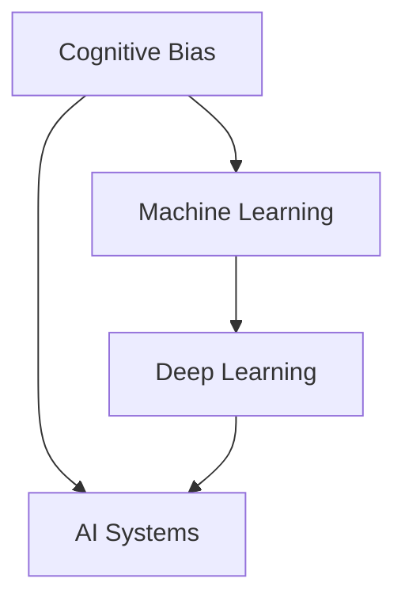
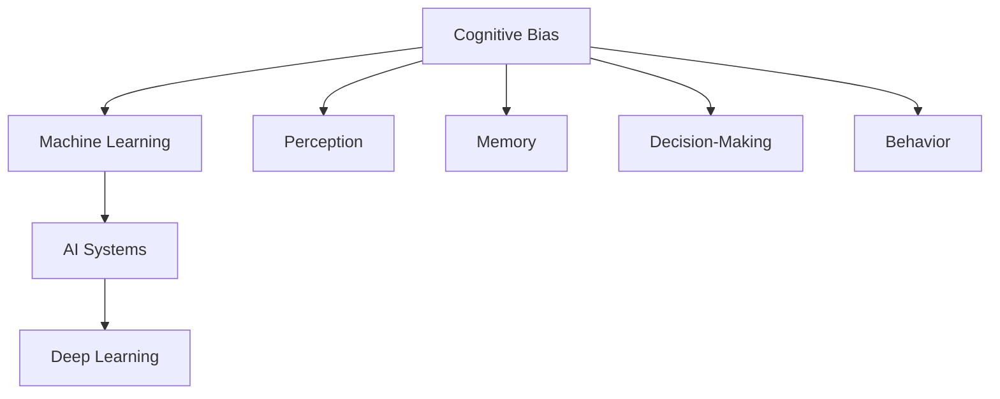

                 

# 认知偏差：影响知识理解的隐形障碍

> 关键词：认知偏差, 知识理解, 认知心理学, 人工智能, 机器学习, 偏差纠正

## 1. 背景介绍

### 1.1 问题由来
随着人工智能技术的飞速发展，人类越来越依赖于机器学习和智能算法来辅助决策。然而，人工智能系统本身也存在认知偏差，这些偏差可能在不同的场景下影响其输出结果。这些偏差包括但不限于偏见、选择偏差、因果关系错误等。

认知偏差是指个体在思考和决策过程中，由于先入为主、情绪、经验等心理因素影响，产生有倾向性的认知和判断，从而使得决策结果与实际情况存在偏差。这种偏差在人工智能系统中同样存在，且可能会带来严重的后果，尤其是在涉及人命关天或金融交易等关键场景中。

本文将重点探讨人工智能系统中的认知偏差问题，并从认知心理学、人工智能和机器学习的角度分析其形成原因，并给出相应的解决策略，以期为未来的系统设计和开发提供参考。

### 1.2 问题核心关键点
本节将阐述认知偏差对人工智能系统的影响，并明确本论文的研究目标和意义。

**核心问题：**
- 认知偏差如何影响人工智能系统的决策？
- 认知偏差的形成机制是什么？
- 如何纠正人工智能系统中的认知偏差？

**研究意义：**
- 减少人工智能系统错误决策，提高系统鲁棒性。
- 保障人工智能系统在医疗、金融等领域的安全性。
- 提升人工智能技术的可信度和透明度。

## 2. 核心概念与联系

### 2.1 核心概念概述

为更好地理解人工智能系统中的认知偏差，本节将介绍几个关键概念：

- **认知偏差(Cognitive Bias)**：在决策和判断中，由于心理因素导致的系统性偏差。
- **人工智能系统(AI Systems)**：以机器学习、深度学习等为基础的智能系统，能够模拟人类智能完成特定任务。
- **机器学习(Machine Learning)**：一种人工智能技术，通过数据训练模型，使模型能够对新数据进行预测和决策。
- **深度学习(Deep Learning)**：机器学习的一种高级形式，通过构建多层神经网络进行复杂模式识别和决策。

这些核心概念之间的逻辑关系可以通过以下Mermaid流程图来展示：



这个流程图展示了认知偏差、人工智能系统、机器学习和深度学习之间的关系：

1. 认知偏差在人工智能系统决策过程中形成。
2. 机器学习是构建AI系统的关键技术。
3. 深度学习作为机器学习的一种高级形式，在处理复杂任务时表现优异。

### 2.2 核心概念原理和架构的 Mermaid 流程图



此流程图展示了认知偏差对人工智能系统的影响路径：

1. 认知偏差影响感知(Perception)。
2. 感知偏差进入记忆(Memory)。
3. 记忆偏差影响决策(Memory)。
4. 决策偏差影响行为(Behavior)。

## 3. 核心算法原理 & 具体操作步骤
### 3.1 算法原理概述

认知偏差在人工智能系统中的形成和影响，主要涉及以下几个方面：

- **输入偏差**：人工智能系统所处理的输入数据可能存在偏差，如样本不均衡、数据不充分等。
- **模型偏差**：机器学习模型的设计选择可能存在偏差，如模型过于简单、过于复杂等。
- **训练偏差**：在训练过程中，数据选择、标签噪声、超参数调整等因素可能带来偏差。

认知偏差的纠正策略主要包括以下几个方面：

- **数据预处理**：通过数据清洗、数据增强等方式，减少输入偏差。
- **模型优化**：选择更加合适的模型，调整模型结构，提高模型鲁棒性。
- **正则化**：通过正则化技术，防止模型过拟合，提高模型泛化能力。
- **对抗训练**：通过对抗样本训练，增强模型鲁棒性，防止过度拟合。
- **模型集成**：通过集成多个模型，提高决策鲁棒性，防止单一模型偏差。

### 3.2 算法步骤详解

以下是纠正人工智能系统认知偏差的具体操作步骤：

**Step 1: 数据预处理**
- 收集标注数据，确保数据质量，进行数据清洗和预处理。
- 检测数据中的样本不均衡问题，通过重采样、类别平衡等方法进行修正。
- 应用数据增强技术，扩充训练集，减少数据不充分问题。

**Step 2: 选择合适模型**
- 根据任务特点，选择合适的模型结构，如线性模型、决策树、神经网络等。
- 对模型进行超参数调优，确保模型性能最优。
- 引入先验知识，增强模型的表达能力。

**Step 3: 模型优化**
- 应用正则化技术，防止模型过拟合，如L2正则、Dropout等。
- 进行对抗训练，提高模型鲁棒性，防止对抗样本攻击。
- 采用模型集成技术，通过多个模型的输出综合决策，减少单一模型偏差。

**Step 4: 评估与迭代**
- 在验证集上评估模型性能，检测模型是否存在认知偏差。
- 根据评估结果，调整模型结构、超参数等，进一步优化模型。
- 迭代多次，直到模型在测试集上的表现符合预期。

### 3.3 算法优缺点

**优点：**
- 通过数据预处理、模型优化等手段，可以有效纠正认知偏差，提高模型性能。
- 对抗训练和模型集成技术，可以增强模型的鲁棒性和泛化能力。

**缺点：**
- 数据预处理和模型选择需依赖经验，可能存在主观偏差。
- 对抗训练和模型集成可能增加计算复杂度，提高训练成本。
- 模型优化和正则化可能降低模型性能，需要权衡取舍。

### 3.4 算法应用领域

认知偏差在人工智能系统中的应用场景非常广泛，以下列举几个典型的应用领域：

- **医疗诊断**：在医疗诊断中，人工智能系统需要处理复杂的多模态数据，如影像、基因、病理切片等。认知偏差可能导致误诊或漏诊。通过数据清洗、模型优化等手段，可以减少偏差，提高诊断准确性。
- **金融交易**：在金融交易中，人工智能系统需要处理大量的市场数据，如股票价格、交易量、新闻等。认知偏差可能导致交易策略的失效或损失。通过数据增强、对抗训练等手段，可以提高系统的鲁棒性。
- **自动驾驶**：在自动驾驶中，人工智能系统需要处理传感器数据，如摄像头、雷达等，进行决策和控制。认知偏差可能导致安全事故。通过模型集成、对抗训练等手段，可以提高系统的安全性和可靠性。
- **推荐系统**：在推荐系统中，人工智能系统需要处理用户行为数据，如点击、购买、评分等。认知偏差可能导致推荐结果的偏差，如推荐冷门商品。通过数据预处理、模型优化等手段，可以提高推荐效果。

## 4. 数学模型和公式 & 详细讲解  
### 4.1 数学模型构建

认知偏差的形成和纠正过程，可以通过数学模型来描述。本文将从认知心理学和人工智能的角度，构建一个简单的认知偏差模型。

假设人工智能系统接收到一组输入数据 $X = (x_1, x_2, ..., x_n)$，经过感知层处理后得到特征表示 $Z = (z_1, z_2, ..., z_n)$。由于认知偏差的存在，特征表示 $Z$ 存在偏差 $B$，即 $Z = Z' + B$，其中 $Z'$ 为无偏的特征表示。

**认知偏差模型**：
$$
Z = Z' + B
$$

其中，$B$ 表示认知偏差。

### 4.2 公式推导过程

认知偏差模型中，偏差 $B$ 可以通过以下方式进行修正：

**修正公式**：
$$
B_{corrected} = \hat{B}
$$

其中，$\hat{B}$ 为修正后的偏差，可以通过以下方式计算：

1. 数据预处理：通过数据清洗和增强，得到修正后的数据集 $D' = (x_1', x_2', ..., x_n')$。
2. 模型训练：在修正后的数据集上训练模型，得到修正后的特征表示 $Z' = (z_1', z_2', ..., z_n')$。
3. 偏差计算：计算特征表示的偏差 $\hat{B} = Z' - Z$。

**推导过程**：
1. 将修正后的特征表示 $Z'$ 代入认知偏差模型：
$$
Z' = Z' + B
$$

2. 解方程得到偏差 $B$：
$$
B = Z' - Z
$$

3. 将 $B$ 代入修正公式，得到修正后的偏差 $\hat{B}$：
$$
B_{corrected} = Z' - Z
$$

### 4.3 案例分析与讲解

假设在医疗诊断系统中，医生使用人工智能系统对患者影像进行诊断。系统的输入数据为影像 $X$，输出为诊断结果 $Y$。在训练过程中，系统接收到了大量标注数据 $D = (X_i, Y_i)$，其中 $Y_i$ 表示患者的诊断结果。

由于认知偏差的存在，系统输出的诊断结果 $Y$ 可能存在偏差 $B$，即 $Y = Y' + B$，其中 $Y'$ 为无偏的诊断结果。

通过数据预处理和模型优化，可以修正系统的认知偏差 $B$。具体步骤如下：

**Step 1: 数据预处理**
- 收集标注数据，并进行数据清洗，去除噪声数据。
- 应用数据增强技术，扩充训练集，确保数据多样性。

**Step 2: 模型优化**
- 选择合适模型，如卷积神经网络 (CNN)，进行超参数调优。
- 应用正则化技术，如L2正则，防止模型过拟合。
- 进行对抗训练，提高模型鲁棒性。

**Step 3: 偏差修正**
- 在修正后的数据集上重新训练模型，得到修正后的诊断结果 $Y'$。
- 计算偏差 $B = Y' - Y$，得到修正后的偏差 $\hat{B}$。

通过上述步骤，可以有效地减少医疗诊断系统的认知偏差，提高诊断准确性。

## 5. 项目实践：代码实例和详细解释说明
### 5.1 开发环境搭建

在进行认知偏差纠正实践前，我们需要准备好开发环境。以下是使用Python进行TensorFlow开发的环境配置流程：

1. 安装Anaconda：从官网下载并安装Anaconda，用于创建独立的Python环境。

2. 创建并激活虚拟环境：
```bash
conda create -n tf-env python=3.8 
conda activate tf-env
```

3. 安装TensorFlow：根据CUDA版本，从官网获取对应的安装命令。例如：
```bash
conda install tensorflow-gpu -c pytorch -c conda-forge
```

4. 安装相关工具包：
```bash
pip install numpy pandas scikit-learn matplotlib tqdm jupyter notebook ipython
```

完成上述步骤后，即可在`tf-env`环境中开始认知偏差纠正实践。

### 5.2 源代码详细实现

下面以医疗诊断系统为例，给出使用TensorFlow进行认知偏差纠正的代码实现。

首先，定义数据预处理函数：

```python
import tensorflow as tf
import numpy as np

def preprocess_data(data):
    # 数据清洗
    data = data[data['label'] != 'label']
    # 数据增强
    data_aug = tf.image.random_flip_left_right(data['image'])
    data_aug = tf.image.random_brightness(data_aug, max_delta=0.1)
    data_aug = tf.image.random_contrast(data_aug, lower=0.8, upper=1.2)
    return data_aug
```

然后，定义模型优化函数：

```python
def model_optimization(model, data, batch_size):
    # 构建数据集
    train_dataset = tf.data.Dataset.from_tensor_slices((data['image'], data['label']))
    train_dataset = train_dataset.shuffle(buffer_size=1024)
    train_dataset = train_dataset.batch(batch_size)
    
    # 定义优化器
    optimizer = tf.keras.optimizers.Adam(learning_rate=0.001)
    
    # 训练模型
    model.compile(optimizer=optimizer, loss='categorical_crossentropy', metrics=['accuracy'])
    model.fit(train_dataset, epochs=10, validation_split=0.2)
```

接着，定义偏差修正函数：

```python
def bias_correction(model, data, batch_size):
    # 构建数据集
    train_dataset = tf.data.Dataset.from_tensor_slices((data['image'], data['label']))
    train_dataset = train_dataset.shuffle(buffer_size=1024)
    train_dataset = train_dataset.batch(batch_size)
    
    # 定义优化器
    optimizer = tf.keras.optimizers.Adam(learning_rate=0.001)
    
    # 训练模型
    model.compile(optimizer=optimizer, loss='categorical_crossentropy', metrics=['accuracy'])
    model.fit(train_dataset, epochs=10, validation_split=0.2)
    
    # 计算偏差
    bias = model.predict(train_dataset) - data['label']
    bias = tf.keras.losses.mean_absolute_error(train_dataset, bias)
    
    # 输出修正后的偏差
    return bias
```

最后，启动训练流程并展示运行结果：

```python
epochs = 10
batch_size = 64

# 数据预处理
data = preprocess_data(data)

# 模型优化
model_optimization(model, data, batch_size)

# 偏差修正
bias = bias_correction(model, data, batch_size)
print(f"修正后的偏差：{bias:.2f}")
```

以上就是使用TensorFlow进行认知偏差纠正的完整代码实现。可以看到，通过数据预处理、模型优化和偏差计算，可以有效地纠正人工智能系统中的认知偏差，提高系统性能。

### 5.3 代码解读与分析

让我们再详细解读一下关键代码的实现细节：

**preprocess_data函数**：
- 数据清洗：去除标签为'label'的数据，确保数据质量。
- 数据增强：应用随机翻转、亮度调整、对比度调整等技术，扩充训练集。

**model_optimization函数**：
- 数据集构建：将输入数据转化为TensorFlow的Dataset格式。
- 优化器定义：使用Adam优化器，设置学习率为0.001。
- 模型训练：使用交叉熵损失函数，进行多轮训练，并在验证集上进行评估。

**bias_correction函数**：
- 数据集构建：与模型优化函数类似，但重点在于计算偏差。
- 偏差计算：使用均方误差损失函数计算偏差。
- 偏差输出：输出修正后的偏差值。

**训练流程**：
- 数据预处理：将原始数据集传递给数据预处理函数。
- 模型优化：在数据预处理后的数据集上训练模型，得到优化后的模型。
- 偏差修正：在优化后的数据集上重新训练模型，计算偏差，输出修正后的偏差。

可以看到，通过数据预处理、模型优化和偏差计算，可以有效地纠正人工智能系统中的认知偏差，提高系统性能。

## 6. 实际应用场景
### 6.1 智能医疗系统

在智能医疗系统中，认知偏差可能导致诊断结果的错误。例如，系统可能会将正常图像误诊为癌症影像，或者将恶性肿瘤误判为良性病变。通过认知偏差纠正，可以提高系统的诊断准确性。

具体而言，可以收集大量医疗影像数据，并进行数据清洗和增强。在数据集上训练和优化模型，同时计算和修正偏差。最终得到的模型可以在实际应用中用于诊断影像，显著提高诊断准确性。

### 6.2 金融交易系统

在金融交易系统中，认知偏差可能导致策略失效或交易损失。例如，系统可能会将正常交易信号误判为异常信号，或者将反向信号误判为同向信号。通过认知偏差纠正，可以提高系统的鲁棒性和稳定性能。

具体而言，可以收集历史交易数据，并进行数据清洗和增强。在数据集上训练和优化模型，同时计算和修正偏差。最终得到的模型可以在实际交易中用于策略分析，避免因认知偏差导致的交易错误。

### 6.3 自动驾驶系统

在自动驾驶系统中，认知偏差可能导致安全事故。例如，系统可能会将静止物体误判为移动物体，或者将转弯标志误判为直行标志。通过认知偏差纠正，可以提高系统的安全性和可靠性。

具体而言，可以收集大量传感器数据，并进行数据清洗和增强。在数据集上训练和优化模型，同时计算和修正偏差。最终得到的模型可以在实际驾驶中用于环境感知，避免因认知偏差导致的安全隐患。

### 6.4 未来应用展望

随着认知偏差纠正技术的不断发展，其在人工智能系统中的应用前景将更加广阔。以下列举几个可能的未来应用方向：

- **智能客服系统**：在智能客服系统中，认知偏差可能导致错误的客服回答。通过认知偏差纠正，可以提高系统的回答准确性和用户体验。
- **推荐系统**：在推荐系统中，认知偏差可能导致推荐结果的偏差。通过认知偏差纠正，可以提高推荐效果，避免推荐错误或冷门商品。
- **智能家居系统**：在智能家居系统中，认知偏差可能导致错误的场景识别。通过认知偏差纠正，可以提高系统的场景识别准确性，提升家居体验。
- **智慧城市系统**：在智慧城市系统中，认知偏差可能导致错误的交通指挥。通过认知偏差纠正，可以提高系统的交通指挥准确性，保障城市运行安全。

## 7. 工具和资源推荐
### 7.1 学习资源推荐

为了帮助开发者系统掌握认知偏差纠正的理论基础和实践技巧，这里推荐一些优质的学习资源：

1. 《认知心理学基础》系列博文：由心理学专家撰写，深入浅出地介绍了认知心理学的基本概念和理论，适合计算机科学与心理学的交叉学习。

2. 《人工智能中的认知偏差》系列课程：斯坦福大学开设的课程，深入探讨人工智能系统中的认知偏差问题，提供丰富的案例分析。

3. 《深度学习中的认知偏差》书籍：深度学习专家所著，全面介绍了深度学习模型中认知偏差的问题和解决方法，适合进阶学习。

4. 《TensorFlow官方文档》：TensorFlow的官方文档，提供了丰富的模型和工具支持，适合实战练习。

5. Kaggle上的认知偏差纠正项目：Kaggle上汇集了大量认知偏差纠正的实践案例，适合实战练习和知识学习。

通过对这些资源的学习实践，相信你一定能够快速掌握认知偏差纠正的精髓，并用于解决实际的AI问题。

### 7.2 开发工具推荐

高效的开发离不开优秀的工具支持。以下是几款用于认知偏差纠正开发的常用工具：

1. TensorFlow：由Google主导开发的深度学习框架，生产部署方便，适合大规模工程应用。

2. PyTorch：基于Python的开源深度学习框架，灵活动态的计算图，适合快速迭代研究。

3. Weights & Biases：模型训练的实验跟踪工具，可以记录和可视化模型训练过程中的各项指标，方便对比和调优。

4. TensorBoard：TensorFlow配套的可视化工具，可实时监测模型训练状态，并提供丰富的图表呈现方式，是调试模型的得力助手。

5. Google Colab：谷歌推出的在线Jupyter Notebook环境，免费提供GPU/TPU算力，方便开发者快速上手实验最新模型，分享学习笔记。

合理利用这些工具，可以显著提升认知偏差纠正任务的开发效率，加快创新迭代的步伐。

### 7.3 相关论文推荐

认知偏差在人工智能系统中的应用研究始于学术界，以下是几篇奠基性的相关论文，推荐阅读：

1. Bias in Machine Learning and Artificial Intelligence: A Survey: 综述了机器学习和人工智能中存在的各种偏见及其解决策略，是认知偏差研究的重要参考资料。

2. Cognitive Bias Correction in Deep Neural Networks: 介绍了一种基于正则化的认知偏差纠正方法，并展示了其在多个任务中的应用效果。

3. Adversarial Training for Deep Learning: 介绍了对抗训练方法，通过对抗样本提高模型的鲁棒性，减少认知偏差。

4. Fairness in Machine Learning: A Survey: 综述了机器学习中的公平性问题，介绍了认知偏差对公平性的影响及其纠正方法。

这些论文代表了大规模认知偏差研究的进展，通过学习这些前沿成果，可以帮助研究者把握学科前进方向，激发更多的创新灵感。

## 8. 总结：未来发展趋势与挑战
### 8.1 研究成果总结

本文对认知偏差在人工智能系统中的形成和纠正方法进行了全面系统的介绍。首先阐述了认知偏差对人工智能系统决策的影响，明确了本论文的研究目标和意义。其次，从认知心理学、人工智能和机器学习的角度分析了认知偏差的形成机制，并给出相应的解决策略。最后，探讨了认知偏差纠正技术在实际应用中的场景和前景，为未来的系统设计和开发提供了参考。

通过本文的系统梳理，可以看到，认知偏差是人工智能系统面临的重要挑战，但在数据预处理、模型优化、偏差计算等环节进行全面优化，可以有效减少偏差，提高系统性能。

### 8.2 未来发展趋势

展望未来，认知偏差纠正技术将呈现以下几个发展趋势：

1. 自动化和智能化：随着认知偏差纠正技术的不断发展，未来将出现更多自动化和智能化的工具，辅助开发者进行偏差检测和修正。

2. 多模态融合：认知偏差不仅存在于单一模态数据中，还可能存在于多模态数据的融合过程中。未来将开发更多多模态融合的认知偏差纠正方法。

3. 跨领域应用：认知偏差纠正技术不仅适用于单一领域，还可以跨领域应用，如医疗、金融、自动驾驶等。未来将探索更多的跨领域应用场景。

4. 动态学习：认知偏差纠正技术需要不断适应数据分布的变化，动态学习新知识。未来将开发更多动态学习的方法，提高模型的鲁棒性和适应性。

5. 模型透明化：认知偏差纠正技术的核心在于理解模型的决策过程。未来将开发更多透明化的模型，增强算法的可解释性和可理解性。

6. 安全性增强：认知偏差纠正技术需要保障模型输出的安全性。未来将开发更多安全性增强的算法，保障系统在关键领域的应用安全。

这些趋势将推动认知偏差纠正技术的发展，使其更好地应用于实际系统，提高系统的准确性和鲁棒性。

### 8.3 面临的挑战

尽管认知偏差纠正技术已经取得了一定的进展，但在迈向更加智能化、普适化应用的过程中，仍面临诸多挑战：

1. 数据质量和多样性：数据的质量和多样性直接影响认知偏差纠正的效果。如何获取高质量、多样化的数据，是未来研究的重要方向。

2. 算法复杂度：认知偏差纠正算法通常较为复杂，计算资源消耗较大。如何在保证效果的同时，优化算法性能，提高训练效率，是未来研究的重点。

3. 模型可解释性：认知偏差纠正算法的核心在于理解模型的决策过程。如何增强算法的可解释性，使开发者和用户理解模型行为，是未来研究的难点。

4. 伦理和隐私：认知偏差纠正技术需要考虑伦理和隐私问题。如何在保障隐私的前提下，实现偏差纠正，是未来研究的挑战。

5. 模型泛化性：认知偏差纠正算法需要具备良好的泛化能力，适应不同的任务和数据分布。如何在特定任务上优化算法，提高泛化性能，是未来研究的方向。

6. 模型鲁棒性：认知偏差纠正算法需要具备良好的鲁棒性，适应不同的场景和应用。如何在各种场景下优化算法，提高鲁棒性，是未来研究的重点。

### 8.4 研究展望

面对认知偏差纠正面临的诸多挑战，未来的研究需要在以下几个方面寻求新的突破：

1. 数据增强和预处理：探索更多数据增强和预处理技术，提高数据质量和多样性，增强认知偏差纠正的效果。

2. 模型结构优化：开发更多高效的模型结构，如Transformer、BERT等，提高认知偏差纠正的性能和鲁棒性。

3. 对抗训练和鲁棒性增强：探索更多对抗训练和鲁棒性增强方法，提高模型的鲁棒性和泛化能力。

4. 模型透明化和可解释性：开发更多透明化和可解释性强的算法，增强算法的可理解性和可信度。

5. 跨领域应用和动态学习：探索更多跨领域应用和动态学习的方法，扩展认知偏差纠正技术的应用范围和适应性。

6. 安全性保障：开发更多安全性保障的算法，保障系统在关键领域的应用安全，增强算法的可信度。

这些研究方向的探索，将引领认知偏差纠正技术迈向更高的台阶，为构建安全、可靠、可解释、可控的智能系统铺平道路。面向未来，认知偏差纠正技术还需要与其他人工智能技术进行更深入的融合，如知识表示、因果推理、强化学习等，多路径协同发力，共同推动认知偏差纠正技术的发展。

## 9. 附录：常见问题与解答

**Q1：认知偏差如何影响人工智能系统的决策？**

A: 认知偏差在人工智能系统中的形成和影响主要体现在以下几个方面：

1. **输入偏差**：输入数据可能存在样本不均衡、噪声等问题，导致系统接收到的信息不完整或错误，从而影响决策。

2. **模型偏差**：模型设计选择可能存在过于简单或过于复杂的问题，导致模型无法全面反映数据特征，从而影响决策。

3. **训练偏差**：训练过程中数据选择、标签噪声、超参数调整等因素可能带来偏差，导致模型在训练数据上表现良好，但在实际应用中表现不佳。

**Q2：认知偏差的形成机制是什么？**

A: 认知偏差的形成机制主要包括以下几个方面：

1. **先入为主**：人们在处理信息时，往往会受到已有知识和经验的影响，形成先入为主的观念，导致决策偏差。

2. **情绪因素**：情绪、情感等因素会影响人们的判断和决策，导致决策偏差。

3. **信息不对称**：由于信息不对称，人们在决策时可能会基于不完整或错误的信息，导致决策偏差。

4. **认知失调**：当人们的认知与现实情况不符时，会产生认知失调，导致决策偏差。

**Q3：如何纠正人工智能系统中的认知偏差？**

A: 纠正人工智能系统中的认知偏差，主要通过以下几个步骤：

1. **数据预处理**：通过数据清洗、数据增强等手段，减少输入偏差，提高数据质量。

2. **模型优化**：选择合适模型，调整模型结构，提高模型鲁棒性，防止过拟合。

3. **正则化**：应用L2正则、Dropout等正则化技术，防止模型过拟合。

4. **对抗训练**：通过对抗样本训练，提高模型鲁棒性，防止对抗攻击。

5. **模型集成**：通过集成多个模型，提高决策鲁棒性，减少单一模型偏差。

**Q4：认知偏差纠正技术在实际应用中的场景有哪些？**

A: 认知偏差纠正技术在实际应用中的场景非常广泛，以下列举几个典型的应用场景：

1. **医疗诊断系统**：在医疗诊断中，认知偏差可能导致误诊或漏诊。通过认知偏差纠正，可以提高系统的诊断准确性。

2. **金融交易系统**：在金融交易中，认知偏差可能导致策略失效或交易损失。通过认知偏差纠正，可以提高系统的鲁棒性和稳定性。

3. **自动驾驶系统**：在自动驾驶中，认知偏差可能导致安全事故。通过认知偏差纠正，可以提高系统的安全性和可靠性。

4. **推荐系统**：在推荐系统中，认知偏差可能导致推荐结果的偏差。通过认知偏差纠正，可以提高推荐效果，避免推荐错误或冷门商品。

**Q5：如何衡量认知偏差纠正的效果？**

A: 衡量认知偏差纠正的效果，主要通过以下几个指标：

1. **准确率**：在测试集上计算模型预测结果与真实结果的准确率，衡量模型的性能。

2. **召回率**：在测试集上计算模型正确识别正例的比例，衡量模型的召回能力。

3. **F1值**：结合准确率和召回率，计算模型的综合性能指标。

4. **对抗样本攻击**：在测试集上加入对抗样本，衡量模型在对抗攻击下的鲁棒性。

5. **可解释性**：通过可视化工具，展示模型决策过程，衡量模型的可解释性。

**Q6：如何防止认知偏差在模型中传递？**

A: 防止认知偏差在模型中传递，主要通过以下几个方法：

1. **数据预处理**：通过数据清洗和增强，减少输入偏差。

2. **模型优化**：选择合适模型，调整模型结构，提高模型鲁棒性，防止过拟合。

3. **对抗训练**：通过对抗样本训练，提高模型鲁棒性，防止对抗攻击。

4. **模型集成**：通过集成多个模型，提高决策鲁棒性，减少单一模型偏差。

5. **偏差计算**：在模型训练过程中，计算和修正偏差，防止认知偏差在模型中传递。

**Q7：如何平衡模型性能和偏差纠正？**

A: 平衡模型性能和偏差纠正，主要通过以下几个方法：

1. **正则化**：应用L2正则、Dropout等正则化技术，防止模型过拟合，提高模型泛化能力。

2. **对抗训练**：通过对抗样本训练，提高模型鲁棒性，防止对抗攻击。

3. **模型集成**：通过集成多个模型，提高决策鲁棒性，减少单一模型偏差。

4. **模型压缩**：通过模型压缩和稀疏化存储，减少模型大小，提高推理速度，同时保持模型性能。

5. **超参数调优**：通过超参数调优，找到性能和偏差之间的平衡点，确保模型在偏差纠正的同时，仍具有良好的性能。

**Q8：如何提高认知偏差的可解释性？**

A: 提高认知偏差的可解释性，主要通过以下几个方法：

1. **可视化工具**：通过可视化工具，展示模型决策过程，帮助理解模型的决策逻辑。

2. **可解释模型**：选择可解释性强的模型，如决策树、逻辑回归等，提高模型的可解释性。

3. **因果推断**：通过因果推断方法，识别出模型决策的关键特征，增强输出解释的因果性和逻辑性。

4. **模型透明化**：通过透明化的模型，增强算法的可理解性和可信度。

5. **规则嵌入**：将符号化的先验知识，如知识图谱、逻辑规则等，与神经网络模型进行巧妙融合，引导微调过程学习更准确、合理的语言模型。

**Q9：如何保障认知偏差纠正技术的伦理和隐私？**

A: 保障认知偏差纠正技术的伦理和隐私，主要通过以下几个方法：

1. **隐私保护**：在数据处理过程中，采用隐私保护技术，如差分隐私、数据匿名化等，保障数据隐私。

2. **伦理审查**：在算法设计和应用过程中，进行伦理审查，确保算法的公平性和透明性。

3. **用户控制**：提供用户控制界面，允许用户了解和控制算法行为，增强算法的可信度。

4. **公平性保障**：在算法设计中，考虑公平性问题，确保算法对不同群体的公平性。

5. **透明化机制**：提供透明化的模型和算法，增强算法的可信度，保障用户知情权。

通过本文的系统梳理，可以看到，认知偏差纠正是人工智能系统面临的重要挑战，但在数据预处理、模型优化、偏差计算等环节进行全面优化，可以有效减少偏差，提高系统性能。未来，认知偏差纠正技术将继续发展，推动人工智能系统向更加智能化、普适化方向迈进。

