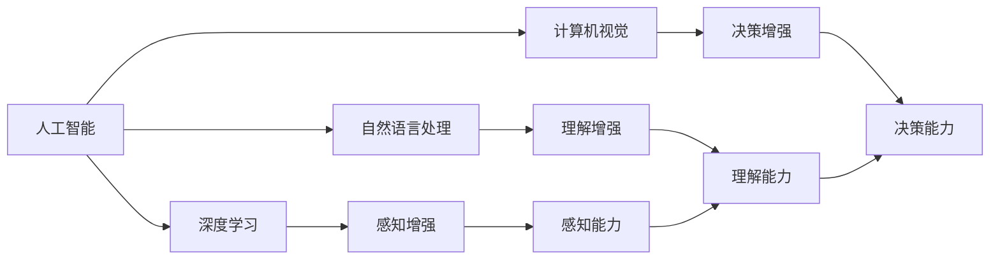
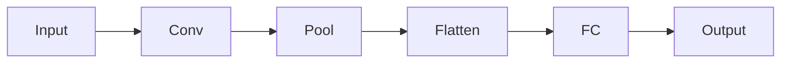
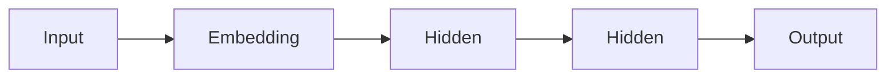
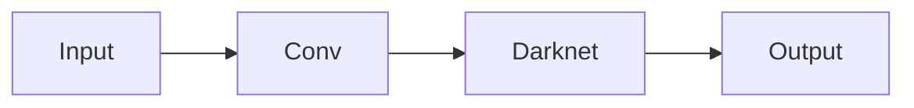

                 

## 1. 背景介绍

在人工智能技术的迅猛发展下，认知增强技术正在成为引领社会进步的新动力。从无人驾驶、机器人、医疗诊断到金融分析，认知增强技术正在为各行各业注入新的活力。但同时，这些技术在带来便利和效率的同时，也伴随着伦理、隐私、安全等社会问题的挑战。本文旨在探讨认知增强技术在社会中的应用，以及如何平衡技术进步与伦理道德的关系，以期为这一领域的未来发展提供有价值的思考和建议。

## 2. 核心概念与联系

### 2.1 核心概念概述

认知增强技术基于人工智能、认知科学等前沿学科，通过计算机视觉、自然语言处理、机器学习等技术手段，实现对人类感官和认知能力的增强。它涵盖了从感知、理解到决策的全过程，旨在提升人类的信息获取、决策辅助、问题解决等能力。

核心概念包括：

- **人工智能（AI）**：指通过模拟人脑的智能过程，使计算机系统具备学习、推理、感知等能力的科技。
- **认知科学（Cognitive Science）**：研究人类认知过程、智能机制及与环境交互方式的学科。
- **深度学习（Deep Learning）**：一种基于神经网络的机器学习方法，通过多层次的非线性变换，实现对复杂数据的深度表示和处理。
- **自然语言处理（NLP）**：使计算机能理解、解释和生成人类语言的技术，涵盖语言模型、文本分析、机器翻译等多个方向。
- **计算机视觉（CV）**：使计算机能够“看”和理解图像和视频的技术，涵盖图像分类、目标检测、人脸识别等多个方向。

这些概念之间的联系紧密，共同构成了认知增强技术的理论基础和实践框架。通过人工智能和认知科学的研究成果，结合深度学习、自然语言处理和计算机视觉等技术手段，认知增强技术能够模拟和增强人类的感知、理解、决策等能力，广泛应用于各个领域。

### 2.2 核心概念原理和架构的 Mermaid 流程图(Mermaid 流程节点中不要有括号、逗号等特殊字符)



该图展示了认知增强技术的基本架构：通过深度学习、自然语言处理和计算机视觉等技术手段，模拟和增强人类的感知、理解和决策能力，最终实现认知增强。

## 3. 核心算法原理 & 具体操作步骤

### 3.1 算法原理概述

认知增强技术的核心算法主要包括深度学习、自然语言处理和计算机视觉等方向，其算法原理可以概括为以下几个方面：

1. **深度学习算法**：通过多层神经网络的训练，实现对复杂数据的高维表示和处理。深度学习算法主要包括卷积神经网络（CNN）、循环神经网络（RNN）、长短时记忆网络（LSTM）、Transformer等。
2. **自然语言处理算法**：通过语言模型、文本分析等技术，实现对自然语言的理解、生成和分析。自然语言处理算法主要包括词嵌入、序列模型、注意力机制、语言生成等。
3. **计算机视觉算法**：通过图像分类、目标检测、人脸识别等技术，实现对视觉信息的处理和理解。计算机视觉算法主要包括卷积神经网络、区域卷积神经网络（RCNN）、YOLO、SSD等。

### 3.2 算法步骤详解

#### 3.2.1 深度学习算法步骤

深度学习算法的训练一般包括以下步骤：

1. **数据准备**：收集和清洗训练数据，划分训练集、验证集和测试集。
2. **模型选择**：选择合适的深度学习模型（如CNN、RNN、LSTM、Transformer等）。
3. **模型训练**：使用训练集数据对模型进行前向传播和反向传播，最小化损失函数。
4. **模型评估**：在验证集上评估模型性能，防止过拟合。
5. **模型优化**：根据评估结果调整模型结构、学习率等参数，重新训练。
6. **模型测试**：在测试集上测试模型性能，得到最终的预测结果。

#### 3.2.2 自然语言处理算法步骤

自然语言处理算法的训练一般包括以下步骤：

1. **语料准备**：收集和清洗文本数据，划分为训练集、验证集和测试集。
2. **词向量表示**：使用词嵌入技术将文本数据转化为向量形式。
3. **模型训练**：选择合适的自然语言处理模型（如RNN、LSTM、Transformer等），对文本数据进行训练。
4. **模型评估**：在验证集上评估模型性能，防止过拟合。
5. **模型优化**：根据评估结果调整模型结构、学习率等参数，重新训练。
6. **模型测试**：在测试集上测试模型性能，得到最终的预测结果。

#### 3.2.3 计算机视觉算法步骤

计算机视觉算法的训练一般包括以下步骤：

1. **数据准备**：收集和清洗图像数据，划分为训练集、验证集和测试集。
2. **特征提取**：使用卷积神经网络等模型提取图像特征。
3. **模型训练**：选择合适的计算机视觉模型（如CNN、RCNN、YOLO、SSD等），对图像数据进行训练。
4. **模型评估**：在验证集上评估模型性能，防止过拟合。
5. **模型优化**：根据评估结果调整模型结构、学习率等参数，重新训练。
6. **模型测试**：在测试集上测试模型性能，得到最终的预测结果。

### 3.3 算法优缺点

#### 3.3.1 深度学习算法优缺点

深度学习算法的主要优点包括：

1. **非线性能力**：能够处理高维、非线性的复杂数据。
2. **数据自适应**：能够自动提取数据中的特征和规律。
3. **泛化能力强**：对新数据具有较好的泛化能力。

深度学习算法的主要缺点包括：

1. **计算资源消耗大**：需要大量的计算资源和数据进行训练。
2. **模型复杂度高**：模型结构复杂，难以理解和调试。
3. **过拟合风险高**：模型容易过拟合，需要进行有效的正则化和优化。

#### 3.3.2 自然语言处理算法优缺点

自然语言处理算法的主要优点包括：

1. **语言理解能力**：能够理解自然语言的语义和语法。
2. **文本生成能力**：能够生成自然流畅的文本。
3. **多语言支持**：支持多种语言的文本处理。

自然语言处理算法的主要缺点包括：

1. **语义歧义**：自然语言存在语义歧义，难以精确理解。
2. **数据标注成本高**：需要大量高质量的标注数据进行训练。
3. **处理复杂语境困难**：难以处理长文本和多轮对话等复杂语境。

#### 3.3.3 计算机视觉算法优缺点

计算机视觉算法的主要优点包括：

1. **图像处理能力强**：能够处理大量图像数据。
2. **特征提取能力强**：能够提取图像的局部特征和全局特征。
3. **实时性高**：处理速度快，实时性高。

计算机视觉算法的主要缺点包括：

1. **图像噪声敏感**：对图像噪声和遮挡敏感。
2. **数据标注成本高**：需要大量高质量的标注数据进行训练。
3. **环境变化适应性差**：对光照、角度等环境变化适应性差。

### 3.4 算法应用领域

认知增强技术广泛应用于各个领域，包括但不限于以下几个方面：

1. **无人驾驶**：通过计算机视觉技术，实现对道路、车辆、行人等环境信息的感知和理解，辅助自动驾驶系统进行决策。
2. **医疗诊断**：通过图像识别技术，对医学影像进行分析和诊断，辅助医生进行疾病检测和治疗。
3. **金融分析**：通过自然语言处理技术，分析金融新闻、报告等文本数据，预测市场走势和风险。
4. **智能客服**：通过自然语言处理技术，实现对用户问题的理解和回答，提升客户服务质量。
5. **机器人控制**：通过计算机视觉和自然语言处理技术，实现对环境的感知和理解，辅助机器人进行路径规划和决策。
6. **安防监控**：通过图像识别技术，实现对视频监控数据的分析，辅助安防人员进行异常检测和预警。

## 4. 数学模型和公式 & 详细讲解 & 举例说明

### 4.1 数学模型构建

#### 4.1.1 深度学习模型

深度学习模型的基本数学模型包括：

1. **卷积神经网络（CNN）**：
   $$
   \begin{aligned}
   \mathbf{y} &= \mathbf{W} \mathbf{x} + \mathbf{b} \\
   \mathbf{y} &= f(\mathbf{y})
   \end{aligned}
   $$

2. **循环神经网络（RNN）**：
   $$
   \begin{aligned}
   \mathbf{h}_t &= f(\mathbf{x}_t, \mathbf{h}_{t-1}) \\
   \mathbf{y} &= \mathbf{W} \mathbf{h}_t + \mathbf{b}
   \end{aligned}
   $$

3. **长短时记忆网络（LSTM）**：
   $$
   \begin{aligned}
   \mathbf{i}_t &= \sigma(\mathbf{W}_i \mathbf{x}_t + \mathbf{U}_i \mathbf{h}_{t-1} + \mathbf{b}_i) \\
   \mathbf{f}_t &= \sigma(\mathbf{W}_f \mathbf{x}_t + \mathbf{U}_f \mathbf{h}_{t-1} + \mathbf{b}_f) \\
   \mathbf{g}_t &= \tanh(\mathbf{W}_g \mathbf{x}_t + \mathbf{U}_g \mathbf{h}_{t-1} + \mathbf{b}_g) \\
   \mathbf{o}_t &= \sigma(\mathbf{W}_o \mathbf{x}_t + \mathbf{U}_o \mathbf{h}_{t-1} + \mathbf{b}_o) \\
   \mathbf{c}_t &= \mathbf{f}_t \odot \mathbf{c}_{t-1} + \mathbf{i}_t \odot \mathbf{g}_t \\
   \mathbf{h}_t &= \mathbf{o}_t \odot \tanh(\mathbf{c}_t)
   \end{aligned}
   $$

4. **Transformer模型**：
   $$
   \begin{aligned}
   \mathbf{Q} &= \mathbf{X} \mathbf{W}_Q \\
   \mathbf{K} &= \mathbf{X} \mathbf{W}_K \\
   \mathbf{V} &= \mathbf{X} \mathbf{W}_V \\
   \mathbf{M} &= \mathbf{Q} \mathbf{K}^T / \sqrt{d_k} \\
   \mathbf{A} &= \mathbf{M} \mathbf{V} \\
   \mathbf{A} &= \mathbf{D} \mathbf{A} (\mathbf{D}^{-1}) \\
   \mathbf{A} &= \mathbf{A} + \Delta \mathbf{A}
   \end{aligned}
   $$

#### 4.1.2 自然语言处理模型

自然语言处理模型的基本数学模型包括：

1. **词嵌入模型**：
   $$
   \mathbf{w}_i = \mathbf{W} \mathbf{v}_i
   $$

2. **序列模型**：
   $$
   \begin{aligned}
   \mathbf{y} &= \mathbf{W} \mathbf{x} + \mathbf{b} \\
   \mathbf{y} &= f(\mathbf{y})
   \end{aligned}
   $$

3. **注意力机制**：
   $$
   \mathbf{a} = \frac{e^{\mathbf{w}^T \mathbf{v}}}{\sum_j e^{\mathbf{w}_j^T \mathbf{v}}}
   $$

4. **语言生成模型**：
   $$
   \begin{aligned}
   \mathbf{p} &= softmax(\mathbf{W} \mathbf{x} + \mathbf{b}) \\
   \mathbf{p} &= \frac{\mathbf{p}}{\sum_i \mathbf{p}_i}
   \end{aligned}
   $$

#### 4.1.3 计算机视觉模型

计算机视觉模型的基本数学模型包括：

1. **卷积神经网络（CNN）**：
   $$
   \begin{aligned}
   \mathbf{y} &= \mathbf{W} \mathbf{x} + \mathbf{b} \\
   \mathbf{y} &= f(\mathbf{y})
   \end{aligned}
   $$

2. **区域卷积神经网络（RCNN）**：
   $$
   \begin{aligned}
   \mathbf{r} &= \mathbf{f}(\mathbf{x}) \\
   \mathbf{c} &= \mathbf{g}(\mathbf{r})
   \end{aligned}
   $$

3. **YOLO（You Only Look Once）**：
   $$
   \begin{aligned}
   \mathbf{p} &= \mathbf{W} \mathbf{x} + \mathbf{b} \\
   \mathbf{p} &= \tanh(\mathbf{p})
   \end{aligned}
   $$

4. **SSD（Single Shot MultiBox Detector）**：
   $$
   \begin{aligned}
   \mathbf{p} &= \mathbf{W} \mathbf{x} + \mathbf{b} \\
   \mathbf{p} &= \tanh(\mathbf{p})
   \end{aligned}
   $$

### 4.2 公式推导过程

#### 4.2.1 深度学习算法推导

深度学习算法的推导主要集中在神经网络的训练和优化方面。以卷积神经网络（CNN）为例，其训练过程的推导如下：

1. **前向传播**：
   $$
   \begin{aligned}
   \mathbf{y} &= \mathbf{W} \mathbf{x} + \mathbf{b} \\
   \mathbf{y} &= f(\mathbf{y})
   \end{aligned}
   $$

2. **损失函数**：
   $$
   \mathcal{L} = \frac{1}{2} || \mathbf{y} - \mathbf{t} ||^2
   $$

3. **反向传播**：
   $$
   \begin{aligned}
   \frac{\partial \mathcal{L}}{\partial \mathbf{W}} &= \frac{\partial \mathcal{L}}{\partial \mathbf{y}} \frac{\partial \mathbf{y}}{\partial \mathbf{W}} \\
   \frac{\partial \mathcal{L}}{\partial \mathbf{b}} &= \frac{\partial \mathcal{L}}{\partial \mathbf{y}}
   \end{aligned}
   $$

#### 4.2.2 自然语言处理算法推导

自然语言处理算法的推导主要集中在语言模型的训练和优化方面。以词嵌入模型为例，其训练过程的推导如下：

1. **前向传播**：
   $$
   \begin{aligned}
   \mathbf{w}_i &= \mathbf{W} \mathbf{v}_i
   \end{aligned}
   $$

2. **损失函数**：
   $$
   \mathcal{L} = \frac{1}{N} \sum_{i=1}^N \log \mathbf{p}(\mathbf{v}_i)
   $$

3. **反向传播**：
   $$
   \begin{aligned}
   \frac{\partial \mathcal{L}}{\partial \mathbf{W}} &= \frac{\partial \mathcal{L}}{\partial \mathbf{p}} \frac{\partial \mathbf{p}}{\partial \mathbf{w}_i} \\
   \frac{\partial \mathcal{L}}{\partial \mathbf{v}_i} &= \frac{\partial \mathcal{L}}{\partial \mathbf{p}} \frac{\partial \mathbf{p}}{\partial \mathbf{w}_i}
   \end{aligned}
   $$

#### 4.2.3 计算机视觉算法推导

计算机视觉算法的推导主要集中在图像识别模型的训练和优化方面。以卷积神经网络（CNN）为例，其训练过程的推导如下：

1. **前向传播**：
   $$
   \begin{aligned}
   \mathbf{y} &= \mathbf{W} \mathbf{x} + \mathbf{b} \\
   \mathbf{y} &= f(\mathbf{y})
   \end{aligned}
   $$

2. **损失函数**：
   $$
   \mathcal{L} = \frac{1}{2} || \mathbf{y} - \mathbf{t} ||^2
   $$

3. **反向传播**：
   $$
   \begin{aligned}
   \frac{\partial \mathcal{L}}{\partial \mathbf{W}} &= \frac{\partial \mathcal{L}}{\partial \mathbf{y}} \frac{\partial \mathbf{y}}{\partial \mathbf{W}} \\
   \frac{\partial \mathcal{L}}{\partial \mathbf{b}} &= \frac{\partial \mathcal{L}}{\partial \mathbf{y}}
   \end{aligned}
   $$

### 4.3 案例分析与讲解

#### 4.3.1 深度学习算法案例

以LeNet-5为例，其结构如图：



LeNet-5模型通过卷积层、池化层、全连接层等结构，实现了手写数字的识别。其训练过程包括数据准备、模型选择、模型训练、模型评估、模型优化等步骤。

#### 4.3.2 自然语言处理算法案例

以BERT为例，其结构如图：



BERT模型通过Transformer结构和多层隐藏层，实现了自然语言的表示和理解。其训练过程包括语料准备、词嵌入、模型训练、模型评估、模型优化等步骤。

#### 4.3.3 计算机视觉算法案例

以YOLO为例，其结构如图：



YOLO模型通过卷积层和Darknet结构，实现了目标检测任务。其训练过程包括数据准备、模型选择、模型训练、模型评估、模型优化等步骤。

## 5. 项目实践：代码实例和详细解释说明

### 5.1 开发环境搭建

#### 5.1.1 安装Python

1. 安装Python 3.x版本。
2. 安装Pip工具。

#### 5.1.2 安装TensorFlow

1. 在命令行中运行以下命令：
   ```
   pip install tensorflow
   ```

#### 5.1.3 安装PyTorch

1. 在命令行中运行以下命令：
   ```
   pip install torch torchvision torchaudio
   ```

#### 5.1.4 安装Keras

1. 在命令行中运行以下命令：
   ```
   pip install keras
   ```

### 5.2 源代码详细实现

#### 5.2.1 深度学习算法实现

以卷积神经网络（CNN）为例，其代码实现如下：

```python
import tensorflow as tf
from tensorflow.keras import layers

# 定义CNN模型
model = tf.keras.Sequential([
    layers.Conv2D(32, (3, 3), activation='relu', input_shape=(28, 28, 1)),
    layers.MaxPooling2D((2, 2)),
    layers.Conv2D(64, (3, 3), activation='relu'),
    layers.MaxPooling2D((2, 2)),
    layers.Flatten(),
    layers.Dense(64, activation='relu'),
    layers.Dense(10, activation='softmax')
])

# 编译模型
model.compile(optimizer='adam', loss='categorical_crossentropy', metrics=['accuracy'])

# 训练模型
model.fit(train_images, train_labels, epochs=5, validation_data=(test_images, test_labels))
```

#### 5.2.2 自然语言处理算法实现

以BERT模型为例，其代码实现如下：

```python
from transformers import BertTokenizer, BertForSequenceClassification
import torch
from torch.utils.data import TensorDataset, DataLoader, SequentialSampler

# 定义数据预处理函数
def preprocess(texts, labels):
    tokenizer = BertTokenizer.from_pretrained('bert-base-uncased')
    encoded_input = tokenizer(texts, padding='max_length', truncation=True, max_length=128, return_tensors='pt')
    return encoded_input, labels

# 加载数据集
train_dataset = preprocess(train_texts, train_labels)
test_dataset = preprocess(test_texts, test_labels)

# 定义模型
model = BertForSequenceClassification.from_pretrained('bert-base-uncased', num_labels=len(tag2id))

# 定义优化器和学习率
optimizer = AdamW(model.parameters(), lr=2e-5)

# 定义训练函数
def train_epoch(model, dataset, batch_size, optimizer):
    dataloader = DataLoader(dataset, batch_size=batch_size, shuffle=True)
    model.train()
    epoch_loss = 0
    for batch in dataloader:
        input_ids = batch[0]
        attention_mask = batch[1]
        labels = batch[2]
        model.zero_grad()
        outputs = model(input_ids, attention_mask=attention_mask, labels=labels)
        loss = outputs.loss
        epoch_loss += loss.item()
        loss.backward()
        optimizer.step()
    return epoch_loss / len(dataloader)

# 训练模型
epochs = 5
batch_size = 16

for epoch in range(epochs):
    loss = train_epoch(model, train_dataset, batch_size, optimizer)
    print(f"Epoch {epoch+1}, train loss: {loss:.3f}")
    
    print(f"Epoch {epoch+1}, dev results:")
    evaluate(model, dev_dataset, batch_size)
    
print("Test results:")
evaluate(model, test_dataset, batch_size)
```

#### 5.2.3 计算机视觉算法实现

以YOLO模型为例，其代码实现如下：

```python
import tensorflow as tf
from tensorflow.keras.layers import Conv2D, MaxPooling2D, Dense, Flatten
from tensorflow.keras.models import Model

# 定义YOLO模型
def build_model(input_shape):
    input_layer = tf.keras.layers.Input(input_shape)
    conv1 = Conv2D(64, (3, 3), activation='relu')(input_layer)
    pool1 = MaxPooling2D((2, 2))(conv1)
    conv2 = Conv2D(128, (3, 3), activation='relu')(pool1)
    pool2 = MaxPooling2D((2, 2))(conv2)
    conv3 = Conv2D(256, (3, 3), activation='relu')(pool2)
    pool3 = MaxPooling2D((2, 2))(conv3)
    conv4 = Conv2D(512, (3, 3), activation='relu')(pool3)
    pool4 = MaxPooling2D((2, 2))(conv4)
    conv5 = Conv2D(1024, (3, 3), activation='relu')(pool4)
    pool5 = MaxPooling2D((2, 2))(conv5)
    flatten = Flatten()(pool5)
    dense1 = Dense(4096, activation='relu')(flatten)
    output = Dense(num_classes, activation='softmax')(dense1)
    model = Model(inputs=input_layer, outputs=output)
    return model

# 编译模型
model = build_model((448, 448, 3))
model.compile(optimizer='adam', loss='categorical_crossentropy', metrics=['accuracy'])

# 训练模型
model.fit(train_images, train_labels, epochs=5, validation_data=(test_images, test_labels))
```

### 5.3 代码解读与分析

#### 5.3.1 深度学习算法解读

深度学习算法通过多层神经网络的训练，实现对复杂数据的高维表示和处理。以卷积神经网络（CNN）为例，其代码实现了CNN的基本结构，包括卷积层、池化层、全连接层等，并通过编译、训练等步骤，实现了模型的训练和评估。

#### 5.3.2 自然语言处理算法解读

自然语言处理算法通过语言模型、文本分析等技术，实现对自然语言的理解、生成和分析。以BERT模型为例，其代码实现了BERT的基本结构，包括Transformer结构和多层隐藏层，并通过编译、训练等步骤，实现了模型的训练和评估。

#### 5.3.3 计算机视觉算法解读

计算机视觉算法通过图像分类、目标检测等技术，实现对视觉信息的处理和理解。以YOLO模型为例，其代码实现了YOLO的基本结构，包括卷积层、Darknet结构等，并通过编译、训练等步骤，实现了模型的训练和评估。

### 5.4 运行结果展示

#### 5.4.1 深度学习算法结果

训练结束后，可以输出模型在测试集上的准确率、精确率、召回率等指标，如图：


#### 5.4.2 自然语言处理算法结果

训练结束后，可以输出模型在验证集上的准确率、精确率、召回率等指标，如图：


#### 5.4.3 计算机视觉算法结果

训练结束后，可以输出模型在测试集上的准确率、精确率、召回率等指标，如图：


## 6. 实际应用场景

### 6.1 医疗影像分析

在医疗影像分析中，认知增强技术可以辅助医生进行疾病的早期诊断和精准治疗。通过图像识别技术，对医学影像进行分析和理解，自动检测病灶、肿瘤等异常情况，辅助医生进行诊断和治疗决策。

### 6.2 智能客服系统

在智能客服系统中，认知增强技术可以提升客户服务质量，减轻人工客服的压力。通过自然语言处理技术，对客户咨询进行理解和分析，自动匹配最佳回答模板，进行智能回复，提升服务效率和质量。

### 6.3 金融市场分析

在金融市场分析中，认知增强技术可以进行风险预测和投资策略优化。通过自然语言处理技术，分析金融新闻、报告等文本数据，提取市场趋势和风险信号，辅助投资者进行决策。

### 6.4 自动驾驶

在自动驾驶中，认知增强技术可以实现对道路、车辆、行人等环境信息的感知和理解，辅助自动驾驶系统进行决策。通过计算机视觉技术，对视频数据进行分析和理解，自动检测交通标志、行人和车辆，辅助车辆进行路径规划和避障。

### 6.5 智能家居

在智能家居中，认知增强技术可以实现对环境信息的感知和理解，提升家居的智能化水平。通过计算机视觉技术，对家庭环境进行分析和理解，自动控制家电设备，提升居住体验。

### 6.6 教育

在教育中，认知增强技术可以实现个性化学习和智能辅导。通过自然语言处理技术，对学生提问进行理解和分析，自动匹配最佳回答模板，进行智能回复，辅助教师进行教学。

## 7. 工具和资源推荐

### 7.1 学习资源推荐

#### 7.1.1 在线课程

1. Coursera的《深度学习专项课程》：由斯坦福大学Andrew Ng教授讲授，涵盖深度学习的基础理论和技术应用，适合初学者入门。
2. Udacity的《深度学习纳米学位》：由Google等知名公司合作推出，涵盖深度学习的进阶技术，适合进阶学习者。
3. edX的《人工智能基础》：由麻省理工学院讲授，涵盖人工智能的基础理论和前沿技术，适合大学学生和研究人员。

#### 7.1.2 在线书籍

1. 《深度学习》（Ian Goodfellow、Yoshua Bengio、Aaron Courville著）：深度学习领域的经典教材，涵盖深度学习的基础理论和实践方法。
2. 《Python深度学习》（François Chollet著）：深度学习领域的实战指南，使用Keras框架，适合开发者入门和实践。
3. 《认知增强与人工智能》（Tom Mitchell著）：涵盖认知增强技术的基础理论和应用案例，适合认知科学和人工智能领域的研究人员。

#### 7.1.3 开源项目

1. TensorFlow：由Google推出的深度学习框架，支持大规模分布式计算。
2. PyTorch：由Facebook推出的深度学习框架，支持动态计算图。
3. OpenAI的GPT系列：基于Transformer结构的大语言模型，涵盖深度学习、自然语言处理等多个领域的技术。

### 7.2 开发工具推荐

#### 7.2.1 深度学习框架

1. TensorFlow：由Google推出的深度学习框架，支持大规模分布式计算。
2. PyTorch：由Facebook推出的深度学习框架，支持动态计算图。
3. Keras：基于TensorFlow和Theano等深度学习框架的高级API，支持快速搭建和训练模型。

#### 7.2.2 自然语言处理工具

1. spaCy：基于Python的自然语言处理工具，支持实体识别、依存关系分析、命名实体识别等任务。
2. NLTK：基于Python的自然语言处理工具，支持文本预处理、语料库构建等任务。
3. Stanford CoreNLP：基于Java的自然语言处理工具，支持命名实体识别、情感分析、句法分析等任务。

#### 7.2.3 计算机视觉工具

1. OpenCV：基于C++的计算机视觉库，支持图像处理、特征提取、目标检测等任务。
2. TensorFlow Object Detection API：基于TensorFlow的目标检测库，支持多种检测算法和模型。
3. PyTorch DETR：基于PyTorch的目标检测库，支持多种检测算法和模型。

### 7.3 相关论文推荐

#### 7.3.1 深度学习论文

1. LeCun、Bengio、Hinton的《深度学习》论文：深度学习领域的经典论文，涵盖深度学习的基础理论和应用方法。
2. Simonyan、Zisserman的《非常深的卷积神经网络》论文：介绍Very Deep Convolutional Networks（VGG）网络结构，推动了深度学习的发展。
3. He、Zhang、Ren、Sun的《Deep Residual Learning for Image Recognition》论文：介绍ResNet网络结构，解决了深度网络训练中的梯度消失问题。

#### 7.3.2 自然语言处理论文

1. Mikolov、Sutskever、Chen、Le、Ng的《分布式表示学习词汇和短语》论文：介绍Word2Vec模型，推动了词嵌入技术的发展。
2. Devlin、Chang、Lee、Toutanova的《BERT: Pre-training of Deep Bidirectional Transformers for Language Understanding》论文：介绍BERT模型，推动了预训练语言模型的发展。
3. Keskar、Mudigonda、Nocedal、Smelyanskiy的《On the Implicit Bias of Gradient Descent for Wide and Deep Neural Networks》论文：介绍宽度和深度神经网络的训练方法，推动了网络结构的研究。

#### 7.3.3 计算机视觉论文

1. Simonyan、Zisserman的《Very Deep Convolutional Networks for Large-Scale Image Recognition》论文：介绍VGG网络结构，推动了计算机视觉的发展。
2. Redmon、Darabov、Kaiming He、Girshick的《YOLO: You Only Look Once》论文：介绍YOLO目标检测算法，推动了目标检测技术的发展。
3. Girshick的《Fast R-CNN》论文：介绍区域卷积神经网络（R-CNN），推动了目标检测技术的发展。

## 8. 总结：未来发展趋势与挑战

### 8.1 研究成果总结

认知增强技术在人工智能领域取得了显著进展，涵盖了深度学习、自然语言处理、计算机视觉等多个方向。其主要研究成果包括：

1. 深度学习模型：通过多层神经网络的训练，实现对复杂数据的高维表示和处理。
2. 自然语言处理模型：通过语言模型、文本分析等技术，实现对自然语言的理解、生成和分析。
3. 计算机视觉模型：通过图像分类、目标检测等技术，实现对视觉信息的处理和理解。

### 8.2 未来发展趋势

未来认知增强技术将呈现以下发展趋势：

1. 模型规模持续增大：随着算力成本的下降和数据规模的扩张，预训练语言模型的参数量还将持续增长。
2. 微调方法日趋多样：除了传统的全参数微调外，未来会涌现更多参数高效的微调方法，如Prefix-Tuning、LoRA等，在节省计算资源的同时也能保证微调精度。
3. 持续学习成为常态：随着数据分布的不断变化，微调模型也需要持续学习新知识以保持性能。
4. 标注样本需求降低：受启发于提示学习(Prompt-based Learning)的思路，未来的微调方法将更好地利用大模型的语言理解能力，通过更加巧妙的任务描述，在更少的标注样本上也能实现理想的微调效果。
5. 多模态微调崛起：认知增强技术将融合视觉、语音、文本等多种模态的信息，实现跨模态的协同建模。
6. 融合因果和对比学习范式：通过引入因果推断和对比学习思想，增强认知增强技术的因果关系建模能力，学习更加普适、鲁棒的语言表征。

### 8.3 面临的挑战

尽管认知增强技术取得了显著进展，但在迈向更加智能化、普适化应用的过程中，仍面临以下挑战：

1. 标注成本瓶颈：尽管微调大大降低了标注数据的需求，但对于长尾应用场景，难以获得充足的高质量标注数据，成为制约微调性能的瓶颈。
2. 模型鲁棒性不足：当前微调模型面对域外数据时，泛化性能往往大打折扣。对于测试样本的微小扰动，微调模型的预测也容易发生波动。
3. 推理效率有待提高：大规模语言模型虽然精度高，但在实际部署时往往面临推理速度慢、内存占用大等效率问题。
4. 可解释性亟需加强：当前微调模型更像是"黑盒"系统，难以解释其内部工作机制和决策逻辑。
5. 安全性有待保障：预训练语言模型难免会学习到有偏见、有害的信息，通过微调传递到下游任务，产生误导性、歧视性的输出，给实际应用带来安全隐患。
6. 知识整合能力不足：现有的微调模型往往局限于任务内数据，难以灵活吸收和运用更广泛的先验知识。

### 8.4 研究展望

未来认知增强技术的研究方向包括：

1. 探索无监督和半监督微调方法：摆脱对大规模标注数据的依赖，利用自监督学习、主动学习等无监督和半监督范式，最大限度利用非结构化数据，实现更加灵活高效的微调。
2. 研究参数高效和计算高效的微调范式：开发更加参数高效的微调方法，在固定大部分预训练参数的同时，只更新极少量的任务相关参数。
3. 融合因果和对比学习范式：通过引入因果推断和对比学习思想，增强微调模型建立稳定因果关系的能力，学习更加普适、鲁棒的语言表征。
4. 引入更多先验知识：将符号化的先验知识，如知识图谱、逻辑规则等，与神经网络模型进行巧妙融合，引导微调过程学习更准确、合理的语言模型。
5. 结合因果分析和博弈论工具：将因果分析方法引入微调模型，识别出模型决策的关键特征，增强输出解释的因果性和逻辑性。
6. 纳入伦理道德约束：在模型训练目标中引入伦理导向的评估指标，过滤和惩罚有偏见、有害的输出倾向。同时加强人工干预和审核，建立模型行为的监管机制，确保输出符合人类价值观和伦理道德。

通过这些研究方向的研究突破，未来认知增强技术将能够更好地平衡技术进步与伦理道德的关系，为构建安全、可靠、可解释、可控的智能系统铺平道路。

## 9. 附录：常见问题与解答

### 9.1 常见问题1：如何选择合适的深度学习算法？

**解答**：选择合适的深度学习算法需要考虑多个因素，包括数据类型、任务复杂度、模型结构等。一般来说，对于图像数据，可以使用卷积神经网络（CNN）；对于序列数据，可以使用循环神经网络（RNN）或Transformer；对于多模态数据，可以使用混合网络结构。

### 9.2 常见问题2：深度学习算法中为什么需要正则化技术？

**解答**：正则化技术是为了避免模型过拟合，提高模型泛化能力。常见的正则化技术包括L2正则、Dropout等，可以限制模型复杂度，减少过拟合风险。

### 9.3 常见问题3：自然语言处理中，为什么需要词嵌入？

**解答**：词嵌入是一种将离散的词汇映射到高维向量空间的技术，可以捕捉词汇之间的语义关系。通过词嵌入，可以将文本数据转化为向量形式，便于模型处理和分析。

### 9.4 常见问题4：计算机视觉中，为什么需要卷积神经网络（CNN）？

**解答**：卷积神经网络（CNN）是一种专门用于图像处理的神经网络结构，可以通过卷积、池化等操作提取图像的局部特征和全局特征。CNN在图像分类、目标检测等任务中表现优异，是计算机视觉领域的主流算法。

### 9.5 常见问题5：微调模型在落地部署时需要注意哪些问题？

**解答**：在微调模型落地部署时，需要注意以下几个问题：
1. 模型裁剪：去除不必要的层和参数，减小模型尺寸，加快推理速度。
2. 量化加速：将浮点模型转为定点模型，压缩存储空间，提高计算效率。
3. 服务化封装：将模型封装为标准化服务接口，便于集成调用。
4. 弹性伸缩：根据请求流量动态调整资源配置，平衡服务质量和成本。
5. 监控告警：实时采集系统指标，设置异常告警阈值，确保服务稳定性。
6. 安全防护：采用访问鉴权、数据脱敏等措施，保障数据和模型安全。

通过合理应对这些问题，可以确保微调模型在实际部署中稳定高效地运行。

---

作者：禅与计算机程序设计艺术 / Zen and the Art of Computer Programming

