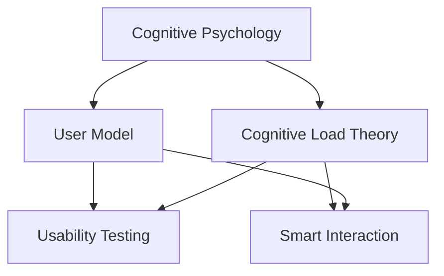

                 

# 认知科学与人机界面设计的融合

在信息技术飞速发展的今天，人机界面设计（Human-Computer Interaction, HCI）已经成为计算机科学中不可或缺的一部分。随着人工智能（AI）技术的不断进步，如何让AI更好地服务于人类，提升人机互动的体验，成为了当前研究的热点。认知科学与人机界面设计的融合，将为解决这一问题提供全新的视角和解决方案。

## 1. 背景介绍

### 1.1 问题由来

随着信息技术的普及，人与计算机之间的交互变得越来越频繁和复杂。然而，传统的界面设计往往基于经验法则，缺乏对用户认知过程的系统理解，导致设计出的界面并不总能满足用户需求，甚至可能引发误操作、用户疲劳等问题。认知科学作为一门研究人类认知过程的科学，为人机界面设计提供了深入的理论支持。

### 1.2 问题核心关键点

认知科学的主要关注点包括知觉、记忆、注意、决策、情绪等多个方面，这些机制对于理解人类如何与计算机交互至关重要。在HCI中，我们通过认知科学可以：
1. 理解用户如何进行信息加工和认知负荷。
2. 设计更符合用户认知模型的交互方式。
3. 增强系统的易用性和可访问性。
4. 优化界面的交互路径和信息呈现方式。

## 2. 核心概念与联系

### 2.1 核心概念概述

为更好地理解认知科学在人机界面设计中的应用，本节将介绍几个核心概念：

- **认知心理学**：研究人类认知过程、信息处理和决策机制的学科。在HCI中，认知心理学提供了对用户认知模型、注意分配、记忆保持和信息提取等原理的深入理解。
- **用户模型**：描述用户心理特征和行为特征的模型，用于指导人机界面设计。用户模型的构建可以基于用户调查、实验数据等。
- **认知负荷理论**：研究信息加工时对认知资源的需求，以及在信息获取、存储和操作中的认知负担。HCI中，认知负荷理论用于优化信息呈现方式和交互流程。
- **可用性测试**：评估人机界面易用性、可访问性和用户满意度的测试方法，通常通过可用性工程（Usability Engineering）和用户研究（User Research）来实现。
- **智能交互**：利用认知模型和机器学习技术，实现人机界面中的智能化交互，提升用户体验。

这些核心概念之间的逻辑关系可以通过以下Mermaid流程图来展示：



这个流程图展示了认知科学在人机界面设计中的作用和联系：

1. 认知心理学提供用户认知过程的深入理解。
2. 用户模型基于认知心理学原理，描述用户特征和行为。
3. 认知负荷理论用于指导信息呈现和交互优化。
4. 可用性测试评估界面易用性和用户满意度。
5. 智能交互通过认知模型和机器学习技术，实现智能化交互。

## 3. 核心算法原理 & 具体操作步骤

### 3.1 算法原理概述

人机界面的认知科学设计，通常基于认知负荷理论，通过优化界面设计和交互流程，减少用户的认知负荷，提升任务完成效率和用户满意度。

**认知负荷理论**指出，信息加工需要占用认知资源，包括注意、短时记忆和长时记忆。用户认知负荷过重时，会导致任务执行困难和错误率上升。因此，优化界面设计需关注以下几个方面：

1. **信息的清晰呈现**：减少无关信息，突出重要内容，帮助用户快速获取关键信息。
2. **交互的直观性**：简化操作流程，使用直观的交互方式，降低用户学习成本。
3. **记忆辅助**：提供可重复访问的信息，减少用户记忆负担。
4. **任务分解**：将复杂任务分解成多个简单步骤，分散用户的认知负荷。

### 3.2 算法步骤详解

基于认知负荷理论，人机界面的优化设计流程如下：

**Step 1: 用户研究**
- 收集用户的背景信息，通过调查问卷、访谈等方式了解用户的基本特征和认知负荷情况。
- 进行可用性测试，观察用户在实际使用过程中的行为表现，评估界面的易用性和可访问性。

**Step 2: 界面设计**
- 基于用户模型和认知心理学原理，设计信息架构和交互路径。
- 使用信息图示化（Information Visualization）技术，增强信息的直观性和可理解性。
- 根据用户任务需求，选择适合的交互组件和交互方式，如按钮、滑块、下拉菜单等。

**Step 3: 交互优化**
- 进行用户测试，验证界面设计的有效性，收集用户反馈。
- 根据用户反馈和测试结果，进一步优化界面和交互流程。
- 引入智能交互技术，如自适应界面、机器学习推荐系统等，提升用户体验和互动效率。

**Step 4: 评估与迭代**
- 定期评估用户满意度和系统性能，调整界面设计和交互方式。
- 收集长期使用数据，持续改进和优化界面。

### 3.3 算法优缺点

基于认知负荷理论的人机界面设计方法具有以下优点：
1. 设计目标明确，以减少用户认知负荷为中心。
2. 可以显著提升用户任务完成效率和满意度。
3. 通过用户研究和技术迭代，设计结果更具科学性和实用性。

然而，该方法也存在以下局限性：
1. 设计周期较长，用户研究、设计和测试需要耗费较多时间。
2. 需要设计者和用户密切合作，设计结果受用户特征和需求影响较大。
3. 对认知负荷的理解可能存在偏差，不同的用户群体可能存在差异。

### 3.4 算法应用领域

基于认知负荷理论的设计方法广泛应用于各种人机界面设计场景，包括但不限于以下领域：

1. **移动应用**：简化操作流程，提供简洁直观的界面，减少用户认知负荷。
2. **网站设计**：通过信息图示化和交互优化，提升用户浏览体验和信息获取效率。
3. **桌面软件**：设计友好的用户界面，降低学习成本，提升操作效率。
4. **智能家居设备**：优化操作界面和交互流程，提升设备易用性和用户满意度。
5. **企业信息系统**：通过认知负荷优化，提升员工工作效率和企业信息管理水平。

## 4. 数学模型和公式 & 详细讲解 & 举例说明

### 4.1 数学模型构建

在HCI中，认知负荷的数学建模通常包括两个方面：

1. **信息呈现负荷**：计算信息加工所需认知资源的数学模型，包括信息数量、复杂度、呈现方式等。
2. **任务执行负荷**：计算完成任务所需认知资源的数学模型，包括任务难度、任务步骤、用户操作频率等。

**信息呈现负荷模型**可以使用如下公式表示：

$$
\text{Cognitive Load} = k_1 \times \text{Information Volume} + k_2 \times \text{Information Complexity} + k_3 \times \text{Presentation Style}
$$

其中，$k_1$、$k_2$、$k_3$为模型参数，$k_1$、$k_2$、$k_3$的值需要通过实验数据进行拟合。

**任务执行负荷模型**可以使用如下公式表示：

$$
\text{Cognitive Load} = k_4 \times \text{Task Complexity} + k_5 \times \text{Task Steps} + k_6 \times \text{Task Frequency}
$$

其中，$k_4$、$k_5$、$k_6$为模型参数。

### 4.2 公式推导过程

信息呈现负荷和任务执行负荷的数学模型可以通过认知心理学实验进行推导：

1. **信息呈现负荷模型推导**：通过Ausubel的“极限容量”理论，设用户短时记忆的极限容量为$C$，则信息呈现负荷可以表示为：

   $$
   \text{Cognitive Load} = \frac{\text{Information Volume}}{C} + \text{Information Complexity} + \text{Presentation Style}
   $$

   其中，$\text{Presentation Style}$可以进一步分为：

   $$
   \text{Presentation Style} = k_1 \times \text{Chunking Level} + k_2 \times \text{Redundancy Level}
   $$

   将上式代入总负荷公式，得到：

   $$
   \text{Cognitive Load} = \frac{\text{Information Volume}}{C} + \text{Information Complexity} + k_1 \times \text{Chunking Level} + k_2 \times \text{Redundancy Level}
   $$

2. **任务执行负荷模型推导**：通过Fitts定律，设任务操作的响应时间常数为$t$，则任务执行负荷可以表示为：

   $$
   \text{Cognitive Load} = \frac{\text{Task Steps}}{t}
   $$

   其中，$\text{Task Steps}$表示任务的执行步骤数，$t$表示每个步骤的平均操作时间。

### 4.3 案例分析与讲解

以一个简单的电子表格软件的用户界面设计为例：

**设计背景**：用户需要进行数据分析，并生成可视化报告。

**设计步骤**：

1. **用户研究**：通过调查问卷和可用性测试，了解用户的工作流程和认知负荷。
2. **界面设计**：
   - 信息架构：将数据划分为多个部分，如数据导入、数据处理、数据分析、报告生成等。
   - 界面组件：使用简洁的控件和图标，减少用户操作步骤。
   - 交互路径：提供数据筛选、排序和聚合功能，减少用户记忆负担。
3. **交互优化**：
   - 信息图示化：使用图形和图表展示数据，减少数字输入。
   - 自适应界面：根据用户的操作习惯调整界面布局和组件位置。
   - 任务提示和帮助文档：提供任务提示和操作指南，降低用户学习成本。
4. **评估与迭代**：
   - 用户反馈：通过用户调查和问卷，收集用户的使用体验和建议。
   - 系统性能：通过系统日志和行为分析，评估界面的性能和用户体验。
   - 持续优化：根据用户反馈和性能评估，持续改进界面设计和交互流程。

## 5. 项目实践：代码实例和详细解释说明

### 5.1 开发环境搭建

在进行界面设计实践前，我们需要准备好开发环境。以下是使用Python进行界面设计的开发环境配置流程：

1. 安装Anaconda：从官网下载并安装Anaconda，用于创建独立的Python环境。

2. 创建并激活虚拟环境：
```bash
conda create -n hci-env python=3.8 
conda activate hci-env
```

3. 安装必要的Python包：
```bash
pip install pandas numpy matplotlib seaborn
```

4. 安装相关的UI设计工具包：
```bash
pip install PyQt5
```

完成上述步骤后，即可在`hci-env`环境中开始界面设计实践。

### 5.2 源代码详细实现

下面以一个简单的电子表格软件的用户界面设计为例，给出使用PyQt5进行界面设计的Python代码实现。

```python
import sys
from PyQt5.QtWidgets import QApplication, QMainWindow, QPushButton, QLineEdit, QLabel, QComboBox

class MainWindow(QMainWindow):
    def __init__(self):
        super().__init__()
        self.setWindowTitle('Electronic Spreadsheet')
        self.initUI()

    def initUI(self):
        self.createMenuBar()
        self.createToolBar()
        self.createDataArea()

    def createMenuBar(self):
        menubar = self.menuBar()
        fileMenu = menubar.addMenu('File')
        fileMenu.addAction('Open')
        fileMenu.addAction('Save')
        fileMenu.addAction('Exit')
        
    def createToolBar(self):
        toolbar = self.addToolBar('Tools')
        openButton = QPushButton('Open', self)
        openButton.clicked.connect(self.onOpen)
        saveButton = QPushButton('Save', self)
        saveButton.clicked.connect(self.onSave)
        toolbar.addWidget(openButton)
        toolbar.addWidget(saveButton)

    def createDataArea(self):
        self.dataArea = QLabel(self)
        self.dataArea.setGeometry(10, 70, 400, 300)
        self.dataArea.setStyleSheet('background-color: white')
        
        # 示例表格
        data = [['Data 1', 'Data 2', 'Data 3'],
                ['Data 4', 'Data 5', 'Data 6'],
                ['Data 7', 'Data 8', 'Data 9']]
        for i, row in enumerate(data):
            for j, cell in enumerate(row):
                label = QLabel(cell, self)
                label.setGeometry(10 + j * 50, 10 + i * 30, 40, 20)
        
    def onOpen(self):
        print('Open clicked')

    def onSave(self):
        print('Save clicked')

if __name__ == '__main__':
    app = QApplication(sys.argv)
    window = MainWindow()
    window.show()
    sys.exit(app.exec_())
```

这段代码实现了简单的电子表格软件界面，包括菜单栏、工具栏和数据展示区。通过使用PyQt5，我们可以轻松地设计出复杂的人机界面，并加入各种交互元素。

### 5.3 代码解读与分析

让我们再详细解读一下关键代码的实现细节：

**MainWindow类**：
- 继承自QMainWindow，用于创建主窗口。
- `__init__`方法：初始化窗口属性和界面元素。
- `initUI`方法：创建菜单栏、工具栏和数据展示区。

**createMenuBar方法**：
- 创建菜单栏，并添加打开、保存和退出等基本操作。

**createToolBar方法**：
- 创建工具栏，并添加打开和保存按钮。

**createDataArea方法**：
- 创建数据展示区，并使用表格形式展示示例数据。
- 使用QLabel控件展示表格数据，通过`setGeometry`方法设置位置和大小。

**onOpen和onSave方法**：
- 绑定按钮点击事件，实现基本操作功能。

通过这段代码，可以看到使用PyQt5进行界面设计的简洁高效。开发者可以进一步扩展界面元素，实现更多功能，以满足实际需求。

## 6. 实际应用场景

### 6.1 智能家居控制

智能家居设备的用户界面设计需要考虑用户的认知负荷和使用习惯。通过认知科学和人机界面设计的融合，可以设计出直观、易用的界面，提升用户体验。

**设计思路**：
1. **用户研究**：收集用户使用习惯和认知负荷数据。
2. **界面设计**：简化操作流程，提供直观的交互方式。
3. **交互优化**：引入自适应界面和任务提示，提升操作效率。

**实现示例**：
- 使用按钮和图标进行操作，减少用户记忆负担。
- 提供语音和手势控制，简化操作流程。
- 实时反馈用户操作结果，增强用户体验。

### 6.2 医疗诊断系统

医疗诊断系统的用户界面设计需要考虑医生的工作流程和认知负荷。通过认知科学和人机界面设计的融合，可以设计出符合医生工作习惯的界面，提升诊断效率。

**设计思路**：
1. **用户研究**：了解医生的工作流程和认知负荷。
2. **界面设计**：简化操作流程，提供直观的交互方式。
3. **交互优化**：引入自适应界面和任务提示，提升操作效率。

**实现示例**：
- 提供病例浏览、数据查询和分析功能。
- 使用简洁的控件和图标，减少用户操作步骤。
- 提供任务提示和帮助文档，降低用户学习成本。

## 7. 工具和资源推荐

### 7.1 学习资源推荐

为了帮助开发者系统掌握认知科学与人机界面设计的理论基础和实践技巧，这里推荐一些优质的学习资源：

1. **《认知心理学》**：一本经典的认知心理学教材，介绍了认知过程的基本理论和实验方法。
2. **《人机界面设计》**：一本系统的HCI教材，涵盖人机界面设计的基本原理和案例分析。
3. **《认知负荷理论》**：一本介绍认知负荷理论和应用的书，帮助设计师优化界面设计。
4. **Coursera的《人机交互设计》课程**：由斯坦福大学和IBM联合开设的课程，涵盖HCI的基本理论和设计实践。
5. **Microsoft Design Lab**：微软设计的在线资源，提供人机界面设计的工具和教程。

通过对这些资源的学习实践，相信你一定能够快速掌握认知科学与人机界面设计的精髓，并用于解决实际的NLP问题。

### 7.2 开发工具推荐

高效的开发离不开优秀的工具支持。以下是几款用于人机界面设计开发的常用工具：

1. **PyQt5**：Python的跨平台GUI库，支持Windows、macOS和Linux等操作系统。
2. **JavaFX**：Java的跨平台GUI库，支持多种操作系统和平台。
3. **Sketch**：专业的界面设计工具，支持矢量图形和交互原型设计。
4. **Adobe XD**：业界领先的设计工具，支持界面设计和原型测试。
5. **Blender**：免费的三维建模软件，支持界面和交互设计。

合理利用这些工具，可以显著提升人机界面设计的开发效率，加快创新迭代的步伐。

### 7.3 相关论文推荐

认知科学和人机界面设计的研究源于学界的持续研究。以下是几篇奠基性的相关论文，推荐阅读：

1. **《认知负荷理论》**：Edward E. Miserandina和James J. Smith等人发表的关于认知负荷的经典论文。
2. **《用户界面设计》**：Norman Donald Aison等人的著作，介绍了人机界面设计的原理和实践。
3. **《认知心理学》**：Steven A. Pinker的著作，系统介绍了认知心理学的基本理论和应用。
4. **《认知负荷和信息处理》**：George P. A. Miller的经典论文，探讨了信息加工和认知负荷的基本原理。
5. **《人机交互设计》**：Jonathan I. Biddle等人发表的论文，介绍了人机界面设计的最新进展。

这些论文代表了大语言模型微调技术的发展脉络。通过学习这些前沿成果，可以帮助研究者把握学科前进方向，激发更多的创新灵感。

## 8. 总结：未来发展趋势与挑战

### 8.1 总结

本文对认知科学与人机界面设计的融合方法进行了全面系统的介绍。首先阐述了认知科学在人机界面设计中的应用背景和意义，明确了认知负荷理论在人机界面设计中的重要性。其次，从原理到实践，详细讲解了基于认知负荷理论的界面设计方法，给出了界面设计的完整代码实例。同时，本文还探讨了认知科学和人机界面设计在智能家居、医疗诊断等多个实际场景中的应用前景，展示了认知科学和人机界面设计的巨大潜力。最后，本文精选了认知科学和人机界面设计的各类学习资源，力求为读者提供全方位的技术指引。

通过本文的系统梳理，可以看到，认知科学和人机界面设计的融合方法正在成为人机交互设计的重要范式，极大地提升了人机界面的易用性和用户满意度。认知科学和人机界面设计的融合为构建更加智能、高效的人机交互系统提供了新的方法，未来必将在更多领域得到应用，为人类认知智能的进化带来深远影响。

### 8.2 未来发展趋势

展望未来，认知科学和人机界面设计的融合技术将呈现以下几个发展趋势：

1. **自适应界面设计**：利用认知心理学和机器学习技术，实现界面和交互的动态优化，提升用户体验。
2. **多模态人机交互**：将语音、手势、眼动等多种模态的信息融合，提升人机互动的直观性和自然性。
3. **情境感知交互**：结合情境感知技术，设计能根据环境变化自动调整的界面和交互方式，增强用户沉浸感。
4. **增强现实界面**：利用AR技术，将虚拟界面与现实世界相结合，提升交互的沉浸感和空间感。
5. **智能推荐系统**：通过认知负荷理论，设计智能推荐系统，为用户提供个性化和智能化的信息呈现和交互方式。

以上趋势凸显了认知科学和人机界面设计的融合技术的广阔前景。这些方向的探索发展，将进一步提升人机互动的效率和体验，推动人类认知智能的进化。

### 8.3 面临的挑战

尽管认知科学和人机界面设计的融合技术已经取得了瞩目成就，但在迈向更加智能化、普适化应用的过程中，它仍面临诸多挑战：

1. **认知模型复杂性**：认知心理学模型复杂，不同用户群体可能存在差异，难以建立统一的用户模型。
2. **数据获取难度**：用户认知负荷数据的获取较为困难，需要大量的用户研究和实验数据。
3. **界面设计成本**：认知科学和人机界面设计的融合需要专业知识和技能，设计成本较高。
4. **用户体验差异**：不同用户群体的需求和偏好不同，难以设计统一的、高效的交互方式。
5. **技术实现难度**：将认知模型和用户研究应用于实际设计中，需要综合考虑技术实现和用户体验。

### 8.4 研究展望

面对认知科学和人机界面设计所面临的挑战，未来的研究需要在以下几个方面寻求新的突破：

1. **多模态界面设计**：结合多种模态信息，设计更加直观、自然的界面和交互方式。
2. **情境感知界面设计**：根据环境变化自动调整界面和交互方式，提升用户沉浸感和体验。
3. **智能推荐系统**：结合认知负荷理论和机器学习技术，设计智能推荐系统，为用户提供个性化信息。
4. **自适应界面设计**：利用机器学习技术，实现界面和交互的动态优化，提升用户体验。
5. **交互路径优化**：结合认知负荷理论和任务分解方法，设计更加高效、易用的交互路径。

这些研究方向将推动认知科学和人机界面设计的融合技术迈向更高的台阶，为构建更加智能、高效的人机交互系统铺平道路。面向未来，认知科学和人机界面设计的融合技术还需要与其他人工智能技术进行更深入的融合，如自然语言处理、机器学习等，多路径协同发力，共同推动人机交互系统的进步。只有勇于创新、敢于突破，才能不断拓展人机交互的边界，让人工智能技术更好地服务于人类社会。

## 9. 附录：常见问题与解答

**Q1：什么是认知负荷理论？**

A: 认知负荷理论（Cognitive Load Theory, CLT）是认知心理学中的一个重要理论，由Sweller等人提出。它认为信息加工需要占用认知资源，包括注意、短时记忆和长时记忆。当信息加工所需的认知负荷超出用户的能力范围时，会导致认知过载和任务执行困难。因此，界面设计应尽量减少信息加工所需的认知负荷，提高用户任务完成效率和满意度。

**Q2：如何设计一个直观、易用的界面？**

A: 设计直观、易用的界面需要考虑以下几个方面：
1. **简洁明了**：界面应尽量简洁明了，避免过多的信息和冗余。
2. **一致性**：界面设计应保持一致性，使用户能够快速理解和操作。
3. **可访问性**：界面应考虑不同用户群体的需求，设计可访问性强的交互方式。
4. **自适应**：界面应具备自适应能力，根据用户的操作习惯和环境变化进行调整。

**Q3：如何优化界面的交互流程？**

A: 优化界面的交互流程需要考虑以下几个方面：
1. **任务分解**：将复杂任务分解成多个简单步骤，减少用户认知负荷。
2. **交互元素优化**：选择直观、易用的交互元素，减少用户操作步骤。
3. **反馈机制**：及时提供反馈，增强用户操作信心和满意度。
4. **用户测试**：通过用户测试和可用性评估，收集用户反馈并进行迭代优化。

通过这些措施，可以显著提升界面的交互效率和用户体验。

**Q4：什么是自适应界面设计？**

A: 自适应界面设计（Adaptive Interface Design）是指根据用户的操作习惯和环境变化，自动调整界面和交互方式的技术。通过结合认知心理学和机器学习技术，可以实现界面的动态优化，提升用户体验和任务完成效率。

**Q5：什么是情境感知界面设计？**

A: 情境感知界面设计（Context-Aware Interface Design）是指根据用户所处的环境和情境，自动调整界面和交互方式的技术。通过结合情境感知技术和用户研究，可以设计更加智能、高效的交互界面，提升用户沉浸感和体验。

通过这些措施，可以显著提升界面的交互效率和用户体验。

---

作者：禅与计算机程序设计艺术 / Zen and the Art of Computer Programming

