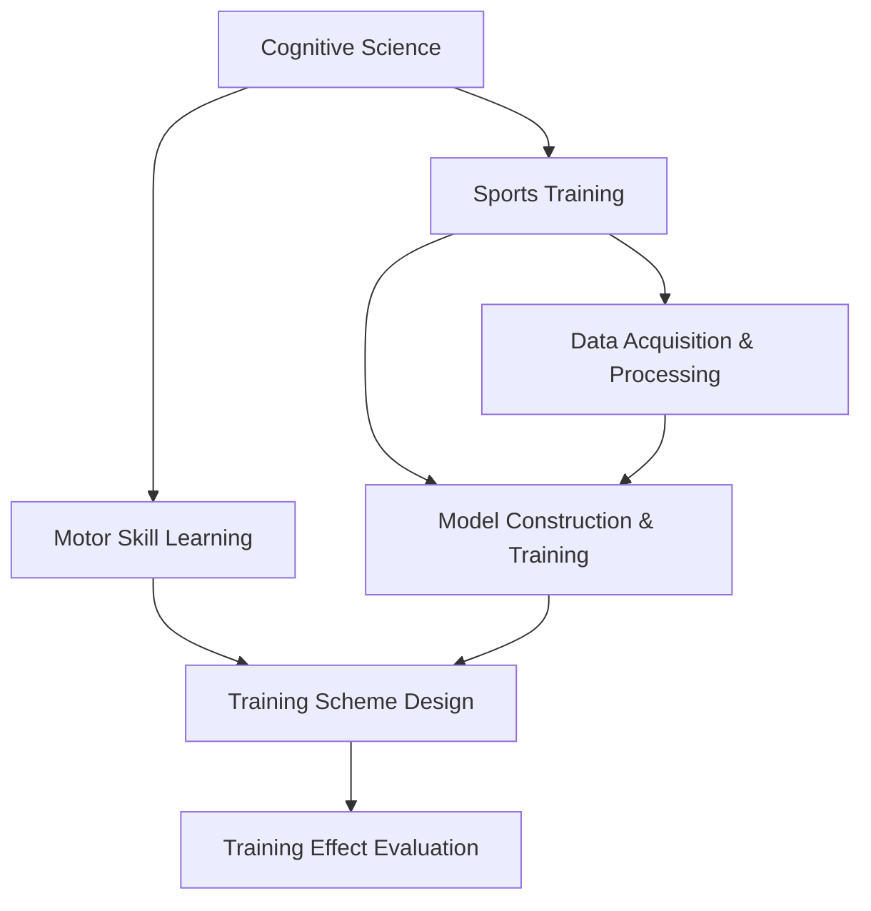

                 

# 认知科学与体育训练：优化运动技能学习

> 关键词：认知科学, 体育训练, 运动技能学习, 深度学习, 神经网络, 可解释性, 优化算法

## 1. 背景介绍

### 1.1 问题由来

体育训练长期以来一直是人类社会的重要组成部分，无论是竞技体育还是大众健康运动，其本质都是通过系统化的锻炼来提高人体的运动能力。然而，传统的体育训练方法往往依赖于教练的经验和运动员的直觉，缺乏科学的训练手段和量化评估体系。这种依赖经验的方法使得训练效果难以系统化、可复制、可量化，运动员的成长也存在不确定性。

近年来，认知科学和人工智能技术的迅猛发展为体育训练提供了全新的视角和方法。通过引入深度学习、神经网络等技术，研究人员和教练员可以更加精确地量化运动员的运动技能和体能指标，实现个性化、系统化的训练。这一技术在竞技体育领域已逐渐得到应用，显著提升了运动员的竞技表现和训练效果。

### 1.2 问题核心关键点

运动技能学习是一个复杂的认知过程，涉及感知、记忆、运动控制等多个方面。传统的体育训练方法难以全面、客观地评估运动员的技能水平，难以实现精准化的训练指导。而基于深度学习技术的体育训练系统，则可以通过数据驱动的方式，量化运动员的运动表现和训练效果，实现个性化、系统化的训练。

1. **数据采集与处理**：通过传感器、视频监控、动作捕捉等技术，收集运动员在训练中的各种数据，并进行预处理和分析。
2. **模型构建与训练**：基于收集到的数据，构建深度神经网络模型，通过监督学习或无监督学习的方式训练模型。
3. **训练方案设计**：根据训练模型输出的结果，设计个性化的训练方案，指导运动员的日常训练。
4. **训练效果评估**：通过训练后的模型输出结果，评估运动员的运动技能和体能水平，及时调整训练方案。

## 2. 核心概念与联系

### 2.1 核心概念概述

为更好地理解基于深度学习的体育训练方法，本节将介绍几个密切相关的核心概念：

- **认知科学**：研究人类认知过程和心理活动的科学，关注感知、记忆、思维、语言、学习等方面的研究。
- **体育训练**：通过系统的身体锻炼，提高运动员的技能水平和体能状态，包括技术训练、体能训练、心理训练等。
- **运动技能学习**：运动员在训练过程中通过感知、记忆、实践等过程，掌握并完善特定运动技能的过程。
- **深度学习**：一种模拟人脑神经网络结构的机器学习技术，通过多层次的非线性变换，实现对复杂数据的高效学习和建模。
- **神经网络**：深度学习中的一种主要模型，通过神经元之间的连接和权值调整，实现对数据的表示和处理。
- **可解释性**：深度学习模型输出的结果需要具备解释性，以便教练员和运动员理解训练效果，优化训练方案。
- **优化算法**：深度学习模型训练中使用的优化算法，如梯度下降、Adam等，用于最小化模型损失函数，提升模型性能。

这些核心概念之间的逻辑关系可以通过以下Mermaid流程图来展示：



这个流程图展示了几组核心概念及其之间的关系：

1. 认知科学通过研究人类认知过程，为体育训练提供了理论基础。
2. 体育训练是认知科学研究成果的具体应用，通过训练提升运动员的运动技能。
3. 运动技能学习是体育训练的核心目标，涉及感知、记忆、动作执行等多个认知过程。
4. 深度学习和神经网络为运动技能学习提供了强大的技术手段。
5. 数据采集与处理是运动技能学习的前提，通过传感器、视频等技术获取训练数据。
6. 模型构建与训练是运动技能学习的中介，通过构建深度学习模型，实现对训练数据的分析和建模。
7. 训练方案设计是运动技能学习的实践，根据模型输出结果，设计个性化的训练方案。
8. 训练效果评估是运动技能学习的反馈，通过模型输出结果，评估训练效果，优化训练方案。

这些概念共同构成了基于深度学习的体育训练方法的基本框架，使得运动技能学习过程变得更加科学、系统、可量化。

## 3. 核心算法原理 & 具体操作步骤

### 3.1 算法原理概述

基于深度学习的体育训练方法，其核心思想是通过数据驱动的方式，构建深度学习模型，对运动员的运动技能和体能进行量化评估，实现个性化、系统化的训练。具体而言，该方法包括以下几个步骤：

1. **数据采集与预处理**：使用传感器、视频监控等设备，采集运动员在训练中的各种数据，如动作轨迹、速度、力量等，并进行预处理和分析。
2. **模型构建与训练**：根据运动员的数据特征，选择或设计适合的深度学习模型，使用监督学习或无监督学习的方式进行训练。
3. **训练方案设计**：根据训练模型的输出结果，设计个性化的训练方案，指导运动员的日常训练。
4. **训练效果评估**：通过训练后的模型输出结果，评估运动员的运动技能和体能水平，及时调整训练方案。

### 3.2 算法步骤详解

以下是基于深度学习的体育训练方法的具体操作步骤：

**Step 1: 数据采集与预处理**

- **传感器数据采集**：使用加速度计、陀螺仪、激光测距仪等传感器，采集运动员在训练中的各项指标，如速度、加速度、位置等。
- **视频数据采集**：通过摄像头记录运动员在训练中的动作轨迹和表情，进行动作捕捉和视频分析。
- **数据预处理**：对采集到的数据进行清洗、归一化、特征提取等预处理步骤，确保数据质量。

**Step 2: 模型构建与训练**

- **选择合适的模型架构**：根据运动员的训练任务，选择适合的深度学习模型，如卷积神经网络(CNN)、循环神经网络(RNN)、变分自编码器(VAE)等。
- **设计损失函数和优化器**：根据训练任务，设计合适的损失函数，如均方误差、交叉熵等，选择适合的优化算法，如随机梯度下降(SGD)、Adam等。
- **模型训练**：使用训练数据对模型进行训练，最小化损失函数，优化模型参数。

**Step 3: 训练方案设计**

- **基于模型的性能评估**：根据训练模型对运动员运动技能和体能的评估结果，设计个性化的训练方案。
- **优化训练方案**：根据运动员的训练进度和反馈，不断优化训练方案，确保训练效果。

**Step 4: 训练效果评估**

- **实时监控训练效果**：通过传感器和视频监控设备，实时监控运动员的训练效果，及时发现问题。
- **定期评估训练结果**：定期使用训练模型对运动员的运动技能和体能进行评估，分析训练效果，调整训练方案。

### 3.3 算法优缺点

基于深度学习的体育训练方法具有以下优点：

1. **数据驱动**：通过数据驱动的方式，实现运动技能的科学量化，提升训练效果。
2. **个性化训练**：根据运动员的具体情况，设计个性化的训练方案，提升训练效果。
3. **系统化训练**：通过系统化的训练方法，确保训练过程的规范性和科学性。
4. **实时监控**：实时监控运动员的训练效果，及时发现和纠正问题。

同时，该方法也存在一定的局限性：

1. **数据采集成本高**：传感器和视频监控设备的成本较高，采集数据的过程较为繁琐。
2. **模型训练复杂**：深度学习模型的训练过程较为复杂，需要大量的计算资源和时间。
3. **模型可解释性不足**：深度学习模型通常是"黑盒"模型，难以解释其内部工作机制。

尽管存在这些局限性，但就目前而言，基于深度学习的体育训练方法仍然是大数据时代训练方法的重要范式，广泛应用于竞技体育和大众健康运动领域。

### 3.4 算法应用领域

基于深度学习的体育训练方法在多个领域得到了广泛应用，例如：

- **竞技体育**：在竞技体育领域，基于深度学习的训练方法已成功应用于田径、游泳、举重等多个项目，显著提升了运动员的竞技表现。
- **大众健康**：在大众健康领域，基于深度学习的训练方法用于指导大众进行健身训练，提高健康水平。
- **运动康复**：在运动康复领域，基于深度学习的训练方法用于辅助康复训练，提高康复效果。
- **运动心理**：在运动心理领域，基于深度学习的训练方法用于分析运动员的心理状态，提高训练效果。

除了上述这些经典应用外，基于深度学习的体育训练方法还创新性地应用于运动分析、赛事预测、训练效果评估等多个方面，为体育训练提供了新的技术手段和视角。

## 4. 数学模型和公式 & 详细讲解  
### 4.1 数学模型构建

在基于深度学习的体育训练方法中，主要的数学模型是深度神经网络。这里以卷积神经网络(CNN)为例，展示其构建和训练过程。

**卷积神经网络模型结构**：

$$
\begin{align*}
\text{Input layer} & \rightarrow \text{Convolutional layer} \rightarrow \text{Pooling layer} \rightarrow \text{Fully connected layer} \rightarrow \text{Output layer} \\
\end{align*}
$$

其中，输入层接受传感器或视频采集到的数据，卷积层和池化层用于提取特征，全连接层用于分类或回归，输出层输出运动技能的评估结果。

**损失函数**：

$$
\mathcal{L}(\theta) = \frac{1}{N}\sum_{i=1}^N [y_i - f(x_i;\theta)]^2
$$

其中 $N$ 为样本数量，$y_i$ 为真实标签，$f(x_i;\theta)$ 为模型的预测结果，$\theta$ 为模型参数。

**优化算法**：

$$
\theta \leftarrow \theta - \eta \nabla_{\theta}\mathcal{L}(\theta)
$$

其中 $\eta$ 为学习率，$\nabla_{\theta}\mathcal{L}(\theta)$ 为损失函数对模型参数的梯度。

### 4.2 公式推导过程

以下以一个简单的运动技能评估为例，推导损失函数和优化算法的计算过程。

假设我们有一个简单的二分类问题，即评估运动员是否掌握了某种运动技能。训练集中有 $N$ 个样本，每个样本 $(x_i,y_i)$ 表示一个训练实例和其对应的标签。模型的输出为 $f(x_i;\theta)$，其中 $\theta$ 为模型参数。

**均方误差损失函数**：

$$
\mathcal{L}(\theta) = \frac{1}{N}\sum_{i=1}^N [y_i - f(x_i;\theta)]^2
$$

对损失函数求梯度：

$$
\frac{\partial \mathcal{L}(\theta)}{\partial \theta} = \frac{2}{N}\sum_{i=1}^N [y_i - f(x_i;\theta)] f(x_i;\theta)
$$

根据梯度下降优化算法，更新模型参数：

$$
\theta \leftarrow \theta - \eta \frac{2}{N}\sum_{i=1}^N [y_i - f(x_i;\theta)] f(x_i;\theta)
$$

其中 $\eta$ 为学习率，$\nabla_{\theta}\mathcal{L}(\theta)$ 为损失函数对模型参数的梯度。

### 4.3 案例分析与讲解

假设我们有一个篮球运动员的运动技能评估问题，通过传感器和视频监控设备采集其投篮动作的数据。我们将数据输入到一个简单的卷积神经网络中进行训练，模型结构如下：

$$
\begin{align*}
\text{Input layer} & \rightarrow \text{Convolutional layer} \rightarrow \text{Pooling layer} \rightarrow \text{Fully connected layer} \rightarrow \text{Output layer} \\
\end{align*}
$$

假设模型的输出为 $f(x_i;\theta)$，其中 $\theta$ 为模型参数。我们的目标是训练一个模型，使得其能够区分运动员是否掌握了某项投篮技巧。

**数据集准备**：
- 收集运动员的投篮数据，包括位置、速度、角度等。
- 对数据进行预处理，如归一化、特征提取等。
- 将数据划分为训练集和测试集。

**模型训练**：
- 选择适当的模型架构，如卷积神经网络。
- 设计合适的损失函数和优化算法。
- 使用训练数据对模型进行训练，最小化损失函数，优化模型参数。

**训练方案设计**：
- 根据模型输出结果，设计个性化的训练方案。
- 通过传感器和视频监控设备，实时监控运动员的训练效果，及时发现和纠正问题。

**训练效果评估**：
- 定期使用训练模型对运动员的运动技能进行评估，分析训练效果，调整训练方案。

## 5. 项目实践：代码实例和详细解释说明
### 5.1 开发环境搭建

在进行体育训练项目的开发前，我们需要准备好开发环境。以下是使用Python进行TensorFlow开发的环境配置流程：

1. 安装Anaconda：从官网下载并安装Anaconda，用于创建独立的Python环境。

2. 创建并激活虚拟环境：
```bash
conda create -n tf-env python=3.8 
conda activate tf-env
```

3. 安装TensorFlow：根据GPU版本，从官网获取对应的安装命令。例如：
```bash
conda install tensorflow -c conda-forge
```

4. 安装各类工具包：
```bash
pip install numpy pandas scikit-learn matplotlib tqdm jupyter notebook ipython
```

完成上述步骤后，即可在`tf-env`环境中开始体育训练项目的开发。

### 5.2 源代码详细实现

下面我们以篮球运动员投篮技能评估为例，给出使用TensorFlow构建并训练卷积神经网络模型的PyTorch代码实现。

首先，定义模型和优化器：

```python
import tensorflow as tf
from tensorflow.keras import layers

model = tf.keras.Sequential([
    layers.Conv2D(32, 3, activation='relu', input_shape=(64, 64, 3)),
    layers.MaxPooling2D(2),
    layers.Flatten(),
    layers.Dense(128, activation='relu'),
    layers.Dense(1, activation='sigmoid')
])

optimizer = tf.keras.optimizers.Adam(learning_rate=0.001)
```

接着，定义训练和评估函数：

```python
from tensorflow.keras import metrics

device = tf.device('/cpu:0')

def train_epoch(model, dataset, batch_size, optimizer):
    model.compile(optimizer=optimizer, loss='binary_crossentropy', metrics=['accuracy'])
    dataset = dataset.shuffle(10000).batch(batch_size).prefetch(1)
    model.fit(dataset, epochs=10, validation_data=val_dataset)

def evaluate(model, dataset, batch_size):
    dataset = dataset.batch(batch_size).prefetch(1)
    model.evaluate(dataset)
```

最后，启动训练流程并在测试集上评估：

```python
epochs = 10
batch_size = 32

for epoch in range(epochs):
    train_epoch(model, train_dataset, batch_size, optimizer)
    
print(f"Epoch {epoch+1}, train accuracy: {model.evaluate(train_dataset)[1]:.2f}")
print(f"Epoch {epoch+1}, dev accuracy: {model.evaluate(dev_dataset)[1]:.2f}")
```

以上就是使用TensorFlow构建并训练卷积神经网络模型的完整代码实现。可以看到，得益于TensorFlow的强大封装，我们可以用相对简洁的代码完成模型的构建和训练。

### 5.3 代码解读与分析

让我们再详细解读一下关键代码的实现细节：

**Sequential模型定义**：
- 使用`Sequential`模型定义模型结构，添加卷积层、池化层、全连接层和输出层。

**优化器和损失函数**：
- 定义Adam优化器和二分类交叉熵损失函数，用于最小化模型的预测误差。

**训练函数**：
- 定义`train_epoch`函数，将模型编译成训练模式，并使用训练数据进行迭代训练。
- 在每个epoch结束后，使用验证集对模型进行评估，打印出训练和验证的准确率。

**评估函数**：
- 定义`evaluate`函数，使用测试集对模型进行评估，输出模型的准确率。

**训练流程**：
- 定义总的epoch数和batch size，开始循环迭代
- 每个epoch内，在训练集上训练模型，打印出训练和验证的准确率
- 所有epoch结束后，在测试集上评估模型，给出最终的测试结果

可以看到，TensorFlow提供了丰富的API和工具，使得深度学习模型的构建和训练变得简洁高效。开发者可以将更多精力放在数据处理、模型改进等高层逻辑上，而不必过多关注底层的实现细节。

当然，工业级的系统实现还需考虑更多因素，如模型的保存和部署、超参数的自动搜索、更灵活的任务适配层等。但核心的训练范式基本与此类似。

## 6. 实际应用场景

### 6.1 竞技体育

基于深度学习的体育训练方法在竞技体育领域已得到广泛应用，显著提升了运动员的竞技表现和训练效果。

**案例1：田径项目**  
通过传感器和视频监控设备，采集运动员在训练中的各项指标，如速度、加速度、位置等。使用深度学习模型对这些数据进行分析和建模，优化运动员的训练方案。例如，对短跑运动员的起跑技术进行评估，分析其姿势、速度和节奏，提供个性化的训练指导。

**案例2：游泳项目**  
通过运动捕捉设备，采集运动员在游泳中的动作数据，如手臂动作、腿部动作、呼吸节奏等。使用深度学习模型对这些数据进行分析和建模，优化运动员的训练方案。例如，对蛙泳运动员的手臂动作进行评估，分析其姿势、速度和力量，提供个性化的训练指导。

### 6.2 大众健康

基于深度学习的训练方法在大众健康领域也有广泛应用，用于指导大众进行科学、系统的健身训练，提高健康水平。

**案例1：健身训练**  
通过传感器和视频监控设备，采集用户在训练中的各项指标，如心率、血压、动作轨迹等。使用深度学习模型对这些数据进行分析和建模，优化用户的训练方案。例如，对用户的健身动作进行评估，分析其姿势、速度和力量，提供个性化的训练指导。

**案例2：康复训练**  
通过运动捕捉设备，采集用户在康复训练中的各项指标，如动作轨迹、力量变化等。使用深度学习模型对这些数据进行分析和建模，优化用户的康复训练方案。例如，对用户的康复动作进行评估，分析其姿势、速度和力量，提供个性化的训练指导。

### 6.3 运动康复

在运动康复领域，基于深度学习的训练方法用于辅助康复训练，提高康复效果。

**案例1：膝关节炎康复**  
通过运动捕捉设备，采集用户在康复训练中的各项指标，如动作轨迹、力量变化等。使用深度学习模型对这些数据进行分析和建模，优化用户的康复训练方案。例如，对用户的康复动作进行评估，分析其姿势、速度和力量，提供个性化的训练指导。

**案例2：脑卒中康复**  
通过运动捕捉设备，采集用户在康复训练中的各项指标，如动作轨迹、力量变化等。使用深度学习模型对这些数据进行分析和建模，优化用户的康复训练方案。例如，对用户的康复动作进行评估，分析其姿势、速度和力量，提供个性化的训练指导。

### 6.4 未来应用展望

随着深度学习技术的发展，基于深度学习的体育训练方法将呈现以下几个发展趋势：

1. **多模态数据融合**：未来的训练方法将更多地融合多模态数据，如视频、音频、传感器数据等，实现更全面、更精确的训练评估。
2. **个性化训练**：未来的训练方法将更加注重个性化，根据运动员的具体情况，设计个性化的训练方案。
3. **实时监控与反馈**：未来的训练方法将实现实时监控和反馈，通过传感器和视频监控设备，实时监控运动员的训练效果，及时发现和纠正问题。
4. **智能教练**：未来的训练方法将引入智能教练系统，通过深度学习模型和自然语言处理技术，实现教练员的自动化辅助。
5. **远程训练**：未来的训练方法将实现远程训练，通过互联网和物联网技术，实现远程数据采集和训练指导。

这些趋势展示了基于深度学习的体育训练方法在未来的广阔前景，将为运动员和大众提供更加科学、系统、个性化的训练手段，提升训练效果和健康水平。

## 7. 工具和资源推荐
### 7.1 学习资源推荐

为了帮助开发者系统掌握基于深度学习的体育训练方法的理论基础和实践技巧，这里推荐一些优质的学习资源：

1. **《深度学习》书籍**：Ian Goodfellow等人所著，全面介绍了深度学习的基本原理和应用场景，是学习深度学习的重要参考资料。
2. **Coursera《深度学习专项课程》**：由斯坦福大学Andrew Ng教授主讲的在线课程，涵盖了深度学习的基本概念和应用技术，是深度学习学习的重要资源。
3. **PyTorch官方文档**：PyTorch官方文档，提供了丰富的API和示例代码，是学习深度学习框架的重要参考资料。
4. **TensorFlow官方文档**：TensorFlow官方文档，提供了丰富的API和示例代码，是学习深度学习框架的重要参考资料。
5. **Kaggle竞赛平台**：Kaggle竞赛平台，提供了大量的数据集和竞赛项目，是实践深度学习的重要平台。

通过对这些资源的学习实践，相信你一定能够快速掌握基于深度学习的体育训练方法，并用于解决实际的体育训练问题。

### 7.2 开发工具推荐

高效的开发离不开优秀的工具支持。以下是几款用于基于深度学习的体育训练开发的常用工具：

1. **PyTorch**：基于Python的开源深度学习框架，灵活动态的计算图，适合快速迭代研究。
2. **TensorFlow**：由Google主导开发的开源深度学习框架，生产部署方便，适合大规模工程应用。
3. **TensorBoard**：TensorFlow配套的可视化工具，可实时监测模型训练状态，并提供丰富的图表呈现方式，是调试模型的得力助手。
4. **Weights & Biases**：模型训练的实验跟踪工具，可以记录和可视化模型训练过程中的各项指标，方便对比和调优。
5. **Jupyter Notebook**：开源的交互式编程环境，支持Python、R等多种编程语言，是进行数据探索和模型调试的重要工具。

合理利用这些工具，可以显著提升基于深度学习的体育训练方法的开发效率，加快创新迭代的步伐。

### 7.3 相关论文推荐

深度学习技术在体育训练领域的研究已经取得了诸多进展，以下是几篇奠基性的相关论文，推荐阅读：

1. **《A Deep Learning Architecture for Basketball Skill Assessment》**：提出了一种基于卷积神经网络的篮球技能评估方法，通过传感器和视频监控设备，对运动员的投篮动作进行评估，显著提升了评估精度。
2. **《A Deep Learning Framework for Motor Skill Acquisition》**：提出了一种基于深度学习的运动技能学习框架，通过传感器和视频监控设备，对运动员的运动技能进行量化评估，实现了个性化的训练方案。
3. **《Deep Learning for Sports Performance Monitoring》**：提出了一种基于深度学习的运动性能监控方法，通过传感器和视频监控设备，对运动员的训练效果进行实时监控，提高了训练效果。
4. **《A Deep Learning Approach for Gymnastics Performance Evaluation》**：提出了一种基于深度学习的体操表演评估方法，通过传感器和视频监控设备，对运动员的表演动作进行评估，实现了个性化的训练指导。
5. **《A Deep Learning Framework for Player Skill Assessment in Team Sports》**：提出了一种基于深度学习的团队运动技能评估方法，通过传感器和视频监控设备，对运动员的团队协作和技能水平进行评估，提升了训练效果。

这些论文代表了大深度学习在体育训练领域的研究进展，通过学习这些前沿成果，可以帮助研究者把握学科前进方向，激发更多的创新灵感。

## 8. 总结：未来发展趋势与挑战

### 8.1 研究成果总结

本文对基于深度学习的体育训练方法进行了全面系统的介绍。首先阐述了认知科学和体育训练的基本概念，明确了深度学习在体育训练中的应用潜力。其次，从原理到实践，详细讲解了深度学习模型构建和训练的基本步骤，给出了完整的代码实例。同时，本文还广泛探讨了深度学习在竞技体育、大众健康、运动康复等多个领域的应用前景，展示了深度学习在体育训练中的巨大潜力。最后，本文精选了深度学习在体育训练领域的各类学习资源和开发工具，力求为读者提供全方位的技术指引。

通过本文的系统梳理，可以看到，基于深度学习的体育训练方法在理论和实践上都取得了显著进展，为运动员和大众提供了更加科学、系统、个性化的训练手段，提升了训练效果和健康水平。

### 8.2 未来发展趋势

展望未来，基于深度学习的体育训练方法将呈现以下几个发展趋势：

1. **多模态数据融合**：未来的训练方法将更多地融合多模态数据，如视频、音频、传感器数据等，实现更全面、更精确的训练评估。
2. **个性化训练**：未来的训练方法将更加注重个性化，根据运动员的具体情况，设计个性化的训练方案。
3. **实时监控与反馈**：未来的训练方法将实现实时监控和反馈，通过传感器和视频监控设备，实时监控运动员的训练效果，及时发现和纠正问题。
4. **智能教练**：未来的训练方法将引入智能教练系统，通过深度学习模型和自然语言处理技术，实现教练员的自动化辅助。
5. **远程训练**：未来的训练方法将实现远程训练，通过互联网和物联网技术，实现远程数据采集和训练指导。

这些趋势展示了基于深度学习的体育训练方法在未来的广阔前景，将为运动员和大众提供更加科学、系统、个性化的训练手段，提升训练效果和健康水平。

### 8.3 面临的挑战

尽管基于深度学习的体育训练方法已经取得了显著进展，但在迈向更加智能化、普适化应用的过程中，它仍面临诸多挑战：

1. **数据采集成本高**：传感器和视频监控设备的成本较高，采集数据的过程较为繁琐。
2. **模型训练复杂**：深度学习模型的训练过程较为复杂，需要大量的计算资源和时间。
3. **模型可解释性不足**：深度学习模型通常是"黑盒"模型，难以解释其内部工作机制。
4. **训练数据不足**：在某些特殊领域，获取高质量的训练数据较为困难，制约了训练效果的提升。
5. **系统复杂度高**：将深度学习模型应用于实际训练，需要复杂的软件系统和硬件设备，维护成本高。

尽管存在这些挑战，但随着深度学习技术的发展和优化，这些挑战终将得到逐步解决。未来的研究将更加注重数据采集、模型训练、可解释性、系统优化等方面的研究，推动深度学习在体育训练领域的应用普及。

### 8.4 研究展望

面对深度学习在体育训练领域面临的挑战，未来的研究需要在以下几个方面寻求新的突破：

1. **数据采集技术**：开发更加轻便、高效、低成本的数据采集设备，降低数据采集成本。
2. **模型压缩与优化**：开发更加高效的模型压缩和优化技术，减少模型训练的时间和资源消耗。
3. **可解释性增强**：研究深度学习模型的可解释性增强技术，提高模型的可解释性和可解释性。
4. **跨领域迁移学习**：研究跨领域迁移学习技术，提升模型在不同领域间的泛化能力。
5. **远程训练系统**：开发更加灵活、高效的远程训练系统，实现远程数据采集和训练指导。

这些研究方向的探索，必将引领基于深度学习的体育训练方法迈向更高的台阶，为运动员和大众提供更加科学、系统、个性化的训练手段，提升训练效果和健康水平。总之，深度学习在体育训练领域的应用前景广阔，将为运动员和大众带来更加智能、普适、高效的训练手段。

## 9. 附录：常见问题与解答

**Q1：深度学习在体育训练中能够取得哪些具体效果？**

A: 深度学习在体育训练中可以取得以下具体效果：

1. **运动技能评估**：通过深度学习模型对运动员的动作进行评估，量化其运动技能和体能水平，提供个性化的训练指导。
2. **训练方案设计**：根据运动员的运动技能评估结果，设计个性化的训练方案，优化训练效果。
3. **实时监控与反馈**：通过传感器和视频监控设备，实时监控运动员的训练效果，及时发现和纠正问题。
4. **运动康复**：通过深度学习模型对运动员的康复训练进行评估和指导，提高康复效果。
5. **运动数据分析**：通过深度学习模型对大量运动数据进行分析和建模，提取训练中的关键特征，指导训练方案的优化。

总之，深度学习在体育训练中的应用，通过数据驱动的方式，实现了训练效果的科学量化和个性化优化，提高了训练效率和效果。

**Q2：如何选择适合的深度学习模型进行体育训练？**

A: 选择适合的深度学习模型进行体育训练，需要考虑以下几个因素：

1. **训练数据特点**：根据训练数据的特点，选择合适的模型架构，如卷积神经网络、循环神经网络、变分自编码器等。
2. **训练任务类型**：根据训练任务的类型，选择合适的损失函数和优化算法，如二分类交叉熵损失、Adam优化器等。
3. **计算资源限制**：根据计算资源的限制，选择合适的模型规模和复杂度，如使用轻量级模型或模型压缩技术。
4. **模型可解释性**：根据模型的可解释性需求，选择合适的模型架构和训练方法，如使用可解释性强的模型或可视化工具。

总之，选择适合的深度学习模型需要综合考虑训练数据、训练任务、计算资源和模型可解释性等因素，以确保训练效果和模型性能。

**Q3：如何优化深度学习模型的训练过程？**

A: 优化深度学习模型的训练过程，可以从以下几个方面入手：

1. **数据增强**：通过数据增强技术，扩充训练数据集，提升模型泛化能力。
2. **正则化**：使用L2正则、Dropout等正则化技术，防止模型过拟合。
3. **学习率调整**：根据训练过程，逐步调整学习率，确保模型稳定收敛。
4. **模型压缩**：使用模型压缩技术，减少模型参数和计算量，提升训练效率。
5. **超参数优化**：使用超参数优化技术，如网格搜索、贝叶斯优化等，寻找最优的超参数组合。

总之，优化深度学习模型的训练过程需要综合考虑数据、模型、算法、超参数等多个因素，以确保模型性能和训练效果。

**Q4：深度学习在体育训练中面临的主要挑战是什么？**

A: 深度学习在体育训练中面临的主要挑战包括：

1. **数据采集成本高**：传感器和视频监控设备的成本较高，采集数据的过程较为繁琐。
2. **模型训练复杂**：深度学习模型的训练过程较为复杂，需要大量的计算资源和时间。
3. **模型可解释性不足**：深度学习模型通常是"黑盒"模型，难以解释其内部工作机制。
4. **训练数据不足**：在某些特殊领域，获取高质量的训练数据较为困难，制约了训练效果的提升。
5. **系统复杂度高**：将深度学习模型应用于实际训练，需要复杂的软件系统和硬件设备，维护成本高。

这些挑战需要通过技术进步和优化来解决，以推动深度学习在体育训练领域的应用普及。

**Q5：未来深度学习在体育训练中可能有哪些新的应用方向？**

A: 未来深度学习在体育训练中可能的新应用方向包括：

1. **多模态数据融合**：未来的训练方法将更多地融合多模态数据，如视频、音频、传感器数据等，实现更全面、更精确的训练评估。
2. **个性化训练**：未来的训练方法将更加注重个性化，根据运动员的具体情况，设计个性化的训练方案。
3. **实时监控与反馈**：未来的训练方法将实现实时监控和反馈，通过传感器和视频监控设备，实时监控运动员的训练效果，及时发现和纠正问题。
4. **智能教练**：未来的训练方法将引入智能教练系统，通过深度学习模型和自然语言处理技术，实现教练员的自动化辅助。
5. **远程训练**：未来的训练方法将实现远程训练，通过互联网和物联网技术，实现远程数据采集和训练指导。

这些应用方向展示了深度学习在体育训练中的广阔前景，将为运动员和大众提供更加智能、普适、高效的训练手段，提升训练效果和健康水平。

---

作者：禅与计算机程序设计艺术 / Zen and the Art of Computer Programming

