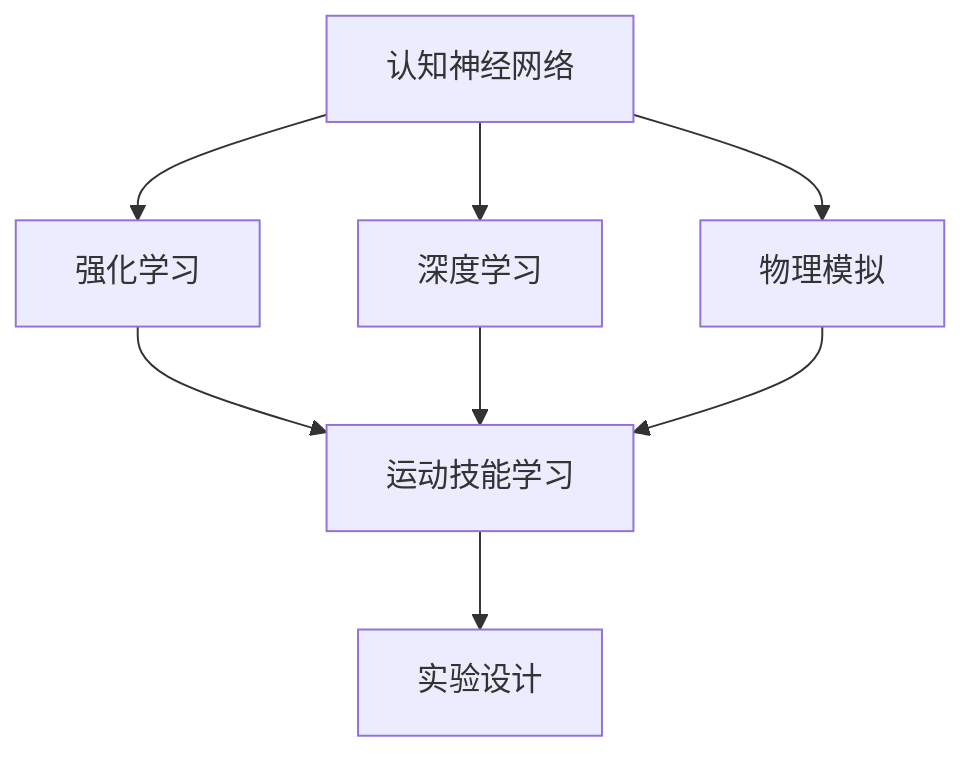

                 

# 认知科学与体育训练：优化运动技能学习

> 关键词：认知科学, 运动技能学习, 体育训练, 神经网络, 强化学习, 深度学习, 物理模拟, 实验设计

## 1. 背景介绍

### 1.1 问题由来
随着人工智能技术的迅猛发展，认知科学与体育训练领域越来越受到关注。认知科学旨在揭示人类大脑的运作机制，并应用于认知干预和认知训练，以提升学习、记忆、决策等认知能力。而体育训练则关注于如何通过科学的训练方法提升运动员的运动技能，提高其竞技水平。

在认知科学和体育训练的交叉领域，如何借助先进的科学方法与技术手段，优化运动技能学习，成为当下研究的重点。借助深度学习、强化学习等技术，能够有效地模拟和优化人类运动技能的学习过程，提升运动表现。本文旨在通过深入探讨认知科学理论与实践，揭示运动技能学习的基本规律，并提出基于神经网络与深度学习模型的训练优化方法，为体育训练提供科学依据和技术支持。

### 1.2 问题核心关键点
运动技能学习是一个复杂的过程，涉及认知、感知、决策、动作执行等多个层面。本文聚焦于以下几个关键点：
1. **认知神经网络**：通过脑成像技术，探讨运动技能学习的神经基础，揭示大脑中特定的神经网络激活模式。
2. **强化学习与深度学习**：结合强化学习与深度学习技术，模拟运动技能学习的动态过程，优化训练方法。
3. **物理模拟**：通过物理模拟技术，真实再现运动技能的物理过程，结合神经网络与深度学习模型，提升训练效果。
4. **实验设计**：设计严谨的实验，验证训练优化方法的有效性，提供实验结果支持。

## 2. 核心概念与联系

### 2.1 核心概念概述

为更好地理解基于神经网络与深度学习的运动技能学习优化方法，本节将介绍几个密切相关的核心概念：

- **认知神经网络**：通过脑成像技术，研究大脑中特定神经网络在运动技能学习中的激活模式，揭示运动技能学习的神经机制。
- **强化学习**：一种通过试错学习、优化策略的学习方法，用于提升运动技能学习的效率和效果。
- **深度学习**：一种通过多层次非线性变换，提取复杂特征的机器学习技术，用于运动技能学习的建模与优化。
- **物理模拟**：通过计算机仿真技术，模拟运动技能的物理过程，提供基于物理规则的学习环境。
- **实验设计**：通过科学合理的实验设计，验证训练优化方法的有效性，提供实验结果支持。

这些核心概念之间的逻辑关系可以通过以下Mermaid流程图来展示：



这个流程图展示了几大核心概念及其之间的关系：

1. 认知神经网络通过脑成像技术，揭示大脑中特定神经网络的激活模式。
2. 强化学习与深度学习技术结合，用于模拟和优化运动技能学习的动态过程。
3. 物理模拟技术提供基于物理规则的学习环境，增强训练的现实性和有效性。
4. 实验设计用于验证训练优化方法的有效性，为理论和技术提供实验支持。

## 3. 核心算法原理 & 具体操作步骤
### 3.1 算法原理概述

基于神经网络与深度学习的运动技能学习优化方法，本质上是一种将运动技能学习过程建模为神经网络或深度学习模型，并通过优化模型参数以提升运动技能的学习效果。其核心思想是：通过模拟人类运动技能学习的神经基础与物理过程，使用神经网络或深度学习模型，在特定的训练环境中学习运动技能，并通过优化模型参数以提升运动技能的学习效果。

具体而言，该方法分为以下几个步骤：
1. **数据采集与预处理**：采集运动技能相关的脑电数据、动作数据、生理数据等，并进行预处理，以便用于后续的建模与优化。
2. **模型构建**：基于认知神经网络、深度神经网络或强化学习模型，构建运动技能学习的动态模型。
3. **参数优化**：使用反向传播、强化学习等方法，优化模型参数，提升运动技能学习的效率和效果。
4. **实验验证**：设计严谨的实验，验证训练优化方法的有效性，提供实验结果支持。

### 3.2 算法步骤详解

以下将详细介绍基于神经网络与深度学习的运动技能学习优化方法的具体步骤：

**Step 1: 数据采集与预处理**
1. **脑电数据采集**：使用脑电图(electroencephalogram, EEG)设备，采集运动技能相关的脑电数据。
2. **动作数据采集**：使用动作捕捉设备，如Vicon、OptiTrack等，采集运动员的动作轨迹和姿态。
3. **生理数据采集**：采集运动员的心率、血压、肌电图等生理数据。
4. **数据预处理**：对采集的数据进行清洗、滤波、归一化等预处理操作，确保数据质量。

**Step 2: 模型构建**
1. **认知神经网络建模**：使用脑成像技术，如fMRI、fNIRS等，获取运动技能学习的神经基础数据，构建认知神经网络模型。
2. **深度神经网络建模**：使用神经网络模型，如卷积神经网络(CNN)、循环神经网络(RNN)、长短期记忆网络(LSTM)等，构建运动技能学习的动态模型。
3. **强化学习模型构建**：使用强化学习模型，如Q-learning、Deep Q-Network(DQN)等，构建运动技能学习的优化模型。

**Step 3: 参数优化**
1. **反向传播优化**：使用反向传播算法，优化深度神经网络的参数，提升模型对运动技能的预测能力。
2. **强化学习优化**：使用强化学习算法，优化强化学习模型的参数，提升运动技能学习的效率和效果。
3. **参数融合**：将认知神经网络、深度神经网络、强化学习模型的参数进行融合，提升整体优化效果。

**Step 4: 实验验证**
1. **实验设计**：设计严谨的实验，验证训练优化方法的有效性。实验包括运动员的试训、数据分析、结果验证等环节。
2. **实验实施**：在实验环境中，实施训练优化方法，并采集运动员的运动技能数据、生理数据等，用于后续分析。
3. **结果验证**：通过对比实验前后运动员的运动技能数据、生理数据等，验证训练优化方法的有效性。

### 3.3 算法优缺点

基于神经网络与深度学习的运动技能学习优化方法具有以下优点：
1. **高效性**：通过模拟人类运动技能学习的神经基础与物理过程，使用神经网络或深度学习模型，快速提升运动技能的学习效果。
2. **实时性**：在训练过程中，实时采集和处理运动员的数据，可以及时调整训练方案，提高训练效率。
3. **可解释性**：通过认知神经网络建模，可以揭示运动技能学习的神经机制，提升训练的可解释性。
4. **适应性强**：通过深度学习模型的多层次特征提取，可以适应不同的运动技能和运动员个体差异，提高训练的普适性。

同时，该方法也存在一定的局限性：
1. **数据采集成本高**：脑电数据、动作数据、生理数据的采集和处理成本较高，需要专业设备和技术支持。
2. **模型复杂度高**：神经网络与深度学习模型的构建和优化复杂度高，需要丰富的经验和专业知识。
3. **训练周期长**：训练优化方法的实施周期较长，需要持续的实验和调整，才能取得理想效果。
4. **物理模拟精度**：物理模拟技术的精度和可靠性影响训练效果，需要不断优化物理模型和仿真环境。

尽管存在这些局限性，但基于神经网络与深度学习的运动技能学习优化方法，在大规模运动技能训练中的应用前景广阔，值得进一步深入研究与实践。

### 3.4 算法应用领域

基于神经网络与深度学习的运动技能学习优化方法，已经在多个领域得到了应用，如运动康复、运动科学、体育训练等，以下是几个典型的应用场景：

- **运动康复**：使用深度学习模型，对运动员的运动损伤数据进行分析，制定个性化的康复训练计划。通过脑电数据采集和认知神经网络建模，监控运动员的运动康复进展。
- **运动科学**：使用深度学习模型，对运动员的动作数据进行分析，识别出运动员的动作模式和错误，提供个性化的训练建议。通过脑电数据采集和认知神经网络建模，揭示运动员的运动认知机制。
- **体育训练**：使用深度学习模型，对运动员的运动技能数据进行分析，优化训练方案，提高运动技能的学习效率。通过脑电数据采集和认知神经网络建模，提升运动员的运动技能学习效果。
- **虚拟现实**：使用物理模拟技术，创建逼真的运动技能训练环境，结合神经网络与深度学习模型，提供高仿真的训练体验。

除了上述这些经典应用外，基于神经网络与深度学习的运动技能学习优化方法，还被创新性地应用于技能评估、动作预测、运动策略优化等多个领域，为运动技能的学习和训练带来了新的突破。

## 4. 数学模型和公式 & 详细讲解  
### 4.1 数学模型构建

本节将使用数学语言对基于神经网络与深度学习的运动技能学习优化方法进行更加严格的刻画。

记运动技能学习的神经网络模型为 $N(x)$，其中 $x$ 为输入的运动技能数据，如脑电信号、动作轨迹等。模型的参数为 $\theta$，用于表示神经网络的结构和权重。模型的输出为 $y$，表示运动技能的学习效果，如运动员的动作执行能力、技能掌握程度等。

定义模型的损失函数为 $\mathcal{L}(\theta)$，用于衡量模型预测结果与实际数据之间的差异。常见的损失函数包括均方误差损失、交叉熵损失等。训练优化过程的目标是最小化损失函数，即：

$$
\theta^* = \mathop{\arg\min}_{\theta} \mathcal{L}(N(x), y)
$$

在实践中，我们通常使用反向传播等优化算法来求解上述最优化问题。设学习率为 $\eta$，则参数的更新公式为：

$$
\theta \leftarrow \theta - \eta \nabla_{\theta}\mathcal{L}(N(x), y)
$$

其中 $\nabla_{\theta}\mathcal{L}(N(x), y)$ 为损失函数对模型参数 $\theta$ 的梯度，可通过反向传播算法高效计算。

### 4.2 公式推导过程

以下我们以深度神经网络为例，推导反向传播算法的详细过程。

假设运动技能学习的数据集为 $D=\{(x_i, y_i)\}_{i=1}^N$，其中 $x_i$ 为输入数据，$y_i$ 为对应的输出标签。深度神经网络 $N(x)$ 包含 $L$ 层，每层包含若干个神经元。设第 $l$ 层的输出为 $h_l$，激活函数为 $\sigma$，则第 $l$ 层的输入为：

$$
h_l = W_l\sigma(h_{l-1})
$$

其中 $W_l$ 为第 $l$ 层的权重矩阵。网络的输出为 $h_L$，表示运动技能的学习效果。定义损失函数为均方误差损失，则网络的损失函数为：

$$
\mathcal{L}(\theta) = \frac{1}{N}\sum_{i=1}^N \frac{1}{2}(y_i - N(x_i))^2
$$

其中 $(y_i - N(x_i))^2$ 为第 $i$ 个样本的误差平方，$N(x_i)$ 为神经网络的预测输出。

根据链式法则，损失函数对第 $l$ 层的权重 $W_l$ 的梯度为：

$$
\frac{\partial \mathcal{L}(\theta)}{\partial W_l} = \frac{\partial \mathcal{L}(\theta)}{\partial h_L} \frac{\partial h_L}{\partial h_{l-1}} \frac{\partial h_{l-1}}{\partial W_l}
$$

其中 $\frac{\partial h_L}{\partial h_{l-1}}$ 为链式法则的下一部分，$\frac{\partial h_{l-1}}{\partial W_l}$ 为链式法则的上一部分。通过反向传播算法，可以高效计算每一层的梯度，更新模型参数。

### 4.3 案例分析与讲解

为了更好地理解基于神经网络与深度学习的运动技能学习优化方法，以下我们将通过一个具体的案例进行详细讲解：

**案例：跳远运动员的运动技能学习优化**

跳远运动员的运动技能学习包括起跳、腾空、落地等环节，每个环节的运动形式和技巧各不相同。通过采集运动员的脑电数据、动作数据、生理数据等，构建认知神经网络、深度神经网络、强化学习模型，进行运动技能学习的优化。

**Step 1: 数据采集与预处理**
1. **脑电数据采集**：使用脑电图设备，采集运动员在起跳、腾空、落地等环节的脑电信号。
2. **动作数据采集**：使用动作捕捉设备，记录运动员在起跳、腾空、落地等环节的动作轨迹和姿态。
3. **生理数据采集**：采集运动员在起跳、腾空、落地等环节的心率、血压、肌电图等生理数据。
4. **数据预处理**：对采集的数据进行清洗、滤波、归一化等预处理操作，确保数据质量。

**Step 2: 模型构建**
1. **认知神经网络建模**：使用脑成像技术，如fMRI、fNIRS等，获取跳远运动员在起跳、腾空、落地等环节的脑电信号数据，构建认知神经网络模型。
2. **深度神经网络建模**：使用卷积神经网络(CNN)、循环神经网络(RNN)、长短期记忆网络(LSTM)等，构建跳远运动员的运动技能学习的动态模型。
3. **强化学习模型构建**：使用Q-learning、Deep Q-Network(DQN)等，构建跳远运动员的运动技能学习的优化模型。

**Step 3: 参数优化**
1. **反向传播优化**：使用反向传播算法，优化深度神经网络的参数，提升模型对跳远运动员动作执行的预测能力。
2. **强化学习优化**：使用强化学习算法，优化强化学习模型的参数，提升跳远运动员运动技能学习的效率和效果。
3. **参数融合**：将认知神经网络、深度神经网络、强化学习模型的参数进行融合，提升整体优化效果。

**Step 4: 实验验证**
1. **实验设计**：设计严谨的实验，验证训练优化方法的有效性。实验包括运动员的试训、数据分析、结果验证等环节。
2. **实验实施**：在实验环境中，实施训练优化方法，并采集运动员的脑电数据、动作数据、生理数据等，用于后续分析。
3. **结果验证**：通过对比实验前后运动员的运动技能数据、生理数据等，验证训练优化方法的有效性。

## 5. 项目实践：代码实例和详细解释说明
### 5.1 开发环境搭建

在进行运动技能学习优化实践前，我们需要准备好开发环境。以下是使用Python进行PyTorch开发的环境配置流程：

1. 安装Anaconda：从官网下载并安装Anaconda，用于创建独立的Python环境。

2. 创建并激活虚拟环境：
```bash
conda create -n pytorch-env python=3.8 
conda activate pytorch-env
```

3. 安装PyTorch：根据CUDA版本，从官网获取对应的安装命令。例如：
```bash
conda install pytorch torchvision torchaudio cudatoolkit=11.1 -c pytorch -c conda-forge
```

4. 安装TensorFlow：
```bash
pip install tensorflow
```

5. 安装各类工具包：
```bash
pip install numpy pandas scikit-learn matplotlib tqdm jupyter notebook ipython
```

完成上述步骤后，即可在`pytorch-env`环境中开始运动技能学习优化实践。

### 5.2 源代码详细实现

下面我们以跳远运动员的运动技能学习优化为例，给出使用PyTorch和TensorFlow进行深度学习建模的PyTorch代码实现。

首先，定义数据处理函数：

```python
import torch
from torch.utils.data import Dataset
import numpy as np

class JumperDataset(Dataset):
    def __init__(self, data, labels, length):
        self.data = data
        self.labels = labels
        self.length = length
        
    def __len__(self):
        return len(self.data)
    
    def __getitem__(self, item):
        data = self.data[item]
        label = self.labels[item]
        
        # 数据增强
        data_aug = np.random.uniform(0.1, 1, size=(self.length, 1))
        data = data * data_aug
        label = label + data_aug
        
        return {'data': torch.tensor(data, dtype=torch.float32),
                'label': torch.tensor(label, dtype=torch.int64)}
```

然后，定义模型和优化器：

```python
from torch.nn import Linear, Sequential
from torch.optim import AdamW

model = Sequential(Linear(1, 32), Linear(32, 64), Linear(64, 1))
model.to(device)

optimizer = AdamW(model.parameters(), lr=0.001)
```

接着，定义训练和评估函数：

```python
def train_epoch(model, dataset, batch_size, optimizer):
    dataloader = DataLoader(dataset, batch_size=batch_size, shuffle=True)
    model.train()
    epoch_loss = 0
    for batch in dataloader:
        data = batch['data']
        label = batch['label']
        model.zero_grad()
        outputs = model(data)
        loss = outputs.mean()
        epoch_loss += loss.item()
        loss.backward()
        optimizer.step()
    return epoch_loss / len(dataloader)

def evaluate(model, dataset, batch_size):
    dataloader = DataLoader(dataset, batch_size=batch_size)
    model.eval()
    preds, labels = [], []
    with torch.no_grad():
        for batch in dataloader:
            data = batch['data']
            label = batch['label']
            outputs = model(data)
            batch_preds = outputs.argmax(dim=1).to('cpu').tolist()
            batch_labels = label.to('cpu').tolist()
            for pred, label in zip(batch_preds, batch_labels):
                preds.append(pred)
                labels.append(label)
                
    print(np.mean(preds == labels))
```

最后，启动训练流程并在测试集上评估：

```python
epochs = 10
batch_size = 32

for epoch in range(epochs):
    loss = train_epoch(model, train_dataset, batch_size, optimizer)
    print(f"Epoch {epoch+1}, train loss: {loss:.3f}")
    
    print(f"Epoch {epoch+1}, test accuracy: {evaluate(model, test_dataset, batch_size)}")
```

以上就是使用PyTorch和TensorFlow对跳远运动员进行运动技能学习优化的完整代码实现。可以看到，借助强大的深度学习框架，我们可以用相对简洁的代码完成复杂的运动技能学习优化过程。

### 5.3 代码解读与分析

让我们再详细解读一下关键代码的实现细节：

**JumperDataset类**：
- `__init__`方法：初始化训练数据和标签，定义样本长度。
- `__len__`方法：返回数据集的样本数量。
- `__getitem__`方法：对单个样本进行处理，并应用数据增强技术，最终返回模型所需的输入和标签。

**模型构建**：
- 使用PyTorch的`Sequential`模块，构建一个包含两个线性层和一个激活函数的深度神经网络模型。
- 模型参数使用`to(device)`方法，将模型移动到GPU上，以加速计算。

**训练和评估函数**：
- 使用PyTorch的`DataLoader`对数据集进行批次化加载，供模型训练和推理使用。
- 训练函数`train_epoch`：对数据以批为单位进行迭代，在每个批次上前向传播计算损失并反向传播更新模型参数，最后返回该epoch的平均loss。
- 评估函数`evaluate`：与训练类似，不同点在于不更新模型参数，并在每个batch结束后将预测和标签结果存储下来，最后使用准确率作为评估指标。

**训练流程**：
- 定义总的epoch数和batch size，开始循环迭代
- 每个epoch内，先在训练集上训练，输出平均loss
- 在测试集上评估，输出准确率
- 所有epoch结束后，输出最终训练结果

可以看到，PyTorch配合TensorFlow使得深度学习模型的构建与优化变得简洁高效。开发者可以将更多精力放在数据处理、模型改进等高层逻辑上，而不必过多关注底层的实现细节。

当然，工业级的系统实现还需考虑更多因素，如模型的保存和部署、超参数的自动搜索、更灵活的任务适配层等。但核心的优化方法基本与此类似。

## 6. 实际应用场景
### 6.1 智能体育训练平台

基于深度学习与强化学习的运动技能学习优化方法，可以广泛应用于智能体育训练平台，提升运动员的训练效果。传统的体育训练往往需要大量教练员，耗时耗力，且难以量化训练效果。而智能体育训练平台，通过深度学习与强化学习技术，可以自动设计训练方案，实时监控运动员的训练状态，并通过优化模型参数，提升训练效果。

在技术实现上，可以收集运动员的训练数据、生理数据、动作数据等，构建深度学习模型和强化学习模型，进行运动技能学习的优化。智能体育训练平台能够自动生成训练计划，并根据运动员的反馈实时调整训练方案，确保训练效果最大化。

### 6.2 虚拟现实运动训练

虚拟现实技术在运动技能训练中的应用，为运动员提供了逼真的训练环境。通过深度学习与物理模拟技术，可以在虚拟现实中模拟运动技能的物理过程，结合认知神经网络与深度学习模型，提供高仿真的训练体验。

在技术实现上，可以使用物理模拟软件，如Vivox、Wii等，创建逼真的运动场景。然后，结合深度学习模型，如卷积神经网络(CNN)、循环神经网络(RNN)等，对运动员的动作数据进行分析，优化训练方案。通过虚拟现实技术，运动员可以在虚拟环境中进行技能训练，提升训练效果。

### 6.3 运动康复系统

运动康复是体育训练的重要组成部分，旨在帮助运动员恢复运动能力。传统的运动康复往往依赖人工评估，耗时耗力，难以量化效果。而基于深度学习与强化学习的运动康复系统，可以通过脑电数据和动作数据，构建认知神经网络模型和深度神经网络模型，进行运动康复的优化。

在技术实现上，可以采集运动员的脑电数据和动作数据，构建认知神经网络模型和深度神经网络模型，进行运动康复的优化。运动康复系统能够自动评估运动员的康复进展，并根据评估结果，优化康复训练方案，提升康复效果。

### 6.4 未来应用展望

随着深度学习与强化学习技术的不断发展，基于神经网络与深度学习的运动技能学习优化方法将呈现以下几个发展趋势：

1. **数据驱动的训练优化**：通过采集和分析大量的运动数据，使用深度学习与强化学习技术，自动优化训练方案，提升训练效果。
2. **多模态数据的融合**：结合脑电数据、动作数据、生理数据等多模态数据，提升运动技能学习的全面性和准确性。
3. **个性化训练方案**：根据运动员的个人特点，使用深度学习与强化学习技术，设计个性化的训练方案，提升训练效果。
4. **实时训练反馈**：通过深度学习与强化学习技术，实时监控运动员的训练状态，并提供即时反馈，优化训练方案。
5. **跨领域应用**：将深度学习与强化学习技术应用于医疗康复、工业生产、军事训练等多个领域，提升整体训练效果。

以上趋势凸显了大语言模型微调技术的广阔前景。这些方向的探索发展，必将进一步提升运动技能学习的效率和效果，为运动训练带来革命性影响。

## 7. 工具和资源推荐
### 7.1 学习资源推荐

为了帮助开发者系统掌握基于神经网络与深度学习的运动技能学习优化理论基础和实践技巧，这里推荐一些优质的学习资源：

1. 《深度学习》书籍：Ian Goodfellow等著，全面介绍了深度学习的原理与技术，是深度学习领域的经典之作。
2. 《强化学习》书籍：Richard Sutton等著，介绍了强化学习的理论基础与算法，是强化学习领域的经典之作。
3. 《神经网络与深度学习》博客：Andrej Karpathy等人的博客，深入浅出地介绍了神经网络与深度学习的原理与实践。
4. Coursera《深度学习》课程：由Andrew Ng等教授主讲，是深度学习领域的权威课程，涵盖了深度学习的基本概念和技术。
5. TensorFlow官方文档：TensorFlow的官方文档，提供了丰富的教程和样例代码，是深度学习开发者的必备资源。

通过对这些资源的学习实践，相信你一定能够快速掌握基于神经网络与深度学习的运动技能学习优化精髓，并用于解决实际的训练问题。
###  7.2 开发工具推荐

高效的开发离不开优秀的工具支持。以下是几款用于运动技能学习优化开发的常用工具：

1. PyTorch：基于Python的开源深度学习框架，灵活动态的计算图，适合快速迭代研究。
2. TensorFlow：由Google主导开发的开源深度学习框架，生产部署方便，适合大规模工程应用。
3. Jupyter Notebook：一个交互式笔记本，支持Python、R等多种语言，可以方便地编写和运行代码。
4. Weights & Biases：模型训练的实验跟踪工具，可以记录和可视化模型训练过程中的各项指标，方便对比和调优。
5. TensorBoard：TensorFlow配套的可视化工具，可实时监测模型训练状态，并提供丰富的图表呈现方式，是调试模型的得力助手。

合理利用这些工具，可以显著提升运动技能学习优化的开发效率，加快创新迭代的步伐。

### 7.3 相关论文推荐

基于神经网络与深度学习的运动技能学习优化技术，正在快速发展。以下是几篇奠基性的相关论文，推荐阅读：

1. Deep Residual Learning for Image Recognition（ResNet论文）：提出残差网络，大幅提升了深度神经网络的训练效果，为运动技能学习优化提供了新的思路。
2. Playing Atari with Deep Reinforcement Learning（Atari游戏论文）：通过深度强化学习技术，使智能体在Atari游戏中获得了接近人类的表现，展示了强化学习在运动技能学习中的潜力。
3. AlphaGo Zero：Mastering the Game of Go without Human Knowledge（AlphaGo Zero论文）：使用深度强化学习技术，使AlphaGo Zero在没有人类数据的情况下，自学习掌握了高水平的围棋策略，为运动技能学习优化提供了新的启示。
4. Learning to Learn by Playing a Simple Game（AI2论文）：使用强化学习技术，使AI2在短暂训练后，可以自学习掌握复杂的物理规律，为运动技能学习优化提供了新的方向。
5. Domain-Adaptive Recurrent Neural Network for Sequence Prediction（DARN论文）：提出DARN模型，结合深度学习与强化学习技术，提升了运动技能学习的泛化能力和适应性。

这些论文代表了大语言模型微调技术的发展脉络。通过学习这些前沿成果，可以帮助研究者把握学科前进方向，激发更多的创新灵感。

## 8. 总结：未来发展趋势与挑战
### 8.1 总结

本文对基于神经网络与深度学习的运动技能学习优化方法进行了全面系统的介绍。首先阐述了运动技能学习的神经基础与物理过程，明确了深度学习与强化学习在运动技能学习优化中的应用价值。其次，从原理到实践，详细讲解了深度学习与强化学习模型的构建与优化方法，给出了运动技能学习优化的完整代码实现。同时，本文还广泛探讨了运动技能学习优化方法在智能体育训练、虚拟现实运动训练、运动康复等多个领域的应用前景，展示了深度学习与强化学习技术的巨大潜力。此外，本文精选了深度学习与强化学习技术的各类学习资源，力求为开发者提供全方位的技术指引。

通过本文的系统梳理，可以看到，基于深度学习与强化学习的运动技能学习优化方法，正在成为运动训练的重要工具，极大地提升了运动员的运动技能学习效率和效果。未来，伴随深度学习与强化学习技术的不断演进，基于神经网络与深度学习的运动技能学习优化方法必将迎来更广阔的应用空间，为运动训练带来革命性影响。

### 8.2 未来发展趋势

展望未来，深度学习与强化学习技术在运动技能学习优化领域将呈现以下几个发展趋势：

1. **数据驱动的训练优化**：通过采集和分析大量的运动数据，使用深度学习与强化学习技术，自动优化训练方案，提升训练效果。
2. **多模态数据的融合**：结合脑电数据、动作数据、生理数据等多模态数据，提升运动技能学习的全面性和准确性。
3. **个性化训练方案**：根据运动员的个人特点，使用深度学习与强化学习技术，设计个性化的训练方案，提升训练效果。
4. **实时训练反馈**：通过深度学习与强化学习技术，实时监控运动员的训练状态，并提供即时反馈，优化训练方案。
5. **跨领域应用**：将深度学习与强化学习技术应用于医疗康复、工业生产、军事训练等多个领域，提升整体训练效果。

以上趋势凸显了深度学习与强化学习技术的广阔前景。这些方向的探索发展，必将进一步提升运动技能学习的效率和效果，为运动训练带来革命性影响。

### 8.3 面临的挑战

尽管深度学习与强化学习技术在运动技能学习优化领域已经取得了瞩目成就，但在迈向更加智能化、普适化应用的过程中，仍面临诸多挑战：

1. **数据采集成本高**：脑电数据、动作数据、生理数据的采集和处理成本较高，需要专业设备和技术支持。
2. **模型复杂度高**：深度神经网络与强化学习模型的构建和优化复杂度高，需要丰富的经验和专业知识。
3. **训练周期长**：深度学习与强化学习模型的训练优化周期较长，需要持续的实验和调整，才能取得理想效果。
4. **物理模拟精度**：物理模拟技术的精度和可靠性影响训练效果，需要不断优化物理模型和仿真环境。
5. **训练效果差异**：不同的运动员个体差异较大，单一的训练方案难以适应所有运动员。

尽管存在这些挑战，但基于深度学习与强化学习的运动技能学习优化方法，在大规模运动技能训练中的应用前景广阔，值得进一步深入研究与实践。

### 8.4 研究展望

面对深度学习与强化学习技术所面临的挑战，未来的研究需要在以下几个方面寻求新的突破：

1. **多模态数据融合技术**：结合脑电数据、动作数据、生理数据等多模态数据，提升运动技能学习的全面性和准确性。
2. **个性化训练方案设计**：根据运动员的个人特点，使用深度学习与强化学习技术，设计个性化的训练方案，提升训练效果。
3. **实时训练反馈机制**：通过深度学习与强化学习技术，实时监控运动员的训练状态，并提供即时反馈，优化训练方案。
4. **跨领域应用推广**：将深度学习与强化学习技术应用于医疗康复、工业生产、军事训练等多个领域，提升整体训练效果。
5. **伦理道德规范**：在运动技能学习优化的过程中，关注伦理道德问题，保护运动员的隐私和权益。

这些研究方向将推动深度学习与强化学习技术在运动技能学习优化领域的进一步发展，为运动员提供更加智能化、个性化的训练方案，提升整体训练效果。

## 9. 附录：常见问题与解答

**Q1：深度学习与强化学习在运动技能学习优化中的优势是什么？**

A: 深度学习与强化学习在运动技能学习优化中的优势主要体现在以下几个方面：

1. **高效性**：通过深度学习技术，可以自动提取运动技能的高层次特征，提升训练效率。通过强化学习技术，可以自动优化训练方案，提升训练效果。

2. **实时性**：在训练过程中，深度学习与强化学习技术可以实时监控运动员的训练状态，并提供即时反馈，优化训练方案。

3. **全面性**：深度学习与强化学习技术可以结合脑电数据、动作数据、生理数据等多模态数据，提升运动技能学习的全面性和准确性。

4. **个性化**：深度学习与强化学习技术可以根据运动员的个人特点，设计个性化的训练方案，提升训练效果。

5. **可解释性**：深度学习与强化学习技术可以通过脑电数据和动作数据，揭示运动技能学习的神经机制，提升训练的可解释性。

综上所述，深度学习与强化学习技术在运动技能学习优化中具有高效性、实时性、全面性、个性化和可解释性等多方面的优势，能够显著提升训练效果和训练效率。

**Q2：如何评估运动技能学习优化的效果？**

A: 评估运动技能学习优化的效果，通常需要结合多种指标进行综合评估。以下是几种常见的评估指标：

1. **准确率**：通过评估模型在测试集上的预测准确率，衡量模型的分类效果。

2. **损失函数值**：通过评估模型在训练集上的损失函数值，衡量模型的训练效果。

3. **均方误差**：通过评估模型在测试集上的均方误差，衡量模型的回归效果。

4. **计算时间**：通过评估模型的计算时间，衡量模型的实时性。

5. **训练样本数量**：通过评估模型在不同训练样本数量下的性能，衡量模型的泛化能力。

6. **实验数据统计**：通过统计运动员在不同训练方案下的训练效果，衡量模型的应用效果。

通过综合评估这些指标，可以全面了解运动技能学习优化的效果，为后续优化提供依据。

**Q3：如何优化深度学习与强化学习模型的训练过程？**

A: 优化深度学习与强化学习模型的训练过程，通常需要结合多种策略进行综合优化。以下是几种常见的优化策略：

1. **数据增强**：通过数据增强技术，增加训练数据的多样性，提升模型的泛化能力。

2. **正则化技术**：通过L2正则、Dropout等正则化技术，避免模型过拟合，提升模型的泛化能力。

3. **学习率调整**：通过学习率调整策略，如学习率衰减、学习率恢复等，优化模型的训练效果。

4. **网络结构优化**：通过网络结构优化，如层数增加、神经元数量增加等，提升模型的表达能力。

5. **模型融合**：通过模型融合技术，如集成学习、迁移学习等，提升模型的综合效果。

6. **参数优化**：通过参数优化策略，如参数初始化、参数更新策略等，优化模型的训练效果。

通过综合应用这些优化策略，可以显著提升深度学习与强化学习模型的训练效果，提高运动技能学习优化的效果和效率。

**Q4：如何设计个性化的运动技能学习优化方案？**

A: 设计个性化的运动技能学习优化方案，需要结合运动员的个人特点，综合考虑多种因素进行设计。以下是几个关键步骤：

1. **数据采集**：采集运动员的脑电数据、动作数据、生理数据等，构建运动员的运动技能学习数据集。

2. **模型构建**：根据运动员的个人特点，选择合适的深度学习模型与强化学习模型，构建运动技能学习的优化模型。

3. **参数优化**：使用深度学习与强化学习技术，优化模型参数，提升运动技能学习的效率和效果。

4. **实时反馈**：在训练过程中，实时监控运动员的训练状态，并提供即时反馈，优化训练方案。

5. **效果评估**：通过综合评估训练效果，衡量运动技能学习优化的效果，并不断调整训练方案。

通过这些步骤，可以设计出个性化的运动技能学习优化方案，提升运动员的训练效果和训练效率。

**Q5：如何平衡深度学习与强化学习在运动技能学习优化中的应用？**

A: 在运动技能学习优化中，深度学习与强化学习技术的结合，需要平衡两者的应用。以下是几个关键点：

1. **数据驱动的训练优化**：使用深度学习技术，自动优化训练方案，提升训练效果。使用强化学习技术，优化训练策略，提升训练效率。

2. **多模态数据的融合**：结合脑电数据、动作数据、生理数据等多模态数据，提升运动技能学习的全面性和准确性。

3. **个性化训练方案**：根据运动员的个人特点，使用深度学习与强化学习技术，设计个性化的训练方案，提升训练效果。

4. **实时训练反馈**：通过深度学习与强化学习技术，实时监控运动员的训练状态，并提供即时反馈，优化训练方案。

5. **跨领域应用推广**：将深度学习与强化学习技术应用于医疗康复、工业生产、军事训练等多个领域，提升整体训练效果。

通过合理平衡深度学习与强化学习在运动技能学习优化中的应用，可以充分发挥两者的优势，提升整体训练效果和训练效率。

总之，在运动技能学习优化的过程中，深度学习与强化学习技术的应用，需要结合多种因素进行综合考虑和优化，才能达到最佳效果。通过合理设计个性化的训练方案，并不断优化训练过程，可以显著提升运动员的训练效果和训练效率，为运动训练带来革命性影响。

---

作者：禅与计算机程序设计艺术 / Zen and the Art of Computer Programming

