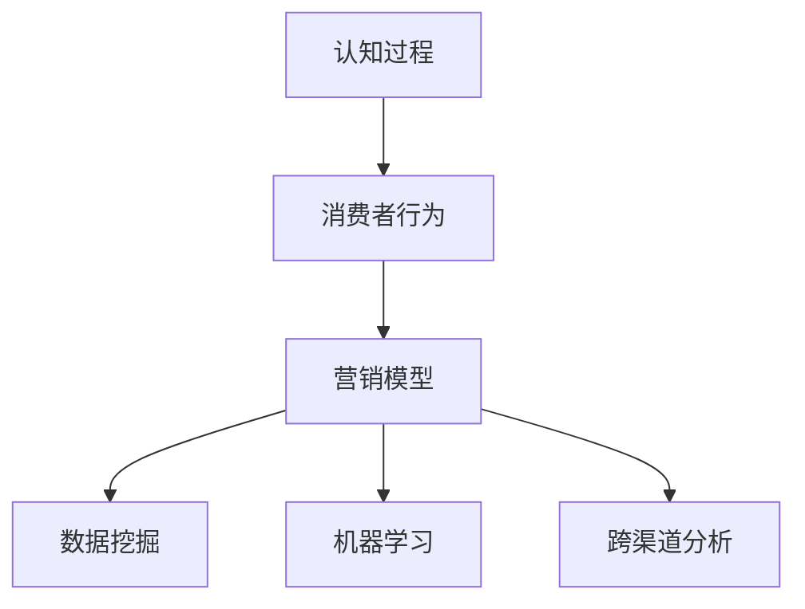

                 

# 认知科学与市场营销：理解消费者行为的新视角

> 关键词：认知科学, 市场营销, 消费者行为, 行为数据, 神经网络, 预测模型, 产品推荐

## 1. 背景介绍

### 1.1 问题由来

市场营销一直是企业战略中的重要一环，而理解消费者的行为和需求是实现精准营销的基础。传统的市场调研方法如问卷调查、面对面访谈等，尽管在收集消费者的定性信息方面有所建树，但这些方法往往耗时耗力、成本高昂，且难以获得全面的消费者行为数据。随着大数据和人工智能技术的发展，越来越多的企业开始借助算法模型和数据挖掘技术来深入分析消费者的行为模式，以驱动更精准的营销决策。

### 1.2 问题核心关键点

现代市场营销正逐渐向数据驱动的方向转变，基于认知科学的消费者行为分析成为了这一趋势的重要推动力。认知科学通过研究人类认知过程和心理特征，帮助企业更深入地理解消费者的行为动机，从而设计更加有针对性的营销策略。主要包括以下几个关键点：

1. 消费者行为模式的自动发现：利用机器学习算法分析大量消费者数据，自动识别出消费者的行为模式和偏好。
2. 消费者情感与动机的深入洞察：结合心理学理论，分析消费者的情感状态和动机，预测其行为变化。
3. 跨渠道消费者行为整合：通过统一用户数据模型，整合线上线下渠道的数据，实现对消费者全渠道行为的全面洞察。

### 1.3 问题研究意义

1. 提高市场营销精准度：借助认知科学和数据挖掘技术，企业可以更准确地识别和理解消费者的行为特征，从而设计更加精准的营销策略。
2. 降低营销成本：相比传统的市场调研方法，算法模型可以显著降低数据收集和分析的成本。
3. 增强市场响应速度：算法模型能够实时分析消费者数据，快速响应市场变化。
4. 提供科学决策支持：基于认知科学的消费者行为分析，能够提供可靠的科学决策依据，提升企业的市场竞争力。

## 2. 核心概念与联系

### 2.1 核心概念概述

认知科学旨在研究人类认知过程，涵盖感知、记忆、思维、情感等多个方面。将认知科学引入市场营销，有助于理解消费者的行为和决策过程，从而设计更加人性化的营销策略。以下是几个关键概念：

- **认知过程(Cognitive Process)**：包括感知、记忆、思维、情感等，是消费者行为的基础。
- **消费者行为(Consumer Behavior)**：消费者在购买决策和消费过程中的行为模式和偏好。
- **营销模型(Marketing Model)**：用于描述和预测消费者行为的数学模型，通常包括各种算法和预测方法。
- **数据挖掘(Data Mining)**：从大量消费者数据中提取有用信息和模式的技术。
- **机器学习(Machine Learning)**：通过算法训练预测模型，自动识别消费者行为规律。
- **跨渠道分析(Cross-Channel Analysis)**：整合线上线下渠道的数据，实现对消费者全渠道行为的全面洞察。

这些概念通过一个简单的Mermaid流程图来展示它们的联系：



### 2.2 核心概念原理和架构

认知科学理论认为，消费者的行为由一系列心理和认知过程驱动。当消费者接触到产品或服务时，会经过感知、认知、情感等多个阶段，最终形成购买决策。这一过程可以通过认知神经科学、心理学等学科进行建模和分析。

以下是一个简单的认知科学-市场营销模型，其中包含几个核心组件：

- **感知模块(Perception Module)**：模拟消费者对产品和广告的感知过程，包括视觉、听觉等感官输入。
- **认知模块(Cognitive Module)**：描述消费者的思维过程，包括记忆、推理等。
- **情感模块(Affective Module)**：反映消费者的情感状态，如满意、不满、愉悦等。
- **行为模块(Behavior Module)**：结合感知、认知和情感信息，生成消费者的购买决策和行为模式。

该模型可以形式化表示如下：

$$
B = f(P, C, A)
$$

其中，$B$ 表示消费者的行为，$P$ 表示感知信息，$C$ 表示认知信息，$A$ 表示情感信息，$f$ 表示行为生成函数。

在营销策略设计中，通过调整感知、认知和情感模块的输入，可以影响消费者的最终行为。例如，通过优化产品设计、增加情感色彩、提升广告创意等方式，可以有效提升消费者对产品和服务的满意度和购买意愿。

## 3. 核心算法原理 & 具体操作步骤

### 3.1 算法原理概述

基于认知科学的市场营销分析，可以通过多种算法模型实现。核心算法包括：

- **决策树(Decision Trees)**：用于分类和预测，可以分析消费者的行为模式和偏好。
- **随机森林(Random Forests)**：结合多个决策树模型，提高预测的准确性和鲁棒性。
- **神经网络(Neural Networks)**：通过多层网络结构模拟人类认知过程，深度挖掘消费者行为的潜在规律。
- **深度学习(Deep Learning)**：通过深度神经网络，学习复杂的消费者行为模式。
- **强化学习(Reinforcement Learning)**：通过奖励机制调整模型参数，优化消费者行为预测。

这些算法模型通过不断迭代和优化，可以逐步揭示消费者行为的潜在规律，并提供精准的营销决策支持。

### 3.2 算法步骤详解

以深度学习模型为例，展示基于认知科学的市场营销分析的详细步骤：

1. **数据收集**：收集消费者的行为数据，如购买记录、浏览历史、评价反馈等。
2. **数据预处理**：对数据进行清洗、归一化、特征工程等预处理操作，以便算法模型进行训练。
3. **模型训练**：使用神经网络模型，训练预测消费者行为的深度学习模型。
4. **模型评估**：通过交叉验证等方法，评估模型的预测准确率和鲁棒性。
5. **模型优化**：根据评估结果，调整模型参数，提升预测性能。
6. **行为预测**：利用训练好的模型，对未来的消费者行为进行预测和分析。

### 3.3 算法优缺点

基于认知科学的市场营销分析算法具有以下优点：

1. **自动化**：算法模型可以自动从数据中学习消费者行为模式，提高分析效率。
2. **准确性**：深度学习等算法可以捕捉复杂的消费者行为规律，提供高精度的预测结果。
3. **适应性**：算法模型可以动态调整，适应市场的变化。
4. **可解释性**：通过神经网络等模型，可以揭示消费者行为的潜在机制，提高策略的可解释性。

但同时也存在以下缺点：

1. **数据依赖性**：模型依赖于高质量的数据，数据质量和数量的不足会影响分析结果。
2. **复杂性**：算法模型的训练和优化过程较为复杂，需要专业的知识和经验。
3. **黑盒问题**：深度学习模型通常是黑盒系统，难以解释其内部工作机制。
4. **成本高**：高精度的算法模型往往需要较高的计算资源和训练时间。

### 3.4 算法应用领域

基于认知科学的市场营销分析在多个领域得到了广泛应用，包括但不限于：

- **零售行业**：通过分析消费者的购买记录和浏览行为，优化库存管理、个性化推荐和促销活动设计。
- **电商行业**：利用消费者反馈和行为数据，提升客户服务质量、优化产品设计和广告投放策略。
- **金融行业**：结合消费者交易数据和行为模式，设计精准的投资组合和风险管理策略。
- **旅游行业**：通过分析消费者的旅游偏好和行为数据，优化旅游线路设计、提高客户满意度。
- **医疗行业**：结合患者的行为数据和健康记录，设计个性化的健康管理和医疗服务方案。

## 4. 数学模型和公式 & 详细讲解 & 举例说明

### 4.1 数学模型构建

以决策树模型为例，展示市场营销分析的数学模型构建过程：

设消费者行为 $B$ 由感知 $P$、认知 $C$ 和情感 $A$ 共同决定，可以构建决策树模型：

$$
T = (N, D, R)
$$

其中，$N$ 表示决策树的节点集，$D$ 表示节点对应的特征集，$R$ 表示节点对应的规则集。

以一个简单的决策树为例，表示消费者是否会购买某产品的决策过程：

```
决策树根节点（是否购买）
      ├── 感知（产品广告）┤
      ├── 认知（产品评价）┤
      └── 情感（产品满意度）
          ├── 是
          └── 否
```

每个节点表示一个特征或特征的取值，通过比较节点对应的特征或取值，决定消费者的购买决策。

### 4.2 公式推导过程

以下推导一个简单的决策树公式：

假设消费者购买某产品的行为 $B$ 可以表示为：

$$
B = f(P, C, A) = P \times C \times A
$$

其中，$P$ 为感知信息，$C$ 为认知信息，$A$ 为情感信息。

设 $P$、$C$、$A$ 的取值分别为 $p_1$、$c_1$、$a_1$ 和 $p_2$、$c_2$、$a_2$，则：

$$
f(p_1, c_1, a_1) = 0.8 \times 0.6 \times 0.7
$$

$$
f(p_2, c_2, a_2) = 0.2 \times 0.4 \times 0.3
$$

因此，该消费者的购买概率为 $0.8 \times 0.6 \times 0.7 + 0.2 \times 0.4 \times 0.3 = 0.621$。

### 4.3 案例分析与讲解

以零售行业为例，展示决策树在市场营销中的应用：

设零售商希望预测消费者是否会购买某类产品。收集历史购买数据，构建决策树模型，步骤如下：

1. **数据收集**：收集消费者的购买记录、评价反馈、搜索历史等数据。
2. **数据预处理**：对数据进行清洗、归一化、特征选择等预处理操作。
3. **模型训练**：使用决策树算法，训练预测消费者是否会购买某类产品的模型。
4. **模型评估**：通过交叉验证等方法，评估模型的预测准确率和鲁棒性。
5. **行为预测**：利用训练好的模型，对新消费者的购买行为进行预测和分析。

例如，设某消费者的感知信息为 $p_1=0.8$（购买过类似产品），认知信息为 $c_1=0.6$（查看过同类产品的评价），情感信息为 $a_1=0.7$（对同类产品的评价正面）。

通过决策树模型预测，该消费者购买该类产品的概率为 $0.8 \times 0.6 \times 0.7 + 0.2 \times 0.4 \times 0.3 = 0.621$。

## 5. 项目实践：代码实例和详细解释说明

### 5.1 开发环境搭建

在进行市场营销分析项目开发前，需要准备好开发环境。以下是使用Python进行Scikit-Learn开发的环境配置流程：

1. 安装Anaconda：从官网下载并安装Anaconda，用于创建独立的Python环境。
2. 创建并激活虚拟环境：
```bash
conda create -n marketing-env python=3.8 
conda activate marketing-env
```

3. 安装Scikit-Learn：从官网获取对应的安装命令。例如：
```bash
conda install scikit-learn
```

4. 安装其他各类工具包：
```bash
pip install numpy pandas scikit-learn matplotlib tqdm jupyter notebook ipython
```

完成上述步骤后，即可在`marketing-env`环境中开始市场营销分析项目的开发。

### 5.2 源代码详细实现

下面我们以零售行业为例，给出使用Scikit-Learn进行消费者行为分析的Python代码实现。

首先，定义消费者行为预测函数：

```python
from sklearn.tree import DecisionTreeClassifier
from sklearn.metrics import accuracy_score
from sklearn.model_selection import train_test_split

def consumer_behavior_predict(X, y, test_size=0.2):
    X_train, X_test, y_train, y_test = train_test_split(X, y, test_size=test_size, random_state=42)
    
    model = DecisionTreeClassifier()
    model.fit(X_train, y_train)
    y_pred = model.predict(X_test)
    
    accuracy = accuracy_score(y_test, y_pred)
    print(f"Accuracy: {accuracy:.3f}")
    
    return model
```

然后，定义数据处理函数：

```python
import pandas as pd
from sklearn.preprocessing import LabelEncoder

def process_data(data_file):
    df = pd.read_csv(data_file)
    
    # 特征选择
    selected_features = ['perception', 'cognition', 'affect']
    df_selected = df[selected_features]
    
    # 标签选择
    target = 'behavior'
    
    # 标签编码
    le = LabelEncoder()
    le.fit(df[target])
    df[target] = le.transform(df[target])
    
    return df_selected, df[target]
```

接着，加载和处理数据：

```python
data_file = 'consumer_data.csv'
data_selected, y = process_data(data_file)
X = data_selected.drop('behavior', axis=1)
y = y.reshape(-1, 1)
```

最后，调用函数进行行为预测：

```python
model = consumer_behavior_predict(X, y)
```

以上就是使用Scikit-Learn进行消费者行为分析的完整代码实现。可以看到，利用Scikit-Learn库，我们可以很方便地构建决策树模型并进行消费者行为预测。

### 5.3 代码解读与分析

让我们再详细解读一下关键代码的实现细节：

**consumer_behavior_predict函数**：
- `train_test_split`方法：将数据集划分为训练集和测试集，设定测试集比例为20%。
- `DecisionTreeClassifier`类：定义决策树模型。
- `fit`方法：使用训练数据拟合模型。
- `predict`方法：使用测试数据进行预测。
- `accuracy_score`函数：计算预测准确率。

**process_data函数**：
- `pd.read_csv`方法：读取CSV文件数据。
- `selected_features`列表：选择用于建模的特征。
- `target`变量：设定目标变量。
- `LabelEncoder`类：进行标签编码。
- `fit`和`transform`方法：对标签进行编码。
- `drop`方法：移除目标变量。

通过以上代码，我们可以实现对消费者行为的高效预测，进而为营销策略的制定提供数据支持。

## 6. 实际应用场景

### 6.1 智能零售系统

智能零售系统是市场营销分析的重要应用场景之一。通过深度学习模型，智能零售系统可以分析消费者的购物行为，预测其购买意向，从而提供个性化的购物推荐和促销活动设计。

例如，一家电商平台可以通过消费者历史购买记录、浏览历史、评价反馈等数据，构建消费者行为预测模型。利用该模型，系统可以实时分析消费者的购物行为，并根据其购买意向，推荐合适的商品和促销活动，提升用户满意度，增加销售额。

### 6.2 智能广告投放

在智能广告投放中，基于认知科学的市场营销分析可以实时优化广告投放策略，提高广告效果和ROI。

例如，一家广告公司可以收集用户的浏览历史、搜索行为、点击记录等数据，构建用户行为预测模型。通过该模型，系统可以预测用户对不同广告内容的兴趣和点击概率，从而优化广告投放策略，选择最合适的广告内容，提高广告的点击率和转化率。

### 6.3 个性化推荐系统

个性化推荐系统是市场营销分析的另一重要应用场景。通过深度学习模型，系统可以分析消费者的历史行为，预测其对不同商品或服务的偏好，从而提供个性化的推荐服务。

例如，一家视频流媒体平台可以通过用户历史观看记录、评分、收藏等数据，构建用户行为预测模型。利用该模型，系统可以实时分析用户的观看行为，推荐其可能感兴趣的电影和电视剧，提升用户体验和平台留存率。

## 7. 工具和资源推荐

### 7.1 学习资源推荐

为了帮助市场营销分析开发者系统掌握认知科学和数据挖掘技术，这里推荐一些优质的学习资源：

1. **《认知科学导论》**：一本介绍认知科学基本概念和理论的入门书籍，适合初学者阅读。
2. **Coursera《机器学习》课程**：由斯坦福大学教授Andrew Ng主讲的机器学习课程，涵盖了多种算法模型的原理和实现方法。
3. **Kaggle数据集**：Kaggle平台提供了大量市场营销相关的数据集，适合进行实战练习。
4. **Scikit-Learn官方文档**：Scikit-Learn官方文档，提供了详细的API文档和示例代码，是学习Scikit-Learn的重要资源。
5. **TensorFlow官方文档**：TensorFlow官方文档，提供了丰富的深度学习模型和算法实现，适合进阶学习。

通过对这些资源的学习实践，相信你一定能够快速掌握市场营销分析的理论基础和实践技巧，并用于解决实际的营销问题。

### 7.2 开发工具推荐

高效的开发离不开优秀的工具支持。以下是几款用于市场营销分析开发的常用工具：

1. **Jupyter Notebook**：一个交互式的数据科学工作环境，支持Python、R等多种编程语言，适合进行数据可视化和分析。
2. **TensorBoard**：TensorFlow配套的可视化工具，可以实时监测模型训练状态，提供丰富的图表呈现方式。
3. **PyTorch**：一个灵活高效的深度学习框架，适合进行复杂的深度学习模型开发。
4. **Scikit-Learn**：一个易于使用的Python机器学习库，提供了多种算法模型的实现，适合进行数据分析和建模。
5. **MATLAB**：一个功能强大的数学计算和可视化工具，适合进行复杂的数值计算和算法实现。

合理利用这些工具，可以显著提升市场营销分析项目的开发效率，加快创新迭代的步伐。

### 7.3 相关论文推荐

市场营销分析的发展离不开学术界的持续研究。以下是几篇奠基性的相关论文，推荐阅读：

1. **《Consumer Behavior Modeling with Artificial Neural Networks》**：提出基于神经网络的消费者行为建模方法，展示了其在市场营销分析中的应用。
2. **《Market Segmentation via Clustering Consumer Behavior Profiles》**：介绍基于聚类算法的消费者行为分割方法，用于细分市场和个性化营销。
3. **《Deep Learning for Customer Sentiment Analysis》**：利用深度学习模型进行客户情感分析，揭示消费者的满意度和情感倾向。
4. **《A Survey on Data Mining and Statistical Learning for Customer Relationship Management》**：综述了数据挖掘和统计学习在客户关系管理中的应用，提供了丰富的算法和案例。
5. **《Multi-Channel Customer Behavior Modeling in Retail Industry》**：研究跨渠道消费者行为模型，探讨线上线下数据的整合和分析。

这些论文代表了大市场营销分析的发展脉络。通过学习这些前沿成果，可以帮助研究者把握学科前进方向，激发更多的创新灵感。

## 8. 总结：未来发展趋势与挑战

### 8.1 总结

本文对基于认知科学的市场营销分析方法进行了全面系统的介绍。首先阐述了认知科学在市场营销中的重要作用，明确了市场营销分析在提高营销精准度、降低成本、提升响应速度和科学决策支持等方面的独特价值。其次，从原理到实践，详细讲解了认知科学-市场营销分析的数学原理和关键步骤，给出了市场营销分析项目开发的完整代码实例。同时，本文还广泛探讨了市场营销分析在智能零售、智能广告、个性化推荐等诸多领域的应用前景，展示了认知科学-市场营销分析的广阔潜力。此外，本文精选了市场营销分析技术的各类学习资源，力求为读者提供全方位的技术指引。

通过本文的系统梳理，可以看到，认知科学-市场营销分析技术正在成为市场营销的重要范式，极大地拓展了消费者行为分析的应用边界，催生了更多的落地场景。受益于大数据和人工智能技术的发展，市场营销分析技术将不断进化，为市场营销决策提供更加精准、高效、科学的支持。

### 8.2 未来发展趋势

展望未来，市场营销分析技术将呈现以下几个发展趋势：

1. **数据融合与共享**：未来的市场营销分析将更加注重跨渠道数据的融合和共享，通过统一的用户数据模型，实现全渠道消费者行为分析。
2. **个性化与定制化**：基于消费者行为预测，提供更加个性化的产品推荐和定制化服务，提升用户体验。
3. **动态定价与促销**：通过实时分析消费者行为，动态调整商品定价和促销策略，提高营销效果。
4. **情感分析与用户研究**：结合认知科学和心理学理论，深入分析消费者的情感状态和心理特征，设计更具针对性和亲和力的营销策略。
5. **自动化与智能决策**：引入自动化算法和智能决策系统，加速市场营销分析的迭代和优化，提高决策速度和准确性。

这些趋势凸显了市场营销分析技术的广阔前景，这些方向的探索发展，必将进一步提升市场营销的精准度和效率，推动企业向更加智能化、个性化的方向发展。

### 8.3 面临的挑战

尽管市场营销分析技术已经取得了显著的进展，但在迈向更加智能化、个性化应用的过程中，仍面临着诸多挑战：

1. **数据隐私与安全**：消费者数据的隐私保护和安全是市场营销分析的重要难题，需要制定严格的数据保护政策，确保数据安全。
2. **跨平台数据整合**：不同平台的数据格式和质量差异较大，跨平台数据整合难度大。
3. **模型复杂性与可解释性**：复杂的算法模型难以解释其内部工作机制，需要提供可靠的可解释性支持。
4. **市场变化适应性**：市场营销分析模型需要快速适应市场变化，实时调整策略。
5. **技术融合与集成**：市场营销分析需要与广告投放、客户服务、产品管理等环节进行深度集成，实现协同优化。

这些挑战需要通过技术创新和政策支持来解决，只有在数据、模型、技术、业务等多个维度协同发力，才能真正实现市场营销分析技术的全面落地。

### 8.4 研究展望

未来，市场营销分析技术需要在以下几个方面进行深入研究：

1. **多模态数据融合**：结合图像、视频、语音等多模态数据，实现对消费者行为的全面分析。
2. **智能决策支持系统**：开发智能决策支持系统，结合认知科学和心理学理论，优化市场营销决策。
3. **情感计算与用户研究**：引入情感计算技术，深入分析消费者的情感状态和心理特征，设计更具亲和力的营销策略。
4. **跨领域应用**：将市场营销分析技术应用于更多行业，如医疗、教育、旅游等，提升各行业的市场响应速度和竞争能力。

这些研究方向将推动市场营销分析技术不断进步，为各行各业带来更高效、更精准、更智能的营销解决方案。

## 9. 附录：常见问题与解答

**Q1：市场营销分析依赖哪些关键数据？**

A: 市场营销分析依赖的关键数据包括：
- 消费者行为数据：如购买记录、浏览历史、评价反馈等。
- 消费者人口统计数据：如年龄、性别、职业等。
- 市场环境数据：如产品价格、促销活动、竞争对手信息等。
- 社会经济数据：如宏观经济指标、行业趋势等。
- 心理特征数据：如消费者偏好、情感状态等。

这些数据通过数据挖掘和分析，可以揭示消费者行为的潜在规律，提供精准的营销决策支持。

**Q2：如何提高市场营销分析模型的可解释性？**

A: 提高市场营销分析模型的可解释性，可以从以下几个方面入手：
- 使用可解释性较强的模型：如决策树、逻辑回归等，而不是复杂的深度学习模型。
- 引入规则引擎：通过定义规则和逻辑，对模型进行解释和解释。
- 可视化输出：利用图表、热力图等可视化工具，展示模型的预测结果和推理过程。
- 数据可视化：通过数据可视化工具，展示数据特征和分析过程。

这些方法可以帮助提高市场营销分析模型的可解释性和可审计性，确保模型的决策过程透明、可信。

**Q3：市场营销分析如何结合人工智能技术？**

A: 市场营销分析结合人工智能技术，主要通过以下几个步骤：
- 数据收集与预处理：收集消费者行为数据，并进行清洗、归一化、特征工程等预处理操作。
- 模型训练与优化：利用深度学习、决策树等算法模型，对消费者行为进行建模和预测。
- 结果解释与反馈：通过可视化工具和规则引擎，对模型结果进行解释和反馈，优化市场营销策略。
- 持续学习与迭代：利用在线学习、强化学习等技术，不断优化市场营销分析模型。

通过这些步骤，市场营销分析可以充分利用人工智能技术的优势，提升数据分析的精度和效率，为市场营销决策提供可靠的支持。

**Q4：如何处理消费者行为数据的隐私问题？**

A: 处理消费者行为数据的隐私问题，可以从以下几个方面入手：
- 数据匿名化：通过数据匿名化技术，去除或模糊化消费者的个人身份信息。
- 数据加密：对消费者数据进行加密处理，防止数据泄露。
- 数据访问控制：设置严格的访问权限，确保只有授权人员可以访问消费者数据。
- 隐私保护协议：制定隐私保护协议，规范数据收集和使用流程。
- 法律法规遵循：严格遵循相关法律法规，确保数据处理合法合规。

通过这些措施，可以有效保护消费者数据的隐私安全，同时满足市场营销分析的需求。

**Q5：如何提升市场营销分析模型的鲁棒性？**

A: 提升市场营销分析模型的鲁棒性，可以从以下几个方面入手：
- 数据多样性：增加数据的数量和多样性，避免模型过拟合。
- 数据分布均衡：确保训练数据分布均衡，避免模型偏见。
- 模型正则化：使用L2正则、Dropout等正则化技术，防止模型过拟合。
- 对抗训练：引入对抗样本，提高模型的鲁棒性和泛化能力。
- 多模型集成：通过集成多个模型的预测结果，提高模型的鲁棒性和稳定性和泛化能力。

这些方法可以帮助提高市场营销分析模型的鲁棒性，确保模型在真实应用场景中的稳定性和可靠性。

