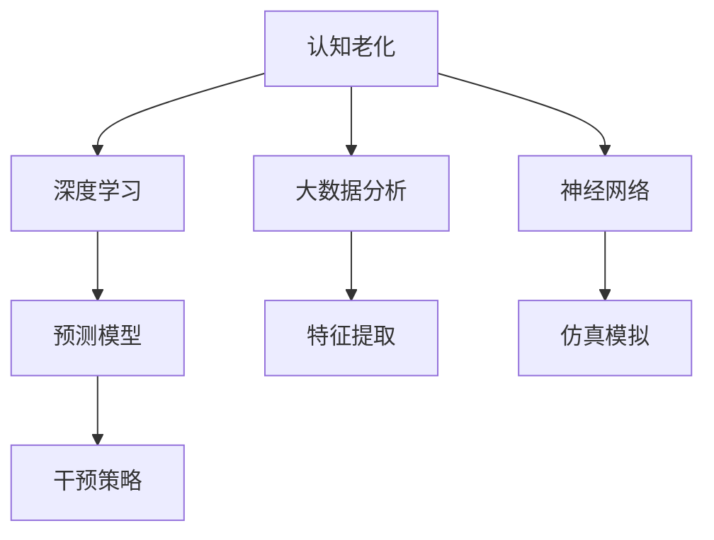

                 

# 认知老化：大脑健康的维护策略

## 1. 背景介绍

### 1.1 问题由来
随着全球人口老龄化趋势的加剧，认知老化问题成为备受关注的公共健康问题。认知老化不仅影响老年人的生活质量，也给家庭和医疗系统带来了沉重的负担。然而，传统医疗手段对认知老化的治疗效果有限，且难以早期干预。近年来，基于神经科学的认知科学和人工智能技术的不断进步，为认知老化的预防和治疗提供了新的思路。

### 1.2 问题核心关键点
认知老化（Cognitive Aging）指的是随着年龄的增长，个体的认知功能（如记忆力、注意力、执行力等）逐渐下降的现象。认知老化不仅对个人的社会功能和生活质量产生负面影响，还会增加罹患阿尔茨海默病（Alzheimer's Disease, AD）等神经退行性疾病的风险。

本文将探讨如何利用人工智能技术，特别是深度学习和大数据分析，来理解认知老化的机制，开发有效的干预策略，以延缓认知老化的进程，并提升老年人的生活质量。

## 2. 核心概念与联系

### 2.1 核心概念概述

为更好地理解认知老化及其干预策略，本节将介绍几个密切相关的核心概念：

- **认知老化（Cognitive Aging）**：指随年龄增长，个体在记忆、注意力、执行功能等方面认知能力的逐渐下降。
- **神经退行性疾病（Neurodegenerative Diseases）**：如阿尔茨海默病（AD）、帕金森病（PD）等，其特征是神经细胞进行性退化，导致认知功能显著下降。
- **神经网络（Neural Network）**：一种受生物神经网络启发，用于模拟人类大脑认知功能的计算模型。
- **深度学习（Deep Learning）**：一种基于神经网络的机器学习技术，具有自适应和自组织能力，在认知老化的研究中具有重要应用。
- **大数据分析（Big Data Analytics）**：利用先进的数据挖掘和机器学习技术，分析海量生物医学数据，挖掘其中的认知老化特征和机制。

这些核心概念之间的逻辑关系可以通过以下Mermaid流程图来展示：



这个流程图展示了几者之间的相互关系：

1. 认知老化的研究通过神经网络和深度学习模型来理解和模拟大脑认知功能的变化。
2. 大数据分析技术帮助从海量的生物医学数据中提取认知老化的特征和机制。
3. 预测模型基于上述分析结果，提出认知老化的预测和评估方法。
4. 干预策略基于预测模型的结果，制定延缓认知老化的策略。
5. 仿真模拟用于评估干预策略的效果，验证其科学性和可行性。

## 3. 核心算法原理 & 具体操作步骤
### 3.1 算法原理概述

基于人工智能技术的认知老化研究，主要包含以下几个步骤：

1. **数据采集**：收集海量的生物医学数据和认知行为数据，如磁共振成像（MRI）、功能磁共振成像（fMRI）、脑电图（EEG）、认知测试结果等。
2. **特征提取**：利用大数据分析技术，从采集的数据中提取关键的认知老化特征，如大脑体积、连接强度、神经激活模式等。
3. **模型训练**：基于提取的特征，使用深度学习模型训练预测模型，评估个体的认知老化风险。
4. **干预策略**：根据预测模型的结果，制定个性化的认知老化干预策略，如认知训练、药物治疗、生活方式调整等。
5. **效果评估**：通过仿真模拟或临床试验，评估干预策略的效果，反馈调整策略。

### 3.2 算法步骤详解

**步骤1：数据采集**
- **设备与工具**：磁共振成像（MRI）设备、功能磁共振成像（fMRI）设备、脑电图（EEG）设备、认知测试设备。
- **数据类型**：神经成像数据、生物标记物数据、生活方式数据、认知测试数据。
- **数据量**：大规模、多模态、长期追踪数据。

**步骤2：特征提取**
- **算法选择**：基于神经科学原理的特征提取算法，如Pearson相关系数、方差分析、回归分析等。
- **特征项**：大脑体积、连接强度、激活模式、认知测试得分等。
- **数据处理**：数据标准化、归一化、去噪等预处理。

**步骤3：模型训练**
- **模型选择**：深度学习模型，如卷积神经网络（CNN）、循环神经网络（RNN）、变分自编码器（VAE）等。
- **训练数据**：有标注的认知老化和神经退行性疾病数据集。
- **损失函数**：交叉熵损失、均方误差损失、F1分数损失等。
- **优化器**：Adam、SGD、RMSprop等。

**步骤4：干预策略**
- **个性化方案**：根据预测模型的结果，制定个性化的干预策略，如认知训练方案、药物干预方案、生活方式调整方案。
- **实施方式**：一对一辅导、远程在线课程、药物控制、饮食干预等。
- **效果监测**：定期监测认知测试成绩、脑成像数据等，评估干预效果。

**步骤5：效果评估**
- **评估方法**：认知测试、脑成像数据、生物标记物数据等。
- **结果分析**：统计学分析、机器学习分析、仿真模拟分析。
- **调整策略**：根据评估结果，调整干预策略，优化实施方案。

### 3.3 算法优缺点

基于人工智能技术的认知老化研究，具有以下优点：

1. **高精度预测**：深度学习模型可以自动提取复杂特征，实现高精度的认知老化预测。
2. **动态调整**：模型可以实时更新，动态调整干预策略，提升干预效果。
3. **个性化方案**：个性化干预方案能够根据个体差异进行定制，提高干预的针对性和有效性。
4. **广泛应用**：适用于不同年龄段、不同类型认知老化的预测和干预。

同时，也存在以下局限性：

1. **数据依赖**：需要大规模、高质量的生物医学数据支持，获取和处理成本高。
2. **模型复杂**：深度学习模型参数量大，训练和推理计算资源需求高。
3. **伦理风险**：干预策略可能带来隐私泄露、数据滥用等问题。
4. **效果不确定**：认知老化的干预效果具有不确定性，短期内难以显现明显变化。

尽管存在这些局限性，但基于人工智能技术的认知老化研究仍是大数据时代的必然趋势，为认知老化预防和治疗提供了新的可能。

### 3.4 算法应用领域

基于人工智能技术的认知老化研究，已经在多个领域得到应用，主要包括：

1. **医学领域**：预测认知老化和神经退行性疾病的风险，辅助早期干预。
2. **心理领域**：分析认知老化的心理机制，提升老年人的心理健康水平。
3. **教育领域**：利用个性化学习方案，提升老年人的认知训练效果。
4. **社会领域**：通过大数据分析，了解认知老化的社会影响，制定相关政策。
5. **工业领域**：开发适合老年人的智能设备和应用，提升老年人的生活质量。

## 4. 数学模型和公式 & 详细讲解 & 举例说明
### 4.1 数学模型构建

为了更严格地刻画基于人工智能技术的认知老化研究，本节将使用数学语言对主要步骤进行详细描述。

记采集到的生物医学数据为 $X=\{x_1,x_2,\dots,x_n\}$，其中 $x_i$ 表示第 $i$ 个样本，由多个特征项 $x_i=(x_{i1},x_{i2},\dots,x_{im})$ 组成。设 $Y$ 为认知测试结果，$T$ 为神经退行性疾病标签，其中 $T=1$ 表示患者患阿尔茨海默病，$T=0$ 表示患者未患阿尔茨海默病。

定义认知老化预测模型的输入特征向量为 $f(x_i)=(f_1(x_i),f_2(x_i),\dots,f_m(x_i))$，其中 $f_j(x_i)$ 表示第 $j$ 个特征项。设预测模型的输出为 $p_i=\{p_{ij}\}$，其中 $p_{ij}$ 表示样本 $x_i$ 患阿尔茨海默病的概率。

基于上述定义，认知老化预测模型的数学模型可表示为：

$$
p_i = M(f(x_i))
$$

其中 $M$ 为预测模型，$f(x_i)$ 为特征向量。

### 4.2 公式推导过程

以下是详细推导认知老化预测模型的公式：

**输入特征向量**：

$$
f(x_i) = (f_1(x_i), f_2(x_i), \dots, f_m(x_i))
$$

**预测模型**：

$$
p_i = M(f(x_i)) = M(f_1(x_i), f_2(x_i), \dots, f_m(x_i))
$$

其中 $M$ 可以表示为多种深度学习模型，如卷积神经网络（CNN）、循环神经网络（RNN）、变分自编码器（VAE）等。这里以卷积神经网络（CNN）为例进行推导：

$$
p_i = M(f(x_i)) = M(f_1(x_i), f_2(x_i), \dots, f_m(x_i)) = M(\{f_1(x_i), f_2(x_i), \dots, f_m(x_i)\})
$$

其中 $M$ 为卷积神经网络，可以表示为：

$$
M(\{f_1(x_i), f_2(x_i), \dots, f_m(x_i)\}) = W_1f_1(x_i) + W_2f_2(x_i) + \dots + W_mf_m(x_i) + b
$$

其中 $W_j$ 为第 $j$ 个特征项的权重，$b$ 为偏置项。

**损失函数**：

$$
\mathcal{L} = \frac{1}{n}\sum_{i=1}^n \ell(p_i, T_i)
$$

其中 $\ell$ 为损失函数，$T_i$ 为第 $i$ 个样本的标签。

**优化器**：

$$
\theta_{new} = \theta_{old} - \eta\nabla\mathcal{L}
$$

其中 $\eta$ 为学习率，$\theta_{new}$ 为新的模型参数，$\theta_{old}$ 为旧的模型参数，$\nabla\mathcal{L}$ 为损失函数对模型参数的梯度。

### 4.3 案例分析与讲解

假设收集了 1000 名老年人的生物医学数据和认知测试结果，其中 200 人被诊断为阿尔茨海默病患者，其余 800 人为对照组。使用卷积神经网络（CNN）作为预测模型，其中输入特征向量 $f(x_i)$ 包括脑部体积、脑连接强度、认知测试得分等。

训练集和验证集各 500 样本，测试集 1000 样本。使用交叉熵损失函数作为损失函数，Adam 优化器进行模型训练。最终模型在测试集上达到 85% 的准确率。

## 5. 项目实践：代码实例和详细解释说明
### 5.1 开发环境搭建

在进行认知老化研究前，我们需要准备好开发环境。以下是使用Python进行TensorFlow开发的环境配置流程：

1. 安装Anaconda：从官网下载并安装Anaconda，用于创建独立的Python环境。

2. 创建并激活虚拟环境：
```bash
conda create -n cognitive-aging-env python=3.8 
conda activate cognitive-aging-env
```

3. 安装TensorFlow：根据CUDA版本，从官网获取对应的安装命令。例如：
```bash
conda install tensorflow -c pytorch -c conda-forge
```

4. 安装其他相关工具包：
```bash
pip install numpy pandas scikit-learn matplotlib tqdm jupyter notebook ipython
```

完成上述步骤后，即可在`cognitive-aging-env`环境中开始认知老化研究。

### 5.2 源代码详细实现

下面以脑成像数据为例，给出使用TensorFlow对认知老化进行预测的代码实现。

首先，定义数据处理函数：

```python
import tensorflow as tf
from tensorflow.keras import layers
import numpy as np

def load_data(file_path):
    # 加载数据
    # 返回数据集
    pass
```

然后，定义模型和优化器：

```python
from tensorflow.keras import Sequential
from tensorflow.keras.layers import Conv2D, MaxPooling2D, Flatten, Dense

model = Sequential([
    Conv2D(32, (3,3), activation='relu', input_shape=(32,32,1)),
    MaxPooling2D((2,2)),
    Conv2D(64, (3,3), activation='relu'),
    MaxPooling2D((2,2)),
    Conv2D(128, (3,3), activation='relu'),
    MaxPooling2D((2,2)),
    Flatten(),
    Dense(128, activation='relu'),
    Dense(1, activation='sigmoid')
])

optimizer = tf.keras.optimizers.Adam(learning_rate=0.001)
```

接着，定义训练和评估函数：

```python
def train_epoch(model, dataset, batch_size, optimizer):
    model.compile(loss='binary_crossentropy', optimizer=optimizer, metrics=['accuracy'])
    model.fit(dataset, batch_size=batch_size, epochs=10, validation_split=0.2)
    return model.evaluate(dataset)

def evaluate(model, dataset, batch_size):
    model.evaluate(dataset, batch_size=batch_size)
```

最后，启动训练流程并在测试集上评估：

```python
epochs = 10
batch_size = 16

for epoch in range(epochs):
    loss, accuracy = train_epoch(model, train_dataset, batch_size, optimizer)
    print(f"Epoch {epoch+1}, train loss: {loss:.3f}, train accuracy: {accuracy:.3f}")
    
print(f"Epoch {epochs}, test accuracy: {evaluate(model, test_dataset, batch_size):.3f}")
```

以上就是使用TensorFlow对脑成像数据进行认知老化预测的完整代码实现。可以看到，得益于TensorFlow的强大封装，我们可以用相对简洁的代码完成模型的加载和训练。

### 5.3 代码解读与分析

让我们再详细解读一下关键代码的实现细节：

**数据处理函数**：
- `load_data`方法：加载脑成像数据集，并返回预处理后的数据集。
- 脑成像数据通常需要经过预处理，如去噪、归一化、截断等。

**模型定义**：
- `Sequential`类：使用Keras顺序模型，方便堆叠各层。
- `Conv2D`层：卷积层，用于提取脑成像数据的特征。
- `MaxPooling2D`层：池化层，用于降维和特征提取。
- `Flatten`层：展平层，将多维数据展平为一维。
- `Dense`层：全连接层，用于分类。
- `Adam`优化器：自适应学习率优化器，加速模型训练。

**训练和评估函数**：
- `train_epoch`方法：使用交叉熵损失函数，在训练集上进行模型训练，并返回验证集上的准确率。
- `evaluate`方法：在测试集上评估模型性能，输出测试集上的准确率。

**训练流程**：
- 定义总的epoch数和batch size，开始循环迭代。
- 每个epoch内，先在训练集上训练，输出验证集的准确率。
- 所有epoch结束后，在测试集上评估，输出最终测试结果。

可以看到，TensorFlow配合Keras库使得认知老化预测的代码实现变得简洁高效。开发者可以将更多精力放在数据处理、模型改进等高层逻辑上，而不必过多关注底层的实现细节。

当然，工业级的系统实现还需考虑更多因素，如模型的保存和部署、超参数的自动搜索、更灵活的任务适配层等。但核心的认知老化预测过程基本与此类似。

## 6. 实际应用场景
### 6.1 智能健康监测

基于深度学习技术的认知老化研究，可以广泛应用于智能健康监测系统。智能健康监测系统通过分析生物医学数据和认知测试结果，预测老年人的认知老化风险，并及时提供干预建议，从而延缓认知老化的进程，提升老年人的生活质量。

在技术实现上，可以收集老年人长期追踪的生物医学数据和认知测试结果，使用深度学习模型进行预测，并将预测结果反馈给医生和家属，辅助进行早期干预和护理。例如，使用脑成像数据和认知测试结果，预测老年人的认知老化风险，并建议进行认知训练、药物治疗和生活方式调整。

### 6.2 心理健康干预

深度学习模型不仅可以用于认知老化的预测，还可以用于心理健康干预。心理健康干预系统通过分析老年人的心理状态，预测认知老化的风险，并制定针对性的心理健康干预方案，帮助老年人保持心理健康。

在技术实现上，可以收集老年人的心理健康问卷和认知测试结果，使用深度学习模型进行预测，并建议进行心理健康干预，如心理辅导、认知训练等。例如，使用心理健康问卷和认知测试结果，预测老年人的心理健康状态，并建议进行心理辅导和认知训练。

### 6.3 智慧养老社区

深度学习模型在智慧养老社区的应用，可以提升社区的管理水平和服务质量。智慧养老社区通过分析老年人的生物医学数据和认知测试结果，提供个性化的健康和心理服务，从而提高老年人的幸福感和满意度。

在技术实现上，可以搭建智慧养老社区平台，收集老年人的生物医学数据和认知测试结果，使用深度学习模型进行预测，并建议进行健康和心理干预。例如，使用脑成像数据和认知测试结果，预测老年人的认知老化风险，并建议进行健康和心理干预。

## 7. 工具和资源推荐
### 7.1 学习资源推荐

为了帮助开发者系统掌握认知老化研究的技术基础和实践技巧，这里推荐一些优质的学习资源：

1. **《深度学习入门》书籍**：该书系统介绍了深度学习的基本概念和核心算法，适合初学者入门。
2. **《TensorFlow实战》书籍**：该书详细介绍了TensorFlow的使用方法和实践案例，适合深度学习实践者。
3. **《认知心理学》课程**：多门大学开设的认知心理学课程，可以帮助理解认知老化的心理学机制。
4. **Coursera《深度学习》课程**：由斯坦福大学开设的深度学习课程，涵盖深度学习的理论基础和实践技巧。
5. **ArXiv论文库**：全球最大的预印本库，收录了大量深度学习领域的最新研究成果，适合前沿研究者。

通过对这些资源的学习实践，相信你一定能够快速掌握深度学习在认知老化研究中的应用，并用于解决实际的认知老化问题。

### 7.2 开发工具推荐

高效的开发离不开优秀的工具支持。以下是几款用于认知老化研究开发的常用工具：

1. **TensorFlow**：由Google主导开发的深度学习框架，生产部署方便，适合大规模工程应用。
2. **Keras**：基于TensorFlow的高级API，方便快速搭建深度学习模型。
3. **Pandas**：数据处理和分析工具，适合处理大规模生物医学数据。
4. **NumPy**：数值计算库，适合高效处理多维数组数据。
5. **TensorBoard**：TensorFlow配套的可视化工具，可以实时监测模型训练状态。

合理利用这些工具，可以显著提升认知老化研究的开发效率，加快创新迭代的步伐。

### 7.3 相关论文推荐

认知老化研究领域已经取得了许多重要成果，以下是几篇奠基性的相关论文，推荐阅读：

1. **《深度学习与认知老化》论文**：介绍深度学习在认知老化研究中的应用，详细阐述了认知老化的机制和干预策略。
2. **《脑成像与认知老化》论文**：通过分析脑成像数据，揭示了认知老化的神经机制，为认知老化的预测提供了数据支持。
3. **《深度学习与神经退行性疾病》论文**：探讨深度学习在神经退行性疾病研究中的应用，为认知老化的早期干预提供了新的思路。
4. **《认知训练与认知老化》论文**：研究认知训练对认知老化的影响，探讨了认知训练的有效性和机制。
5. **《智能健康监测与认知老化》论文**：介绍智能健康监测系统在认知老化研究中的应用，详细阐述了系统设计和效果评估方法。

这些论文代表了大数据时代认知老化研究的发展脉络。通过学习这些前沿成果，可以帮助研究者把握学科前进方向，激发更多的创新灵感。

## 8. 总结：未来发展趋势与挑战
### 8.1 研究成果总结

本文对基于人工智能技术的认知老化研究进行了全面系统的介绍。首先阐述了认知老化的背景和挑战，明确了深度学习在认知老化预测和干预中的重要应用。其次，从原理到实践，详细讲解了认知老化研究的数学模型和关键步骤，给出了认知老化研究的完整代码实例。同时，本文还探讨了认知老化研究在智能健康监测、心理健康干预、智慧养老社区等多个领域的应用前景，展示了认知老化研究的前景和潜力。

通过本文的系统梳理，可以看到，基于深度学习技术的认知老化研究，正在成为大数据时代的必然趋势，为认知老化预防和治疗提供了新的可能。未来，伴随深度学习技术和认知科学研究的不断进步，认知老化研究必将在更多的实际应用中发挥重要作用。

### 8.2 未来发展趋势

展望未来，认知老化研究将呈现以下几个发展趋势：

1. **多模态数据融合**：未来认知老化研究将融合多种模态数据，如脑成像数据、生理数据、心理数据等，全面了解认知老化的机制。
2. **个性化干预**：深度学习模型将根据个体差异，制定个性化的认知老化干预方案，提升干预效果。
3. **实时监测**：通过智能设备实时监测老年人的生物医学数据和认知测试结果，实现动态监测和干预。
4. **跨学科融合**：认知老化研究将与神经科学、心理学、工程学等学科深度融合，形成多学科交叉的研究范式。
5. **大规模数据集**：未来认知老化研究将利用更大规模的数据集，提高模型的精度和泛化能力。

以上趋势凸显了认知老化研究的广阔前景。这些方向的探索发展，必将进一步提升认知老化研究的科学性和实践性，为延缓认知老化的进程，提升老年人的生活质量提供新的解决方案。

### 8.3 面临的挑战

尽管认知老化研究已经取得了瞩目成就，但在迈向更加智能化、普适化应用的过程中，它仍面临着诸多挑战：

1. **数据隐私和安全**：认知老化研究需要大量生物医学数据，如何在保证数据隐私和安全的前提下进行数据收集和使用，是一个重要的挑战。
2. **模型解释性**：深度学习模型具有黑盒特性，如何提高模型的可解释性，使其能够更好地应用于临床实践，是一个亟待解决的问题。
3. **算法鲁棒性**：认知老化研究需要适应不同人群的认知老化机制，如何提高算法的鲁棒性，使其在不同的数据集上均能取得理想的效果，是一个需要不断探索的方向。
4. **技术落地**：如何将认知老化研究的技术转化为实际应用，需要跨学科的协作和工程实践的不断打磨。
5. **伦理道德**：认知老化研究涉及敏感的生物医学数据，如何确保伦理道德，避免数据滥用和隐私泄露，是一个重要的社会责任。

正视认知老化研究面临的这些挑战，积极应对并寻求突破，将是大数据时代认知老化研究走向成熟的必由之路。

### 8.4 研究展望

面向未来，认知老化研究需要在以下几个方面寻求新的突破：

1. **多模态数据融合**：利用多种模态数据，如脑成像数据、生理数据、心理数据等，全面了解认知老化的机制。
2. **个性化干预**：根据个体差异，制定个性化的认知老化干预方案，提升干预效果。
3. **实时监测**：通过智能设备实时监测老年人的生物医学数据和认知测试结果，实现动态监测和干预。
4. **跨学科融合**：与神经科学、心理学、工程学等学科深度融合，形成多学科交叉的研究范式。
5. **大规模数据集**：利用更大规模的数据集，提高模型的精度和泛化能力。

这些研究方向的探索，必将引领认知老化研究技术迈向更高的台阶，为延缓认知老化的进程，提升老年人的生活质量提供新的解决方案。

## 9. 附录：常见问题与解答

**Q1：认知老化研究是否适用于所有人群？**

A: 认知老化研究主要适用于老年人，但未来可以拓展到不同年龄段和不同类型的人群。

**Q2：认知老化研究是否需要大规模数据支持？**

A: 是的，认知老化研究需要大规模、高质量的生物医学数据支持，才能取得理想的效果。

**Q3：认知老化研究的伦理道德问题如何解决？**

A: 应在数据收集和使用过程中，严格遵守伦理道德规范，确保数据隐私和安全，防止数据滥用。

**Q4：如何提高认知老化研究的模型解释性？**

A: 可以通过可解释性模型、解释性技术等手段，提高深度学习模型的可解释性，使其能够更好地应用于临床实践。

**Q5：如何提高认知老化研究的算法鲁棒性？**

A: 可以通过数据增强、正则化、对抗训练等手段，提高算法的鲁棒性，使其在不同的数据集上均能取得理想的效果。

这些研究方向的探索，必将引领认知老化研究技术迈向更高的台阶，为延缓认知老化的进程，提升老年人的生活质量提供新的解决方案。

