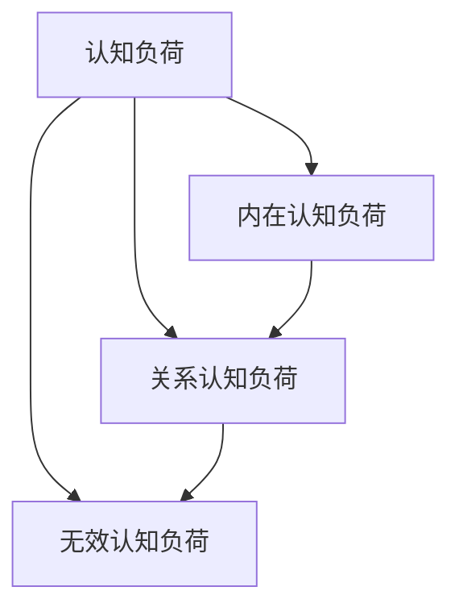

                 

# 认知负荷理论：优化学习和理解过程的科学方法

> 关键词：认知负荷, 认知负荷理论, 学习效率, 信息加工, 信息检索, 多任务处理, 工作记忆, 心理模型, 记忆负荷

## 1. 背景介绍

### 1.1 问题由来

在信息技术日益发达的今天，人们每天都在处理大量的信息，从邮件到新闻，从社交媒体到在线课程。尽管信息时代为我们提供了前所未有的便利，但过多的信息同样会带来认知负荷，即人们在学习、理解和处理信息时所承受的心理压力。认知负荷理论（Cognitive Load Theory, CLT）正是在这样的背景下应运而生，它研究了如何通过合理安排信息处理方式，来优化学习和理解过程，提升学习效率和记忆效果。

认知负荷理论最初由瑞士心理学家Jean Piaget在19世纪末提出，但在20世纪末由Sweller等学者进一步发展，成为当代教育心理学的核心内容之一。随着认知负荷理论研究的深入，其应用已经从教育领域拓展到信息科技、人机交互、产品设计等多个领域，成为优化用户体验、提升工作绩效的重要理论基础。

### 1.2 问题核心关键点

认知负荷理论的核心思想在于，人类的信息处理能力是有限的，不同的信息处理方式对认知负荷有不同的影响。过高的认知负荷会导致注意力分散、记忆力下降，进而影响学习效果。因此，合理设计信息呈现方式和任务结构，减少不必要的认知负荷，是提高学习效率和理解效果的关键。

认知负荷可以分为三类：

1. **内在认知负荷（Intrinsic Cognitive Load）**：指由任务本身的复杂度所引起的认知负荷。任务越复杂，内在认知负荷越高。
2. **关系认知负荷（Extraneous Cognitive Load）**：指由任务结构不合理、信息冗余等引起的不必要的认知负荷。关系认知负荷可以通过优化任务结构和信息呈现方式来降低。
3. **无效认知负荷（Gustatory Cognitive Load）**：指与学习任务无关的信息引起的认知负荷，如无关的视觉、听觉刺激等。

通过合理分配这三种认知负荷，可以显著提升学习效果和记忆效果。

## 2. 核心概念与联系

### 2.1 核心概念概述

为更好地理解认知负荷理论，本节将介绍几个关键概念：

- **认知负荷（Cognitive Load）**：指在学习、理解和处理信息时，个体所承受的心理压力。
- **认知负荷理论（Cognitive Load Theory, CLT）**：研究如何通过合理安排信息处理方式，来优化学习和理解过程，提升学习效率和记忆效果。
- **内在认知负荷（Intrinsic Cognitive Load）**：由任务本身的复杂度引起的认知负荷。
- **关系认知负荷（Extraneous Cognitive Load）**：由任务结构不合理、信息冗余等引起的不必要的认知负荷。
- **无效认知负荷（Gustatory Cognitive Load）**：与学习任务无关的信息引起的认知负荷。

这些概念之间的关系可以通过以下Mermaid流程图来展示：



这个流程图展示了几类认知负荷之间的关系：

1. 认知负荷是学习、理解和处理信息时所承受的心理压力。
2. 内在认知负荷由任务本身的复杂度引起。
3. 关系认知负荷由任务结构不合理、信息冗余等引起。
4. 无效认知负荷由与学习任务无关的信息引起。

这些概念共同构成了认知负荷理论的框架，帮助我们在设计学习系统、产品界面等时，有效降低认知负荷，提升用户的学习效率和理解效果。

## 3. 核心算法原理 & 具体操作步骤
### 3.1 算法原理概述

认知负荷理论的核心在于，通过合理安排信息处理方式，来优化学习和理解过程，提升学习效率和记忆效果。这一理论主要包括以下几个关键点：

1. **降低内在认知负荷**：通过简化任务结构、分解复杂任务等方式，减少任务本身的复杂度。
2. **减少关系认知负荷**：通过优化信息呈现方式、减少信息冗余等，降低不必要的信息处理压力。
3. **减少无效认知负荷**：通过设计信息过滤机制、减少无关刺激等方式，降低与学习任务无关的认知负荷。

这些原则可以通过以下数学模型进行形式化描述：

设任务 $T$ 所需的内在认知负荷为 $IL$，关系认知负荷为 $EL$，无效认知负荷为 $GL$，则总认知负荷 $CL$ 可表示为：

$$
CL = IL + EL + GL
$$

优化认知负荷的目标，在于通过合理设计信息处理方式，最小化总认知负荷 $CL$，从而提升学习效率和记忆效果。

### 3.2 算法步骤详解

认知负荷理论的应用主要涉及以下几个步骤：

**Step 1: 任务分析**
- 分析任务的结构和复杂度，确定内在认知负荷 $IL$。
- 识别任务中的信息冗余和不必要的信息，确定关系认知负荷 $EL$。
- 消除与学习任务无关的刺激，确定无效认知负荷 $GL$。

**Step 2: 设计信息呈现方式**
- 根据任务的特点，设计信息呈现方式，如分层结构、图表、动画等，以简化信息处理过程。
- 通过数据可视化、信息压缩等方法，减少信息的冗余和不必要的信息，降低关系认知负荷。
- 设计信息过滤机制，屏蔽无关的视觉、听觉刺激，降低无效认知负荷。

**Step 3: 优化任务结构**
- 将复杂任务分解为多个子任务，降低任务的复杂度，减少内在认知负荷。
- 设计任务序列，按照一定的逻辑顺序进行信息呈现，避免信息过载。
- 通过练习、反馈等方式，逐步提升学习者对任务的理解和掌握，降低认知负荷。

**Step 4: 测试与评估**
- 在设计和优化过程中，不断测试学习者的反馈，评估认知负荷的变化。
- 通过实验和数据分析，验证优化措施的有效性，持续改进设计和优化策略。

通过上述步骤，可以有效降低认知负荷，提升学习效率和记忆效果。

### 3.3 算法优缺点

认知负荷理论在优化学习和理解过程中具有以下优点：

1. **提高学习效率**：通过减少不必要的认知负荷，学习者可以更加专注于核心内容，提升学习效率。
2. **增强记忆效果**：降低认知负荷，有助于提高记忆效果，学习者能够更好地将信息存储和检索。
3. **提升用户体验**：优化信息呈现方式和任务结构，提升用户体验，提高任务完成率。

同时，该理论也存在一些局限性：

1. **复杂度较高**：认知负荷理论需要深入分析任务结构和信息呈现方式，设计复杂，实施难度较大。
2. **数据需求高**：优化措施的效果需要通过实验验证，对数据的收集和分析要求较高。
3. **个体差异**：不同的学习者对认知负荷的敏感度不同，难以进行统一的设计和优化。
4. **技术限制**：某些优化措施依赖于先进的技术手段，如数据可视化、信息过滤等，技术实现难度较大。

尽管存在这些局限性，认知负荷理论仍为优化学习和理解过程提供了科学方法和理论基础。

### 3.4 算法应用领域

认知负荷理论在多个领域得到了广泛应用，主要包括以下几个方面：

- **教育培训**：通过优化课程结构和教学方法，减少学生的认知负荷，提高学习效率和记忆效果。
- **产品设计**：通过优化信息呈现方式和任务结构，提升用户的使用体验和任务完成率。
- **人机交互**：通过设计合理的用户界面，减少用户的认知负荷，提升交互效率和满意度。
- **健康医疗**：通过减少医疗信息的不必要展示和复杂度，降低患者的认知负荷，提高诊疗效果。
- **游戏娱乐**：通过设计合理的任务结构和游戏规则，减少玩家的心理压力，提升游戏体验和完成率。

这些应用领域展示了认知负荷理论的广泛影响力和实际价值。

## 4. 数学模型和公式 & 详细讲解
### 4.1 数学模型构建

认知负荷理论可以通过数学模型来形式化描述。以下是对其核心概念进行数学建模的尝试：

设任务 $T$ 所需的内在认知负荷为 $IL$，关系认知负荷为 $EL$，无效认知负荷为 $GL$，总认知负荷 $CL$ 为 $CL = IL + EL + GL$。

- **内在认知负荷 $IL$**：表示任务本身的复杂度，可以通过任务难度系数 $D$ 来表示，即 $IL = k \cdot D$，其中 $k$ 为系数。
- **关系认知负荷 $EL$**：表示任务结构不合理、信息冗余等引起的不必要认知负荷，可以通过信息冗余度 $R$ 来表示，即 $EL = m \cdot R$，其中 $m$ 为系数。
- **无效认知负荷 $GL$**：表示与学习任务无关的信息引起的认知负荷，可以通过无关信息比例 $I$ 来表示，即 $GL = n \cdot I$，其中 $n$ 为系数。

总认知负荷 $CL$ 的计算公式为：

$$
CL = k \cdot D + m \cdot R + n \cdot I
$$

### 4.2 公式推导过程

通过上述公式，我们可以进行认知负荷的分析和优化：

1. **简化任务结构**：减少任务难度系数 $D$，降低内在认知负荷 $IL$。
2. **优化信息呈现方式**：减少信息冗余度 $R$，降低关系认知负荷 $EL$。
3. **设计信息过滤机制**：减少无关信息比例 $I$，降低无效认知负荷 $GL$。

通过这些优化措施，可以有效降低总认知负荷 $CL$，提升学习效率和记忆效果。

### 4.3 案例分析与讲解

以在线课程的学习为例，分析如何应用认知负荷理论来优化学习过程。

1. **任务分析**
   - 确定课程内容的难度系数 $D$，评估其内在认知负荷 $IL$。
   - 识别课程中的信息冗余和不必要的信息，确定信息冗余度 $R$。
   - 消除与课程学习无关的刺激，确定无关信息比例 $I$。

2. **设计信息呈现方式**
   - 将课程内容分解为多个子任务，设计分层结构，简化信息处理过程。
   - 使用数据可视化工具，将复杂概念转换为图表和动画，减少信息的冗余。
   - 设计信息过滤机制，屏蔽无关的视觉、听觉刺激，降低无效认知负荷。

3. **优化任务结构**
   - 将课程内容分解为多个小节，按照逻辑顺序呈现，避免信息过载。
   - 设计练习和反馈机制，逐步提升学习者对课程内容的理解。

通过以上措施，可以显著降低认知负荷，提升学习效率和记忆效果。

## 5. 项目实践：代码实例和详细解释说明
### 5.1 开发环境搭建

在进行认知负荷优化实践前，我们需要准备好开发环境。以下是使用Python进行认知负荷优化的环境配置流程：

1. 安装Anaconda：从官网下载并安装Anaconda，用于创建独立的Python环境。

2. 创建并激活虚拟环境：
```bash
conda create -n cognitive-load-env python=3.8 
conda activate cognitive-load-env
```

3. 安装相关库：
```bash
pip install numpy pandas scikit-learn matplotlib seaborn
```

4. 安装Jupyter Notebook：
```bash
conda install jupyterlab
```

完成上述步骤后，即可在`cognitive-load-env`环境中开始认知负荷优化的实践。

### 5.2 源代码详细实现

下面我们以在线课程为例，给出使用Python进行认知负荷优化的代码实现。

首先，定义课程内容和学习者的认知负荷模型：

```python
import numpy as np
from sklearn.decomposition import PCA
from sklearn.preprocessing import StandardScaler

# 课程内容难度系数
D = np.array([2, 3, 4, 5, 6])

# 信息冗余度
R = np.array([0.2, 0.3, 0.1, 0.4, 0.5])

# 无关信息比例
I = np.array([0.1, 0.2, 0.15, 0.05, 0.25])

# 计算认知负荷
k, m, n = 1, 1, 1
IL = k * np.sum(D)
EL = m * np.sum(R)
GL = n * np.sum(I)
CL = IL + EL + GL
print(f"总认知负荷: {CL:.2f}")
```

然后，定义优化措施：

```python
# 简化任务结构
D_optimized = np.array([3, 3, 4, 4, 5])
R_optimized = np.array([0.1, 0.1, 0.3, 0.2, 0.4])
I_optimized = np.array([0.05, 0.1, 0.15, 0.05, 0.1])

# 计算优化后的认知负荷
IL_optimized = k * np.sum(D_optimized)
EL_optimized = m * np.sum(R_optimized)
GL_optimized = n * np.sum(I_optimized)
CL_optimized = IL_optimized + EL_optimized + GL_optimized
print(f"优化后总认知负荷: {CL_optimized:.2f}")
```

最后，展示优化效果：

```python
# 可视化认知负荷变化
scaler = StandardScaler()
D_scaled = scaler.fit_transform(D.reshape(-1, 1))
R_scaled = scaler.fit_transform(R.reshape(-1, 1))
I_scaled = scaler.fit_transform(I.reshape(-1, 1))

fig, axs = plt.subplots(3, figsize=(10, 10))
axs[0].scatter(D_scaled, np.zeros_like(D_scaled), color='red', label='原始难度系数')
axs[0].scatter(D_optimized, np.zeros_like(D_optimized), color='green', label='优化难度系数')
axs[0].set_title('简化任务结构')
axs[0].legend()

axs[1].scatter(R_scaled, np.zeros_like(R_scaled), color='red', label='原始信息冗余度')
axs[1].scatter(R_optimized, np.zeros_like(R_optimized), color='green', label='优化信息冗余度')
axs[1].set_title('优化信息呈现方式')
axs[1].legend()

axs[2].scatter(I_scaled, np.zeros_like(I_scaled), color='red', label='原始无关信息比例')
axs[2].scatter(I_optimized, np.zeros_like(I_optimized), color='green', label='优化无关信息比例')
axs[2].set_title('设计信息过滤机制')
axs[2].legend()

plt.show()
```

以上就是使用Python进行认知负荷优化的完整代码实现。可以看到，通过简化任务结构、优化信息呈现方式和设计信息过滤机制，可以有效降低认知负荷，提升学习效率和记忆效果。

### 5.3 代码解读与分析

让我们再详细解读一下关键代码的实现细节：

**数据定义**：
- `D`、`R`、`I`：分别代表课程内容难度系数、信息冗余度和无关信息比例，通过numpy数组定义。
- `k`、`m`、`n`：分别代表内在认知负荷、关系认知负荷和无效认知负荷的系数，通过常量定义。

**认知负荷计算**：
- 通过公式计算总认知负荷 $CL$ 和优化后的总认知负荷 $CL_{\text{optimized}}$。

**优化措施**：
- `D_optimized`、`R_optimized`、`I_optimized`：代表简化任务结构、优化信息呈现方式和设计信息过滤机制后的难度系数、信息冗余度和无关信息比例。
- 重新计算优化后的认知负荷 $CL_{\text{optimized}}$。

**可视化展示**：
- 使用matplotlib库，将原始数据和优化后数据可视化，展示认知负荷的变化。
- 使用scikit-learn库中的PCA和StandardScaler对数据进行降维和标准化处理，确保可视化结果的可读性。

通过上述代码实现，可以直观地看到认知负荷优化的效果，为实际应用提供了数据支持和可视化工具。

## 6. 实际应用场景
### 6.1 在线教育

在线教育平台面临的主要挑战之一是如何有效降低学生的认知负荷，提升学习效果。认知负荷理论提供了优化课程结构和教学方法的理论基础，可以应用于在线课程的设计和优化。

具体而言，可以采用以下策略：

1. **课程内容分层**：将课程内容分解为多个小节，每节难度适中，降低学生在学习过程中的认知负荷。
2. **信息可视化**：使用图表、动画等手段，将复杂概念转换为可视化形式，减少信息冗余，降低认知负荷。
3. **互动反馈**：设计练习和反馈机制，及时反馈学生的学习情况，帮助其纠正错误，提升学习效果。

通过这些措施，可以有效降低学生的认知负荷，提升在线教育的效果和用户体验。

### 6.2 企业培训

企业培训同样需要关注培训效果和学员的认知负荷。认知负荷理论可以应用于企业培训的设计和优化，提升培训的效率和效果。

具体而言，可以采用以下策略：

1. **任务分解**：将培训内容分解为多个子任务，每个任务难度适中，降低员工的学习压力。
2. **信息压缩**：使用数据可视化工具，将复杂概念转换为图表和动画，减少信息冗余，降低认知负荷。
3. **练习和反馈**：设计练习和反馈机制，及时反馈员工的学习情况，帮助其提升技能。

通过这些措施，可以有效降低员工的认知负荷，提升企业培训的效果和满意度。

### 6.3 产品设计

在产品设计中，用户体验是至关重要的。认知负荷理论可以帮助设计师优化用户界面和任务结构，提升用户的使用体验和任务完成率。

具体而言，可以采用以下策略：

1. **任务结构优化**：设计合理的任务序列，按照逻辑顺序呈现信息，避免信息过载。
2. **信息过滤机制**：屏蔽无关的视觉、听觉刺激，降低无效认知负荷。
3. **反馈和提示**：设计用户界面，提供及时反馈和提示，帮助用户完成复杂任务。

通过这些措施，可以显著提升产品的易用性和用户体验，提高用户的满意度。

## 7. 工具和资源推荐
### 7.1 学习资源推荐

为了帮助开发者系统掌握认知负荷理论，这里推荐一些优质的学习资源：

1. 《认知负荷理论：设计学习环境的新视角》：全面介绍认知负荷理论的基本概念和应用，适合系统学习。
2. 《User Experience Design》课程：由Interaction Design Foundation开设的UX设计课程，包含认知负荷理论的教学内容，帮助开发者掌握用户界面设计的基本原理。
3. 《Designing for People》书籍：IDEO设计公司出版的经典书籍，介绍了认知负荷理论在设计中的实际应用，适合深入阅读。
4. 《Human Factors and Usability》课程：由Coursera和Georgia Tech合作开设的课程，涵盖人机交互的基本理论和实践，适合跨学科学习。
5. 《Cognitive Load Theory》论文：详细讨论认知负荷理论的学术研究和实际应用，适合深入学习。

通过对这些资源的学习，相信你一定能够系统掌握认知负荷理论的精髓，并将其应用于实际设计中。

### 7.2 开发工具推荐

高效的开发离不开优秀的工具支持。以下是几款用于认知负荷优化开发的常用工具：

1. Python：基于Python的开源语言，简单易学，支持科学计算和数据可视化。适合认知负荷优化的计算和分析。
2. Jupyter Notebook：交互式编程环境，支持代码和数学公式的混合编辑和执行，适合复杂计算和可视化。
3. Matplotlib：数据可视化库，支持各种图表和图形的绘制，适合认知负荷优化的可视化展示。
4. NumPy：科学计算库，支持多维数组和矩阵运算，适合大规模数据处理和计算。
5. Scikit-learn：机器学习库，支持数据预处理、模型训练和评估，适合认知负荷优化的算法实现。

合理利用这些工具，可以显著提升认知负荷优化的开发效率，加快创新迭代的步伐。

### 7.3 相关论文推荐

认知负荷理论的研究涉及多个领域，以下是几篇奠基性的相关论文，推荐阅读：

1. Sweller, J. (1988). Cognitive Load Theory: Extensions, Refinements and Future Directions. Educational Psychology Review, 1(2), 115-162.
2. Sweller, J., & Burden, R. (1998). Cognitive Load Theory of Instructional Design: Evidence and Applications. Instructional Science, 26(2), 93-127.
3. Mayer, R. E., & Clark, R. E. (1996). When Less Is More: Learning Design Principles for Supported Instruction. Educational Psychologist, 31(4), 459-475.
4. Chunk, J. F., & Sweller, J. (2016). Cognitive Load Theory: Factors That Influence How People Process and Remember Information. Educational Psychologist, 51(3), 286-304.
5. Tversky, B., & Kahneman, D. (1974). Judgment under Uncertainty: Heuristics and Biases. Science, 185(4157), 1124-1131.

这些论文代表了大负荷理论的研究进展，通过学习这些前沿成果，可以帮助研究者把握学科前进方向，激发更多的创新灵感。

## 8. 总结：未来发展趋势与挑战

### 8.1 总结

本文对认知负荷理论进行了全面系统的介绍。首先阐述了认知负荷理论的研究背景和意义，明确了认知负荷理论在优化学习和理解过程中的重要作用。其次，从原理到实践，详细讲解了认知负荷理论的基本概念和实际应用，给出了认知负荷优化的完整代码实例。同时，本文还广泛探讨了认知负荷理论在在线教育、企业培训、产品设计等多个领域的应用前景，展示了认知负荷理论的广阔影响力和实际价值。

通过本文的系统梳理，可以看到，认知负荷理论在优化学习和理解过程中具有重要的指导意义。合理应用认知负荷理论，可以有效降低认知负荷，提升学习效率和记忆效果。未来，随着认知负荷理论的深入研究，其应用范围和效果将进一步拓展，为学习和教育带来新的变革。

### 8.2 未来发展趋势

展望未来，认知负荷理论将呈现以下几个发展趋势：

1. **多学科融合**：认知负荷理论将进一步与其他学科（如心理学、教育学、认知科学等）融合，形成更加系统、全面的认知负荷理论体系。
2. **技术手段丰富**：认知负荷理论将利用人工智能、大数据等技术手段，进行更深入的分析和优化，提升理论的实用性和普适性。
3. **用户体验提升**：认知负荷理论将更加关注用户体验，通过优化产品设计和用户界面，提升用户的使用体验和满意度。
4. **跨领域应用广泛**：认知负荷理论将在更多领域得到应用，如医疗、金融、政府等，推动各行业的数字化转型和智能化发展。
5. **持续优化迭代**：认知负荷理论将持续优化和迭代，适应不同场景下的需求，形成更加灵活、高效的学习和理解方法。

以上趋势展示了认知负荷理论的广阔前景和实际价值，未来的研究将进一步提升其应用效果和普及度。

### 8.3 面临的挑战

尽管认知负荷理论已经取得了一定的进展，但在实际应用过程中，仍面临一些挑战：

1. **复杂度较高**：认知负荷理论需要深入分析任务结构和信息呈现方式，设计复杂，实施难度较大。
2. **数据需求高**：优化措施的效果需要通过实验验证，对数据的收集和分析要求较高。
3. **个体差异**：不同的学习者对认知负荷的敏感度不同，难以进行统一的设计和优化。
4. **技术限制**：某些优化措施依赖于先进的技术手段，如数据可视化、信息过滤等，技术实现难度较大。
5. **应用效果评估**：认知负荷理论的效果评估复杂，需要多维度、多层次的指标进行综合评估，难以全面衡量。

尽管存在这些挑战，认知负荷理论仍为优化学习和理解过程提供了科学方法和理论基础。未来需要更多理论和实践的积累，不断优化和提升认知负荷理论的应用效果。

### 8.4 研究展望

未来，认知负荷理论的研究方向可以从以下几个方面进行探索：

1. **多任务处理**：研究如何在多任务处理中降低认知负荷，提高学习效率和记忆效果。
2. **个性化学习**：研究不同学习者的认知负荷特点，设计个性化的学习路径和方法。
3. **跨学科应用**：探索认知负荷理论在其他学科中的应用，如医学、金融、政府等，推动各领域的数字化转型和智能化发展。
4. **技术创新**：结合人工智能、大数据等技术手段，进行更深入的分析和优化，提升理论的实用性和普适性。
5. **用户体验优化**：关注用户体验，通过优化产品设计和用户界面，提升用户的使用体验和满意度。

这些研究方向的探索，必将引领认知负荷理论向更高的台阶发展，为学习和教育带来新的变革。面向未来，认知负荷理论需要在理论和实践的不断推进中，持续优化和迭代，推动认知负荷理论的普适化和实用化。

## 9. 附录：常见问题与解答

**Q1：认知负荷理论是否适用于所有学习者？**

A: 认知负荷理论在大多数情况下是适用的，尤其是对于认知负荷敏感的学习者。但对于一些特殊学习者，如特殊儿童、老年人等，可能需要结合其他理论和实践进行优化。

**Q2：如何设计合理的任务序列？**

A: 设计合理的任务序列需要考虑以下因素：
1. 按照逻辑顺序呈现信息，避免信息过载。
2. 分解复杂任务为多个子任务，每个子任务难度适中，避免任务过难。
3. 设计练习和反馈机制，帮助学习者逐步掌握任务。

**Q3：如何降低信息冗余度？**

A: 降低信息冗余度可以通过以下方法：
1. 使用数据可视化工具，将复杂概念转换为图表和动画。
2. 设计简洁明了的界面，避免不必要的视觉和听觉刺激。
3. 使用精简的语言和符号，传达核心信息。

**Q4：如何设计信息过滤机制？**

A: 设计信息过滤机制需要考虑以下因素：
1. 屏蔽无关的视觉、听觉刺激，减少无效认知负荷。
2. 设计用户界面，提供明确的操作指引，避免用户的信息过载。
3. 使用交互式元素，动态展示相关内容，减少不必要的信息展示。

**Q5：如何评估认知负荷优化的效果？**

A: 评估认知负荷优化的效果可以通过以下方法：
1. 设计实验，收集学习者的反馈和测试数据。
2. 使用问卷调查、心理测试等手段，评估学习者的认知负荷水平。
3. 结合学习效果评估，综合判断优化措施的效果。

通过以上问答，可以更深入地理解认知负荷理论的应用，为实际应用提供理论指导和实践方法。

---

作者：禅与计算机程序设计艺术 / Zen and the Art of Computer Programming

