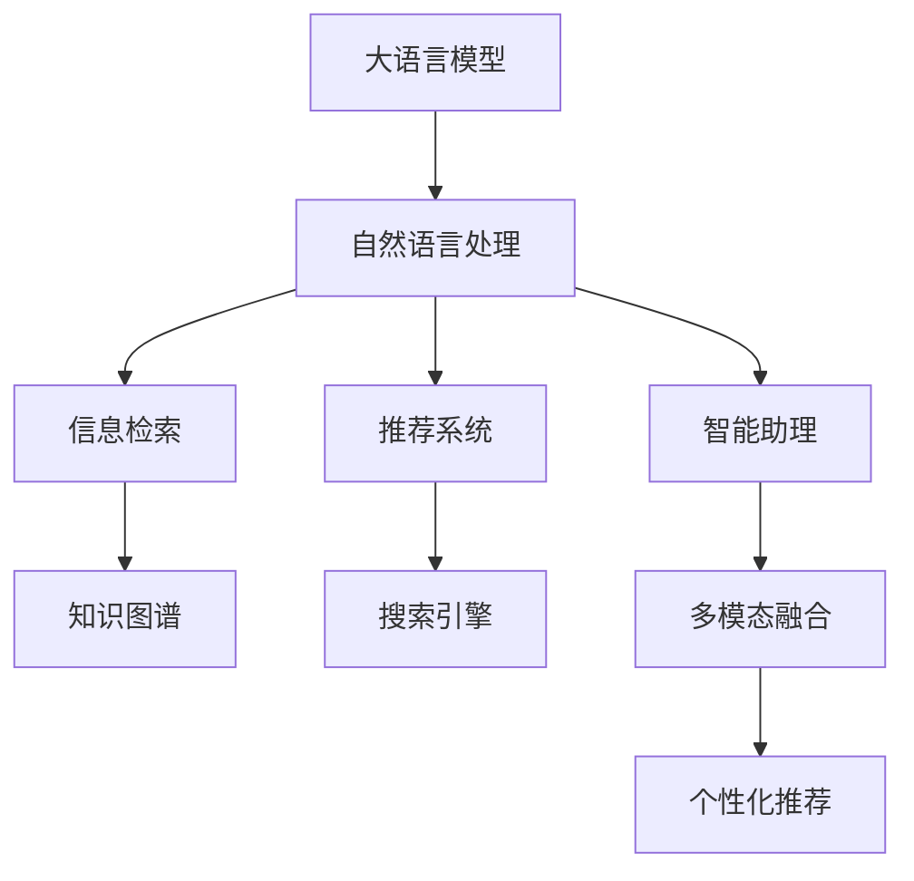

                 

# 认知革命：LLM如何改变信息处理方式

> 关键词：大语言模型(Large Language Model, LLM), 自然语言处理(NLP), 信息检索(IR), 知识图谱(KG), 推荐系统, 搜索引擎, 智能助理, 数据治理

## 1. 背景介绍

### 1.1 问题由来
近年来，随着深度学习技术的飞速发展，基于Transformer架构的大语言模型(LLM)在自然语言处理(NLP)领域取得了前所未有的突破。这些模型通过大规模无监督学习，学习了自然语言的深度表示，在各种NLP任务上表现优异，标志着AI时代的一次重大突破。

当前，LLM已经广泛应用于智能助理、搜索引擎、推荐系统、智能问答、信息检索等多个领域。它们通过理解和生成自然语言，改变了人类与计算机交互的方式，极大地提升了信息获取和处理的效率和准确性。但同时，这也带来了新的挑战：如何更高效、更智能地处理海量的自然语言信息？

### 1.2 问题核心关键点
在大语言模型(LLM)的推动下，信息处理方式正在经历一场“认知革命”。从传统的文本检索、搜索引擎到智能助理、推荐系统，LLM正在彻底改变我们处理信息的方式。其关键点包括：

- 泛化能力：LLM能够从大规模无监督数据中学习通用的语言知识，应用于各种NLP任务，提升了信息检索和处理的泛化能力。
- 智能推理：通过模型自监督学习，LLM能够进行逻辑推理、实体关系抽取、因果关系推断等高级认知任务。
- 个性化推荐：LLM能够理解用户的多样化需求，提供个性化推荐服务，提升了信息检索的相关性。
- 知识图谱集成：LLM可以与知识图谱融合，提供更全面、准确的信息检索和推理服务。
- 多模态融合：LLM能够处理文本、图像、语音等多模态数据，提升信息检索和处理的多样性。

### 1.3 问题研究意义
研究LLM如何改变信息处理方式，对于推动人工智能技术在各个垂直领域的落地应用，提升人类社会的信息获取和处理效率，具有重要的理论和实践意义：

1. 提升信息检索的效率和准确性：通过智能推理和知识图谱集成，LLM可以更快、更准确地回答用户的问题。
2. 提供个性化推荐服务：LLM可以理解用户的多样化需求，提供更个性化的推荐内容，提升用户体验。
3. 辅助知识图谱构建：LLM可以自动抽取实体关系和知识，辅助构建更全面、准确的知识图谱。
4. 促进多模态信息融合：LLM可以处理文本、图像、语音等多模态数据，提升信息检索和处理的多样性。
5. 加速AI产业化进程：LLM能够提供强大的语言处理能力，加速AI技术在各个垂直领域的落地应用，提升产业效率。

## 2. 核心概念与联系

### 2.1 核心概念概述

为了更好地理解LLM如何改变信息处理方式，本节将介绍几个关键概念：

- 大语言模型(Large Language Model, LLM)：以自回归或自编码模型为代表的大规模预训练语言模型。通过在大规模无标签文本语料上进行预训练，学习到丰富的语言知识，具备强大的语言理解和生成能力。
- 自然语言处理(Natural Language Processing, NLP)：涉及自然语言文本的计算、分析和生成过程，包括文本分类、信息检索、机器翻译、命名实体识别等任务。
- 信息检索(Information Retrieval, IR)：涉及检索系统对信息源进行标引、检索和排序，提升信息获取效率的过程。
- 知识图谱(Knowledge Graph, KG)：由实体节点和关系边构成的图谱结构，用于存储和管理结构化知识，支持语义搜索和推理。
- 推荐系统(Recommendation System)：通过分析用户的历史行为数据，预测用户偏好，推荐个性化内容，提升用户满意度。
- 搜索引擎(Search Engine)：以用户输入的关键词为基础，自动检索相关信息，提供搜索结果的检索系统。
- 智能助理(Chatbot)：通过对话系统，为用户提供自然语言交互服务，执行复杂任务。

这些概念之间的联系可以通过以下Mermaid流程图来展示：



这个流程图展示了LLM与其他NLP技术和应用之间的紧密联系。通过LLM，自然语言处理技术能够应用于信息检索、知识图谱构建、推荐系统和智能助理等多个领域，提升信息获取和处理的效率和准确性。

## 3. 核心算法原理 & 具体操作步骤
### 3.1 算法原理概述

LLM改变信息处理方式的核心在于其强大的语言理解和生成能力。其基本原理是通过大规模无监督学习，学习自然语言的深度表示，从而在各种NLP任务上表现优异。

在信息检索和推荐系统中，LLM通过理解用户查询或行为，从文本或数据集中检索相关信息，提升信息获取的效率和准确性。在智能助理和搜索引擎中，LLM能够通过对话系统，提供自然语言交互服务，执行复杂任务。

LLM的核心算法包括：

- 自回归模型：通过预测下一个词的概率，生成文本序列。
- 自编码模型：通过编码-解码的方式，学习文本序列的压缩表示。
- 语言模型：通过学习文本序列的概率分布，实现语言理解和生成。
- 预训练和微调：通过在大规模无监督数据上进行预训练，在特定任务上进行微调，提升模型性能。

### 3.2 算法步骤详解

LLM改变信息处理方式的核心算法步骤如下：

**Step 1: 准备数据集**
- 收集和预处理数据集，包括文本语料、用户行为数据、知识图谱等。
- 将数据集划分为训练集、验证集和测试集，确保数据的多样性和覆盖度。

**Step 2: 构建预训练模型**
- 选择合适的预训练模型架构，如Transformer、BERT、GPT等。
- 在大规模无监督数据上进行预训练，学习通用的语言表示。

**Step 3: 进行微调**
- 根据具体任务的需求，选择合适的微调策略，如全参数微调、参数高效微调等。
- 在标注数据集上，使用微调策略对预训练模型进行优化。
- 根据任务需求，选择不同的输出层和损失函数。

**Step 4: 集成和部署**
- 将微调后的模型集成到应用系统中，如智能助理、推荐系统、搜索引擎等。
- 实现与知识图谱、多模态数据等的融合，提升信息处理的效率和准确性。
- 进行实时监控和优化，确保系统稳定运行。

### 3.3 算法优缺点

LLM改变信息处理方式的优势包括：

- 强大的泛化能力：通过大规模无监督学习，LLM能够泛化到各种NLP任务，提升信息处理的效率和准确性。
- 智能推理：LLM可以进行逻辑推理、实体关系抽取、因果关系推断等高级认知任务。
- 个性化推荐：LLM能够理解用户的多样化需求，提供个性化的推荐服务。
- 多模态融合：LLM能够处理文本、图像、语音等多模态数据，提升信息检索和处理的多样性。

然而，LLM也存在一些局限性：

- 数据依赖性强：LLM的性能很大程度上取决于预训练和微调的数据质量，数据不足可能导致性能下降。
- 可解释性差：LLM的决策过程缺乏可解释性，难以对其推理逻辑进行分析和调试。
- 计算资源消耗大：大规模预训练和微调需要大量的计算资源，成本较高。
- 风险控制难度大：LLM可能学习到有害的信息和偏见，带来负面影响。

### 3.4 算法应用领域

LLM在多个领域的应用展示了其强大的语言处理能力，以下是几个主要的应用场景：

- 智能助理：通过对话系统，LLM可以执行复杂的自然语言任务，如智能问答、客服、聊天机器人等。
- 搜索引擎：通过理解用户查询，LLM可以提供更精准、相关性更高的搜索结果。
- 推荐系统：通过分析用户行为，LLM可以提供个性化的推荐服务，提升用户体验。
- 信息检索：通过自然语言处理，LLM可以快速检索出用户需要的信息。
- 智能问答：通过理解问题，LLM可以提供准确的答案和解释。
- 知识图谱：通过抽取实体关系和知识，LLM可以辅助构建更全面、准确的知识图谱。
- 多模态融合：通过处理文本、图像、语音等多模态数据，LLM可以提升信息检索和处理的多样性。

这些应用场景展示了LLM在不同领域中的巨大潜力，推动了AI技术的快速发展。

## 4. 数学模型和公式 & 详细讲解 & 举例说明

### 4.1 数学模型构建

LLM的核心算法可以采用数学语言进行更加严格的刻画。

记预训练语言模型为 $M_{\theta}$，其中 $\theta$ 为预训练得到的模型参数。假设微调任务的训练集为 $D=\{(x_i,y_i)\}_{i=1}^N$，其中 $x_i$ 为输入文本，$y_i$ 为标签（如文本、用户行为数据、知识图谱等）。

定义模型 $M_{\theta}$ 在输入 $x$ 上的输出为 $\hat{y}=M_{\theta}(x)$。假设微调任务的损失函数为 $\ell$，则经验风险为：

$$
\mathcal{L}(\theta) = \frac{1}{N}\sum_{i=1}^N \ell(M_{\theta}(x_i),y_i)
$$

微调的优化目标是最小化经验风险，即找到最优参数：

$$
\theta^* = \mathop{\arg\min}_{\theta} \mathcal{L}(\theta)
$$

在实践中，我们通常使用基于梯度的优化算法（如SGD、Adam等）来近似求解上述最优化问题。设 $\eta$ 为学习率，则参数的更新公式为：

$$
\theta \leftarrow \theta - \eta \nabla_{\theta}\mathcal{L}(\theta)
$$

其中 $\nabla_{\theta}\mathcal{L}(\theta)$ 为损失函数对参数 $\theta$ 的梯度，可通过反向传播算法高效计算。

### 4.2 公式推导过程

以下我们以信息检索任务为例，推导基于LLM的信息检索模型的损失函数及其梯度的计算公式。

假设查询为 $q$，文档集合为 $D=\{d_i\}_{i=1}^M$。查询与文档之间的相似度计算模型为：

$$
s(q, d_i) = \sum_{i=1}^n w_i \cdot M_{\theta}(q) \cdot M_{\theta}(d_i)
$$

其中 $w_i$ 为词向量权重，$n$ 为词汇表大小。假设模型输出为 $\hat{s}(q, d_i)$，则信息检索任务的损失函数为：

$$
\ell(M_{\theta}(q),y_i) = -\log \hat{s}(q,d_i)
$$

将其代入经验风险公式，得：

$$
\mathcal{L}(\theta) = -\frac{1}{N}\sum_{i=1}^N \log \hat{s}(q_i,d_{r_i})
$$

其中 $q_i$ 为查询，$r_i$ 为对应的相关文档。根据链式法则，损失函数对参数 $\theta_k$ 的梯度为：

$$
\frac{\partial \mathcal{L}(\theta)}{\partial \theta_k} = -\frac{1}{N}\sum_{i=1}^N \frac{\partial \log \hat{s}(q_i,d_{r_i})}{\partial \theta_k}
$$

其中 $\frac{\partial \log \hat{s}(q_i,d_{r_i})}{\partial \theta_k}$ 可通过自动微分技术计算。

在得到损失函数的梯度后，即可带入参数更新公式，完成模型的迭代优化。重复上述过程直至收敛，最终得到适应特定信息检索任务的模型参数 $\theta^*$。

### 4.3 案例分析与讲解

假设我们需要开发一个基于LLM的信息检索系统，以下是具体实现过程：

**Step 1: 准备数据集**
- 收集用户查询和相关文档数据，并进行预处理和划分。
- 对文档进行索引和摘要，提升查询效率。

**Step 2: 构建预训练模型**
- 选择合适的预训练语言模型，如BERT、GPT等。
- 在大规模无监督语料上预训练，学习通用的语言表示。

**Step 3: 进行微调**
- 根据信息检索任务的需求，在标注数据集上对预训练模型进行微调。
- 选择适当的输出层和损失函数，如基于余弦相似度的损失函数。

**Step 4: 集成和部署**
- 将微调后的模型集成到信息检索系统中，处理用户查询。
- 实时监测系统性能，不断优化模型和数据。

例如，我们使用BERT模型进行信息检索任务的微调。首先，构建查询和文档的向量表示：

$$
q = M_{\theta}(q)
$$

$$
d = M_{\theta}(d)
$$

其中 $q$ 为查询向量，$d$ 为文档向量。然后，计算查询与文档的相似度：

$$
s(q, d) = \text{dot}(q, d)
$$

其中 $\text{dot}$ 为向量点积。最后，根据余弦相似度计算损失函数：

$$
\ell(s(q, d), y_i) = -\log \frac{\exp(s(q, d))}{\sum_j \exp(s(q, d_j))}
$$

其中 $y_i$ 为相关文档的标签，$n$ 为文档集合大小。

通过上述数学模型和推导过程，可以清晰地看到LLM在信息检索任务中的实现过程。

## 5. 项目实践：代码实例和详细解释说明
### 5.1 开发环境搭建

在进行LLM的实践前，我们需要准备好开发环境。以下是使用Python进行PyTorch开发的环境配置流程：

1. 安装Anaconda：从官网下载并安装Anaconda，用于创建独立的Python环境。

2. 创建并激活虚拟环境：
```bash
conda create -n pytorch-env python=3.8 
conda activate pytorch-env
```

3. 安装PyTorch：根据CUDA版本，从官网获取对应的安装命令。例如：
```bash
conda install pytorch torchvision torchaudio cudatoolkit=11.1 -c pytorch -c conda-forge
```

4. 安装Transformers库：
```bash
pip install transformers
```

5. 安装各类工具包：
```bash
pip install numpy pandas scikit-learn matplotlib tqdm jupyter notebook ipython
```

完成上述步骤后，即可在`pytorch-env`环境中开始实践。

### 5.2 源代码详细实现

这里我们以信息检索任务为例，给出使用Transformers库对BERT模型进行微调的PyTorch代码实现。

首先，定义查询和文档的向量表示函数：

```python
from transformers import BertTokenizer, BertForMaskedLM, BertModel

tokenizer = BertTokenizer.from_pretrained('bert-base-cased')

def embed(text):
    tokens = tokenizer.encode(text, add_special_tokens=False)
    return torch.tensor(tokens).to(device)
```

然后，定义模型和优化器：

```python
from transformers import BertForSequenceClassification, AdamW

model = BertForSequenceClassification.from_pretrained('bert-base-cased', num_labels=num_labels)

optimizer = AdamW(model.parameters(), lr=learning_rate)
```

接着，定义训练和评估函数：

```python
from torch.utils.data import DataLoader
from tqdm import tqdm
from sklearn.metrics import accuracy_score

device = torch.device('cuda') if torch.cuda.is_available() else torch.device('cpu')
model.to(device)

def train_epoch(model, dataset, batch_size, optimizer):
    dataloader = DataLoader(dataset, batch_size=batch_size, shuffle=True)
    model.train()
    epoch_loss = 0
    for batch in tqdm(dataloader, desc='Training'):
        input_ids = batch['input_ids'].to(device)
        attention_mask = batch['attention_mask'].to(device)
        labels = batch['labels'].to(device)
        model.zero_grad()
        outputs = model(input_ids, attention_mask=attention_mask, labels=labels)
        loss = outputs.loss
        epoch_loss += loss.item()
        loss.backward()
        optimizer.step()
    return epoch_loss / len(dataloader)

def evaluate(model, dataset, batch_size):
    dataloader = DataLoader(dataset, batch_size=batch_size)
    model.eval()
    preds, labels = [], []
    with torch.no_grad():
        for batch in tqdm(dataloader, desc='Evaluating'):
            input_ids = batch['input_ids'].to(device)
            attention_mask = batch['attention_mask'].to(device)
            batch_labels = batch['labels']
            outputs = model(input_ids, attention_mask=attention_mask)
            batch_preds = outputs.logits.argmax(dim=2).to('cpu').tolist()
            batch_labels = batch_labels.to('cpu').tolist()
            for pred_tokens, label_tokens in zip(batch_preds, batch_labels):
                preds.append(pred_tokens[:len(label_tokens)])
                labels.append(label_tokens)
                
    print(accuracy_score(labels, preds))
```

最后，启动训练流程并在测试集上评估：

```python
epochs = 5
batch_size = 16

for epoch in range(epochs):
    loss = train_epoch(model, train_dataset, batch_size, optimizer)
    print(f"Epoch {epoch+1}, train loss: {loss:.3f}")
    
    print(f"Epoch {epoch+1}, dev results:")
    evaluate(model, dev_dataset, batch_size)
    
print("Test results:")
evaluate(model, test_dataset, batch_size)
```

以上就是使用PyTorch对BERT进行信息检索任务微调的完整代码实现。可以看到，得益于Transformers库的强大封装，我们可以用相对简洁的代码完成BERT模型的加载和微调。

### 5.3 代码解读与分析

让我们再详细解读一下关键代码的实现细节：

**embed函数**：
- 定义了将文本转换为BERT模型输入的向量表示，使用了BertTokenizer对文本进行分词和编码。

**训练和评估函数**：
- 使用PyTorch的DataLoader对数据集进行批次化加载，供模型训练和推理使用。
- 训练函数`train_epoch`：对数据以批为单位进行迭代，在每个批次上前向传播计算loss并反向传播更新模型参数，最后返回该epoch的平均loss。
- 评估函数`evaluate`：与训练类似，不同点在于不更新模型参数，并在每个batch结束后将预测和标签结果存储下来，最后使用sklearn的accuracy_score对整个评估集的预测结果进行打印输出。

**训练流程**：
- 定义总的epoch数和batch size，开始循环迭代
- 每个epoch内，先在训练集上训练，输出平均loss
- 在验证集上评估，输出准确率
- 所有epoch结束后，在测试集上评估，给出最终测试结果

可以看到，PyTorch配合Transformers库使得BERT微调的代码实现变得简洁高效。开发者可以将更多精力放在数据处理、模型改进等高层逻辑上，而不必过多关注底层的实现细节。

当然，工业级的系统实现还需考虑更多因素，如模型的保存和部署、超参数的自动搜索、更灵活的任务适配层等。但核心的微调范式基本与此类似。

## 6. 实际应用场景
### 6.1 智能助理

基于大语言模型LLM的智能助理系统，能够执行复杂的自然语言任务，如智能问答、客服、聊天机器人等。在技术实现上，可以收集企业内部的历史客服对话记录，将问题和最佳答复构建成监督数据，在此基础上对预训练对话模型进行微调。微调后的对话模型能够自动理解用户意图，匹配最合适的答案模板进行回复。对于客户提出的新问题，还可以接入检索系统实时搜索相关内容，动态组织生成回答。如此构建的智能助理系统，能大幅提升客户咨询体验和问题解决效率。

### 6.2 搜索引擎

搜索引擎是信息检索领域的重要应用，通过理解用户查询，自动检索相关信息，提供搜索结果。传统搜索引擎往往依赖于关键字匹配和倒排索引，难以处理复杂的查询意图。基于大语言模型LLM的搜索引擎，通过理解用户查询，可以提供更精准、相关性更高的搜索结果。例如，谷歌搜索引擎已经引入了BERT等大语言模型，显著提升了搜索结果的准确性和用户满意度。

### 6.3 推荐系统

推荐系统通过分析用户的历史行为数据，预测用户偏好，推荐个性化内容，提升用户满意度。传统推荐系统往往只依赖用户的历史行为数据进行物品推荐，难以深入理解用户的真实兴趣偏好。基于大语言模型LLM的推荐系统，可以通过理解用户的多样化需求，提供更加个性化、多样化的推荐服务。例如，Amazon等电商网站已经引入了BERT等大语言模型，显著提升了推荐效果和用户满意度。

### 6.4 未来应用展望

随着大语言模型LLM的发展，基于微调的方法将在更多领域得到应用，为传统行业带来变革性影响。

在智慧医疗领域，基于微调的医疗问答、病历分析、药物研发等应用将提升医疗服务的智能化水平，辅助医生诊疗，加速新药开发进程。

在智能教育领域，微调技术可应用于作业批改、学情分析、知识推荐等方面，因材施教，促进教育公平，提高教学质量。

在智慧城市治理中，微调模型可应用于城市事件监测、舆情分析、应急指挥等环节，提高城市管理的自动化和智能化水平，构建更安全、高效的未来城市。

此外，在企业生产、社会治理、文娱传媒等众多领域，基于大模型微调的人工智能应用也将不断涌现，为经济社会发展注入新的动力。相信随着技术的日益成熟，微调方法将成为人工智能落地应用的重要范式，推动人工智能技术在各个垂直领域的规模化落地。

## 7. 工具和资源推荐
### 7.1 学习资源推荐

为了帮助开发者系统掌握大语言模型LLM的微调理论基础和实践技巧，这里推荐一些优质的学习资源：

1. 《Transformer from the Top》系列博文：由大模型技术专家撰写，深入浅出地介绍了Transformer原理、BERT模型、微调技术等前沿话题。

2. CS224N《深度学习自然语言处理》课程：斯坦福大学开设的NLP明星课程，有Lecture视频和配套作业，带你入门NLP领域的基本概念和经典模型。

3. 《Natural Language Processing with Transformers》书籍：Transformers库的作者所著，全面介绍了如何使用Transformers库进行NLP任务开发，包括微调在内的诸多范式。

4. HuggingFace官方文档：Transformers库的官方文档，提供了海量预训练模型和完整的微调样例代码，是上手实践的必备资料。

5. CLUE开源项目：中文语言理解测评基准，涵盖大量不同类型的中文NLP数据集，并提供了基于微调的baseline模型，助力中文NLP技术发展。

通过对这些资源的学习实践，相信你一定能够快速掌握大语言模型LLM的微调精髓，并用于解决实际的NLP问题。
###  7.2 开发工具推荐

高效的开发离不开优秀的工具支持。以下是几款用于大语言模型LLM微调开发的常用工具：

1. PyTorch：基于Python的开源深度学习框架，灵活动态的计算图，适合快速迭代研究。大部分预训练语言模型都有PyTorch版本的实现。

2. TensorFlow：由Google主导开发的开源深度学习框架，生产部署方便，适合大规模工程应用。同样有丰富的预训练语言模型资源。

3. Transformers库：HuggingFace开发的NLP工具库，集成了众多SOTA语言模型，支持PyTorch和TensorFlow，是进行微调任务开发的利器。

4. Weights & Biases：模型训练的实验跟踪工具，可以记录和可视化模型训练过程中的各项指标，方便对比和调优。与主流深度学习框架无缝集成。

5. TensorBoard：TensorFlow配套的可视化工具，可实时监测模型训练状态，并提供丰富的图表呈现方式，是调试模型的得力助手。

6. Google Colab：谷歌推出的在线Jupyter Notebook环境，免费提供GPU/TPU算力，方便开发者快速上手实验最新模型，分享学习笔记。

合理利用这些工具，可以显著提升大语言模型LLM微调任务的开发效率，加快创新迭代的步伐。

### 7.3 相关论文推荐

大语言模型LLM和微调技术的发展源于学界的持续研究。以下是几篇奠基性的相关论文，推荐阅读：

1. Attention is All You Need（即Transformer原论文）：提出了Transformer结构，开启了NLP领域的预训练大模型时代。

2. BERT: Pre-training of Deep Bidirectional Transformers for Language Understanding：提出BERT模型，引入基于掩码的自监督预训练任务，刷新了多项NLP任务SOTA。

3. Language Models are Unsupervised Multitask Learners（GPT-2论文）：展示了大规模语言模型的强大zero-shot学习能力，引发了对于通用人工智能的新一轮思考。

4. Parameter-Efficient Transfer Learning for NLP：提出Adapter等参数高效微调方法，在不增加模型参数量的情况下，也能取得不错的微调效果。

5. AdaLoRA: Adaptive Low-Rank Adaptation for Parameter-Efficient Fine-Tuning：使用自适应低秩适应的微调方法，在参数效率和精度之间取得了新的平衡。

6. 《SQuAD: 10,000+ Question-Answer Pairs from Wikipedia and Stack Exchange for Data-Driven Question Answering System Development》：基于Wikipedia和Stack Exchange数据集构建大规模问答数据集，推动了基于LLM的智能问答系统的发展。

这些论文代表了大语言模型LLM微调技术的发展脉络。通过学习这些前沿成果，可以帮助研究者把握学科前进方向，激发更多的创新灵感。

## 8. 总结：未来发展趋势与挑战
### 8.1 总结

本文对基于大语言模型LLM的信息处理方式进行了全面系统的介绍。首先阐述了LLM在自然语言处理领域的突破，明确了其强大的语言处理能力和对信息检索、推荐系统、智能助理等应用的影响。其次，从原理到实践，详细讲解了LLM的数学模型和关键步骤，给出了微调任务开发的完整代码实例。同时，本文还探讨了LLM在不同应用场景中的广泛应用，展示了其巨大的潜力和应用前景。

通过本文的系统梳理，可以看到，基于大语言模型LLM的微调技术正在深刻改变信息处理的范式，推动了人工智能技术在各个垂直领域的落地应用。LLM通过强大的泛化能力和智能推理能力，极大地提升了信息检索和处理的效率和准确性，成为AI技术的重要组成部分。未来，随着LLM的发展和优化，其在信息处理中的应用将更加广泛，带来更加智能化、高效化的解决方案。

### 8.2 未来发展趋势

展望未来，大语言模型LLM在信息处理领域的趋势将呈现以下几个方向：

1. 模型规模持续增大：随着算力成本的下降和数据规模的扩张，预训练语言模型的参数量还将持续增长。超大模型的强大语言理解能力，有望进一步提升信息处理的效率和准确性。

2. 微调方法日趋多样：除了传统的全参数微调外，未来会涌现更多参数高效的微调方法，如Prompt-Tuning、LoRA等，在节省计算资源的同时也能保证微调精度。

3. 持续学习成为常态：随着数据分布的不断变化，微调模型也需要持续学习新知识以保持性能。如何在不遗忘原有知识的同时，高效吸收新样本信息，将成为重要的研究课题。

4. 数据依赖性降低：受启发于自监督学习范式，未来的微调方法将更好地利用非结构化数据，降低对标注数据的需求，实现更加灵活高效的微调。

5. 可解释性增强：未来的大语言模型将更多地考虑模型的可解释性，通过解释模型的推理过程，增强其透明度和可信度。

6. 多模态融合：大语言模型将不仅仅处理文本数据，还将处理图像、视频、语音等多模态数据，提升信息处理的多样性和鲁棒性。

以上趋势凸显了大语言模型LLM在信息处理领域的广阔前景。这些方向的探索发展，必将进一步提升信息检索、推荐系统、智能助理等应用的性能和效果，推动AI技术在各个垂直领域的落地应用。

### 8.3 面临的挑战

尽管大语言模型LLM在信息处理领域取得了显著成就，但在迈向更加智能化、普适化应用的过程中，它仍面临着诸多挑战：

1. 数据依赖性强：LLM的性能很大程度上取决于预训练和微调的数据质量，数据不足可能导致性能下降。如何降低微调对标注样本的依赖，是亟待解决的问题。

2. 模型鲁棒性不足：面对域外数据时，LLM的泛化性能往往不足，容易产生误导性、歧视性的输出。如何提高模型的鲁棒性，避免灾难性遗忘，还需要更多理论和实践的积累。

3. 推理效率有待提高：大规模预训练和微调需要大量的计算资源，推理速度慢、内存占用大，亟需优化。

4. 可解释性差：LLM的决策过程缺乏可解释性，难以对其推理逻辑进行分析和调试。对于高风险应用，算法的可解释性和可审计性尤为重要。

5. 安全性问题：LLM可能学习到有害的信息和偏见，带来负面影响。如何从数据和算法层面消除模型偏见，确保输出安全性，也是重要的研究方向。

6. 知识整合能力不足：现有的LLM往往局限于任务内数据，难以灵活吸收和运用更广泛的先验知识。如何让微调过程更好地与外部知识库、规则库等专家知识结合，形成更加全面、准确的信息整合能力，还有很大的想象空间。

正视LLM面临的这些挑战，积极应对并寻求突破，将是大语言模型LLM向更加智能化、普适化应用迈进的关键。相信随着学界和产业界的共同努力，这些挑战终将一一被克服，大语言模型LLM必将在信息处理领域大放异彩，推动AI技术的不断创新和发展。

### 8.4 研究展望

未来，大语言模型LLM在信息处理领域的研究将更加注重以下几个方向：

1. 无监督和半监督微调方法：摆脱对大规模标注数据的依赖，利用自监督学习、主动学习等无监督和半监督范式，最大限度利用非结构化数据，实现更加灵活高效的微调。

2. 参数高效和计算高效的微调方法：开发更加参数高效的微调方法，在固定大部分预训练参数的同时，只更新极少量的任务相关参数。同时优化微调模型的计算图，减少前向传播和反向传播的资源消耗，实现更加轻量级、实时性的部署。

3. 因果分析和博弈论工具：引入因果分析方法，识别出模型决策的关键特征，增强输出解释的因果性和逻辑性。借助博弈论工具，探索人机交互过程，主动探索并规避模型的脆弱点，提高系统稳定性。

4. 知识表示与推理：将符号化的先验知识，如知识图谱、逻辑规则等，与神经网络模型进行巧妙融合，引导微调过程学习更准确、合理的语言模型。同时加强不同模态数据的整合，实现视觉、语音等多模态信息与文本信息的协同建模。

5. 多模态融合与协同建模：通过处理文本、图像、语音等多模态数据，提升信息检索和处理的多样性，增强系统的鲁棒性和适应性。

6. 伦理道德约束：在模型训练目标中引入伦理导向的评估指标，过滤和惩罚有偏见、有害的输出倾向。加强人工干预和审核，建立模型行为的监管机制，确保输出符合人类价值观和伦理道德。

这些研究方向的探索，必将引领大语言模型LLM在信息处理领域的不断进步，为构建更加智能化、普适化、可解释、可控的智能系统铺平道路。

## 9. 附录：常见问题与解答

**Q1：大语言模型LLM微调是否适用于所有NLP任务？**

A: 大语言模型LLM的微调方法在大多数NLP任务上都能取得不错的效果，特别是对于数据量较小的任务。但对于一些特定领域的任务，如医学、法律等，仅仅依靠通用语料预训练的模型可能难以很好地适应。此时需要在特定领域语料上进一步预训练，再进行微调，才能获得理想效果。此外，对于一些需要时效性、个性化很强的任务，如对话、推荐等，微调方法也需要针对性的改进优化。

**Q2：微调过程中如何选择合适的学习率？**

A: 微调的学习率一般要比预训练时小1-2个数量级，如果使用过大的学习率，容易破坏预训练权重，导致过拟合。一般建议从1e-5开始调参，逐步减小学习率，直至收敛。也可以使用warmup策略，在开始阶段使用较小的学习率，再逐渐过渡到预设值。需要注意的是，不同的优化器(如AdamW、Adafactor等)以及不同的学习率调度策略，可能需要设置不同的学习率阈值。

**Q3：采用大语言模型LLM微调时会面临哪些资源瓶颈？**

A: 目前主流的预训练大模型动辄以亿计的参数规模，对算力、内存、存储都提出了很高的要求。GPU/TPU等高性能设备是必不可少的，但即便如此，超大批次的训练和推理也可能遇到显存不足的问题。因此需要采用一些资源优化技术，如梯度积累、混合精度训练、模型并行等，来突破硬件瓶颈。同时，模型的存储和读取也可能占用大量时间和空间，需要采用模型压缩、稀疏化存储等方法进行优化。

**Q4：如何缓解微调过程中的过拟合问题？**

A: 过拟合是微调面临的主要挑战，尤其是在标注数据不足的情况下。常见的缓解策略包括：
1. 数据增强：通过回译、近义替换等方式扩充训练集
2. 正则化：使用L2正则、Dropout、Early Stopping等避免过拟合
3. 对抗训练：引入对抗样本，提高模型鲁棒性
4. 参数高效微调：只调整少量参数(如Adapter、Prefix等)，减小过拟合风险
5. 多模型集成：训练多个微调模型，取平均输出，抑制过拟合

这些策略往往需要根据具体任务和数据特点进行灵活组合。只有在数据、模型、训练、推理等各环节进行全面优化，才能最大限度地发挥大语言模型LLM的微调威力。

**Q5：微调模型在落地部署时需要注意哪些问题？**

A: 将微调模型转化为实际应用，还需要考虑以下因素：
1. 模型裁剪：去除不必要的层和参数，减小模型尺寸，加快推理速度
2. 量化加速：将浮点模型转为定点模型，压缩存储空间，提高计算效率
3. 服务化封装：将模型封装为标准化服务接口，便于集成调用
4. 弹性伸缩：根据请求流量动态调整资源配置，平衡服务质量和成本
5. 监控告警：实时采集系统指标，设置异常告警阈值，确保服务稳定性
6. 安全防护：采用访问鉴权、数据脱敏等措施，保障数据和模型安全

大语言模型LLM微调为NLP应用开启了广阔的想象空间，但如何将强大的性能转化为稳定、高效、安全的业务价值，还需要工程实践的不断打磨。唯有从数据、算法、工程、业务等多个维度协同发力，才能真正实现人工智能技术在垂直行业的规模化落地。总之，微调需要开发者根据具体任务，不断迭代和优化模型、数据和算法，方能得到理想的效果。

---

作者：禅与计算机程序设计艺术 / Zen and the Art of Computer Programming

