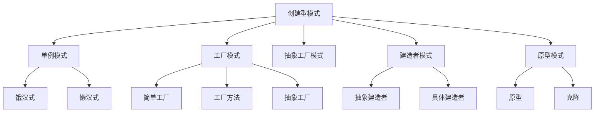

                 

# 设计模式：解决常见软件设计问题

## 1. 背景介绍

### 1.1 问题由来

在软件开发过程中，经常遇到各种设计问题，如代码复用性差、系统耦合度高、扩展性差、维护成本高等。这些问题严重影响了软件系统的质量和开发效率，因此设计模式成为解决这些问题的有力工具。设计模式是一种被广泛认可的代码解决方案，它被广泛应用于软件开发的不同阶段，可以帮助开发者在设计和实现软件时遵循最佳实践。

### 1.2 问题核心关键点

设计模式的核心在于解决软件设计中的常见问题，提高代码的可复用性、可扩展性和可维护性。核心设计模式包括创建型模式、结构型模式和行为型模式，每类模式又包含多个具体的设计模式。

## 2. 核心概念与联系

### 2.1 核心概念概述

- **创建型模式**：关注对象的创建过程，旨在通过抽象化对象的创建，实现更加灵活和高效的对象创建。包括单例模式、工厂模式、抽象工厂模式、建造者模式、原型模式等。

- **结构型模式**：关注类或对象的组合结构，旨在通过抽象化结构组合，实现更加灵活和高效的结构设计。包括适配器模式、装饰器模式、代理模式、外观模式、桥接模式、组合模式、享元模式、代理模式等。

- **行为型模式**：关注类或对象之间的交互行为，旨在通过抽象化交互行为，实现更加灵活和高效的行为实现。包括观察者模式、命令模式、职责链模式、状态模式、策略模式、模板方法模式、解释器模式等。

这些核心设计模式之间存在着紧密的联系，共同构成了软件设计的整体框架。通过理解这些模式的基本原理和适用场景，开发者可以更加高效地构建可靠、可扩展的软件系统。

### 2.2 核心概念原理和架构的 Mermaid 流程图



## 3. 核心算法原理 & 具体操作步骤

### 3.1 算法原理概述

设计模式基于面向对象编程（OOP）的基本原理，通过抽象化对象的创建、组合和行为，实现了软件设计的模块化和可复用性。设计模式的实现通常依赖于多态性和继承性，通过定义一组规范和接口，使得不同类之间的交互更加清晰和灵活。

### 3.2 算法步骤详解

#### 3.2.1 创建型模式的算法步骤

1. **定义抽象创建类**：定义一个抽象类作为创建类的基类，包含创建对象的通用方法。
2. **实现具体创建类**：继承抽象创建类，实现具体创建方法，生成具体的对象实例。
3. **使用创建类**：通过调用具体创建类的方法，创建所需的对象实例。

#### 3.2.2 结构型模式的算法步骤

1. **定义抽象结构类**：定义一个抽象类作为结构类的基类，包含结构类的通用方法。
2. **实现具体结构类**：继承抽象结构类，实现具体结构方法，生成具体的结构实例。
3. **使用结构类**：通过调用具体结构类的方法，实现结构组合和行为。

#### 3.2.3 行为型模式的算法步骤

1. **定义抽象行为类**：定义一个抽象类作为行为类的基类，包含行为类的通用方法。
2. **实现具体行为类**：继承抽象行为类，实现具体行为方法，生成具体的行为实例。
3. **使用行为类**：通过调用具体行为类的方法，实现行为交互和动态调整。

### 3.3 算法优缺点

- **优点**：
  - 提高了代码的复用性和可扩展性。
  - 增强了代码的可读性和可维护性。
  - 简化了复杂系统的设计和实现。

- **缺点**：
  - 设计模式可能增加代码的复杂度。
  - 设计模式可能会降低代码的运行效率。
  - 设计模式可能需要额外的设计成本。

### 3.4 算法应用领域

设计模式在软件开发中的应用广泛，包括但不限于以下领域：

- **企业应用系统**：大型企业应用系统通常需要具备高可扩展性和高可维护性，设计模式可以提供有效的解决方案。
- **移动应用开发**：移动应用需要高效灵活的设计，以适应不同的设备和平台，设计模式可以优化开发流程。
- **Web应用开发**：Web应用通常需要处理大量的并发请求和复杂逻辑，设计模式可以提升系统性能和稳定性。
- **游戏开发**：游戏开发需要高效灵活的资源管理和对象管理，设计模式可以优化游戏设计和实现。
- **IoT应用开发**：物联网应用需要处理大量的传感器数据和复杂的交互逻辑，设计模式可以提升系统效率和可靠性。

## 4. 数学模型和公式 & 详细讲解 & 举例说明

### 4.1 数学模型构建

设计模式的设计模型通常基于简单的数学模型，用于描述模式中的对象和行为。以下是一个简单的单例模式的设计模型：

$$
\text{Factory Method} \rightarrow \text{Singleton} \rightarrow \text{Product}
$$

其中，Factory Method是抽象工厂类，Singleton是单例类，Product是抽象产品类，具体产品类在单例类中进行实例化。

### 4.2 公式推导过程

单例模式的实现可以通过饿汉式和懒汉式两种方式。饿汉式单例模式在类加载时就创建对象实例，而懒汉式单例模式在第一次调用时创建对象实例。以下是对懒汉式单例模式的推导：

```java
public class Singleton {
    private static Singleton instance;
    
    private Singleton() {
    }
    
    public static Singleton getInstance() {
        if (instance == null) {
            instance = new Singleton();
        }
        return instance;
    }
}
```

### 4.3 案例分析与讲解

以观察者模式为例，该模式用于实现对象之间的观察者关系，当一个对象发生变化时，所有依赖它的观察者对象都会接收到通知并做出相应的反应。以下是一个简单的观察者模式的实现：

```java
public interface Subject {
    void registerObserver(Observer observer);
    void removeObserver(Observer observer);
    void notifyObservers();
}

public class ConcreteSubject implements Subject {
    private List<Observer> observers;
    
    public ConcreteSubject() {
        observers = new ArrayList<>();
    }
    
    public void registerObserver(Observer observer) {
        observers.add(observer);
    }
    
    public void removeObserver(Observer observer) {
        observers.remove(observer);
    }
    
    public void notifyObservers() {
        for (Observer observer : observers) {
            observer.update();
        }
    }
}

public interface Observer {
    void update();
}

public class ConcreteObserver implements Observer {
    private Subject subject;
    
    public ConcreteObserver(Subject subject) {
        this.subject = subject;
        subject.registerObserver(this);
    }
    
    public void update() {
        System.out.println("Observer updated");
    }
}
```

在上述代码中，Subject是抽象主题类，ConcreteSubject是具体主题类，Observer是抽象观察者类，ConcreteObserver是具体观察者类。当ConcreteSubject对象发生变化时，所有依赖它的ConcreteObserver对象都会接收到更新通知并输出日志。

## 5. 项目实践：代码实例和详细解释说明

### 5.1 开发环境搭建

为了实现设计模式的应用，需要搭建一个支持面向对象编程的开发环境。以下是在Java平台上的开发环境搭建流程：

1. 安装Java开发工具包（JDK），如Oracle JDK、OpenJDK等。
2. 安装IDE开发工具，如IntelliJ IDEA、Eclipse等。
3. 安装Git版本控制系统，以便进行版本控制。
4. 安装Maven或Gradle构建工具，以便进行依赖管理。
5. 安装测试框架，如JUnit、Mockito等，以便进行单元测试和集成测试。

### 5.2 源代码详细实现

以建造者模式为例，该模式用于构建复杂的对象，通过将对象的创建过程分为多个步骤，使得对象创建过程更加灵活和可复用。以下是一个简单的建造者模式的实现：

```java
public abstract class Product {
    protected String part1;
    protected String part2;
    protected String part3;
    
    public String toString() {
        return "Part1: " + part1 + ", Part2: " + part2 + ", Part3: " + part3;
    }
}

public class ConcreteProduct extends Product {
    public ConcreteProduct(String part1, String part2, String part3) {
        this.part1 = part1;
        this.part2 = part2;
        this.part3 = part3;
    }
}

public class Builder {
    public void buildPart1(String part1) {
        this.part1 = part1;
    }
    
    public void buildPart2(String part2) {
        this.part2 = part2;
    }
    
    public void buildPart3(String part3) {
        this.part3 = part3;
    }
    
    public Product build() {
        return new ConcreteProduct(part1, part2, part3);
    }
}

public class Director {
    public Product construct() {
        Builder builder = new Builder();
        builder.buildPart1("Part1");
        builder.buildPart2("Part2");
        builder.buildPart3("Part3");
        return builder.build();
    }
}
```

在上述代码中，Product是抽象产品类，ConcreteProduct是具体产品类，Builder是抽象建造类，Director是建造者类。Director对象负责调用Builder对象的build方法，依次构建产品的各个部分，最终返回一个完整的ConcreteProduct对象。

### 5.3 代码解读与分析

- **Product类**：定义产品的通用接口，用于表示产品的一部分。
- **ConcreteProduct类**：实现具体产品类，根据Part1、Part2、Part3的不同组合生成不同的产品实例。
- **Builder类**：定义抽象建造类，包含各个部分构建方法的接口，但不涉及具体实现。
- **Director类**：调用Builder类的方法，构建具体产品实例，实现建造者模式的核心逻辑。

### 5.4 运行结果展示

运行Director对象的construct方法，可以得到一个完整的ConcreteProduct对象，并输出其各个部分。例如：

```
Part1: Part1, Part2: Part2, Part3: Part3
```

## 6. 实际应用场景

### 6.1 企业应用系统

在设计模式的应用中，企业应用系统通常需要具备高可扩展性和高可维护性。观察者模式、发布-订阅模式、代理模式等可以有效地解决企业应用系统的设计问题。例如，在企业系统中，当一个模块发生变化时，所有依赖该模块的模块都需要做出相应的调整。观察者模式可以帮助企业系统实现模块之间的解耦和信息同步。

### 6.2 移动应用开发

移动应用开发需要高效灵活的设计，以适应不同的设备和平台。单例模式、工厂模式、装饰器模式等可以优化移动应用的开发流程。例如，在移动应用中，某个组件可能需要在不同的设备上运行，单例模式可以确保该组件在整个应用中的唯一性。工厂模式可以根据设备的性能，动态生成不同的组件实例。装饰器模式可以为组件添加额外的功能，如缓存、日志等，以提高应用性能。

### 6.3 Web应用开发

Web应用通常需要处理大量的并发请求和复杂逻辑。适配器模式、代理模式、装饰器模式等可以提升Web应用的系统性能和稳定性。例如，在Web应用中，不同的客户端可能需要不同的数据格式和接口，适配器模式可以将不同格式的接口转换为统一的格式，方便客户端调用。代理模式可以封装Web服务器的访问接口，增强系统的安全性和可靠性。装饰器模式可以为Web应用添加额外的功能，如缓存、压缩等，以提高系统效率。

### 6.4 游戏开发

游戏开发需要高效灵活的资源管理和对象管理。建造者模式、策略模式、状态模式等可以优化游戏的设计和实现。例如，在游戏开发中，游戏角色的不同部分需要动态构建，建造者模式可以帮助游戏引擎快速构建角色的各个部分。策略模式可以根据游戏规则动态选择不同的游戏策略，提高游戏的可玩性和挑战性。状态模式可以根据玩家的状态，动态调整游戏的行为和输出，提高游戏的交互性。

### 6.5 IoT应用开发

物联网应用需要处理大量的传感器数据和复杂的交互逻辑。适配器模式、观察者模式、策略模式等可以提升物联网应用的系统效率和可靠性。例如，在物联网应用中，不同设备可能需要不同的数据格式和协议，适配器模式可以将不同协议的数据转换为统一的格式，方便设备之间的通信。观察者模式可以实现设备之间的信息同步和事件通知，提高系统的可扩展性。策略模式可以根据不同的设备类型和应用场景，动态选择不同的算法和策略，提高系统的灵活性和适应性。

## 7. 工具和资源推荐

### 7.1 学习资源推荐

为了帮助开发者系统掌握设计模式的基本原理和应用技巧，以下是一些优质的学习资源：

1. 《设计模式：可复用的面向对象软件基础》（Head First Design Patterns）：该书以生动的例子和图表示例，深入浅出地介绍了23种经典设计模式，是设计模式的经典入门书籍。

2. 《Head First设计模式》（Head First Design Patterns）：该书以有趣的方式介绍了设计模式的原理和应用，适合初学者和进阶者。

3. 《设计模式：分析与应用》（Design Patterns: Elements of Reusable Object-Oriented Software）：该书是设计模式的经典之作，介绍了23种经典设计模式，并提供了丰富的案例和代码示例。

4. Udemy和Coursera等在线教育平台上的设计模式课程，提供了系统化的学习路径和实践项目。

5. GitHub上的设计模式代码示例库，包含了大量设计模式的代码实现和应用案例。

### 7.2 开发工具推荐

为了方便开发者实现设计模式，以下是一些常用的开发工具：

1. IntelliJ IDEA：一个强大的Java IDE，提供了丰富的代码分析和代码补全功能，适合进行设计模式的实践和测试。

2. Eclipse：一个流行的Java IDE，提供了丰富的插件和工具支持，适合进行设计模式的实现和调试。

3. Maven或Gradle：构建工具，提供了依赖管理和构建自动化功能，适合进行设计模式的打包和部署。

4. Git：版本控制系统，提供了版本控制和协作开发功能，适合进行设计模式的版本管理和团队协作。

5. JUnit和Mockito：测试框架，提供了单元测试和集成测试功能，适合进行设计模式的测试和验证。

### 7.3 相关论文推荐

以下是几篇关于设计模式的经典论文，推荐阅读：

1. 《设计模式：可复用的面向对象软件基础》（Design Patterns: Elements of Reusable Object-Oriented Software）：作者Gang of Four，介绍了23种经典设计模式，并提供了大量的代码示例。

2. 《面向对象设计模式：可重用性设计方案》（Design Patterns: Elements of Reusable Object-Oriented Software）：作者Ernst Mojsés R. Medo和Richard E. Burroughs，介绍了23种经典设计模式，并提供了丰富的案例和代码实现。

3. 《设计模式：分析与应用》（Design Patterns: Analysis and Application）：作者Jonathan Edwards，介绍了23种经典设计模式，并提供了丰富的案例和代码示例。

4. 《设计模式：可复用的面向对象软件基础》（Head First Design Patterns）：作者Eric Freeman和Elisabeth Robson，以生动有趣的方式介绍了23种经典设计模式，适合初学者和进阶者。

## 8. 总结：未来发展趋势与挑战

### 8.1 研究成果总结

设计模式在软件开发中的应用广泛，已经被广泛应用于企业应用系统、移动应用开发、Web应用开发、游戏开发和物联网应用开发等多个领域。设计模式通过抽象化对象的创建、组合和行为，提高了代码的复用性和可扩展性，增强了代码的可读性和可维护性，简化了复杂系统的设计和实现。

### 8.2 未来发展趋势

设计模式的未来发展趋势包括：

1. 设计模式的多样化：随着软件开发的需求日益多样化和复杂化，新的设计模式将不断涌现，以解决更加复杂的问题。

2. 设计模式的模块化：设计模式将更加注重模块化和组件化，以便更好地适应不同的应用场景和需求。

3. 设计模式的自动化：设计模式将更加注重自动化和智能化，以便更好地支持开发者的设计决策和代码生成。

4. 设计模式的标准化：设计模式将更加注重标准化和规范化，以便更好地促进跨团队和跨项目的代码复用和协同开发。

### 8.3 面临的挑战

设计模式在应用过程中仍然面临一些挑战：

1. 设计模式的适用性问题：不是所有问题都适合使用设计模式解决，需要根据具体问题选择合适的设计模式。

2. 设计模式的复杂性问题：设计模式可能会增加代码的复杂性，需要开发者具备较高的设计和实现能力。

3. 设计模式的学习曲线问题：设计模式的学习曲线较陡峭，需要开发者具备一定的经验和知识背景。

4. 设计模式的应用场景问题：设计模式的应用场景通常较为复杂，需要开发者具备丰富的项目经验和实践经验。

### 8.4 研究展望

设计模式的研究展望包括：

1. 设计模式的进化和演变：设计模式将不断进化和演变，以适应更加复杂和多样的软件开发需求。

2. 设计模式的数据驱动：设计模式将更多地依赖于数据和实验，以优化设计方案和提升设计效果。

3. 设计模式的自适应性：设计模式将更多地依赖于自适应和自优化，以提高系统的灵活性和适应性。

4. 设计模式的可扩展性：设计模式将更多地依赖于可扩展和可复用，以提高系统的可扩展性和可维护性。

总之，设计模式作为一种有效的软件设计工具，将继续在软件开发中发挥重要作用。未来的研究需要在设计模式的适用性、复杂性、学习曲线和应用场景等方面进行不断探索和优化，以更好地满足软件开发的需求。

## 9. 附录：常见问题与解答

### Q1：设计模式是否可以应用于所有的软件开发项目？

A: 设计模式适用于大部分软件开发项目，特别是在大型系统和复杂场景下，设计模式可以提供有效的解决方案。但是，并不是所有的软件开发项目都适合使用设计模式，需要根据具体项目的需求和特点进行灵活选择。

### Q2：设计模式是否会增加系统的复杂性？

A: 设计模式可能会增加系统的复杂性，特别是在设计模式的应用不当或者过度使用时，可能会导致系统的复杂度增加。但是，通过合理的设计和使用设计模式，可以在不增加系统复杂性的前提下，提高系统的可复用性和可维护性。

### Q3：设计模式是否适用于面向对象编程（OOP）以外的编程范式？

A: 设计模式主要是针对面向对象编程（OOP）的，适用于支持继承和多态性的编程语言。对于其他编程范式，如函数式编程、命令式编程等，可能不适用于设计模式。

### Q4：设计模式是否可以在不同的编程语言中应用？

A: 设计模式的设计思想是通用的，可以应用于多种编程语言和编程范式。但是在不同的编程语言中，设计模式的实现方式可能会有所不同，需要根据具体的编程语言和框架进行灵活调整。

### Q5：设计模式是否需要额外的设计成本？

A: 设计模式需要额外的设计成本，需要进行系统的分析和设计，以确定最适合的设计模式。但是，设计模式的设计成本通常是一次性的，一旦设计完成，后续的开发和维护成本将大幅降低。

总之，设计模式作为一种有效的软件设计工具，将继续在软件开发中发挥重要作用。未来的研究需要在设计模式的适用性、复杂性、学习曲线和应用场景等方面进行不断探索和优化，以更好地满足软件开发的需求。

