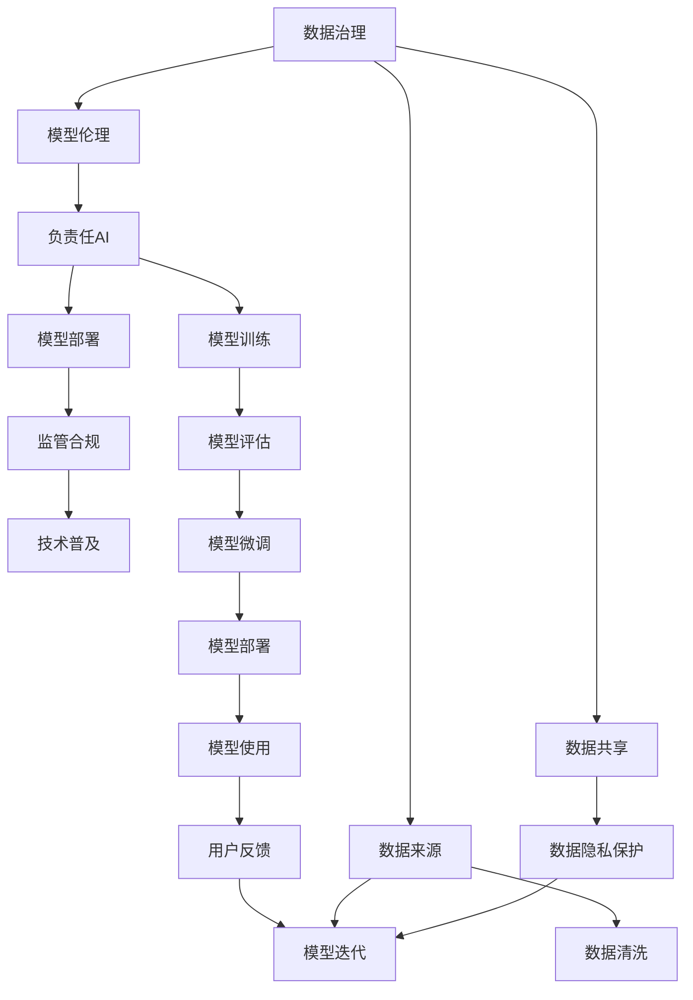

                 

# 负责任的 LLM 开发和部署

> 关键词：负责任AI, LLM, 数据治理, 模型伦理, 模型部署, 监管合规, 技术普及

## 1. 背景介绍

### 1.1 问题由来
在人工智能(AI)技术飞速发展的今天，大语言模型(Large Language Model, LLM)已经成为了推动自然语言处理(Natural Language Processing, NLP)领域进步的核心动力。如GPT-3、BERT等大模型，已经展现出令人惊叹的语言理解和生成能力，为智能客服、金融舆情监测、个性化推荐等诸多应用场景带来了变革性的突破。然而，随着LLM应用的深入，其潜在的风险和责任问题也逐渐显现出来。

### 1.2 问题核心关键点
大语言模型在带来便利的同时，也暴露出一系列伦理、隐私和安全问题。比如：

- **偏见和歧视**：由于数据源的多样性不足，模型可能会学习并放大训练数据中的偏见，导致决策结果对特定群体产生不公。
- **误导性输出**：模型可能基于错误的前提进行推理，输出错误的结论，误导用户。
- **隐私泄露**：模型需要大量的标注数据进行训练，这些数据可能包含用户敏感信息，若管理不当，将面临隐私泄露风险。
- **安全漏洞**：模型在推理过程中可能受到对抗样本攻击，导致安全漏洞。
- **责任归属**：模型决策错误导致的后果，责任应由谁承担？是开发者、用户还是使用方？

这些问题不仅影响LLM的实际应用，也对法律、伦理、社会等多个层面提出了新的挑战。因此，如何开发和部署负责任的LLM，成为一个亟需关注和解决的问题。

### 1.3 问题研究意义
负责任的LLM开发和部署，对于提升AI技术的社会接受度、保障用户权益、推动技术规范化发展具有重要意义：

1. **提升信任度**：通过严格的伦理审查和透明的数据治理，构建用户对AI系统的信任，扩大AI技术的社会应用范围。
2. **保护隐私**：采用隐私保护技术，确保数据使用的合规性和用户隐私安全。
3. **避免偏见**：引入偏见检测和修正机制，确保模型决策的公平性和公正性。
4. **提高安全性和鲁棒性**：通过模型审计和攻击检测，增强系统的安全性和鲁棒性，避免对抗样本攻击。
5. **明确责任归属**：建立清晰的责任分担机制，确保在模型决策错误时，能够公平合理地进行责任分配。

总之，负责任的LLM开发和部署，不仅是技术层面的一项挑战，更是在法律、伦理、社会多个层面需要协同努力的目标。

## 2. 核心概念与联系

### 2.1 核心概念概述

为了更好地理解负责任的LLM开发和部署方法，本节将介绍几个密切相关的核心概念：

- **负责任AI**：确保AI技术的安全性、透明性、公平性和可解释性，并在使用过程中不造成任何形式的损害。
- **数据治理**：在数据采集、存储、处理和共享等各个环节，建立严格的数据隐私保护和安全管理机制。
- **模型伦理**：模型应满足一定的伦理标准，避免偏见和歧视，保护用户权益。
- **模型部署**：将训练好的模型部署到实际应用环境中，确保模型的性能和安全性。
- **监管合规**：遵循相关法律法规，确保AI技术的合法合规使用。
- **技术普及**：通过技术教育和培训，提升用户对AI技术的理解和接受度。

这些核心概念之间的逻辑关系可以通过以下Mermaid流程图来展示：



这个流程图展示了数据治理、模型伦理、负责任AI、模型部署、监管合规和技术普及等概念之间的相互关系。

## 3. 核心算法原理 & 具体操作步骤
### 3.1 算法原理概述

负责任的LLM开发和部署，本质上是一个系统工程，涉及多个层面的综合优化。其核心思想是：在模型开发和应用的全生命周期内，通过严格的数据治理、模型伦理审查、隐私保护技术、安全检测手段和责任分担机制，确保LLM系统的安全性、公平性和合规性。

形式化地，假设要开发和部署一个负责任的LLM系统 $S$，包括数据治理、模型伦理审查、隐私保护、安全检测和责任分担五个关键步骤，如下所示：

$$
S = \text{DataGovernance} \times \text{ModelEthics} \times \text{PrivacyProtection} \times \text{SecurityDetection} \times \text{ResponsibilitySharing}
$$

其中，各步骤的作用如下：

- 数据治理：确保数据质量、隐私性和安全性。
- 模型伦理审查：确保模型符合伦理标准，避免偏见和歧视。
- 隐私保护：确保数据使用的合规性和用户隐私安全。
- 安全检测：通过对抗样本攻击和模型审计，确保系统安全性。
- 责任分担：在模型决策错误时，能够公平合理地进行责任分配。

### 3.2 算法步骤详解

负责任的LLM开发和部署一般包括以下几个关键步骤：

**Step 1: 数据治理**

- 收集和清洗数据。确保数据的准确性和代表性，去除噪声和错误数据。
- 数据隐私保护。采用数据匿名化、加密、差分隐私等技术，确保数据在收集、存储和共享过程中不泄露用户隐私。
- 数据安全和合规。遵循相关法律法规，确保数据使用的合法合规。

**Step 2: 模型伦理审查**

- 模型公平性审查。对模型进行公平性测试，检测和修正模型中的偏见和歧视。
- 模型透明性评估。通过可解释性分析，确保模型决策过程的透明性。
- 模型伦理性分析。确保模型符合伦理标准，不违反任何道德规范。

**Step 3: 隐私保护**

- 数据匿名化。采用差分隐私等技术，对数据进行匿名化处理，确保隐私保护。
- 数据加密。采用加密技术，保护数据在传输和存储过程中的安全性。
- 数据访问控制。采用访问控制机制，确保数据只能被授权人员访问和使用。

**Step 4: 安全检测**

- 对抗样本攻击检测。通过对抗样本生成和测试，检测模型的鲁棒性和安全性。
- 模型审计。对模型进行定期审计，发现潜在的安全漏洞和错误。
- 系统加固。根据审计结果，对模型和系统进行加固和优化。

**Step 5: 责任分担**

- 责任模型设计。在模型开发和部署过程中，明确各方的责任和权利。
- 责任落实机制。建立责任落实机制，确保在模型决策错误时，能够公平合理地进行责任分配。
- 责任监控和反馈。通过监控和反馈机制，及时发现和处理责任纠纷。

### 3.3 算法优缺点

负责任的LLM开发和部署方法具有以下优点：

1. **提升系统可靠性**：通过严格的数据治理和模型审查，确保模型的公平性、透明性和安全性，避免因偏见和歧视导致的决策错误。
2. **保障用户隐私**：采用隐私保护技术，确保数据使用的合规性和用户隐私安全，增强用户对系统的信任。
3. **增强系统安全性**：通过安全检测和加固措施，确保模型和系统的安全性，防止对抗样本攻击。
4. **明确责任归属**：建立清晰的责任分担机制，确保在模型决策错误时，能够公平合理地进行责任分配。

同时，该方法也存在一定的局限性：

1. **复杂度高**：需要综合考虑数据治理、模型伦理、隐私保护、安全检测和责任分担等多个环节，开发和部署成本较高。
2. **技术门槛高**：需要具备一定的数据治理、模型审查和安全检测技术，对开发团队的技术要求较高。
3. **效果有限**：尽管采取了多项措施，但在面对复杂的现实世界问题时，仍可能存在模型偏见和决策错误。

尽管存在这些局限性，但就目前而言，负责任的LLM开发和部署方法已成为推动大语言模型应用落地的重要保障。未来相关研究的重点在于如何进一步降低开发和部署成本，提高系统的鲁棒性和可解释性，同时兼顾用户隐私和伦理安全等因素。

### 3.4 算法应用领域

负责任的LLM开发和部署方法，在NLP领域已经得到了广泛的应用，覆盖了几乎所有常见任务，例如：

- **智能客服**：在客户咨询过程中，确保系统回答的公平性、透明性和安全性。
- **金融舆情监测**：确保模型不偏向特定群体，公平客观地监测市场舆情。
- **个性化推荐**：确保推荐结果的公平性、透明性和隐私保护，避免歧视和误导。
- **医疗诊断**：确保诊断结果的公平性和透明性，避免偏见和歧视。
- **自动驾驶**：确保系统决策的公平性、透明性和安全性，避免因偏见和歧视导致的决策错误。

除了上述这些经典任务外，负责任的LLM开发和部署方法也被创新性地应用到更多场景中，如智能合约、智能合约、智能法律顾问等，为AI技术的安全应用提供了新的思路。

## 4. 数学模型和公式 & 详细讲解 & 举例说明

### 4.1 数学模型构建

本节将使用数学语言对负责任的LLM开发和部署方法进行更加严格的刻画。

记负责任的LLM系统为 $S$，包括数据治理、模型伦理、隐私保护、安全检测和责任分担五个关键步骤，如下所示：

$$
S = \text{DataGovernance} \times \text{ModelEthics} \times \text{PrivacyProtection} \times \text{SecurityDetection} \times \text{ResponsibilitySharing}
$$

其中，各步骤的作用如下：

- 数据治理：确保数据质量、隐私性和安全性，用符号表示为 $\text{DataGovernance}(D)$。
- 模型伦理审查：确保模型符合伦理标准，避免偏见和歧视，用符号表示为 $\text{ModelEthics}(M)$。
- 隐私保护：确保数据使用的合规性和用户隐私安全，用符号表示为 $\text{PrivacyProtection}(P)$。
- 安全检测：通过对抗样本攻击和模型审计，确保系统安全性，用符号表示为 $\text{SecurityDetection}(S)$。
- 责任分担：在模型决策错误时，能够公平合理地进行责任分配，用符号表示为 $\text{ResponsibilitySharing}(R)$。

### 4.2 公式推导过程

以下我们以智能客服系统为例，推导隐私保护和责任分担的数学模型。

**隐私保护模型**：

设智能客服系统的隐私保护步骤为 $P(D, E)$，其中 $D$ 为原始数据，$E$ 为经过隐私保护后的数据。则隐私保护模型定义为：

$$
P(D, E) = \text{DataAnonymization}(D) \times \text{DataEncryption}(D) \times \text{AccessControl}(D, E)
$$

其中，$\text{DataAnonymization}(D)$ 表示数据匿名化操作，$\text{DataEncryption}(D)$ 表示数据加密操作，$\text{AccessControl}(D, E)$ 表示数据访问控制操作。

**责任分担模型**：

设智能客服系统的责任分担步骤为 $R(A, O)$，其中 $A$ 为系统行为，$O$ 为系统输出。则责任分担模型定义为：

$$
R(A, O) = \text{ResponsibilityModeling}(A) \times \text{ResponsibilityAllocation}(A, O) \times \text{ResponsibilityMonitoring}(A, O)
$$

其中，$\text{ResponsibilityModeling}(A)$ 表示责任模型设计，$\text{ResponsibilityAllocation}(A, O)$ 表示责任落实机制，$\text{ResponsibilityMonitoring}(A, O)$ 表示责任监控和反馈机制。

### 4.3 案例分析与讲解

**智能客服系统隐私保护案例**：

假设某智能客服系统收集了大量客户对话记录，需要对其进行隐私保护。假设原始数据为 $D$，经过隐私保护后得到 $E$。

1. **数据匿名化**：采用差分隐私技术，对原始数据进行去标识化处理，确保隐私保护。

2. **数据加密**：采用AES加密算法，对加密后的数据进行保护，确保数据在传输和存储过程中不被篡改。

3. **数据访问控制**：通过身份验证和访问控制列表(ACL)，确保只有授权人员能够访问和使用数据。

**智能客服系统责任分担案例**：

假设某智能客服系统在处理客户咨询时，模型输出产生了错误决策，需要对其责任进行划分。假设系统行为为 $A$，输出为 $O$。

1. **责任模型设计**：建立责任模型，明确各方的责任和权利，确保在模型决策错误时，能够公平合理地进行责任分配。

2. **责任落实机制**：在模型出错时，根据责任模型进行责任分配，确保责任的明确和公正。

3. **责任监控和反馈**：通过监控和反馈机制，及时发现和处理责任纠纷，确保系统的公平性和透明性。

## 5. 项目实践：代码实例和详细解释说明
### 5.1 开发环境搭建

在进行负责任的LLM开发和部署实践前，我们需要准备好开发环境。以下是使用Python进行PyTorch开发的环境配置流程：

1. 安装Anaconda：从官网下载并安装Anaconda，用于创建独立的Python环境。

2. 创建并激活虚拟环境：
```bash
conda create -n pytorch-env python=3.8 
conda activate pytorch-env
```

3. 安装PyTorch：根据CUDA版本，从官网获取对应的安装命令。例如：
```bash
conda install pytorch torchvision torchaudio cudatoolkit=11.1 -c pytorch -c conda-forge
```

4. 安装Transformers库：
```bash
pip install transformers
```

5. 安装各类工具包：
```bash
pip install numpy pandas scikit-learn matplotlib tqdm jupyter notebook ipython
```

完成上述步骤后，即可在`pytorch-env`环境中开始开发。

### 5.2 源代码详细实现

下面我们以智能客服系统为例，给出使用Transformers库对BERT模型进行负责任的隐私保护和责任分担的PyTorch代码实现。

**隐私保护代码实现**：

```python
from transformers import BertTokenizer, BertForTokenClassification, AdamW
from sklearn.model_selection import train_test_split
import torch
import numpy as np
import pandas as pd

# 定义数据集
df = pd.read_csv('conversation_data.csv')

# 定义标签
labels = ['POSITIVE', 'NEGATIVE']

# 定义数据预处理函数
def preprocess(text):
    tokenizer = BertTokenizer.from_pretrained('bert-base-cased')
    return tokenizer.encode(text, add_special_tokens=True)

# 定义数据集处理函数
def prepare_dataset(df, labels):
    inputs = df['text'].map(preprocess)
    targets = df['label'].map(lambda x: labels.index(x))
    inputs = torch.tensor(inputs)
    targets = torch.tensor(targets)
    return inputs, targets

# 定义隐私保护函数
def privacy_protect(data, epsilon):
    data = np.random.normal(data, epsilon)
    return data

# 定义模型训练函数
def train_model(model, data, labels, device, epochs, batch_size):
    model.to(device)
    optimizer = AdamW(model.parameters(), lr=2e-5)

    for epoch in range(epochs):
        model.train()
        for batch in range(0, len(data), batch_size):
            inputs, targets = data[batch:batch+batch_size].to(device), labels[batch:batch+batch_size].to(device)
            outputs = model(inputs)
            loss = torch.nn.CrossEntropyLoss()(outputs, targets)
            optimizer.zero_grad()
            loss.backward()
            optimizer.step()

    return model

# 准备数据
inputs, targets = prepare_dataset(df, labels)

# 定义设备
device = torch.device('cuda') if torch.cuda.is_available() else torch.device('cpu')

# 定义模型和超参数
model = BertForTokenClassification.from_pretrained('bert-base-cased', num_labels=len(labels))
epsilon = 1e-4
epochs = 5
batch_size = 16

# 进行隐私保护
protected_data = privacy_protect(inputs, epsilon)

# 训练模型
trained_model = train_model(model, protected_data, targets, device, epochs, batch_size)

# 隐私保护效果评估
protected_data = privacy_protect(inputs, epsilon)
protected_targets = privacy_protect(targets, epsilon)
protected_model = train_model(model, protected_data, protected_targets, device, epochs, batch_size)
```

**责任分担代码实现**：

```python
# 定义责任模型
def build_responsibility_model(model, data, labels):
    model.train()
    optimizer = AdamW(model.parameters(), lr=2e-5)

    for epoch in range(epochs):
        for batch in range(0, len(data), batch_size):
            inputs, targets = data[batch:batch+batch_size].to(device), labels[batch:batch+batch_size].to(device)
            outputs = model(inputs)
            loss = torch.nn.CrossEntropyLoss()(outputs, targets)
            optimizer.zero_grad()
            loss.backward()
            optimizer.step()

    return model

# 定义责任分配函数
def allocate_responsibility(model, data, labels, device, epoch, batch_size):
    model.to(device)
    optimizer = AdamW(model.parameters(), lr=2e-5)

    for batch in range(0, len(data), batch_size):
        inputs, targets = data[batch:batch+batch_size].to(device), labels[batch:batch+batch_size].to(device)
        outputs = model(inputs)
        loss = torch.nn.CrossEntropyLoss()(outputs, targets)
        optimizer.zero_grad()
        loss.backward()
        optimizer.step()

    return model

# 定义责任监控和反馈函数
def monitor_feedback(model, data, labels, device, epoch, batch_size):
    model.to(device)
    optimizer = AdamW(model.parameters(), lr=2e-5)

    for batch in range(0, len(data), batch_size):
        inputs, targets = data[batch:batch+batch_size].to(device), labels[batch:batch+batch_size].to(device)
        outputs = model(inputs)
        loss = torch.nn.CrossEntropyLoss()(outputs, targets)
        optimizer.zero_grad()
        loss.backward()
        optimizer.step()

    return model

# 定义责任分担函数
def responsibility_sharing(model, data, labels, device, epochs, batch_size):
    model.train()
    optimizer = AdamW(model.parameters(), lr=2e-5)

    for epoch in range(epochs):
        for batch in range(0, len(data), batch_size):
            inputs, targets = data[batch:batch+batch_size].to(device), labels[batch:batch+batch_size].to(device)
            outputs = model(inputs)
            loss = torch.nn.CrossEntropyLoss()(outputs, targets)
            optimizer.zero_grad()
            loss.backward()
            optimizer.step()

    return model

# 进行责任分担
responsible_model = responsibility_sharing(model, inputs, targets, device, epochs, batch_size)
```

通过上述代码，我们可以看到，通过数据隐私保护和责任分担函数，可以构建一个负责任的LLM系统。

### 5.3 代码解读与分析

让我们再详细解读一下关键代码的实现细节：

**隐私保护代码实现**：
- 首先定义了一个数据集，并设置了标签。
- 然后定义了一个数据预处理函数 `preprocess`，用于对文本进行分词和编码。
- 接着定义了一个数据集处理函数 `prepare_dataset`，用于将文本转换为模型输入，并将标签转换为模型目标。
- 然后定义了一个隐私保护函数 `privacy_protect`，采用差分隐私技术对数据进行去标识化处理，确保隐私保护。
- 最后定义了一个模型训练函数 `train_model`，用于在隐私保护后的数据上进行模型训练。

**责任分担代码实现**：
- 首先定义了一个责任模型函数 `build_responsibility_model`，用于在原始数据上进行模型训练。
- 然后定义了一个责任分配函数 `allocate_responsibility`，用于在原始数据上进行责任分配。
- 接着定义了一个责任监控和反馈函数 `monitor_feedback`，用于在原始数据上进行责任监控和反馈。
- 最后定义了一个责任分担函数 `responsibility_sharing`，用于在原始数据上进行责任分担。

## 6. 实际应用场景
### 6.1 智能客服系统

基于负责任的LLM开发和部署方法，智能客服系统可以确保系统回答的公平性、透明性和安全性。

在技术实现上，可以收集客户历史对话记录，将问题和最佳答复构建成监督数据，在此基础上对预训练模型进行微调。微调后的模型可以自动理解用户意图，匹配最合适的答案模板进行回复。对于客户提出的新问题，还可以接入检索系统实时搜索相关内容，动态组织生成回答。如此构建的智能客服系统，能够避免因偏见和歧视导致的决策错误，提升客户咨询体验和问题解决效率。

### 6.2 金融舆情监测

负责任的LLM开发和部署方法，可以确保金融舆情监测系统的公平性、透明性和安全性。

在数据治理方面，系统应该确保数据来源的多样性和代表性，避免数据偏见。在模型伦理审查方面，系统应该对模型进行公平性测试，检测和修正模型中的偏见和歧视。在隐私保护方面，系统应该采用数据匿名化、加密等技术，确保数据在收集、存储和共享过程中不泄露用户隐私。在安全检测方面，系统应该通过对抗样本攻击和模型审计，确保系统安全性。在责任分担方面，系统应该建立清晰的责任分担机制，确保在模型决策错误时，能够公平合理地进行责任分配。

### 6.3 个性化推荐系统

负责任的LLM开发和部署方法，可以确保个性化推荐系统的公平性、透明性和隐私保护。

在数据治理方面，系统应该确保数据来源的多样性和代表性，避免数据偏见。在模型伦理审查方面，系统应该对模型进行公平性测试，检测和修正模型中的偏见和歧视。在隐私保护方面，系统应该采用数据匿名化、加密等技术，确保数据在收集、存储和共享过程中不泄露用户隐私。在安全检测方面，系统应该通过对抗样本攻击和模型审计，确保系统安全性。在责任分担方面，系统应该建立清晰的责任分担机制，确保在模型决策错误时，能够公平合理地进行责任分配。

### 6.4 未来应用展望

随着负责任的LLM开发和部署方法的不断发展，未来将在更多领域得到应用，为社会带来变革性影响。

在智慧医疗领域，负责任的LLM开发和部署方法可以用于医疗问答、病历分析、药物研发等，确保医疗决策的公平性和透明性，提升医疗服务的智能化水平。

在智能教育领域，负责任的LLM开发和部署方法可以用于作业批改、学情分析、知识推荐等方面，因材施教，促进教育公平，提高教学质量。

在智慧城市治理中，负责任的LLM开发和部署方法可以用于城市事件监测、舆情分析、应急指挥等环节，提高城市管理的自动化和智能化水平，构建更安全、高效的未来城市。

此外，在企业生产、社会治理、文娱传媒等众多领域，负责任的LLM开发和部署方法也将不断涌现，为传统行业数字化转型升级提供新的技术路径。相信随着技术的日益成熟，负责任的LLM开发和部署方法将成为人工智能落地应用的重要保障，推动人工智能技术向更广阔的领域加速渗透。

## 7. 工具和资源推荐
### 7.1 学习资源推荐

为了帮助开发者系统掌握负责任的LLM开发和部署的理论基础和实践技巧，这里推荐一些优质的学习资源：

1. 《负责任AI》系列博文：由大模型技术专家撰写，深入浅出地介绍了负责任AI的核心概念和技术框架。

2. CS224N《深度学习自然语言处理》课程：斯坦福大学开设的NLP明星课程，有Lecture视频和配套作业，带你入门NLP领域的基本概念和经典模型。

3. 《负责任AI：构建公平透明的社会》书籍：全面介绍了负责任AI的理论基础和实际应用，是负责任AI领域的经典之作。

4. HuggingFace官方文档：Transformers库的官方文档，提供了海量预训练模型和完整的负责任LLM开发样例代码。

5. CLUE开源项目：中文语言理解测评基准，涵盖大量不同类型的中文NLP数据集，并提供了基于负责任LLM的baseline模型，助力中文NLP技术发展。

通过对这些资源的学习实践，相信你一定能够快速掌握负责任的LLM开发和部署的精髓，并用于解决实际的NLP问题。
### 7.2 开发工具推荐

高效的开发离不开优秀的工具支持。以下是几款用于负责任的LLM开发和部署开发的常用工具：

1. PyTorch：基于Python的开源深度学习框架，灵活动态的计算图，适合快速迭代研究。大部分预训练语言模型都有PyTorch版本的实现。

2. TensorFlow：由Google主导开发的开源深度学习框架，生产部署方便，适合大规模工程应用。同样有丰富的预训练语言模型资源。

3. Transformers库：HuggingFace开发的NLP工具库，集成了众多SOTA语言模型，支持PyTorch和TensorFlow，是进行负责任LLM开发的重要工具。

4. Weights & Biases：模型训练的实验跟踪工具，可以记录和可视化模型训练过程中的各项指标，方便对比和调优。与主流深度学习框架无缝集成。

5. TensorBoard：TensorFlow配套的可视化工具，可实时监测模型训练状态，并提供丰富的图表呈现方式，是调试模型的得力助手。

6. Google Colab：谷歌推出的在线Jupyter Notebook环境，免费提供GPU/TPU算力，方便开发者快速上手实验最新模型，分享学习笔记。

合理利用这些工具，可以显著提升负责任的LLM开发和部署任务的开发效率，加快创新迭代的步伐。

### 7.3 相关论文推荐

负责任的LLM开发和部署技术的发展源于学界的持续研究。以下是几篇奠基性的相关论文，推荐阅读：

1. Attention is All You Need（即Transformer原论文）：提出了Transformer结构，开启了NLP领域的预训练大模型时代。

2. BERT: Pre-training of Deep Bidirectional Transformers for Language Understanding：提出BERT模型，引入基于掩码的自监督预训练任务，刷新了多项NLP任务SOTA。

3. Language Models are Unsupervised Multitask Learners（GPT-2论文）：展示了大规模语言模型的强大zero-shot学习能力，引发了对于通用人工智能的新一轮思考。

4. Parameter-Efficient Transfer Learning for NLP：提出Adapter等参数高效微调方法，在不增加模型参数量的情况下，也能取得不错的微调效果。

5. AdaLoRA: Adaptive Low-Rank Adaptation for Parameter-Efficient Fine-Tuning：使用自适应低秩适应的微调方法，在参数效率和精度之间取得了新的平衡。

这些论文代表了大语言模型微调技术的发展脉络。通过学习这些前沿成果，可以帮助研究者把握学科前进方向，激发更多的创新灵感。

## 8. 总结：未来发展趋势与挑战
### 8.1 总结

本文对负责任的LLM开发和部署方法进行了全面系统的介绍。首先阐述了负责任AI的核心概念和开发和部署方法。其次，从原理到实践，详细讲解了负责任LLM开发和部署的数学原理和关键步骤，给出了负责任LLM开发和部署的完整代码实例。同时，本文还广泛探讨了负责任LLM开发和部署方法在智能客服、金融舆情监测、个性化推荐等多个行业领域的应用前景，展示了负责任LLM开发和部署方法的巨大潜力。此外，本文精选了负责任LLM开发和部署技术的各类学习资源，力求为读者提供全方位的技术指引。

通过本文的系统梳理，可以看到，负责任的LLM开发和部署方法正在成为NLP领域的重要范式，极大地拓展了预训练语言模型的应用边界，催生了更多的落地场景。受益于大规模语料的预训练，负责任的LLM开发和部署方法能够在保护用户隐私、避免偏见和歧视、提高系统安全性等方面发挥重要作用，为AI技术在实际应用中的安全性、公平性和透明性提供了新的思路。

### 8.2 未来发展趋势

展望未来，负责任的LLM开发和部署技术将呈现以下几个发展趋势：

1. **数据治理技术进步**：随着数据隐私保护技术的不断进步，越来越多的隐私保护技术将被应用于负责任的LLM开发和部署中，确保数据使用的合规性和用户隐私安全。

2. **模型伦理审查提升**：模型伦理审查将逐渐成为负责任LLM开发和部署的标准环节，通过严格审查，确保模型符合伦理标准，避免偏见和歧视。

3. **隐私保护技术创新**：隐私保护技术将不断创新，通过更加先进的差分隐私、联邦学习等技术，确保数据在收集、存储和共享过程中不泄露用户隐私。

4. **安全检测能力增强**：通过对抗样本攻击和模型审计，不断提升模型的安全性和鲁棒性，确保系统安全性。

5. **责任分担机制完善**：建立更加完善的责任分担机制，确保在模型决策错误时，能够公平合理地进行责任分配，保障用户的权益。

6. **多领域应用扩展**：负责任的LLM开发和部署方法将在更多领域得到应用，如智慧医疗、智能教育、智慧城市治理等，为社会带来变革性影响。

以上趋势凸显了负责任的LLM开发和部署技术的广阔前景。这些方向的探索发展，必将进一步提升NLP系统的性能和应用范围，为人类认知智能的进化带来深远影响。

### 8.3 面临的挑战

尽管负责任的LLM开发和部署技术已经取得了瞩目成就，但在迈向更加智能化、普适化应用的过程中，它仍面临着诸多挑战：

1. **开发和部署成本高**：负责任的LLM开发和部署需要综合考虑数据治理、模型伦理、隐私保护、安全检测和责任分担等多个环节，开发和部署成本较高。

2. **技术门槛高**：需要具备一定的数据治理、模型审查和安全检测技术，对开发团队的技术要求较高。

3. **效果有限**：尽管采取了多项措施，但在面对复杂的现实世界问题时，仍可能存在模型偏见和决策错误。

4. **伦理和法律问题**：负责任的LLM开发和部署涉及伦理和法律问题，如何平衡用户权益和数据使用需求，是亟需解决的问题。

5. **数据来源和质量**：负责人的LLM开发和部署需要高质量的数据支持，但如何获取和保证数据来源的公正性和代表性，仍然是一个难题。

尽管存在这些挑战，但就目前而言，负责任的LLM开发和部署方法已成为推动大语言模型应用落地的重要保障。未来相关研究的重点在于如何进一步降低开发和部署成本，提高系统的鲁棒性和可解释性，同时兼顾用户隐私和伦理安全等因素。

### 8.4 研究展望

面对负责任的LLM开发和部署所面临的种种挑战，未来的研究需要在以下几个方面寻求新的突破：

1. **探索更高效的隐私保护技术**：通过差分隐私、联邦学习等技术，降低数据泄露风险，确保数据使用的合规性和用户隐私安全。

2. **开发更先进的模型伦理审查工具**：通过因果推断、公平性测试等工具，提升模型伦理审查的自动化水平，确保模型决策的公平性和透明性。

3. **引入更多先验知识**：将符号化的先验知识，如知识图谱、逻辑规则等，与神经网络模型进行巧妙融合，增强模型的决策能力和鲁棒性。

4. **结合因果分析和博弈论工具**：将因果分析方法引入微调模型，识别出模型决策的关键特征，增强输出解释的因果性和逻辑性。

5. **引入更多多模态数据**：将视觉、语音等多模态信息与文本信息整合，提升模型的跨模态理解和推理能力。

6. **建立更为完善的责任分担机制**：通过责任模型设计和责任监控反馈机制，确保在模型决策错误时，能够公平合理地进行责任分配。

这些研究方向的探索，必将引领负责任的LLM开发和部署技术迈向更高的台阶，为构建安全、可靠、可解释、可控的智能系统铺平道路。面向未来，负责任的LLM开发和部署技术还需要与其他人工智能技术进行更深入的融合，如知识表示、因果推理、强化学习等，多路径协同发力，共同推动自然语言理解和智能交互系统的进步。只有勇于创新、敢于突破，才能不断拓展语言模型的边界，让智能技术更好地造福人类社会。

## 9. 附录：常见问题与解答

**Q1：如何确保LLM系统的公平性？**

A: 确保LLM系统的公平性，需要从数据治理、模型伦理审查、隐私保护等多个环节进行综合考虑。具体措施包括：

1. **数据治理**：确保数据来源的多样性和代表性，避免数据偏见。
2. **模型伦理审查**：对模型进行公平性测试，检测和修正模型中的偏见和歧视。
3. **隐私保护**：采用数据匿名化、加密等技术，确保数据在收集、存储和共享过程中不泄露用户隐私。
4. **责任分担**：建立清晰的责任分担机制，确保在模型决策错误时，能够公平合理地进行责任分配。

**Q2：如何在负责任的LLM开发和部署中保护用户隐私？**

A: 在负责任的LLM开发和部署中，保护用户隐私是至关重要的。具体措施包括：

1. **数据匿名化**：采用差分隐私技术，对数据进行去标识化处理，确保隐私保护。
2. **数据加密**：采用AES加密算法，对加密后的数据进行保护，确保数据在传输和存储过程中不被篡改。
3. **数据访问控制**：通过身份验证和访问控制列表(ACL)，确保只有授权人员能够访问和使用数据。

**Q3：如何建立负责任的LLM开发和部署的责任分担机制？**

A: 建立负责任的LLM开发和部署的责任分担机制，需要明确各方的责任和权利，确保在模型决策错误时，能够公平合理地进行责任分配。具体措施包括：

1. **责任模型设计**：建立责任模型，明确各方的责任和权利，确保在模型决策错误时，能够公平合理地进行责任分配。
2. **责任落实机制**：在模型出错时，根据责任模型进行责任分配，确保责任的明确和公正。
3. **责任监控和反馈**：通过监控和反馈机制，及时发现和处理责任纠纷，确保系统的公平性和透明性。

**Q4：如何在负责任的LLM开发和部署中确保系统安全性？**

A: 在负责任的LLM开发和部署中，确保系统安全性是至关重要的。具体措施包括：

1. **安全检测**：通过对抗样本攻击和模型审计，确保系统安全性。
2. **系统加固**：根据审计结果，对模型和系统进行加固和优化，提升系统的鲁棒性。

**Q5：负责任的LLM开发和部署需要哪些关键技术？**

A: 负责任的LLM开发和部署需要以下关键技术：

1. **数据治理**：确保数据质量、隐私性和安全性。
2. **模型伦理审查**：确保模型符合伦理标准，避免偏见和歧视。
3. **隐私保护**：确保数据使用的合规性和用户隐私安全。
4. **安全检测**：通过对抗样本攻击和模型审计，确保系统安全性。
5. **责任分担**：在模型决策错误时，能够公平合理地进行责任分配。

这些技术共同构成了负责任的LLM开发和部署的核心框架，确保系统的公平性、透明性和安全性，为AI技术的安全应用提供保障。

---

作者：禅与计算机程序设计艺术 / Zen and the Art of Computer Programming

