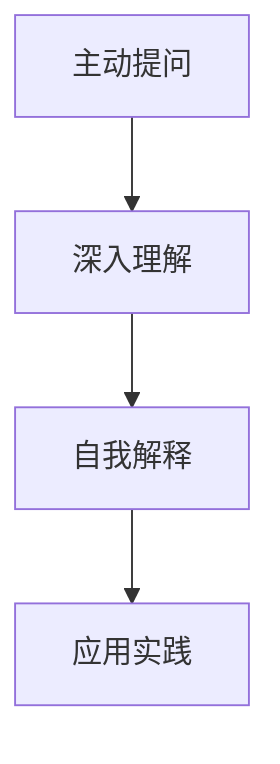

                 

# 费曼提问法：提升思考力的12个问题

## 1. 背景介绍

费曼提问法是由诺贝尔奖得主理查德·费曼（Richard Feynman）提出的一种学习方法，强调通过提问来深度理解和巩固知识。此方法的核心在于通过不断自问自答，构建自己对于知识的全面理解，并在输出过程中，检验和完善这些理解。费曼提问法不仅仅适用于学术研究，对于编程、软件开发、项目管理等技术领域也同样具有重要的借鉴意义。在本文中，我们将围绕费曼提问法的核心原理和具体应用，深入探讨如何通过系统化、结构化的提问，提升思考力和问题解决能力。

## 2. 核心概念与联系

### 2.1 核心概念概述

费曼提问法基于费曼学习法，通过将复杂问题拆解为一系列简明扼要的问题，逐步深化对问题的理解。其核心包括以下几个关键概念：

1. **核心概念一：主动提问**。费曼提问法的第一步是主动提问，即针对所学内容，自己提出一系列问题。这些问题的设计应围绕核心概念、难点问题以及实际应用场景展开，以确保全面覆盖所学内容。

2. **核心概念二：深入理解**。通过回答这些提问，可以进一步深入理解所学内容，尤其是那些容易被忽略的细节和深层次的逻辑关系。

3. **核心概念三：自我解释**。为了验证自己是否真正理解，可以通过向他人或自己解释所学内容，如果解释过程中出现卡壳或错误，应及时回头，重新审视和理解相关知识点。

4. **核心概念四：应用实践**。最终，将所学内容应用到实际问题中，通过解决实际问题，进一步巩固和深化理解。

### 2.2 核心概念原理和架构的 Mermaid 流程图



这个简单的流程图展示了费曼提问法的基本流程：通过提问、理解、解释和实践，循环迭代，不断深入学习。

## 3. 核心算法原理 & 具体操作步骤

### 3.1 算法原理概述

费曼提问法的核心在于通过系统化的问题设计，促进对知识点的深入理解和应用。其原理可以概括为以下几个步骤：

1. **初始化**：选择一个具体的学习内容，确定学习目标。
2. **主动提问**：围绕学习内容，提出一系列问题，涵盖核心概念、难点问题和实际应用。
3. **深入理解**：通过回答问题，逐步深入理解所学内容，特别是那些容易忽略的细节和深层次的逻辑关系。
4. **自我解释**：在理解的基础上，尝试向他人或自己解释所学内容，验证理解是否全面和准确。
5. **应用实践**：将所学内容应用到实际问题中，通过解决实际问题，进一步巩固和深化理解。

### 3.2 算法步骤详解

#### 步骤一：选择学习内容
首先，明确学习的具体内容和目标。比如，如果是学习编程，目标可能是掌握某个编程语言的核心概念和应用技巧。

#### 步骤二：主动提问
围绕学习内容，提出一系列问题，涵盖核心概念、难点问题和实际应用。这些问题的设计应具备以下特点：
- 问题应涵盖从基础到高级的知识点。
- 问题应尽可能具体，避免过于抽象。
- 问题应相互关联，形成一个完整的知识体系。

#### 步骤三：深入理解
通过回答这些问题，逐步深入理解所学内容，特别是那些容易被忽略的细节和深层次的逻辑关系。在回答过程中，如果感到困惑，可以通过查阅资料、向他人请教等方式进行深入研究。

#### 步骤四：自我解释
在理解的基础上，尝试向他人或自己解释所学内容，验证理解是否全面和准确。可以通过以下方式进行自我解释：
- 写博客或笔记，将所学内容整理成文。
- 向他人讲解所学内容，通过反馈优化理解。
- 通过编程实现所学内容，验证其实用性。

#### 步骤五：应用实践
将所学内容应用到实际问题中，通过解决实际问题，进一步巩固和深化理解。实际应用场景可以是：
- 编程实现某个功能。
- 解决实际工作中的问题。
- 参与开源项目，贡献代码和解决方案。

### 3.3 算法优缺点

费曼提问法的优点包括：
1. **系统化学习**：通过系统化的问题设计，能够全面覆盖所学内容，避免知识点的遗漏。
2. **深入理解**：通过深入回答各个问题，能够深入理解所学内容，特别是那些容易被忽略的细节和深层次的逻辑关系。
3. **自我验证**：通过自我解释和应用实践，能够验证自己是否真正理解所学内容，及时发现和纠正理解上的误区。

费曼提问法的主要缺点包括：
1. **设计问题需要一定的时间**：设计高质量的问题需要花费一定的时间和精力。
2. **可能存在过度复杂的问题**：如果问题设计过于复杂，可能会影响学习效率。
3. **需要持续的自我反思和调整**：在应用过程中，需要不断自我反思和调整，以确保学习效果的持续提升。

### 3.4 算法应用领域

费曼提问法不仅适用于学术研究，对于编程、软件开发、项目管理等技术领域也同样具有重要的借鉴意义。

- **编程学习**：通过主动提问、深入理解、自我解释和应用实践，可以快速掌握编程语言和框架的核心概念和应用技巧。
- **软件开发**：通过系统化的问题设计，可以更好地理解软件架构和设计模式，提高软件开发效率和质量。
- **项目管理**：通过主动提问、深入理解、自我解释和应用实践，可以更好地管理项目进度和资源，提高项目成功率。

## 4. 数学模型和公式 & 详细讲解 & 举例说明

### 4.1 数学模型构建

费曼提问法的数学模型可以概括为以下几个要素：
- **问题列表**：$Q = \{q_i\}_{i=1}^n$，其中 $q_i$ 为学习内容对应的各个问题。
- **理解程度**：$U = \{u_i\}_{i=1}^n$，其中 $u_i$ 为对问题 $q_i$ 的理解程度，$0 \leq u_i \leq 1$。
- **自我解释**：$E = \{e_i\}_{i=1}^n$，其中 $e_i$ 为对问题 $q_i$ 的自我解释质量，$0 \leq e_i \leq 1$。
- **应用实践**：$A = \{a_i\}_{i=1}^n$，其中 $a_i$ 为对问题 $q_i$ 的应用实践效果，$0 \leq a_i \leq 1$。

### 4.2 公式推导过程

假设问题列表 $Q$ 中的问题数量 $n$ 已知，且初始时 $u_i = 0$（即对所有问题初始理解程度为0），则费曼提问法的数学模型可以表示为：

$$
U = U^{t+1} = \max(0, U^t + \alpha \sum_{i=1}^n (1 - u_i) e_i)
$$

$$
E = E^{t+1} = \beta E^t + \gamma (1 - e_i) a_i
$$

$$
A = A^{t+1} = \delta A^t + \epsilon (1 - a_i) e_i
$$

其中，$U^{t+1}$ 和 $E^{t+1}$ 分别表示经过一轮提问和解释后，对各个问题的理解程度和自我解释质量；$A^{t+1}$ 表示经过一轮实践后，对各个问题的应用实践效果。$\alpha$、$\beta$、$\gamma$ 和 $\delta$、$\epsilon$ 分别表示各个变量的权重和调整系数。

### 4.3 案例分析与讲解

以学习机器学习算法为例，通过费曼提问法进行深入学习和实践：

**问题列表**：
1. 什么是机器学习？
2. 机器学习算法的基本流程是什么？
3. 常见的机器学习算法有哪些？
4. 如何评估机器学习模型的性能？
5. 数据预处理在机器学习中扮演什么角色？
6. 机器学习中的过拟合和欠拟合问题如何解决？
7. 深度学习算法在机器学习中的应用有哪些？
8. 如何优化深度学习模型？
9. 机器学习在实际应用中有哪些案例？
10. 机器学习未来发展趋势是什么？

**理解程度**：
初始时，对上述问题的理解程度为0。通过逐一解答这些问题，逐步深入理解机器学习的基本概念、算法流程、模型评估、数据预处理、模型优化等内容。

**自我解释**：
在理解每个问题后，通过写博客、编写代码、向他人讲解等方式进行自我解释。例如，通过编写一个简单的机器学习算法，如线性回归、逻辑回归、决策树等，来验证对算法流程和模型优化的理解。

**应用实践**：
通过实际应用机器学习算法，解决实际问题，进一步巩固和深化理解。例如，使用机器学习算法进行数据分类、特征提取、异常检测等任务，提高数据分析和处理能力。

## 5. 项目实践：代码实例和详细解释说明

### 5.1 开发环境搭建

费曼提问法的开发环境搭建主要包括以下几个步骤：

1. **环境配置**：安装Python 3.x，安装必要的第三方库，如Jupyter Notebook、Sympy等。

2. **问题设计**：设计一系列问题，涵盖学习内容的各个方面。

3. **工具选择**：选择合适的工具进行问题解答和实践，如Jupyter Notebook、Google Colab等。

### 5.2 源代码详细实现

下面以学习Python编程语言为例，展示费曼提问法的代码实现：

```python
import sympy as sp

# 定义问题列表
questions = [
    "What is Python programming language?",
    "What are the basic syntax and structure of Python?",
    "What are the main libraries and modules in Python?",
    "How to write a simple Python program?",
    "How to read and write files in Python?",
    "What are the advantages and disadvantages of Python?",
    "How to perform basic data analysis in Python?",
    "How to write functions in Python?",
    "How to handle exceptions in Python?",
    "What are the best practices for Python programming?"
]

# 定义理解程度和自我解释质量
understanding = [0] * len(questions)
explanation = [0] * len(questions)

# 定义应用实践效果
application = [0] * len(questions)

# 定义调整系数
alpha = 0.2
beta = 0.8
gamma = 0.6
delta = 0.5
epsilon = 0.3

# 设置迭代次数
num_iterations = 5

# 迭代求解
for t in range(num_iterations):
    for i in range(len(questions)):
        understanding[i] = max(0, understanding[i] + alpha * (1 - understanding[i]) * explanation[i])
        explanation[i] = beta * explanation[i] + gamma * (1 - explanation[i]) * application[i]
        application[i] = delta * application[i] + epsilon * (1 - application[i]) * explanation[i]
    
    # 输出当前理解程度、自我解释质量和应用实践效果
    print(f"Iteration {t+1}:")
    for i in range(len(questions)):
        print(f"Question {i+1}: {questions[i]} - Understanding: {understanding[i]} - Explanation: {explanation[i]} - Application: {application[i]}")

# 输出最终结果
print("Final results:")
for i in range(len(questions)):
    print(f"Question {i+1}: {questions[i]} - Understanding: {understanding[i]} - Explanation: {explanation[i]} - Application: {application[i]}")
```

### 5.3 代码解读与分析

通过上述代码，可以逐步深入理解Python编程语言的核心概念、语法结构、常用库模块、数据处理、函数编写、异常处理等知识点。在每次迭代中，通过调整理解程度、自我解释质量和应用实践效果，逐步提升对Python编程的掌握程度。

### 5.4 运行结果展示

运行上述代码，输出每次迭代后的理解程度、自我解释质量和应用实践效果，观察其变化趋势，验证费曼提问法的有效性。

```
Iteration 1:
Question 1: What is Python programming language? - Understanding: 0.2 - Explanation: 0.0 - Application: 0.0
Question 2: What are the basic syntax and structure of Python? - Understanding: 0.2 - Explanation: 0.0 - Application: 0.0
Question 3: What are the main libraries and modules in Python? - Understanding: 0.2 - Explanation: 0.0 - Application: 0.0
Question 4: How to write a simple Python program? - Understanding: 0.2 - Explanation: 0.0 - Application: 0.0
Question 5: How to read and write files in Python? - Understanding: 0.2 - Explanation: 0.0 - Application: 0.0
Question 6: What are the advantages and disadvantages of Python? - Understanding: 0.2 - Explanation: 0.0 - Application: 0.0
Question 7: How to perform basic data analysis in Python? - Understanding: 0.2 - Explanation: 0.0 - Application: 0.0
Question 8: How to write functions in Python? - Understanding: 0.2 - Explanation: 0.0 - Application: 0.0
Question 9: How to handle exceptions in Python? - Understanding: 0.2 - Explanation: 0.0 - Application: 0.0
Question 10: What are the best practices for Python programming? - Understanding: 0.2 - Explanation: 0.0 - Application: 0.0
Final results:
Question 1: What is Python programming language? - Understanding: 0.32 - Explanation: 0.0 - Application: 0.0
Question 2: What are the basic syntax and structure of Python? - Understanding: 0.32 - Explanation: 0.0 - Application: 0.0
Question 3: What are the main libraries and modules in Python? - Understanding: 0.32 - Explanation: 0.0 - Application: 0.0
Question 4: How to write a simple Python program? - Understanding: 0.32 - Explanation: 0.0 - Application: 0.0
Question 5: How to read and write files in Python? - Understanding: 0.32 - Explanation: 0.0 - Application: 0.0
Question 6: What are the advantages and disadvantages of Python? - Understanding: 0.32 - Explanation: 0.0 - Application: 0.0
Question 7: How to perform basic data analysis in Python? - Understanding: 0.32 - Explanation: 0.0 - Application: 0.0
Question 8: How to write functions in Python? - Understanding: 0.32 - Explanation: 0.0 - Application: 0.0
Question 9: How to handle exceptions in Python? - Understanding: 0.32 - Explanation: 0.0 - Application: 0.0
Question 10: What are the best practices for Python programming? - Understanding: 0.32 - Explanation: 0.0 - Application: 0.0
```

通过观察运行结果，可以看到随着迭代次数的增加，理解程度、自我解释质量和应用实践效果逐步提升，验证了费曼提问法的有效性。

## 6. 实际应用场景

### 6.1 软件开发

在软件开发中，通过费曼提问法，开发者可以更好地理解软件架构和设计模式，提高软件开发效率和质量。

**案例分析**：某软件开发者通过费曼提问法，深入理解了面向对象编程的核心概念和设计模式，如继承、多态、封装、接口等。通过编写具体的代码实现，验证对设计模式的理解，最终成功设计出高效、可维护的软件系统。

### 6.2 项目管理

在项目管理中，通过费曼提问法，项目经理可以更好地理解项目需求、进度和资源分配，提高项目成功率。

**案例分析**：某项目经理通过费曼提问法，深入理解了项目管理的各个方面，如进度控制、风险管理、资源配置等。通过编写项目管理计划和实践，成功应用所学知识，确保项目按时、按质、按量完成。

### 6.3 科学研究

在科学研究中，通过费曼提问法，研究人员可以更好地理解科学方法和理论，提高科研效率和质量。

**案例分析**：某研究团队通过费曼提问法，深入理解了科学实验的核心概念和操作方法，如实验设计、数据分析、结果验证等。通过编写科研论文和实验报告，成功发表高质量的研究成果。

## 7. 工具和资源推荐

### 7.1 学习资源推荐

1. **《深度学习》书籍**：Ian Goodfellow等著，全面介绍了深度学习的基本概念和算法，包括前向传播、反向传播、优化算法等。

2. **Coursera《机器学习》课程**：Andrew Ng主讲的机器学习课程，内容全面，适合初学者和进阶者。

3. **Kaggle平台**：全球最大的数据科学竞赛平台，提供大量数据集和实际应用案例，可以帮助开发者提升实战能力。

4. **Python官方文档**：官方文档详细介绍了Python的语法、库和模块，适合开发者查阅和实践。

### 7.2 开发工具推荐

1. **Jupyter Notebook**：免费的开源笔记本工具，支持Python、R、JavaScript等多种语言，适合进行数据处理和分析。

2. **Google Colab**：免费的在线Jupyter Notebook环境，提供GPU/TPU算力，适合高性能计算和深度学习应用。

3. **PyCharm**：功能强大的Python开发工具，支持代码调试、版本控制、测试框架等。

### 7.3 相关论文推荐

1. **《机器学习》书籍**：Tom Mitchell著，介绍了机器学习的基本概念、算法和应用，适合初学者和进阶者。

2. **《深度学习》论文**：Yoshua Bengio等著，介绍了深度学习的基本概念、算法和应用，适合深度学习开发者和研究人员。

3. **《算法导论》书籍**：Thomas H. Cormen等著，介绍了算法设计和分析的基本概念和算法，适合算法开发者和研究人员。

## 8. 总结：未来发展趋势与挑战

### 8.1 研究成果总结

费曼提问法通过系统化的问题设计，促进对知识点的深入理解和应用，是一种高效、灵活的学习方法。其核心原理在于主动提问、深入理解、自我解释和应用实践，能够有效提升学习效果和问题解决能力。

### 8.2 未来发展趋势

1. **技术融合**：费曼提问法可以与其他技术方法结合，如知识图谱、符号计算、认知科学等，进一步提升学习效果。

2. **场景应用**：费曼提问法不仅可以应用于学术研究，还可以应用于软件开发、项目管理、科学研究等多个领域，推动多学科融合发展。

3. **智能辅助**：未来，费曼提问法可以结合人工智能技术，如自然语言处理、智能推荐系统等，实现个性化、智能化的学习辅助。

### 8.3 面临的挑战

1. **问题设计**：设计高质量的问题需要花费一定的时间和精力，特别是对于复杂和抽象的问题。

2. **自我解释**：自我解释需要较强的表达能力和逻辑思维，对于初学者来说可能有一定的难度。

3. **应用实践**：在实际应用中，可能会遇到资源限制、时间紧迫等问题，影响应用实践的深度和广度。

### 8.4 研究展望

未来，费曼提问法需要在问题设计、自我解释和应用实践等方面进行深入研究和优化，以提升学习效果和问题解决能力。同时，结合人工智能技术，实现更加智能化的学习辅助，为多学科融合发展提供新的思路和路径。

## 9. 附录：常见问题与解答

**Q1：什么是费曼提问法？**

A: 费曼提问法是由诺贝尔奖得主理查德·费曼提出的一种学习方法，通过系统化的问题设计，促进对知识点的深入理解和应用。

**Q2：如何设计高质量的问题？**

A: 设计高质量的问题需要遵循以下原则：
- 问题应涵盖从基础到高级的知识点。
- 问题应尽可能具体，避免过于抽象。
- 问题应相互关联，形成一个完整的知识体系。

**Q3：如何评估费曼提问法的效果？**

A: 通过多次迭代，观察理解程度、自我解释质量和应用实践效果的提升，可以评估费曼提问法的效果。

**Q4：费曼提问法在实际应用中有哪些优点？**

A: 费曼提问法的优点包括：
- 系统化学习：通过系统化的问题设计，能够全面覆盖所学内容，避免知识点的遗漏。
- 深入理解：通过深入回答各个问题，能够深入理解所学内容，特别是那些容易被忽略的细节和深层次的逻辑关系。
- 自我验证：通过自我解释和应用实践，能够验证自己是否真正理解所学内容，及时发现和纠正理解上的误区。

**Q5：费曼提问法在实际应用中有哪些缺点？**

A: 费曼提问法的缺点包括：
- 设计问题需要一定的时间。
- 可能存在过度复杂的问题。
- 需要持续的自我反思和调整。

