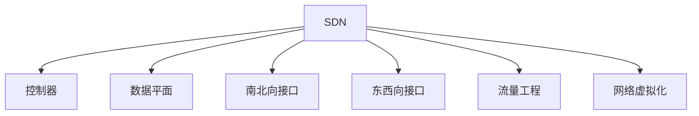

                 

# 软件定义网络（SDN）：网络架构的革新

## 1. 背景介绍

### 1.1 问题由来

在互联网时代，网络变得越来越复杂，传统的网络设备如路由器和交换机已经成为制约网络发展的瓶颈。它们由硬件和固件共同实现，控制决策和数据转发各自独立运行，导致网络配置和维护非常困难。因此，迫切需要一种新的网络架构来彻底变革这一现状。

### 1.2 问题核心关键点

SDN（Software Defined Networking）是一种将网络控制和数据转发分离的新型网络架构。通过将控制层面和数据转发层面解耦，可以使得网络管理员能够灵活地管理和配置网络，同时实现网络的自动化、优化和安全性。

SDN的核心思想是通过集中的控制器（Controller）来管理网络，而数据平面（Data Plane）则由转发设备（如交换机、路由器）负责处理数据。这种架构有助于提升网络灵活性和可管理性，同时也可以实现更高效的网络优化和故障恢复。

### 1.3 问题研究意义

SDN的出现，标志着网络架构从“静态配置”向“动态控制”的转变。它将网络的控制权从设备转移到软件层面，极大地提升了网络的运营效率和安全性，降低了运维成本，为网络智能化和自动化提供了坚实的基础。此外，SDN还支持弹性网络资源调度，适应日益增长的云计算和物联网需求。

## 2. 核心概念与联系

### 2.1 核心概念概述

为了更好地理解SDN的原理和架构，本节将介绍几个关键概念及其相互联系：

- SDN：软件定义网络，是一种将网络控制与数据转发分离的架构。
- 控制器（Controller）：SDN的核心组件，负责网络的控制决策，包括路由、策略、安全等。
- 数据平面（Data Plane）：SDN的转发设备，如交换机、路由器，负责数据包转发。
- 南北向接口：控制器与数据平面之间的通信接口，包括OpenFlow、NETCONF等标准协议。
- 东西向接口：控制器之间的通信接口，用于跨域和分布式控制。
- 流量工程（Traffic Engineering）：通过优化网络路径，实现流量负载均衡和性能最优。
- 网络虚拟化（Network Virtualization）：通过软件抽象技术，在物理网络之上构建多个逻辑网络，实现资源隔离和灵活配置。

这些核心概念通过Mermaid流程图来展示：



这个流程图展示了SDN的核心组件及其相互关系：

1. SDN通过控制器管理数据平面。
2. 控制器与数据平面之间通过南北向接口通信。
3. 控制器之间通过东西向接口实现跨域控制。
4. SDN支持流量工程和网络虚拟化等高级功能。

这些概念共同构成了SDN的基本框架，使得网络架构从静态配置转变为动态控制，提升了网络的灵活性和可管理性。

## 3. 核心算法原理 & 具体操作步骤

### 3.1 算法原理概述

SDN的原理主要分为三个部分：数据平面与控制平面的分离、控制器与数据平面的通信协议、以及控制器的控制策略。

- 数据平面与控制平面的分离：SDN将网络的控制决策和数据转发分离，使网络管理员能够灵活管理和配置网络。
- 控制器与数据平面的通信协议：SDN使用南北向接口（如OpenFlow）来实现控制器与数据平面的通信。
- 控制器的控制策略：控制器通过编程方式实现网络控制策略，如流量工程、安全策略、负载均衡等。

### 3.2 算法步骤详解

SDN的实现步骤主要包括以下几个关键环节：

**Step 1: 网络设备升级**
- 将现有的路由器和交换机升级为支持SDN的设备，如OpenFlow交换机。
- 配置设备的控制器和南北向接口。

**Step 2: 控制器安装**
- 选择合适的控制器软件，如ONOS、POX、OpenDaylight等。
- 在服务器上安装和配置控制器，连接至网络设备。

**Step 3: 定义网络拓扑**
- 使用控制器提供的图形化界面，定义网络拓扑结构，包括网络设备、链路、虚拟网络等。

**Step 4: 编写控制策略**
- 使用控制器提供的编程接口，编写控制策略，如路由、转发规则、安全策略等。
- 使用SDN编程语言（如POX语言）实现具体的控制逻辑。

**Step 5: 部署和测试**
- 将控制策略部署到控制器，并激活生效。
- 在网络中进行测试，确保网络设备能够正常转发数据，并响应控制器的指令。

**Step 6: 优化和调优**
- 根据测试结果，对控制策略进行优化和调优，保证网络的性能和稳定性。

### 3.3 算法优缺点

SDN具有以下优点：
1. 集中管理：控制器集中管理网络，使得网络配置和故障恢复更加灵活和高效。
2. 统一控制：控制器通过统一的编程接口实现控制策略，简化网络管理。
3. 开放标准：SDN采用开放标准协议（如OpenFlow），方便不同厂商设备互通。
4. 可扩展性：SDN支持网络虚拟化，能够在物理网络之上构建多个逻辑网络。

同时，SDN也存在一些局限性：
1. 初期成本高：升级设备、安装和配置控制器需要较高的初期投入。
2. 学习曲线陡：SDN涉及复杂的编程和配置，需要一定的学习曲线。
3. 安全性问题：SDN集中管理可能成为攻击目标，需要额外的安全措施。
4. 互操作性问题：不同厂商的控制器和设备可能存在兼容性问题。

尽管存在这些局限性，但SDN作为一种新兴的网络架构，其带来的灵活性、可管理性和高效性已经得到了业界的广泛认可。未来随着技术的不断成熟和标准的进一步完善，SDN必将在网络领域发挥更加重要的作用。

### 3.4 算法应用领域

SDN在多个领域得到了广泛应用，包括：

- 数据中心网络：通过集中控制，优化数据中心内部的流量分发，提升性能和能效。
- 互联网服务提供商（ISP）：实现网络的自动化和优化，提升服务质量和用户体验。
- 电信运营商：支持网络切片和5G等新型网络技术，提供更加灵活和定制化的服务。
- 企业网络：实现网络的集中管理和安全性控制，支持远程办公和云服务。
- 物联网：通过虚拟化技术，实现资源隔离和灵活配置，支持大规模物联网设备接入。

除了这些主要应用领域，SDN还在车联网、智能电网、智慧城市等新兴领域中发挥了重要作用，推动了这些领域的智能化和自动化进程。

## 4. 数学模型和公式 & 详细讲解 & 举例说明

### 4.1 数学模型构建

SDN的数学模型主要涉及以下几个部分：

- 网络拓扑模型：描述网络设备、链路、虚拟网络等要素之间的连接关系。
- 流量工程模型：优化网络路径，实现流量负载均衡和性能最优。
- 安全策略模型：检测和响应网络攻击，保护网络安全。

下面以流量工程为例，介绍SDN的数学模型构建。

### 4.2 公式推导过程

假设网络中有 $n$ 个节点和 $m$ 条链路，网络拓扑可以用图 $G=(N,E)$ 表示，其中 $N$ 是节点集合，$E$ 是链路集合。流量工程的目标是优化链路容量，使网络中每个节点都有相同的负载，即最小化总路径长度。

设每个节点的负载为 $L$，链路的容量为 $C$，则总路径长度 $L_{total}$ 为：

$$
L_{total} = \sum_{(i,j) \in E} \frac{L \times C_{(i,j)}}{C}
$$

其中 $C_{(i,j)}$ 表示节点 $i$ 和节点 $j$ 之间的链路容量。

为了最小化总路径长度，可以使用线性规划（Linear Programming）求解：

$$
\min_{C} \quad \sum_{(i,j) \in E} \frac{L \times C_{(i,j)}}{C}
$$

约束条件为：

$$
\begin{aligned}
    &\text{节点负载平衡：} \quad \sum_{(i,j) \in E_i} C_{(i,j)} = L, \quad \forall i \in N \\
    &\text{链路容量限制：} \quad C_{(i,j)} \geq 0, \quad \forall (i,j) \in E
\end{aligned}
$$

通过求解上述线性规划问题，可以找到最优的链路容量分配方案，实现流量工程的目标。

### 4.3 案例分析与讲解

以一个简单的网络拓扑为例，说明流量工程的计算过程。

假设网络中有3个节点和3条链路，节点之间连接关系如图1所示。设每个节点的负载为2，链路容量分别为3、5、4。


使用上述线性规划模型，可以求解出最优的链路容量分配方案：

- 节点1与节点2之间的链路容量为3。
- 节点1与节点3之间的链路容量为5。
- 节点2与节点3之间的链路容量为4。

最终的流量工程结果如图2所示。


通过流量工程，网络中的每个节点都有相同的负载，总路径长度也得到了优化。

## 5. 项目实践：代码实例和详细解释说明

### 5.1 开发环境搭建

在进行SDN项目实践前，我们需要准备好开发环境。以下是使用Python和Mininet进行SDN开发的环境配置流程：

1. 安装Anaconda：从官网下载并安装Anaconda，用于创建独立的Python环境。

2. 创建并激活虚拟环境：
```bash
conda create -n py2env python=2.7
conda activate py2env
```

3. 安装Mininet：从GitHub下载Mininet源码，编译并安装：
```bash
git clone https://github.com/mininet/mininet.git
cd mininet
make all
sudo make install
```

4. 安装SDN控制器：选择合适的SDN控制器，如ONOS、POX等。

5. 安装Python依赖：
```bash
pip install openvswitch-controller==2.1.3 pytopoflow==0.9.0
```

完成上述步骤后，即可在`py2env`环境中开始SDN项目开发。

### 5.2 源代码详细实现

下面我们以Mininet和SDN控制器为例，给出SDN项目开发的PyTorch代码实现。

首先，定义Mininet网络拓扑：

```python
from mininet.net import Mininet
from mininet.topo import Topo
from mininet.link import TCLink
from mininet.log import setLogLevel

setLogLevel('info')

topo = Topo()

d1 = topo.addSwitch('s1')
d2 = topo.addSwitch('s2')
h1 = topo.addHost('h1', ip='192.168.1.1', defaultRoute='1', mac='00:01:02:03:04:05')
h2 = topo.addHost('h2', ip='192.168.1.2', defaultRoute='2', mac='00:01:02:03:04:06')
topo.addLink(h1, d1)
topo.addLink(h2, d2)
topo.addLink(d1, d2)
```

然后，定义SDN控制器：

```python
from mininet.pof import OpenFlowController
from mininet.pof import OpenFlowSwitch

# 添加控制器到Mininet网络
controller = OpenFlowController('controller')
topo.addController(controller)

# 设置控制器的默认交换机
topo.addSwitch('s1', controller=controller)
topo.addSwitch('s2', controller=controller)
```

最后，启动网络并运行SDN控制器：

```python
net = Mininet(topo=topo, link=TCLink, controller=controller)
net.start()
controller.start()
topo.addSwitch('s1', controller=controller)
topo.addSwitch('s2', controller=controller)
net.stop()
```

### 5.3 代码解读与分析

让我们再详细解读一下关键代码的实现细节：

**Mininet定义网络拓扑**：
- 使用`Topo`类创建网络拓扑，添加多个节点和链路。
- 设置节点的IP地址、默认路由和MAC地址。
- 使用`addLink`方法连接节点和交换机。

**SDN控制器**：
- 使用`OpenFlowController`类创建控制器，并将其添加到网络中。
- 设置控制器的默认交换机。
- 启动网络和控制器。

**启动SDN控制器**：
- 使用`Mininet`类创建Mininet网络实例。
- 使用`start`方法启动网络和控制器。
- 设置控制器的默认交换机。
- 使用`stop`方法停止网络和控制器。

通过这些代码，可以构建一个简单的SDN网络，并运行SDN控制器。在实际应用中，还需要进一步优化控制器的控制逻辑，实现更复杂的控制策略，如路由、流量工程、安全等。

## 6. 实际应用场景

### 6.1 数据中心网络

数据中心网络是SDN的重要应用场景之一。传统的数据中心网络由多个服务器组成，通过网关和交换机进行通信。这种架构存在配置复杂、扩展困难、故障恢复缓慢等问题。通过SDN技术，可以实现数据中心内部的集中控制和优化。

在数据中心内部，使用SDN控制器集中管理交换机，实现负载均衡、带宽控制、流量工程等高级功能。通过控制器的编程接口，可以实现自动化的配置和故障恢复，提升网络效率和可管理性。

### 6.2 互联网服务提供商（ISP）

ISP的网络结构非常复杂，由多个网络节点组成。传统的网络管理方式依赖手动配置，容易出现错误和故障。通过SDN技术，可以实现ISP网络的高效管理。

ISP可以在SDN控制器的帮助下，实现网络资源的集中控制和优化。通过控制器的流量工程功能，可以自动优化网络路径，实现流量负载均衡和性能最优。通过控制器的安全策略功能，可以检测和响应网络攻击，保护网络安全。

### 6.3 电信运营商

电信运营商的网络结构也相当复杂，由多个网络节点组成。传统的网络管理方式依赖手动配置，容易出现错误和故障。通过SDN技术，可以实现电信运营商网络的高效管理。

电信运营商可以在SDN控制器的帮助下，实现网络资源的集中控制和优化。通过控制器的流量工程功能，可以自动优化网络路径，实现流量负载均衡和性能最优。通过控制器的安全策略功能，可以检测和响应网络攻击，保护网络安全。

### 6.4 企业网络

企业网络的结构也相当复杂，由多个网络节点组成。传统的网络管理方式依赖手动配置，容易出现错误和故障。通过SDN技术，可以实现企业网络的高效管理。

企业可以在SDN控制器的帮助下，实现网络资源的集中控制和优化。通过控制器的流量工程功能，可以自动优化网络路径，实现流量负载均衡和性能最优。通过控制器的安全策略功能，可以检测和响应网络攻击，保护网络安全。

### 6.5 物联网

物联网设备众多，网络结构复杂，管理难度大。通过SDN技术，可以实现物联网设备的高效管理。

在物联网中，可以使用SDN控制器集中管理网络设备，实现资源隔离和灵活配置。通过控制器的编程接口，可以实现自动化的配置和故障恢复，提升网络效率和可管理性。

## 7. 工具和资源推荐

### 7.1 学习资源推荐

为了帮助开发者系统掌握SDN的理论基础和实践技巧，这里推荐一些优质的学习资源：

1. 《软件定义网络：原理与实践》系列博文：由SDN专家撰写，深入浅出地介绍了SDN原理、控制器和数据平面的通信协议等前沿话题。

2. SDN公开课：OpenDaylight等SDN厂商提供的公开课程，涵盖SDN的基本概念和实际应用。

3. SDN书籍：如《软件定义网络：原理、设计与实现》等书籍，详细介绍了SDN的原理、技术和应用。

4. SDN文档：ONOS、POX等主流SDN控制器提供的官方文档，包括控制器和网络设备的配置、编程接口等。

5. SDN社区：如ONOS社区、POX社区等，可以与SDN开发者交流学习和分享经验。

通过对这些资源的学习实践，相信你一定能够快速掌握SDN的精髓，并用于解决实际的NLP问题。

### 7.2 开发工具推荐

SDN的开发离不开优秀的工具支持。以下是几款用于SDN开发的工具：

1. Mininet：一个开源的SDN模拟器，用于快速搭建和测试SDN网络。

2. OpenDaylight：一个开源的SDN控制器，支持多种控制器和网络设备。

3. ONOS：一个开源的SDN控制器，支持多种控制器和网络设备。

4. POX：一个基于Python的SDN控制器，提供灵活的编程接口和丰富的插件。

5. SDN-Controller：一个开源的SDN控制器，支持多种控制器和网络设备。

6. SDN-Simulator：一个开源的SDN模拟器，用于测试和评估SDN算法。

合理利用这些工具，可以显著提升SDN开发的效率，加快创新迭代的步伐。

### 7.3 相关论文推荐

SDN的发展源于学界的持续研究。以下是几篇奠基性的相关论文，推荐阅读：

1. On the Origins of SDN：一篇综述论文，介绍了SDN的起源和发展历程，为SDN技术提供了理论基础。

2. SDN综述：一篇综述论文，介绍了SDN的核心概念、架构和应用，为SDN技术提供了全面的视角。

3. SDN控制器：一篇综述论文，介绍了SDN控制器的实现机制和控制策略，为SDN技术提供了深入的见解。

4. SDN算法：一篇综述论文，介绍了SDN中的流量工程、安全策略等算法，为SDN技术提供了算法的支持。

这些论文代表了大数据流计算的发展脉络。通过学习这些前沿成果，可以帮助研究者把握SDN技术的演进方向，激发更多的创新灵感。

## 8. 总结：未来发展趋势与挑战

### 8.1 总结

本文对SDN（软件定义网络）进行了全面系统的介绍。首先阐述了SDN的背景和意义，明确了SDN在网络管理中的重要作用。其次，从原理到实践，详细讲解了SDN的数学模型、核心算法和操作步骤，给出了SDN项目开发的完整代码实例。同时，本文还广泛探讨了SDN在数据中心网络、互联网服务提供商、电信运营商等多个领域的应用前景，展示了SDN范式的巨大潜力。此外，本文精选了SDN技术的各类学习资源，力求为读者提供全方位的技术指引。

通过本文的系统梳理，可以看到，SDN的出现，标志着网络架构从“静态配置”向“动态控制”的转变。它将网络的控制权从设备转移到软件层面，极大地提升了网络的运营效率和安全性，降低了运维成本，为网络智能化和自动化提供了坚实的基础。

### 8.2 未来发展趋势

展望未来，SDN技术将呈现以下几个发展趋势：

1. 多域协同：SDN将实现跨域、跨运营商的协同管理，提升网络的互联互通能力。
2. 弹性资源管理：SDN将支持更灵活的资源调度，实现动态网络资源的优化配置。
3. 智能化管理：SDN将引入人工智能技术，实现更智能化的网络控制和管理。
4. 安全与隐私：SDN将加强网络安全防护，保障数据隐私和安全性。
5. 生态系统：SDN将形成一个开放的生态系统，实现不同厂商设备间的互通和协作。

以上趋势凸显了SDN技术的广阔前景。这些方向的探索发展，必将进一步提升SDN网络的灵活性、可管理性和安全性，为网络智能化和自动化提供更强大的技术支持。

### 8.3 面临的挑战

尽管SDN技术已经取得了瞩目成就，但在迈向更加智能化、普适化应用的过程中，它仍面临着诸多挑战：

1. 初期成本高：升级设备、安装和配置控制器需要较高的初期投入。
2. 学习曲线陡：SDN涉及复杂的编程和配置，需要一定的学习曲线。
3. 安全性问题：SDN集中管理可能成为攻击目标，需要额外的安全措施。
4. 互操作性问题：不同厂商的控制器和设备可能存在兼容性问题。

尽管存在这些挑战，但SDN作为一种新兴的网络架构，其带来的灵活性、可管理性和高效性已经得到了业界的广泛认可。未来随着技术的不断成熟和标准的进一步完善，SDN必将在网络领域发挥更加重要的作用。

### 8.4 研究展望

面对SDN所面临的种种挑战，未来的研究需要在以下几个方面寻求新的突破：

1. 探索更高效的流量工程算法：开发更加高效的算法，优化网络路径，提升性能和效率。
2. 研究更智能化的控制策略：引入机器学习和人工智能技术，实现更智能化的网络控制和管理。
3. 开发更安全的SDN系统：加强网络安全防护，保障数据隐私和安全性。
4. 支持更灵活的资源调度：实现更灵活的网络资源调度，支持多种业务场景。
5. 促进跨域和跨运营商的协同：实现跨域、跨运营商的协同管理，提升网络的互联互通能力。

这些研究方向的探索，必将引领SDN技术迈向更高的台阶，为构建安全、可靠、可解释、可控的智能网络提供更强大的技术支持。面向未来，SDN技术还需要与其他技术进行更深入的融合，如人工智能、区块链等，多路径协同发力，共同推动网络智能化和自动化系统的进步。只有勇于创新、敢于突破，才能不断拓展SDN网络的边界，让网络技术更好地服务于人类社会。

## 9. 附录：常见问题与解答

**Q1：SDN是否适用于所有网络场景？**

A: SDN适用于大多数网络场景，包括数据中心网络、互联网服务提供商、电信运营商、企业网络、物联网等。但对于某些特殊场景，如高吞吐量的网络环境，SDN可能存在性能瓶颈，需要综合考虑场景特点和需求。

**Q2：SDN控制器是否需要部署在云平台？**

A: SDN控制器可以部署在本地服务器或云平台上，取决于具体的部署需求和成本。在云平台部署SDN控制器，可以提供更高的可扩展性和灵活性，但需要考虑云平台的安全性和性能。

**Q3：SDN网络的安全性如何保障？**

A: SDN网络的安全性保障需要从多个方面入手，包括数据加密、访问控制、入侵检测等。控制器可以通过安全策略、加密算法等措施，保障数据和控制消息的安全。

**Q4：SDN网络如何应对大规模负载？**

A: SDN网络可以通过流量工程、负载均衡等技术，应对大规模负载。通过优化网络路径和资源调度，可以避免网络拥塞和性能下降。

**Q5：SDN网络如何应对网络故障？**

A: SDN网络可以通过故障恢复机制，快速定位和处理网络故障。控制器可以动态调整网络资源，实现快速故障恢复和网络重构。

通过这些问题的解答，可以看出SDN技术在实际应用中的各种场景和挑战，了解如何在实际环境中使用和部署SDN网络，确保网络的稳定性和可靠性。

---

作者：禅与计算机程序设计艺术 / Zen and the Art of Computer Programming

