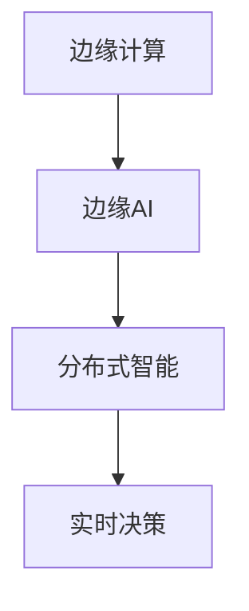

                 

# 边缘AI：5G时代的分布式智能

## 1. 背景介绍

随着5G时代的到来，边缘计算、物联网、移动通信技术的迅猛发展，边缘AI（Edge AI）成为人工智能应用的前沿和热点。边缘AI不仅能够降低数据传输成本，提高计算效率，还能够增强实时性、隐私保护等优势，在医疗、交通、制造、智慧城市等领域展现出广阔的应用前景。本文将从边缘AI的概念、核心技术、实际应用、未来展望等几个方面进行详细探讨。

## 2. 核心概念与联系

### 2.1 核心概念概述

- **边缘计算**：指的是在数据源附近进行的分布式计算和存储，靠近数据源的应用程序可以直接处理数据，而不需要将数据传输到远程数据中心。
- **边缘AI**：利用边缘计算对AI模型进行推理和训练，从而在数据源附近实现智能决策和数据处理。
- **分布式智能**：指多个AI模型在分布式环境中协同工作，通过通信、协同和集成，实现更高效、更灵活的智能应用。

这些核心概念之间的联系紧密，形成一个完整的生态系统，通过边缘计算实现数据的实时处理和分析，边缘AI在边缘节点上进行模型推理和优化，而分布式智能则推动了边缘节点之间的协同和集成，使得边缘AI能够更灵活地适应多样化的应用场景。

### 2.2 核心概念原理和架构的 Mermaid 流程图



## 3. 核心算法原理 & 具体操作步骤

### 3.1 算法原理概述

边缘AI的实现基于分布式机器学习和深度学习算法。它通常包括以下几个关键步骤：

1. **数据收集与预处理**：从传感器、监控设备等源头收集数据，并对数据进行清洗、转换和标准化。
2. **模型训练与推理**：在边缘节点上对AI模型进行训练和推理，通常采用轻量级模型，如TensorFlow Lite、PyTorch Mobile等，确保模型能够快速运行。
3. **模型优化与更新**：通过模型优化技术（如模型剪枝、量化、蒸馏等）和模型更新策略，提高模型的效率和性能。
4. **边缘节点通信与协同**：通过消息队列、事件驱动等方式，实现边缘节点之间的通信与协作，共享数据和模型。

### 3.2 算法步骤详解

**Step 1: 数据收集与预处理**
- 收集数据源（如传感器、监控设备等）的数据，并传输到边缘节点。
- 在边缘节点上对数据进行预处理，包括去噪、归一化、降维等。

**Step 2: 模型训练与推理**
- 使用轻量级深度学习框架在边缘节点上训练模型。
- 在边缘节点上运行模型，进行推理和决策。

**Step 3: 模型优化与更新**
- 对模型进行剪枝、量化、蒸馏等优化操作，减小模型规模。
- 使用联邦学习等方法，定期在边缘节点上更新模型参数。

**Step 4: 边缘节点通信与协同**
- 通过消息队列、事件驱动等方式，实现边缘节点之间的数据和模型共享。
- 通过协同优化算法，实现边缘节点的联合决策。

### 3.3 算法优缺点

边缘AI的优点包括：
- 降低网络带宽和延迟，提高实时性。
- 减少数据传输成本，保护用户隐私。
- 支持本地计算和决策，提高可靠性。

其缺点包括：
- 边缘节点计算能力有限，可能无法处理复杂任务。
- 数据分散在各个节点，难以进行全局优化。
- 需要考虑边缘节点的协同和集成，增加系统复杂性。

### 3.4 算法应用领域

边缘AI已经在医疗、交通、制造、智慧城市等领域得到了广泛应用。以下是一些典型的应用场景：

- **医疗领域**：通过边缘AI实现实时病患监控、远程诊断、药物推荐等。
- **交通领域**：在交通管理中心，利用边缘AI实现交通流量预测、事故预警、自动驾驶决策等。
- **制造领域**：在工厂中，边缘AI用于质量检测、设备维护、生产优化等。
- **智慧城市**：利用边缘AI实现环境监测、城市管理、智能安防等。

## 4. 数学模型和公式 & 详细讲解 & 举例说明

### 4.1 数学模型构建

假设在边缘节点 $i$ 上训练的模型为 $M_i$，输入为 $x$，输出为 $y$。在边缘节点 $i$ 上进行的模型推理可以表示为：

$$ y_i = M_i(x_i) $$

其中 $x_i$ 是边缘节点 $i$ 上的输入数据，$y_i$ 是对应的输出结果。

### 4.2 公式推导过程

以图像分类为例，假设输入为 $x_i$，输出为 $y_i$，在边缘节点 $i$ 上进行模型训练的损失函数可以表示为：

$$ L_i(y_i, x_i) = \sum_{j=1}^{n} (y_{ij} - \hat{y}_{ij})^2 $$

其中 $y_{ij}$ 是真实标签，$\hat{y}_{ij}$ 是模型预测结果，$n$ 是样本数量。

### 4.3 案例分析与讲解

以交通流量预测为例，假设在交通管理中心有多个边缘节点，每个节点上训练的模型为 $M_i$，输入为 $x_i$（如温度、湿度、道路状况等），输出为 $y_i$（交通流量预测结果）。通过对多个边缘节点的预测结果进行加权平均，可以得到最终的预测结果：

$$ y_{total} = \sum_{i=1}^{n} w_i y_i $$

其中 $w_i$ 是权重，用于平衡不同边缘节点的贡献。

## 5. 项目实践：代码实例和详细解释说明

### 5.1 开发环境搭建

为了进行边缘AI的开发和实验，需要搭建以下开发环境：

1. 安装Python和相关依赖库，如TensorFlow Lite、PyTorch Mobile等。
2. 搭建边缘计算平台，如AWS Greengrass、Google Cloud IoT Core等。
3. 安装边缘计算所需的硬件设备，如边缘计算设备、传感器、摄像头等。

### 5.2 源代码详细实现

以下是一个简单的边缘AI应用示例，使用TensorFlow Lite进行图像分类：

```python
import tensorflow as tf
import tensorflow_lite as tflite

# 加载模型
interpreter = tflite.Interpreter(model_path='model.tflite')

# 获取输入输出信息
input_details = interpreter.get_input_details()
output_details = interpreter.get_output_details()

# 准备输入数据
input_data = tf.convert_to_tensor(np.array([image_data]), dtype=tf.float32)
input_data = input_data[input_details[0]['index']]

# 进行推理
interpreter.set_tensor(input_details[0]['index'], input_data)
interpreter.invoke()

# 获取输出结果
output_data = interpreter.get_tensor(output_details[0]['index'])
```

### 5.3 代码解读与分析

- `tf.convert_to_tensor`：将NumPy数组转换为TensorFlow张量。
- `interpreter.set_tensor`：将张量数据设置到模型的输入端口。
- `interpreter.invoke`：执行模型的推理操作。
- `interpreter.get_tensor`：获取模型的输出结果。

## 6. 实际应用场景

### 6.1 医疗领域

在医疗领域，边缘AI可以应用于实时病患监控、远程诊断和药物推荐等。例如，在远程医疗中心，边缘AI可以对患者的生命体征进行实时监测，并提供个性化的治疗建议。

### 6.2 交通领域

在交通领域，边缘AI可以用于交通流量预测、事故预警和自动驾驶决策等。例如，在交通管理中心，边缘AI可以对交通流量进行实时预测，并根据预测结果调整交通信号灯。

### 6.3 制造领域

在制造领域，边缘AI可以用于质量检测、设备维护和生产优化等。例如，在工厂中，边缘AI可以对生产设备进行实时监测和维护，预测设备故障并及时通知维修人员。

### 6.4 智慧城市

在智慧城市中，边缘AI可以用于环境监测、城市管理和智能安防等。例如，在城市中，边缘AI可以对环境数据进行实时监测和分析，提供预警信息并优化城市管理。

## 7. 工具和资源推荐

### 7.1 学习资源推荐

- **TensorFlow Lite官方文档**：详细介绍了如何使用TensorFlow Lite进行边缘AI开发。
- **PyTorch Mobile官方文档**：介绍了如何使用PyTorch Mobile在边缘设备上进行深度学习模型推理。
- **Edge AI课程**：由Coursera等平台提供的边缘AI相关课程，涵盖边缘计算、深度学习、分布式系统等内容。

### 7.2 开发工具推荐

- **AWS Greengrass**：提供了完整的边缘计算解决方案，支持TensorFlow Lite、PyTorch Mobile等轻量级框架。
- **Google Cloud IoT Core**：提供了边缘设备管理、数据收集和分析等能力，支持TensorFlow Lite模型部署。

### 7.3 相关论文推荐

- **"Edge Computing and Fog Computing: A Survey"**：由IEEE给出的边缘计算综述，详细介绍了边缘计算的定义、架构和应用。
- **"Federated Learning: Concepts and Applications"**：由IEEE给出的联邦学习综述，详细介绍了联邦学习的定义、算法和应用。

## 8. 总结：未来发展趋势与挑战

### 8.1 研究成果总结

边缘AI技术已经在多个领域取得了显著的成果，如医疗、交通、制造、智慧城市等。通过边缘计算和分布式智能，实现了实时性、低延迟、高可靠性和数据隐私保护的AI应用。

### 8.2 未来发展趋势

未来，边缘AI技术将呈现以下几个发展趋势：

1. **多模态融合**：边缘AI将更加注重多模态数据的融合，如将传感器数据、视频数据、音频数据等进行联合分析，提高决策的准确性和全面性。
2. **联邦学习**：联邦学习将更加广泛地应用于边缘AI，实现边缘节点之间的协同学习和模型更新，提高整体系统的性能。
3. **边缘AI生态系统**：边缘AI将逐渐形成一个完整的生态系统，包括硬件设备、操作系统、中间件、开发工具等，支持更多样化的应用场景。
4. **智能边缘设备**：边缘设备将更加智能化，集成了更多的传感器和计算能力，实现更加复杂和高效的计算任务。

### 8.3 面临的挑战

边缘AI技术虽然取得了一定的进展，但仍面临以下挑战：

1. **硬件资源限制**：边缘设备的计算能力和存储资源有限，难以处理复杂任务。
2. **数据安全隐私**：数据分散在各个边缘节点，如何保护数据隐私和安全是一个重要问题。
3. **模型优化**：如何在有限的资源下进行高效的模型优化，提高边缘AI的性能和可靠性。
4. **标准和协议**：缺乏统一的标准和协议，难以实现不同设备和系统之间的互操作性。

### 8.4 研究展望

未来的研究可以从以下几个方面进行：

1. **模型压缩与优化**：探索更加高效的模型压缩技术，如剪枝、量化、蒸馏等，减小模型规模。
2. **联邦学习优化**：研究联邦学习算法和机制，提高边缘节点之间的协同学习效率。
3. **边缘AI生态系统**：构建完整的边缘AI生态系统，包括硬件、软件、协议等，实现系统级的优化和集成。
4. **智能边缘设备**：开发更智能、更灵活的边缘设备，支持更多的应用场景和功能。

## 9. 附录：常见问题与解答

**Q1: 边缘AI与云AI有什么区别？**

A: 边缘AI和云AI的主要区别在于数据和计算的位置。云AI的数据存储和计算都在云端，而边缘AI的数据和计算都在边缘节点上。边缘AI可以降低数据传输成本和延迟，提高实时性，但需要更多的硬件资源和设备。

**Q2: 边缘AI在实际应用中会遇到哪些问题？**

A: 边缘AI在实际应用中可能会遇到以下问题：
- 数据隐私和安全问题：数据在边缘节点上存储和处理，需要保护数据隐私和安全。
- 计算资源限制：边缘设备的计算能力和存储资源有限，难以处理复杂任务。
- 模型优化问题：如何在有限的资源下进行高效的模型优化，提高边缘AI的性能和可靠性。

**Q3: 如何选择合适的边缘计算平台？**

A: 选择合适的边缘计算平台需要考虑以下因素：
- 平台支持的设备和硬件资源：平台需要支持多种设备和硬件资源，以适配不同应用场景。
- 平台的易用性和扩展性：平台需要易于使用和扩展，支持灵活的部署和管理。
- 平台的安全性和可靠性：平台需要具备较高的安全性和可靠性，保证数据和系统的安全。

**Q4: 边缘AI技术在医疗领域有哪些应用？**

A: 边缘AI技术在医疗领域可以应用于以下应用：
- 实时病患监控：通过传感器和监控设备，实时监测病患的生命体征，提供个性化的治疗建议。
- 远程诊断：利用边缘AI对远程医疗影像和数据进行分析，提供准确的诊断结果。
- 药物推荐：根据病患的病情和历史数据，推荐最适合的药物和治疗方案。

**Q5: 如何保护边缘AI中的数据隐私和安全？**

A: 保护边缘AI中的数据隐私和安全需要采取以下措施：
- 数据加密：对数据进行加密，防止数据泄露和篡改。
- 访问控制：设置访问控制机制，限制对数据的访问权限。
- 数据匿名化：对数据进行匿名化处理，防止数据泄露个人隐私。

---

作者：禅与计算机程序设计艺术 / Zen and the Art of Computer Programming

