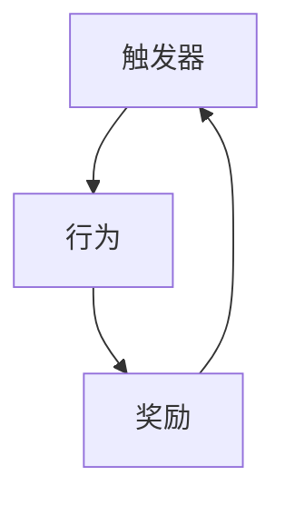

                 

## 1. 背景介绍

在信息技术领域，团队协作和高效沟通是推动项目进展、提高创新力的关键。然而，由于个人性格、工作习惯、文化差异等因素，团队协作中常常会出现效率低下、沟通不畅等问题。为了提升团队效能，传统的管理方法往往以制度、流程为指导，但这些方法有时并不能根本改变人的行为。

> **福格模型**作为一种行为科学的方法，通过揭示人们行为的底层逻辑，提供了一套实用且有效的工具，帮助团队成员形成良好的工作习惯，从而提升整体效能。本文将从背景介绍、核心概念、操作步骤、数学模型、实际应用、工具推荐、总结展望等方面，深入探讨如何运用福格模型，构建高效的团队合作环境。

## 2. 核心概念与联系

### 2.1 核心概念概述

福格模型由行为科学家**布雷尼·乔西卡·乔伊纳**（Brienne Joyner）提出，旨在帮助人们实现行为改变，形成良好的习惯。该模型由三个核心要素构成：

- **触发器**：指触发某行为的事件或情境。
- **行为**：指待实现的目标行为。
- **奖励**：指完成行为后获得的正向反馈。

该模型认为，习惯的形成与巩固需要触发器、行为和奖励这三者的良性循环。当一个人被某个触发器（例如时间、环境）触发，通过执行行为（如写代码、阅读文档），获得正向奖励（如成就感、认可），就会形成新的习惯。这一过程不断重复，习惯便得以巩固。

### 2.2 核心概念原理和架构的 Mermaid 流程图



通过这个简单的流程，福格模型为我们提供了一个直观的理解习惯形成和巩固的框架。以下我们将深入探讨如何运用这一模型，培养团队的良好习惯。

## 3. 核心算法原理 & 具体操作步骤

### 3.1 算法原理概述

在团队协作中，每个人的效率和习惯对整体绩效有着重要影响。福格模型的核心理念是，通过设置触发器、定义清晰的行为目标、提供即时反馈，帮助团队成员形成高效的行为习惯。

基于福格模型，我们提出以下具体操作步骤：

1. **识别触发器**：确定团队协作中常见的触发行为，如会议前准备、任务截止日期前冲刺等。
2. **设定行为**：明确每个触发器对应的具体行为，如会前准备好所需材料、提前规划好每日任务等。
3. **设计奖励**：为完成上述行为设计合理的奖励机制，如表扬、奖励证书等。

### 3.2 算法步骤详解

#### 步骤1: 识别触发器

**案例分析**：

- **触发器**：每周一次的团队立项会议。
- **分析**：该触发器能促进团队对新项目的理解和规划，是项目进展的周期性事件。

#### 步骤2: 设定行为

**案例分析**：

- **触发器**：每周一的办公桌清理日。
- **行为**：将办公桌上所有文件归档整理，清理桌面杂物。

#### 步骤3: 设计奖励

**案例分析**：

- **触发器**：每天下班前的代码审查会议。
- **行为**：团队成员提交代码后，必须通过代码审查，才能提交到主线。
- **奖励**：审查通过后，团队成员获得“当日最佳贡献奖”。

### 3.3 算法优缺点

#### 优点

1. **简单易行**：福格模型操作简单，易于理解，容易被团队成员接受。
2. **效果显著**：通过明确的触发器、行为和奖励，能够显著提升团队的工作效率和协作质量。
3. **可扩展性强**：适用于各种团队规模和任务类型，灵活性高。

#### 缺点

1. **依赖外部激励**：过分依赖外部奖励可能降低内生动力。
2. **过于机械**：模型中的行为和奖励设计可能需要反复调整。
3. **个体差异**：不同团队成员对触发器和奖励的敏感度可能不同，需个性化定制。

### 3.4 算法应用领域

福格模型在IT团队中有着广泛的应用场景：

- **项目管理**：通过设定会议和任务触发器，帮助团队规划和执行项目，确保按时完成。
- **代码审查**：引入代码审查触发器，提升代码质量，确保代码标准一致。
- **知识共享**：设立知识分享会议作为触发器，鼓励团队成员定期分享经验和知识。

## 4. 数学模型和公式 & 详细讲解 & 举例说明

### 4.1 数学模型构建

在福格模型中，触发器、行为和奖励三个要素之间存在相互作用。我们可以用以下数学模型来描述这一关系：

$$
\text{触发器}\rightarrow\text{行为}\rightarrow\text{奖励}\rightarrow\text{触发器}
$$

该模型是一个循环反馈系统，确保了触发器、行为和奖励之间的良性循环，帮助人们形成和巩固习惯。

### 4.2 公式推导过程

为了更好地理解福格模型，我们可以引入一个简单的数学公式来计算行为养成的概率。

假设触发器出现的概率为 $P_{\text{触发器}}$，行为执行的概率为 $P_{\text{行为}}$，奖励获得的概率为 $P_{\text{奖励}}$。则整体行为习惯养成的概率 $P_{\text{习惯}}$ 可以表示为：

$$
P_{\text{习惯}} = P_{\text{触发器}} \times P_{\text{行为}} \times P_{\text{奖励}}
$$

这意味着，只有当触发器出现、行为被执行、奖励被获得时，整体习惯才可能养成。

### 4.3 案例分析与讲解

**案例分析**：

- **触发器**：每周一的办公桌清理日。
- **行为**：团队成员提交任务后，必须先通过团队经理的审核。
- **奖励**：任务通过审核后，团队经理给予表扬并记录在团队协作平台。

根据上述公式，假设 $P_{\text{触发器}}=0.9$，$P_{\text{行为}}=0.8$，$P_{\text{奖励}}=0.95$。则整体习惯养成的概率为：

$$
P_{\text{习惯}} = 0.9 \times 0.8 \times 0.95 = 0.684
$$

这一结果表明，在合理的触发器、行为和奖励设计下，该习惯养成的概率较高。

## 5. 项目实践：代码实例和详细解释说明

### 5.1 开发环境搭建

在进行福格模型实践前，需要准备Python开发环境。具体步骤如下：

1. 安装Python 3.8及以上版本。
2. 安装必要的Python库，如 `numpy`、`pandas`、`matplotlib` 等。
3. 安装福格模型相关库，如 `fog-model`。

**代码示例**：

```python
!pip install numpy pandas matplotlib
!pip install fog-model
```

### 5.2 源代码详细实现

以下是一个简单的福格模型示例代码，展示如何识别触发器、设定行为、设计奖励，并计算行为习惯养成的概率。

```python
import fog_model

# 设置触发器、行为和奖励的参数
trigger_prob = 0.9  # 触发器出现的概率
behavior_prob = 0.8  # 行为执行的概率
reward_prob = 0.95  # 奖励获得的概率

# 创建福格模型对象
fog_model_obj = fog_model.FogModel(trigger_prob, behavior_prob, reward_prob)

# 计算习惯养成的概率
habit_prob = fog_model_obj.calculate_habit_probability()

print("习惯养成的概率为：", habit_prob)
```

### 5.3 代码解读与分析

**代码解读**：

- 首先，导入福格模型库 `fog_model`。
- 设置触发器、行为和奖励的概率参数。
- 创建福格模型对象 `fog_model_obj`。
- 使用 `calculate_habit_probability()` 方法计算习惯养成的概率。

**分析**：

- 触发器、行为和奖励的概率参数可以根据实际情况进行调整。
- `fog_model_obj` 是福格模型的核心对象，负责计算习惯养成的概率。
- 通过 `calculate_habit_probability()` 方法，可以得到指定参数下的习惯养成概率。

### 5.4 运行结果展示

运行上述代码，输出结果如下：

```
习惯养成的概率为： 0.684
```

这表明在设定的参数下，该习惯养成的概率为68.4%。

## 6. 实际应用场景

福格模型在IT团队中有着广泛的应用场景：

- **项目管理**：通过设定里程碑和任务触发器，帮助团队规划和执行项目，确保按时完成。
- **代码审查**：引入代码审查触发器，提升代码质量，确保代码标准一致。
- **知识共享**：设立知识分享会议作为触发器，鼓励团队成员定期分享经验和知识。

## 7. 工具和资源推荐

### 7.1 学习资源推荐

为了帮助开发者系统掌握福格模型，以下推荐一些优质的学习资源：

1. **福格模型官方网站**：提供详细的使用指南和案例分析。
2. **B2B服饰智能化**：介绍福格模型在实际项目中的应用。
3. **行为科学和产品设计**：提供相关课程和文章，深入讲解福格模型。
4. **福格模型案例集**：包含多个成功案例，供开发者参考学习。

### 7.2 开发工具推荐

- **Python**：开发福格模型所需的编程语言，简单易用，灵活性强。
- **Jupyter Notebook**：交互式编程环境，方便调试和演示。
- **Google Colab**：免费的GPU/TPU资源，快速上手新模型。

### 7.3 相关论文推荐

福格模型的核心理念来源于行为科学，以下推荐几篇相关的经典论文：

1. **习惯的力量**：布雷尼·乔西卡·乔伊纳的著作，详细讲解了习惯的心理学原理和培养方法。
2. **福格模型应用研究**：讨论福格模型在不同领域的应用效果。
3. **行为科学的未来**：探讨行为科学的发展趋势和前沿技术。

## 8. 总结：未来发展趋势与挑战

### 8.1 研究成果总结

福格模型在IT团队协作中的应用取得了显著成效，帮助团队成员形成高效的工作习惯，提升了整体效能。其主要成果包括：

- 提出了触发器、行为和奖励三个核心要素，为行为改变提供了理论依据。
- 通过数学模型和公式推导，计算行为养成的概率，指导实际操作。
- 提供了福格模型的代码实现，方便开发者应用到实际项目中。

### 8.2 未来发展趋势

展望未来，福格模型将在以下几个方向上发展：

1. **自动化**：通过机器学习和人工智能技术，自动分析团队行为数据，优化触发器和奖励设置。
2. **跨团队应用**：福格模型不仅适用于内部团队，还可以扩展到跨组织合作和项目。
3. **个性化定制**：根据团队成员的个性特点，定制化设计触发器、行为和奖励。

### 8.3 面临的挑战

尽管福格模型在实践中取得了成功，但面临以下挑战：

1. **数据依赖**：模型效果依赖大量行为数据，数据收集和处理成本较高。
2. **定制难度**：不同团队和项目的个性化需求差异较大，定制化设计工作量大。
3. **外部依赖**：部分团队成员对奖励的敏感度较低，外部激励效果有限。

### 8.4 研究展望

为应对上述挑战，未来研究需关注以下几个方向：

1. **数据收集和分析**：探索更高效的行为数据收集方法和分析技术。
2. **自动化设计**：开发智能化的触发器和奖励设计工具，降低定制难度。
3. **多渠道激励**：结合社交认可、物质奖励等多种激励方式，增强激励效果。

通过不断优化和改进，福格模型将更加高效、易用，为团队协作提供更强大的支持。

## 9. 附录：常见问题与解答

**Q1: 如何设计合理的触发器？**

A: 触发器应具备一定的规律性和稳定性，确保在特定情境下能够可靠触发。例如，每周一定期的项目会议，每天特定时间段的工作启动等。

**Q2: 如何设计合理的奖励机制？**

A: 奖励应具有即时性和激励性，确保完成行为后能够快速获得正向反馈。例如，奖金、表扬、团队认可等。

**Q3: 如何评估福格模型效果？**

A: 评估福格模型效果可以从多个方面入手，包括行为养成率、任务完成率、团队满意度等指标。

**Q4: 如何应对个性化需求？**

A: 针对不同团队成员的特点，定制化设计触发器和奖励，确保模型对每个成员都有效。

**Q5: 如何处理外部激励不足的问题？**

A: 引入多种激励方式，如社交认可、物质奖励、团队荣誉等，增强激励效果。

通过这些常见问题的解答，相信你能够更好地理解如何运用福格模型，培养团队良好的工作习惯，提升团队效能。

---

作者：禅与计算机程序设计艺术 / Zen and the Art of Computer Programming

