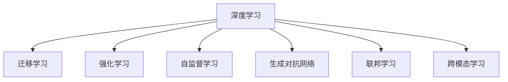

                 

# 进化时代：人工智能的未来

## 1. 背景介绍

### 1.1 问题由来

随着人工智能技术的快速发展，人工智能在各个领域中的应用已经取得了显著的进展。从自动驾驶、语音识别、到图像处理、医疗诊断，AI技术正在改变我们的生活和工作方式。然而，随着技术的不断进步，人工智能的未来发展也面临着新的挑战。本文旨在探讨人工智能的进化之路，分析其未来发展趋势，并对挑战进行深入思考。

### 1.2 问题核心关键点

未来人工智能的进化，将依赖于以下几个关键点：

1. **数据驱动与智能增强**：数据驱动的深度学习方法是目前AI技术的主要驱动力。未来，随着数据量的不断增加，AI模型将更加智能化，能够更好地适应复杂多变的环境。

2. **算法优化与创新**：算法是AI的核心，未来需要在算法上不断优化和创新，以提升AI系统的性能和效率。

3. **跨领域融合**：AI技术在各个领域的应用将更加深入，未来的AI系统将更加具有跨领域融合的能力。

4. **伦理与法律**：随着AI技术的应用越来越广泛，其伦理与法律问题也日益凸显。未来的AI系统需要更加注重伦理与法律的规范。

5. **人机协作**：未来AI将更加注重人机协作，而非完全取代人类。人类与AI的合作将更加紧密，实现更高效的工作和生活方式。

### 1.3 问题研究意义

理解人工智能的进化之路，对于推动AI技术的进一步发展，解决AI应用中的关键问题，具有重要的意义：

1. **加速技术创新**：掌握AI的发展趋势，有助于加速技术创新，推动AI技术的落地应用。

2. **提升应用效果**：通过对未来AI的发展进行深入分析，能够更好地提升AI在各领域的应用效果。

3. **应对挑战**：理解AI未来的发展方向，有助于应对AI应用中的各种挑战，促进AI技术的健康发展。

## 2. 核心概念与联系

### 2.1 核心概念概述

为更好地理解AI的未来发展，本节将介绍几个密切相关的核心概念：

- **深度学习**：基于神经网络的机器学习方法，通过多层次的特征提取与学习，实现对复杂数据的处理和分析。

- **迁移学习**：通过在一个领域学习到的知识，迁移到另一个领域中，以实现更快更好的学习。

- **强化学习**：通过与环境的交互，不断调整模型参数，实现最优策略的学习。

- **自监督学习**：利用数据本身的内在结构，通过无标签数据进行学习，减少对标注数据的依赖。

- **生成对抗网络**：通过两个神经网络之间的对抗学习，生成高质量的样本数据，提升模型性能。

- **联邦学习**：在分布式环境中，通过本地模型参数的共享，实现全局模型的训练，保护数据隐私。

- **跨模态学习**：结合不同模态的数据（如文本、图像、音频等），实现多模态数据的联合学习。

这些核心概念之间的逻辑关系可以通过以下Mermaid流程图来展示：



这个流程图展示了AI技术的主要发展方向和关键技术点之间的联系。

## 3. 核心算法原理 & 具体操作步骤

### 3.1 算法原理概述

未来人工智能的发展，将依赖于以下几个关键算法原理：

1. **深度神经网络**：通过多层次的特征提取和学习，实现对复杂数据的处理和分析。

2. **迁移学习**：通过在源领域学习到的知识，迁移到目标领域，以实现更快更好的学习。

3. **强化学习**：通过与环境的交互，不断调整模型参数，实现最优策略的学习。

4. **自监督学习**：利用数据本身的内在结构，通过无标签数据进行学习，减少对标注数据的依赖。

5. **生成对抗网络**：通过两个神经网络之间的对抗学习，生成高质量的样本数据，提升模型性能。

6. **联邦学习**：在分布式环境中，通过本地模型参数的共享，实现全局模型的训练，保护数据隐私。

7. **跨模态学习**：结合不同模态的数据（如文本、图像、音频等），实现多模态数据的联合学习。

### 3.2 算法步骤详解

未来AI系统的开发，通常包括以下几个关键步骤：

1. **数据收集与预处理**：收集并清洗大规模数据，进行特征提取和标注。

2. **模型选择与设计**：选择合适的深度学习模型，并进行参数调优和优化。

3. **模型训练与验证**：在训练集上训练模型，并通过验证集评估模型性能。

4. **模型部署与应用**：将训练好的模型部署到实际应用环境中，进行大规模测试和优化。

5. **模型评估与迭代**：通过性能评估，不断迭代和优化模型，提升模型效果。

### 3.3 算法优缺点

未来AI算法具有以下优点：

1. **高精度与泛化能力**：通过深度学习等算法，AI模型能够实现高精度的预测与分类。

2. **高效性与可扩展性**：AI算法具有高效的计算能力，能够处理大规模数据，实现快速训练和推理。

3. **跨领域与融合能力**：AI算法具有跨领域与跨模态的融合能力，能够实现多模态数据的联合学习。

4. **自监督学习与迁移学习**：利用自监督学习与迁移学习，能够减少对标注数据的依赖，实现更好的学习效果。

然而，未来AI算法也面临以下挑战：

1. **数据隐私与安全性**：AI系统需要处理大量的敏感数据，数据隐私与安全问题亟需解决。

2. **模型可解释性**：AI模型的决策过程往往缺乏可解释性，难以进行调试和优化。

3. **计算资源消耗**：大规模AI模型的训练和推理需要大量的计算资源，资源消耗问题亟需解决。

4. **伦理与法律**：AI技术的应用需要遵循伦理与法律规范，避免对社会的负面影响。

5. **人机协作**：未来的AI系统需要更加注重人机协作，提升用户体验。

### 3.4 算法应用领域

未来AI算法将在以下几个领域得到广泛应用：

1. **自动驾驶**：利用深度学习与强化学习，实现自动驾驶技术，提升交通安全与效率。

2. **医疗诊断**：利用深度学习与自监督学习，实现疾病预测与诊断，提升医疗服务质量。

3. **金融分析**：利用深度学习与迁移学习，实现风险评估与预测，提升金融服务水平。

4. **智能客服**：利用自然语言处理与强化学习，实现智能客服系统，提升客户体验。

5. **智能制造**：利用深度学习与联邦学习，实现智能制造系统，提升生产效率与质量。

## 4. 数学模型和公式 & 详细讲解

### 4.1 数学模型构建

未来AI模型的构建，通常包括以下几个关键步骤：

1. **模型选择**：选择合适的深度学习模型，如卷积神经网络、循环神经网络等。

2. **参数初始化**：通过随机初始化或预训练初始化，设定模型参数。

3. **训练过程**：通过反向传播算法，更新模型参数，最小化损失函数。

4. **验证与测试**：通过验证集与测试集，评估模型性能，优化模型参数。

### 4.2 公式推导过程

以深度学习中的反向传播算法为例，推导如下：

假设模型参数为 $\theta$，输入为 $x$，输出为 $y$，损失函数为 $L$，则反向传播算法的公式如下：

$$
\frac{\partial L}{\partial \theta} = \frac{\partial L}{\partial y} \cdot \frac{\partial y}{\partial \theta}
$$

其中，$\frac{\partial L}{\partial y}$ 为损失函数对输出层的梯度，$\frac{\partial y}{\partial \theta}$ 为输出层对模型参数的梯度。通过递归计算，可以求得各层参数的梯度。

### 4.3 案例分析与讲解

以图像识别为例，展示深度学习模型的训练过程：

假设输入为图像 $x$，输出为标签 $y$，损失函数为交叉熵损失 $L$。通过反向传播算法，计算损失函数对模型参数的梯度：

$$
\frac{\partial L}{\partial \theta} = \frac{\partial L}{\partial y} \cdot \frac{\partial y}{\partial \theta}
$$

其中，$\frac{\partial L}{\partial y}$ 为交叉熵损失对输出层的梯度，$\frac{\partial y}{\partial \theta}$ 为输出层对模型参数的梯度。通过反向传播算法，可以计算出各层参数的梯度，从而更新模型参数。

## 5. 项目实践：代码实例和详细解释说明

### 5.1 开发环境搭建

在进行AI项目实践前，我们需要准备好开发环境。以下是使用Python进行TensorFlow开发的环境配置流程：

1. 安装Anaconda：从官网下载并安装Anaconda，用于创建独立的Python环境。

2. 创建并激活虚拟环境：
```bash
conda create -n tf-env python=3.8 
conda activate tf-env
```

3. 安装TensorFlow：根据CUDA版本，从官网获取对应的安装命令。例如：
```bash
conda install tensorflow -c conda-forge
```

4. 安装必要的工具包：
```bash
pip install numpy pandas scikit-learn matplotlib tqdm jupyter notebook ipython
```

完成上述步骤后，即可在`tf-env`环境中开始AI项目实践。

### 5.2 源代码详细实现

以下是一个简单的图像识别项目的代码实现：

```python
import tensorflow as tf
from tensorflow.keras import layers, models

# 构建模型
model = models.Sequential()
model.add(layers.Conv2D(32, (3, 3), activation='relu', input_shape=(28, 28, 1)))
model.add(layers.MaxPooling2D((2, 2)))
model.add(layers.Conv2D(64, (3, 3), activation='relu'))
model.add(layers.MaxPooling2D((2, 2)))
model.add(layers.Conv2D(64, (3, 3), activation='relu'))
model.add(layers.Flatten())
model.add(layers.Dense(64, activation='relu'))
model.add(layers.Dense(10, activation='softmax'))

# 编译模型
model.compile(optimizer='adam',
              loss='sparse_categorical_crossentropy',
              metrics=['accuracy'])

# 加载数据集
(x_train, y_train), (x_test, y_test) = tf.keras.datasets.mnist.load_data()

# 数据预处理
x_train = x_train.reshape(-1, 28, 28, 1) / 255.0
x_test = x_test.reshape(-1, 28, 28, 1) / 255.0

# 训练模型
model.fit(x_train, y_train, epochs=10, validation_data=(x_test, y_test))

# 评估模型
model.evaluate(x_test, y_test)
```

### 5.3 代码解读与分析

让我们再详细解读一下关键代码的实现细节：

**Sequential模型**：
- `model.add()`方法：依次添加各层，构建深度学习模型。

**数据集加载与预处理**：
- `tf.keras.datasets.mnist.load_data()`：加载MNIST数据集，包括训练集和测试集。
- `x_train.reshape()`：将数据集从二维数组重塑为一维数组，并进行归一化处理。

**模型编译与训练**：
- `model.compile()`：编译模型，指定优化器、损失函数和评估指标。
- `model.fit()`：训练模型，指定训练数据集、验证数据集和训练轮数。

**模型评估**：
- `model.evaluate()`：在测试集上评估模型性能，输出损失函数和准确率。

可以看到，TensorFlow提供了方便的API，可以快速构建和训练深度学习模型。

## 6. 实际应用场景

### 6.1 智能制造

基于AI技术的智能制造系统，可以通过对生产数据的分析，实现生产过程的自动化与优化。例如，通过传感器数据和视频监控，实现设备状态的实时监测和预测性维护，提升生产效率和质量。

在技术实现上，可以采用深度学习与联邦学习，对生产数据进行多维度的分析，提取关键特征，预测设备故障与维护需求。智能制造系统能够自动调整生产参数，优化生产流程，降低成本，提高生产效率。

### 6.2 智能家居

智能家居系统通过AI技术，实现对家庭环境的智能化管理。例如，智能音箱可以通过语音识别，实现人机交互，控制家中的智能设备；智能灯光系统可以通过图像识别，自动调整亮度和颜色，提升居住体验。

在技术实现上，可以采用深度学习与自然语言处理，对语音和图像数据进行分析和处理。智能家居系统能够实现语音指令的识别与执行，自动调节环境参数，提升居住舒适度。

### 6.3 智能客服

智能客服系统通过AI技术，实现对客户咨询的自动化处理。例如，智能客服机器人可以通过自然语言处理，理解客户意图，自动回复客户问题，提高客户满意度。

在技术实现上，可以采用深度学习与迁移学习，对历史客服对话数据进行分析和处理。智能客服系统能够自动提取客户意图，匹配最合适的回答，提高客服效率。

### 6.4 未来应用展望

随着AI技术的不断发展，未来AI将在更多领域得到应用，为人类生产和生活带来变革性影响。

在智慧城市治理中，AI系统可以实现对城市事件监测、舆情分析、应急指挥等环节的自动化处理，提高城市管理的智能化水平。

在智慧医疗中，AI系统可以实现对患者病历的智能分析，辅助医生进行诊断和治疗，提升医疗服务的智能化水平。

在智慧教育中，AI系统可以实现对学生学习行为的智能分析，提供个性化推荐和学习建议，提升教育效果。

未来，随着AI技术的进一步发展，AI将在更多领域得到应用，推动人类社会的全面智能化。

## 7. 工具和资源推荐

### 7.1 学习资源推荐

为了帮助开发者系统掌握AI技术，这里推荐一些优质的学习资源：

1. 《深度学习》系列书籍：深度学习领域的经典著作，涵盖深度学习的基本概念和算法。

2. 《机器学习实战》：以实战为主导，讲解机器学习算法的实现过程，适合初学者学习。

3. 《TensorFlow官方文档》：TensorFlow的官方文档，提供丰富的API和样例代码，是学习TensorFlow的必备资料。

4. Coursera《深度学习》课程：由斯坦福大学开设的深度学习课程，涵盖深度学习的基本概念和算法，适合系统学习。

5. Udacity《深度学习》纳米学位：Udacity深度学习纳米学位课程，涵盖深度学习的基本概念和算法，并提供实战项目。

通过对这些资源的学习实践，相信你一定能够快速掌握AI技术的精髓，并用于解决实际的AI问题。

### 7.2 开发工具推荐

高效的开发离不开优秀的工具支持。以下是几款用于AI开发常用的工具：

1. TensorFlow：由Google主导开发的开源深度学习框架，生产部署方便，适合大规模工程应用。

2. PyTorch：基于Python的开源深度学习框架，灵活动态的计算图，适合快速迭代研究。

3. Jupyter Notebook：交互式的Python开发环境，适合快速开发和调试。

4. Visual Studio Code：轻量级的代码编辑器，支持多种编程语言和扩展。

5. Git：版本控制工具，适合协同开发和代码管理。

合理利用这些工具，可以显著提升AI项目的开发效率，加快创新迭代的步伐。

### 7.3 相关论文推荐

AI技术的发展源于学界的持续研究。以下是几篇奠基性的相关论文，推荐阅读：

1. AlexNet：ImageNet图像分类比赛的冠军模型，开启了深度学习在计算机视觉领域的应用。

2. AlphaGo：通过深度学习与强化学习，实现人类围棋冠军水平的游戏AI，展示了AI在决策领域的能力。

3. GAN：生成对抗网络，通过两个神经网络之间的对抗学习，生成高质量的样本数据，提升模型性能。

4. Attention Mechanism：Transformer模型中的注意力机制，通过多层次的特征提取，实现对复杂数据的处理和分析。

5. Federated Learning：在分布式环境中，通过本地模型参数的共享，实现全局模型的训练，保护数据隐私。

6. Deep Learning for Healthcare：深度学习在医疗领域的应用，实现疾病预测与诊断，提升医疗服务质量。

这些论文代表了大数据、深度学习、强化学习等领域的研究进展，通过学习这些前沿成果，可以帮助研究者把握学科前进方向，激发更多的创新灵感。

## 8. 总结：未来发展趋势与挑战

### 8.1 研究成果总结

未来AI技术的发展将依赖于以下几个方面的突破：

1. **深度学习**：通过多层次的特征提取和学习，实现对复杂数据的处理和分析。

2. **迁移学习**：通过在源领域学习到的知识，迁移到目标领域，以实现更快更好的学习。

3. **强化学习**：通过与环境的交互，不断调整模型参数，实现最优策略的学习。

4. **自监督学习**：利用数据本身的内在结构，通过无标签数据进行学习，减少对标注数据的依赖。

5. **生成对抗网络**：通过两个神经网络之间的对抗学习，生成高质量的样本数据，提升模型性能。

6. **联邦学习**：在分布式环境中，通过本地模型参数的共享，实现全局模型的训练，保护数据隐私。

7. **跨模态学习**：结合不同模态的数据（如文本、图像、音频等），实现多模态数据的联合学习。

### 8.2 未来发展趋势

未来AI技术的发展将呈现以下几个趋势：

1. **深度学习算法的优化**：通过优化深度学习算法，提升AI模型的性能和效率。

2. **迁移学习的应用**：迁移学习将在更多领域得到应用，实现更快更好的学习。

3. **强化学习的应用**：强化学习将在更多领域得到应用，实现智能决策与优化。

4. **自监督学习的应用**：自监督学习将在更多领域得到应用，减少对标注数据的依赖。

5. **生成对抗网络的应用**：生成对抗网络将在更多领域得到应用，生成高质量的样本数据。

6. **联邦学习的应用**：联邦学习将在更多领域得到应用，实现分布式模型的训练与优化。

7. **跨模态学习的应用**：跨模态学习将在更多领域得到应用，实现多模态数据的联合学习。

### 8.3 面临的挑战

尽管AI技术已经取得了显著的进展，但在未来发展中，还面临以下几个挑战：

1. **数据隐私与安全**：AI系统需要处理大量的敏感数据，数据隐私与安全问题亟需解决。

2. **模型可解释性**：AI模型的决策过程往往缺乏可解释性，难以进行调试和优化。

3. **计算资源消耗**：大规模AI模型的训练和推理需要大量的计算资源，资源消耗问题亟需解决。

4. **伦理与法律**：AI技术的应用需要遵循伦理与法律规范，避免对社会的负面影响。

5. **人机协作**：未来的AI系统需要更加注重人机协作，提升用户体验。

### 8.4 研究展望

未来AI技术的研究方向将包括以下几个方面：

1. **深度学习算法的优化**：通过优化深度学习算法，提升AI模型的性能和效率。

2. **迁移学习的应用**：迁移学习将在更多领域得到应用，实现更快更好的学习。

3. **强化学习的应用**：强化学习将在更多领域得到应用，实现智能决策与优化。

4. **自监督学习的应用**：自监督学习将在更多领域得到应用，减少对标注数据的依赖。

5. **生成对抗网络的应用**：生成对抗网络将在更多领域得到应用，生成高质量的样本数据。

6. **联邦学习的应用**：联邦学习将在更多领域得到应用，实现分布式模型的训练与优化。

7. **跨模态学习的应用**：跨模态学习将在更多领域得到应用，实现多模态数据的联合学习。

## 9. 附录：常见问题与解答

**Q1：AI的发展将如何影响人类的就业和职业？**

A: AI技术的发展将对人类的就业和职业产生深远影响。一方面，AI将取代一些低技能、重复性高的工作，提高生产效率。另一方面，AI也将创造更多高技能、创造性强的就业机会，推动社会进步。

**Q2：AI的应用是否会引发伦理与安全问题？**

A: AI的应用确实可能引发伦理与安全问题。例如，AI系统的决策过程缺乏可解释性，可能带来误导性或歧视性的输出。因此，在开发和应用AI系统时，需要加强伦理与安全问题的考虑，确保AI系统的安全与可靠。

**Q3：AI系统如何保护数据隐私与安全？**

A: AI系统可以通过以下方法保护数据隐私与安全：

1. 数据脱敏：对数据进行去标识化处理，确保数据的安全性。

2. 联邦学习：在分布式环境中，通过本地模型参数的共享，实现全局模型的训练，保护数据隐私。

3. 差分隐私：通过添加噪声或扰动，保护数据隐私，避免数据泄露。

4. 加密技术：使用加密技术，保护数据在传输和存储过程中的安全。

**Q4：AI系统的开发与部署需要注意哪些问题？**

A: AI系统的开发与部署需要注意以下问题：

1. 数据收集与预处理：确保数据的准确性和多样性，避免数据偏见。

2. 模型选择与设计：选择合适的AI模型，并进行参数调优和优化。

3. 模型训练与验证：在训练集上训练模型，并通过验证集评估模型性能。

4. 模型部署与应用：将训练好的模型部署到实际应用环境中，进行大规模测试和优化。

5. 模型评估与迭代：通过性能评估，不断迭代和优化模型，提升模型效果。

**Q5：AI系统在实际应用中如何保障公平性与公正性？**

A: AI系统在实际应用中保障公平性与公正性，需要注意以下几点：

1. 数据偏见：确保训练数据的多样性和公平性，避免数据偏见。

2. 模型优化：通过优化模型，减少对数据的依赖，提升模型的公平性。

3. 监督与审查：在实际应用中，需要加强对AI系统的监督与审查，确保其公平性与公正性。

总之，未来AI技术的发展需要在数据、算法、工程、伦理等多个维度进行综合考虑，确保其健康发展，为人类的全面智能化奠定基础。

---

作者：禅与计算机程序设计艺术 / Zen and the Art of Computer Programming

