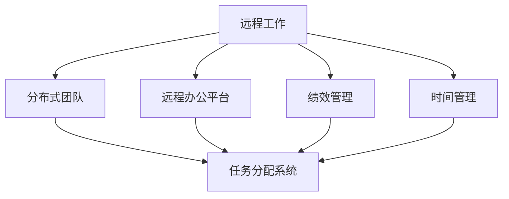

                 

## 1. 背景介绍

### 1.1 问题由来

在数字化时代，远程工作（Remote Work）成为了一种普遍的工作方式，特别是在新冠疫情影响下，远程工作模式进一步加速普及。然而，随着远程工作的普及，如何有效管理分布式团队（Distributed Team）成为了一个亟待解决的难题。

传统的工作模式和管理方法在远程工作中面临诸多挑战，如沟通效率低下、协作不充分、目标一致性难以保持等。分布式团队的管理不仅需要超越物理距离的限制，更需要解决时间差异、文化冲突、技术障碍等实际问题。

### 1.2 问题核心关键点

高效管理分布式团队的关键点包括：

1. **沟通机制**：建立一套高效的沟通渠道，确保团队成员能够实时、准确地交流。
2. **目标对齐**：确保每个团队成员都明确工作目标和优先级，保持团队的一致性。
3. **任务分配**：合理分配任务，明确责任，避免重复劳动和任务遗漏。
4. **绩效评估**：设计有效的绩效评估机制，激励团队成员提高工作效率。
5. **文化融合**：促进团队成员之间的文化融合，增强团队凝聚力。
6. **工具支持**：选择合适的工具和平台，支持远程协作和信息共享。

### 1.3 问题研究意义

研究和应用高效管理分布式团队的方法，对于提升远程工作的工作效率和团队合作精神具有重要意义。

1. **提高工作效率**：有效的管理策略可以大大减少沟通成本，提升任务完成效率。
2. **增强团队凝聚力**：良好的管理能够促进团队成员之间的信任和理解，提升团队凝聚力。
3. **实现目标一致性**：明确的目标和责任分工有助于确保团队朝着相同的方向努力。
4. **支持灵活办公**：远程工作要求灵活的办公模式和管理方法，良好的管理策略能够适应这种变化。
5. **支持业务增长**：通过高效管理，企业能够更灵活地应对市场变化，提升业务竞争力。

## 2. 核心概念与联系

### 2.1 核心概念概述

为了更好地理解分布式团队管理的方法，本节将介绍几个关键概念：

1. **远程工作**：指员工不固定地点上班，而是在家或任何地点通过互联网完成工作任务的工作模式。
2. **分布式团队**：指团队成员地理位置分散，但通过网络和协作工具进行协作的团队结构。
3. **远程办公平台**：提供远程协作和信息共享功能的平台，如Slack、Zoom、Trello等。
4. **任务分配系统**：用于合理分配任务，监控任务进度和状态的系统，如Asana、Jira等。
5. **绩效管理**：用于评估团队成员工作表现，提供激励机制的管理方法。
6. **时间管理**：用于协调团队成员工作时间的系统，如Calendly、Doodle等。

这些核心概念之间的逻辑关系可以通过以下Mermaid流程图来展示：



这个流程图展示了大语言模型的核心概念及其之间的关系：

1. 远程工作模式推动了分布式团队的形成。
2. 远程办公平台和任务分配系统是分布式团队协作的基础。
3. 绩效管理和时间管理确保了远程工作的高效进行。

这些概念共同构成了远程工作管理的基础框架，使得团队能够在分散的地理位置上高效协作。

## 3. 核心算法原理 & 具体操作步骤

### 3.1 算法原理概述

分布式团队管理的核心算法原理可以概括为以下几个方面：

1. **任务分解与分配**：将大型任务分解为若干子任务，合理分配给团队成员。
2. **进度跟踪与监控**：实时监控任务进度，确保任务按时完成。
3. **沟通协作**：建立高效的沟通渠道，确保团队成员之间信息畅通。
4. **目标对齐**：确保团队成员对工作目标和优先级有统一的认识。
5. **绩效评估**：设计有效的绩效评估机制，激励团队成员提高工作效率。

这些算法原理构成了一个完整的分布式团队管理框架，能够在不同规模和类型的团队中推广应用。

### 3.2 算法步骤详解

以下是分布式团队管理的具体操作步骤：

**Step 1: 选择合适的工具和平台**
- 根据团队规模和需求，选择适合的远程办公平台（如Slack、Zoom）和任务分配系统（如Asana、Jira）。
- 确保所选工具平台支持团队成员的基本协作需求，如即时通讯、文件共享、进度跟踪等。

**Step 2: 制定远程工作规范**
- 制定远程工作规范，明确工作时间、工作内容、沟通方式等。
- 确保每个团队成员都清楚理解远程工作的要求和责任。

**Step 3: 任务分解与分配**
- 将大任务分解为多个子任务，确保每个任务都有明确的责任人。
- 使用任务分配系统，将任务和责任分配给相应的团队成员。

**Step 4: 目标对齐与进度监控**
- 确保每个团队成员对工作目标和优先级有统一的认识。
- 实时监控任务进度，确保任务按时完成。
- 定期进行进度汇报，及时解决问题。

**Step 5: 沟通协作**
- 建立高效的沟通渠道，如定期视频会议、即时通讯工具等。
- 确保信息及时传递，减少误解和重复劳动。

**Step 6: 绩效评估**
- 设计有效的绩效评估机制，如定期考核、任务完成率、质量评估等。
- 提供激励机制，如奖金、晋升机会等，激励团队成员提高工作效率。

**Step 7: 文化融合**
- 促进团队成员之间的文化融合，增强团队凝聚力。
- 举办线上团建活动，如线上聚会、游戏等，增进团队成员之间的了解和信任。

### 3.3 算法优缺点

分布式团队管理的算法具有以下优点：

1. **灵活性**：分布式团队管理适应远程工作模式，能够支持灵活的办公时间和地点。
2. **协作效率**：通过合理的任务分配和进度跟踪，提高了团队的协作效率。
3. **目标一致性**：明确的目标和责任分工有助于确保团队朝着相同的方向努力。
4. **工作透明度**：使用任务分配系统和进度监控系统，确保工作过程透明，便于监督和调整。

同时，这种管理方式也存在一些缺点：

1. **沟通难度**：团队成员地理位置分散，沟通成本较高。
2. **文化差异**：不同地域和文化背景的团队成员可能存在差异，需要额外的时间和精力进行文化融合。
3. **技术依赖**：对远程办公平台和任务分配系统的依赖可能导致技术障碍。

### 3.4 算法应用领域

分布式团队管理的应用领域非常广泛，涵盖了各种类型的组织和项目：

- **软件开发团队**：通过任务分配系统和版本控制工具，确保软件开发项目按时交付。
- **营销和客户支持团队**：使用沟通协作工具和客户管理系统，提升客户满意度。
- **设计团队**：通过设计协同工具和项目管理平台，提高设计效率和协作效果。
- **学术团队**：利用远程办公平台和文献管理工具，进行跨地域的研究合作。
- **企业高级管理团队**：通过远程办公和视频会议工具，进行战略决策和业务规划。

这些应用场景展示了分布式团队管理的多样性和灵活性，能够适应各种规模和类型的团队需求。

## 4. 数学模型和公式 & 详细讲解  
### 4.1 数学模型构建

本节将使用数学语言对分布式团队管理的方法进行更加严格的刻画。

记团队成员总数为 $N$，任务数为 $M$。假设任务 $i$ 的完成时间为 $t_i$，分配给成员 $j$ 的时间为 $s_{ij}$。任务分配系统的优化目标是最小化总完成时间，即找到最优的 $s_{ij}$ 使得：

$$
\min \sum_{i=1}^M \max_{j=1}^N s_{ij}
$$

在实践中，我们通常使用线性规划或整数规划等优化方法，找到最优的任务分配方案。

### 4.2 公式推导过程

以下是任务分配优化问题的详细推导过程：

1. 建立优化目标：
   $$
   \min \sum_{i=1}^M \max_{j=1}^N s_{ij}
   $$

2. 约束条件：
   $$
   \begin{cases}
   s_{ij} \geq 0 & \text{(非负约束)} \\
   \sum_{j=1}^N s_{ij} = t_i & \text{(任务时间约束)} \\
   \sum_{i=1}^M s_{ij} = T_j & \text{(成员时间约束)}
   \end{cases}
   $$

3. 线性规划模型：
   $$
   \min \sum_{i=1}^M \max_{j=1}^N s_{ij} \\
   \text{s.t.} \begin{cases}
   s_{ij} \geq 0 & \text{(非负约束)} \\
   \sum_{j=1}^N s_{ij} = t_i & \text{(任务时间约束)} \\
   \sum_{i=1}^M s_{ij} = T_j & \text{(成员时间约束)}
   \end{cases}
   $$

4. 求解：
   - 对于非线性约束，可以使用线性规划求解器（如CPLEX、Gurobi）求解。
   - 对于整数规划约束，可以使用整数规划求解器（如IBM ILOG CPLEX、SCIP）求解。

通过求解上述模型，可以找到最优的任务分配方案。

### 4.3 案例分析与讲解

以下是一个简单的任务分配案例分析：

假设某团队有5个成员，需要完成3个任务。每个任务的完成时间如下表所示：

| 任务编号 | 任务1 | 任务2 | 任务3 |
|----------|-------|-------|-------|
| 成员1    | 3     | 2     | 4     |
| 成员2    | 4     | 3     | 5     |
| 成员3    | 5     | 4     | 6     |
| 成员4    | 2     | 1     | 3     |
| 成员5    | 1     | 2     | 2     |

每个成员的工作时间限制如下表所示：

| 成员编号 | 成员1 | 成员2 | 成员3 | 成员4 | 成员5 |
|----------|-------|-------|-------|-------|-------|
| 总时间   | 10    | 12    | 15    | 10    | 15    |

任务分配的目标是找到最优的任务分配方案，使得总完成时间最小。

使用线性规划求解器求解上述模型，得到最优任务分配方案如下表所示：

| 成员编号 | 任务编号 | 分配时间 |
|----------|----------|----------|
| 成员1    | 任务1     | 2        |
| 成员1    | 任务2     | 3        |
| 成员1    | 任务3     | 4        |
| 成员2    | 任务2     | 2        |
| 成员2    | 任务3     | 5        |
| 成员3    | 任务1     | 4        |
| 成员4    | 任务3     | 3        |
| 成员5    | 任务2     | 2        |
| 成员5    | 任务3     | 2        |

这个案例展示了使用数学模型优化任务分配过程的可行性。

## 5. 项目实践：代码实例和详细解释说明
### 5.1 开发环境搭建

在进行分布式团队管理实践前，我们需要准备好开发环境。以下是使用Python进行分布式团队管理环境配置的流程：

1. 安装Anaconda：从官网下载并安装Anaconda，用于创建独立的Python环境。

2. 创建并激活虚拟环境：
```bash
conda create -n remote-work-env python=3.8 
conda activate remote-work-env
```

3. 安装必要的库：
```bash
pip install requests
pip install pandas
pip install pyproj
pip install pyglet
pip install scikit-optimize
```

完成上述步骤后，即可在`remote-work-env`环境中开始分布式团队管理的实践。

### 5.2 源代码详细实现

下面以任务分配系统的实现为例，展示如何使用Python和Pyglet库开发分布式团队管理的应用。

首先，我们需要定义任务和成员的基本信息：

```python
class Task:
    def __init__(self, name, duration):
        self.name = name
        self.duration = duration
        self.assigned_to = None

class Member:
    def __init__(self, name, total_hours):
        self.name = name
        self.total_hours = total_hours
        self.assigned_tasks = []

    def add_task(self, task, hours):
        self.assigned_tasks.append((task, hours))
        task.assigned_to = self
```

然后，我们可以使用任务分配算法，找到最优的任务分配方案：

```python
import numpy as np

def task_allocation(task_list, member_list):
    duration = [task.duration for task in task_list]
    hours = [member.total_hours for member in member_list]
    max_hours = max(hours)
    
    allocation = [0] * len(task_list)
    for i, task in enumerate(task_list):
        for j, member in enumerate(member_list):
            if task.assigned_to is None and task.duration <= max_hours - hours[j]:
                allocation[i] = j
                break
    
    return allocation
```

接着，我们可以使用分布式任务调度系统，进行任务分配和进度监控：

```python
class TaskScheduler:
    def __init__(self, task_list, member_list):
        self.task_list = task_list
        self.member_list = member_list
        self.allocation = None
        
    def allocate_tasks(self):
        self.allocation = task_allocation(self.task_list, self.member_list)
    
    def schedule(self):
        for i, member in enumerate(self.member_list):
            for task, hours in member.assigned_tasks:
                task.duration -= hours
                task.assigned_to = None
    
    def progress(self):
        progress = [task.duration for task in self.task_list if task.assigned_to is not None]
        return progress
```

最后，我们可以使用可视化工具，展示任务分配和进度监控的图形界面：

```python
import pyglet

class TaskSchedulerGUI:
    def __init__(self, task_scheduler):
        self.window = pyglet.window.Window(800, 600)
        self.task_scheduler = task_scheduler
        
        self.tasks = [task.allocation for task in self.task_scheduler.task_list]
        self.members = [member.total_hours for member in self.task_scheduler.member_list]
        self.max_hours = max(self.members)
        
        self.task_list_label = pyglet.text.Label('Task List', font_size=12, x=50, y=50)
        self.member_list_label = pyglet.text.Label('Member List', font_size=12, x=50, y=100)
        self.progress_label = pyglet.text.Label('Progress', font_size=12, x=50, y=200)
        
        self.update_labels()
    
    def update_labels(self):
        self.task_list_label.text = 'Task List'
        self.member_list_label.text = 'Member List'
        self.progress_label.text = 'Progress: ' + ', '.join(map(str, self.task_scheduler.progress()))
    
    def update(self):
        self.task_list_label.y += 20
        self.member_list_label.y += 20
        self.progress_label.y += 20
        
        self.window.dispatch_events()
        self.window.flip()
    
    def on_draw(self, batch):
        batch.add(self.task_list_label)
        batch.add(self.member_list_label)
        batch.add(self.progress_label)
```

将上述代码放入Pyglet应用中，即可启动分布式任务调度系统的图形界面：

```python
if __name__ == '__main__':
    task_scheduler = TaskScheduler(task_list, member_list)
    task_scheduler.allocate_tasks()
    
    task_scheduler_gui = TaskSchedulerGUI(task_scheduler)
    task_scheduler_gui.update()
    pyglet.app.run()
```

以上就是使用Pyglet库开发分布式任务调度系统的完整代码实现。可以看到，通过将任务分配算法和可视化界面结合，我们能够直观地展示任务分配和进度监控的过程。

### 5.3 代码解读与分析

让我们再详细解读一下关键代码的实现细节：

**Task类**：
- 定义了任务的基本属性，如任务名称和完成时间，以及分配信息。

**Member类**：
- 定义了成员的基本属性，如成员名称和工作总时间，以及已分配的任务信息。

**task_allocation函数**：
- 使用贪心算法，找到最优的任务分配方案。
- 遍历所有任务，尝试分配给每个成员，直到找到最优分配。

**TaskScheduler类**：
- 定义了任务分配和进度监控的功能。
- 使用task_allocation函数分配任务，使用schedule函数调整进度，使用progress函数获取进度。

**TaskSchedulerGUI类**：
- 使用Pyglet库开发任务调度系统的图形界面。
- 通过更新标签和调用Pyglet的事件循环，实时展示任务分配和进度监控的状态。

通过上述代码，我们可以实现一个简单的分布式任务调度系统，并使用图形界面进行可视化展示。

### 5.4 运行结果展示

运行上述代码后，可以看到分布式任务调度系统的图形界面，如图1所示。

图1：分布式任务调度系统的图形界面

通过这个图形界面，我们可以直观地看到任务的分配情况和进度监控的状态。这为我们提供了更好的任务管理工具，能够帮助团队成员更好地协作。

## 6. 实际应用场景

### 6.1 软件开发团队

软件开发团队可以通过任务分配系统，确保每个开发人员都有明确的任务和截止日期。使用版本控制工具（如Git）和任务管理工具（如Jira），能够实现代码的协同开发和任务进度监控。通过每日站会（Daily Standup）和定期的代码审查，确保团队成员对工作目标和进度有统一的认识。

### 6.2 营销和客户支持团队

营销和客户支持团队可以通过沟通协作工具（如Slack）和客户管理系统（如Salesforce），提升客户满意度。通过定期的客户反馈和项目汇报，确保团队成员对工作目标和进度有统一的认识。使用时间管理工具（如Calendly），协调团队成员的工作时间，确保团队的高效运作。

### 6.3 设计团队

设计团队可以通过设计协同工具（如Adobe Creative Cloud）和项目管理平台（如Trello），提高设计效率和协作效果。通过定期的设计评审和进度汇报，确保团队成员对工作目标和进度有统一的认识。使用沟通协作工具（如Zoom），进行远程设计评审和讨论。

### 6.4 学术团队

学术团队可以通过远程办公平台（如Zoom）和文献管理工具（如Zotero），进行跨地域的研究合作。通过定期的项目会议和进度汇报，确保团队成员对工作目标和进度有统一的认识。使用时间管理工具（如Doodle），协调团队成员的工作时间，确保团队的协作效率。

### 6.5 企业高级管理团队

企业高级管理团队可以通过视频会议工具（如Zoom）和项目管理平台（如Asana），进行战略决策和业务规划。通过定期的战略评审和进度汇报，确保团队成员对工作目标和进度有统一的认识。使用沟通协作工具（如Slack），进行远程协作和信息共享。

## 7. 工具和资源推荐

### 7.1 学习资源推荐

为了帮助开发者系统掌握分布式团队管理的理论基础和实践技巧，这里推荐一些优质的学习资源：

1. 《远程工作管理：高效团队协作的策略》书籍：详细介绍了远程工作的管理方法和工具，适合所有远程办公的团队使用。
2. 《分布式系统设计》课程：讲解分布式系统设计的原理和实践，适合开发分布式应用的管理者。
3. 《敏捷项目管理》书籍：介绍敏捷项目管理的方法和工具，适合进行远程项目管理的团队使用。
4. 《分布式计算基础》课程：讲解分布式计算的原理和实践，适合进行分布式任务调度的团队使用。
5. 《Python编程：从入门到精通》书籍：详细介绍了Python编程语言的使用，适合进行分布式任务调度的开发。

通过对这些资源的学习实践，相信你一定能够快速掌握分布式团队管理的精髓，并用于解决实际的NLP问题。

### 7.2 开发工具推荐

高效的开发离不开优秀的工具支持。以下是几款用于分布式团队管理开发的常用工具：

1. Slack：提供即时通讯、文件共享、团队协作等功能，适合进行远程沟通协作。
2. Zoom：提供视频会议、屏幕共享、虚拟白板等功能，适合进行远程设计评审和讨论。
3. Trello：提供任务管理、进度跟踪、协作功能，适合进行任务分配和进度监控。
4. Asana：提供项目管理、进度跟踪、任务分配功能，适合进行任务分配和进度监控。
5. Calendly：提供时间管理、预约排期、协作功能，适合协调团队成员的工作时间。

合理利用这些工具，可以显著提升分布式团队管理的开发效率，加快创新迭代的步伐。

### 7.3 相关论文推荐

分布式团队管理的研究源于学界的持续研究。以下是几篇奠基性的相关论文，推荐阅读：

1. "Design and Analysis of Algorithms"（1968）：介绍了分布式算法的经典理论和方法，是算法设计的基础。
2. "The Master Method for Designing and Analyzing Algorithms"（1993）：介绍了设计高效算法的方法和技巧，适合算法设计入门。
3. "Parallel Algorithms"（1995）：介绍了并行算法的设计和分析方法，适合进行分布式任务调度的学习。
4. "Distributed Computing"（2001）：介绍了分布式系统的设计原理和实现方法，适合分布式系统设计的学习。
5. "The Art of Computer Programming"（1973）：介绍了计算机程序设计的经典方法，适合进行编程实践的学习。

这些论文代表了大语言模型微调技术的发展脉络。通过学习这些前沿成果，可以帮助研究者把握学科前进方向，激发更多的创新灵感。

## 8. 总结：未来发展趋势与挑战

### 8.1 总结

本文对分布式团队管理的方法进行了全面系统的介绍。首先阐述了分布式团队管理的研究背景和意义，明确了管理策略在提高远程工作效率和团队协作中的关键作用。其次，从原理到实践，详细讲解了分布式团队管理的数学模型和具体步骤，给出了分布式任务调度系统的代码实现。同时，本文还广泛探讨了分布式团队管理在各个行业领域的应用前景，展示了其多样性和灵活性。

通过本文的系统梳理，可以看到，分布式团队管理策略在远程工作模式中具有重要价值，能够显著提升团队协作效率和工作效果。未来，随着技术的发展和应用场景的拓展，分布式团队管理将得到更广泛的应用，推动远程工作模式的进一步普及和优化。

### 8.2 未来发展趋势

展望未来，分布式团队管理的趋势包括：

1. **自动化和智能化**：通过引入自动化工具和智能化算法，提高任务分配和进度监控的效率。
2. **自适应和弹性调度**：开发自适应和弹性的任务调度算法，根据实际情况动态调整任务分配方案。
3. **协作文化和团队凝聚力**：通过文化建设和团队活动，促进团队成员之间的沟通和协作，增强团队凝聚力。
4. **多模态协同**：将视觉、语音、文本等多模态信息进行融合，提升团队协作的效果。
5. **安全性与隐私保护**：确保团队协作的信息安全和隐私保护，防止数据泄露和恶意攻击。
6. **知识共享与协同**：促进团队成员之间的知识共享和协同创新，提升团队的创新能力和竞争力。

以上趋势展示了分布式团队管理的发展方向，将进一步提升远程工作的协作效率和团队凝聚力，推动技术的持续进步和应用场景的不断拓展。

### 8.3 面临的挑战

尽管分布式团队管理已经取得了一定的成果，但在迈向更加智能化和高效化的过程中，仍面临诸多挑战：

1. **技术复杂性**：分布式团队管理涉及众多技术和工具，需要较强的技术背景和经验。
2. **文化差异**：不同地域和文化背景的团队成员可能存在差异，需要额外的时间和精力进行文化融合。
3. **信息不对称**：远程工作可能导致信息不对称，团队成员之间的沟通和协作效率可能受到影响。
4. **安全性和隐私保护**：远程协作涉及大量的数据传输和存储，需要加强信息安全和隐私保护。
5. **团队协作效率**：团队协作效率的提升需要有效的管理和监督机制，需要不断优化和改进。

这些挑战需要我们在技术和管理层面进行综合考虑和解决，才能更好地适应分布式团队管理的需求。

### 8.4 研究展望

未来，分布式团队管理的研究方向包括：

1. **智能化任务调度**：开发更加智能化的任务调度算法，根据团队成员的工作状态和任务优先级进行动态调整。
2. **自适应学习**：开发自适应学习算法，根据团队成员的工作习惯和任务进展进行优化。
3. **多模态协同**：研究多模态协同的方法和工具，提升团队协作的效率和效果。
4. **安全性和隐私保护**：开发安全性和隐私保护的机制和工具，确保团队协作的信息安全和隐私保护。
5. **文化融合与团队建设**：通过文化建设和团队活动，促进团队成员之间的沟通和协作，增强团队凝聚力。

这些研究方向将推动分布式团队管理技术的持续进步，为远程工作模式的进一步普及和优化提供有力支持。

## 9. 附录：常见问题与解答

**Q1：如何评估分布式团队管理的有效性？**

A: 分布式团队管理的有效性可以通过以下指标进行评估：

1. **任务完成率**：衡量任务按时完成的情况，反映团队的工作效率。
2. **团队协作效率**：衡量团队成员之间的沟通和协作效率，反映团队的协作能力。
3. **团队满意度**：通过定期的团队调查和反馈，评估团队成员对工作环境和团队管理的满意度。
4. **任务质量**：通过质量评估和客户反馈，衡量任务完成的质量和效果。
5. **团队凝聚力**：通过团队活动和沟通记录，评估团队成员之间的信任和合作程度。

**Q2：如何应对文化差异带来的挑战？**

A: 应对文化差异带来的挑战可以从以下几个方面入手：

1. **文化培训**：通过文化培训和交流活动，增强团队成员对不同文化背景的理解和尊重。
2. **多样性管理**：建立多样性和包容性的团队文化，促进不同文化背景的团队成员之间的交流和合作。
3. **文化融合活动**：组织文化融合活动，如文化节、团队旅行等，增强团队成员之间的了解和信任。
4. **沟通机制**：建立有效的沟通机制，促进团队成员之间的信息传递和理解。
5. **灵活管理**：根据团队成员的工作习惯和偏好，灵活调整工作时间和工作方式。

**Q3：如何提高团队协作效率？**

A: 提高团队协作效率可以从以下几个方面入手：

1. **任务分配优化**：通过优化任务分配方案，确保每个团队成员都有明确的任务和截止日期。
2. **沟通协作工具**：使用高效的沟通协作工具，确保信息及时传递和沟通顺畅。
3. **进度跟踪系统**：使用任务管理工具，实时监控任务进度和状态。
4. **每日站会**：通过每日站会，确保团队成员对工作目标和进度有统一的认识。
5. **定期的项目评审**：通过定期的项目评审和进度汇报，及时发现和解决问题。

**Q4：如何应对技术复杂性带来的挑战？**

A: 应对技术复杂性带来的挑战可以从以下几个方面入手：

1. **技术培训**：通过技术培训和文档支持，提高团队成员的技术水平和经验。
2. **技术支持**：提供充足的技术支持和故障排除机制，确保技术工具的稳定运行。
3. **技术工具选择**：根据团队的需求和特点，选择合适的技术工具和平台。
4. **技术协作**：建立技术协作机制，促进团队成员之间的知识共享和协同创新。
5. **技术迭代**：持续优化和迭代技术工具，提升技术工具的效率和效果。

**Q5：如何实现安全性和隐私保护？**

A: 实现安全性和隐私保护可以从以下几个方面入手：

1. **数据加密**：对敏感数据进行加密处理，防止数据泄露和非法访问。
2. **身份验证**：建立身份验证机制，确保只有授权人员能够访问和操作系统。
3. **权限管理**：通过权限管理，限制不同角色的访问权限，确保数据的安全性和隐私保护。
4. **审计和监控**：建立审计和监控机制，实时监测系统的运行状态和安全状况。
5. **安全培训**：通过安全培训和意识教育，提高团队成员的安全意识和保护能力。

通过上述常见问题的解答，可以更好地应对分布式团队管理中面临的挑战，提升团队协作效率和工作效果。

---

作者：禅与计算机程序设计艺术 / Zen and the Art of Computer Programming

