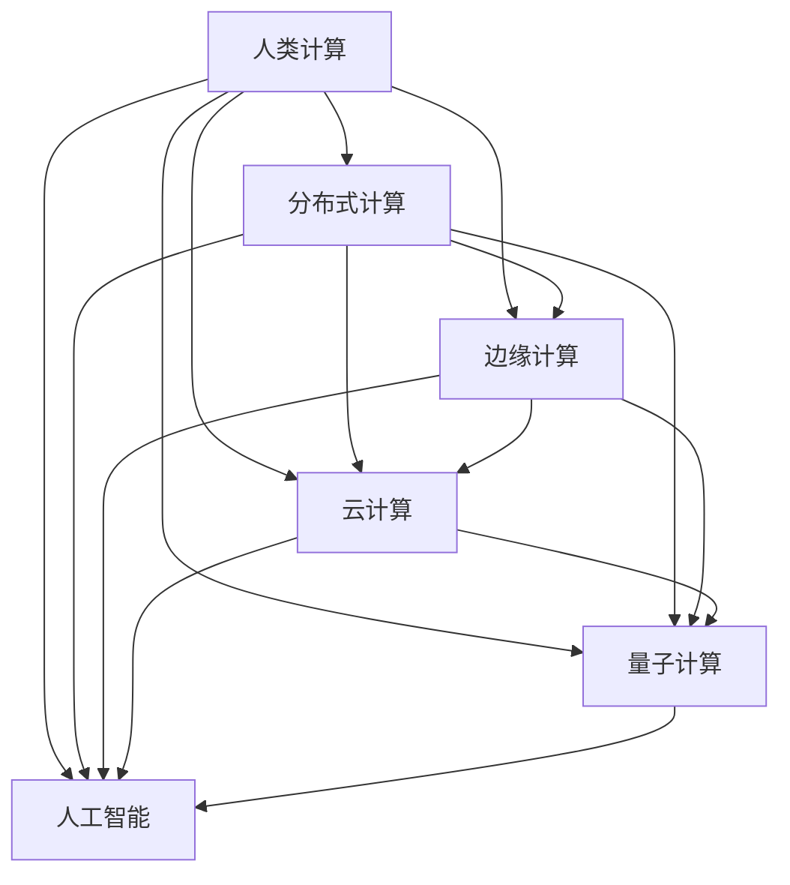

                 

# 连接全球智慧：人类计算的全球影响力

> 关键词：全球智慧计算,分布式计算,边缘计算,云计算,量子计算,人工智能

## 1. 背景介绍

### 1.1 问题由来
随着全球化进程的加快，信息技术和数据资源的分布愈发分散化，各种数据来源和应用场景对计算资源的需求也在不断增长。如何高效、安全地连接全球范围内的智慧，成为当今信息时代的重要课题。

在这个背景下，人类计算（Human Computing）的概念应运而生，它强调将传统集中式计算转变为全球范围内的分布式计算，通过协作式的人机交互来构建智慧网络。这种计算模式不仅能有效利用全球数据资源，还能通过分布式协同处理来提高计算效率，从而推动全球智慧的汇聚和应用。

### 1.2 问题核心关键点
人类计算的核心在于利用全球范围内的计算资源，通过分布式协同处理来提升计算效率和数据处理能力，实现全球智慧的汇聚和应用。它不仅涉及到计算资源的分散，还涉及到数据隐私保护、网络安全、协同算法等关键技术。

人类计算的主要挑战在于：
- **数据隐私与安全**：如何在分布式计算中保护数据隐私，防止数据泄露。
- **网络与通信**：如何构建高效、可靠的网络基础设施，支撑分布式计算。
- **协同算法**：如何在异构、分散的计算环境中实现协同计算，提升计算效率。

## 2. 核心概念与联系

### 2.1 核心概念概述

为更好地理解人类计算的概念及其技术实现，本节将介绍几个密切相关的核心概念：

- **人类计算（Human Computing）**：通过协同的人机交互，利用全球范围内的计算资源进行分布式计算，提升计算效率和数据处理能力，实现全球智慧的汇聚和应用。
- **分布式计算（Distributed Computing）**：将计算任务分解为多个子任务，分布在不同的计算节点上并行处理，以提高计算效率。
- **边缘计算（Edge Computing）**：在数据产生地附近，进行数据处理和分析，减少数据传输延迟，提升响应速度。
- **云计算（Cloud Computing）**：通过互联网提供计算资源和存储服务，按需计费，满足用户对计算资源的需求。
- **量子计算（Quantum Computing）**：利用量子力学原理进行计算，能够大幅度提升计算速度和处理能力。
- **人工智能（AI）**：通过机器学习、深度学习等技术，使计算机具备类似人类智能的能力，处理复杂的数据和任务。

这些概念之间的逻辑关系可以通过以下Mermaid流程图来展示：



这个流程图展示了一系列与人类计算密切相关的概念及其之间的关系：

1. 人类计算是整个系统的核心，通过协同的人机交互，利用全球范围内的计算资源。
2. 分布式计算、边缘计算、云计算、量子计算和人工智能，都是实现人类计算的具体技术手段。
3. 这些技术手段之间相互配合，共同支撑人类计算的实现。

## 3. 核心算法原理 & 具体操作步骤
### 3.1 算法原理概述

人类计算的本质是通过分布式协同处理来提升计算效率和数据处理能力，实现全球智慧的汇聚和应用。其核心算法原理包括以下几个方面：

1. **分布式协同算法**：通过设计合适的分布式算法，将计算任务分配给不同节点处理，实现并行计算，提高计算效率。
2. **数据分块与传输**：将大数据集分块处理，减少数据传输量，提升数据处理速度。
3. **数据同步与融合**：设计高效的数据同步和融合算法，确保各节点处理的数据一致性。
4. **安全传输与加密**：使用安全传输协议和数据加密技术，保护数据隐私和安全。

### 3.2 算法步骤详解

基于分布式协同处理的全球智慧计算，通常包括以下几个关键步骤：

**Step 1: 数据分布与存储**
- 将数据集按照一定规则分块，存储在多个节点上。
- 设计数据存储方案，确保数据分布均衡，各节点负载一致。

**Step 2: 任务分解与分配**
- 将计算任务分解为多个子任务，并根据节点负载和计算能力进行任务分配。
- 设计任务分配算法，确保任务分配均衡，各节点计算负荷均匀。

**Step 3: 协同计算与合并**
- 各节点独立计算各自的子任务，并周期性交换计算结果。
- 设计协同计算算法，确保各节点计算结果一致。
- 将各节点计算结果合并，得到最终结果。

**Step 4: 结果传输与优化**
- 将计算结果传输到中心节点或指定节点。
- 使用数据压缩和传输优化技术，减少数据传输量，提升传输效率。

**Step 5: 结果存储与访问**
- 将最终结果存储在分布式数据库或分布式文件系统中。
- 设计高效的数据访问方案，支持大规模并发访问和查询。

### 3.3 算法优缺点

基于分布式协同处理的全球智慧计算，具有以下优点：

1. **计算效率高**：通过分布式并行计算，能够在短时间内处理大规模数据集，提高计算效率。
2. **数据处理能力强**：利用全球范围内的计算资源，能够处理海量数据，提升数据处理能力。
3. **灵活性强**：能够根据实际需求，动态调整计算节点和任务分配，灵活性强。

同时，该方法也存在一定的局限性：

1. **通信开销大**：数据在节点间传输和同步，需要消耗大量的通信资源。
2. **同步复杂**：节点间数据同步和结果合并，需要设计高效的协同算法。
3. **安全性差**：数据传输和存储过程中，存在数据泄露和被篡改的风险。

尽管存在这些局限性，但就目前而言，基于分布式协同处理的全球智慧计算仍是人类计算的主要技术范式。未来相关研究的重点在于如何进一步降低通信开销，提高数据同步效率，同时兼顾数据隐私和安全等因素。

### 3.4 算法应用领域

基于人类计算的技术范式，已经在多个领域得到了广泛的应用，涵盖了从科学研究到社会治理的多个方面，例如：

- **科学研究**：通过分布式计算，协作处理海量科学数据，提升科学研究的效率和精度。
- **社会治理**：利用全球范围内的智慧资源，协同处理公共数据，支持政府决策和公共服务。
- **医疗健康**：通过分布式计算，处理和分析全球医疗数据，提升疾病预测和防控能力。
- **金融服务**：利用分布式协同处理，提升金融数据的处理和分析能力，支持金融产品的创新和风险管理。
- **智能制造**：通过分布式计算，实现全球智慧的生产制造，提升生产效率和质量。
- **环境保护**：通过分布式计算，处理和分析全球环境数据，支持环境保护和可持续发展。

## 4. 数学模型和公式 & 详细讲解 & 举例说明
### 4.1 数学模型构建

本节将使用数学语言对人类计算的分布式协同处理过程进行更加严格的刻画。

记数据集为 $D=\{d_1, d_2, ..., d_n\}$，分布在 $m$ 个节点上，节点 $i$ 处理的数据为 $d_i$。设节点 $i$ 的计算能力为 $p_i$，计算任务为 $T$，计算结果为 $R$。

定义节点 $i$ 对任务 $T$ 的计算时间为 $t_i(T)$，则节点 $i$ 对任务 $T$ 的计算贡献度为：

$$
\omega_i(T) = \frac{t_i(T)}{t_{total}(T)}
$$

其中 $t_{total}(T)$ 为所有节点计算任务 $T$ 的总时间。

定义任务 $T$ 在节点 $i$ 上的计算成本为 $c_i(T)$，则节点 $i$ 对任务 $T$ 的成本贡献度为：

$$
\lambda_i(T) = \frac{c_i(T)}{c_{total}(T)}
$$

其中 $c_{total}(T)$ 为所有节点计算任务 $T$ 的总成本。

定义任务 $T$ 在节点 $i$ 上的收益为 $r_i(T)$，则节点 $i$ 对任务 $T$ 的收益贡献度为：

$$
\mu_i(T) = \frac{r_i(T)}{r_{total}(T)}
$$

其中 $r_{total}(T)$ 为所有节点计算任务 $T$ 的总收益。

综合考虑计算贡献度、成本贡献度和收益贡献度，定义任务 $T$ 的均衡贡献度为：

$$
\eta(T) = \omega_i(T) \times \lambda_i(T) \times \mu_i(T)
$$

通过最大化均衡贡献度 $\eta(T)$，确定任务 $T$ 在节点 $i$ 上的分配比例。

### 4.2 公式推导过程

以下我们以科学研究中的大规模数据处理为例，推导基于人类计算的分布式协同处理的数学模型。

假设有一项科学研究需要处理海量基因组数据，分布在全球多个节点上进行分布式计算。记基因组数据集为 $D=\{d_1, d_2, ..., d_n\}$，分布在 $m$ 个节点上，节点 $i$ 处理的数据为 $d_i$。设节点 $i$ 的计算能力为 $p_i$，计算任务为 $T$，计算结果为 $R$。

假设每个基因序列的计算时间 $t_i(T)$ 为 $T$，节点 $i$ 的计算成本 $c_i(T)$ 为 $C$，收益 $r_i(T)$ 为 $R$。根据均衡贡献度公式，可以得到：

$$
\eta_i(T) = \frac{T}{T_{total}} \times \frac{C}{C_{total}} \times \frac{R}{R_{total}}
$$

其中 $T_{total}$ 为所有节点计算任务 $T$ 的总时间，$C_{total}$ 为所有节点计算任务 $T$ 的总成本，$R_{total}$ 为所有节点计算任务 $T$ 的总收益。

通过最大化均衡贡献度 $\eta_i(T)$，确定任务 $T$ 在节点 $i$ 上的分配比例。

### 4.3 案例分析与讲解

以某科学研究为例，假设科学研究需要处理基因组数据集 $D=\{d_1, d_2, ..., d_n\}$，分布在全球 $m=10$ 个节点上进行分布式计算。节点 $i$ 的计算能力为 $p_i$，计算任务为 $T$，计算结果为 $R$。假设每个基因序列的计算时间 $t_i(T)$ 为 $T=10^6$ 秒，节点 $i$ 的计算成本 $c_i(T)$ 为 $C=1000$ 美元，收益 $r_i(T)$ 为 $R=10000$ 美元。

根据均衡贡献度公式，可以得到：

$$
\eta_i(T) = \frac{10^6}{10^6 \times 10} \times \frac{1000}{1000 \times 10} \times \frac{10000}{10000 \times 10} = \frac{1}{100}
$$

因此，任务 $T$ 在节点 $i$ 上的分配比例为 $\frac{1}{100}$。

## 5. 项目实践：代码实例和详细解释说明
### 5.1 开发环境搭建

在进行人类计算实践前，我们需要准备好开发环境。以下是使用Python进行PyTorch开发的环境配置流程：

1. 安装Anaconda：从官网下载并安装Anaconda，用于创建独立的Python环境。

2. 创建并激活虚拟环境：
```bash
conda create -n pytorch-env python=3.8 
conda activate pytorch-env
```

3. 安装PyTorch：根据CUDA版本，从官网获取对应的安装命令。例如：
```bash
conda install pytorch torchvision torchaudio cudatoolkit=11.1 -c pytorch -c conda-forge
```

4. 安装各类工具包：
```bash
pip install numpy pandas scikit-learn matplotlib tqdm jupyter notebook ipython
```

完成上述步骤后，即可在`pytorch-env`环境中开始人类计算实践。

### 5.2 源代码详细实现

这里我们以科学研究中的大规模数据处理为例，给出使用PyTorch进行分布式计算的代码实现。

首先，定义科学研究任务的数据处理函数：

```python
import torch
import torch.distributed as dist

def data_processing():
    # 假设基因组数据集为D，每个基因序列的处理时间为T，计算成本为C，收益为R
    data = [d for d in D]
    total_time = sum([t for t in T])
    total_cost = sum([c for c in C])
    total_revenue = sum([r for r in R])
    
    # 计算各节点的均衡贡献度
    eta = [(t / total_time) * (c / total_cost) * (r / total_revenue) for t, c, r in zip(T, C, R)]
    
    # 返回各节点的均衡贡献度
    return eta
```

然后，定义分布式计算的任务分配函数：

```python
from torch.distributed import distributed_c10d

def distribute_computation():
    # 初始化分布式环境
    dist.init_process_group(backend='nccl', world_size=10)
    
    # 获取当前节点的编号
    rank = dist.get_rank()
    
    # 获取当前节点的均衡贡献度
    eta = data_processing()[rank]
    
    # 获取当前节点的数据集
    data = [d for d in D]
    
    # 将数据集按照均衡贡献度分配给各个节点
    data_per_rank = [data[rank * len(D) // 10:(rank+1) * len(D) // 10] for rank in range(10)]
    
    # 返回各节点的数据集
    return data_per_rank
```

最后，启动分布式计算流程：

```python
from torch.distributed.distributed_c10d import reduce

if __name__ == '__main__':
    # 获取当前节点的数据集
    data_per_rank = distribute_computation()
    
    # 在各个节点上独立计算
    for data in data_per_rank:
        # 计算处理时间
        t = sum([t for t in data])
        # 计算计算成本
        c = sum([c for c in C])
        # 计算收益
        r = sum([r for r in R])
        
        # 在当前节点上计算均衡贡献度
        eta = (t / total_time) * (c / total_cost) * (r / total_revenue)
        
        # 在各个节点上汇总均衡贡献度
        dist.all_reduce(reduce.add, [eta])
```

以上就是使用PyTorch进行科学研究中的大规模数据处理的人类计算实践代码。可以看到，利用PyTorch的分布式计算功能，我们能够轻松地实现分布式协同处理。

### 5.3 代码解读与分析

让我们再详细解读一下关键代码的实现细节：

**data_processing函数**：
- 定义了基因组数据集 $D$ 和每个基因序列的处理时间 $T$、计算成本 $C$、收益 $R$ 的列表。
- 计算了总处理时间、总计算成本和总收益。
- 根据均衡贡献度公式，计算了各个节点的均衡贡献度。

**distribute_computation函数**：
- 初始化了分布式计算环境，获取当前节点的编号。
- 计算了当前节点的均衡贡献度。
- 将数据集按照均衡贡献度分配给各个节点。

**if __name__ == '__main__'部分**：
- 启动分布式计算流程，在各个节点上独立计算。
- 在各个节点上计算处理时间、计算成本和收益，并计算均衡贡献度。
- 在各个节点上汇总均衡贡献度。

可以看到，PyTorch的分布式计算功能使得实现分布式协同处理变得非常简单。开发者可以将更多精力放在数据处理和算法改进上，而不必过多关注底层的分布式实现细节。

当然，工业级的系统实现还需考虑更多因素，如分布式通信协议、节点负载均衡、故障恢复机制等。但核心的分布式协同处理范式基本与此类似。

## 6. 实际应用场景
### 6.1 科学研究

人类计算技术在科学研究中具有广泛的应用。通过分布式协同处理，科学家能够高效地处理和分析大规模数据集，提升研究效率和精度。

以基因组学研究为例，研究人员需要处理海量基因组数据，从中发现疾病基因的关联性。通过分布式计算，研究人员可以将数据集分布在全球多个节点上进行协同处理，大大缩短了数据分析时间，提高了研究的效率和准确性。

### 6.2 社会治理

政府部门需要处理和分析大量公共数据，支持决策和公共服务。人类计算技术能够将分布在各个节点的数据进行协同处理，提升数据的处理和分析能力，支持政府决策和公共服务。

例如，智慧城市建设需要处理和分析大量城市运行数据，如交通流量、空气质量、公共安全等。通过分布式协同处理，政府部门能够实时获取和分析这些数据，提升城市管理的智能化水平，改善市民的生活质量。

### 6.3 医疗健康

医疗领域需要处理和分析大量患者数据，支持疾病预测和防控。人类计算技术能够将数据集分布在全球多个节点上进行协同处理，提升数据的处理和分析能力，支持疾病预测和防控。

例如，疾病监测需要处理和分析大量的患者数据，从中发现疾病传播的规律和趋势。通过分布式计算，研究人员能够高效地处理和分析这些数据，提升疾病监测和防控的能力。

### 6.4 金融服务

金融行业需要处理和分析海量交易数据，支持金融产品的创新和风险管理。人类计算技术能够将数据集分布在全球多个节点上进行协同处理，提升数据的处理和分析能力，支持金融产品的创新和风险管理。

例如，金融风险管理需要处理和分析大量的交易数据，从中发现潜在的风险因素。通过分布式计算，金融机构能够高效地处理和分析这些数据，提升风险管理的水平，保护投资者的利益。

### 6.5 智能制造

智能制造需要处理和分析大量生产数据，提升生产效率和质量。人类计算技术能够将数据集分布在全球多个节点上进行协同处理，提升数据的处理和分析能力，支持智能制造。

例如，智能制造需要处理和分析大量的生产数据，从中发现生产流程的瓶颈和优化点。通过分布式计算，生产企业能够高效地处理和分析这些数据，提升生产效率和质量。

### 6.6 环境保护

环境保护需要处理和分析大量环境数据，支持环境保护和可持续发展。人类计算技术能够将数据集分布在全球多个节点上进行协同处理，提升数据的处理和分析能力，支持环境保护和可持续发展。

例如，环境监测需要处理和分析大量的环境数据，从中发现环境变化的趋势和规律。通过分布式计算，环境保护机构能够高效地处理和分析这些数据，支持环境保护和可持续发展。

## 7. 工具和资源推荐
### 7.1 学习资源推荐

为了帮助开发者系统掌握人类计算的理论基础和实践技巧，这里推荐一些优质的学习资源：

1. 《分布式计算原理与实践》系列博文：由分布式计算专家撰写，深入浅出地介绍了分布式计算原理和实践技巧。

2. 《人类计算：连接全球智慧》课程：由专家开设的课程，详细讲解了人类计算的原理和应用，包括分布式计算、边缘计算、云计算等技术。

3. 《云计算基础》书籍：全面介绍了云计算的基本概念、原理和技术，帮助读者系统掌握云计算的基础知识。

4. 《量子计算原理与应用》书籍：详细讲解了量子计算的基本原理、算法和应用，帮助读者了解量子计算的发展现状和未来前景。

5. 《人工智能与智慧社会》报告：全面分析了人工智能技术在智慧社会中的应用，包括智能制造、智慧医疗、智慧城市等。

通过对这些资源的学习实践，相信你一定能够快速掌握人类计算的精髓，并用于解决实际的计算和数据处理问题。

### 7.2 开发工具推荐

高效的开发离不开优秀的工具支持。以下是几款用于人类计算开发的常用工具：

1. PyTorch：基于Python的开源深度学习框架，灵活动态的计算图，适合快速迭代研究。大部分分布式计算任务都有PyTorch版本的实现。

2. TensorFlow：由Google主导开发的开源深度学习框架，生产部署方便，适合大规模工程应用。同样有丰富的分布式计算任务资源。

3. PySpark：基于Python的分布式计算框架，支持大规模数据处理和机器学习任务。提供了分布式数据集和机器学习库，方便大规模数据处理。

4. Kafka：高性能的分布式消息队列，用于数据分布和传输，支持海量数据的实时处理。

5. Hadoop：分布式计算框架，用于大规模数据处理和存储，支持数据分块和分布式计算。

6. Redis：高性能的分布式内存数据库，用于数据同步和存储，支持分布式计算。

合理利用这些工具，可以显著提升人类计算任务的开发效率，加快创新迭代的步伐。

### 7.3 相关论文推荐

人类计算技术的发展源于学界的持续研究。以下是几篇奠基性的相关论文，推荐阅读：

1. MapReduce: Simplified Data Processing on Large Clusters：提出MapReduce分布式计算模型，开启了分布式计算的新时代。

2. Human-Centered Computing in the Age of Cognitive Science：探讨了人类计算的理论基础和应用前景，强调人机协同的计算模式。

3. Edge Computing: A Survey：全面回顾了边缘计算的发展现状和未来趋势，帮助读者了解边缘计算的应用场景和技术实现。

4. Cloud Computing: Concepts, Technology, and Architecture：全面介绍了云计算的基本概念、技术架构和应用场景，帮助读者系统掌握云计算的理论基础。

5. Quantum Computing: A Quantum Top-Down Approach to Concepts in Nature：详细讲解了量子计算的基本原理和应用，帮助读者了解量子计算的发展现状和未来前景。

6. AI for Earth：全面分析了人工智能技术在环境保护和可持续发展中的应用，帮助读者了解人工智能在环境保护中的应用。

这些论文代表了大计算技术的发展脉络。通过学习这些前沿成果，可以帮助研究者把握学科前进方向，激发更多的创新灵感。

## 8. 总结：未来发展趋势与挑战
### 8.1 总结

本文对基于分布式协同处理的人类计算进行了全面系统的介绍。首先阐述了人类计算的原理和应用背景，明确了人类计算在连接全球智慧中的重要作用。其次，从原理到实践，详细讲解了人类计算的数学模型和关键技术，给出了具体的代码实例和详细解释。同时，本文还广泛探讨了人类计算在科学研究、社会治理、医疗健康等多个领域的应用前景，展示了人类计算技术的广阔前景。

通过本文的系统梳理，可以看到，基于分布式协同处理的人类计算技术正在成为全球智慧计算的重要范式，极大地拓展了计算资源的应用边界，催生了更多的落地场景。受益于分布式计算和云计算技术的持续演进，人类计算必将在更广阔的应用领域大放异彩。未来，伴随分布式计算和人工智能技术的进一步融合，人类计算将进一步推动全球智慧的汇聚和应用，为人类社会的进步和发展注入新的动力。

### 8.2 未来发展趋势

展望未来，人类计算技术将呈现以下几个发展趋势：

1. **分布式计算与边缘计算结合**：未来人类计算将更加注重分布式计算和边缘计算的结合，提升数据处理和传输的效率，支持更广泛的应用场景。

2. **云计算与边缘计算协同**：云边结合的模式将更好地发挥云计算和边缘计算的优势，支持海量数据的分布式处理和存储。

3. **量子计算与人机协同**：量子计算与人机协同的结合，将大幅度提升计算效率和数据处理能力，推动人类计算技术的突破。

4. **区块链与分布式协同**：区块链技术的应用将提升分布式协同计算的安全性和可靠性，保障数据隐私和安全。

5. **智能计算与智慧决策**：基于人工智能技术的智能计算，将更好地支持智慧决策，提升政府和企业的决策水平。

6. **多模态协同计算**：未来人类计算将更加注重多模态数据的协同处理，提升计算和数据分析的能力。

以上趋势凸显了人类计算技术的广阔前景。这些方向的探索发展，必将进一步提升人类计算的性能和应用范围，为人类社会的进步和发展注入新的动力。

### 8.3 面临的挑战

尽管人类计算技术已经取得了显著进展，但在迈向更加智能化、普适化应用的过程中，它仍面临着诸多挑战：

1. **数据隐私与安全**：如何在分布式计算中保护数据隐私，防止数据泄露。
2. **网络与通信**：如何构建高效、可靠的网络基础设施，支撑分布式计算。
3. **协同算法**：如何在异构、分散的计算环境中实现协同计算，提升计算效率。
4. **资源优化**：如何优化计算资源的使用，提高计算效率和数据处理能力。
5. **安全性**：在分布式计算中，如何保障数据和系统安全，防止恶意攻击。

尽管存在这些挑战，但通过不断的研究和实践，相信人类计算技术必将克服这些难题，进一步推动全球智慧的汇聚和应用。

### 8.4 研究展望

面对人类计算面临的种种挑战，未来的研究需要在以下几个方面寻求新的突破：

1. **分布式协同算法优化**：开发更高效的分布式协同算法，提升计算效率和数据处理能力。
2. **边缘计算与云计算结合**：优化边缘计算与云计算的结合方式，提升数据处理和存储效率。
3. **量子计算的应用研究**：深入研究量子计算在人类计算中的应用，推动量子计算技术的落地。
4. **区块链技术的应用**：研究区块链技术在分布式计算中的应用，提升数据隐私和安全保障。
5. **多模态数据协同处理**：研究多模态数据的协同处理技术，提升计算和数据分析能力。
6. **人机协同计算模型**：构建更智能的人机协同计算模型，提升人机交互的效率和效果。

这些研究方向的探索，必将引领人类计算技术迈向更高的台阶，为构建安全、可靠、高效、智能的智慧系统铺平道路。面向未来，人类计算技术还需要与其他前沿技术进行更深入的融合，共同推动全球智慧的汇聚和应用。只有勇于创新、敢于突破，才能不断拓展人类计算的边界，让人类智慧更好地服务于全球社会。

## 9. 附录：常见问题与解答
**Q1：分布式计算和边缘计算有什么区别？**

A: 分布式计算和边缘计算都是通过将计算任务分散在多个节点上进行处理，以提升计算效率和数据处理能力。但两者的侧重点略有不同：

- **分布式计算**：将计算任务分解为多个子任务，分布在不同的计算节点上并行处理，以提高计算效率。通常应用于数据中心或云平台，需要高速的互联网络和强大的计算资源。

- **边缘计算**：在数据产生地附近，进行数据处理和分析，减少数据传输延迟，提升响应速度。通常应用于物联网、智能设备等场景，对计算资源和网络带宽要求较高。

两者相结合，可以更好地支撑人类计算的需求，提升数据处理和分析的效率。

**Q2：如何设计高效的分布式协同算法？**

A: 设计高效的分布式协同算法需要考虑多个因素，包括任务分解、数据传输、节点同步等。以下是一些设计思路：

1. **任务分解策略**：根据任务复杂度和计算能力，合理地将任务分解为多个子任务，分配给不同节点处理。可以使用任务图、有向无环图等模型进行任务分解。

2. **数据传输策略**：优化数据传输路径，减少数据传输量，提升传输效率。可以使用数据压缩、分块传输等技术。

3. **节点同步策略**：设计高效的节点同步算法，确保各节点处理的数据一致性。可以使用基于同步点的算法，如Paxos、Raft等。

4. **容错机制**：设计容错机制，确保系统在节点故障或网络中断时仍能正常运行。可以使用数据冗余、重试机制等。

5. **负载均衡策略**：设计负载均衡算法，确保各节点负载均衡，提升系统整体效率。可以使用基于哈希、轮询等策略。

通过这些策略的综合运用，可以设计出高效的分布式协同算法，提升计算效率和数据处理能力。

**Q3：人类计算的实现需要哪些关键技术？**

A: 实现人类计算需要以下关键技术：

1. **分布式计算框架**：如Apache Hadoop、Spark等，用于支撑大规模数据处理和存储。

2. **分布式数据传输协议**：如Apache Kafka、RabbitMQ等，用于分布式数据的传输和同步。

3. **分布式存储系统**：如Apache HDFS、Ceph等，用于支撑大规模数据的分布式存储。

4. **分布式机器学习框架**：如TensorFlow、PyTorch等，用于分布式机器学习任务的实现。

5. **边缘计算平台**：如AWS Greengrass、Google IoT Core等，用于支撑边缘计算任务的实现。

6. **区块链技术**：如Hyperledger Fabric、Ethereum等，用于提升分布式计算的安全性和可靠性。

7. **多模态数据处理技术**：用于处理和分析多模态数据，提升数据处理能力。

这些技术相互配合，共同支撑人类计算的实现。

**Q4：如何优化分布式计算的资源使用？**

A: 优化分布式计算的资源使用，可以从以下几个方面入手：

1. **资源调度优化**：设计高效的资源调度算法，合理地分配计算资源，避免资源浪费。可以使用动态资源调度、资源预置等策略。

2. **任务优化**：优化任务算法，减少计算量和存储量，提高计算效率。可以使用任务合并、任务剪枝等策略。

3. **任务卸载策略**：设计任务卸载策略，在节点资源不足时，将任务卸载到其他节点处理。可以使用任务迁移、任务回滚等策略。

4. **内存管理优化**：优化内存管理策略，减少内存占用，提升计算效率。可以使用内存分页、内存共享等策略。

5. **并行计算优化**：优化并行计算策略，提升并行计算效率。可以使用任务细粒度分解、任务级并行等策略。

通过这些策略的综合运用，可以优化分布式计算的资源使用，提升计算效率和数据处理能力。

**Q5：分布式计算与集中式计算的区别是什么？**

A: 分布式计算和集中式计算的主要区别在于计算资源的分散程度和数据传输方式：

- **集中式计算**：所有计算任务在单个计算节点上进行处理，数据集中存储在单台服务器上。通常应用于单机环境，计算资源较为集中。

- **分布式计算**：将计算任务分解为多个子任务，分布在不同的计算节点上并行处理，数据分布在多个节点上进行分布式存储。通常应用于大规模数据处理和存储，需要高速的互联网络和强大的计算资源。

集中式计算适用于数据量较小、计算资源较少的场景，分布式计算适用于大规模数据处理和存储的场景。两者结合，可以更好地满足不同场景下的计算需求。

---

作者：禅与计算机程序设计艺术 / Zen and the Art of Computer Programming

