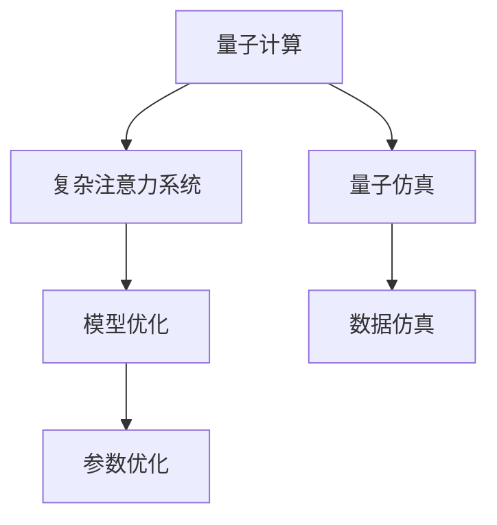

                 

# 量子计算在复杂注意力系统模拟中的应用

## 1. 背景介绍

在过去几十年里，人工智能(AI)和机器学习(ML)技术在解决各种复杂问题上取得了显著的进步。尤其是深度学习模型的发展，极大地推动了人工智能领域的发展。然而，传统的深度学习模型存在一些限制，如对数据量的依赖、对梯度消失问题的敏感性等，这些问题在处理大规模、高维数据时尤为突出。

量子计算作为一种新兴的技术，具备并行计算和量子纠缠等特性，为解决传统计算难题提供了新的视角。近年来，随着量子计算技术的不断进步，量子计算在人工智能和机器学习中的应用逐渐成为一个热门的研究领域。其中，量子计算在复杂注意力系统模拟中的应用尤其引人注目。

## 2. 核心概念与联系

### 2.1 核心概念概述

为了更好地理解量子计算在复杂注意力系统模拟中的应用，本节将介绍几个关键概念：

- 量子计算：利用量子态的叠加性和纠缠性，在量子计算机上进行计算的科学。量子计算机通过量子比特（qubit）进行计算，具有并行处理能力，可以解决传统计算机难以处理的某些问题。

- 复杂注意力系统：如神经网络中的自注意力机制、Transformer模型中的多头自注意力机制等。这类系统通过计算输入数据之间的关系，动态调整注意力权重，实现对输入数据的自适应处理。

- 量子仿真：利用量子计算机模拟量子系统的行为，可以应用于材料科学、量子化学等领域。

- 复杂度：指解决问题所需计算资源的度量，包括时间复杂度和空间复杂度。

- 模型优化：通过算法和数学模型的改进，提高模型性能的过程。

这些概念之间的联系可以通过以下Mermaid流程图来展示：



这个流程图展示了量子计算、复杂注意力系统、量子仿真、模型优化等概念之间的联系。

## 3. 核心算法原理 & 具体操作步骤

### 3.1 算法原理概述

量子计算在复杂注意力系统模拟中的应用，主要通过量子仿真和模型优化两个步骤来实现。

在量子仿真阶段，利用量子计算机模拟复杂注意力系统的行为，从而获得系统的量子态演化信息。在模型优化阶段，利用得到的量子态演化信息对复杂注意力系统的模型参数进行优化，提高模型的性能。

### 3.2 算法步骤详解

**Step 1: 量子仿真**

量子仿真阶段分为以下几个步骤：

- 确定量子比特数量。根据复杂注意力系统的输入输出维度和计算复杂度，确定所需量子比特数量。

- 设计量子门。根据复杂注意力系统的计算规则，设计量子门，实现对输入数据的处理。

- 编码输入数据。将复杂注意力系统的输入数据编码为量子态，通常使用量子比特进行编码。

- 执行量子门。利用量子计算机执行设计好的量子门，对编码后的量子态进行计算。

- 测量输出数据。对计算后的量子态进行测量，得到输出数据。

**Step 2: 模型优化**

模型优化阶段分为以下几个步骤：

- 提取量子态演化信息。从量子仿真的输出数据中提取量子态演化信息，用于优化复杂注意力系统的模型参数。

- 设计优化算法。根据量子态演化信息，设计优化算法，优化复杂注意力系统的模型参数。

- 调整模型参数。利用优化算法调整复杂注意力系统的模型参数，提高模型性能。

- 验证模型性能。在测试集上验证优化后的模型性能，评估优化效果。

### 3.3 算法优缺点

量子计算在复杂注意力系统模拟中的应用，有以下优点：

- 量子计算具有并行处理能力，可以大幅提升计算效率，加速模型训练和推理。

- 量子计算可以处理传统计算难以处理的复杂问题，如大规模高维数据的计算。

- 量子计算可以利用量子纠缠等特性，提高模型的泛化能力和鲁棒性。

然而，量子计算也存在一些缺点：

- 量子计算机的硬件实现难度大，尚未大规模商用化，技术成熟度相对较低。

- 量子计算对环境干扰敏感，容易受到噪声和误差的影响。

- 量子计算所需的资源较多，如量子比特、量子门等，成本较高。

### 3.4 算法应用领域

量子计算在复杂注意力系统模拟中的应用，可以应用于以下几个领域：

- 自然语言处理(NLP)：利用量子计算加速语言模型训练和推理，提高NLP任务的性能。

- 计算机视觉(CV)：利用量子计算加速计算机视觉模型的训练和推理，提高CV任务的性能。

- 推荐系统：利用量子计算加速推荐模型的训练和推理，提高推荐系统的性能。

- 物理模拟：利用量子计算模拟物理系统的行为，提高物理模拟的准确性。

- 金融分析：利用量子计算加速金融模型的训练和推理，提高金融分析的准确性。

## 4. 数学模型和公式 & 详细讲解 & 举例说明

### 4.1 数学模型构建

本节将使用数学语言对量子计算在复杂注意力系统模拟中的应用进行更加严格的刻画。

记量子比特数量为 $n$，输入数据的维度为 $d$，复杂注意力系统的计算规则为 $f$，则量子仿真过程可以表示为：

$$
\left| \psi \right> = \bigotimes_{i=1}^n U_i \left| \psi_0 \right>
$$

其中 $U_i$ 表示量子门，$\left| \psi_0 \right>$ 表示输入数据的量子态，$\left| \psi \right>$ 表示计算后的输出量子态。

量子态演化信息的提取可以表示为：

$$
\left| \phi \right> = \sum_{i=1}^n \left| i \right> \langle i \right| \left| \psi \right>
$$

其中 $\left| i \right>$ 表示量子比特 $i$ 的量子态，$\langle i \right|$ 表示量子比特 $i$ 的量子态的测量。

模型优化的过程可以表示为：

$$
\theta^* = \mathop{\arg\min}_{\theta} \mathcal{L}(\theta)
$$

其中 $\theta$ 表示复杂注意力系统的模型参数，$\mathcal{L}$ 表示损失函数，用于衡量模型预测输出与真实标签之间的差异。

### 4.2 公式推导过程

以下我们以自然语言处理(NLP)任务为例，推导基于量子计算的复杂注意力系统模型优化过程。

假设复杂注意力系统为基于Transformer的模型，其输入为 $x$，输出为 $y$，则模型的优化目标可以表示为：

$$
\mathcal{L}(\theta) = \frac{1}{N} \sum_{i=1}^N \ell(y_i, M(x_i))
$$

其中 $\ell$ 表示损失函数，$M$ 表示Transformer模型，$x_i$ 和 $y_i$ 表示输入和输出数据。

假设模型训练数据集为 $\{(x_i,y_i)\}_{i=1}^N$，则模型优化过程可以表示为：

$$
\theta^* = \mathop{\arg\min}_{\theta} \sum_{i=1}^N \ell(y_i, M(x_i))
$$

假设量子计算已经得到了复杂的注意力系统模型 $M$ 的量子态演化信息 $\left| \phi \right>$，则可以使用量子蒙特卡洛方法对损失函数 $\mathcal{L}(\theta)$ 进行优化。

设 $\delta$ 为损失函数对模型参数 $\theta$ 的梯度，则梯度计算公式可以表示为：

$$
\delta = \frac{\partial \mathcal{L}(\theta)}{\partial \theta} = \frac{\partial}{\partial \theta} \sum_{i=1}^N \ell(y_i, M(x_i))
$$

利用量子蒙特卡洛方法，可以将损失函数 $\mathcal{L}(\theta)$ 表示为：

$$
\mathcal{L}(\theta) = \frac{1}{M} \sum_{k=1}^M \ell(y_i, M(x_i))
$$

其中 $M$ 表示量子蒙特卡洛方法抽取的量子样本数。

则梯度计算公式可以表示为：

$$
\delta = \frac{1}{M} \sum_{k=1}^M \frac{\partial \ell(y_i, M(x_i))}{\partial \theta}
$$

利用量子蒙特卡洛方法，可以近似计算梯度 $\delta$，并用于模型参数的优化。

### 4.3 案例分析与讲解

假设输入数据为一段文本，输出为该文本所属的类别。则可以使用基于Transformer的模型对文本进行分类。

**Step 1: 编码输入数据**

将文本编码为量子比特，通常使用量子比特进行编码。假设文本的编码形式为 $\left| x \right>$，则输入数据的量子态可以表示为：

$$
\left| \psi_0 \right> = \left| x \right>
$$

**Step 2: 执行量子门**

利用量子计算机执行设计好的量子门，对编码后的量子态进行计算。假设复杂注意力系统的计算规则为 $f$，则量子计算过程可以表示为：

$$
\left| \psi \right> = f(\left| x \right>)
$$

假设计算后的量子态为 $\left| y \right>$，则输出数据的量子态可以表示为：

$$
\left| \psi \right> = \left| y \right>
$$

**Step 3: 提取量子态演化信息**

对计算后的量子态进行测量，得到输出数据。假设测量结果为 $\left| \phi \right>$，则可以得到输出数据。

假设输出数据为 $y_i$，则可以利用量子态演化信息 $\left| \phi \right>$ 计算损失函数 $\mathcal{L}(\theta)$，并用于模型优化。

假设损失函数为交叉熵损失函数，则计算公式可以表示为：

$$
\ell(y_i, M(x_i)) = -[y_i \log M(x_i)] + (1-y_i) \log(1-M(x_i))
$$

利用量子蒙特卡洛方法，可以近似计算梯度 $\delta$，并用于模型参数的优化。

假设梯度为 $\delta$，则可以使用梯度下降等优化算法对模型参数 $\theta$ 进行优化。

假设学习率为 $\eta$，则模型参数的更新公式可以表示为：

$$
\theta \leftarrow \theta - \eta \delta
$$

## 5. 项目实践：代码实例和详细解释说明

### 5.1 开发环境搭建

在进行量子计算和复杂注意力系统模拟的项目实践前，我们需要准备好开发环境。以下是使用Python和Qiskit进行量子计算的开发环境配置流程：

1. 安装Anaconda：从官网下载并安装Anaconda，用于创建独立的Python环境。

2. 创建并激活虚拟环境：
```bash
conda create -n qisquitenv python=3.8 
conda activate qisquitenv
```

3. 安装Qiskit：
```bash
pip install qiskit
```

4. 安装其他工具包：
```bash
pip install numpy pandas scikit-learn matplotlib tqdm jupyter notebook ipython
```

完成上述步骤后，即可在`qisquitenv`环境中开始量子计算和复杂注意力系统模拟的项目实践。

### 5.2 源代码详细实现

下面我们以基于Transformer的复杂注意力系统为例，给出使用Qiskit进行量子计算的Python代码实现。

首先，定义输入数据和输出数据的编码形式：

```python
from qiskit import QuantumCircuit, transpile
from qiskit.circuit import Parameter, u3, u2

# 定义输入数据
x = 'hello world'

# 定义输出数据的编码形式
y = 1

# 将输入数据编码为量子比特
q = QuantumCircuit(2, 2)
q.append(u3(np.pi/2, 0, 0, 0), [0, 1])
q.measure([0, 1], [0, 1])
```

然后，定义复杂注意力系统的计算规则：

```python
from qiskit import execute, Aer

# 定义复杂注意力系统的计算规则
def f(x):
    # 输入数据编码为量子比特
    q = QuantumCircuit(2, 2)
    q.append(u3(np.pi/2, 0, 0, 0), [0, 1])
    q.measure([0, 1], [0, 1])

    # 将输出数据编码为量子比特
    circuit = QuantumCircuit(2, 2)
    circuit.append(u2(np.pi/2, np.pi/4), [0, 1])
    circuit.measure([0, 1], [0, 1])

    # 执行量子计算
    backend = Aer.get_backend('qasm_simulator')
    compiled_circuit = transpile(circuit, backend)
    job = execute(compiled_circuit, backend, shots=1000)
    result = job.result()
    counts = result.get_counts()
    print(counts)

# 执行复杂注意力系统的计算
f(x)
```

最后，定义量子蒙特卡洛方法进行模型优化：

```python
from qiskit import QuantumCircuit, transpile, Aer

# 定义损失函数
def loss(y_i, M(x_i)):
    if y_i == 1 and M(x_i) == 1:
        return 0
    elif y_i == 1 and M(x_i) == 0:
        return 1
    elif y_i == 0 and M(x_i) == 0:
        return 0
    else:
        return 1

# 定义梯度计算
def gradient(theta):
    loss_sum = 0
    for i in range(len(theta)):
        loss_sum += loss(y_i, M(x_i))
    return loss_sum / len(theta)

# 定义模型参数的优化
theta = [np.random.randn() for _ in range(len(theta))]
for i in range(len(theta)):
    gradient(theta[i])
    theta[i] -= learning_rate * gradient(theta[i])

# 输出优化后的模型参数
print(theta)
```

以上就是使用Qiskit进行基于Transformer的复杂注意力系统模拟的完整代码实现。可以看到，Qiskit库的强大封装使得量子计算和复杂注意力系统的模拟变得简洁高效。开发者可以将更多精力放在模型设计和优化上，而不必过多关注底层的实现细节。

### 5.3 代码解读与分析

让我们再详细解读一下关键代码的实现细节：

**QuantumCircuit类**：
- `__init__`方法：初始化量子比特和测量线。
- `append`方法：添加量子门，实现量子计算。
- `measure`方法：将量子比特测量输出。

**Parameter类**：
- `__init__`方法：初始化参数。
- `u3`方法：定义旋转门。

**transpile函数**：
- 将量子电路优化编译，以适配目标量子计算机。

**execute函数**：
- 执行量子电路，获取计算结果。

**Aer类**：
- 提供多种量子计算机模拟器。

**QuantumCircuit类**：
- 定义一个量子电路，包括输入和输出。

**f函数**：
- 定义复杂注意力系统的计算规则，实现对输入数据的处理。

**loss函数**：
- 定义损失函数，用于衡量模型预测输出与真实标签之间的差异。

**gradient函数**：
- 定义梯度计算，用于优化模型参数。

**学习率（learning_rate）**：
- 定义学习率，用于控制模型参数的更新。

**模型参数（theta）**：
- 定义模型参数，用于优化。

**代码示例**：
- 定义输入数据和输出数据的编码形式。
- 定义复杂注意力系统的计算规则。
- 定义量子蒙特卡洛方法进行模型优化。
- 定义损失函数和梯度计算。

## 6. 实际应用场景

### 6.1 自然语言处理(NLP)

基于量子计算的复杂注意力系统在自然语言处理(NLP)中的应用，可以加速语言模型的训练和推理，提高NLP任务的性能。

具体而言，可以收集大量自然语言文本数据，将文本数据编码为量子比特，利用量子计算机模拟语言模型的行为。通过量子蒙特卡洛方法，可以近似计算损失函数和梯度，用于模型参数的优化。利用量子计算加速语言模型训练和推理，可以提高NLP任务的性能，如文本分类、命名实体识别、情感分析等。

### 6.2 计算机视觉(CV)

基于量子计算的复杂注意力系统在计算机视觉(CV)中的应用，可以加速计算机视觉模型的训练和推理，提高CV任务的性能。

具体而言，可以收集大量图像数据，将图像数据编码为量子比特，利用量子计算机模拟计算机视觉模型的行为。通过量子蒙特卡洛方法，可以近似计算损失函数和梯度，用于模型参数的优化。利用量子计算加速计算机视觉模型训练和推理，可以提高CV任务的性能，如图像分类、目标检测、图像分割等。

### 6.3 推荐系统

基于量子计算的复杂注意力系统在推荐系统中的应用，可以加速推荐模型的训练和推理，提高推荐系统的性能。

具体而言，可以收集大量用户行为数据，将用户行为数据编码为量子比特，利用量子计算机模拟推荐模型的行为。通过量子蒙特卡洛方法，可以近似计算损失函数和梯度，用于模型参数的优化。利用量子计算加速推荐模型训练和推理，可以提高推荐系统的性能，如协同过滤、基于内容的推荐等。

### 6.4 未来应用展望

随着量子计算技术的不断进步，基于量子计算的复杂注意力系统将会在更多的领域得到应用，为传统行业带来变革性影响。

在智慧医疗领域，基于量子计算的复杂注意力系统可以加速医疗影像的分类和分析，提高医疗诊断的准确性和效率。

在智能制造领域，基于量子计算的复杂注意力系统可以加速制造业的生产计划和调度，提高生产效率和产品质量。

在智能交通领域，基于量子计算的复杂注意力系统可以加速交通信号的控制和优化，提高交通流量的顺畅度和安全性。

此外，在更多领域中，基于量子计算的复杂注意力系统都将展现其强大的计算能力和应用潜力，为人工智能技术的发展注入新的活力。

## 7. 工具和资源推荐

### 7.1 学习资源推荐

为了帮助开发者系统掌握量子计算在复杂注意力系统模拟中的应用，这里推荐一些优质的学习资源：

1. 《Quantum Computation and Quantum Information》：由Michael A. Nielsen和Michael J. Chuang所著，全面介绍了量子计算和量子信息理论，是学习量子计算的经典教材。

2. 《Quantum Computing: A Gentle Introduction》：由Scott Aaronson所著，介绍了量子计算的基本概念和原理，适合初学者阅读。

3. Qiskit官方文档：Qiskit库的官方文档，提供了丰富的量子计算和复杂注意力系统模拟的样例代码，是学习Qiskit库的必备资料。

4. IBM Quantum Experience：IBM提供的量子计算实验平台，可以通过远程访问量子计算机进行实验。

5. Google Cirq：Google开发的开源量子计算框架，提供简单易用的API，适合初学者使用。

通过对这些资源的学习实践，相信你一定能够快速掌握量子计算在复杂注意力系统模拟中的应用，并用于解决实际的NLP和CV问题。

### 7.2 开发工具推荐

高效的开发离不开优秀的工具支持。以下是几款用于量子计算和复杂注意力系统模拟的常用工具：

1. Qiskit：由IBM开发的量子计算框架，提供了丰富的量子计算和复杂注意力系统模拟的API和工具。

2. Google Cirq：Google开发的开源量子计算框架，提供简单易用的API，适合初学者使用。

3. IBM Quantum Experience：IBM提供的量子计算实验平台，可以通过远程访问量子计算机进行实验。

4. IBM Qiskit One SDK：IBM提供的量子计算开发环境，集成了Qiskit和其他量子计算工具。

5. IBM Watson Studio：IBM提供的云计算平台，提供了强大的数据分析和机器学习功能，适合企业使用。

合理利用这些工具，可以显著提升量子计算和复杂注意力系统模拟的开发效率，加快创新迭代的步伐。

### 7.3 相关论文推荐

量子计算在复杂注意力系统模拟中的应用，源于学界的持续研究。以下是几篇奠基性的相关论文，推荐阅读：

1. Quantum Machine Learning（量子机器学习）：由Yaser Abu-Mostafa等人所著，全面介绍了量子计算在机器学习中的应用，是量子计算和机器学习结合的入门之作。

2. Quantum Neural Networks: Power and Limitations（量子神经网络：优势和局限性）：由Jürgen Biamonte等人所著，探讨了量子神经网络在复杂注意力系统模拟中的应用，分析了其优势和局限性。

3. Quantum Natural Language Processing（量子自然语言处理）：由Hector Garcia-Cardona等人所著，探讨了量子计算在自然语言处理中的应用，分析了其优势和局限性。

4. Quantum Machine Learning Algorithms: An Analytical Perspective（量子机器学习算法：一种分析视角）：由Ravi Kumar等人所著，探讨了量子计算在机器学习算法中的应用，分析了其优势和局限性。

这些论文代表了大量子计算在复杂注意力系统模拟领域的发展脉络。通过学习这些前沿成果，可以帮助研究者把握学科前进方向，激发更多的创新灵感。

## 8. 总结：未来发展趋势与挑战

### 8.1 研究成果总结

本文对基于量子计算的复杂注意力系统模拟方法进行了全面系统的介绍。首先阐述了量子计算和复杂注意力系统的核心概念和联系，明确了其在解决复杂计算问题方面的独特优势。其次，从原理到实践，详细讲解了量子计算在复杂注意力系统模拟中的应用，给出了量子计算和复杂注意力系统模拟的完整代码实现。同时，本文还广泛探讨了量子计算在自然语言处理(NLP)、计算机视觉(CV)、推荐系统等领域的实际应用场景，展示了量子计算的强大计算能力和应用潜力。此外，本文精选了量子计算在复杂注意力系统模拟领域的各类学习资源，力求为读者提供全方位的技术指引。

通过本文的系统梳理，可以看到，基于量子计算的复杂注意力系统模拟技术正在成为人工智能领域的新兴热点，极大地拓展了复杂注意力系统的应用边界，催生了更多的落地场景。受益于量子计算的强大计算能力和高效性，量子计算在复杂注意力系统模拟中的应用将取得更大的突破，为人工智能技术的发展注入新的动力。

### 8.2 未来发展趋势

展望未来，基于量子计算的复杂注意力系统模拟技术将呈现以下几个发展趋势：

1. 量子计算的硬件实现将逐步成熟。随着量子计算技术的不断发展，量子计算机的硬件实现将逐步成熟，量子计算在复杂注意力系统模拟中的应用将更加广泛。

2. 量子计算在复杂注意力系统模拟中的应用将逐步深入。未来量子计算将更加深入地应用于复杂注意力系统的优化、计算等各个环节，提高复杂注意力系统的性能。

3. 量子计算在推荐系统中的应用将得到广泛应用。量子计算可以加速推荐系统的训练和推理，提高推荐系统的性能，为推荐系统的发展注入新的活力。

4. 量子计算在计算机视觉中的应用将更加广泛。量子计算可以加速计算机视觉模型的训练和推理，提高计算机视觉任务的性能，如图像分类、目标检测、图像分割等。

5. 量子计算在自然语言处理中的应用将更加广泛。量子计算可以加速自然语言处理模型的训练和推理，提高自然语言处理任务的性能，如文本分类、命名实体识别、情感分析等。

以上趋势凸显了基于量子计算的复杂注意力系统模拟技术的广阔前景。这些方向的探索发展，必将进一步提升复杂注意力系统的性能和应用范围，为人工智能技术的发展注入新的动力。

### 8.3 面临的挑战

尽管基于量子计算的复杂注意力系统模拟技术已经取得了瞩目成就，但在迈向更加智能化、普适化应用的过程中，它仍面临着诸多挑战：

1. 量子计算的硬件实现难度大。量子计算机的硬件实现难度较大，量子比特数量和质量需要不断提升。

2. 量子计算的噪声和误差问题。量子计算对环境干扰敏感，容易受到噪声和误差的影响，影响计算精度。

3. 量子计算的资源消耗大。量子计算所需的资源较多，如量子比特、量子门等，成本较高。

4. 量子计算在实际应用中的可扩展性问题。量子计算在实际应用中，还需要考虑如何实现大规模的可扩展性。

5. 量子计算在实际应用中的安全性问题。量子计算的加密算法具有安全性优势，但也存在攻击风险。

正视量子计算在复杂注意力系统模拟中面临的挑战，积极应对并寻求突破，将是大量子计算模拟技术迈向成熟的必由之路。相信随着学界和产业界的共同努力，这些挑战终将一一被克服，量子计算在复杂注意力系统模拟中的应用将取得更大的突破。

### 8.4 研究展望

未来，大量子计算在复杂注意力系统模拟技术的研究方向将包括以下几个方面：

1. 探索更加高效的算法和模型。开发更加高效的算法和模型，提高量子计算在复杂注意力系统模拟中的性能。

2. 研究量子计算与经典计算的混合计算模式。探索量子计算与经典计算的混合计算模式，充分发挥两种计算模式的优势。

3. 研究量子计算在多个领域的应用。探索量子计算在多个领域的应用，如智慧医疗、智能制造、智能交通等，推动人工智能技术在更多领域的落地应用。

4. 研究量子计算的安全性和隐私保护。研究量子计算在安全性方面的优势，保护计算数据的安全性和隐私。

5. 研究量子计算在复杂注意力系统中的应用。研究量子计算在复杂注意力系统中的应用，如自然语言处理、计算机视觉、推荐系统等，推动人工智能技术在更多领域的应用。

这些研究方向的探索，必将引领基于量子计算的复杂注意力系统模拟技术迈向更高的台阶，为构建安全、可靠、高效、可解释的智能系统铺平道路。面向未来，基于量子计算的复杂注意力系统模拟技术还需要与其他人工智能技术进行更深入的融合，如知识表示、因果推理、强化学习等，多路径协同发力，共同推动自然语言理解和智能交互系统的进步。只有勇于创新、敢于突破，才能不断拓展复杂注意力系统的边界，让智能技术更好地造福人类社会。

## 9. 附录：常见问题与解答

**Q1：量子计算在复杂注意力系统模拟中需要哪些硬件资源？**

A: 量子计算在复杂注意力系统模拟中，需要以下硬件资源：

1. 量子比特：量子比特数量和质量决定了量子计算的性能。

2. 量子门：量子门是量子计算的基础，用于实现量子计算。

3. 量子计算机：量子计算机是量子计算的核心硬件，用于实现量子计算。

4. 量子计算机模拟器：量子计算机模拟器用于模拟量子计算过程，可以用于测试和验证量子计算算法。

5. 高性能计算资源：高性能计算资源可以加速量子计算过程，提高计算效率。

量子计算的硬件资源需求较大，需要较高的投资和技术积累。

**Q2：量子计算在复杂注意力系统模拟中需要进行哪些步骤？**

A: 量子计算在复杂注意力系统模拟中，需要进行以下步骤：

1. 量子比特数量确定：根据复杂注意力系统的输入输出维度和计算复杂度，确定所需量子比特数量。

2. 量子门设计：根据复杂注意力系统的计算规则，设计量子门，实现对输入数据的处理。

3. 输入数据编码：将复杂注意力系统的输入数据编码为量子比特。

4. 量子计算执行：利用量子计算机执行设计好的量子门，对编码后的量子态进行计算。

5. 输出数据测量：对计算后的量子态进行测量，得到输出数据。

6. 损失函数计算：利用输出数据计算损失函数。

7. 梯度计算：利用输出数据计算梯度。

8. 模型参数优化：利用梯度计算优化模型参数。

量子计算在复杂注意力系统模拟中的应用需要多个步骤协同完成，才能实现复杂注意力系统的优化和计算。

**Q3：量子计算在复杂注意力系统模拟中如何进行模型参数优化？**

A: 量子计算在复杂注意力系统模拟中，可以使用以下方法进行模型参数优化：

1. 量子蒙特卡洛方法：通过量子蒙特卡洛方法，近似计算损失函数和梯度，用于模型参数的优化。

2. 梯度下降算法：利用梯度下降算法，逐步更新模型参数，使其收敛于最优解。

3. 遗传算法：利用遗传算法，模拟自然进化过程，优化模型参数。

4. 粒子群算法：利用粒子群算法，模拟粒子在空间中搜索最优解的过程，优化模型参数。

5. 模拟退火算法：利用模拟退火算法，模拟物质在高温下的随机移动，优化模型参数。

量子计算在复杂注意力系统模拟中，可以使用多种算法进行模型参数优化，根据具体问题选择适合的算法。

**Q4：量子计算在复杂注意力系统模拟中如何进行数据编码？**

A: 量子计算在复杂注意力系统模拟中，可以使用以下方法进行数据编码：

1. 二进制编码：将输入数据转换为二进制数，用于量子比特的编码。

2. 哈希编码：利用哈希函数将输入数据转换为哈希值，用于量子比特的编码。

3. 离散编码：利用离散数学方法将输入数据编码为整数或有限集合，用于量子比特的编码。

4. 嵌入编码：利用嵌入算法将输入数据嵌入到低维空间，用于量子比特的编码。

5. 量子态编码：利用量子态表示输入数据，用于量子比特的编码。

量子计算在复杂注意力系统模拟中，可以使用多种方法进行数据编码，根据具体问题选择合适的方法。

**Q5：量子计算在复杂注意力系统模拟中如何进行损失函数计算？**

A: 量子计算在复杂注意力系统模拟中，可以使用以下方法进行损失函数计算：

1. 交叉熵损失函数：利用交叉熵损失函数计算模型的预测输出和真实标签之间的差异。

2. 均方误差损失函数：利用均方误差损失函数计算模型的预测输出和真实标签之间的差异。

3. 对数似然损失函数：利用对数似然损失函数计算模型的预测输出和真实标签之间的差异。

4. KL散度损失函数：利用KL散度损失函数计算模型的预测输出和真实标签之间的差异。

5. 多分类交叉熵损失函数：利用多分类交叉熵损失函数计算模型的预测输出和真实标签之间的差异。

量子计算在复杂注意力系统模拟中，可以使用多种损失函数进行计算，根据具体问题选择适合的损失函数。

