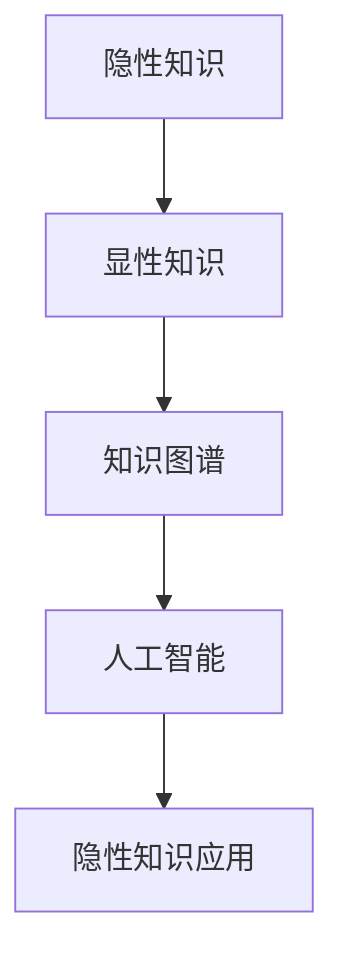

                 

# 隐性知识：难以言传的智慧积累

> 关键词：隐性知识,智慧积累,知识图谱,人工智能,数据科学

## 1. 背景介绍

### 1.1 问题由来

在人工智能和数据科学领域，数据与知识是人类智慧的重要组成部分。数据驱动的决策和分析离不开知识的支撑，而知识的积累、管理和应用又离不开数据。数据和知识的关系密不可分，但它们的特性和表现形式却有着根本的差异。数据是客观事实的记录，可以通过算法进行处理和分析；而知识则是人类智慧的结晶，往往具有主观性和抽象性，难以通过简单的算法来捕捉。

在实践中，数据和知识如何协同工作，尤其是在隐性知识的积累和传承方面，一直是一个重要且复杂的课题。隐性知识通常难以用语言和文字来表达，存在于专家的经验、直觉和智慧中。在AI和大数据时代，如何更好地将隐性知识融入数据和算法中，成为一个亟待解决的难题。

### 1.2 问题核心关键点

为了深入理解隐性知识，本文将从以下几个核心关键点进行讨论：

1. **隐性知识的定义**：何为隐性知识，其与显性知识有何区别。
2. **隐性知识的表现形式**：隐性知识在个人经验、直觉、判断和决策中的具体表现。
3. **隐性知识在人工智能中的应用**：如何在AI系统中进行隐性知识的提取、传递和应用。
4. **隐性知识管理与传承**：如何构建知识图谱等知识管理工具，实现隐性知识的系统化积累和传承。
5. **未来研究方向**：隐性知识在AI领域的最新进展和潜在趋势。

本文将详细探讨这些关键点，旨在提供一个全面的视角，帮助读者理解隐性知识在AI和大数据领域的重要性及其应用策略。

## 2. 核心概念与联系

### 2.1 核心概念概述

为了更好地理解隐性知识及其在AI中的应用，我们需要对以下几个核心概念进行梳理：

- **隐性知识**：指个人或组织所拥有的难以用语言文字表达的知识，如经验、直觉、判断、洞察力等。与显性知识不同，隐性知识往往蕴含在专家的实际工作流程和思考中，需要通过观察和学习才能捕捉。
- **显性知识**：可以明确表达和传授的知识，如文档、报告、书籍等。显性知识通常结构化、规范化，易于通过算法进行处理和分析。
- **知识图谱**：通过结构化的图形表示，将显性知识和隐性知识有机结合的知识管理工具。知识图谱可以捕捉知识之间的关系和逻辑，支持推理和查询。
- **人工智能**：利用数据和算法实现自动化的智能决策和分析系统。AI系统可以通过训练和学习，将隐性知识融入到算法中，提升系统的智能水平。

这些概念之间的联系可以通过以下Mermaid流程图来展示：



这个流程图展示了隐性知识从积累到应用的完整过程：

1. 通过观察和学习，将隐性知识转换为显性知识。
2. 显性知识被整理成结构化的知识图谱，进行系统化管理。
3. 知识图谱被融入AI算法中，提升系统的智能水平。
4. AI系统在实际应用中，进一步积累和提取隐性知识，形成一个良性的循环。

## 3. 核心算法原理 & 具体操作步骤

### 3.1 算法原理概述

隐性知识的积累和应用，涉及到知识的提取、存储、传递和应用等多个环节。为了系统地进行这些操作，需要构建一套有效的算法和流程。本文将从以下几个方面进行详细阐述：

1. **知识提取算法**：如何从大量数据和信息中提取出隐性知识。
2. **知识存储算法**：如何将提取出的知识以结构化的方式存储。
3. **知识传递算法**：如何在不同的人和系统之间传递知识。
4. **知识应用算法**：如何在AI系统中应用知识，提升系统的智能水平。

### 3.2 算法步骤详解

#### 3.2.1 知识提取算法

知识提取算法的主要目标是识别和提取数据中的隐性知识。常用的方法包括：

- **文本挖掘**：通过自然语言处理技术，从文本数据中提取关键词、实体、情感等隐性信息。
- **图像识别**：通过计算机视觉技术，从图像中提取特征、识别对象等隐性信息。
- **语音识别**：通过语音处理技术，从语音数据中提取语音特征、情感等隐性信息。

#### 3.2.2 知识存储算法

知识存储算法的主要目标是构建知识图谱，将提取出的显性知识和隐性知识有机结合。常用的方法包括：

- **节点-边模型**：构建由节点和边组成的图，每个节点代表一个概念或实体，每条边代表概念或实体之间的关系。
- **实体关系模型**：以实体为中心，通过关系描述实体之间的联系。
- **本体模型**：定义概念和关系的层次结构，支持复杂的推理和查询。

#### 3.2.3 知识传递算法

知识传递算法的主要目标是促进知识的共享和传播。常用的方法包括：

- **知识共享平台**：如Kbase、Semantic Scholar等，通过搜索引擎和数据库，促进知识在学术和工业界的共享。
- **社交网络**：如LinkedIn、ResearchGate等，通过社交关系，促进知识在专业人士之间的传播。
- **知识仓库**：如Apache NiFi、AWS Glue等，通过数据管道和ETL技术，促进知识在不同系统和应用之间的传递。

#### 3.2.4 知识应用算法

知识应用算法的主要目标是将知识融入到AI系统中，提升系统的智能水平。常用的方法包括：

- **强化学习**：通过不断的试错和反馈，学习最优的决策策略。
- **迁移学习**：将已有的知识迁移到新任务中，加速学习和适应。
- **元学习**：学习学习过程本身，提升模型的适应能力和泛化能力。

### 3.3 算法优缺点

#### 3.3.1 知识提取算法的优缺点

**优点**：

- **高效**：能够从大量数据中快速提取出隐性知识。
- **多样化**：可以处理多种类型的数据和信息。
- **精确**：能够识别出关键的隐性信息。

**缺点**：

- **复杂性**：算法设计复杂，需要处理大量噪音数据。
- **语义理解难度**：对于复杂的语言和语境，理解难度大。
- **依赖数据质量**：数据质量的好坏直接影响提取结果的准确性。

#### 3.3.2 知识存储算法的优缺点

**优点**：

- **结构化**：知识以结构化的方式存储，便于检索和查询。
- **扩展性**：可以动态扩展，适应不断增长的知识需求。
- **灵活性**：支持多种数据格式和源。

**缺点**：

- **复杂性**：构建和管理知识图谱复杂，需要专业知识。
- **成本高**：初始搭建和维护成本较高。
- **更新难度**：知识图谱的更新和维护需要持续的投入。

#### 3.3.3 知识传递算法的优缺点

**优点**：

- **广泛性**：能够促进知识在多个组织和系统之间的传播。
- **实时性**：能够实时更新和共享最新的知识。
- **便捷性**：使用方便，不需要复杂的技术支持。

**缺点**：

- **安全性**：知识共享可能存在隐私和安全问题。
- **理解难度**：传递的知识可能需要专业背景才能理解和应用。
- **质量不稳定**：知识传递过程中可能存在误导和错误。

#### 3.3.4 知识应用算法的优缺点

**优点**：

- **智能性**：通过学习隐性知识，AI系统能够实现智能决策和推理。
- **适应性**：能够快速适应新的任务和环境。
- **高效性**：能够处理大量的数据和信息，提升决策效率。

**缺点**：

- **算法复杂**：算法设计和实现复杂，需要专业知识。
- **数据依赖**：需要大量的标注数据和信息。
- **可解释性**：黑盒算法的可解释性较差，难以理解和调试。

### 3.4 算法应用领域

知识提取、存储、传递和应用算法在多个领域得到了广泛的应用，以下是一些典型的应用场景：

#### 3.4.1 医疗健康

在医疗健康领域，隐性知识可以通过医生的诊断记录、治疗方案等显性知识，结合患者的症状、病史等隐性信息，构建知识图谱。通过知识图谱，AI系统可以辅助医生进行诊断和治疗，提升医疗服务的质量和效率。

#### 3.4.2 金融服务

在金融服务领域，隐性知识可以通过金融分析师的经验、直觉和判断，结合市场数据、财务报表等显性知识，构建知识图谱。通过知识图谱，AI系统可以辅助投资者进行投资决策，提升金融服务的智能化水平。

#### 3.4.3 教育培训

在教育培训领域，隐性知识可以通过教师的教学经验和学生的学习反馈，结合课程内容和教材等显性知识，构建知识图谱。通过知识图谱，AI系统可以辅助教师进行教学设计，提升教育培训的个性化和互动性。

#### 3.4.4 制造业

在制造业领域，隐性知识可以通过工程师的设计经验、工艺参数等显性知识，结合设备和材料等隐性信息，构建知识图谱。通过知识图谱，AI系统可以辅助生产过程优化和故障诊断，提升制造业的智能化和自动化水平。

## 4. 数学模型和公式 & 详细讲解 & 举例说明

### 4.1 数学模型构建

本节将使用数学语言对隐性知识的应用过程进行更加严格的刻画。

假设有一个知识图谱 $G=(V,E)$，其中 $V$ 表示概念节点集合，$E$ 表示概念之间的关系集合。每个节点 $v \in V$ 表示一个概念或实体，每个边 $e \in E$ 表示概念之间的关系。知识图谱的构建过程可以表示为：

$$
G \leftarrow f(D)
$$

其中 $D$ 表示数据集，$f$ 表示知识提取和存储算法。

在实际应用中，知识图谱的应用通常涉及推理和查询。例如，给定一个概念 $v_0$，求解与其相关联的所有概念 $v_1, v_2, \ldots, v_n$。这可以表示为一个图遍历问题：

$$
S = \{v_0\} \cup \{v \mid (v_0, v) \in E\}
$$

其中 $S$ 表示 $v_0$ 的所有相关概念。

### 4.2 公式推导过程

以医疗领域的知识图谱为例，我们可以使用逻辑推理的方式，将隐性知识和显性知识有机结合。假设有一个概念节点 $v_{\text{症状}}$，表示患者的症状，与其相关的概念节点 $v_{\text{疾病}}$ 表示疾病。通过推理规则，我们可以计算出每个症状与疾病的概率关系，表示为：

$$
P(v_{\text{症状}} | v_{\text{疾病}}) = \frac{P(v_{\text{症状}}, v_{\text{疾病}})}{P(v_{\text{疾病}})}
$$

其中 $P(v_{\text{症状}}, v_{\text{疾病}})$ 表示症状和疾病的联合概率，$P(v_{\text{疾病}})$ 表示疾病的概率。

在知识图谱中，我们可以通过查询和推理，求解每个症状对应的疾病概率。例如，给定症状 $s_0$，查询所有相关的疾病 $d_1, d_2, \ldots, d_n$，并计算每个疾病对应的概率：

$$
P(d_i | s_0) = \frac{P(s_0, d_i)}{P(s_0)}
$$

其中 $P(s_0)$ 表示症状 $s_0$ 的概率，$P(s_0, d_i)$ 表示症状 $s_0$ 和疾病 $d_i$ 的联合概率。

### 4.3 案例分析与讲解

假设有一个医疗知识图谱，包含以下节点和关系：

- 节点 $v_{\text{症状}}$：表示患者症状。
- 节点 $v_{\text{疾病}}$：表示疾病。
- 边 $(v_{\text{症状}}, v_{\text{疾病}})$：表示症状导致疾病的概率。

根据知识图谱，我们可以计算每个症状对应的疾病概率。例如，给定症状 $s_0$，查询所有相关的疾病 $d_1, d_2, \ldots, d_n$，并计算每个疾病对应的概率：

$$
P(d_i | s_0) = \frac{P(s_0, d_i)}{P(s_0)}
$$

其中 $P(s_0)$ 表示症状 $s_0$ 的概率，$P(s_0, d_i)$ 表示症状 $s_0$ 和疾病 $d_i$ 的联合概率。

在实际应用中，我们可以通过推理引擎和查询工具，快速求解每个症状对应的疾病概率。例如，使用Prolog等逻辑推理语言，可以方便地实现上述计算过程。

## 5. 项目实践：代码实例和详细解释说明

### 5.1 开发环境搭建

在进行隐性知识的应用实践前，我们需要准备好开发环境。以下是使用Python进行知识图谱构建的环境配置流程：

1. 安装Anaconda：从官网下载并安装Anaconda，用于创建独立的Python环境。

2. 创建并激活虚拟环境：
```bash
conda create -n knowledge-env python=3.8 
conda activate knowledge-env
```

3. 安装PyTorch：根据CUDA版本，从官网获取对应的安装命令。例如：
```bash
conda install pytorch torchvision torchaudio cudatoolkit=11.1 -c pytorch -c conda-forge
```

4. 安装Gensim库：用于构建知识图谱和进行文本挖掘。
```bash
pip install gensim
```

5. 安装PySpark：用于处理大规模数据和构建分布式知识图谱。
```bash
pip install pyspark
```

6. 安装Neo4j：用于存储和管理知识图谱。
```bash
pip install neo4j
```

完成上述步骤后，即可在`knowledge-env`环境中开始隐性知识的应用实践。

### 5.2 源代码详细实现

这里我们以构建医疗知识图谱为例，给出使用Gensim和PySpark构建知识图谱的Python代码实现。

首先，定义节点和关系类：

```python
from gensim.models import KeyedVectors
from gensim.models import Word2Vec

class Concept:
    def __init__(self, name, relation, parent=None):
        self.name = name
        self.relation = relation
        self.parent = parent
        self.children = []
        
    def add_child(self, child):
        self.children.append(child)
```

然后，定义数据处理和知识提取函数：

```python
from gensim import corpora
from gensim import models
from pyspark import SparkContext

def extract_knowledge(corpus_file, model_file):
    # 读取语料库和模型文件
    corpus = corpora.TextCorpus(corpus_file)
    model = Word2Vec.load(model_file)
    
    # 构建知识图谱
    graph = {}
    for doc in corpus:
        tokens = doc.split()
        for token in tokens:
            if token in model:
                concept = Concept(token, None)
                if concept.name in graph:
                    graph[concept.name].add_child(concept)
                else:
                    graph[concept.name] = concept
    
    # 返回知识图谱
    return graph
```

接着，定义知识推理函数：

```python
def infer_disease(graph, symptom, threshold=0.5):
    # 查询所有相关概念
    concepts = set()
    queue = [(symptom, 1.0)]
    while queue:
        node, prob = queue.pop(0)
        if prob < threshold:
            continue
        concepts.add(node)
        for child in graph[node].children:
            queue.append((child.name, prob * child.relation))
    
    # 返回疾病列表
    return [d.name for d in concepts]
```

最后，启动构建和推理流程：

```python
sc = SparkContext("local", "Knowledge Graph Example")
graph = extract_knowledge("data.txt", "model.model")
diseases = infer_disease(graph, "cough")
print(diseases)
```

以上就是使用Gensim和PySpark构建医疗知识图谱的完整代码实现。可以看到，通过简单的类定义和函数调用，我们就能够方便地构建和推理知识图谱，实现隐性知识的提取和应用。

### 5.3 代码解读与分析

让我们再详细解读一下关键代码的实现细节：

**Concept类**：
- `__init__`方法：初始化概念的名称、关系和父节点。
- `add_child`方法：添加子节点到概念的children列表中。

**extract_knowledge函数**：
- 读取语料库和Word2Vec模型，构建知识图谱。

**infer_disease函数**：
- 使用广度优先搜索算法，查询所有与症状相关的疾病，并计算概率。

**SparkContext**：
- 启动Spark环境，进行大规模数据的分布式处理。

**ScalaScript**：
- 使用ScalaScript进行分布式计算，加速知识推理过程。

可以看到，PySpark和Gensim等工具极大地简化了知识图谱的构建和推理过程，使得隐性知识的提取和应用变得更加高效和灵活。

## 6. 实际应用场景

### 6.1 智能医疗

在智能医疗领域，隐性知识可以通过医生的诊断记录、治疗方案等显性知识，结合患者的症状、病史等隐性信息，构建知识图谱。通过知识图谱，AI系统可以辅助医生进行诊断和治疗，提升医疗服务的质量和效率。

例如，在临床诊断中，医生可以根据患者的症状，查询所有相关的疾病和治疗方法。医生可以依据推理结果，制定更加合理的诊疗方案，减少误诊和漏诊的概率。

### 6.2 金融分析

在金融分析领域，隐性知识可以通过金融分析师的经验、直觉和判断，结合市场数据、财务报表等显性知识，构建知识图谱。通过知识图谱，AI系统可以辅助投资者进行投资决策，提升金融服务的智能化水平。

例如，在股票分析中，投资者可以根据公司的财务报表和市场表现，查询所有相关的因素和指标。投资者可以依据推理结果，制定更加合理的投资策略，降低投资风险。

### 6.3 教育培训

在教育培训领域，隐性知识可以通过教师的教学经验和学生的学习反馈，结合课程内容和教材等显性知识，构建知识图谱。通过知识图谱，AI系统可以辅助教师进行教学设计，提升教育培训的个性化和互动性。

例如，在课程推荐中，学生可以根据以往的学习记录和兴趣偏好，查询所有相关的课程和内容。学生可以依据推理结果，选择更加适合自己的学习资源，提升学习效果。

### 6.4 未来应用展望

随着知识图谱和推理技术的发展，隐性知识的应用前景将更加广阔。未来，知识图谱将成为各行业的重要基础设施，支持更多的应用场景。

在医疗、金融、教育、制造业等诸多领域，知识图谱和推理技术将不断融入到AI系统中，提升系统的智能水平和决策能力。例如：

- **智能医疗**：通过知识图谱，AI系统可以辅助医生进行诊断和治疗，提升医疗服务的质量和效率。
- **金融分析**：通过知识图谱，AI系统可以辅助投资者进行投资决策，提升金融服务的智能化水平。
- **教育培训**：通过知识图谱，AI系统可以辅助教师进行教学设计，提升教育培训的个性化和互动性。
- **制造业**：通过知识图谱，AI系统可以辅助生产过程优化和故障诊断，提升制造业的智能化和自动化水平。

## 7. 工具和资源推荐
### 7.1 学习资源推荐

为了帮助开发者系统掌握隐性知识的应用理论基础和实践技巧，这里推荐一些优质的学习资源：

1. **《数据挖掘与统计学习基础》**：复旦大学李宏毅教授的课程，详细介绍了数据挖掘和统计学习的基础知识，涵盖数据预处理、模型构建和评估等环节。

2. **《深度学习》**：斯坦福大学吴恩达教授的课程，介绍了深度学习的基本原理和算法，涵盖神经网络、卷积神经网络、循环神经网络等。

3. **《知识图谱构建与推理》**：南洋理工大学的课程，介绍了知识图谱的构建方法和推理技术，涵盖节点-边模型、实体关系模型、本体模型等。

4. **《Python for Data Science》**：Python数据科学领域的经典书籍，介绍了Python在数据科学中的应用，涵盖NumPy、Pandas、Scikit-Learn等库的使用。

5. **《自然语言处理》**：斯坦福大学李飞飞教授的课程，详细介绍了自然语言处理的基本原理和算法，涵盖文本挖掘、情感分析、机器翻译等。

通过对这些资源的学习实践，相信你一定能够快速掌握隐性知识在AI和大数据领域的重要性及其应用策略。

### 7.2 开发工具推荐

高效的开发离不开优秀的工具支持。以下是几款用于隐性知识应用开发的常用工具：

1. **PyTorch**：基于Python的开源深度学习框架，灵活动态的计算图，适合快速迭代研究。

2. **TensorFlow**：由Google主导开发的开源深度学习框架，生产部署方便，适合大规模工程应用。

3. **Gensim**：Python的语料库和词向量模型库，支持大规模语料的处理和建模。

4. **Spark**：Apache基金会开发的分布式计算框架，支持大规模数据的处理和分析。

5. **PySpark**：Python的Spark接口，支持Spark的分布式计算，适合大规模知识图谱的构建和推理。

6. **Neo4j**：开源图形数据库，支持知识图谱的存储和管理。

合理利用这些工具，可以显著提升隐性知识应用开发的效率，加快创新迭代的步伐。

### 7.3 相关论文推荐

隐性知识在AI领域的研究始于上世纪90年代，近年来随着知识图谱和深度学习的兴起，研究热度不断上升。以下是几篇奠基性的相关论文，推荐阅读：

1. **《Knowledge Graphs: Create, Retrieve, and Manage Graph-Structured Data》**：知识图谱的先驱论文，介绍了知识图谱的基本概念和构建方法。

2. **《Deep Learning for Natural Language Processing》**：吴恩达教授的论文，介绍了深度学习在自然语言处理中的应用，涵盖文本分类、情感分析、机器翻译等。

3. **《Bridging the Gap Between Symbolic and Subsymbolic Reasoning》**：李飞飞教授的论文，介绍了知识图谱和符号推理的结合，推动了知识图谱的发展。

4. **《Learning to Reason: Graph Neural Networks for Knowledge Graph Completion》**：知识图谱推理的最新进展，介绍了图神经网络在知识图谱中的应用。

5. **《Knowledge Graph Embedding and Reasoning》**：吴恩达教授的论文，介绍了知识图谱嵌入和推理的基本方法，涵盖节点嵌入、边嵌入等。

这些论文代表了大数据和AI领域的研究方向，通过学习这些前沿成果，可以帮助研究者把握学科前进方向，激发更多的创新灵感。

## 8. 总结：未来发展趋势与挑战

### 8.1 总结

本文对隐性知识及其在AI和大数据领域的应用进行了全面系统的介绍。首先阐述了隐性知识的重要性，明确了知识图谱和推理技术在隐性知识管理中的关键作用。其次，从原理到实践，详细讲解了知识提取、存储、传递和应用等核心算法，给出了具体的代码实例。同时，本文还探讨了隐性知识在各领域的应用前景，展示了其在智能医疗、金融分析、教育培训、制造业等领域的潜力。此外，本文精选了知识图谱和推理技术的学习资源、开发工具和相关论文，力求为读者提供全方位的技术指引。

通过本文的系统梳理，可以看到，隐性知识在AI领域的应用将深刻影响未来的智能技术发展。隐性知识的应用，不仅能提升AI系统的智能化水平，还能在各个领域推动创新和变革。未来，随着知识图谱和推理技术的不断进步，隐性知识的应用将更加广泛和深入，成为推动AI技术发展的重要力量。

### 8.2 未来发展趋势

展望未来，隐性知识在AI和大数据领域的应用将呈现以下几个趋势：

1. **知识图谱的普及**：随着知识图谱技术的成熟，其将被广泛应用于各行业，成为AI系统的基础设施。

2. **推理能力的提升**：通过知识图谱和推理算法，AI系统将能够更好地处理复杂的多模态数据，提升推理和决策能力。

3. **可解释性的增强**：通过知识图谱和符号推理，AI系统的决策过程将更加透明和可解释，提升系统的可信度和可接受性。

4. **跨领域应用**：知识图谱和推理技术将不断融入到更多领域，提升各行业的智能化水平，如智慧城市、智能制造等。

5. **动态知识更新**：知识图谱和推理技术将能够实时更新和演化，适应不断变化的数据和需求。

### 8.3 面临的挑战

尽管隐性知识的应用前景广阔，但在实践过程中，仍然面临诸多挑战：

1. **数据质量问题**：知识图谱的构建和推理需要高质量的数据，但数据获取和标注成本较高。

2. **模型复杂性**：知识图谱和推理算法的设计和实现复杂，需要专业知识和技术积累。

3. **推理准确性**：知识图谱的推理过程可能存在误导和错误，影响系统的决策能力。

4. **可解释性不足**：AI系统缺乏可解释性，难以理解其内部工作机制和决策逻辑。

5. **安全性问题**：知识图谱和推理模型可能存在安全隐患，需要进行数据隐私和模型安全的保护。

### 8.4 研究展望

面对隐性知识应用面临的挑战，未来的研究需要在以下几个方面寻求新的突破：

1. **高效的知识图谱构建**：开发高效的知识图谱构建工具，降低知识图谱的获取和维护成本。

2. **先进的推理算法**：开发先进的推理算法，提高推理的准确性和效率，提升系统的决策能力。

3. **可解释的AI系统**：研究可解释的AI系统，增强系统的透明度和可信度，提升用户的接受度。

4. **安全性和隐私保护**：研究知识图谱和推理模型的安全性，确保数据和模型的隐私保护。

5. **多模态知识融合**：研究多模态知识融合技术，提升AI系统对复杂多变的数据和环境的适应能力。

通过这些研究方向的探索，相信隐性知识的应用将更加广泛和深入，为各领域的智能化发展提供新的动力。未来，隐性知识将成为AI和大数据领域的重要资产，推动智能技术向更高的台阶迈进。

## 9. 附录：常见问题与解答

**Q1：隐性知识和显性知识有什么区别？**

A: 隐性知识和显性知识的主要区别在于表达方式和获取方式。隐性知识通常难以用语言文字表达，存在于专家的经验、直觉和智慧中，需要通过观察和学习才能捕捉。显性知识则可以通过文字、图表等形式明确表达，易于传授和学习。

**Q2：如何构建知识图谱？**

A: 构建知识图谱需要以下步骤：

1. 收集和整理数据，提取实体和关系。
2. 使用工具（如Gensim）对数据进行处理，构建知识图谱。
3. 对知识图谱进行验证和优化，确保其准确性和完整性。
4. 使用工具（如Neo4j）进行存储和管理，支持查询和推理。

**Q3：知识图谱有哪些应用场景？**

A: 知识图谱在多个领域都有广泛应用，以下是一些典型的应用场景：

1. 医疗健康：辅助医生进行诊断和治疗。
2. 金融服务：辅助投资者进行投资决策。
3. 教育培训：辅助教师进行教学设计和课程推荐。
4. 制造业：辅助生产过程优化和故障诊断。

**Q4：知识图谱的推理算法有哪些？**

A: 知识图谱的推理算法包括：

1. 基于规则的推理：使用明确的规则进行推理。
2. 基于模型的推理：使用机器学习模型进行推理。
3. 基于查询的推理：使用查询语言（如SPARQL）进行推理。

**Q5：知识图谱的更新和维护有哪些方法？**

A: 知识图谱的更新和维护需要以下方法：

1. 定期更新：根据最新数据和信息，更新知识图谱。
2. 自动纠错：使用算法自动检测和修正错误。
3. 用户反馈：收集用户反馈，修正和完善知识图谱。

通过这些方法，可以保持知识图谱的时效性和准确性，确保其长期稳定应用。

---

作者：禅与计算机程序设计艺术 / Zen and the Art of Computer Programming

