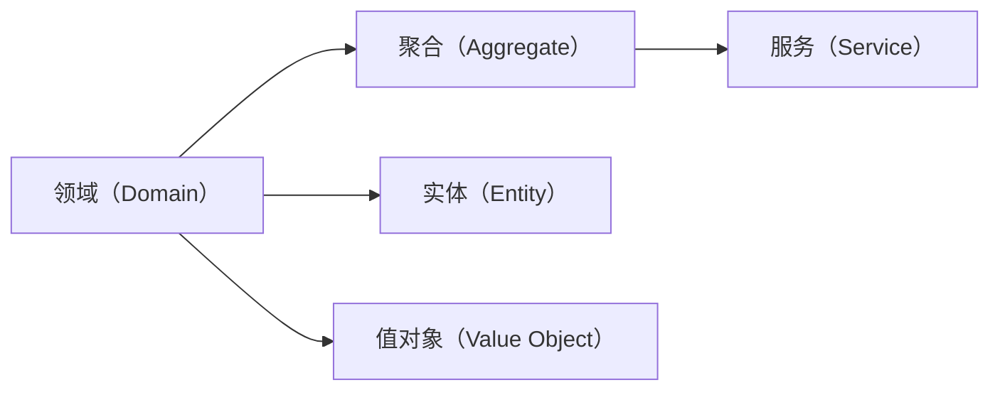

                 

## 1. 背景介绍

### 1.1 问题由来
在当今复杂多变的商业环境中，企业需要应对日益增长的业务需求、复杂多变的市场环境以及快速变化的技术趋势。因此，构建一个能够适应各种变化的复杂业务系统，成为企业信息化建设的重要目标。传统的单体应用、分层架构等方案难以应对业务系统的复杂性和可扩展性需求，导致项目开发周期长、维护成本高、风险大。

### 1.2 问题核心关键点
领域驱动设计（Domain-Driven Design, DDD）是Ulrich Ronen 和 Eric Evans在20世纪90年代提出的构建复杂业务系统的方法。DDD强调从业务领域出发，通过领域模型（Domain Model）来映射业务领域，以领域为中心的设计思路，确保系统具有高度的业务适应性和可扩展性。

### 1.3 问题研究意义
DDD可以帮助企业在面对复杂变化的市场需求时，快速响应并构建符合业务实际的复杂系统，提高系统的稳定性和可维护性。应用DDD方法，可以减少不必要的系统复杂性，降低开发和维护成本，提升业务响应速度，为企业的数字化转型和创新提供有力支撑。

## 2. 核心概念与联系

### 2.1 核心概念概述
为更好地理解DDD方法，本节将介绍几个密切相关的核心概念：

- **领域（Domain）**：DDD中的领域是指业务所涉及的范围或领域。领域是DDD方法的核心，系统开发应围绕业务领域展开，确保业务专家和开发团队的紧密合作。
- **聚合（Aggregate）**：聚合是领域的聚合体，它包含一组相互依赖的对象，共同完成一个业务功能。聚合是领域模型中的基本单元，可以理解为业务对象的容器。
- **实体（Entity）**：实体是具有唯一标识的对象，通常与数据库表一一对应。实体具有生命周期，可以在聚合内动态变化。
- **值对象（Value Object）**：值对象是一个不可变的领域对象，通常用于描述领域中的数据。值对象在不同实体间可以共享，从而减少代码冗余。
- **服务（Service）**：服务是领域模型中的操作，代表对聚合内对象的操作，包括增加、更新、删除等业务逻辑。

### 2.2 核心概念原理和架构的 Mermaid 流程图



该流程图展示了DDD的核心概念及其关系：

1. 领域是DDD的基础，聚合和实体是领域的组成部分，通过值对象实现不同实体间数据的共享。
2. 服务是聚合中的业务逻辑单元，代表对聚合内对象的操作。

## 3. 核心算法原理 & 具体操作步骤
### 3.1 算法原理概述
DDD的核心算法原理是通过领域模型映射业务领域，将复杂的业务问题分解成一组相互依赖的聚合。在构建领域模型的过程中，强调业务专家的参与，确保模型能够准确映射业务领域，并在此基础上进行系统设计和开发。

### 3.2 算法步骤详解
DDD的开发过程可以分为四个主要阶段：领域建模、系统设计、技术实现和持续迭代。

#### 3.2.1 领域建模
领域建模是DDD的第一步，旨在通过业务分析和沟通，构建出领域模型。这一过程需要业务专家和开发团队的紧密合作，以确保模型能够准确地反映业务领域。

**步骤1**：识别领域边界
- 分析业务领域，确定哪些领域需要单独建模。通常，业务领域可以按照功能模块、业务流程等进行划分。
- 确定每个领域的核心实体和聚合，识别领域的关键业务逻辑。

**步骤2**：构建领域模型
- 使用ER图、UML图等工具绘制领域模型，明确实体、值对象和聚合之间的关系。
- 进行业务规则和约束的讨论和确认，确保模型的一致性和完整性。

#### 3.2.2 系统设计
系统设计阶段是在领域模型的基础上，设计出系统的整体架构和数据模型。系统设计应围绕领域模型展开，确保系统的业务适应性和可扩展性。

**步骤1**：设计聚合架构
- 根据领域模型，设计系统的聚合架构。通常，一个聚合包含一个或多个实体，共同完成一个业务功能。
- 确定聚合之间的交互方式，包括聚合的边界、接口和依赖关系。

**步骤2**：设计数据模型
- 根据聚合架构，设计数据库模型，确定表结构、字段和关系。
- 使用ER图或数据库设计工具进行建模，确保数据模型的正确性和可维护性。

#### 3.2.3 技术实现
技术实现阶段是在系统设计的指导下，使用技术手段实现领域模型和业务逻辑。这一过程需要选择合适的技术栈和框架，以支持系统的开发和部署。

**步骤1**：选择合适的技术栈
- 根据系统的业务需求和技术特点，选择合适的技术栈。常见的技术栈包括Spring Boot、Django等。
- 确定前端技术、数据库、缓存等组件的选择。

**步骤2**：实现领域模型
- 根据聚合架构和数据模型，使用编码工具实现领域模型。通常，实体和值对象使用POJO或数据模型类表示。
- 实现服务接口，定义聚合的操作，确保服务的原子性和一致性。

#### 3.2.4 持续迭代
持续迭代是DDD的最后一个阶段，通过不断的反馈和优化，确保系统能够适应业务变化和用户需求。持续迭代强调持续集成、持续交付和持续反馈，以快速响应用户和业务变化。

**步骤1**：持续集成和交付
- 使用CI/CD工具进行持续集成，确保代码变更的及时提交和集成。
- 使用容器化技术进行持续交付，确保系统能够快速部署和升级。

**步骤2**：持续反馈和优化
- 通过用户反馈和业务分析，持续改进系统的功能和性能。
- 收集和分析业务指标，评估系统的稳定性和可维护性，进行优化和改进。

### 3.3 算法优缺点

DDD具有以下优点：

1. **高度的业务适应性**：DDD强调业务模型在开发中的重要性，通过业务专家和开发团队的紧密合作，确保系统能够准确地反映业务需求。
2. **可扩展性**：DDD将复杂的业务问题分解成一组相互依赖的聚合，使得系统可以更容易地扩展和维护。
3. **可维护性**：DDD强调代码的可理解性和可维护性，通过领域模型和领域服务的分离，减少代码冗余，提升系统可维护性。

同时，DDD也存在一些缺点：

1. **开发复杂度**：DDD要求开发团队具备领域建模和业务分析的能力，开发周期可能较长。
2. **业务专家依赖**：DDD的成功依赖于业务专家的参与和指导，业务专家在项目中的作用非常重要。
3. **技术难度**：DDD涉及多方面的技术和工具，需要开发团队具备较高的技术能力和经验。

### 3.4 算法应用领域

DDD方法广泛应用于以下领域：

- **金融科技**：在金融领域，DDD可以用于设计复杂业务系统，如资金管理、风险控制、交易结算等。
- **电商**：在电商领域，DDD可以用于设计商品管理、订单处理、库存管理等系统。
- **医疗健康**：在医疗领域，DDD可以用于设计患者管理、病历记录、医疗流程等系统。
- **物流运输**：在物流领域，DDD可以用于设计货物追踪、配送路线、库存管理等系统。
- **旅游业**：在旅游领域，DDD可以用于设计旅游预订、行程安排、客户服务等系统。

## 4. 数学模型和公式 & 详细讲解 & 举例说明

### 4.1 数学模型构建

DDD中的数学模型主要涉及领域模型和系统设计模型。领域模型通常使用实体-关系模型（Entity-Relationship Model, ER模型）来描述。ER模型包含实体、属性和关系，可以用于表示领域中的数据和业务逻辑。

### 4.2 公式推导过程

在ER模型中，实体-关系模型可以表示为：

$$
E = \{E_1, E_2, ..., E_n\}, R = \{R_1, R_2, ..., R_m\}
$$

其中，$E$ 表示实体集，$R$ 表示关系集。关系可以表示为：

$$
R_i = \{A_{i1}, A_{i2}, ..., A_{in}\}, i \in \{1, 2, ..., m\}
$$

其中，$R_i$ 表示关系$R$中的第$i$个关系，$A_{ij}$ 表示关系$R_i$中的第$j$个属性。

### 4.3 案例分析与讲解

假设有一个电商领域的订单管理系统，其领域模型可以表示为：

**订单实体（Order）**：
- 属性：订单号、客户ID、订单日期、订单状态
- 关系：客户-订单

**订单详情实体（OrderDetail）**：
- 属性：订单详情ID、订单ID、商品ID、商品数量、单价
- 关系：订单-商品

**商品实体（Product）**：
- 属性：商品ID、商品名称、商品描述、商品价格
- 关系：无

根据上述领域模型，可以设计出ER图：

```
Order (OrderID PK, CustomerID FK, OrderDate D, OrderStatus D)
OrderDetail (OrderDetailID PK, OrderID FK, ProductID FK, Quantity D, Price D)
Product (ProductID PK, ProductName D, ProductDescription D, Price D)
```

通过ER图，可以清晰地表示订单管理系统的数据模型和业务逻辑。在技术实现阶段，可以根据ER图设计数据库模型，使用ORM工具映射实体和表的关系，确保系统的数据一致性和完整性。

## 5. 项目实践：代码实例和详细解释说明

### 5.1 开发环境搭建

为了快速搭建DDD项目，可以使用Spring Boot框架和MyBatis-Plus工具。以下是一个简单的Spring Boot项目搭建流程：

1. 使用Spring Boot初始化项目：
```bash
$ spring boot init --name my-ddd-project --version 2.5.3
```

2. 引入MyBatis-Plus依赖：
```xml
<dependency>
    <groupId>com.baomidou</groupId>
    <artifactId>mybatis-plus-spring-boot-starter</artifactId>
    <version>1.6.2</version>
</dependency>
```

3. 编写领域模型和数据模型：
- 订单实体类（Order）：
```java
public class Order {
    private Long id;
    private Long customerId;
    private LocalDate orderDate;
    private OrderStatus orderStatus;
    // getter and setter
}
```

- 订单详情实体类（OrderDetail）：
```java
public class OrderDetail {
    private Long id;
    private Long orderId;
    private Long productId;
    private Integer quantity;
    private BigDecimal price;
    // getter and setter
}
```

- 商品实体类（Product）：
```java
public class Product {
    private Long id;
    private String productName;
    private String productDescription;
    private BigDecimal price;
    // getter and setter
}
```

### 5.2 源代码详细实现

在搭建好开发环境后，可以开始实现DDD项目的业务逻辑。以下是一个简单的订单管理系统的实现过程：

1. 定义领域模型和领域服务
- 订单领域类（OrderDomain）：
```java
public class OrderDomain {
    public Order findOrderById(Long id) {
        // 实现根据ID查找订单的业务逻辑
    }
    public Order createOrder(Order order) {
        // 实现创建订单的业务逻辑
    }
}
```

- 订单详情领域类（OrderDetailDomain）：
```java
public class OrderDetailDomain {
    public OrderDetail createOrderDetail(OrderDetail orderDetail) {
        // 实现创建订单详情的业务逻辑
    }
}
```

- 商品领域类（ProductDomain）：
```java
public class ProductDomain {
    public Product findProductById(Long id) {
        // 实现根据ID查找商品的业务逻辑
    }
}
```

2. 定义领域模型和领域服务的关系
- 订单服务接口（OrderService）：
```java
public interface OrderService {
    Order findOrderById(Long id);
    Order createOrder(Order order);
}
```

- 订单详情服务接口（OrderDetailService）：
```java
public interface OrderDetailService {
    OrderDetail createOrderDetail(OrderDetail orderDetail);
}
```

- 商品服务接口（ProductService）：
```java
public interface ProductService {
    Product findProductById(Long id);
}
```

3. 实现领域服务
- 订单服务实现类（OrderServiceImpl）：
```java
@Service
public class OrderServiceImpl implements OrderService {
    @Autowired
    private OrderDomain orderDomain;
    // ...
}
```

- 订单详情服务实现类（OrderDetailServiceImpl）：
```java
@Service
public class OrderDetailServiceImpl implements OrderDetailService {
    @Autowired
    private OrderDetailDomain orderDetailDomain;
    // ...
}
```

- 商品服务实现类（ProductServiceImpl）：
```java
@Service
public class ProductServiceImpl implements ProductService {
    @Autowired
    private ProductDomain productDomain;
    // ...
}
```

4. 使用领域服务实现业务逻辑
- 订单控制器（OrderController）：
```java
@RestController
@RequestMapping("/orders")
public class OrderController {
    @Autowired
    private OrderService orderService;
    // ...
}
```

### 5.3 代码解读与分析

在DDD项目中，领域模型和领域服务是系统的核心，负责封装业务逻辑和数据模型。通过领域服务接口和实现，可以实现领域模型的业务操作，确保代码的可理解性和可维护性。

在技术实现阶段，可以使用Spring Boot框架简化开发过程，通过MyBatis-Plus工具自动生成数据模型映射类，提高开发效率。同时，领域服务类可以使用Spring的依赖注入和AOP技术，确保领域服务的原子性和一致性。

### 5.4 运行结果展示

在运行DDD项目时，可以使用Postman等工具进行测试。以下是一个简单的测试用例：

1. 创建订单
- POST请求：`/api/orders`
- 请求体：`{ "order": { "customerId": 1, "orderDate": "2022-01-01", "orderStatus": "待付款" } }`
- 响应体：订单ID

2. 查询订单
- GET请求：`/api/orders/{id}`
- 响应体：订单详情

3. 创建订单详情
- POST请求：`/api/order-details`
- 请求体：`{ "orderDetail": { "orderId": 1, "productId": 1, "quantity": 2, "price": 10.0 } }`
- 响应体：订单详情ID

通过上述测试用例，可以验证DDD项目的业务逻辑和数据模型是否正确实现。在实际应用中，DDD项目还可以通过单元测试和集成测试，进一步确保系统的稳定性和可靠性。

## 6. 实际应用场景

### 6.1 智能合约系统

在区块链领域，智能合约系统通过代码形式实现业务逻辑，具有高度的自动化和可执行性。DDD方法可以用于设计智能合约的领域模型和业务逻辑，确保合约系统能够准确地映射业务需求，并具备高度的可扩展性和可维护性。

**场景描述**：构建一个智能合约系统，用于自动执行货物买卖合同。系统需要管理订单、合同、商品等数据，确保合同执行的准确性和安全性。

**DDD实现**：定义订单、合同、商品等实体，设计订单管理、合同执行、商品管理等服务，确保系统能够自动化地执行合同条款。通过领域模型和领域服务，实现智能合约的业务逻辑和数据模型，确保系统的稳定性和安全性。

### 6.2 供应链管理平台

在供应链管理领域，系统需要管理物流、库存、订单等数据，确保供应链的流畅和高效。DDD方法可以用于设计供应链管理的领域模型和业务逻辑，确保系统能够准确地映射业务需求，并具备高度的可扩展性和可维护性。

**场景描述**：构建一个供应链管理平台，用于跟踪货物运输、管理库存、处理订单等业务。系统需要高效地处理大量数据，确保供应链的稳定性和高效性。

**DDD实现**：定义货物、运输、订单等实体，设计货物追踪、库存管理、订单处理等服务，确保系统能够自动化地处理供应链业务。通过领域模型和领域服务，实现供应链管理的业务逻辑和数据模型，确保系统的稳定性和可维护性。

### 6.3 保险理赔系统

在保险领域，理赔系统需要处理复杂的理赔申请、审核和赔付流程，确保理赔的准确性和高效性。DDD方法可以用于设计理赔系统的领域模型和业务逻辑，确保系统能够准确地映射业务需求，并具备高度的可扩展性和可维护性。

**场景描述**：构建一个保险理赔系统，用于处理客户的理赔申请、审核和赔付流程。系统需要高效地处理大量数据，确保理赔的准确性和高效性。

**DDD实现**：定义理赔申请、理赔审核、赔付处理等实体，设计理赔申请处理、理赔审核、赔付处理等服务，确保系统能够自动化地处理理赔流程。通过领域模型和领域服务，实现理赔系统的业务逻辑和数据模型，确保系统的稳定性和可维护性。

## 7. 工具和资源推荐

### 7.1 学习资源推荐

为了帮助开发者系统掌握DDD方法，这里推荐一些优质的学习资源：

1. **DDD实战指南**：该书详细介绍了DDD方法在实际项目中的应用，通过丰富的案例和实战经验，帮助开发者快速上手。
2. **DDD指南**：该书由Eric Evans撰写，详细介绍了DDD的核心理念和设计原则，是DDD学习的必读之作。
3. **UML与DDD**：该书介绍了UML图在DDD中的使用，通过UML图帮助开发者构建清晰、易理解的领域模型。
4. **Spring Boot实战**：该书详细介绍了Spring Boot框架的使用，通过丰富的实例帮助开发者快速掌握Spring Boot的开发技巧。
5. **MyBatis-Plus文档**：该文档是MyBatis-Plus框架的官方文档，详细介绍了MyBatis-Plus的使用方法和最佳实践。

### 7.2 开发工具推荐

DDD项目的开发需要多种工具的支持，以下推荐几款常用的工具：

1. **Spring Boot**：轻量级、易于使用的框架，支持快速开发和部署。
2. **MyBatis-Plus**：简化ORM框架，支持快速数据模型映射和操作。
3. **Postman**：API测试工具，支持RESTful API的测试和调用。
4. **JIRA**：项目管理工具，支持任务分配、进度跟踪和团队协作。
5. **GitLab**：代码托管和持续集成平台，支持代码的版本管理和自动化部署。

### 7.3 相关论文推荐

DDD方法的研究和应用不断发展，以下是几篇奠基性的相关论文，推荐阅读：

1. **Domain-Driven Design: Tackling Complexity in the Heart of Software**：Eric Evans的DDD专著，详细介绍了DDD的核心理念和方法。
2. **Domain-Driven Design Patterns**：该书介绍了DDD中的设计模式和应用场景，帮助开发者更好地理解DDD的实践应用。
3. **Designing Domain-Driven Applications with Domain-Driven Design**：该书详细介绍了DDD的实现方法和最佳实践，帮助开发者构建高质量的DDD系统。
4. **The Essence of Domain-Driven Design**：Eric Evans和Kent Beck合作撰写的论文，详细介绍了DDD的核心思想和设计原则。

## 8. 总结：未来发展趋势与挑战

### 8.1 研究成果总结

DDD方法自提出以来，已经广泛应用于各个行业领域，取得了显著的成功。其核心理念是通过领域模型和领域服务，映射业务领域，确保系统具备高度的业务适应性和可扩展性。DDD方法在系统设计、开发和维护等方面具有独特的优势，已经被证明是构建复杂业务系统的重要方法。

### 8.2 未来发展趋势

展望未来，DDD方法将呈现以下几个发展趋势：

1. **数据驱动的领域建模**：随着大数据技术的发展，DDD方法将进一步融合数据驱动的思想，通过数据挖掘和数据分析，提升领域模型的准确性和全面性。
2. **服务导向的架构设计**：DDD方法将进一步融合微服务、API-driven等架构设计理念，提升系统的可扩展性和可维护性。
3. **跨学科的领域建模**：DDD方法将进一步融合人工智能、区块链、物联网等新兴技术，构建跨学科的领域模型，提升系统的智能化和自动化水平。
4. **持续迭代的设计过程**：DDD方法将进一步融合敏捷开发、持续交付等理念，实现持续迭代的系统设计和开发。

### 8.3 面临的挑战

尽管DDD方法在实际应用中取得了显著成功，但仍面临诸多挑战：

1. **领域建模的复杂性**：DDD方法需要业务专家和开发团队的紧密合作，领域建模的复杂性较高，需要大量的沟通和协调。
2. **技术栈的选择**：DDD方法涉及多种技术和工具，选择合适的技术栈对项目成功至关重要。
3. **业务专家的依赖**：DDD方法的成功依赖于业务专家的参与和指导，如何确保业务专家的高效参与，是项目成功的重要因素。
4. **持续迭代和维护**：DDD方法强调持续迭代和优化，如何高效地进行持续迭代和维护，是系统稳定性的关键。

### 8.4 研究展望

未来，DDD方法需要在以下几个方面进行进一步研究：

1. **领域建模的标准化**：制定领域建模的标准化方法，帮助开发团队快速构建领域模型，提升系统开发效率。
2. **技术栈的融合**：探索DDD方法与其他新兴技术（如微服务、区块链、人工智能等）的融合，提升系统的智能化和自动化水平。
3. **持续迭代和反馈机制**：建立持续迭代和反馈机制，确保系统能够快速响应用户和业务变化，提升系统的稳定性和可维护性。
4. **业务专家的培训和培养**：制定业务专家培训计划，提升开发团队领域建模和业务分析的能力，确保业务专家的高效参与。

总之，DDD方法作为构建复杂业务系统的重要方法，将不断融合新兴技术和理念，提升系统的智能化和自动化水平，推动企业的数字化转型和创新。

## 9. 附录：常见问题与解答

### 附录

**Q1: DDD的核心思想是什么？**

A: DDD的核心思想是通过领域模型和领域服务，映射业务领域，确保系统具备高度的业务适应性和可扩展性。DDD强调业务专家和开发团队的紧密合作，通过领域模型和领域服务，实现系统的领域驱动设计。

**Q2: DDD在项目开发中的角色是什么？**

A: DDD在项目开发中的角色是指导开发团队进行领域建模和业务分析，确保系统能够准确地映射业务需求。DDD通过领域模型和领域服务，实现系统的领域驱动设计，确保系统具备高度的业务适应性和可扩展性。

**Q3: DDD的优缺点是什么？**

A: DDD的优点是高度的业务适应性和可扩展性，通过领域模型和领域服务，实现系统的领域驱动设计。缺点是领域建模的复杂性和技术栈的选择，需要业务专家和开发团队的紧密合作。

**Q4: DDD在技术实现阶段需要注意哪些问题？**

A: 技术实现阶段需要注意选择合适的技术栈、实现领域模型和领域服务、使用ORM工具简化开发过程等。通过领域模型和领域服务，实现系统的领域驱动设计，确保系统具备高度的业务适应性和可扩展性。

**Q5: 如何使用DDD方法设计智能合约系统？**

A: 使用DDD方法设计智能合约系统，首先需要定义智能合约的领域模型，包括订单、合同、商品等实体。然后设计订单管理、合同执行、商品管理等服务，确保系统能够自动化地执行合同条款。最后，通过领域模型和领域服务，实现智能合约的业务逻辑和数据模型，确保系统的稳定性和安全性。

**Q6: 如何使用DDD方法设计供应链管理系统？**

A: 使用DDD方法设计供应链管理系统，首先需要定义货物、运输、订单等实体，然后设计货物追踪、库存管理、订单处理等服务，确保系统能够自动化地处理供应链业务。最后，通过领域模型和领域服务，实现供应链管理的业务逻辑和数据模型，确保系统的稳定性和可维护性。

**Q7: 如何使用DDD方法设计保险理赔系统？**

A: 使用DDD方法设计保险理赔系统，首先需要定义理赔申请、理赔审核、赔付处理等实体，然后设计理赔申请处理、理赔审核、赔付处理等服务，确保系统能够自动化地处理理赔流程。最后，通过领域模型和领域服务，实现理赔系统的业务逻辑和数据模型，确保系统的稳定性和可维护性。

**Q8: DDD的应用场景有哪些？**

A: DDD广泛应用于金融科技、电商、医疗健康、物流运输、旅游业等多个行业领域。例如，金融科技领域的智能合约系统、电商领域的订单管理系统、医疗健康领域的保险理赔系统、物流运输领域的供应链管理系统等。

**Q9: DDD的优缺点是什么？**

A: DDD的优点是高度的业务适应性和可扩展性，通过领域模型和领域服务，实现系统的领域驱动设计。缺点是领域建模的复杂性和技术栈的选择，需要业务专家和开发团队的紧密合作。

**Q10: DDD的实际应用场景有哪些？**

A: DDD广泛应用于金融科技、电商、医疗健康、物流运输、旅游业等多个行业领域。例如，金融科技领域的智能合约系统、电商领域的订单管理系统、医疗健康领域的保险理赔系统、物流运输领域的供应链管理系统等。

**Q11: 如何使用DDD方法设计系统？**

A: 使用DDD方法设计系统，首先需要进行领域建模，识别领域边界和核心实体。然后设计领域模型和领域服务，实现系统的领域驱动设计。最后，使用技术手段实现领域模型和业务逻辑，确保系统的稳定性和可维护性。

**Q12: DDD的核心理念是什么？**

A: DDD的核心理念是通过领域模型和领域服务，映射业务领域，确保系统具备高度的业务适应性和可扩展性。DDD强调业务专家和开发团队的紧密合作，通过领域模型和领域服务，实现系统的领域驱动设计。

**Q13: DDD的实现过程有哪些步骤？**

A: DDD的实现过程包括领域建模、系统设计、技术实现和持续迭代。在领域建模阶段，识别领域边界和核心实体；在系统设计阶段，设计领域模型和系统架构；在技术实现阶段，实现领域模型和业务逻辑；在持续迭代阶段，进行系统的迭代和优化，确保系统能够快速响应用户和业务变化。

**Q14: DDD的方法论有哪些？**

A: DDD的方法论包括领域建模、系统设计、技术实现和持续迭代。领域建模通过业务分析和沟通，构建出领域模型；系统设计在领域模型的基础上，设计系统的整体架构和数据模型；技术实现在系统设计的指导下，使用技术手段实现领域模型和业务逻辑；持续迭代通过反馈和优化，确保系统能够适应业务变化和用户需求。

**Q15: DDD的应用案例有哪些？**

A: DDD广泛应用于金融科技、电商、医疗健康、物流运输、旅游业等多个行业领域。例如，金融科技领域的智能合约系统、电商领域的订单管理系统、医疗健康领域的保险理赔系统、物流运输领域的供应链管理系统等。

**Q16: DDD的优缺点是什么？**

A: DDD的优点是高度的业务适应性和可扩展性，通过领域模型和领域服务，实现系统的领域驱动设计。缺点是领域建模的复杂性和技术栈的选择，需要业务专家和开发团队的紧密合作。

**Q17: 如何使用DDD方法设计系统？**

A: 使用DDD方法设计系统，首先需要进行领域建模，识别领域边界和核心实体。然后设计领域模型和领域服务，实现系统的领域驱动设计。最后，使用技术手段实现领域模型和业务逻辑，确保系统的稳定性和可维护性。

**Q18: DDD的核心理念是什么？**

A: DDD的核心理念是通过领域模型和领域服务，映射业务领域，确保系统具备高度的业务适应性和可扩展性。DDD强调业务专家和开发团队的紧密合作，通过领域模型和领域服务，实现系统的领域驱动设计。

**Q19: DDD的方法论有哪些？**

A: DDD的方法论包括领域建模、系统设计、技术实现和持续迭代。领域建模通过业务分析和沟通，构建出领域模型；系统设计在领域模型的基础上，设计系统的整体架构和数据模型；技术实现在系统设计的指导下，使用技术手段实现领域模型和业务逻辑；持续迭代通过反馈和优化，确保系统能够适应业务变化和用户需求。

**Q20: DDD的应用案例有哪些？**

A: DDD广泛应用于金融科技、电商、医疗健康、物流运输、旅游业等多个行业领域。例如，金融科技领域的智能合约系统、电商领域的订单管理系统、医疗健康领域的保险理赔系统、物流运输领域的供应链管理系统等。

**Q21: 如何使用DDD方法设计系统？**

A: 使用DDD方法设计系统，首先需要进行领域建模，识别领域边界和核心实体。然后设计领域模型和领域服务，实现系统的领域驱动设计。最后，使用技术手段实现领域模型和业务逻辑，确保系统的稳定性和可维护性。

**Q22: DDD的核心理念是什么？**

A: DDD的核心理念是通过领域模型和领域服务，映射业务领域，确保系统具备高度的业务适应性和可扩展性。DDD强调业务专家和开发团队的紧密合作，通过领域模型和领域服务，实现系统的领域驱动设计。

**Q23: DDD的方法论有哪些？**

A: DDD的方法论包括领域建模、系统设计、技术实现和持续迭代。领域建模通过业务分析和沟通，构建出领域模型；系统设计在领域模型的基础上，设计系统的整体架构和数据模型；技术实现在系统设计的指导下，使用技术手段实现领域模型和业务逻辑；持续迭代通过反馈和优化，确保系统能够适应业务变化和用户需求。

**Q24: DDD的应用案例有哪些？**

A: DDD广泛应用于金融科技、电商、医疗健康、物流运输、旅游业等多个行业领域。例如，金融科技领域的智能合约系统、电商领域的订单管理系统、医疗健康领域的保险理赔系统、物流运输领域的供应链管理系统等。

**Q25: 如何使用DDD方法设计系统？**

A: 使用DDD方法设计系统，首先需要进行领域建模，识别领域边界和核心实体。然后设计领域模型和领域服务，实现系统的领域驱动设计。最后，使用技术手段实现领域模型和业务逻辑，确保系统的稳定性和可维护性。

**Q26: DDD的核心理念是什么？**

A: DDD的核心理念是通过领域模型和领域服务，映射业务领域，确保系统具备高度的业务适应性和可扩展性。DDD强调业务专家和开发团队的紧密合作，通过领域模型和领域服务，实现系统的领域驱动设计。

**Q27: DDD的方法论有哪些？**

A: DDD的方法论包括领域建模、系统设计、技术实现和持续迭代。领域建模通过业务分析和沟通，构建出领域模型；系统设计在领域模型的基础上，设计系统的整体架构和数据模型；技术实现在系统设计的指导下，使用技术手段实现领域模型和业务逻辑；持续迭代通过反馈和优化，确保系统能够适应业务变化和用户需求。

**Q28: DDD的应用案例有哪些？**

A: DDD广泛应用于金融科技、电商、医疗健康、物流运输、旅游业等多个行业领域。例如，金融科技领域的智能合约系统、电商领域的订单管理系统、医疗健康领域的保险理赔系统、物流运输领域的供应链管理系统等。

**Q29: 如何使用DDD方法设计系统？**

A: 使用DDD方法设计系统，首先需要进行领域建模，识别领域边界和核心实体。然后设计领域模型和领域服务，实现系统的领域驱动设计。最后，使用技术手段实现领域模型和业务逻辑，确保系统的稳定性和可维护性。

**Q30: DDD的核心理念是什么？**

A: DDD的核心理念是通过领域模型和领域服务，映射业务领域，确保系统具备高度的业务适应性和可扩展性。DDD强调业务专家和开发团队的紧密合作，通过领域模型和领域服务，实现系统的领域驱动设计。

**Q31: DDD的方法论有哪些？**

A: DDD的方法论包括领域建模、系统设计、技术实现和持续迭代。领域建模通过业务分析和沟通，构建出领域模型；系统设计在领域模型的基础上，设计系统的整体架构和数据模型；技术实现在系统设计的指导下，使用技术手段实现领域模型和业务逻辑；持续迭代通过反馈和优化，确保系统能够适应业务变化和用户需求。

**Q32: DDD的应用案例有哪些？**

A: DDD广泛应用于金融科技、电商、医疗健康、物流运输、旅游业等多个行业领域。例如，金融科技领域的智能合约系统、电商领域的订单管理系统、医疗健康领域的保险理赔系统、物流运输领域的供应链管理系统等。

**Q33: 如何使用DDD方法设计系统？**

A: 使用DDD方法设计系统，首先需要进行领域建模，识别领域边界和核心实体。然后设计领域模型和领域服务，实现系统的领域驱动设计。最后，使用技术手段实现领域模型和业务逻辑，确保系统的稳定性和可维护性。

**Q34: DDD的核心理念是什么？**

A: DDD的核心理念是通过领域模型和领域服务，映射业务领域，确保系统具备高度的业务适应性和可扩展性。DDD强调业务专家和开发团队的紧密合作，通过领域模型和领域服务，实现系统的领域驱动设计。

**Q35: DDD的方法论有哪些？**

A: DDD的方法论包括领域建模、系统设计、技术实现和持续迭代。领域建模通过业务分析和沟通，构建出领域模型；系统设计在领域模型的基础上，设计系统的整体架构和数据模型；技术实现在系统设计的指导下，使用技术手段实现领域模型和业务逻辑；持续迭代通过反馈和优化，确保系统能够适应业务变化和用户需求。

**Q36: DDD的应用案例有哪些？**

A: DDD广泛应用于金融科技、电商、医疗健康、物流运输、旅游业等多个行业领域。例如，金融科技领域的智能合约系统、电商领域的订单管理系统、医疗健康领域的保险理赔系统、物流运输领域的供应链管理系统等。

**Q37: 如何使用DDD方法设计系统？**

A: 使用DDD方法设计系统，首先需要进行领域建模，识别领域边界和核心实体。然后设计领域模型和领域服务，实现系统的领域驱动设计。最后，使用技术手段实现领域模型和业务逻辑，确保系统的稳定性和可维护性。

**Q38: DDD的核心理念是什么？**

A: DDD的核心理念是通过领域模型和领域服务，映射业务领域，确保系统具备高度的业务适应性和可扩展性。DDD强调业务专家和开发团队的紧密合作，通过领域模型和领域服务，实现系统的领域驱动设计。

**Q39: DDD的方法论有哪些？**

A: DDD的方法论包括领域建模、系统设计、技术实现和持续迭代。领域建模通过业务分析和沟通，构建出领域模型；系统设计在领域模型的基础上，设计系统的整体架构和数据模型；技术实现在系统设计的指导下，使用技术手段实现领域模型和业务逻辑；持续迭代通过反馈和优化，确保系统能够适应业务变化和用户需求。

**Q40: DDD的应用案例有哪些？**

A: DDD广泛应用于金融科技、电商、医疗健康、物流运输、旅游业等多个行业领域。例如，金融科技领域的智能合约系统、电商领域的订单管理系统、医疗健康领域的保险理赔系统、物流运输领域的供应链管理系统等。

**Q41: 如何使用DDD方法设计系统？**

A: 使用DDD方法设计系统，首先需要进行领域建模，识别领域边界和核心实体。然后设计领域模型和领域服务，实现系统的领域驱动设计。最后，使用技术手段实现领域模型和业务逻辑，确保系统的稳定性和可维护性。

**Q42: DDD的核心理念是什么？**

A: DDD的核心理念是通过领域模型和领域服务，映射业务领域，确保系统具备高度的业务适应性和可扩展性。DDD强调业务专家和开发团队的紧密合作，通过领域模型和领域服务，实现系统的领域驱动设计。

**Q43: DDD的方法论有哪些？**

A: DDD的方法论包括领域建模、系统设计、技术实现和持续迭代。领域建模通过业务分析和沟通，构建出领域模型；系统设计在领域模型的基础上，设计系统的整体架构和数据模型；技术实现在系统设计的指导下，使用技术手段实现领域模型和业务逻辑；持续迭代通过反馈和优化，确保系统能够适应业务变化和用户需求。

**Q44: DDD的应用案例有哪些？**

A: DDD广泛应用于金融科技、电商、医疗健康、物流运输、旅游业等多个行业领域。例如，金融科技领域的智能合约系统、电商领域的订单管理系统、医疗健康领域的保险理赔系统、物流运输领域的供应链管理系统等。

**Q45: 如何使用DDD方法设计系统？**

A: 使用DDD方法设计系统，首先需要进行领域建模，识别领域边界和核心实体。然后设计领域模型和领域服务，实现系统的领域驱动设计。最后，使用技术手段实现领域模型和业务逻辑，确保系统的稳定性和可维护性。

**Q46: DDD的核心理念是什么？**

A: DDD的核心理念是通过领域模型和领域服务，映射业务领域，确保系统具备高度的业务适应性和可扩展性。DDD强调业务专家和开发团队的紧密合作，通过领域模型和领域服务，实现系统的领域驱动设计。

**Q47: DDD的方法论有哪些？**

A: DDD的方法论包括领域建模、系统设计、技术实现和持续迭代。领域建模通过业务分析和沟通，构建出领域模型；系统设计在领域模型的基础上，设计系统的整体架构和数据模型；技术实现在系统设计的指导下，使用技术手段实现领域模型和业务逻辑；持续迭代通过反馈和优化，确保系统能够适应业务变化和用户需求。

**Q48: DDD的应用案例有哪些？**

A: DDD广泛应用于金融科技、电商、医疗健康、物流运输、旅游业等多个行业领域。例如，金融科技领域的智能合约系统、电商领域的订单管理系统、医疗健康领域的保险理赔系统、物流运输领域的供应链管理系统等。

**Q49: 如何使用DDD方法设计系统？**

A: 使用DDD方法设计系统，首先需要进行领域建模，识别领域边界和核心实体。然后设计领域模型和领域服务，实现系统的领域驱动设计。最后，使用技术手段实现领域模型和业务逻辑，确保系统的稳定性和可维护性。

**Q50: DDD的核心理念是什么？**

A: DDD的核心理念是通过领域模型和领域服务，映射业务领域，确保系统具备高度的业务适应性和可扩展性。DDD强调业务专家和开发团队的紧密合作，通过领域模型和领域服务，实现系统的领域驱动设计。

**Q51: DDD的方法论有哪些？**

A: DDD的方法论包括领域建模、系统设计、技术实现和持续迭代。领域建模通过业务分析和沟通，构建出领域模型；系统设计在领域模型的基础上，设计系统的整体架构和数据模型；技术实现在系统设计的指导下，使用技术手段实现领域模型和业务逻辑；持续迭代通过反馈和优化，确保系统能够适应业务变化和用户需求。

**Q52: DDD的应用案例有哪些？**

A: DDD广泛应用于金融科技、电商、医疗健康、物流运输、旅游业等多个行业领域。例如，金融科技领域的智能合约系统、电商领域的订单管理系统、医疗健康领域的保险理赔系统、物流运输领域的供应链管理系统等。

**Q53: 如何使用DDD方法设计系统？**

A: 使用DDD方法设计系统，首先需要进行领域建模，识别领域边界和核心实体。然后设计领域模型和领域服务，实现系统的领域驱动设计。最后，使用技术手段实现领域模型和业务逻辑，确保系统的稳定性和可维护性。

**Q54: DDD的核心理念是什么？**

A: DDD的核心理念是通过领域模型和领域服务，映射业务领域，确保系统具备高度的业务适应性和可扩展性。DDD强调业务专家和开发团队的紧密合作，通过领域模型和领域服务，实现系统的领域驱动设计。

**Q55: DDD的方法论有哪些？**

A: DDD的方法论包括领域建模、系统设计、技术实现和持续迭代。领域建模通过业务分析和沟通，构建出领域模型；系统设计在领域模型的基础上，设计系统的整体架构和数据模型；技术实现在系统设计的指导下，使用技术手段实现领域模型和业务逻辑；持续迭代通过反馈和优化，确保系统能够适应业务变化和用户需求。

**Q56: DDD的应用案例有哪些？**

A: DDD广泛应用于金融科技、电商、医疗健康、物流运输、旅游业等多个行业领域。例如，金融科技领域的智能合约系统、电商领域的订单管理系统、医疗健康领域的保险理赔系统、物流运输领域的供应链管理系统等。

**Q57: 如何使用DDD方法设计系统？**

A: 使用DDD方法设计系统，首先需要进行领域建模，识别领域边界和核心实体。然后设计领域模型和领域服务，实现系统的领域驱动设计。最后，使用技术手段实现领域模型和业务逻辑，确保系统的稳定性和可维护性。

**Q58: DDD的核心理念是什么？**

A: DDD的核心理念是通过领域模型和领域服务，映射业务领域，确保系统具备高度的业务适应性和可扩展性。DDD强调业务专家和开发团队的紧密合作，通过

