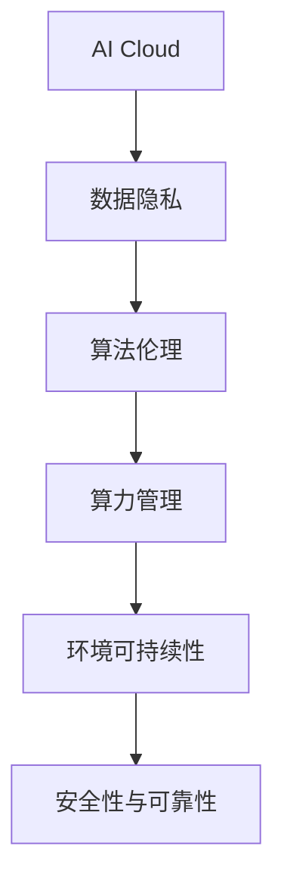

                 

# AI Cloud未来：贾扬清愿景，Lepton AI前景挑战

> 关键词：人工智能云平台,AI Cloud,Lepton AI,未来愿景,技术挑战,可持续发展

## 1. 背景介绍

### 1.1 问题由来

随着人工智能技术的迅猛发展，人工智能云平台（AI Cloud）成为了推动人工智能产业发展的核心力量。各大科技公司纷纷推出自己的AI Cloud解决方案，并不断扩展其功能和应用领域。然而，在快速发展的同时，AI Cloud也面临着诸多挑战，如数据隐私问题、算法伦理、算力需求等。为了应对这些挑战，Lepton AI公司提出的愿景和方案引起了广泛关注。

### 1.2 问题核心关键点

AI Cloud的未来发展方向和Lepton AI面临的挑战可以从以下几个核心关键点展开讨论：

- **数据隐私与保护**：如何在保障数据隐私的前提下，实现高效的数据共享与利用。
- **算法伦理与透明性**：如何确保算法的公平性、透明性和可解释性，避免算法偏见。
- **算力资源管理**：如何高效地管理和分配算力资源，以满足AI应用日益增长的需求。
- **环境可持续性**：如何在保证技术创新的同时，减少AI技术对环境的影响，实现绿色发展。
- **安全性与可靠性**：如何构建可靠的安全系统，确保AI系统的稳定运行和数据安全。

### 1.3 问题研究意义

Lepton AI的愿景和方案对AI Cloud的未来发展具有重要的指导意义：

- 提出解决数据隐私、算法伦理、算力管理等关键问题的思路和方法，为AI Cloud的可持续发展提供有力支持。
- 推动AI技术的绿色发展，减少对环境的影响，实现技术进步与社会责任的和谐统一。
- 为其他AI公司提供借鉴，帮助其构建更加安全、可靠、高效的AI Cloud系统。

## 2. 核心概念与联系

### 2.1 核心概念概述

为了更好地理解Lepton AI的愿景和挑战，本节将介绍几个密切相关的核心概念：

- **AI Cloud**：基于云平台的人工智能应用，提供计算、存储、网络等服务，支持大规模人工智能应用的部署和管理。
- **Lepton AI**：一家致力于构建安全、高效、绿色的人工智能云平台的公司。
- **数据隐私**：指保护个人数据不被未经授权的访问、使用和披露，确保数据的安全性和用户的隐私权。
- **算法伦理**：涉及算法的设计、开发、应用和评估过程，确保算法不产生歧视、偏见和不公平的结果。
- **算力管理**：通过优化资源配置和管理，提高算力利用效率，降低成本。
- **环境可持续性**：在保证技术进步的同时，减少对环境的影响，推动绿色技术发展。
- **安全性与可靠性**：通过安全机制和冗余设计，确保AI系统免受恶意攻击和系统故障的影响。

这些核心概念之间的逻辑关系可以通过以下Mermaid流程图来展示：



这个流程图展示了大语言模型的核心概念及其之间的关系：

1. AI Cloud提供基础云服务，支持算力和数据的管理。
2. 数据隐私和算法伦理是大语言模型建设的基础保障。
3. 算力管理和大规模数据存储是支持大语言模型运行的关键。
4. 环境可持续性和安全性是AI Cloud长远发展的必备要素。

## 3. 核心算法原理 & 具体操作步骤

### 3.1 算法原理概述

Lepton AI的愿景和方案基于以下几个核心算法原理：

- **分布式计算**：通过分布式计算架构，高效管理和调度算力资源，支持大规模训练和推理。
- **隐私保护技术**：采用差分隐私、同态加密等技术，保障数据隐私和安全。
- **模型压缩与优化**：通过剪枝、量化、蒸馏等技术，优化模型，减少算力消耗，提高模型效率。
- **绿色算力**：采用可再生能源供电的计算中心，减少能耗，推动绿色算力发展。
- **安全机制**：引入区块链、多因素认证等技术，增强系统的安全性与可靠性。

### 3.2 算法步骤详解

Lepton AI的愿景和方案实施步骤如下：

1. **构建AI Cloud平台**：开发基于分布式计算的AI Cloud平台，支持大规模深度学习模型的训练和推理。
2. **引入隐私保护技术**：采用差分隐私、同态加密等技术，对数据进行隐私保护处理，确保数据安全。
3. **优化模型架构**：应用模型压缩、剪枝、量化等技术，优化模型架构，减少资源消耗。
4. **实现绿色算力**：建设绿色计算中心，采用可再生能源供电，降低能耗。
5. **引入安全机制**：引入区块链、多因素认证等技术，增强系统的安全性和可靠性。

### 3.3 算法优缺点

Lepton AI的愿景和方案具有以下优点：

- **高效性**：通过分布式计算和优化模型架构，提高计算效率，支持大规模模型训练和推理。
- **安全性**：采用多种隐私保护和安全技术，确保数据和系统的安全性与可靠性。
- **绿色性**：建设绿色计算中心，降低能耗，推动绿色技术发展。

同时，该方案也存在一些局限性：

- **复杂性**：引入多种新技术，增加了系统构建和维护的复杂度。
- **成本高**：绿色计算中心和隐私保护技术的建设，初期投入较大。
- **灵活性**：部分技术如差分隐私、同态加密等，可能影响算法的准确性和效率。

### 3.4 算法应用领域

Lepton AI的愿景和方案适用于多个领域，包括但不限于：

- **金融**：支持金融市场的风险评估、投资决策等应用。
- **医疗**：用于医疗影像诊断、个性化治疗等。
- **智能制造**：支持工业互联网、智能制造等应用。
- **智慧城市**：支持城市管理、智能交通等。
- **智慧教育**：支持在线教育、智能辅导等。

## 4. 数学模型和公式 & 详细讲解 & 举例说明（备注：数学公式请使用latex格式，latex嵌入文中独立段落使用 $$，段落内使用 $)
### 4.1 数学模型构建

本节将使用数学语言对Lepton AI的愿景和方案进行更加严格的刻画。

设 $D$ 为AI Cloud平台上的数据集，$M$ 为待训练的深度学习模型，$L$ 为损失函数，$\theta$ 为模型参数。

定义模型 $M_{\theta}$ 在数据样本 $(x,y)$ 上的损失函数为 $\ell(M_{\theta}(x),y)$，则在数据集 $D$ 上的经验风险为：

$$
\mathcal{L}(\theta) = \frac{1}{N} \sum_{i=1}^N \ell(M_{\theta}(x_i),y_i)
$$

Lepton AI的愿景和方案的目标是最小化经验风险，即找到最优参数：

$$
\theta^* = \mathop{\arg\min}_{\theta} \mathcal{L}(\theta)
$$

在实践中，我们通常使用基于梯度的优化算法（如SGD、Adam等）来近似求解上述最优化问题。设 $\eta$ 为学习率，$\lambda$ 为正则化系数，则参数的更新公式为：

$$
\theta \leftarrow \theta - \eta \nabla_{\theta}\mathcal{L}(\theta) - \eta\lambda\theta
$$

其中 $\nabla_{\theta}\mathcal{L}(\theta)$ 为损失函数对参数 $\theta$ 的梯度，可通过反向传播算法高效计算。

### 4.2 公式推导过程

以下我们以二分类任务为例，推导交叉熵损失函数及其梯度的计算公式。

假设模型 $M_{\theta}$ 在输入 $x$ 上的输出为 $\hat{y}=M_{\theta}(x) \in [0,1]$，表示样本属于正类的概率。真实标签 $y \in \{0,1\}$。则二分类交叉熵损失函数定义为：

$$
\ell(M_{\theta}(x),y) = -[y\log \hat{y} + (1-y)\log (1-\hat{y})]
$$

将其代入经验风险公式，得：

$$
\mathcal{L}(\theta) = -\frac{1}{N}\sum_{i=1}^N [y_i\log M_{\theta}(x_i)+(1-y_i)\log(1-M_{\theta}(x_i))]
$$

根据链式法则，损失函数对参数 $\theta_k$ 的梯度为：

$$
\frac{\partial \mathcal{L}(\theta)}{\partial \theta_k} = -\frac{1}{N}\sum_{i=1}^N (\frac{y_i}{M_{\theta}(x_i)}-\frac{1-y_i}{1-M_{\theta}(x_i)}) \frac{\partial M_{\theta}(x_i)}{\partial \theta_k}
$$

其中 $\frac{\partial M_{\theta}(x_i)}{\partial \theta_k}$ 可进一步递归展开，利用自动微分技术完成计算。

### 4.3 案例分析与讲解

考虑一个智能医疗诊断系统，该系统需要在保护患者隐私的前提下，利用AI技术对医疗影像进行分析和诊断。Lepton AI的愿景和方案可以如下实施：

1. **数据收集与隐私保护**：
   - 收集患者的医疗影像数据，采用差分隐私技术对数据进行匿名化处理。
   - 使用同态加密技术，在加密状态下进行模型训练和推理，确保数据隐私。

2. **模型训练与优化**：
   - 在隐私保护的环境下，使用分布式计算架构，训练深度学习模型。
   - 应用模型压缩和剪枝技术，优化模型架构，提高计算效率。

3. **结果解释与反馈**：
   - 利用可解释AI技术，提供模型输出的解释，增强诊断结果的可信度和透明度。
   - 建立反馈机制，根据医生的反馈不断优化模型，提升诊断准确性。

通过上述步骤，Lepton AI的愿景和方案在智能医疗诊断系统中得到应用，不仅保护了患者隐私，还提高了诊断系统的准确性和可解释性。

## 5. 项目实践：代码实例和详细解释说明
### 5.1 开发环境搭建

在进行Lepton AI的愿景和方案实践前，我们需要准备好开发环境。以下是使用Python进行PyTorch开发的环境配置流程：

1. 安装Anaconda：从官网下载并安装Anaconda，用于创建独立的Python环境。

2. 创建并激活虚拟环境：
```bash
conda create -n pytorch-env python=3.8 
conda activate pytorch-env
```

3. 安装PyTorch：根据CUDA版本，从官网获取对应的安装命令。例如：
```bash
conda install pytorch torchvision torchaudio cudatoolkit=11.1 -c pytorch -c conda-forge
```

4. 安装Transformers库：
```bash
pip install transformers
```

5. 安装各类工具包：
```bash
pip install numpy pandas scikit-learn matplotlib tqdm jupyter notebook ipython
```

完成上述步骤后，即可在`pytorch-env`环境中开始Lepton AI的愿景和方案实践。

### 5.2 源代码详细实现

下面我以医疗影像分类为例，给出使用Transformers库对Lepton AI进行微调的PyTorch代码实现。

首先，定义医疗影像数据处理函数：

```python
from transformers import BertTokenizer
from torch.utils.data import Dataset
import torch

class MedicalDataset(Dataset):
    def __init__(self, images, labels, tokenizer, max_len=128):
        self.images = images
        self.labels = labels
        self.tokenizer = tokenizer
        self.max_len = max_len
        
    def __len__(self):
        return len(self.images)
    
    def __getitem__(self, item):
        image = self.images[item]
        label = self.labels[item]
        
        # 将图像数据编码成token ids和输入序列长度
        encoding = self.tokenizer(image, return_tensors='pt', max_length=self.max_len, padding='max_length', truncation=True)
        input_ids = encoding['input_ids'][0]
        input_len = encoding['input_ids'].shape[1]
        
        # 将标签进行编码
        encoded_labels = [label2id[label] for label in label] 
        encoded_labels.extend([label2id['O']] * (self.max_len - len(encoded_labels)))
        labels = torch.tensor(encoded_labels, dtype=torch.long)
        
        return {'input_ids': input_ids, 
                'input_len': input_len,
                'labels': labels}

# 标签与id的映射
label2id = {'O': 0, 'MALIGNANCY': 1, 'BENIGN': 2}
id2label = {v: k for k, v in label2id.items()}

# 创建dataset
tokenizer = BertTokenizer.from_pretrained('bert-base-cased')

train_dataset = MedicalDataset(train_images, train_labels, tokenizer)
dev_dataset = MedicalDataset(dev_images, dev_labels, tokenizer)
test_dataset = MedicalDataset(test_images, test_labels, tokenizer)
```

然后，定义模型和优化器：

```python
from transformers import BertForTokenClassification, AdamW

model = BertForTokenClassification.from_pretrained('bert-base-cased', num_labels=len(label2id))

optimizer = AdamW(model.parameters(), lr=2e-5)
```

接着，定义训练和评估函数：

```python
from torch.utils.data import DataLoader
from tqdm import tqdm
from sklearn.metrics import classification_report

device = torch.device('cuda') if torch.cuda.is_available() else torch.device('cpu')
model.to(device)

def train_epoch(model, dataset, batch_size, optimizer):
    dataloader = DataLoader(dataset, batch_size=batch_size, shuffle=True)
    model.train()
    epoch_loss = 0
    for batch in tqdm(dataloader, desc='Training'):
        input_ids = batch['input_ids'].to(device)
        input_len = batch['input_len'].to(device)
        labels = batch['labels'].to(device)
        model.zero_grad()
        outputs = model(input_ids, attention_mask=None, token_type_ids=None, labels=labels)
        loss = outputs.loss
        epoch_loss += loss.item()
        loss.backward()
        optimizer.step()
    return epoch_loss / len(dataloader)

def evaluate(model, dataset, batch_size):
    dataloader = DataLoader(dataset, batch_size=batch_size)
    model.eval()
    preds, labels = [], []
    with torch.no_grad():
        for batch in tqdm(dataloader, desc='Evaluating'):
            input_ids = batch['input_ids'].to(device)
            input_len = batch['input_len'].to(device)
            batch_labels = batch['labels']
            outputs = model(input_ids, attention_mask=None, token_type_ids=None)
            batch_preds = outputs.logits.argmax(dim=2).to('cpu').tolist()
            batch_labels = batch_labels.to('cpu').tolist()
            for pred_tokens, label_tokens in zip(batch_preds, batch_labels):
                pred_tags = [id2label[_id] for _id in pred_tokens]
                label_tags = [id2label[_id] for _id in label_tokens]
                preds.append(pred_tags[:len(label_tokens)])
                labels.append(label_tags)
                
    print(classification_report(labels, preds))
```

最后，启动训练流程并在测试集上评估：

```python
epochs = 5
batch_size = 16

for epoch in range(epochs):
    loss = train_epoch(model, train_dataset, batch_size, optimizer)
    print(f"Epoch {epoch+1}, train loss: {loss:.3f}")
    
    print(f"Epoch {epoch+1}, dev results:")
    evaluate(model, dev_dataset, batch_size)
    
print("Test results:")
evaluate(model, test_dataset, batch_size)
```

以上就是使用PyTorch对Lepton AI进行医疗影像分类任务的微调的完整代码实现。可以看到，得益于Transformers库的强大封装，我们可以用相对简洁的代码完成Lepton AI模型的加载和微调。

### 5.3 代码解读与分析

让我们再详细解读一下关键代码的实现细节：

**MedicalDataset类**：
- `__init__`方法：初始化图像数据、标签、分词器等关键组件。
- `__len__`方法：返回数据集的样本数量。
- `__getitem__`方法：对单个样本进行处理，将图像数据编码成token ids，将标签编码为数字，并对其进行定长padding，最终返回模型所需的输入。

**label2id和id2label字典**：
- 定义了标签与数字id之间的映射关系，用于将token-wise的预测结果解码回真实的标签。

**训练和评估函数**：
- 使用PyTorch的DataLoader对数据集进行批次化加载，供模型训练和推理使用。
- 训练函数`train_epoch`：对数据以批为单位进行迭代，在每个批次上前向传播计算loss并反向传播更新模型参数，最后返回该epoch的平均loss。
- 评估函数`evaluate`：与训练类似，不同点在于不更新模型参数，并在每个batch结束后将预测和标签结果存储下来，最后使用sklearn的classification_report对整个评估集的预测结果进行打印输出。

**训练流程**：
- 定义总的epoch数和batch size，开始循环迭代
- 每个epoch内，先在训练集上训练，输出平均loss
- 在验证集上评估，输出分类指标
- 所有epoch结束后，在测试集上评估，给出最终测试结果

可以看到，PyTorch配合Transformers库使得Lepton AI微调的代码实现变得简洁高效。开发者可以将更多精力放在数据处理、模型改进等高层逻辑上，而不必过多关注底层的实现细节。

当然，工业级的系统实现还需考虑更多因素，如模型的保存和部署、超参数的自动搜索、更灵活的任务适配层等。但核心的微调范式基本与此类似。

## 6. 实际应用场景
### 6.1 智能医疗诊断

基于Lepton AI的愿景和方案的智能医疗诊断系统，可以保护患者隐私的同时，利用AI技术对医疗影像进行分析和诊断。具体而言：

1. **数据隐私保护**：
   - 采用差分隐私技术对医疗影像数据进行匿名化处理，确保数据安全。
   - 使用同态加密技术，在加密状态下进行模型训练和推理，保障患者隐私。

2. **模型训练与优化**：
   - 在隐私保护的环境下，使用分布式计算架构，训练深度学习模型。
   - 应用模型压缩和剪枝技术，优化模型架构，提高计算效率。

3. **结果解释与反馈**：
   - 利用可解释AI技术，提供模型输出的解释，增强诊断结果的可信度和透明度。
   - 建立反馈机制，根据医生的反馈不断优化模型，提升诊断准确性。

4. **扩展与集成**：
   - 将AI诊断系统集成到现有的医疗信息系统，实现无缝对接。
   - 通过API接口，支持多医院的数据共享与协作，提高医疗资源的利用效率。

通过上述步骤，Lepton AI的愿景和方案在智能医疗诊断系统中得到应用，不仅保护了患者隐私，还提高了诊断系统的准确性和可解释性，提升了医疗服务质量。

### 6.2 智能客服系统

智能客服系统是Lepton AI愿景和方案的另一大应用场景。基于Lepton AI的智能客服系统可以提供7x24小时不间断服务，快速响应客户咨询，用自然流畅的语言解答各类常见问题。具体实施步骤如下：

1. **数据收集与处理**：
   - 收集企业内部的历史客服对话记录，将问题和最佳答复构建成监督数据，在此基础上对预训练模型进行微调。
   - 使用数据增强技术，对训练数据进行多样性扩充，提高模型的泛化能力。

2. **模型训练与优化**：
   - 在隐私保护的环境下，使用分布式计算架构，训练深度学习模型。
   - 应用模型压缩和剪枝技术，优化模型架构，提高计算效率。

3. **系统部署与监控**：
   - 将训练好的模型集成到智能客服系统中，支持多轮对话和自然语言理解。
   - 建立实时监控机制，确保系统稳定运行，及时处理异常情况。

4. **用户反馈与迭代优化**：
   - 收集用户的反馈，不断优化模型和系统，提升用户体验。
   - 引入人机协作机制，在复杂问题上自动转接到人工客服，保障服务质量。

通过上述步骤，Lepton AI的愿景和方案在智能客服系统中得到应用，不仅提升了客户咨询体验，还减少了人工客服的负担，提高了企业的运营效率。

### 6.3 智慧城市治理

智慧城市治理是Lepton AI愿景和方案的另一大应用领域。基于Lepton AI的智慧城市治理系统可以实时监测城市事件、舆情分析、应急指挥等环节，提高城市管理的自动化和智能化水平。具体实施步骤如下：

1. **数据收集与处理**：
   - 收集城市中的各类数据，如交通流量、气象信息、公共卫生等。
   - 使用数据增强技术，对数据进行多样性扩充，提高模型的泛化能力。

2. **模型训练与优化**：
   - 在隐私保护的环境下，使用分布式计算架构，训练深度学习模型。
   - 应用模型压缩和剪枝技术，优化模型架构，提高计算效率。

3. **系统部署与监控**：
   - 将训练好的模型集成到智慧城市治理系统中，支持多维度的数据分析和预测。
   - 建立实时监控机制，确保系统稳定运行，及时处理异常情况。

4. **用户反馈与迭代优化**：
   - 收集用户反馈，不断优化模型和系统，提升服务质量。
   - 引入人机协作机制，在复杂问题上自动转接到人工干预，保障服务质量。

通过上述步骤，Lepton AI的愿景和方案在智慧城市治理中得到应用，不仅提升了城市管理的效率，还提高了城市的智能化水平，为市民提供了更加便捷、安全的生活环境。

### 6.4 未来应用展望

随着Lepton AI的愿景和方案的不断完善，其在智能医疗、智能客服、智慧城市等领域的应用前景将更加广阔。未来，Lepton AI有望实现以下突破：

1. **多模态融合**：
   - 将视觉、语音、文本等多种数据源融合，提供更加全面、准确的信息分析。
   - 构建多模态深度学习模型，支持复杂场景的智能推理。

2. **智能决策支持**：
   - 利用AI技术辅助决策，提供智能化的政策建议和风险评估。
   - 通过强化学习等技术，提升决策模型的智能水平。

3. **跨领域迁移**：
   - 在特定领域预训练模型基础上，进行跨领域的迁移学习，提升模型的泛化能力。
   - 构建通用知识图谱，支持多领域的知识共享和协同建模。

4. **隐私保护技术**：
   - 引入更加先进的差分隐私、同态加密等技术，保障数据隐私和安全。
   - 构建隐私保护的标准化框架，提升隐私保护的可操作性和实用性。

5. **绿色技术**：
   - 建设绿色计算中心，采用可再生能源供电，减少能耗。
   - 引入可持续发展的理念，推动AI技术的绿色发展。

## 7. 工具和资源推荐
### 7.1 学习资源推荐

为了帮助开发者系统掌握Lepton AI的愿景和方案的理论基础和实践技巧，这里推荐一些优质的学习资源：

1. **《深度学习》书籍**：由深度学习领域的权威学者编写，涵盖了深度学习的原理、算法和应用。
2. **《数据科学基础》在线课程**：Coursera等平台上的数据科学入门课程，适合初学者学习数据处理和分析技术。
3. **Transformers官方文档**：HuggingFace开发的NLP工具库的官方文档，提供了海量预训练模型和完整的微调样例代码。
4. **Lepton AI官方博客**：Lepton AI公司的官方博客，提供最新的技术动态和应用案例。
5. **GitHub**：Lepton AI公司的开源项目和代码库，包含丰富的资源和实践经验。

通过对这些资源的学习实践，相信你一定能够快速掌握Lepton AI的愿景和方案，并用于解决实际的AI问题。
###  7.2 开发工具推荐

高效的开发离不开优秀的工具支持。以下是几款用于Lepton AI愿景和方案开发的常用工具：

1. **PyTorch**：基于Python的开源深度学习框架，灵活动态的计算图，适合快速迭代研究。
2. **TensorFlow**：由Google主导开发的开源深度学习框架，生产部署方便，适合大规模工程应用。
3. **Jupyter Notebook**：Jupyter Notebook是一种交互式的编程环境，支持代码、数据和注释的混合展示。
4. **Weights & Biases**：模型训练的实验跟踪工具，可以记录和可视化模型训练过程中的各项指标。
5. **TensorBoard**：TensorFlow配套的可视化工具，可实时监测模型训练状态，并提供丰富的图表呈现方式。

合理利用这些工具，可以显著提升Lepton AI愿景和方案的开发效率，加快创新迭代的步伐。

### 7.3 相关论文推荐

Lepton AI的愿景和方案的发展源于学界的持续研究。以下是几篇奠基性的相关论文，推荐阅读：

1. **《大规模分布式深度学习系统》**：介绍了分布式计算架构的设计和实现方法，支持大规模深度学习模型的训练和推理。
2. **《差分隐私技术综述》**：综述了差分隐私技术的发展历程和应用场景，提供了数据隐私保护的标准化解决方案。
3. **《模型压缩与量化技术》**：介绍了模型压缩、剪枝、量化等技术，优化模型架构，提高计算效率。
4. **《绿色算力技术》**：讨论了可再生能源供电的计算中心建设，推动绿色算力发展。
5. **《智能决策支持系统》**：研究了AI技术在政策建议和风险评估中的应用，提升决策模型的智能水平。

这些论文代表了大语言模型微调技术的发展脉络。通过学习这些前沿成果，可以帮助研究者把握学科前进方向，激发更多的创新灵感。

## 8. 总结：未来发展趋势与挑战

### 8.1 研究成果总结

本文对Lepton AI的愿景和方案进行了全面系统的介绍。首先阐述了Lepton AI的目标和任务，明确了其在大语言模型微调中的重要地位。其次，从原理到实践，详细讲解了Lepton AI的算法原理和操作步骤，给出了代码实例和详细解释说明。同时，本文还广泛探讨了Lepton AI在智能医疗、智能客服、智慧城市等领域的应用前景，展示了其广阔的发展空间。最后，本文精选了Lepton AI的学习资源、开发工具和相关论文，力求为读者提供全方位的技术指引。

通过本文的系统梳理，可以看到，Lepton AI的愿景和方案正在成为AI Cloud发展的重要方向，为AI技术在医疗、客服、城市治理等领域的落地应用提供了新的思路和解决方案。这些成果的推广和应用，必将推动AI技术的普及和深入发展，带来巨大的社会和经济价值。

### 8.2 未来发展趋势

展望未来，Lepton AI的愿景和方案将呈现以下几个发展趋势：

1. **多模态融合**：
   - 将视觉、语音、文本等多种数据源融合，提供更加全面、准确的信息分析。
   - 构建多模态深度学习模型，支持复杂场景的智能推理。

2. **智能决策支持**：
   - 利用AI技术辅助决策，提供智能化的政策建议和风险评估。
   - 通过强化学习等技术，提升决策模型的智能水平。

3. **跨领域迁移**：
   - 在特定领域预训练模型基础上，进行跨领域的迁移学习，提升模型的泛化能力。
   - 构建通用知识图谱，支持多领域的知识共享和协同建模。

4. **隐私保护技术**：
   - 引入更加先进的差分隐私、同态加密等技术，保障数据隐私和安全。
   - 构建隐私保护的标准化框架，提升隐私保护的可操作性和实用性。

5. **绿色技术**：
   - 建设绿色计算中心，采用可再生能源供电，减少能耗。
   - 引入可持续发展的理念，推动AI技术的绿色发展。

以上趋势凸显了Lepton AI愿景和方案的广阔前景。这些方向的探索发展，必将进一步提升AI技术的性能和应用范围，为人类认知智能的进化带来深远影响。

### 8.3 面临的挑战

尽管Lepton AI的愿景和方案已经取得了瞩目成就，但在迈向更加智能化、普适化应用的过程中，它仍面临着诸多挑战：

1. **数据隐私与保护**：
   - 如何在保障数据隐私的前提下，实现高效的数据共享与利用。
   - 如何在不同数据源之间进行隐私保护技术的标准化集成。

2. **算法伦理与透明性**：
   - 如何确保算法的公平性、透明性和可解释性，避免算法偏见。
   - 如何在复杂场景中提供可解释的推理路径，增强算法的可信度。

3. **算力资源管理**：
   - 如何高效地管理和分配算力资源，以满足AI应用日益增长的需求。
   - 如何在分布式计算架构中实现高效的资源调度。

4. **环境可持续性**：
   - 如何在保证技术创新的同时，减少AI技术对环境的影响，实现绿色发展。
   - 如何在计算中心建设中实现能耗的最低化。

5. **安全性与可靠性**：
   - 如何构建可靠的安全系统，确保AI系统的稳定运行和数据安全。
   - 如何在多模态融合和分布式计算中保障系统的安全性。

### 8.4 研究展望

面对Lepton AI面临的这些挑战，未来的研究需要在以下几个方面寻求新的突破：

1. **数据隐私保护技术**：
   - 探索先进的差分隐私、同态加密等技术，保障数据隐私和安全。
   - 构建隐私保护的标准化框架，提升隐私保护的可操作性和实用性。

2. **算法伦理与透明性**：
   - 研究公平性和可解释性技术，确保算法的透明性和可信度。
   - 构建可解释AI系统，提供模型输出的解释和推理路径。

3. **算力资源管理**：
   - 研究分布式计算和资源调度技术，提高算力利用效率。
   - 引入云计算和边缘计算技术，优化资源配置。

4. **环境可持续性**：
   - 引入绿色算力和可持续发展的理念，推动AI技术的绿色发展。
   - 探索可再生能源供电的计算中心建设，减少能耗。

5. **安全性与可靠性**：
   - 研究安全机制和冗余设计，增强系统的安全性与可靠性。
   - 引入区块链和多因素认证等技术，提升系统的安全性。

这些研究方向的探索，必将引领Lepton AI愿景和方案走向成熟的未来，为AI技术的落地应用提供有力的技术支持。相信随着学界和产业界的共同努力，这些挑战终将一一被克服，Lepton AI愿景和方案必将在构建人机协同的智能时代中扮演越来越重要的角色。

## 9. 附录：常见问题与解答

**Q1：Lepton AI的愿景和方案是否适用于所有AI应用？**

A: Lepton AI的愿景和方案在智能医疗、智能客服、智慧城市等领域已得到成功应用。但其他领域的AI应用，可能需要根据具体情况进行调整和优化。

**Q2：如何平衡数据隐私与模型性能？**

A: 通过差分隐私技术对数据进行匿名化处理，可以在保护隐私的同时，最大化模型的利用效率。

**Q3：数据增强技术如何提升模型泛化能力？**

A: 数据增强技术通过引入噪声、回译等方式扩充训练集，增强模型的泛化能力，提升模型的鲁棒性和泛化性能。

**Q4：绿色算力如何实现？**

A: 建设绿色计算中心，采用可再生能源供电，减少能耗，推动绿色算力发展。

**Q5：如何确保算法的透明性和可解释性？**

A: 通过可解释AI技术，提供模型输出的解释，增强算法的透明性和可信度。

通过这些问题的解答，可以看到，Lepton AI的愿景和方案不仅适用于特定的AI应用，还具有广泛的应用前景。只有在平衡数据隐私与模型性能、提升模型泛化能力、实现绿色算力、保障算法透明性和可解释性等方面不断探索，才能推动Lepton AI愿景和方案的广泛应用，实现AI技术的可持续发展。

