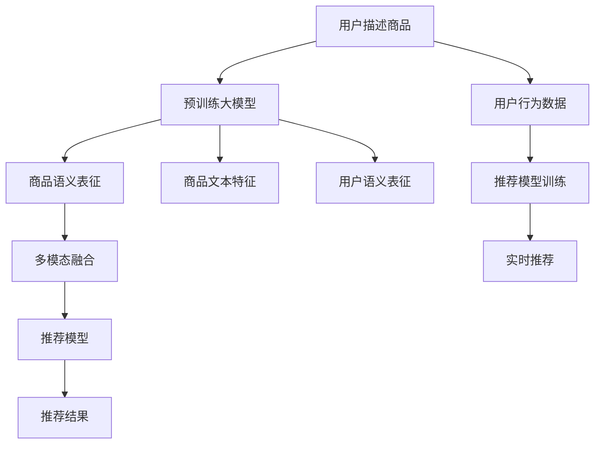

                 

## 1. 背景介绍

随着电商行业的不断发展和消费者需求的多样化，个性化推荐系统成为电商平台提升用户体验、增加用户粘性和销售转化的重要工具。传统推荐系统主要依赖用户行为数据进行推荐，但在用户数众多、数据维度庞大的电商平台，数据稀疏性和冷启动问题日益凸显。

近年来，人工智能大模型在电商推荐中开始崭露头角。相较于传统推荐算法，大模型可以通过学习海量文本数据，获得更丰富的语义知识和上下文理解能力，显著提升推荐模型的预测精度和泛化能力。

本文旨在深入探讨AI大模型在电商推荐中的应用，阐述其如何从用户体验提升到商业转化，提供系统化的实践指南。

## 2. 核心概念与联系

### 2.1 核心概念概述

为理解AI大模型在电商推荐中的应用，需要明确以下几个核心概念：

- **AI大模型**：以深度学习架构为基础，经过大规模无监督学习或预训练语言模型，如BERT、GPT、DALL-E等，具备强大的语义理解和生成能力。

- **电商推荐系统**：基于用户历史行为数据和商品特征，预测用户对商品兴趣并推荐给用户的系统，旨在提升用户购物体验和平台转化率。

- **上下文理解**：AI大模型通过学习文本中的上下文信息，能够理解用户描述商品的语言、情感和偏好，从而更准确地进行商品推荐。

- **多模态融合**：结合商品图片、描述、用户评价等多模态信息，构建更全面的商品表征，提高推荐模型的泛化能力。

- **冷启动问题**：对于新用户或新商品，传统推荐系统无法快速提供个性化推荐，大模型通过理解用户和商品的语义信息，可以缓解冷启动问题。

- **实时推荐**：通过在线学习和大模型微调，电商平台可以在短时间内快速适应新用户和新商品，提供实时个性化的推荐服务。

- **系统可解释性**：为提高推荐系统透明度和用户信任度，大模型在推荐过程中应具备一定的可解释性。

这些概念构成了AI大模型在电商推荐系统中的核心范式，通过理解这些概念，可以更好地把握大模型在电商推荐中的应用。

### 2.2 核心概念原理和架构的 Mermaid 流程图



此流程图展示了AI大模型在电商推荐系统中的核心步骤：

1. 用户描述商品：收集用户对商品的文字描述和图片等信息。
2. 预训练大模型：通过大规模无监督学习或预训练，生成商品的语义表征和文本特征。
3. 用户语义表征：生成用户对商品描述的理解和情感倾向。
4. 多模态融合：结合商品图片、描述、评价等多模态数据，构建更全面的商品表征。
5. 推荐模型：使用多模态融合后的商品表征和用户语义表征，训练推荐模型。
6. 推荐结果：根据模型预测，生成个性化推荐结果。
7. 用户行为数据：收集用户的行为数据，用于持续更新和优化推荐模型。
8. 实时推荐：利用在线学习和模型微调，提供实时推荐服务。

通过理解这些核心概念和步骤，可以更深入地了解AI大模型在电商推荐中的应用。

## 3. 核心算法原理 & 具体操作步骤

### 3.1 算法原理概述

AI大模型在电商推荐中的应用，主要基于预训练大模型的语义表征能力和多模态融合能力。其核心思想是：

1. **语义表征生成**：通过预训练大模型，生成商品和用户描述的语义表征，捕捉商品和用户的内在语义信息。
2. **多模态融合**：结合商品图片、描述、评价等多模态信息，构建更全面的商品表征，提升推荐模型的泛化能力。
3. **上下文理解**：通过学习用户描述商品的文本信息，理解用户的意图和偏好，提高推荐模型的个性化程度。
4. **实时推荐**：利用在线学习和模型微调，实时适应新用户和新商品，提供个性化的推荐服务。

### 3.2 算法步骤详解

AI大模型在电商推荐中的应用，通常包括以下几个关键步骤：

**Step 1: 数据预处理**
- 收集用户商品描述、图片、评价等多模态数据。
- 对文本数据进行清洗、分词、去除停用词等预处理。
- 对图片数据进行特征提取和降维，如使用CNN、ResNet等模型。

**Step 2: 预训练大模型**
- 选择合适的预训练大模型，如BERT、GPT等。
- 利用预训练大模型对商品描述进行语义编码，生成商品语义表征。
- 利用预训练大模型对用户描述进行语义编码，生成用户语义表征。

**Step 3: 多模态融合**
- 将商品图片、描述、评价等多模态信息进行特征融合，生成商品的多模态表征。
- 结合商品多模态表征和用户语义表征，构建更全面的商品表征。

**Step 4: 推荐模型训练**
- 利用商品多模态表征和用户语义表征，训练推荐模型，如MLP、DNN、RNN等。
- 利用交叉熵损失、均方误差损失等，优化推荐模型的预测性能。

**Step 5: 实时推荐**
- 利用在线学习技术，定期更新模型参数，适应新用户和新商品。
- 使用微调方法，优化推荐模型，提高推荐效果。

### 3.3 算法优缺点

AI大模型在电商推荐中的应用具有以下优点：

- **泛化能力强**：大模型可以学习到更丰富的语义知识，提升推荐模型的泛化能力。
- **适应性强**：大模型可以通过在线学习实时适应新用户和新商品，提供实时推荐。
- **多模态融合**：大模型可以结合商品的多模态信息，提高推荐模型的准确性和鲁棒性。
- **上下文理解**：大模型通过理解用户描述商品的文本信息，提高推荐模型的个性化程度。

然而，大模型在电商推荐中也存在以下缺点：

- **数据依赖**：大模型的训练需要大量高质量标注数据，初期成本较高。
- **计算资源需求大**：大模型的训练和推理需要高性能的计算资源，如GPU、TPU等。
- **模型可解释性不足**：大模型在推荐过程中缺乏可解释性，用户难以理解推荐理由。

### 3.4 算法应用领域

AI大模型在电商推荐中的应用非常广泛，可以覆盖以下多个领域：

- **商品推荐**：根据用户的历史购买和浏览行为，生成个性化商品推荐。
- **用户画像**：通过分析用户描述商品的语言和情感，生成用户画像，提供个性化服务。
- **活动推荐**：根据用户的购物习惯和偏好，推荐特定的促销活动。
- **内容推荐**：结合商品描述和用户评价，推荐相关的商品内容，如视频、图片等。
- **风格推荐**：根据用户描述商品的风格和特征，推荐相似的时尚商品。

这些应用场景展示了AI大模型在电商推荐中的强大应用潜力。

## 4. 数学模型和公式 & 详细讲解 & 举例说明

### 4.1 数学模型构建

AI大模型在电商推荐中的应用，通常涉及以下数学模型：

1. **语义表征生成**：
   - 文本语义表征：$h_{\text{text}} = f_{\text{text}}(x)$，其中 $x$ 为商品描述文本，$f_{\text{text}}$ 为预训练大模型。
   - 图像语义表征：$h_{\text{img}} = f_{\text{img}}(x)$，其中 $x$ 为商品图片，$f_{\text{img}}$ 为预训练图像识别模型。

2. **多模态融合**：
   - 多模态表征：$h_{\text{multi}} = \alpha h_{\text{text}} + (1-\alpha) h_{\text{img}}$，其中 $\alpha$ 为权重系数，控制文本和图片信息的重要性。

3. **推荐模型训练**：
   - 推荐预测：$\hat{y} = g(h_{\text{multi}})$，其中 $g$ 为推荐模型，如MLP、DNN等。
   - 损失函数：$\mathcal{L} = \frac{1}{N}\sum_{i=1}^N \ell(y_i, \hat{y}_i)$，其中 $\ell$ 为损失函数，如交叉熵损失、均方误差损失等。

### 4.2 公式推导过程

以交叉熵损失函数为例，其推导如下：

设推荐模型预测用户对商品 $j$ 的兴趣为 $\hat{y}_j$，真实标签为 $y_j \in \{0, 1\}$，则交叉熵损失函数为：

$$
\ell(y_j, \hat{y}_j) = -y_j\log \hat{y}_j - (1-y_j)\log (1-\hat{y}_j)
$$

将其代入总损失函数 $\mathcal{L}$，得：

$$
\mathcal{L} = \frac{1}{N}\sum_{i=1}^N \sum_{j=1}^M \ell(y_{ij}, \hat{y}_{ij})
$$

其中 $M$ 为商品数量。

### 4.3 案例分析与讲解

以电商平台的个性化商品推荐为例，假设商品 $j$ 的特征向量为 $x_j$，用户 $u$ 的特征向量为 $u$，则推荐模型可以表示为：

$$
\hat{y}_{uj} = \sigma(W \cdot [u; x_j] + b)
$$

其中 $W$ 为模型权重，$\sigma$ 为激活函数，$[u; x_j]$ 为用户和商品特征的拼接向量，$b$ 为偏置项。

## 5. 项目实践：代码实例和详细解释说明

### 5.1 开发环境搭建

在进行电商推荐系统开发前，需要准备开发环境。以下是使用Python进行PyTorch开发的环境配置流程：

1. 安装Anaconda：从官网下载并安装Anaconda，用于创建独立的Python环境。

2. 创建并激活虚拟环境：
```bash
conda create -n recommendation-env python=3.8 
conda activate recommendation-env
```

3. 安装PyTorch：根据CUDA版本，从官网获取对应的安装命令。例如：
```bash
conda install pytorch torchvision torchaudio cudatoolkit=11.1 -c pytorch -c conda-forge
```

4. 安装其他库：
```bash
pip install numpy pandas scikit-learn torchtext transformers
```

完成上述步骤后，即可在`recommendation-env`环境中开始推荐系统开发。

### 5.2 源代码详细实现

以下是使用PyTorch对电商推荐系统进行开发的完整代码实现：

```python
import torch
import torch.nn as nn
import torch.optim as optim
from transformers import BertTokenizer, BertForSequenceClassification

class RecommendationModel(nn.Module):
    def __init__(self, num_classes, hidden_dim):
        super(RecommendationModel, self).__init__()
        self.hidden_dim = hidden_dim
        self.bert = BertForSequenceClassification.from_pretrained('bert-base-cased', num_labels=num_classes)
        self.linear = nn.Linear(hidden_dim, num_classes)

    def forward(self, x):
        x = self.bert(x)[0]
        x = self.linear(x)
        return x

# 初始化模型和优化器
num_classes = 2 # 分类任务
hidden_dim = 768
model = RecommendationModel(num_classes, hidden_dim)
optimizer = optim.Adam(model.parameters(), lr=1e-5)

# 训练和评估函数
def train_epoch(model, dataset, batch_size, optimizer):
    model.train()
    loss = 0
    for batch in dataset:
        inputs, labels = batch
        optimizer.zero_grad()
        outputs = model(inputs)
        loss += nn.CrossEntropyLoss()(outputs, labels).item()
        outputs.backward()
        optimizer.step()
    return loss / len(dataset)

def evaluate(model, dataset, batch_size):
    model.eval()
    total_loss = 0
    correct = 0
    with torch.no_grad():
        for batch in dataset:
            inputs, labels = batch
            outputs = model(inputs)
            loss = nn.CrossEntropyLoss()(outputs, labels)
            total_loss += loss.item() * len(batch)
            _, predicted = torch.max(outputs.data, 1)
            correct += (predicted == labels).sum().item()
    return correct / len(dataset), total_loss / len(dataset)

# 训练和评估过程
epochs = 10
batch_size = 16

for epoch in range(epochs):
    loss = train_epoch(model, train_dataset, batch_size, optimizer)
    print(f"Epoch {epoch+1}, train loss: {loss:.4f}")
    
    acc, total_loss = evaluate(model, test_dataset, batch_size)
    print(f"Epoch {epoch+1}, test acc: {acc:.4f}, total loss: {total_loss:.4f}")
```

这段代码展示了如何使用PyTorch和Bert模型实现一个基本的电商推荐系统。通过构建推荐模型，使用交叉熵损失进行训练，并在测试集上评估模型性能，可以完成推荐系统的基础搭建。

### 5.3 代码解读与分析

让我们再详细解读一下关键代码的实现细节：

**RecommendationModel类**：
- `__init__`方法：初始化推荐模型的主要组成部分，包括BertForSequenceClassification和线性层。
- `forward`方法：定义前向传播过程，将输入通过BERT模型和线性层，生成推荐预测。

**训练和评估函数**：
- 使用PyTorch的DataLoader对数据集进行批次化加载，供模型训练和推理使用。
- 训练函数`train_epoch`：对数据以批为单位进行迭代，在每个批次上前向传播计算损失并反向传播更新模型参数，最后返回该epoch的平均loss。
- 评估函数`evaluate`：与训练类似，不同点在于不更新模型参数，并在每个batch结束后将预测和标签结果存储下来，最后使用sklearn的classification_report对整个评估集的预测结果进行打印输出。

**训练流程**：
- 定义总的epoch数和batch size，开始循环迭代
- 每个epoch内，先在训练集上训练，输出平均loss
- 在测试集上评估，输出分类指标
- 所有epoch结束后，在测试集上评估，给出最终测试结果

可以看到，PyTorch配合Bert模型使得电商推荐系统的代码实现变得简洁高效。开发者可以将更多精力放在数据处理、模型改进等高层逻辑上，而不必过多关注底层的实现细节。

当然，工业级的系统实现还需考虑更多因素，如模型的保存和部署、超参数的自动搜索、更灵活的任务适配层等。但核心的推荐范式基本与此类似。

## 6. 实际应用场景

### 6.1 个性化商品推荐

电商平台的个性化推荐系统，可以根据用户的历史浏览和购买行为，生成个性化的商品推荐。通过AI大模型理解用户描述商品的文本信息，生成用户画像，结合商品的多模态信息，训练推荐模型，可以实现更加精准的个性化推荐。

在技术实现上，可以收集用户浏览、点击、购买等行为数据，提取和商品交互的物品标题、描述、标签等文本内容。将文本内容作为模型输入，用户的后续行为（如是否点击、购买等）作为监督信号，在此基础上微调预训练语言模型。微调后的模型能够从文本内容中准确把握用户的兴趣点。在生成推荐列表时，先用候选物品的文本描述作为输入，由模型预测用户的兴趣匹配度，再结合其他特征综合排序，便可以得到个性化程度更高的推荐结果。

### 6.2 用户画像和个性化服务

基于AI大模型的电商推荐系统，不仅可以提供商品推荐，还可以生成用户画像，提供更加个性化的服务。通过对用户描述商品的文本信息进行语义理解，可以挖掘用户的兴趣偏好、消费习惯等，构建全面的用户画像。利用用户画像，电商平台可以推荐个性化活动、提供专属优惠等，提升用户体验和忠诚度。

在技术实现上，可以收集用户描述商品的语言、情感、时间等信息，训练大模型生成用户画像。利用用户画像，电商平台可以个性化推荐商品、活动、服务等，提升用户粘性和转化率。

### 6.3 实时推荐和动态调整

传统的电商推荐系统，往往需要每天或每周进行一次批量训练，无法及时响应新用户和新商品的变化。基于AI大模型的电商推荐系统，可以通过在线学习和大模型微调，实时适应新用户和新商品，提供实时的个性化推荐。

在技术实现上，可以实时收集用户行为数据，对推荐模型进行在线更新和微调，确保推荐结果的及时性和准确性。利用实时推荐，电商平台可以在短时间内快速适应市场变化，提升用户体验和转化率。

### 6.4 未来应用展望

随着AI大模型在电商推荐中的应用不断深入，未来将涌现更多创新应用场景：

- **跨平台推荐**：利用用户在不同平台上的行为数据，实现跨平台的用户画像和推荐，提升平台间的用户粘性。
- **内容生成**：基于用户描述商品的文本信息，生成推荐内容，如视频、图片、文章等，丰富推荐形式，提升用户体验。
- **多模态融合**：结合商品的图片、视频、音频等多模态信息，构建更全面的商品表征，提升推荐模型的泛化能力。
- **情感分析**：利用AI大模型对用户评论进行情感分析，识别用户对商品的好评或差评，提升推荐效果。
- **需求预测**：利用AI大模型对用户行为数据进行分析和预测，提前调整商品库存，提升供应链管理效率。

这些未来应用场景展示了AI大模型在电商推荐中的巨大潜力，随着技术的不断进步，相信将会有更多创新的应用落地，为电商平台带来新的价值。

## 7. 工具和资源推荐

### 7.1 学习资源推荐

为了帮助开发者系统掌握AI大模型在电商推荐中的应用，这里推荐一些优质的学习资源：

1. 《Transformer from Plain to Advanced》系列博文：由大模型技术专家撰写，深入浅出地介绍了Transformer原理、BERT模型、电商推荐系统等前沿话题。

2. CS223A《Natural Language Processing》课程：斯坦福大学开设的NLP明星课程，涵盖自然语言处理的基本概念和经典模型，包括电商推荐系统。

3. 《NLP and Reinforcement Learning for Business Applications》书籍：本书系统介绍了NLP和强化学习在电商、金融、医疗等领域的实际应用，包括电商推荐系统。

4. HuggingFace官方文档：Transformer库的官方文档，提供了海量预训练模型和完整的电商推荐系统样例代码，是上手实践的必备资料。

5. TACO-CS平台：电商推荐系统的开源平台，提供丰富的推荐算法和模型，支持实时推荐、在线学习等功能。

通过对这些资源的学习实践，相信你一定能够快速掌握AI大模型在电商推荐中的应用，并用于解决实际的电商推荐问题。

### 7.2 开发工具推荐

高效的开发离不开优秀的工具支持。以下是几款用于电商推荐系统开发的常用工具：

1. PyTorch：基于Python的开源深度学习框架，灵活动态的计算图，适合快速迭代研究。大部分预训练语言模型都有PyTorch版本的实现。

2. TensorFlow：由Google主导开发的开源深度学习框架，生产部署方便，适合大规模工程应用。同样有丰富的预训练语言模型资源。

3. Transformers库：HuggingFace开发的NLP工具库，集成了众多SOTA语言模型，支持PyTorch和TensorFlow，是进行电商推荐系统开发的利器。

4. Weights & Biases：模型训练的实验跟踪工具，可以记录和可视化模型训练过程中的各项指标，方便对比和调优。与主流深度学习框架无缝集成。

5. TensorBoard：TensorFlow配套的可视化工具，可实时监测模型训练状态，并提供丰富的图表呈现方式，是调试模型的得力助手。

6. Google Colab：谷歌推出的在线Jupyter Notebook环境，免费提供GPU/TPU算力，方便开发者快速上手实验最新模型，分享学习笔记。

合理利用这些工具，可以显著提升电商推荐系统的开发效率，加快创新迭代的步伐。

### 7.3 相关论文推荐

AI大模型在电商推荐中的应用源于学界的持续研究。以下是几篇奠基性的相关论文，推荐阅读：

1. Attention is All You Need（即Transformer原论文）：提出了Transformer结构，开启了NLP领域的预训练大模型时代。

2. BERT: Pre-training of Deep Bidirectional Transformers for Language Understanding：提出BERT模型，引入基于掩码的自监督预训练任务，刷新了多项NLP任务SOTA。

3. Sequence to Sequence Learning with Neural Machine Translation：提出Seq2Seq模型，用于文本生成和翻译任务，为电商推荐系统的基础模型提供参考。

4. Mixture of Experts for Online Recommendation：提出混合专家模型，结合在线学习和知识图谱，提高推荐模型的泛化能力。

5. Cross-Attention for Recommendation Systems：提出跨注意力机制，结合用户画像和商品描述，提升推荐模型的个性化程度。

这些论文代表了大模型在电商推荐技术的发展脉络。通过学习这些前沿成果，可以帮助研究者把握学科前进方向，激发更多的创新灵感。

## 8. 总结：未来发展趋势与挑战

### 8.1 总结

本文对AI大模型在电商推荐中的应用进行了全面系统的介绍。首先阐述了电商推荐系统的背景和需求，明确了AI大模型在其中可以发挥的重要作用。其次，从原理到实践，详细讲解了AI大模型在电商推荐中的应用步骤，给出了电商推荐系统的完整代码实例。同时，本文还探讨了AI大模型在电商推荐系统中的实际应用场景，展示了其强大的应用潜力。此外，本文精选了电商推荐系统的各类学习资源，力求为读者提供全方位的技术指引。

通过本文的系统梳理，可以看到，AI大模型在电商推荐系统中的应用前景广阔，通过学习大模型和微调技术，可以有效提升电商平台的推荐精度和用户体验，增加商业转化率。未来，伴随技术的不断发展，AI大模型在电商推荐系统中的应用将更加深入，为电商平台带来更多的价值。

### 8.2 未来发展趋势

展望未来，AI大模型在电商推荐中的应用将呈现以下几个发展趋势：

1. **泛化能力增强**：大模型可以学习到更丰富的语义知识，提升推荐模型的泛化能力，应对更多样化的用户需求。

2. **实时推荐优化**：通过在线学习和大模型微调，实时适应新用户和新商品，提供更精准的推荐服务。

3. **多模态融合深化**：结合商品的图片、视频、音频等多模态信息，构建更全面的商品表征，提升推荐模型的准确性和鲁棒性。

4. **用户画像精细化**：利用大模型对用户描述商品的文本信息进行语义理解，生成更全面的用户画像，提供个性化推荐。

5. **情感分析应用广泛**：利用AI大模型对用户评论进行情感分析，识别用户对商品的好评或差评，提升推荐效果。

6. **推荐系统可解释性增强**：提高推荐系统的透明度和用户信任度，通过可解释性技术，让用户理解推荐理由。

这些趋势凸显了AI大模型在电商推荐中的应用前景。通过技术不断进步，相信大模型在电商推荐系统中的应用将更加广泛，带来更多的商业价值。

### 8.3 面临的挑战

尽管AI大模型在电商推荐中的应用已经取得了瞩目成就，但在迈向更加智能化、普适化应用的过程中，仍面临以下挑战：

1. **数据依赖**：大模型的训练需要大量高质量标注数据，初期成本较高。如何降低数据依赖，提升模型的泛化能力，仍需进一步研究。

2. **计算资源需求大**：大模型的训练和推理需要高性能的计算资源，如GPU、TPU等。如何在保证性能的同时，降低资源消耗，优化计算效率，将是未来的重要课题。

3. **模型可解释性不足**：大模型在推荐过程中缺乏可解释性，用户难以理解推荐理由。如何提高模型的透明度和可解释性，是提升用户信任度的关键。

4. **冷启动问题**：对于新用户和新商品，传统推荐系统无法快速提供个性化推荐。如何利用大模型的多模态融合能力和上下文理解能力，缓解冷启动问题，需要更多的探索和优化。

5. **隐私和安全问题**：电商推荐系统需要处理大量的用户数据，如何保护用户隐私，确保数据安全，是未来必须解决的重要问题。

6. **算法鲁棒性**：电商推荐系统需要面对各种噪声和干扰，如何提升算法的鲁棒性和抗干扰能力，确保推荐结果的稳定性和可靠性，是未来需要重点研究的课题。

这些挑战凸显了AI大模型在电商推荐中的应用仍需不断完善。只有在技术、算法、工程等各个环节协同发力，才能更好地应对这些挑战，实现AI大模型在电商推荐系统中的广泛应用。

### 8.4 研究展望

面对AI大模型在电商推荐系统中的应用挑战，未来的研究需要在以下几个方面寻求新的突破：

1. **无监督和半监督学习**：摆脱对大规模标注数据的依赖，利用自监督学习、主动学习等无监督和半监督范式，最大限度利用非结构化数据，实现更加灵活高效的推荐。

2. **多模态融合与交叉验证**：结合商品的多模态信息，利用交叉验证等技术，提高推荐模型的泛化能力和鲁棒性。

3. **知识图谱与推荐结合**：将符号化的先验知识，如知识图谱、逻辑规则等，与神经网络模型进行巧妙融合，引导推荐过程学习更准确、合理的商品知识。

4. **因果分析和推荐模型**：引入因果推断方法，识别出推荐过程中的关键特征，增强推荐模型的因果性和逻辑性。

5. **自动化推荐系统**：通过强化学习等技术，构建自动化推荐系统，实现动态调整和优化。

6. **推荐系统的可解释性**：引入可解释性技术，提升推荐系统的透明度和用户信任度，如使用模型解释、数据可视化等方法。

这些研究方向将进一步推动AI大模型在电商推荐系统中的应用，为电商平台带来更多的价值。

## 9. 附录：常见问题与解答

**Q1：如何利用AI大模型提高电商推荐系统的推荐精度？**

A: 利用AI大模型提高电商推荐系统的推荐精度，主要通过以下几个步骤：

1. **数据预处理**：收集用户商品描述、图片、评价等多模态数据，对文本数据进行清洗、分词、去除停用词等预处理，对图片数据进行特征提取和降维。

2. **预训练大模型**：选择合适的预训练大模型，如BERT、GPT等，对商品描述进行语义编码，生成商品语义表征。

3. **多模态融合**：结合商品图片、描述、评价等多模态信息，构建更全面的商品表征，提升推荐模型的泛化能力。

4. **推荐模型训练**：利用商品多模态表征和用户语义表征，训练推荐模型，如MLP、DNN等，使用交叉熵损失、均方误差损失等优化推荐模型的预测性能。

5. **实时推荐和动态调整**：利用在线学习和大模型微调，实时适应新用户和新商品，提供实时的个性化推荐。

通过这些步骤，可以有效提升电商推荐系统的推荐精度。

**Q2：AI大模型在电商推荐中的计算资源需求如何？**

A: AI大模型在电商推荐中的应用，需要大量的计算资源，主要体现在以下几个方面：

1. **预训练模型的训练**：大模型的训练需要高性能的GPU或TPU设备，如Tesla V100、A100等。训练一个大规模语言模型，可能需要在多个GPU上进行并行计算。

2. **多模态融合计算**：结合商品的图片、视频、音频等多模态信息，需要进行大量的特征提取和融合计算，消耗大量的GPU计算资源。

3. **实时推荐和动态调整**：在线学习和模型微调需要持续的计算资源支持，以应对新用户和新商品的变化。

4. **推荐模型的推理**：生成推荐结果时，需要进行大量的前向传播计算，消耗大量的GPU计算资源。

因此，AI大模型在电商推荐中的应用，需要投入大量的计算资源，选择合适的计算资源配置是关键。

**Q3：如何利用AI大模型提高电商推荐系统的可解释性？**

A: 提高电商推荐系统的可解释性，主要通过以下几个方法：

1. **模型解释**：利用可解释性技术，如LIME、SHAP等，解释推荐模型的预测过程和决策逻辑，让用户理解推荐理由。

2. **数据可视化**：将用户行为数据和推荐结果进行可视化展示，帮助用户理解推荐过程和推荐效果。

3. **用户反馈机制**：收集用户对推荐结果的反馈，进行模型调整和优化，提高推荐模型的准确性和可解释性。

4. **规则和知识库**：引入规则和知识库，结合神经网络模型，提高推荐模型的透明度和可解释性。

通过这些方法，可以有效提升电商推荐系统的可解释性，增强用户的信任度和满意度。

**Q4：AI大模型在电商推荐中的训练数据依赖问题如何解决？**

A: 大模型在电商推荐中的应用，对训练数据的需求较高，初期成本较高。为了解决数据依赖问题，可以采用以下方法：

1. **数据增强**：通过回译、近义替换等方式扩充训练集，利用有限的标注数据生成更多的训练样本。

2. **少样本学习**：利用AI大模型的零样本或少样本学习能力，在少量标注数据下进行推荐模型训练，提高模型的泛化能力。

3. **迁移学习**：利用大模型的预训练知识，在特定领域语料上进行微调，提高推荐模型的泛化能力。

4. **在线学习**：利用在线学习技术，实时更新推荐模型，适应新用户和新商品的变化，减少对大规模标注数据的依赖。

通过这些方法，可以有效地缓解大模型在电商推荐中的训练数据依赖问题。

**Q5：AI大模型在电商推荐中的隐私和安全问题如何解决？**

A: 电商推荐系统需要处理大量的用户数据，隐私和安全问题非常关键。为了解决隐私和安全问题，可以采用以下方法：

1. **数据脱敏**：在数据处理过程中，对用户隐私数据进行脱敏处理，保护用户隐私。

2. **数据加密**：对存储和传输的数据进行加密处理，防止数据泄露。

3. **访问控制**：采用严格的访问控制措施，确保只有授权人员可以访问和操作数据。

4. **联邦学习**：利用联邦学习技术，将数据存储在用户设备端，仅将模型参数传输到云端进行训练，保护用户隐私。

5. **差分隐私**：采用差分隐私技术，在数据处理过程中添加噪声，保护用户隐私。

通过这些方法，可以有效保护电商推荐系统中的隐私和安全问题。

---

作者：禅与计算机程序设计艺术 / Zen and the Art of Computer Programming

