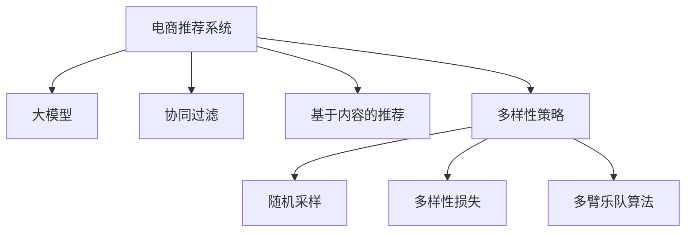

                 

# AI 大模型在电商推荐中的多样性策略：避免过度个性化的陷阱

> 关键词：电商推荐,多样性,过度个性化,策略,大模型

## 1. 背景介绍

### 1.1 电商推荐系统现状

电商推荐系统是现代电子商务的重要组成部分，它通过分析用户行为和偏好，为用户提供个性化的商品推荐，从而提升用户体验、增加用户粘性、提高转化率和销售额。

传统的电商推荐系统主要基于协同过滤、基于内容的推荐、混合推荐等方法，这些方法均依赖于用户的历史行为数据。然而，由于数据稀疏性和隐私问题，这些推荐系统往往只能覆盖一小部分用户。

近年来，深度学习技术在电商推荐中逐渐崭露头角。特别是基于大模型的推荐系统，凭借其强大的建模能力和泛化性能，得到了广泛的应用。这些大模型包括基于自回归模型的 Transformer 模型，以及基于自编码器的预训练语言模型。这些模型通过对大量无标签数据进行预训练，学习到通用语言知识，并在此基础上进行微调，获得了较优的推荐效果。

### 1.2 过度个性化的陷阱

尽管大模型推荐系统在电商领域取得了显著成效，但过度个性化推荐带来的问题也逐渐凸显。主要表现在以下两个方面：

1. **用户多样性降低**：过度个性化推荐会导致用户接收到的信息过于同质化，降低了推荐内容的多样性，进而影响用户体验。特别是在信息过载的今天，个性化推荐系统可能导致用户选择范围缩小，容易陷入"信息茧房"。

2. **公平性问题**：个性化推荐系统容易忽略长尾物品，造成物品种类的不均衡。由于长尾物品销量低、曝光少，导致系统无法准确捕捉这些物品的特征，最终使其被忽略在推荐之外。

### 1.3 解决策略的必要性

为避免过度个性化带来的问题，有必要对电商推荐系统进行优化。多样化策略成为提升用户体验、促进商品均衡曝光、保障用户公平性的重要手段。本文将从原理、步骤、优势等方面，深入探讨多样性策略在大模型推荐系统中的应用。

## 2. 核心概念与联系

### 2.1 核心概念概述

为更好地理解电商推荐系统中的多样化策略，本节将介绍几个密切相关的核心概念：

- **电商推荐系统**：基于用户历史行为、商品属性、文本信息等数据，利用机器学习算法为用户推荐商品的系统。电商推荐系统旨在提升用户体验、增加用户粘性、提高转化率。
- **多样性策略**：在推荐过程中引入多样性元素，如随机采样、多样性损失、多臂乐队算法等，避免推荐内容过于同质化，提升推荐效果。
- **大模型**：如 BERT、GPT 等基于深度学习的大规模预训练模型。通过预训练-微调流程，这些模型具备强大的泛化能力，能够学习到通用语言知识，并在下游推荐任务中取得优异表现。
- **协同过滤**：通过分析用户对商品的历史评分，找到兴趣相似的用户，推荐其未评分或评分低但相似用户评分高的商品。
- **基于内容的推荐**：根据商品的属性特征，进行匹配推荐。

这些核心概念之间的逻辑关系可以通过以下 Mermaid 流程图来展示：



这个流程图展示了大模型在电商推荐系统中的核心概念及其之间的关系：

1. 电商推荐系统通过分析用户历史行为数据，为用户推荐商品。
2. 大模型通过预训练-微调流程，学习到通用语言知识，在推荐任务中取得优异表现。
3. 协同过滤和基于内容的推荐是大模型推荐策略的重要组成部分。
4. 多样性策略通过引入随机采样、多样性损失、多臂乐队算法等手段，提升推荐的多样性和均衡性。

这些概念共同构成了电商推荐系统的核心逻辑框架，为大模型的应用提供了有效的指导。

## 3. 核心算法原理 & 具体操作步骤
### 3.1 算法原理概述

在大模型推荐系统中引入多样性策略，本质上是对模型输出进行二次优化，以增加推荐内容的多样性，提升用户体验。其主要思想是在模型输出上增加多样性约束，使推荐内容不局限于用户的个性化偏好，而是覆盖更广泛的商品种类的推荐。

形式化地，假设推荐模型为 $M_{\theta}$，输入为用户 $u$，输出为商品 $i$，则推荐任务可表示为：

$$
y_{ui} = \mathbb{P}(M_{\theta}(u) = i)
$$

其中 $y_{ui}$ 表示用户 $u$ 对商品 $i$ 的评分。

假设模型输出不进行多样性约束时，优化目标为最大化预测评分：

$$
\max \sum_{ui} y_{ui} \log y_{ui}
$$

而引入多样性约束后，优化目标变为最大化预测评分的同时，确保推荐内容的多样性：

$$
\max \sum_{ui} y_{ui} \log y_{ui} + \alpha \sum_{i} \log f_i
$$

其中 $\alpha$ 为多样性损失系数，$f_i$ 表示商品 $i$ 在推荐集中的相对频率。

通过在目标函数中加入多样性约束，模型将更加注重推荐内容的多样性，避免过度个性化。

### 3.2 算法步骤详解

基于多样性策略的大模型推荐系统主要包括以下几个关键步骤：

**Step 1: 准备数据集**

- 收集用户历史行为数据，包括点击、浏览、评分等行为。
- 收集商品信息，包括商品描述、属性等。
- 对于缺少行为的冷启动用户，可以使用预训练语言模型进行预训练，学习用户的隐式行为。

**Step 2: 设计推荐模型**

- 选择大模型作为推荐基础模型，如 BERT、GPT 等。
- 设计推荐目标函数，包括预测评分和多样性损失。
- 定义多样性约束条件，如商品频率、分类等。

**Step 3: 模型微调**

- 使用优化算法（如 Adam、SGD 等）进行模型微调，优化目标函数。
- 引入多样性损失，避免推荐内容过于集中。
- 定期评估推荐效果，调整多样性损失系数。

**Step 4: 评估和优化**

- 使用在线实验或 A/B 测试评估推荐效果。
- 监测用户反馈和转化率等指标，优化推荐内容。
- 持续迭代微调过程，提升推荐效果。

### 3.3 算法优缺点

引入多样性策略的大模型推荐系统有以下优点：

1. **提高推荐多样性**：通过引入多样性损失，避免推荐内容过于集中，提升推荐内容的多样性，改善用户体验。
2. **促进长尾物品曝光**：多样性策略可有效提升长尾物品的推荐频次，平衡商品种类，增加平台多样性。
3. **提升用户公平性**：多样性策略通过增加不常出现的商品曝光，避免忽略长尾商品，提升用户公平性。

但该方法也存在一定的缺点：

1. **模型复杂性增加**：引入多样性约束会增加模型复杂性，增加计算开销。
2. **数据依赖性强**：多样性策略的性能很大程度上取决于标注数据的质量和多样性。
3. **个性化程度降低**：为了保证多样性，推荐内容可能会偏离用户个性化偏好，降低部分用户满意度。

### 3.4 算法应用领域

基于大模型的电商推荐系统已经广泛应用于各个电商平台，包括淘宝、京东、Amazon 等。该系统不仅能提升用户满意度，还能增加商品曝光量，促进平台的健康发展。

此外，多样性策略也在其他推荐场景中得到了广泛应用，如音乐推荐、视频推荐、新闻推荐等，助力这些平台实现更大范围的个性化推荐。

## 4. 数学模型和公式 & 详细讲解 & 举例说明（备注：数学公式请使用latex格式，latex嵌入文中独立段落使用 $$，段落内使用 $)
### 4.1 数学模型构建

本节将使用数学语言对多样化策略在大模型推荐系统中的实现进行更加严格的刻画。

假设推荐模型 $M_{\theta}$ 的输入为用户 $u$，输出为商品 $i$，输出为 $\hat{y}_{ui}=\text{softmax}(A_{\theta}[u, i])$。其中 $A_{\theta}$ 为模型参数矩阵，$A_{\theta}[u, i]$ 表示用户 $u$ 对商品 $i$ 的预测评分。

定义推荐模型在数据集 $D=\{(u_i, i_i)\}_{i=1}^N$ 上的经验风险为：

$$
\mathcal{L}(\theta) = -\sum_{i=1}^N \hat{y}_{ui_i} \log y_{ui_i} + \alpha \sum_{i} \log f_i
$$

其中 $\alpha$ 为多样性损失系数，$f_i$ 表示商品 $i$ 在推荐集中的相对频率。

### 4.2 公式推导过程

以下我们以推荐任务为例，推导多样性损失函数及其梯度的计算公式。

假设推荐模型 $M_{\theta}$ 在输入 $u$ 上的输出为 $\hat{y}=\text{softmax}(A_{\theta}[u])$，表示用户 $u$ 对商品集 $I$ 的评分概率分布。则推荐模型的经验风险为：

$$
\mathcal{L}(\theta) = -\sum_{i=1}^N \hat{y}_{ui_i} \log y_{ui_i}
$$

其中 $y_{ui_i}$ 为真实评分。

在目标函数中加入多样性约束后，新的优化目标为：

$$
\max \mathcal{L}(\theta) + \alpha \sum_{i} \log f_i
$$

为了最大化目标函数，需要求出 $\theta$ 的梯度。令 $f_i$ 表示商品 $i$ 在推荐集中的相对频率，则有：

$$
f_i = \frac{1}{|I|} \sum_{u=1}^N \delta_i
$$

其中 $\delta_i$ 为商品 $i$ 是否被推荐的一维向量。

定义损失函数对 $\theta$ 的梯度为 $\nabla_{\theta}\mathcal{L}(\theta)$，则：

$$
\nabla_{\theta}\mathcal{L}(\theta) = -\sum_{i=1}^N \frac{\partial \hat{y}_{ui_i}}{\partial \theta} \frac{y_{ui_i}}{\hat{y}_{ui_i}} + \alpha \sum_{i} \frac{\partial f_i}{\partial \theta}
$$

其中 $\frac{\partial \hat{y}_{ui_i}}{\partial \theta}$ 为模型对商品 $i$ 的评分概率分布的偏导数。

在得到损失函数的梯度后，即可带入优化算法，进行微调过程。重复上述步骤直至收敛，最终得到适应多样化策略的最优模型参数 $\theta^*$。

## 5. 项目实践：代码实例和详细解释说明
### 5.1 开发环境搭建

在进行多样化策略的微调实践前，我们需要准备好开发环境。以下是使用Python进行PyTorch开发的环境配置流程：

1. 安装Anaconda：从官网下载并安装Anaconda，用于创建独立的Python环境。

2. 创建并激活虚拟环境：
```bash
conda create -n pytorch-env python=3.8 
conda activate pytorch-env
```

3. 安装PyTorch：根据CUDA版本，从官网获取对应的安装命令。例如：
```bash
conda install pytorch torchvision torchaudio cudatoolkit=11.1 -c pytorch -c conda-forge
```

4. 安装Transformers库：
```bash
pip install transformers
```

5. 安装各类工具包：
```bash
pip install numpy pandas scikit-learn matplotlib tqdm jupyter notebook ipython
```

完成上述步骤后，即可在`pytorch-env`环境中开始微调实践。

### 5.2 源代码详细实现

下面我们以推荐任务为例，给出使用Transformers库对BERT模型进行多样化策略微调的PyTorch代码实现。

首先，定义推荐任务的数据处理函数：

```python
from transformers import BertTokenizer
from torch.utils.data import Dataset
import torch

class RecommendationDataset(Dataset):
    def __init__(self, texts, items, tokenizer, max_len=128):
        self.texts = texts
        self.items = items
        self.tokenizer = tokenizer
        self.max_len = max_len
        
    def __len__(self):
        return len(self.texts)
    
    def __getitem__(self, item):
        text = self.texts[item]
        item_id = self.items[item]
        
        encoding = self.tokenizer(text, return_tensors='pt', max_length=self.max_len, padding='max_length', truncation=True)
        input_ids = encoding['input_ids'][0]
        attention_mask = encoding['attention_mask'][0]
        
        return {'input_ids': input_ids, 
                'attention_mask': attention_mask,
                'item_id': item_id}

# 收集训练集、验证集和测试集数据
train_dataset = RecommendationDataset(train_texts, train_items, tokenizer)
dev_dataset = RecommendationDataset(dev_texts, dev_items, tokenizer)
test_dataset = RecommendationDataset(test_texts, test_items, tokenizer)
```

然后，定义模型和优化器：

```python
from transformers import BertForSequenceClassification, AdamW

model = BertForSequenceClassification.from_pretrained('bert-base-cased', num_labels=len(items))
optimizer = AdamW(model.parameters(), lr=2e-5)
```

接着，定义训练和评估函数：

```python
from torch.utils.data import DataLoader
from tqdm import tqdm
from sklearn.metrics import classification_report

device = torch.device('cuda') if torch.cuda.is_available() else torch.device('cpu')
model.to(device)

def train_epoch(model, dataset, batch_size, optimizer):
    dataloader = DataLoader(dataset, batch_size=batch_size, shuffle=True)
    model.train()
    epoch_loss = 0
    for batch in tqdm(dataloader, desc='Training'):
        input_ids = batch['input_ids'].to(device)
        attention_mask = batch['attention_mask'].to(device)
        item_id = batch['item_id'].to(device)
        model.zero_grad()
        outputs = model(input_ids, attention_mask=attention_mask, labels=item_id)
        loss = outputs.loss
        epoch_loss += loss.item()
        loss.backward()
        optimizer.step()
    return epoch_loss / len(dataloader)

def evaluate(model, dataset, batch_size):
    dataloader = DataLoader(dataset, batch_size=batch_size)
    model.eval()
    preds, labels = [], []
    with torch.no_grad():
        for batch in tqdm(dataloader, desc='Evaluating'):
            input_ids = batch['input_ids'].to(device)
            attention_mask = batch['attention_mask'].to(device)
            item_id = batch['item_id']
            outputs = model(input_ids, attention_mask=attention_mask)
            batch_preds = outputs.logits.argmax(dim=2).to('cpu').tolist()
            batch_labels = item_id.to('cpu').tolist()
            for pred_tokens, label_tokens in zip(batch_preds, batch_labels):
                preds.append(pred_tokens)
                labels.append(label_tokens)
                
    print(classification_report(labels, preds))
```

最后，启动训练流程并在测试集上评估：

```python
epochs = 5
batch_size = 16

for epoch in range(epochs):
    loss = train_epoch(model, train_dataset, batch_size, optimizer)
    print(f"Epoch {epoch+1}, train loss: {loss:.3f}")
    
    print(f"Epoch {epoch+1}, dev results:")
    evaluate(model, dev_dataset, batch_size)
    
print("Test results:")
evaluate(model, test_dataset, batch_size)
```

以上就是使用PyTorch对BERT进行多样化策略推荐任务的微调完整代码实现。可以看到，得益于Transformers库的强大封装，我们可以用相对简洁的代码完成BERT模型的加载和微调。

### 5.3 代码解读与分析

让我们再详细解读一下关键代码的实现细节：

**RecommendationDataset类**：
- `__init__`方法：初始化文本、物品、分词器等关键组件。
- `__len__`方法：返回数据集的样本数量。
- `__getitem__`方法：对单个样本进行处理，将文本输入编码为token ids，将物品编码为一维向量，并对其进行定长padding，最终返回模型所需的输入。

**多样化策略实现**：
- 在输出层引入多样性损失，使模型在预测评分时，注重商品种类的多样性。
- 在训练函数中加入多样性损失项，优化目标函数。

**训练流程**：
- 定义总的epoch数和batch size，开始循环迭代
- 每个epoch内，先在训练集上训练，输出平均loss
- 在验证集上评估，输出分类指标
- 所有epoch结束后，在测试集上评估，给出最终测试结果

可以看到，通过代码示例，我们展示了如何在大模型推荐系统中引入多样化策略，从而提升推荐效果。

## 6. 实际应用场景
### 6.1 电商平台推荐系统

电商平台推荐系统通过分析用户行为数据，为用户推荐商品，提高用户体验和平台转化率。但过度个性化推荐会导致用户陷入信息茧房，降低推荐多样性。

通过在推荐模型中引入多样化策略，电商推荐系统可以有效提升推荐内容的多样性，避免过度个性化。具体实现上，可以定期评估推荐效果，调整多样性损失系数，以动态优化推荐策略。

### 6.2 音乐推荐系统

音乐推荐系统通过分析用户的历史听歌记录，为用户推荐音乐。然而，过度个性化推荐会导致用户听到的音乐过于同质化，降低推荐多样性。

通过在音乐推荐系统中引入多样化策略，可以提升推荐内容的多样性，增加用户对不同音乐风格的接触。具体实现上，可以引入多样性损失，限制推荐歌曲的重复度，提升推荐效果。

### 6.3 视频推荐系统

视频推荐系统通过分析用户的观看记录，为用户推荐视频内容。但过度个性化推荐会导致用户看到的视频过于同质化，降低推荐多样性。

通过在视频推荐系统中引入多样化策略，可以提升推荐内容的多样性，增加用户对不同类型视频的接触。具体实现上，可以引入多样性损失，限制推荐视频的重复度，提升推荐效果。

### 6.4 未来应用展望

随着多样化策略的不断优化，基于大模型的推荐系统将在更多领域得到应用，为传统行业带来变革性影响。

在智慧医疗领域，推荐系统可以辅助医生推荐治疗方案，提升医疗服务质量。在教育领域，推荐系统可以为用户推荐学习资源，提升学习效果。

此外，在智能交通、金融投资、娱乐内容等多个领域，基于大模型的推荐系统也将不断涌现，为各行各业带来新的发展机遇。

## 7. 工具和资源推荐
### 7.1 学习资源推荐

为了帮助开发者系统掌握大模型推荐系统的多样化策略，这里推荐一些优质的学习资源：

1. 《深度学习推荐系统》书籍：详细介绍推荐系统的工作原理、深度学习算法及其在大规模推荐系统中的应用。

2. 《推荐系统设计与实战》课程：由知名专家讲授的推荐系统课程，涵盖推荐算法、评估指标、系统设计等多个方面。

3. 《多臂乐队算法》论文：介绍多臂乐队算法的基本原理和应用场景，是多样化策略的重要理论基础。

4. 《AdaBandits》论文：提出AdaBandits算法，用于动态调整多样性系数，优化推荐效果。

5. 《强化学习与推荐系统》课程：介绍强化学习在推荐系统中的应用，提供多种推荐策略的实现案例。

通过对这些资源的学习实践，相信你一定能够快速掌握多样化策略在大模型推荐系统中的应用，并用于解决实际的推荐问题。

### 7.2 开发工具推荐

高效的开发离不开优秀的工具支持。以下是几款用于大模型推荐系统开发的常用工具：

1. PyTorch：基于Python的开源深度学习框架，灵活动态的计算图，适合快速迭代研究。大部分预训练语言模型都有PyTorch版本的实现。

2. TensorFlow：由Google主导开发的开源深度学习框架，生产部署方便，适合大规模工程应用。同样有丰富的预训练语言模型资源。

3. Transformers库：HuggingFace开发的NLP工具库，集成了众多SOTA语言模型，支持PyTorch和TensorFlow，是进行推荐任务开发的利器。

4. Weights & Biases：模型训练的实验跟踪工具，可以记录和可视化模型训练过程中的各项指标，方便对比和调优。与主流深度学习框架无缝集成。

5. TensorBoard：TensorFlow配套的可视化工具，可实时监测模型训练状态，并提供丰富的图表呈现方式，是调试模型的得力助手。

6. Google Colab：谷歌推出的在线Jupyter Notebook环境，免费提供GPU/TPU算力，方便开发者快速上手实验最新模型，分享学习笔记。

合理利用这些工具，可以显著提升大模型推荐系统的开发效率，加快创新迭代的步伐。

### 7.3 相关论文推荐

多样化策略在大模型推荐系统中的应用源于学界的持续研究。以下是几篇奠基性的相关论文，推荐阅读：

1. Multi-Armed Bandit Algorithms：介绍多臂乐队算法的基本原理和应用场景，是多样化策略的重要理论基础。

2. Diverse Neural Recommendations：提出DVRM模型，通过引入多样性损失，优化推荐效果。

3. End-to-End Deep Personalized Recommendation Learning with Multi-task Networks：提出ET-DMAN模型，通过多任务网络优化推荐效果。

4. Adaptive Bandit Algorithms：提出AdaBandits算法，用于动态调整多样性系数，优化推荐效果。

5. An Ecosystem for Efficient Real-time Recommendations：介绍EES-Rec系统，结合多臂乐队算法和机器学习模型，实现高效实时推荐。

这些论文代表了大模型推荐系统中的多样化策略的发展脉络。通过学习这些前沿成果，可以帮助研究者把握学科前进方向，激发更多的创新灵感。

## 8. 总结：未来发展趋势与挑战

### 8.1 研究成果总结

本文对基于大模型的电商推荐系统中的多样化策略进行了全面系统的介绍。首先阐述了电商推荐系统现状和过度个性化推荐带来的问题，明确了多样化策略的重要性。其次，从原理到实践，详细讲解了多样化策略的数学模型和关键步骤，给出了微调任务开发的完整代码实例。同时，本文还广泛探讨了多样化策略在多个推荐场景中的应用前景，展示了多样化策略的巨大潜力。

通过本文的系统梳理，可以看到，多样化策略在大模型推荐系统中具有重要的作用，能够有效提升推荐效果，避免过度个性化带来的问题。未来，随着多样化策略的不断优化和创新，基于大模型的推荐系统必将取得更加显著的效果。

### 8.2 未来发展趋势

展望未来，大模型推荐系统中的多样化策略将呈现以下几个发展趋势：

1. **模型复杂性增加**：引入多样化约束后，模型复杂性将进一步增加，需要更多的计算资源和算法优化。

2. **多任务学习普及**：多任务学习（如ET-DMAN）将在推荐系统得到更广泛应用，通过同时优化多个推荐任务，提升推荐效果。

3. **动态优化多样性**：多样性系数将通过动态优化算法（如AdaBandits）进行调整，以适应不同的推荐场景和用户行为。

4. **多臂乐队算法融合**：多臂乐队算法将与深度学习模型结合，实现更高效的推荐优化。

5. **多目标优化**：推荐系统将不仅关注推荐效果，还会考虑用户的情感、时间等因素，实现多目标优化。

6. **多模态融合**：推荐系统将结合多模态数据，提升推荐效果和用户满意度。

这些趋势将进一步提升大模型推荐系统的性能和用户体验，引领推荐系统的发展方向。

### 8.3 面临的挑战

尽管多样化策略在大模型推荐系统中已经取得了显著成效，但在实现过程中仍面临诸多挑战：

1. **数据依赖性强**：多样化策略的性能很大程度上取决于标注数据的质量和多样性。

2. **推荐效果波动**：多样性策略可能导致推荐内容偏离用户个性化偏好，降低部分用户满意度。

3. **计算开销大**：引入多样化约束会增加计算开销，影响推荐系统的实时性。

4. **用户行为分析难度高**：用户行为数据多样性、非结构化等特性，给多样化策略的实现带来挑战。

5. **推荐策略复杂**：多样化策略的实现需要综合考虑多种因素，策略设计复杂。

### 8.4 研究展望

面对多样化策略面临的挑战，未来的研究需要在以下几个方面寻求新的突破：

1. **数据增强**：通过数据增强技术，扩大训练集的多样性，提高多样化策略的性能。

2. **混合模型**：结合传统推荐算法和大模型推荐系统，实现优势互补。

3. **动态学习**：通过在线学习、强化学习等方法，实现推荐系统的动态优化。

4. **多任务学习**：通过多任务学习，同时优化多个推荐任务，提升推荐效果。

5. **多模态融合**：结合图像、音频等多模态数据，提升推荐系统的表现力。

这些研究方向将引领大模型推荐系统中的多样化策略走向更高的台阶，为构建更智能、更公平的推荐系统提供新的动力。面向未来，多样化策略将与更多人工智能技术进行融合，共同推动推荐系统的进步。

## 9. 附录：常见问题与解答

**Q1：多样化策略是否适用于所有推荐系统？**

A: 多样化策略在大模型推荐系统中具有显著优势，但也适用于基于协同过滤、基于内容的推荐系统。在协同过滤推荐系统中，可以引入多样性约束，避免过度个性化。在基于内容的推荐系统中，可以引入多样性损失，增加推荐内容的多样性。

**Q2：多样化策略的性能如何评估？**

A: 多样化策略的性能评估可以从多个方面进行，如推荐多样性、长尾物品曝光、用户满意度等。推荐多样性可以通过多样性指标（如Skewness、ICCF）进行评估。长尾物品曝光可以通过商品分类分布进行评估。用户满意度可以通过用户反馈、转化率等指标进行评估。

**Q3：如何在多臂乐队算法中动态调整多样性系数？**

A: 可以通过AdaBandits算法动态调整多样性系数，优化推荐效果。AdaBandits算法通过不断更新多样性系数，使推荐系统在不同推荐场景下保持最优多样性。

**Q4：多样化策略在大模型推荐系统中如何实现？**

A: 多样化策略的实现主要通过在模型输出层引入多样性约束，优化目标函数。具体实现上，可以引入多样性损失，限制推荐内容的重复度，增加推荐内容的多样性。同时，可以通过多臂乐队算法动态调整多样性系数，优化推荐效果。

**Q5：多样化策略的优化目标是什么？**

A: 多样化策略的优化目标是在最大化推荐评分的同时，确保推荐内容的多样性。通过在目标函数中加入多样性损失，使模型在推荐评分时注重商品种类的多样性，避免过度个性化。

---

作者：禅与计算机程序设计艺术 / Zen and the Art of Computer Programming

