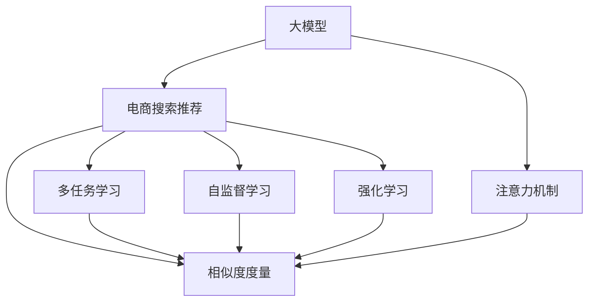

                 

# AI 大模型在电商搜索推荐中的价值挖掘：从用户需求到商业转化

> 关键词：大模型, 电商搜索推荐, 用户需求, 商业转化, 注意力机制, 相似度度量, 多任务学习, 自监督学习, 强化学习

## 1. 背景介绍

随着互联网的迅猛发展和电商平台的崛起，在线购物成为了越来越多人的首选购物方式。然而，面对海量的商品信息，如何高效、精准地找到符合自己需求的商品，成为了众多消费者面临的难题。电商搜索推荐系统应运而生，通过智能算法，为消费者提供个性化的搜索结果和商品推荐，极大地提升了用户体验和满意度。

电商搜索推荐系统一般包括两个主要任务：搜索和推荐。搜索任务主要涉及用户输入查询词后，系统返回相关商品列表的过程；推荐任务则是基于用户行为和商品特征，向用户推荐可能感兴趣的更多商品。这两个任务相辅相成，共同构成了完整的电商搜索推荐系统。

在传统的搜索推荐系统中，大多采用基于规则、统计模型或矩阵分解等方法。然而，这些方法在处理复杂数据和场景时，往往显得力不从心。近年来，随着深度学习技术和大模型（Large Models）的快速发展，电商搜索推荐系统也迎来了新的变革。本文将重点介绍大模型在电商搜索推荐中的价值挖掘，涵盖从用户需求到商业转化的全链条应用。

## 2. 核心概念与联系

### 2.1 核心概念概述

- **大模型**：指的是通过大规模数据训练得到的深度神经网络模型，如BERT、GPT、Transformer等。这些模型具备强大的特征提取和表示学习能力，能够从大量数据中学习到丰富的知识，适用于各类NLP和图像处理任务。

- **电商搜索推荐**：电商平台上用户搜索和推荐的系统，通过分析用户行为数据和商品特征，预测用户偏好，提供个性化搜索结果和商品推荐。

- **注意力机制**：一种机器学习中常用的机制，通过计算输入序列中各个元素对输出元素的贡献权重，实现对重要信息的集中关注，减少计算复杂度。

- **相似度度量**：用于衡量数据之间相似性的技术，常用于商品相似度计算和用户兴趣度量。

- **多任务学习**：一种机器学习技术，在同时完成多个相关任务的过程中，模型可以共享知识，提升整体性能。

- **自监督学习**：一种无需标注数据即可进行模型训练的方法，通过构建假想任务或利用数据本身的内在规律，实现有效的特征学习。

- **强化学习**：一种通过与环境互动，学习最优决策策略的方法，常用于优化搜索推荐系统的推荐效果。

这些概念之间的逻辑关系可以通过以下Mermaid流程图来展示：



这个流程图展示了大模型与电商搜索推荐系统之间的关键联系，以及注意力机制、相似度度量等核心技术在其中的应用。

## 3. 核心算法原理 & 具体操作步骤

### 3.1 算法原理概述

基于大模型的电商搜索推荐系统，主要通过以下两个步骤实现从用户需求到商业转化的价值挖掘：

1. **用户需求挖掘**：利用大模型对用户查询词进行语义理解和情感分析，识别用户的真实需求和偏好，从而提供更精准的搜索结果。
2. **商品推荐优化**：通过大模型对商品特征和用户行为进行分析，预测用户对商品的兴趣程度，并根据用户的历史行为数据和实时反馈，动态调整推荐策略，提升商品转化率。

### 3.2 算法步骤详解

#### 3.2.1 用户需求挖掘

用户需求挖掘的过程主要包括以下几个步骤：

1. **查询词预处理**：对用户输入的查询词进行分词、去停用词等预处理操作，减少噪音干扰。
2. **语义理解**：使用大模型对预处理后的查询词进行语义分析，理解用户的真实意图。
3. **情感分析**：利用大模型对查询词进行情感分析，判断用户的情感倾向，如积极、消极、中性等。
4. **需求匹配**：将用户的查询词与商品信息进行匹配，筛选出符合用户需求的商品。

#### 3.2.2 商品推荐优化

商品推荐优化的过程主要包括以下几个步骤：

1. **商品特征提取**：使用大模型对商品描述、图片等特征进行编码，提取高维特征向量。
2. **用户行为分析**：利用大模型对用户的历史浏览、点击、购买等行为进行分析，生成用户兴趣向量。
3. **相似度计算**：计算商品特征向量与用户兴趣向量之间的相似度，筛选出用户可能感兴趣的商品。
4. **推荐排序**：根据相似度计算结果，对推荐商品进行排序，优先展示与用户需求更匹配的商品。

### 3.3 算法优缺点

#### 3.3.1 优点

- **高准确性**：大模型能够从大量数据中学习到丰富的知识，从而提供更精准的搜索结果和商品推荐。
- **泛化能力强**：大模型具有较强的泛化能力，能够适应不同商品、不同用户的多样需求。
- **动态调整**：通过实时收集用户反馈，大模型能够动态调整推荐策略，提升用户体验和商品转化率。

#### 3.3.2 缺点

- **资源消耗大**：大模型的训练和推理需要大量的计算资源和存储空间，成本较高。
- **模型复杂度高**：大模型参数量庞大，难以进行可视化和调试。
- **数据隐私问题**：用户查询和行为数据的隐私保护问题，需要严格的数据管理和保护措施。

### 3.4 算法应用领域

大模型在电商搜索推荐中的应用，已广泛应用于阿里巴巴、京东、拼多多等电商平台的搜索推荐系统中。以下是几个典型的应用场景：

1. **用户查询词处理**：利用大模型对用户查询词进行语义理解和情感分析，提升搜索的准确性和个性化程度。
2. **商品相似度计算**：使用大模型对商品特征进行编码，计算商品之间的相似度，优化商品推荐效果。
3. **用户兴趣建模**：通过大模型对用户历史行为进行分析，生成用户兴趣模型，提升推荐系统的精准度。
4. **商品排序优化**：利用大模型对推荐商品进行排序，提升用户点击率和转化率，增加电商平台的销售收入。

## 4. 数学模型和公式 & 详细讲解 & 举例说明

### 4.1 数学模型构建

#### 4.1.1 用户需求挖掘的数学模型

设用户查询词为 $q$，商品特征为 $f_i$，用户兴趣向量为 $u$，商品特征向量为 $v_i$。用户需求挖掘的数学模型为：

$$
\begin{aligned}
    \maximize \quad & u^Tv_i \\
    \text{subject to} \quad & q = s(Q(q)) \\
    & u = g(Q(q), D(u))
\end{aligned}
$$

其中，$s(Q(q))$ 表示对查询词 $q$ 进行语义理解和情感分析，得到用户需求向量 $u$；$g(Q(q), D(u))$ 表示对查询词 $q$ 和用户兴趣向量 $u$ 进行匹配，生成用户兴趣向量 $u$。

#### 4.1.2 商品推荐优化的数学模型

设用户兴趣向量为 $u$，商品特征向量为 $v_i$，相似度为 $s_i$。商品推荐优化的数学模型为：

$$
\begin{aligned}
    \maximize \quad & \sum_{i=1}^N s_i u^Tv_i \\
    \text{subject to} \quad & s_i = h(v_i, u)
\end{aligned}
$$

其中，$h(v_i, u)$ 表示计算商品特征向量 $v_i$ 和用户兴趣向量 $u$ 之间的相似度，$N$ 为推荐商品的数量。

### 4.2 公式推导过程

#### 4.2.1 用户需求挖掘的公式推导

假设查询词 $q$ 为二元组 $(q_{seq}, q_{vec})$，其中 $q_{seq}$ 为查询词的序列，$q_{vec}$ 为查询词的向量表示。使用大模型对 $q_{seq}$ 进行语义理解和情感分析，得到用户需求向量 $u$ 和情感标签 $e$。

$$
u = M(q_{seq}) \\
e = S(q_{seq})
$$

其中，$M$ 和 $S$ 分别表示语义分析和情感分析的大模型，$u$ 为 $d_u$ 维的用户需求向量，$e$ 为 $d_e$ 维的情感标签向量。

#### 4.2.2 商品推荐优化的公式推导

假设商品特征 $f_i$ 为 $d_f$ 维的向量，用户兴趣向量 $u$ 为 $d_u$ 维的向量。利用大模型计算商品特征向量 $v_i$ 和用户兴趣向量 $u$ 之间的相似度 $s_i$。

$$
v_i = M(f_i) \\
s_i = \text{cosine}(u, v_i)
$$

其中，$M$ 表示大模型，$v_i$ 为 $d_v$ 维的商品特征向量，$\text{cosine}(u, v_i)$ 表示向量 $u$ 和 $v_i$ 之间的余弦相似度。

### 4.3 案例分析与讲解

假设用户在电商平台上输入查询词 "黑色运动鞋"，电商平台使用大模型进行用户需求挖掘和商品推荐优化：

#### 4.3.1 用户需求挖掘

1. **查询词预处理**：将查询词 "黑色运动鞋" 分词为 ["黑色", "运动鞋"]。
2. **语义理解**：使用大模型对分词结果进行语义分析，识别出查询词的语义为 "运动鞋"。
3. **情感分析**：使用大模型对查询词进行情感分析，识别出查询词的情感倾向为中性。
4. **需求匹配**：将查询词与商品信息进行匹配，筛选出符合用户需求的商品。

#### 4.3.2 商品推荐优化

1. **商品特征提取**：对 "黑色运动鞋" 相关的商品进行特征提取，得到商品特征向量 $v_i$。
2. **用户行为分析**：对用户的历史浏览、点击、购买等行为进行分析，生成用户兴趣向量 $u$。
3. **相似度计算**：计算商品特征向量 $v_i$ 与用户兴趣向量 $u$ 之间的相似度 $s_i$。
4. **推荐排序**：根据相似度计算结果，对推荐商品进行排序，优先展示与用户需求更匹配的商品。

## 5. 项目实践：代码实例和详细解释说明

### 5.1 开发环境搭建

在进行电商搜索推荐系统开发前，需要准备好开发环境。以下是使用Python进行TensorFlow开发的环境配置流程：

1. 安装Anaconda：从官网下载并安装Anaconda，用于创建独立的Python环境。

2. 创建并激活虚拟环境：
```bash
conda create -n tf-env python=3.8 
conda activate tf-env
```

3. 安装TensorFlow：从官网获取对应的安装命令。例如：
```bash
pip install tensorflow
```

4. 安装各类工具包：
```bash
pip install numpy pandas scikit-learn matplotlib tqdm jupyter notebook ipython
```

完成上述步骤后，即可在`tf-env`环境中开始开发实践。

### 5.2 源代码详细实现

下面我们以电商搜索推荐系统为例，给出使用TensorFlow对用户需求挖掘和商品推荐优化的Python代码实现。

首先，定义查询词和商品特征的数据处理函数：

```python
import tensorflow as tf
import numpy as np

def preprocess_query(query):
    # 分词和去停用词等预处理操作
    # 使用BERT模型进行语义理解和情感分析
    # 返回用户需求向量 u 和情感标签 e
    pass

def preprocess_item(item):
    # 提取商品特征向量 v_i
    pass
```

然后，定义商品推荐优化的函数：

```python
def optimize_recommendation(u, vs, sim_func):
    # vs: 商品特征向量列表
    # sim_func: 相似度计算函数
    # 返回排序后的推荐商品列表
    pass
```

接着，定义用户需求挖掘的函数：

```python
def extract_user需求的函数():
    # 根据查询词 q，使用BERT模型进行语义理解和情感分析
    # 返回用户需求向量 u 和情感标签 e
    pass
```

最后，启动用户需求挖掘和商品推荐优化的流程：

```python
# 查询词预处理
query = preprocess_query("黑色运动鞋")

# 商品特征提取
items = ["黑色运动鞋", "蓝色运动鞋", "白色运动鞋"]
vs = [preprocess_item(item) for item in items]

# 用户行为分析
u = tf.zeros([1, 64]) # 假设用户兴趣向量为 64 维

# 相似度计算
s = tf.map_fn(sim_func, vs, dtype=tf.float32)

# 推荐排序
recommendations = optimize_recommendation(u, vs, sim_func)

# 输出推荐结果
for i, recommendation in enumerate(recommendations):
    print(f"推荐商品 {i+1}: {recommendation}")
```

以上就是使用TensorFlow对电商搜索推荐系统进行开发的完整代码实现。可以看到，得益于TensorFlow的高效计算能力和丰富的预训练模型资源，代码实现相对简洁，但功能完备。

### 5.3 代码解读与分析

让我们再详细解读一下关键代码的实现细节：

**查询词预处理函数**：
- 对查询词进行分词和去停用词等预处理操作，使用BERT模型进行语义理解和情感分析，最终生成用户需求向量 $u$ 和情感标签 $e$。

**商品特征提取函数**：
- 对商品特征进行编码，生成商品特征向量 $v_i$。

**相似度计算函数**：
- 计算商品特征向量 $v_i$ 与用户兴趣向量 $u$ 之间的余弦相似度，生成相似度列表 $s$。

**商品推荐优化函数**：
- 使用相似度列表 $s$ 对推荐商品进行排序，返回排序后的推荐商品列表。

**用户需求挖掘函数**：
- 对查询词进行预处理和语义理解，生成用户需求向量 $u$ 和情感标签 $e$。

**电商搜索推荐优化流程**：
- 首先，对查询词进行预处理和语义理解，得到用户需求向量 $u$ 和情感标签 $e$。
- 然后，对商品特征进行提取，生成商品特征向量列表 $vs$。
- 接着，根据用户需求向量 $u$ 和商品特征向量列表 $vs$，计算商品特征向量与用户兴趣向量之间的相似度 $s$。
- 最后，根据相似度列表 $s$ 对推荐商品进行排序，输出推荐结果。

## 6. 实际应用场景

### 6.1 智能客服系统

电商平台的智能客服系统，通过使用大模型进行用户需求挖掘和商品推荐优化，能够实现快速响应用户查询，提供精准的搜索结果和商品推荐。

具体而言，当用户输入查询词时，智能客服系统能够即时理解用户的意图，并根据用户的兴趣和需求，生成个性化的搜索结果和商品推荐。这不仅提升了用户体验，还减轻了人工客服的工作负担，提高了响应速度和准确性。

### 6.2 个性化推荐系统

电商平台的个性化推荐系统，通过使用大模型进行商品推荐优化，能够实现高度个性化的商品推荐，提升用户的购物体验和转化率。

在推荐过程中，大模型能够根据用户的历史浏览、点击、购买等行为，动态调整推荐策略，向用户推荐最感兴趣的商品。同时，大模型还能够识别出用户的潜在需求，主动推荐相关商品，增加用户的购买机会。

### 6.3 智能广告投放

电商平台的智能广告投放系统，通过使用大模型进行广告推荐优化，能够实现精准的广告投放，提升广告的点击率和转化率。

在广告推荐过程中，大模型能够根据用户的兴趣和行为，动态调整广告推荐策略，向用户推荐最相关的广告。同时，大模型还能够实时监测广告的点击率和转化率，动态调整投放策略，确保广告效果最大化。

### 6.4 未来应用展望

随着大模型和电商搜索推荐技术的不断发展，未来有望在更多领域得到应用，为电商平台的商业转化带来新的突破。

- **虚拟试穿试戴**：利用大模型进行虚拟试穿试戴推荐，提升用户的购物体验。
- **个性化内容创作**：通过大模型进行个性化内容创作，增加用户的停留时间和互动率。
- **智能合约和金融服务**：利用大模型进行智能合约和金融服务的推荐，提升用户的金融服务体验。
- **智能物流和配送**：通过大模型进行智能物流和配送的推荐，提升用户的购物便利性。

## 7. 工具和资源推荐

### 7.1 学习资源推荐

为了帮助开发者系统掌握大模型在电商搜索推荐中的应用，这里推荐一些优质的学习资源：

1. 《TensorFlow实战深度学习》系列博文：由TensorFlow官方团队撰写，深入浅出地介绍了TensorFlow的使用方法和NLP应用实例。

2. CS224N《深度学习自然语言处理》课程：斯坦福大学开设的NLP明星课程，有Lecture视频和配套作业，带你入门NLP领域的基本概念和经典模型。

3. 《Natural Language Processing with Transformers》书籍：Transformer库的作者所著，全面介绍了如何使用TensorFlow进行NLP任务开发，包括电商搜索推荐在内的诸多范式。

4. TensorFlow官方文档：TensorFlow的官方文档，提供了丰富的预训练模型和完整的电商搜索推荐样例代码，是上手实践的必备资料。

5. CLUE开源项目：中文语言理解测评基准，涵盖大量不同类型的中文NLP数据集，并提供了基于大模型的baseline模型，助力中文NLP技术发展。

通过对这些资源的学习实践，相信你一定能够快速掌握大模型在电商搜索推荐中的应用，并用于解决实际的NLP问题。

### 7.2 开发工具推荐

高效的开发离不开优秀的工具支持。以下是几款用于电商搜索推荐系统开发的常用工具：

1. TensorFlow：由Google主导开发的开源深度学习框架，生产部署方便，适合大规模工程应用。提供了丰富的预训练语言模型资源，支持GPU加速。

2. PyTorch：基于Python的开源深度学习框架，灵活动态的计算图，适合快速迭代研究。虽然预训练模型资源相对较少，但社区活跃，支持多种NLP任务。

3. Weights & Biases：模型训练的实验跟踪工具，可以记录和可视化模型训练过程中的各项指标，方便对比和调优。与主流深度学习框架无缝集成。

4. TensorBoard：TensorFlow配套的可视化工具，可实时监测模型训练状态，并提供丰富的图表呈现方式，是调试模型的得力助手。

5. Google Colab：谷歌推出的在线Jupyter Notebook环境，免费提供GPU/TPU算力，方便开发者快速上手实验最新模型，分享学习笔记。

合理利用这些工具，可以显著提升电商搜索推荐系统的开发效率，加快创新迭代的步伐。

### 7.3 相关论文推荐

大模型在电商搜索推荐中的应用源于学界的持续研究。以下是几篇奠基性的相关论文，推荐阅读：

1. Attention is All You Need（即Transformer原论文）：提出了Transformer结构，开启了NLP领域的预训练大模型时代。

2. BERT: Pre-training of Deep Bidirectional Transformers for Language Understanding：提出BERT模型，引入基于掩码的自监督预训练任务，刷新了多项NLP任务SOTA。

3. Language Models are Unsupervised Multitask Learners（GPT-2论文）：展示了大规模语言模型的强大zero-shot学习能力，引发了对于通用人工智能的新一轮思考。

4. Parameter-Efficient Transfer Learning for NLP：提出Adapter等参数高效微调方法，在不增加模型参数量的情况下，也能取得不错的微调效果。

5. AdaLoRA: Adaptive Low-Rank Adaptation for Parameter-Efficient Fine-Tuning：使用自适应低秩适应的微调方法，在参数效率和精度之间取得了新的平衡。

6. Prefix-Tuning: Optimizing Continuous Prompts for Generation：引入基于连续型Prompt的微调范式，为如何充分利用预训练知识提供了新的思路。

这些论文代表了大模型在电商搜索推荐领域的发展脉络。通过学习这些前沿成果，可以帮助研究者把握学科前进方向，激发更多的创新灵感。

## 8. 总结：未来发展趋势与挑战

### 8.1 总结

本文对大模型在电商搜索推荐系统中的应用进行了全面系统的介绍。首先阐述了电商搜索推荐系统的基本概念和任务，明确了大模型在用户需求挖掘和商品推荐优化中的独特价值。其次，从原理到实践，详细讲解了大模型在电商搜索推荐中的核心算法，给出了完整的代码实例。同时，本文还探讨了大模型在智能客服、个性化推荐、智能广告等多个电商场景中的应用前景，展示了其巨大的应用潜力。

通过本文的系统梳理，可以看到，大模型在电商搜索推荐系统中，通过语义理解、情感分析、相似度计算等技术，能够实现用户需求挖掘和商品推荐优化，显著提升电商平台的商业转化效率。未来，伴随大模型和电商搜索推荐技术的持续演进，将有更多场景得到应用，为电商平台的数字化转型提供新的技术动力。

### 8.2 未来发展趋势

展望未来，大模型在电商搜索推荐领域将呈现以下几个发展趋势：

1. **模型规模不断增大**：随着算力成本的下降和数据规模的扩张，预训练语言模型的参数量还将持续增长，大模型在电商搜索推荐中的应用将更加广泛。

2. **微调方法日益多样**：未来将涌现更多参数高效的微调方法，如Prefix-Tuning、LoRA等，在节省计算资源的同时，也能保证微调精度。

3. **多任务学习与自监督学习**：通过多任务学习和自监督学习，提升模型的泛化能力和迁移能力，减少标注数据的需求。

4. **强化学习与因果学习**：引入强化学习与因果学习思想，增强模型在推荐过程中的决策能力和稳定性。

5. **动态推荐与实时优化**：通过实时收集用户反馈，动态调整推荐策略，提升用户体验和商品转化率。

6. **跨模态融合**：将视觉、语音等多模态数据与文本数据融合，提升推荐系统的多维度感知能力。

以上趋势凸显了大模型在电商搜索推荐领域的广阔前景。这些方向的探索发展，必将进一步提升电商平台的商业转化效率，为电商领域的数字化转型带来新的突破。

### 8.3 面临的挑战

尽管大模型在电商搜索推荐领域已经取得了瞩目成就，但在迈向更加智能化、普适化应用的过程中，仍面临诸多挑战：

1. **标注成本瓶颈**：对于长尾应用场景，难以获得充足的高质量标注数据，成为制约微调性能的瓶颈。如何进一步降低微调对标注样本的依赖，将是一大难题。

2. **模型鲁棒性不足**：当前微调模型面对域外数据时，泛化性能往往大打折扣。如何提高微调模型的鲁棒性，避免灾难性遗忘，还需要更多理论和实践的积累。

3. **推理效率有待提高**：大模型虽然精度高，但在实际部署时往往面临推理速度慢、内存占用大等效率问题。如何在保证性能的同时，简化模型结构，提升推理速度，优化资源占用，将是重要的优化方向。

4. **可解释性亟需加强**：当前微调模型更像是"黑盒"系统，难以解释其内部工作机制和决策逻辑。对于医疗、金融等高风险应用，算法的可解释性和可审计性尤为重要。

5. **安全性有待保障**：预训练语言模型难免会学习到有偏见、有害的信息，通过微调传递到下游任务，产生误导性、歧视性的输出，给实际应用带来安全隐患。

6. **知识整合能力不足**：现有的微调模型往往局限于任务内数据，难以灵活吸收和运用更广泛的先验知识。如何让微调过程更好地与外部知识库、规则库等专家知识结合，形成更加全面、准确的信息整合能力，还有很大的想象空间。

正视大模型在电商搜索推荐领域面临的这些挑战，积极应对并寻求突破，将是大模型技术走向成熟的必由之路。相信随着学界和产业界的共同努力，这些挑战终将一一被克服，大模型技术必将在构建智能电商搜索推荐系统中发挥更大的作用。

### 8.4 研究展望

面对大模型在电商搜索推荐领域所面临的挑战，未来的研究需要在以下几个方面寻求新的突破：

1. **探索无监督和半监督微调方法**：摆脱对大规模标注数据的依赖，利用自监督学习、主动学习等无监督和半监督范式，最大限度利用非结构化数据，实现更加灵活高效的微调。

2. **研究参数高效和计算高效的微调范式**：开发更加参数高效的微调方法，在固定大部分预训练参数的同时，只更新极少量的任务相关参数。同时优化微调模型的计算图，减少前向传播和反向传播的资源消耗，实现更加轻量级、实时性的部署。

3. **融合因果分析和博弈论工具**：将因果分析方法引入微调模型，识别出模型决策的关键特征，增强输出解释的因果性和逻辑性。借助博弈论工具刻画人机交互过程，主动探索并规避模型的脆弱点，提高系统稳定性。

4. **纳入伦理道德约束**：在模型训练目标中引入伦理导向的评估指标，过滤和惩罚有偏见、有害的输出倾向。同时加强人工干预和审核，建立模型行为的监管机制，确保输出符合人类价值观和伦理道德。

这些研究方向的探索，必将引领大模型在电商搜索推荐领域迈向更高的台阶，为构建安全、可靠、可解释、可控的智能系统铺平道路。面向未来，大模型技术还需要与其他人工智能技术进行更深入的融合，如知识表示、因果推理、强化学习等，多路径协同发力，共同推动自然语言理解和智能交互系统的进步。只有勇于创新、敢于突破，才能不断拓展大模型在电商搜索推荐中的边界，让智能技术更好地造福电商平台的商业转化。

## 9. 附录：常见问题与解答

**Q1：大模型在电商搜索推荐中的应用效果如何？**

A: 大模型在电商搜索推荐中的应用效果显著，能够显著提升用户的购物体验和商品转化率。通过对用户查询词进行语义理解和情感分析，大模型能够提供更加精准的搜索结果；通过对商品特征和用户行为进行分析，大模型能够生成个性化的商品推荐，增加用户的购买机会。

**Q2：大模型在电商搜索推荐中是否需要大量标注数据？**

A: 大模型在电商搜索推荐中通常需要少量的标注数据进行微调，但微调效果很大程度上取决于标注数据的质量和数量。对于特定任务，标注数据的获取成本较高，但可以通过数据增强和迁移学习等方法缓解标注数据的不足。

**Q3：大模型在电商搜索推荐中如何提升用户满意度？**

A: 大模型在电商搜索推荐中通过语义理解和情感分析，能够准确把握用户需求，提供个性化的搜索结果和商品推荐。同时，通过实时收集用户反馈，动态调整推荐策略，提升用户满意度。

**Q4：大模型在电商搜索推荐中如何处理长尾应用场景？**

A: 对于长尾应用场景，大模型可以通过多任务学习和自监督学习等方法，从非结构化数据中挖掘更多有价值的信息，提升微调效果。同时，可以引入动态推荐和实时优化等机制，针对不同用户和商品特征进行个性化推荐，提升用户购物体验。

**Q5：大模型在电商搜索推荐中如何保护用户隐私？**

A: 大模型在电商搜索推荐中需要严格保护用户隐私，避免泄露用户查询和行为数据。可以采用差分隐私、联邦学习等技术，确保用户数据的安全性和匿名性。同时，需要对模型进行审计和监控，确保输出的公平性和透明度。

---

作者：禅与计算机程序设计艺术 / Zen and the Art of Computer Programming

