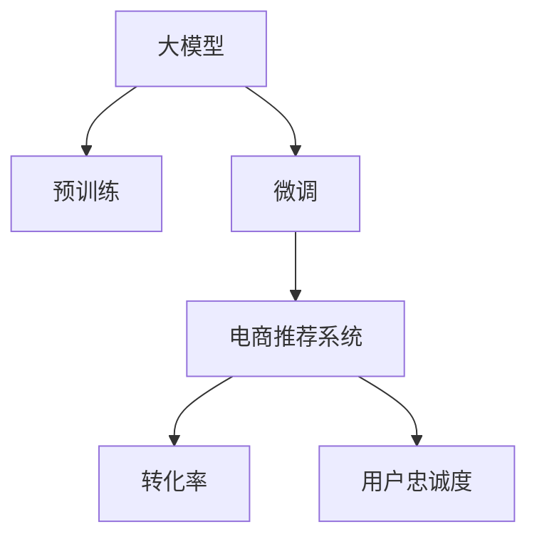

                 

## 1. 背景介绍

### 1.1 电商搜索推荐面临的挑战

在数字化零售时代，电商平台的流量竞争日趋激烈，如何提升搜索推荐的精准度、效率和用户体验，成为电商企业生存与发展的核心竞争力。传统的基于关键词匹配的推荐系统虽然可以快速响应查询，但缺乏对用户意图和行为的理解，往往导致推荐结果与用户实际需求不符，降低了转化率和用户满意度。

此外，随着消费者需求的个性化和复杂化，电商推荐系统需要具备动态调整推荐策略的能力，以便适应不同用户在不同场景下的变化需求。然而，由于数据的异构性和复杂性，实现这种动态适应的过程面临诸多挑战，如数据采集成本高、训练复杂度高、模型鲁棒性差等。

### 1.2 大模型在电商推荐中的作用

近年来，基于大模型的自然语言处理技术在电商搜索推荐中得到广泛应用。大模型如BERT、GPT等，具备强大的语言理解和生成能力，能够从大量无标签文本中学习丰富的语义信息，通过在电商领域进行微调，具备高度的领域适应性和鲁棒性。

电商搜索推荐系统通过融合大模型和推荐算法，可以有效提升推荐结果的相关性和多样性，满足用户的多样化需求。同时，大模型的自监督学习过程，无需标注数据，大大降低了推荐系统对标注样本的依赖，减少了推荐成本。此外，大模型还具有较强的泛化能力，能够自动学习用户行为背后的语义信息，提升推荐系统的长期效果。

## 2. 核心概念与联系

### 2.1 核心概念概述

为了更好地理解大模型在电商搜索推荐中的应用，本节将介绍几个密切相关的核心概念：

- 大模型(Large Language Model, LLM)：以自回归(如GPT)或自编码(如BERT)模型为代表的大规模预训练语言模型。通过在大规模无标签文本语料上进行预训练，学习通用的语言表示，具备强大的语言理解和生成能力。

- 预训练(Pre-training)：指在大规模无标签文本语料上，通过自监督学习任务训练通用语言模型的过程。常见的预训练任务包括言语建模、遮挡语言模型等。预训练使得模型学习到语言的通用表示。

- 微调(Fine-tuning)：指在预训练模型的基础上，使用下游任务的少量标注数据，通过有监督学习优化模型在该任务上的性能。通常只需要调整顶层分类器或解码器，并以较小的学习率更新全部或部分的模型参数。

- 推荐系统(Recommendation System)：根据用户的历史行为和兴趣，推荐其可能感兴趣的商品或内容。推荐系统是电商搜索推荐的主要技术手段。

- 转化率(Conversion Rate)：指用户在看到推荐结果后，完成购买或点击的概率。是电商搜索推荐系统的重要评价指标。

- 用户忠诚度(Customer Loyalty)：指用户对电商平台的长期依赖和品牌认同。长期忠诚的用户能够带来更多的复购和口碑传播。

这些核心概念之间的逻辑关系可以通过以下Mermaid流程图来展示：



这个流程图展示了大模型在电商推荐中的核心概念及其之间的关系：

1. 大模型通过预训练获得基础能力。
2. 微调是对预训练模型进行任务特定的优化，设计电商推荐系统以提升转化率和用户忠诚度。
3. 推荐系统利用微调后的模型，为用户提供个性化推荐。
4. 电商推荐系统通过提升转化率和用户忠诚度，提高用户满意度和平台收益。

## 3. 核心算法原理 & 具体操作步骤

### 3.1 算法原理概述

基于大模型的电商搜索推荐系统，本质上是一个有监督的推荐优化过程。其核心思想是：利用大模型对用户搜索查询和行为数据进行语义理解，生成推荐结果并根据用户的反馈进行动态调整，提升推荐系统的效果。

形式化地，假设电商推荐系统接收到的用户查询为 $Q$，历史行为数据为 $H$，模型通过预训练得到的基础表示为 $E$，推荐结果为 $R$。推荐系统的目标是最小化用户对推荐结果的满意度差：

$$
\min_{Q,H,E,R} \mathcal{L}(Q,H,E,R)
$$

其中 $\mathcal{L}$ 为损失函数，衡量推荐结果与用户满意度之间的差异。通过反向传播算法更新模型参数，优化推荐结果，使得模型输出与用户满意度一致。

### 3.2 算法步骤详解

基于大模型的电商搜索推荐一般包括以下几个关键步骤：

**Step 1: 准备预训练模型和数据集**
- 选择合适的预训练语言模型 $E_{\theta}$ 作为初始化参数，如 BERT、GPT等。
- 准备电商领域的数据集 $D=\{(Q_i,H_i,R_i)\}_{i=1}^N$，其中 $Q_i$ 为查询，$H_i$ 为用户历史行为数据，$R_i$ 为用户实际点击或购买的行为标签。

**Step 2: 添加任务适配层**
- 根据电商推荐任务设计合适的输出层和损失函数。
- 对于点击率预测任务，通常使用二分类交叉熵损失函数。
- 对于生成式推荐任务，通常使用负对数似然损失函数。

**Step 3: 设置微调超参数**
- 选择合适的优化算法及其参数，如 Adam、SGD 等，设置学习率、批大小、迭代轮数等。
- 设置正则化技术及强度，包括权重衰减、Dropout、Early Stopping等。
- 确定冻结预训练参数的策略，如仅微调顶层，或全部参数都参与微调。

**Step 4: 执行梯度训练**
- 将训练集数据分批次输入模型，前向传播计算损失函数。
- 反向传播计算参数梯度，根据设定的优化算法和学习率更新模型参数。
- 周期性在验证集上评估模型性能，根据性能指标决定是否触发 Early Stopping。
- 重复上述步骤直到满足预设的迭代轮数或 Early Stopping 条件。

**Step 5: 测试和部署**
- 在测试集上评估微调后模型 $E_{\hat{\theta}}$ 的性能，对比微调前后的效果。
- 使用微调后的模型对新用户查询进行推荐，集成到实际的应用系统中。
- 持续收集新的用户数据，定期重新微调模型，以适应数据分布的变化。

以上是基于大模型的电商搜索推荐的一般流程。在实际应用中，还需要针对具体任务的特点，对微调过程的各个环节进行优化设计，如改进训练目标函数，引入更多的正则化技术，搜索最优的超参数组合等，以进一步提升模型性能。

### 3.3 算法优缺点

基于大模型的电商搜索推荐方法具有以下优点：
1. 通用性强。大模型具备较强的泛化能力，适用于多种电商场景和推荐任务。
2. 精度高。通过微调后的模型，能够精确理解用户查询和行为的语义信息，生成高度相关的推荐结果。
3. 动态调整。大模型可以根据用户反馈实时调整推荐策略，提升推荐系统的效果。
4. 鲁棒性好。大模型的自监督预训练过程，可以减少对标注样本的依赖，提高推荐系统的鲁棒性。
5. 成本低。大模型微调过程无需大量标注数据，降低了推荐系统的开发和维护成本。

同时，该方法也存在一定的局限性：
1. 对标注数据依赖。虽然大模型微调对标注样本的需求较低，但对于复杂推荐任务，仍然需要较多的标注数据进行微调。
2. 可解释性不足。大模型通常作为一个"黑盒"系统，缺乏可解释性，难以对推荐结果进行解释。
3. 模型复杂度高。大模型的参数量较大，在计算资源有限的情况下，可能无法进行实时推荐。
4. 效果依赖数据质量。推荐结果的质量很大程度上依赖于输入数据的质量，如用户行为数据的不完整性、噪声等。

尽管存在这些局限性，但就目前而言，基于大模型的电商推荐方法仍是最为主流的范式。未来相关研究的重点在于如何进一步降低微调对标注数据的依赖，提高模型的可解释性和鲁棒性，以及如何高效集成大模型到推荐系统中。

### 3.4 算法应用领域

基于大模型的电商搜索推荐方法，在电商领域已经得到了广泛的应用，覆盖了几乎所有常见任务，例如：

- 商品搜索推荐：根据用户输入的查询词，推荐相关商品。利用大模型的语义理解能力，提升搜索的相关性和个性化。
- 个性化推荐：根据用户的历史行为数据，推荐用户可能感兴趣的商品。通过微调后的模型，生成更加符合用户兴趣的推荐结果。
- 用户行为分析：分析用户的行为模式，发现用户的购买偏好、消费习惯等，进行更精准的推荐。
- 搜索意图识别：理解用户的搜索意图，提高搜索推荐的相关性，提升用户满意度。
- 营销活动评估：评估营销活动的转化率和效果，帮助商家优化广告投放策略。

除了上述这些经典任务外，大模型在电商搜索推荐中也用于更多场景中，如推荐策略生成、用户画像建立、需求预测等，为电商推荐系统带来了新的突破。随着大模型和推荐技术的不断发展，相信电商推荐系统将会在更广阔的应用领域发挥重要作用。

## 4. 数学模型和公式 & 详细讲解 & 举例说明

### 4.1 数学模型构建

本节将使用数学语言对基于大模型的电商搜索推荐过程进行更加严格的刻画。

假设电商推荐系统接收到的用户查询为 $Q=\{w_1,w_2,...,w_m\}$，历史行为数据为 $H=\{h_1,h_2,...,h_n\}$。定义大模型 $E_{\theta}$ 在查询 $Q$ 和行为数据 $H$ 上的表示为 $z(Q,H)=E_{\theta}(Q,H)$。假设推荐结果 $R$ 的标签为 $y_i \in \{0,1\}$，表示用户是否点击或购买。

推荐系统的目标是最小化损失函数 $\mathcal{L}$：

$$
\mathcal{L}(Q,H,E_{\theta},R)=\frac{1}{N} \sum_{i=1}^N \ell(Q_i,H_i,z(Q_i,H_i),R_i)
$$

其中 $\ell(Q,H,z(Q,H),y)$ 为损失函数，可以采用二分类交叉熵或负对数似然等。

### 4.2 公式推导过程

以下我们以点击率预测任务为例，推导二分类交叉熵损失函数及其梯度的计算公式。

假设大模型 $E_{\theta}$ 在查询 $Q$ 和行为数据 $H$ 上的表示为 $z(Q,H)$，推荐结果为 $R$。则二分类交叉熵损失函数定义为：

$$
\ell(Q,H,z(Q,H),y)=-[y\log \hat{y} + (1-y)\log (1-\hat{y})]
$$

将其代入经验风险公式，得：

$$
\mathcal{L}(Q,H,E_{\theta},R)= -\frac{1}{N}\sum_{i=1}^N [y_i\log \hat{y_i} + (1-y_i)\log(1-\hat{y_i})]
$$

其中 $\hat{y_i}=\sigma(z(Q_i,H_i))$，$\sigma$ 为 sigmoid 函数。

根据链式法则，损失函数对模型参数 $\theta$ 的梯度为：

$$
\frac{\partial \mathcal{L}(Q,H,E_{\theta},R)}{\partial \theta_k} = -\frac{1}{N}\sum_{i=1}^N \frac{y_i(1-\hat{y_i})-\hat{y_i}}{\hat{y_i}(1-\hat{y_i})}\frac{\partial z(Q_i,H_i)}{\partial \theta_k}
$$

其中 $\frac{\partial z(Q_i,H_i)}{\partial \theta_k}$ 可进一步递归展开，利用自动微分技术完成计算。

在得到损失函数的梯度后，即可带入参数更新公式，完成模型的迭代优化。重复上述过程直至收敛，最终得到适应电商推荐任务的最优模型参数 $\theta^*$。

## 5. 项目实践：代码实例和详细解释说明

### 5.1 开发环境搭建

在进行电商推荐实践前，我们需要准备好开发环境。以下是使用Python进行PyTorch开发的环境配置流程：

1. 安装Anaconda：从官网下载并安装Anaconda，用于创建独立的Python环境。

2. 创建并激活虚拟环境：
```bash
conda create -n e-commerce-env python=3.8 
conda activate e-commerce-env
```

3. 安装PyTorch：根据CUDA版本，从官网获取对应的安装命令。例如：
```bash
conda install pytorch torchvision torchaudio cudatoolkit=11.1 -c pytorch -c conda-forge
```

4. 安装相关库：
```bash
pip install numpy pandas scikit-learn torch transformers tqdm jupyter notebook ipython
```

完成上述步骤后，即可在`e-commerce-env`环境中开始电商推荐实践。

### 5.2 源代码详细实现

这里我们以点击率预测任务为例，给出使用Transformers库对BERT模型进行电商推荐微调的PyTorch代码实现。

首先，定义点击率预测任务的训练函数：

```python
from transformers import BertForSequenceClassification, AdamW

class ClickRatePredictionModel(BertForSequenceClassification):
    def __init__(self, num_labels=2):
        super(ClickRatePredictionModel, self).__init__(num_labels=num_labels)

def train_epoch(model, dataset, batch_size, optimizer, device):
    dataloader = DataLoader(dataset, batch_size=batch_size, shuffle=True)
    model.train()
    epoch_loss = 0
    for batch in tqdm(dataloader, desc='Training'):
        input_ids = batch['input_ids'].to(device)
        attention_mask = batch['attention_mask'].to(device)
        labels = batch['labels'].to(device)
        model.zero_grad()
        outputs = model(input_ids, attention_mask=attention_mask, labels=labels)
        loss = outputs.loss
        epoch_loss += loss.item()
        loss.backward()
        optimizer.step()
    return epoch_loss / len(dataloader)

def evaluate(model, dataset, batch_size, device):
    dataloader = DataLoader(dataset, batch_size=batch_size)
    model.eval()
    preds, labels = [], []
    with torch.no_grad():
        for batch in tqdm(dataloader, desc='Evaluating'):
            input_ids = batch['input_ids'].to(device)
            attention_mask = batch['attention_mask'].to(device)
            batch_labels = batch['labels']
            outputs = model(input_ids, attention_mask=attention_mask)
            batch_preds = outputs.logits.argmax(dim=2).to('cpu').tolist()
            batch_labels = batch_labels.to('cpu').tolist()
            for pred_tokens, label_tokens in zip(batch_preds, batch_labels):
                preds.append(pred_tokens[:len(label_tokens)])
                labels.append(label_tokens)
                
    print(classification_report(labels, preds))
```

然后，定义训练和评估函数：

```python
from sklearn.metrics import classification_report

tokenizer = BertTokenizer.from_pretrained('bert-base-cased')

def load_dataset():
    train_dataset = ...
    dev_dataset = ...
    test_dataset = ...
    return train_dataset, dev_dataset, test_dataset

def save_model(model, save_dir):
    model.save_pretrained(save_dir)

def main():
    epochs = 5
    batch_size = 16
    device = torch.device('cuda') if torch.cuda.is_available() else torch.device('cpu')

    train_dataset, dev_dataset, test_dataset = load_dataset()

    model = ClickRatePredictionModel()
    optimizer = AdamW(model.parameters(), lr=2e-5)

    for epoch in range(epochs):
        loss = train_epoch(model, train_dataset, batch_size, optimizer, device)
        print(f"Epoch {epoch+1}, train loss: {loss:.3f}")
        
        print(f"Epoch {epoch+1}, dev results:")
        evaluate(model, dev_dataset, batch_size, device)
        
    print("Test results:")
    evaluate(model, test_dataset, batch_size, device)
    
    save_model(model, 'save_dir')
```

### 5.3 代码解读与分析

让我们再详细解读一下关键代码的实现细节：

**ClickRatePredictionModel类**：
- 继承自BertForSequenceClassification，用于构建点击率预测模型。
- 重写 `__init__` 方法，设置输出层的数量。

**train_epoch函数**：
- 使用PyTorch的DataLoader对数据集进行批次化加载，供模型训练使用。
- 在每个批次上前向传播计算loss并反向传播更新模型参数，最后返回该epoch的平均loss。

**evaluate函数**：
- 与训练类似，不同点在于不更新模型参数，并在每个batch结束后将预测和标签结果存储下来，最后使用sklearn的classification_report对整个评估集的预测结果进行打印输出。

**load_dataset函数**：
- 定义了训练集、验证集和测试集的加载函数，加载各集的数据集。

**save_model函数**：
- 定义模型保存函数，保存模型参数到指定目录。

**main函数**：
- 启动训练流程，并在测试集上评估。
- 训练完成后，保存模型到指定目录。

可以看到，PyTorch配合Transformers库使得BERT微调的代码实现变得简洁高效。开发者可以将更多精力放在数据处理、模型改进等高层逻辑上，而不必过多关注底层的实现细节。

当然，工业级的系统实现还需考虑更多因素，如模型的保存和部署、超参数的自动搜索、更灵活的任务适配层等。但核心的微调范式基本与此类似。

## 6. 实际应用场景

### 6.1 智能客服系统

基于大模型微调的电商推荐技术，可以广泛应用于智能客服系统的构建。传统客服往往需要配备大量人力，高峰期响应缓慢，且一致性和专业性难以保证。而使用微调后的推荐模型，可以7x24小时不间断服务，快速响应客户咨询，用个性化的推荐结果满足用户需求。

在技术实现上，可以收集企业内部的历史点击数据，将点击行为和商品信息作为监督数据，在此基础上对预训练推荐模型进行微调。微调后的推荐模型能够自动理解用户点击行为，推荐最相关的商品。对于客户提出的新问题，还可以接入检索系统实时搜索相关内容，动态组织生成推荐结果。如此构建的智能客服系统，能大幅提升客户咨询体验和问题解决效率。

### 6.2 个性化推荐系统

当前的推荐系统往往只依赖用户的历史行为数据进行物品推荐，无法深入理解用户的真实兴趣偏好。基于大模型微调技术，个性化推荐系统可以更好地挖掘用户行为背后的语义信息，从而提供更精准、多样的推荐内容。

在实践中，可以收集用户浏览、点击、评论、分享等行为数据，提取和用户交互的物品标题、描述、标签等文本内容。将文本内容作为模型输入，用户的后续行为（如是否点击、购买等）作为监督信号，在此基础上微调预训练语言模型。微调后的模型能够从文本内容中准确把握用户的兴趣点。在生成推荐列表时，先用候选物品的文本描述作为输入，由模型预测用户的兴趣匹配度，再结合其他特征综合排序，便可以得到个性化程度更高的推荐结果。

### 6.3 用户行为分析

大模型在电商推荐中的另一个重要应用是用户行为分析。通过分析用户的行为模式，电商推荐系统能够发现用户的购买偏好、消费习惯等，进行更精准的推荐。例如，可以利用大模型对用户的历史点击数据进行语义理解，分析用户的偏好兴趣，生成相应的推荐策略。这种基于用户行为分析的推荐策略，能够更有效地提升用户满意度和平台收益。

### 6.4 未来应用展望

随着大模型和推荐技术的不断发展，基于大模型的电商推荐系统将会在更广阔的应用领域大放异彩。

在智慧零售领域，大模型推荐技术能够优化商品布局、提高商品陈列效率，提升线下零售体验。同时，还能实现线上线下一体化的个性化推荐，为消费者提供无缝的购物体验。

在金融领域，大模型推荐技术可以用于金融产品推荐、风险评估、理财建议等场景，帮助金融机构提升客户体验和服务水平。

在媒体领域，大模型推荐技术可以用于内容推荐、广告投放、用户画像等环节，帮助媒体平台提高内容分发效率和用户粘性。

此外，在医疗、教育、旅游等众多领域，基于大模型的推荐技术也将不断涌现，为各行各业带来新的变革和机遇。

## 7. 工具和资源推荐

### 7.1 学习资源推荐

为了帮助开发者系统掌握大模型在电商推荐中的应用，这里推荐一些优质的学习资源：

1. 《Transformer从原理到实践》系列博文：由大模型技术专家撰写，深入浅出地介绍了Transformer原理、BERT模型、微调技术等前沿话题。

2. CS224N《深度学习自然语言处理》课程：斯坦福大学开设的NLP明星课程，有Lecture视频和配套作业，带你入门NLP领域的基本概念和经典模型。

3. 《Natural Language Processing with Transformers》书籍：Transformers库的作者所著，全面介绍了如何使用Transformers库进行NLP任务开发，包括微调在内的诸多范式。

4. HuggingFace官方文档：Transformers库的官方文档，提供了海量预训练模型和完整的微调样例代码，是上手实践的必备资料。

5. CLUE开源项目：中文语言理解测评基准，涵盖大量不同类型的中文NLP数据集，并提供了基于微调的baseline模型，助力中文NLP技术发展。

通过对这些资源的学习实践，相信你一定能够快速掌握大模型在电商推荐中的应用，并用于解决实际的电商推荐问题。

### 7.2 开发工具推荐

高效的开发离不开优秀的工具支持。以下是几款用于电商推荐开发的常用工具：

1. PyTorch：基于Python的开源深度学习框架，灵活动态的计算图，适合快速迭代研究。大部分预训练语言模型都有PyTorch版本的实现。

2. TensorFlow：由Google主导开发的开源深度学习框架，生产部署方便，适合大规模工程应用。同样有丰富的预训练语言模型资源。

3. Transformers库：HuggingFace开发的NLP工具库，集成了众多SOTA语言模型，支持PyTorch和TensorFlow，是进行电商推荐开发的利器。

4. Weights & Biases：模型训练的实验跟踪工具，可以记录和可视化模型训练过程中的各项指标，方便对比和调优。与主流深度学习框架无缝集成。

5. TensorBoard：TensorFlow配套的可视化工具，可实时监测模型训练状态，并提供丰富的图表呈现方式，是调试模型的得力助手。

6. Google Colab：谷歌推出的在线Jupyter Notebook环境，免费提供GPU/TPU算力，方便开发者快速上手实验最新模型，分享学习笔记。

合理利用这些工具，可以显著提升电商推荐任务的开发效率，加快创新迭代的步伐。

### 7.3 相关论文推荐

大模型和电商推荐技术的发展源于学界的持续研究。以下是几篇奠基性的相关论文，推荐阅读：

1. Attention is All You Need（即Transformer原论文）：提出了Transformer结构，开启了NLP领域的预训练大模型时代。

2. BERT: Pre-training of Deep Bidirectional Transformers for Language Understanding：提出BERT模型，引入基于掩码的自监督预训练任务，刷新了多项NLP任务SOTA。

3. Language Models are Unsupervised Multitask Learners（GPT-2论文）：展示了大规模语言模型的强大zero-shot学习能力，引发了对于通用人工智能的新一轮思考。

4. Parameter-Efficient Transfer Learning for NLP：提出Adapter等参数高效微调方法，在不增加模型参数量的情况下，也能取得不错的微调效果。

5. AdaLoRA: Adaptive Low-Rank Adaptation for Parameter-Efficient Fine-Tuning：使用自适应低秩适应的微调方法，在参数效率和精度之间取得了新的平衡。

6. Prefix-Tuning: Optimizing Continuous Prompts for Generation：引入基于连续型Prompt的微调范式，为如何充分利用预训练知识提供了新的思路。

这些论文代表了大模型和电商推荐技术的发展脉络。通过学习这些前沿成果，可以帮助研究者把握学科前进方向，激发更多的创新灵感。

## 8. 总结：未来发展趋势与挑战

### 8.1 总结

本文对基于大模型的电商搜索推荐方法进行了全面系统的介绍。首先阐述了大模型和电商推荐技术的背景和意义，明确了电商推荐系统的目标和挑战。其次，从原理到实践，详细讲解了电商推荐模型的数学模型和算法流程，给出了微调任务开发的完整代码实例。同时，本文还广泛探讨了电商推荐系统在智能客服、个性化推荐、用户行为分析等多个场景中的应用前景，展示了微调范式的巨大潜力。此外，本文精选了微调技术的各类学习资源，力求为读者提供全方位的技术指引。

通过本文的系统梳理，可以看到，基于大模型的电商搜索推荐方法正在成为电商推荐的重要范式，极大地拓展了电商推荐系统的应用边界，催生了更多的落地场景。受益于大规模语料的预训练和微调，电商推荐系统能够在更短的时间内，生成更加个性化、精准的推荐结果，提升用户满意度和平台收益。未来，伴随大模型和电商推荐技术的不断进步，电商推荐系统必将在更广阔的应用领域大放异彩，深刻影响人类的生产生活方式。

### 8.2 未来发展趋势

展望未来，电商搜索推荐技术将呈现以下几个发展趋势：

1. 模型规模持续增大。随着算力成本的下降和数据规模的扩张，预训练语言模型的参数量还将持续增长。超大规模语言模型蕴含的丰富语义信息，有望支撑更加复杂多变的电商推荐任务。

2. 微调方法日趋多样。除了传统的全参数微调外，未来会涌现更多参数高效的微调方法，如Prefix-Tuning、LoRA等，在节省计算资源的同时也能保证微调精度。

3. 持续学习成为常态。随着电商数据分布的不断变化，推荐系统需要持续学习新知识以保持性能。如何在不遗忘原有知识的同时，高效吸收新样本信息，将成为重要的研究课题。

4. 标注样本需求降低。受启发于提示学习(Prompt-based Learning)的思路，未来的电商推荐方法将更好地利用大模型的语言理解能力，通过更加巧妙的任务描述，在更少的标注样本上也能实现理想的推荐效果。

5. 推荐结果质量提升。随着大模型和推荐算法的发展，推荐系统的效果将进一步提升，推荐结果的相关性和多样性将得到显著提高。

6. 用户交互优化。推荐系统将更加注重用户交互体验，引入用户反馈机制，动态调整推荐策略，提升用户体验和平台粘性。

以上趋势凸显了大模型和电商推荐技术的广阔前景。这些方向的探索发展，必将进一步提升电商推荐系统的性能和用户体验，为电商行业带来新的增长点。

### 8.3 面临的挑战

尽管大模型在电商推荐中取得了显著成效，但在迈向更加智能化、普适化应用的过程中，它仍面临诸多挑战：

1. 标注成本瓶颈。虽然大模型微调对标注样本的需求较低，但对于复杂推荐任务，仍然需要较多的标注数据进行微调。如何进一步降低微调对标注样本的依赖，将是一大难题。

2. 模型鲁棒性不足。当前电商推荐模型面对域外数据时，泛化性能往往大打折扣。对于测试样本的微小扰动，推荐模型的性能波动较大。如何提高推荐模型的鲁棒性，避免灾难性遗忘，还需要更多理论和实践的积累。

3. 计算资源需求高。尽管大模型的微调过程相较于从头训练已大幅降低计算资源需求，但对于大规模电商场景，仍需高算力支持。如何在有限的计算资源下实现高效推荐，优化资源配置，是未来的重要研究方向。

4. 用户隐私保护。电商推荐系统需要收集和分析用户行为数据，如何在保障用户隐私的前提下，提升推荐效果，需要更多技术手段和安全措施的保障。

5. 推荐结果公平性。电商推荐系统需要保证推荐结果的公平性，避免对特定用户群体的歧视性推荐。如何构建公平、透明的推荐系统，是未来的研究重点。

6. 推荐系统透明性。电商推荐系统作为"黑盒"模型，缺乏可解释性，难以对其决策过程进行解释和调试。如何赋予推荐系统更强的可解释性，确保推荐的透明性和可信度，将是亟待攻克的难题。

7. 推荐内容多样性。当前的电商推荐系统往往侧重于点击率预测，对于推荐内容的多样性关注不足。如何提升推荐内容的多样性，避免推荐结果的同质化，需要更多的创新和探索。

以上挑战凸显了大模型在电商推荐中面临的复杂性和复杂性。这些问题需要通过算法、工程、伦理等多方面的协同努力，才能得到有效的解决。

### 8.4 研究展望

面对电商推荐面临的诸多挑战，未来的研究需要在以下几个方面寻求新的突破：

1. 探索无监督和半监督推荐方法。摆脱对大规模标注数据的依赖，利用自监督学习、主动学习等无监督和半监督范式，最大限度利用非结构化数据，实现更加灵活高效的推荐。

2. 研究参数高效和计算高效的推荐范式。开发更加参数高效的推荐方法，在固定大部分预训练参数的同时，只更新极少量的任务相关参数。同时优化推荐模型的计算图，减少前向传播和反向传播的资源消耗，实现更加轻量级、实时性的部署。

3. 融合因果和对比学习范式。通过引入因果推断和对比学习思想，增强推荐系统建立稳定因果关系的能力，学习更加普适、鲁棒的语言表征，从而提升推荐系统的效果。

4. 引入更多先验知识。将符号化的先验知识，如知识图谱、逻辑规则等，与神经网络模型进行巧妙融合，引导推荐过程学习更准确、合理的语言模型。同时加强不同模态数据的整合，实现视觉、语音等多模态信息与文本信息的协同建模。

5. 结合因果分析和博弈论工具。将因果分析方法引入推荐模型，识别出推荐决策的关键特征，增强推荐结果的因果性和逻辑性。借助博弈论工具刻画人机交互过程，主动探索并规避推荐系统的脆弱点，提高系统稳定性。

6. 纳入伦理道德约束。在推荐目标中引入伦理导向的评估指标，过滤和惩罚有偏见、有害的输出倾向。同时加强人工干预和审核，建立推荐行为的监管机制，确保推荐内容的合法合规。

这些研究方向的探索，必将引领电商推荐技术迈向更高的台阶，为构建安全、可靠、可解释、可控的智能推荐系统铺平道路。面向未来，大模型和电商推荐技术还需要与其他人工智能技术进行更深入的融合，如知识表示、因果推理、强化学习等，多路径协同发力，共同推动推荐系统的进步。只有勇于创新、敢于突破，才能不断拓展电商推荐系统的边界，让智能技术更好地造福人类社会。

## 9. 附录：常见问题与解答

**Q1：大模型在电商推荐中是否适用于所有场景？**

A: 大模型在电商推荐中具有较强的泛化能力，适用于大多数电商场景和推荐任务。但对于一些特定领域（如医疗、法律等），由于领域知识的复杂性，仅依靠通用语料预训练的模型可能难以很好地适应。此时需要在特定领域语料上进一步预训练，再进行微调，才能获得理想效果。

**Q2：微调过程中如何选择合适的学习率？**

A: 微调的学习率一般要比预训练时小1-2个数量级，如果使用过大的学习率，容易破坏预训练权重，导致过拟合。一般建议从1e-5开始调参，逐步减小学习率，直至收敛。也可以使用warmup策略，在开始阶段使用较小的学习率，再逐渐过渡到预设值。需要注意的是，不同的优化器(如Adam、Adafactor等)以及不同的学习率调度策略，可能需要设置不同的学习率阈值。

**Q3：大模型在电商推荐中如何避免过拟合？**

A: 电商推荐系统需要避免对少量标注数据的过拟合，可以采用以下策略：
1. 数据增强：通过回译、近义替换等方式扩充训练集。
2. 正则化：使用L2正则、Dropout、Early Stopping等防止模型过度适应小规模训练集。
3. 对抗训练：加入对抗样本，提高模型鲁棒性。
4. 参数高效微调：只调整少量参数(如Adapter、Prefix等)，减小过拟合风险。
5. 多模型集成：训练多个微调模型，取平均输出，抑制过拟合。

这些策略往往需要根据具体任务和数据特点进行灵活组合。只有在数据、模型、训练、推理等各环节进行全面优化，才能最大限度地发挥大模型微调的威力。

**Q4：大模型在电商推荐中如何提升转化率？**

A: 大模型在电商推荐中可以通过以下策略提升转化率：
1. 语义理解：通过大模型的语义理解能力，更准确地理解用户查询和行为，生成相关性更高的推荐结果。
2. 个性化推荐：利用用户的点击、浏览、评论等行为数据，生成个性化的推荐结果，提高用户的点击和购买概率。
3. 多模态融合：结合图像、语音等多模态数据，提升推荐结果的相关性和多样性。
4. 动态调整：根据用户反馈实时调整推荐策略，提高推荐效果。
5. 用户画像：通过分析用户的行为模式，构建详细的用户画像，生成更加精准的推荐结果。

**Q5：大模型在电商推荐中如何提升用户忠诚度？**

A: 大模型在电商推荐中可以通过以下策略提升用户忠诚度：
1. 用户行为分析：通过分析用户的历史行为数据，发现用户的偏好和需求，生成符合用户兴趣的推荐结果。
2. 推荐多样性：提高推荐结果的多样性，避免推荐内容的重复，增加用户的粘性。
3. 推荐质量：提升推荐结果的质量，避免用户收到无效或不相关的推荐，提高用户满意度。
4. 个性化服务：根据用户的反馈和行为，动态调整推荐策略，提供个性化的推荐服务。
5. 用户体验：优化推荐系统的交互界面，提升用户的购物体验，增加用户的粘性。

这些策略能够帮助电商推荐系统更好地满足用户的需求，提升用户的满意度和忠诚度。

通过本文的系统梳理，可以看到，基于大模型的电商搜索推荐方法正在成为电商推荐的重要范式，极大地拓展了电商推荐系统的应用边界，催生了更多的落地场景。受益于大规模语料的预训练和微调，电商推荐系统能够在更短的时间内，生成更加个性化、精准的推荐结果，提升用户满意度和平台收益。未来，伴随大模型和电商推荐技术的不断进步，电商推荐系统必将在更广阔的应用领域大放异彩，深刻影响人类的生产生活方式。

---

作者：禅与计算机程序设计艺术 / Zen and the Art of Computer Programming

